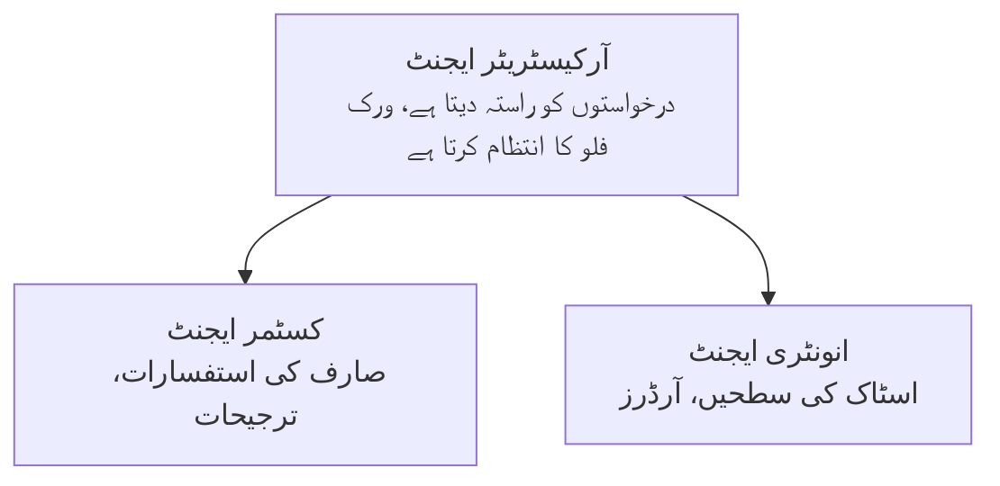

# باب 5: کثیر ایجنٹ AI حل

**📚 کورس**: [ابتدائی افراد کے لیے AZD](../../README.md) | **⏱️ دورانیہ**: 2-3 گھنٹے | **⭐ پیچیدگی**: اعلیٰ درجے کا

---

## جائزہ

یہ باب پیش رفتہ کثیر ایجنٹ آرکیٹیکچر پیٹرنز، ایجنٹ آرکسٹ ریشن، اور پیچیدہ حالات کے لیے پروڈکشن کے قابل AI تعیناتیاں شامل کرتا ہے۔

> مارچ 2026 میں `azd 1.23.12` کے خلاف تصدیق شدہ۔

## تعلیمی مقاصد

اس باب کو مکمل کرنے کے بعد، آپ:
- کثیر ایجنٹ آرکیٹیکچر پیٹرنز کو سمجھیں گے
- مربوط AI ایجنٹ سسٹمز تعینات کریں گے
- ایجنٹ سے ایجنٹ تک مواصلات نافذ کریں گے
- پروڈکشن کے قابل کثیر ایجنٹ حل تیار کریں گے

---

## 📚 اسباق

| # | سبق | وضاحت | وقت |
|---|--------|-------------|------|
| 1 | [ریٹیل کثیر ایجنٹ حل](../../examples/retail-scenario.md) | مکمل نفاذ کا جائزہ | 90 منٹ |
| 2 | [ہم آہنگی کے پیٹرنز](../chapter-06-pre-deployment/coordination-patterns.md) | ایجنٹ آرکسٹ ریشن کی حکمت عملی | 30 منٹ |
| 3 | [ARM ٹیمپلیٹ تعیناتی](../../examples/retail-multiagent-arm-template/README.md) | ون کلک تعیناتی | 30 منٹ |

---

## 🚀 جلد آغاز

```bash
# آپشن 1: ٹیمپلیٹ سے تعینات کریں
azd init --template agent-openai-python-prompty
azd up

# آپشن 2: ایجنٹ مینی فیسٹ سے تعینات کریں (azure.ai.agents ایکسٹینشن درکار ہے)
azd extension install azure.ai.agents
azd ai agent init -m agent-manifest.yaml
azd up
```

> **کون سا طریقہ؟** کام کرنے والے نمونے سے شروع کرنے کے لیے `azd init --template` استعمال کریں۔ جب آپ کے پاس اپنا ایجنٹ مینیفیسٹ ہو تو `azd ai agent init` استعمال کریں۔ مکمل تفصیلات کے لیے [AZD AI CLI حوالہ](../chapter-08-production/production-ai-practices.md#azd-ai-cli-commands-and-extensions) دیکھیں۔

---

## 🤖 کثیر ایجنٹ آرکیٹیکچر


---

## 🎯 منتخب شدہ حل: ریٹیل کثیر ایجنٹ

[ریٹیل کثیر ایجنٹ حل](../../examples/retail-scenario.md) یہ دکھاتا ہے:

- **صارف ایجنٹ**: صارف کے تعاملات اور ترجیحات کو سنبھالتا ہے
- **انوینٹری ایجنٹ**: اسٹاک اور آرڈر پروسیسنگ کا انتظام کرتا ہے
- **آرکسٹریٹر**: ایجنٹس کے درمیان ہم آہنگی کرتا ہے
- **مشترکہ میموری**: ایجنٹس کے مابین سیاق و سباق کا انتظام

### استعمال شدہ خدمات

| خدمت | مقصد |
|---------|---------|
| مائیکروسافٹ فاؤنڈری ماڈلز | زبان کی تفہیم |
| Azure AI Search | مصنوعات کا کیٹلاگ |
| Cosmos DB | ایجنٹ کی حالت اور میموری |
| Container Apps | ایجنٹ ہوسٹنگ |
| Application Insights | نگرانی |

---

## 🔗 نیویگیشن

| سمت | باب |
|-----------|---------|
| **پچھلا** | [باب 4: بنیادی ڈھانچہ](../chapter-04-infrastructure/README.md) |
| **اگلا** | [باب 6: پیشگی تعیناتی](../chapter-06-pre-deployment/README.md) |

---

## 📖 متعلقہ وسائل

- [AI ایجنٹس گائیڈ](../chapter-02-ai-development/agents.md)
- [پروڈکشن AI عملیاتی اصول](../chapter-08-production/production-ai-practices.md)
- [AI مسائل کا حل](../chapter-07-troubleshooting/ai-troubleshooting.md)

---

<!-- CO-OP TRANSLATOR DISCLAIMER START -->
**ڈسکلیمیر**:
یہ دستاویز AI ترجمہ سروس [Co-op Translator](https://github.com/Azure/co-op-translator) استعمال کرتے ہوئے ترجمہ کی گئی ہے۔ جبکہ ہم درستگی کے لیے کوشاں ہیں، براہ کرم نوٹ کریں کہ خودکار تراجم میں غلطیاں یا ناقصیاں ہو سکتی ہیں۔ اصل دستاویز اپنی مادری زبان میں مستند ماخذ سمجھی جانی چاہیے۔ اہم معلومات کے لیے پیشہ ورانہ انسانی ترجمہ تجویز کیا جاتا ہے۔ اس ترجمہ کے استعمال سے پیدا ہونے والے کسی بھی غلط فہمی یا غلط تشریح کی ذمہ داری ہم پر عائد نہیں ہوگی۔
<!-- CO-OP TRANSLATOR DISCLAIMER END -->