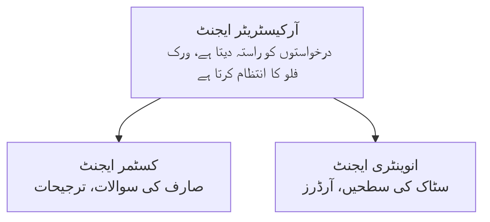

# باب 5: کثیر ایجنٹ AI حل

**📚 کورس**: [نوآموزوں کے لئے AZD](../../README.md) | **⏱️ دورانیہ**: 2-3 گھنٹے | **⭐ پیچیدگی**: اعلیٰ درجے کی

---

## جائزہ

یہ باب جدید کثیر ایجنٹ فن تعمیر کے نمونوں، ایجنٹ ترتیب، اور پیچیدہ منظرناموں کے لئے پروڈکشن کے قابل AI تعینات کے بارے میں ہے۔

> جولائی 2026 میں `azd 1.27.1` کے مطابق تصدیق شدہ۔

## تعلیمی اہداف

اس باب کو مکمل کرنے کے بعد آپ:
- کثیر ایجنٹ فن تعمیر کے نمونوں کو سمجھیں گے
- مربوط AI ایجنٹ نظام تعینات کریں گے
- ایجنٹ سے ایجنٹ بات چیت کو نافذ کریں گے
- پروڈکشن کے قابل کثیر ایجنٹ حل بنائیں گے

---

## 📚 اسباق

| # | سبق | وضاحت | وقت |
|---|--------|-------------|------|
| 1 | [کثیر ایجنٹ کی بنیادی باتیں](multi-agent-basics.md) | عملی: `azd up` کے ساتھ ایک کام کرنے والا کثیر ایجنٹ ایپ تعینات کریں | 45 منٹ |
| 2 | [تہوار کے نمونے](../chapter-06-pre-deployment/coordination-patterns.md) | ایجنٹ ترتیب کی حکمت عملیاں (باب 6 میں جاری ہے) | 30 منٹ |
| 3 | [ARM ٹیمپلیٹ تعیناتی](../../examples/retail-multiagent-arm-template/README.md) | ایک کلک تعیناتی کی مثال | 30 منٹ |

> **سبق 1 سے شروع کریں۔** یہ واحد مکمل طور پر عملی، تعیناتی کے قابل سبق ہے۔ سبق 2 باب 6 میں ہے (یہ پیشگی تعیناتی کی منصوبہ بندی کے ساتھ شیئر کیا گیا ہے)، اور [ریٹیل کثیر ایجنٹ حل](../../examples/retail-scenario.md) ایک فن تعمیر کا خاکہ ہے—ڈیزائن حوالہ، ایک کمانڈ ٹیمپلیٹ نہیں۔

---

## 🚀 فوری آغاز

```bash
# اختیار 1: ٹیمپلیٹ سے تعینات کریں
azd init --template agent-openai-python-prompty
azd up

# اختیار 2: ایک ایجنٹ مینی فیسٹ سے تعینات کریں (azure.ai.agents توسیع کی ضرورت ہے)
azd extension install azure.ai.agents
azd ai agent init -m agent-manifest.yaml
azd up
```

> **کون سا طریقہ؟** `azd init --template` کا استعمال کرتے ہوئے ایک کام کرنے والے نمونے سے شروع کریں۔ جب آپ کے پاس اپنا ایجنٹ مینفیست ہو تو `azd ai agent init` استعمال کریں۔ مکمل تفصیلات کے لیے [AZD AI CLI حوالے](../chapter-08-production/production-ai-practices.md#azd-ai-cli-commands-and-extensions) دیکھیں۔

---

## 🤖 کثیر ایجنٹ فن تعمیر



---

## 🎯 نمایاں حل: ریٹیل کثیر ایجنٹ

[ریٹیل کثیر ایجنٹ حل](../../examples/retail-scenario.md) مندرجہ ذیل کو ظاہر کرتا ہے:

- **کسٹمر ایجنٹ**: صارف کے رابطوں اور ترجیحات کو سنبھالتا ہے
- **انوینٹری ایجنٹ**: اسٹاک اور آرڈر پراسیسنگ کا انتظام کرتا ہے
- **آرکسٹریٹر**: ایجنٹس کے درمیان رابطہ قائم کرتا ہے
- **مشترکہ یادداشت**: ایجنٹس کے درمیان سیاق و سباق کا انتظام

### استعمال شدہ خدمات

| سروس | مقصد |
|---------|---------|
| Microsoft Foundry Models | زبان کی سمجھ بوجھ |
| Azure AI Search | مصنوعات کی فہرست |
| Cosmos DB | ایجنٹ کی حالت اور یادداشت |
| Container Apps | ایجنٹ کی میزبانی |
| Application Insights | نگرانی |

---

## 🔗 نیویگیشن

| سمت | باب |
|-----------|---------|
| **پچھلا** | [باب 4: انفراسٹرکچر](../chapter-04-infrastructure/README.md) |
| **اگلا** | [باب 6: پیشگی تعیناتی](../chapter-06-pre-deployment/README.md) |

---

## 📖 متعلقہ وسائل

- [AI ایجنٹس گائیڈ](../chapter-02-ai-development/agents.md)
- [پروڈکشن AI عملی طریقے](../chapter-08-production/production-ai-practices.md)
- [AI مسائل کا حل](../chapter-07-troubleshooting/ai-troubleshooting.md)

---

<!-- CO-OP TRANSLATOR DISCLAIMER START -->
**ڈس کلیمر**:
یہ دستاویز AI ترجمہ سروس [Co-op Translator](https://github.com/Azure/co-op-translator) کے ذریعے ترجمہ کی گئی ہے۔ جبکہ ہم درستگی کے لیے کوشاں ہیں، براہ کرم اس بات سے آگاہ رہیں کہ خودکار ترجمے میں غلطیاں یا عدم درستیاں ہو سکتی ہیں۔ اصل دستاویز اپنے مادری زبان میں مستند ماخذ سمجھی جائے گی۔ حساس معلومات کے لیے پیشہ ور انسانی ترجمہ کی سفارش کی جاتی ہے۔ اس ترجمے کے استعمال سے پیدا ہونے والی کسی بھی غلط فہمی یا غلط تشریح کی ذمہ داری ہم قبول نہیں کرتے۔
<!-- CO-OP TRANSLATOR DISCLAIMER END -->