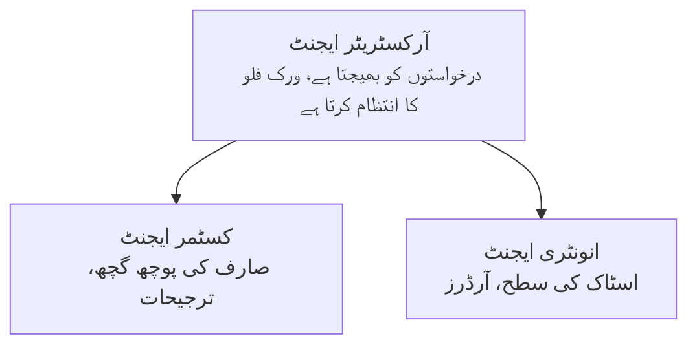

# باب 5: کثیر ایجنٹ AI حل

**📚 کورس**: [AZD For Beginners](../../README.md) | **⏱️ دورانیہ**: 2-3 گھنٹے | **⭐ پیچیدگی**: اعلیٰ

---

## جائزہ

یہ باب جدید کثیر ایجنٹ فنِ تعمیر کے نمونے، ایجنٹ کی ہم آہنگی، اور پیچیدہ منظرناموں کے لیے پیداوار کے لیے تیار AI تعیناتیاں شامل کرتا ہے۔

## سیکھنے کے مقاصد

اس باب کو مکمل کر کے، آپ:
- کثیر ایجنٹ فنِ تعمیر کے نمونے سمجھیں گے
- مربوط AI ایجنٹ سسٹمز کو تعینات کریں گے
- ایجنٹ سے ایجنٹ کو بات چیت نافذ کریں گے
- پیداوار کے لیے تیار کثیر ایجنٹ حل تعمیر کریں گے

---

## 📚 اسباق

| # | سبق | وضاحت | وقت |
|---|--------|-------------|------|
| 1 | [ریٹیل کثیر ایجنٹ حل](../../examples/retail-scenario.md) | مکمل عمل درآمد کی وضاحت | 90 منٹ |
| 2 | [ہم آہنگی کے نمونے](../chapter-06-pre-deployment/coordination-patterns.md) | ایجنٹ ہم آہنگی کی حکمت عملیاں | 30 منٹ |
| 3 | [ARM ٹیمپلیٹ تعیناتی](../../examples/retail-multiagent-arm-template/README.md) | ایک کلک تعیناتی | 30 منٹ |

---

## 🚀 فوری آغاز

```bash
# اختیار 1: ٹیمپلیٹ سے تعینات کریں
azd init --template agent-openai-python-prompty
azd up

# اختیار 2: ایجنٹ مانیفیسٹ سے تعینات کریں (azure.ai.agents توسیع ضروری ہے)
azd extension install azure.ai.agents
azd ai agent init -m agent-manifest.yaml
azd up
```

> **کون سا طریقہ؟** کام کرنے والے نمونے سے شروع کرنے کے لیے `azd init --template` استعمال کریں۔ جب آپ کے پاس اپنا ایجنٹ مینیفیسٹ ہو تو `azd ai agent init` استعمال کریں۔ مکمل تفصیلات کے لیے [AZD AI CLI حوالہ](../chapter-08-production/production-ai-practices.md#azd-ai-cli-commands-and-extensions) دیکھیں۔

---

## 🤖 کثیر ایجنٹ فنِ تعمیر


---

## 🎯 نمایاں حل: ریٹیل کثیر ایجنٹ

[ریٹیل کثیر ایجنٹ حل](../../examples/retail-scenario.md) درج ذیل کا مظاہرہ کرتا ہے:

- **کسٹمر ایجنٹ**: صارف کے تعاملات اور ترجیحات کو سنبھالتا ہے
- **انوینٹری ایجنٹ**: اسٹاک اور آرڈر کی پروسیسنگ کا انتظام کرتا ہے
- **آرکسٹریٹر**: ایجنٹس کے درمیان ہم آہنگی کرتا ہے
- **مشترکہ میموری**: کثیر ایجنٹ سیاق و سباق کا انتظام

### استعمال شدہ سروسز

| سروس | مقصد |
|---------|---------|
| Microsoft Foundry Models | زبان کی سمجھ بوجھ |
| Azure AI Search | مصنوعات کا کیٹلاگ |
| Cosmos DB | ایجنٹ کی حالت اور میموری |
| Container Apps | ایجنٹ کی میزبانی |
| Application Insights | نگرانی |

---

## 🔗 نیوی گیشن

| سمت | باب |
|-----------|---------|
| **پچھلا** | [باب 4: بنیادی ڈھانچہ](../chapter-04-infrastructure/README.md) |
| **اگلا** | [باب 6: قبل از تعیناتی](../chapter-06-pre-deployment/README.md) |

---

## 📖 متعلقہ وسائل

- [AI ایجنٹس گائیڈ](../chapter-02-ai-development/agents.md)
- [پیداوار AI طریقہ کار](../chapter-08-production/production-ai-practices.md)
- [AI مسئلہ حل کرنا](../chapter-07-troubleshooting/ai-troubleshooting.md)

---

<!-- CO-OP TRANSLATOR DISCLAIMER START -->
**خلاصہ زبانی**:
یہ دستاویز مصنوعی ذہانت سے چلنے والی ترجمہ سروس [Co-op Translator](https://github.com/Azure/co-op-translator) کے ذریعے ترجمہ کی گئی ہے۔ اگرچہ ہم درستگی کے لیے کوشاں ہیں، براہ کرم آگاہ رہیں کہ خودکار ترجمے میں غلطیاں یا عدم درستیاں ہو سکتی ہیں۔ اصل دستاویز اپنی مادری زبان میں معتبر ماخذ سمجھی جانی چاہیے۔ اہم معلومات کے لیے، پیشہ ورانہ انسانی ترجمہ تجویز کیا جاتا ہے۔ اس ترجمے کے استعمال سے پیدا ہونے والی کسی بھی غلط فہمی یا غلط تشریح کی ذمہ داری ہم پر عائد نہیں ہوتی۔
<!-- CO-OP TRANSLATOR DISCLAIMER END -->