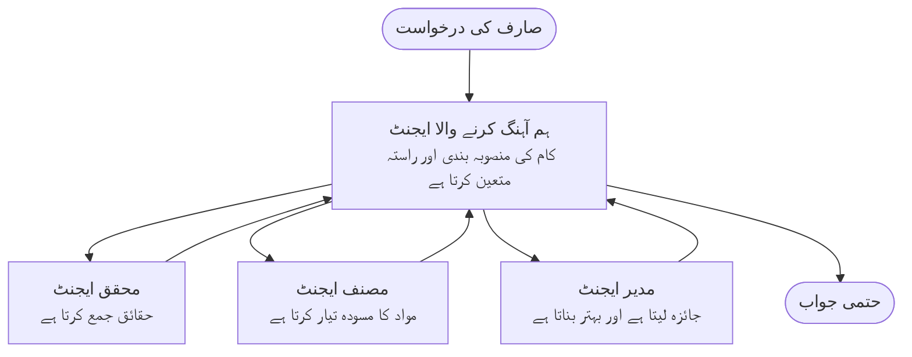

# ملٹی ایجنٹ بنیادیات - اپنا پہلا مربوط AI سسٹم ڈپلائے کریں

**باب نیویگیشن:**
- **📚 کورس ہوم**: [AZD For Beginners](../../README.md)
- **📖 موجودہ باب**: باب 5 - ملٹی ایجنٹ AI حل
- **⬅️ پچھلا**: [باب 4: Infrastructure](../chapter-04-infrastructure/README.md)
- **➡️ اگلا**: [Coordination Patterns](../chapter-06-pre-deployment/coordination-patterns.md)

> `azd 1.25.6` کے ساتھ جون 2026 میں توثیق شدہ۔

## تعارف

پچھلے ابواب میں آپ نے ایک واحد ایپلیکیشن ڈپلائے کی—اور باب 2 میں آپ نے ایک واحد AI ایجنٹ ڈپلائے کیا۔ یہ سبق اگلا قدم اٹھاتا ہے: ایک **ملٹی ایجنٹ سسٹم** ڈپلائے کرنا، جہاں کئی ماہر ایجنٹس مل کر کام کرتے ہیں تاکہ وہ مسئلہ حل کریں جسے کوئی واحد ایجنٹ اکیلے اچھے طریقے سے نہیں کر سکتا۔

نئے آنے والوں کے لیے خوشخبری: **آپ کو نئے کمانڈز کی ضرورت نہیں ہے۔** ایک ملٹی ایجنٹ حل اب بھی azd پروجیکٹ ہے۔ آپ `azd init`, `azd up`، ٹیسٹ، اور `azd down` کریں گے—بالکل ویسا ہی ورک فلو جو آپ پہلے سے جانتے ہیں۔ جو چیز بدلتی ہے وہ ایپ کے اندر کا شکل ہے۔

## سیکھنے کے اہداف

اس سبق کے آخر تک آپ:
- سمجھ سکیں گے کہ "ملٹی ایجنٹ" کا کیا مطلب ہے اور کب اضافی پیچیدگی قابلِ قدر ہوتی ہے
- ملٹی ایجنٹ سسٹم میں عام رولز (اورکسٹریٹر + اسپیشلسٹس) کی شناخت کر سکیں گے
- `azd up` کے ساتھ ایک حقیقی، کام کرنے والا ملٹی ایجنٹ ٹیمپلیٹ ڈپلائے کر سکیں گے
- جان سکیں گے کہ ملٹی ایجنٹ ایپ کون سے Azure وسائل پر مبنی ہے
- حل کی تصدیق، تخصیص، اور محفوظ طریقے سے ختم کرنے کے طریقے جان سکیں گے

## سیکھنے کے نتائج

اس سبق کو مکمل کرنے کے بعد، آپ قابل ہوں گے:
- ایک واحد ایجنٹ اور ایک ملٹی ایجنٹ سسٹم کے درمیان فرق بیان کرنا
- ایک واحد ایجنٹ جس کے پاس ٹولز ہوں اور ایک حقیقی ملٹی ایجنٹ ڈیزائن کے درمیان انتخاب کرنا
- azd کے ساتھ ایک ملٹی ایجنٹ ٹیمپلیٹ کو شروع سے آخر تک ڈپلائے اور ٹیسٹ کرنا
- شناخت کرنا کہ ہر ایجنٹ کہاں چلتا ہے اور وہ کیسے بات چیت کرتے ہیں
- جاری چارجز سے بچنے کے لیے تمام وسائل صاف کرنا

---

## ملٹی ایجنٹ سسٹم کیا ہے؟

ایک واحد AI ایجنٹ ایک ماڈل ہوتا ہے جس کے پاس ہدایات کا ایک سیٹ اور (اختیاری طور پر) کچھ ٹولز ہوتے ہیں۔ یہ مخصوص کاموں کے لیے اچھا کام کرتا ہے۔ لیکن جب کام بڑھتا ہے—تحقیق، پھر لکھائی، پھر تدوین، پھر حقائق کی جانچ—تو سب کچھ ایک ہی پرامپٹ میں بھر دینے سے ایجنٹ سست، کم معتبر، اور ڈیبگ کرنے میں مشکل ہو جاتا ہے۔

ایک **ملٹی ایجنٹ سسٹم** کام کو ماہرین میں تقسیم کرتا ہے جو ہر ایک ایک کام بہتر طریقے سے کرتا ہے، اور ایک اورکسٹریٹر کے ذریعے مربوط کیے جاتے ہیں:



### وہ دو کردار جو آپ ہمیشہ دیکھیں گے

| کردار | کام | مثال |
|------|-----|---------|
| **اورکسٹریٹر** | فیصلہ کرتا ہے *اگلا کیا ہوگا* اور ایجنٹس کے درمیان کام روٹ کرتا ہے | "پہلے تحقیق، پھر لکھائی، پھر تدوین" |
| **ماہِر** | ایک مخصوص کام انجام دیتا ہے اور نتیجہ واپس کرتا ہے | ایک "محقق" جو صرف حقائق جمع کرتا ہے |

### کیا آپ کو واقعی متعدد ایجنٹس کی ضرورت ہے؟

سادہ سے شروع کریں۔ ملٹی ایجنٹ صرف اسی صورت میں اپنائیں جب ان میں سے کوئی ایک سچ ہو:

- ✅ کام میں **مختلف مراحل** ہوں جو مختلف ہدایات سے فائدہ اٹھائیں (تحقیق بمقابلہ لکھائی بمقابلہ جائزہ)
- ✅ آپ چاہتے ہیں کہ ماہرین **متوازی** طور پر چلیں تاکہ وقت بچے
- ✅ مختلف مراحل کو **مختلف ٹولز یا ڈیٹا سورسز** کی ضرورت ہو
- ✅ آپ چاہتے ہیں کہ ہر مرحلے کو **الگ الگ ٹیسٹ اور ڈیبگ** کیا جا سکے

اگر آپ کا کام ایک سادہ سوال و جواب یا ایک آسان ٹول کال ہے، تو **ایک واحد ایجنٹ جس کے پاس ٹولز ہوں** (باب 2) سادہ، سستا، اور آسان آپریٹ کرنے کے لیے بہتر ہے۔

> **نو آموز مشورہ:** "زیادہ ایجنٹس" ضروری طور پر "بہتر" نہیں ہے۔ ہر ایجنٹ تاخیر، لاگت، اور ایک نئی چیز مانیٹر کرنے میں اضافہ کرتا ہے۔ ایجنٹس صرف اسی وقت شامل کریں جب مسئلہ واضح طور پر حصوں میں تقسیم ہو۔

---

## Azure پر ملٹی ایجنٹ بنانے کے دو طریقے

| طریقہ | یہ کیا ہے | بہترین برائے |
|----------|-----------|----------|
| **ایک ایجنٹ + ٹولز** | ایک Foundry ایجنٹ جو فنکشنز/ٹولز کو کال کرتا ہے | سادہ ورک فلو، شروعاتی مرحلے |
| **کئی مربوط ایجنٹس** | کئی ایجنٹس ایک اورکسٹریٹر کے ساتھ | مختلف مراحل، متوازی کام، تخصیص کاری |

یہ سبق دوسرے طریقے پر توجہ دیتا ہے، ایک **پہلے سے تیار ٹیمپلیٹ** استعمال کرتے ہوئے، تاکہ آپ ایک حقیقی ملٹی ایجنٹ سسٹم چلتا ہوا دیکھ سکیں اس سے پہلے کہ آپ اپنا بنائیں۔

---

## عملی کام: ایک کام کرنے والی ملٹی ایجنٹ ایپ ڈپلائے کریں

ہم **Contoso Creative Writer** ڈپلائے کریں گے، ایک آفیشل Azure نمونہ جو متعدد ایجنٹس (محقق، مصنف، ایڈیٹر) استعمال کرتا ہے جو ایک آرٹیکل تیار کرنے کے لیے مربوط ہوتے ہیں۔ یہ پہلا ملٹی ایجنٹ ایپ کے طور پر اچھا ہے کیونکہ کردار سمجھنے میں آسان ہیں۔

### مرحلہ 1: ٹیمپلیٹ انیشیلائز کریں

```bash
# ایک ورکنگ فولڈر بنائیں
mkdir creative-writer && cd creative-writer

# سرکاری کثیر ایجنٹ ٹیمپلیٹ سے آغاز کریں
azd init --template contoso-creative-writer
```

> کسی بھی وقت مزید ملٹی ایجنٹ ٹیمپلیٹس براؤز کریں [Awesome AZD AI gallery](https://azure.github.io/awesome-azd/?tags=ai) میں۔ دیگر نو آموز موافق اختیارات میں `get-started-with-ai-agents` اور `azure-ai-travel-agents` شامل ہیں۔

### مرحلہ 2: مستند کریں

```bash
# azd ورک فلو کے لیے ضروری
azd auth login
```

### مرحلہ 3: ایک ماحول بنائیں

```bash
azd env new dev
```

### مرحلہ 4: پیش نظارہ، پھر ڈپلائے کریں

```bash
# کچھ بھی خرچ کرنے سے پہلے دیکھیں کہ کیا بنایا جائے گا (تجویز شدہ)
azd provision --preview

# انفراسٹرکچر فراہم کریں اور تمام ایجنٹس کو ایک ہی مرحلے میں تعینات کریں
azd up
```

`azd up` آپ سے سبسکرپشن اور ریجن کے لیے پرامپٹ کرے گا، پھر Azure وسائل پروویژن کرے گا اور ایپلیکیشن ڈپلائے کرے گا۔ AI ڈپلائمنٹس ایک سادہ ویب ایپ کے مقابلے میں زیادہ وقت لے سکتے ہیں—اگر آپ بڑے ماڈلز ڈپلائے کر رہے ہیں تو آپ ڈپلائے ٹائم آؤٹ بڑھا سکتے ہیں:

```bash
azd deploy --timeout 1800
```

> **لاگت اور صلاحیت کا نوٹس:** ملٹی ایجنٹ ایپس AI ماڈلز ڈپلائے کرتی ہیں جو کوٹا استعمال کرتے ہیں اور لاگت پیدا کرتے ہیں۔ اگر `azd up` ماڈل کوٹا پر فیل ہو تو ریجن اور کوٹا کے حل کے لیے [AI Troubleshooting](../chapter-07-troubleshooting/ai-troubleshooting.md) دیکھیں، اور باب 6 [Capacity Planning](../chapter-06-pre-deployment/capacity-planning.md) ملاحظہ کریں۔

---

## آپ نے جو ڈپلائے کیا اسے سمجھنا

ایک عام ملٹی ایجنٹ ایپ جیسے یہ، Azure کے ایک سیٹ کو پروویژن کرتی ہے جو براہِ راست اوپر دیا گیا ڈایاگرام میں ذمہ داریوں سے ملتا ہے:

| Resource | Why it's there |
|----------|----------------|
| **Microsoft Foundry / Models** | ہر ایجنٹ کے استعمال کے لیے زبان کے ماڈلز ہوسٹ کرتا ہے |
| **Azure AI Search** | محقق ایجنٹ کو گراؤنڈیڈ ڈیٹا فراہم کرتا ہے تاکہ تلاش کر سکے |
| **Container Apps** (یا App Service) | اورکسٹریٹر اور ایجنٹ کوڈ کی میزبانی کرتا ہے |
| **Cosmos DB** (کچھ نمونوں میں) | وہ مشترکہ اسٹیٹ/میموری اسٹور کرتا ہے جو ایجنٹس کے درمیان منتقل ہوتی ہے |
| **Application Insights** | ایجنٹس کے درمیان درخواستوں کا ٹریس کرتا ہے تاکہ آپ فلو کو ڈیبگ کر سکیں |

### ایجنٹس ایک دوسرے سے کیسے بات کرتے ہیں

زیادہ تر azd ملٹی ایجنٹ نمونوں میں، **اورکسٹریٹر آپ کے ایپلیکیشن کوڈ میں چلتا ہے** (مثال کے طور پر، ایک فریم ورک جیسے Semantic Kernel یا Microsoft Agent Framework استعمال کرتے ہوئے). اورکسٹریٹر ہر ماہر ایجنٹ کو باری باری کال کرتا ہے، نتائج آگے بڑھاتا ہے، اور حتمی جواب جوڑتا ہے۔ ایجنٹس مندرجہ ذیل طریقوں سے سیاق و سباق شیئر کرتے ہیں:

- **فنکشن/ٹول کالز** — اورکسٹریٹر ایک ماہر کو کال کرتا ہے اور نتیجہ واپس پاتا ہے
- **مشترکہ میموری** — ایک ڈیٹا بیس (اکثر Cosmos DB) ایسی اسٹیٹ رکھتا ہے جسے دونوں ایجنٹس پڑھ سکتے ہیں
- **پیغامات/ایونٹس** — ڈھیلے جوڑ کے لیے، ایجنٹس قطار یا Service Bus کے ذریعے رابطہ کرتے ہیں

> **ڈیبگ کرنے کے لیے یہ کیوں اہم ہے:** چونکہ ہر مرحلہ الگ ہے، Application Insights آپ کو دکھاتا ہے کہ کون سا ایجنٹ سست تھا یا ناکام ہوا۔ یہی ایک بڑا سبب ہے کہ کام کو ایجنٹس میں تقسیم کیا جاتا ہے۔

---

## ڈپلائے کی تصدیق کریں

اس بات کی تصدیق کریں کہ سسٹم واقعی کام کر رہا ہے اس سے پہلے کہ آپ آگے بڑہیں:

```bash
# نصب شدہ اینڈ پوائنٹس دکھائیں
azd show

# ایپ کا مانیٹرنگ ڈیش بورڈ کھولیں
azd monitor

# اگر کچھ غلط معلوم ہو تو لاگز کو ٹیل کریں
azd monitor --logs
```

پھر `azd show` سے ایپ URL کھولیں اور ایک ایسی درخواست کریں جو تمام ایجنٹس کو استعمال کرے (Creative Writer کے لیے، اسے کسی موضوع پر ایک مختصر آرٹیکل لکھنے کو کہیں). Application Insights کے **transaction search** میں آپ کو درخواست کو محقق، مصنف، اور ایڈیٹر مراحل کے درمیان پھیلتے ہوئے دیکھنا چاہیے۔

**کامیابی کے معیار:**
- ✅ `azd show` ایک قابل رسائی اینڈپوائنٹ لسٹ کرتا ہے
- ✅ ایک درخواست ایسا نتیجہ پیدا کرتی ہے جو واضح طور پر متعدد مراحل سے گزرا ہو
- ✅ Application Insights ایک سے زیادہ ایجنٹ مرحلے کے ٹریس دکھاتا ہے

---

## تخصیص: ایک ایجنٹ شامل کریں یا ایڈجسٹ کریں

چونکہ ہر ایجنٹ صرف ہدایات اور ٹولز کا مجموعہ ہے، اس لیے تخصیص قابلِ رسائی ہے:

1. **ٹیمپلیٹ میں ایجنٹ کی تعریفیں تلاش کریں** (اکثر `prompts/`, `agents/`, یا `*.prompty` فائلوں کا سیٹ).
2. **ایک ایجنٹ کی ہدایات کو ٹیون کریں** — مثال کے طور پر، ایڈیٹر ایجنٹ کو مخصوص ٹون یا الفاظ کی تعداد نافذ کرنے کو کہیں۔
3. **صرف کوڈ کو دوبارہ ڈپلائے کریں** (انفراسٹرکچر تبدیل نہیں ہوتا):

   ```bash
   azd deploy
   ```

اگر آپ مزید آگے جانا چاہتے ہیں اور اپنے *خود کے* مینیفیسٹ سے ایجنٹس بنانا چاہتے ہیں تو ایجنٹ ایکسٹینشن اور اس کے مکمل لائف سائیکل کا استعمال کریں:

```bash
azd extension install azure.ai.agents
azd ai agent init -m agent-manifest.yaml
azd up
azd ai agent invoke      # ٹیسٹ، جوابی وقت کے ساتھ
```

مکمل ایجنٹ لائف سائیکل (`invoke`, `eval generate`, `optimize`, `delete`) کے لیے [باب 2: Agents](../chapter-02-ai-development/agents.md) اور [AZD AI CLI reference](../chapter-08-production/production-ai-practices.md#azd-ai-cli-commands-and-extensions) دیکھیں۔

---

## صفائی

ملٹی ایجنٹ ایپس متعدد بِل ایبل سروسز چلاتی ہیں۔ جب آپ ختم کر لیں تو سب کچھ بند کر دیں:

```bash
azd down --force --purge
```

`--purge` فلیگ نرم حذف شدہ AI وسائل (جیسے Foundry/Azure AI Services اکاؤنٹس) کو بھی ہٹا دیتا ہے تاکہ وہ مستقبل میں ری ڈپلائے میں رکاوٹ نہ بنیں یا مسلسل لاگت پیدا نہ کریں۔

---

## پروڈکشن ملٹی ایجنٹ سسٹمز کے بارے میں ایک نوٹ

اس ریپو میں موجود [Retail Multi-Agent Solution](../../examples/retail-scenario.md) ایک **آرکیٹیکچر بلیو پرنٹ** ہے، ایک ایک-کمانڈ ٹیمپلیٹ نہیں—یہ دستاویز کرتا ہے کہ ایک پروڈکشن ریٹیل سسٹم *کیسے* بنایا جائے گا (اور واضح طور پر بتاتا ہے کہ مکمل تعمیر ایک خاطر خواہ کوشش ہے). اسے ایک ڈیزائن ریفرنس کے طور پر استعمال کریں *اس کے بعد* جب آپ یہاں ایک کام کرنے والا نمونہ ڈپلائے کر لیں۔ پروڈکشن کے معاملات (مزاحمت، لاگت، مانیٹرنگ، گورننس) کے لیے، [باب 8: Production AI Practices](../chapter-08-production/production-ai-practices.md) جاری رکھیں۔

---

## خلاصہ

- ایک ملٹی ایجنٹ سسٹم کام کو ماہرین میں تقسیم کرتا ہے جو ایک اورکسٹریٹر کے ذریعے مربوط ہوتے ہیں۔
- اسے صرف اسی وقت استعمال کریں جب کام کے واضح مختلف مراحل ہوں، متوازی ہونے کا فائدہ ہو، یا مختلف مراحل کو مختلف ٹولز درکار ہوں—ورنہ ایک واحد ایجنٹ کو ترجیح دیں۔
- azd ورک فلو میں تبدیلی نہیں: `azd init` → `azd up` → ٹیسٹ → `azd down`.
- ایک حقیقی ٹیمپلیٹ جیسے `contoso-creative-writer` آپ کو آج ایک کام کرنے والی ملٹی ایجنٹ ایپ دیکھنے اور تخصیص کرنے کی اجازت دیتا ہے۔
- ایجنٹس کے درمیان Application Insights ٹریسنگ ملٹی ایجنٹ ڈیزائن کے عملی فوائد میں سے ایک بڑا فائدہ ہے۔

---

## 🔗 نیویگیشن

| سمت | سبق |
|-----------|--------|
| **پچھلا** | [باب 4: Infrastructure](../chapter-04-infrastructure/README.md) |
| **اگلا** | [Coordination Patterns](../chapter-06-pre-deployment/coordination-patterns.md) |

## 📖 متعلقہ وسائل

- [AI Agents Guide](../chapter-02-ai-development/agents.md)
- [Coordination Patterns](../chapter-06-pre-deployment/coordination-patterns.md)
- [Production AI Practices](../chapter-08-production/production-ai-practices.md)
- [AI Troubleshooting](../chapter-07-troubleshooting/ai-troubleshooting.md)

---

<!-- CO-OP TRANSLATOR DISCLAIMER START -->
**ڈس کلیمر**:
یہ دستاویز AI ترجمہ سروس [Co-op Translator](https://github.com/Azure/co-op-translator) کے ذریعے ترجمہ کی گئی ہے۔ جبکہ ہم درستگی کے لیے کوشاں ہیں، براہ کرم اس بات سے آگاہ رہیں کہ خودکار ترجمے میں غلطیاں یا عدم درستیاں ہو سکتی ہیں۔ اصل دستاویز اپنے مادری زبان میں مستند ماخذ سمجھی جائے گی۔ حساس معلومات کے لیے پیشہ ور انسانی ترجمہ کی سفارش کی جاتی ہے۔ اس ترجمے کے استعمال سے پیدا ہونے والی کسی بھی غلط فہمی یا غلط تشریح کی ذمہ داری ہم قبول نہیں کرتے۔
<!-- CO-OP TRANSLATOR DISCLAIMER END -->