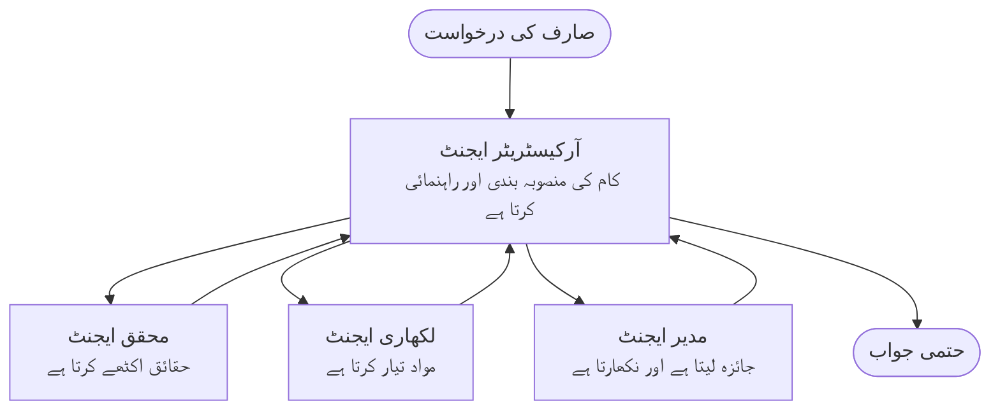

# ملٹی ایجنٹ کی بنیادی باتیں - اپنا پہلا ہم آہنگ AI سسٹم تعینات کریں

**باب کی نیویگیشن:**
- **📚 کورس کا ہوم پیج**: [نان تجربہ کاروں کے لیے AZD](../../README.md)
- **📖 موجودہ باب**: باب 5 - ملٹی ایجنٹ AI حل
- **⬅️ پچھلا**: [باب 4: انفراسٹرکچر](../chapter-04-infrastructure/README.md)
- **➡️ اگلا**: [ہم آہنگی کے نمونے](../chapter-06-pre-deployment/coordination-patterns.md)

> جولائی 2026 میں `azd 1.27.1` کے تحت تصدیق شدہ۔

## تعارف

پچھلے ابواب میں آپ نے ایک واحد ایپلیکیشن تعینات کی—اور باب 2 میں آپ نے ایک AI ایجنٹ تعینات کیا۔ یہ سبق اگلا قدم اٹھاتا ہے: ایک **ملٹی ایجنٹ سسٹم** تعینات کرنا، جہاں کئی ماہر ایجنٹ مل کر ایک ایسا مسئلہ حل کرتے ہیں جسے کوئی واحد ایجنٹ اکیلے بہتر طریقے سے سنبھال نہیں سکتا۔

نون تجربہ کاروں کے لیے اچھی خبر: **آپ کو نئے کمانڈز کی ضرورت نہیں ہے۔** ایک ملٹی ایجنٹ حل اب بھی ایک azd پروجیکٹ ہے۔ آپ `azd init`, `azd up`, جانچ کریں، اور `azd down` کریں—بلکل وہی ورک فلو جو آپ پہلے سے جانتے ہیں۔ جو چیز بدلتی ہے وہ ایپ کے اندر *شکل* ہے۔

## سیکھنے کے مقاصد

اس سبق کے آخر تک، آپ:
- یہ سمجھیں گے کہ "ملٹی ایجنٹ" کیا ہے اور کب اس کی اضافی پیچیدگی قابل قبول ہے
- ملٹی ایجنٹ سسٹم میں عام کرداروں کو پہچانیں گے (آرکیسٹریٹر + ماہرین)
- `azd up` کے ذریعے ایک حقیقی، کام کرنے والا ملٹی ایجنٹ ٹیمپلیٹ تعینات کریں گے
- جانیں گے کہ Azure کے وہ کون سے وسائل ہیں جو ملٹی ایجنٹ ایپ کو سہارا دیتے ہیں
- حل کو محفوظ طریقے سے تصدیق، حسب ضرورت، اور ختم کرنا جانیں گے

## سیکھنے کے نتائج

اس سبق مکمل کرنے کے بعد، آپ قابل ہوں گے:
- ایک واحد ایجنٹ اور ملٹی ایجنٹ سسٹم کے فرق کی وضاحت کریں
- ایک واحد ایجنٹ کے ساتھ ٹولز اور حقیقی ملٹی ایجنٹ ڈیزائن کے درمیان انتخاب کریں
- azd کے ذریعے مکمل طور پر ایک ملٹی ایجنٹ ٹیمپلیٹ تعینات اور جانچ کریں
- شناخت کریں گے کہ ہر ایجنٹ کہاں چلتا ہے اور وہ کس طرح بات چیت کرتے ہیں
- تمام وسائل کو صاف کریں تاکہ جاری چارجز سے بچا جا سکے

---

## ملٹی ایجنٹ سسٹم کیا ہے؟

ایک واحد AI ایجنٹ ایک ماڈل ہوتا ہے جس کے ساتھ ہدایات اور (اختیاری طور پر) کچھ ٹولز ہوتے ہیں۔ یہ فوکسڈ کاموں کے لیے اچھا کام کرتا ہے۔ مگر جب کام بڑھتا ہے—تحقیق، پھر لکھنا، پھر ترمیم، پھر حقائق کی جانچ—سب کچھ ایک پرامپٹ میں ڈالنے سے ایجنٹ سست، کم قابل اعتماد، اور ڈیبگ کرنا مشکل ہو جاتا ہے۔

ایک **ملٹی ایجنٹ سسٹم** کام کو ایسے ماہرین میں تقسیم کرتا ہے جو ہر ایک کام کو بخوبی سرانجام دیتا ہے، جسے ایک آرکیسٹریٹر مربوط کرتا ہے:



### وہ دو کردار جو آپ ہمیشہ دیکھیں گے

| کردار | کام | مثال |
|------|-----|---------|
| **آرکیسٹریٹر** | فیصلہ کرتا ہے *آگے کیا ہوگا* اور کام ایجنٹس کے درمیان روٹ کرتا ہے | "پہلے تحقیق، پھر لکھنا، پھر ترمیم" |
| **ماہر** | ایک مخصوص کام کرتا ہے اور نتیجہ واپس دیتا ہے | ایک "محقق" جو صرف حقائق اکٹھا کرتا ہے |

### کیا آپ کو واقعی متعدد ایجنٹس کی ضرورت ہے؟

سادگی سے شروع کریں۔ صرف اس وقت ملٹی ایجنٹ کے لیے جائیں جب ان میں سے کوئی ایک بات درست ہو:

- ✅ کام کے **مختلف مراحل** ہوں جو مختلف ہدایات سے فائدہ اٹھاتے ہوں (تحقیق بمقابلہ لکھنا بمقابلہ جائزہ)
- ✅ آپ چاہیں کہ ماہرین **متوازی طور پر** چلیں تاکہ وقت کی بچت ہو
- ✅ مختلف مراحل کے لیے **مختلف ٹولز یا ڈیٹا کے ذرائع** چاہئیں
- ✅ آپ کو چاہیے کہ ہر مرحلہ **آزادانہ جانچا اور ڈیبگ کیا جا سکے**

اگر آپ کا کام ایک سادہ سوال و جواب یا آسان ٹول کال ہے، تو **ٹولز کے ساتھ ایک واحد ایجنٹ** (باب 2) زیادہ سادہ، سستا، اور آسان ہے۔

> **نئے سیکھنے والوں کے لیے ٹپ:** "زیادہ ایجنٹس" کا مطلب "بہتر" نہیں ہے۔ ہر ایجنٹ میں تاخیر، لاگت، اور نگرانی کا نیا عنصر شامل ہوتا ہے۔ ایجنٹس صرف اسی وقت شامل کریں جب مسئلہ واضح طور پر حصوں میں تقسیم ہو۔

---

## Azure پر ملٹی ایجنٹ بنانے کے دو طریقے

| طریقہ کار | یہ کیا ہے | بہترین مواقع |
|----------|-----------|----------|
| **واحد ایجنٹ + ٹولز** | ایک Foundry ایجنٹ جو فنکشنز/ٹولز کو کال کرتا ہے | سادہ ورک فلو، شروع کرنے کے لیے |
| **متعدد مربوط ایجنٹس** | کئی ایجنٹس ایک آرکیسٹریٹر کے ساتھ | مختلف مراحل، متوازی کام، ماہر سازی |

یہ سبق دوسرے طریقہ کار پر توجہ دیتا ہے، ایک **تیار شدہ ٹیمپلیٹ** کے ذریعے، تاکہ آپ اپنی ملٹی ایجنٹ سسٹم کو کام کرتے ہوئے دیکھ سکیں۔

---

## عملی: ایک کام کرنے والی ملٹی ایجنٹ ایپ تعینات کریں

ہم تعینات کریں گے **Contoso Creative Writer**، ایک سرکاری Azure نمونہ جو متعدد ایجنٹس (محقق، مصنف، مدیر) کو مربوط کر کے ایک مضمون تیار کرتا ہے۔ یہ پہلا ملٹی ایجنٹ ایپ ہے جو سمجھنا آسان کردار رکھتا ہے۔

### مرحلہ 1: ٹیمپلیٹ کو شروع کریں

```bash
# ایک ورکنگ فولڈر بنائیں
mkdir creative-writer && cd creative-writer

# سرکاری کثیر-ایجنٹ ٹیمپلیٹ سے آغاز کریں
azd init --template contoso-creative-writer
```

> آپ کبھی بھی [Awesome AZD AI گیلری](https://azure.github.io/awesome-azd/?tags=ai) میں مزید ملٹی ایجنٹ ٹیمپلیٹس دیکھ سکتے ہیں۔ دیگر نون تجربہ کار دوست اختیارات میں `get-started-with-ai-agents` اور `azure-ai-travel-agents` شامل ہیں۔

### مرحلہ 2: تصدیق کریں

```bash
# azd ورک فلو کے لیے ضروری ہے
azd auth login
```

### مرحلہ 3: ایک ماحول بنائیں

```bash
azd env new dev
```

### مرحلہ 4: پیش نظارہ کریں، پھر تعینات کریں

```bash
# خرچ کرنے سے پہلے دیکھیں کہ کیا تخلیق کیا جائے گا (تجویز کردہ)
azd provision --preview

# انفراسٹرکچر فراہم کریں اور تمام ایجنٹس کو ایک قدم میں تعینات کریں
azd up
```

`azd up` آپ سے سبسکرپشن اور علاقہ پوچھے گا، پھر Azure وسائل مہیا کرے گا اور ایپلیکیشن کو تعینات کرے گا۔ AI تعیناتیاں ایک سادہ ویب ایپ کی نسبت زیادہ وقت لے سکتی ہیں—اگر آپ بڑے ماڈلز تعینات کر رہے ہیں، تو آپ تعیناتی کی مدت بڑھا سکتے ہیں:

```bash
azd deploy --timeout 1800
```

> **لاگت اور صلاحیت کا خیال رکھیں:** ملٹی ایجنٹ ایپس AI ماڈلز کو تعینات کرتی ہیں جو کوٹا استعمال کرتے ہیں اور لاگت پیدا کرتے ہیں۔ اگر `azd up` ماڈل کوٹے کی وجہ سے ناکام ہو جائے، تو علاقے اور کوٹے کی اصلاح کے لیے [AI مسئلہ حل کرنا](../chapter-07-troubleshooting/ai-troubleshooting.md) دیکھیں، اور باب 6 [صلاحیت کی منصوبہ بندی](../chapter-06-pre-deployment/capacity-planning.md) کا مطالعہ کریں۔

---

## آپ نے جو تعینات کیا اسے سمجھنا

اس طرح کی ایک عام ملٹی ایجنٹ ایپ ایک Azure وسائل کا سیٹ مہیا کرتی ہے جو اوپر دی گئی ذمہ داریوں کے بالکل مطابق ہوتا ہے:

| وسیلہ | یہ کیوں ہے |
|----------|----------------|
| **Microsoft Foundry / ماڈلز** | ہر ایجنٹ کے لیے زبان کے ماڈلز کی میزبانی کرتا ہے |
| **Azure AI سرچ** | محقق ایجنٹ کو زمینی حقائق تلاش کرنے دیتا ہے |
| **کنٹینر ایپس** (یا ایپ سروس) | آرکیسٹریٹر اور ایجنٹ کوڈ کی میزبانی کرتا ہے |
| **کوزموس ڈی بی** (کچھ نمونوں میں) | ایجنٹس کے درمیان مشترکہ حالت/میموری رکھتا ہے |
| **ایپلیکیشن انسائٹس** | ایجنٹس کے *درمیان* درخواستوں کا پتہ لگاتا ہے تاکہ آپ فلو کو ڈیبگ کر سکیں |

### ایجنٹس کیسے ایک دوسرے سے بات کرتے ہیں

زیادہ تر azd ملٹی ایجنٹ نمونوں میں، **آرکیسٹریٹر آپ کے ایپلیکیشن کوڈ میں چلتا ہے** (مثلاً، Semantic Kernel یا Microsoft Agent Framework جیسے فریم ورک کے ذریعے)۔ آرکیسٹریٹر ہر مخصوص ایجنٹ کو باری باری کال کرتا ہے، نتائج پہنچاتا ہے، اور آخری جواب بناتا ہے۔ ایجنٹس مشترکہ سیاق و سباق کو مندرجہ ذیل کے ذریعے شیئر کرتے ہیں:

- **فنکشن/ٹول کالز** — آرکیسٹریٹر ایک ماہر کو کال کرتا ہے اور نتیجہ واپس لیتا ہے
- **مشترکہ میموری** — ایک ڈیٹا بیس (اکثر کوزموس ڈی بی) وہ حالت رکھتا ہے جسے دونوں ایجنٹس پڑھ سکتے ہیں
- **پیغامات/واقعات** — مضبوط جوڑ کے لیے، ایجنٹس ایک قطار یا سروس بس کے ذریعے رابطہ کرتے ہیں

> **ڈیبگنگ کے لیے یہ کیوں اہم ہے:** چونکہ ہر مرحلہ الگ ہے، اس لیے Application Insights آپ کو دکھاتا ہے کہ *کون سا* ایجنٹ سست یا ناکام تھا۔ یہی سب سے بڑی وجہ ہے کہ کام کو ایجنٹس میں تقسیم کیا جاتا ہے۔

---

## تعیناتی کی تصدیق کریں

نظام کو واقعی کام کر رہا ہے اس کی تصدیق کریں اس سے پہلے کہ آگے بڑھیں:

```bash
# متعین کردہ اختتامی نکات دکھائیں
azd show

# ایپ کی نگرانی ڈیش بورڈ کھولیں
azd monitor

# اگر کچھ غلط لگے تو لاگز کو دیکھتے رہیں
azd monitor --logs
```

پھر `azd show` سے ایپ کا URL کھولیں اور ایک ایسی درخواست کریں جو تمام ایجنٹس کو استعمال کرے (Creative Writer کے لیے، اسے کسی موضوع پر ایک مختصر مضمون لکھنے کو کہیں)۔ Application Insights کی **ٹرانزیکشن سرچ** میں آپ کو درخواست کے مختلف مراحل جیسے محقق، مصنف، اور مدیر کے لیے فین آؤٹ دیکھنا چاہیے۔

**کامیابی کے معیار:**
- ✅ `azd show` قابل رسائی اینڈپوائنٹ دکھائے
- ✅ ایک درخواست ایسا نتیجہ پیدا کرے جو واضح طور پر متعدد مراحل سے گزری ہو
- ✅ Application Insights متعدد ایجنٹ مرحلوں کے لیے ٹریس دکھائے

---

## حسب ضرورت: ایجنٹ شامل یا ایڈجسٹ کریں

چونکہ ہر ایجنٹ صرف ہدایات اور ٹولز ہوتے ہیں، لہٰذا حسب ضرورت آسان ہے:

1. **ٹیملیٹ میں ایجنٹ کی تعریفات تلاش کریں** (اکثر `prompts/`, `agents/`, یا `*.prompty` فائلوں کے سیٹ میں)۔
2. **ایجنٹ کی ہدایات کو ایڈجسٹ کریں** — مثلاً، ایڈیٹر ایجنٹ کو خاص لہجہ یا لفظوں کی تعداد پر زور دیں۔
3. **صرف کوڈ کو دوبارہ تعینات کریں** (انفراسٹرکچر بغیر تبدیلی کے):

   ```bash
   azd deploy
   ```

مزید آگے بڑھ کر اپنے *اپنے* مینفسٹ سے ایجنٹس بنانے کے لیے، ایجنٹ ایکسٹینشن استعمال کریں اور اس کا مکمل لائف سائیکل اپنائیں:

```bash
azd extension install azure.ai.agents
azd ai agent init -m agent-manifest.yaml
azd up
azd ai agent invoke      # ٹیسٹ، جواب کے وقت کے ساتھ
```

مکمل ایجنٹ لائف سائیکل (`invoke`, `eval generate`, `optimize`, `delete`) کے لیے [باب 2: ایجنٹس](../chapter-02-ai-development/agents.md) اور [AZD AI CLI ریفرنس](../chapter-08-production/production-ai-practices.md#azd-ai-cli-commands-and-extensions) دیکھیں۔

---

## صفائی کریں

ملٹی ایجنٹ ایپس متعدد بل ایبل سروسز چلاتی ہیں۔ کام ختم ہونے پر سب کچھ ختم کریں:

```bash
azd down --force --purge
```

`--purge` فلیگ سوفٹ ڈیلیٹڈ AI وسائل (جیسے Foundry/Azure AI Services اکاؤنٹس) بھی ہٹا دیتا ہے تاکہ وہ مستقبل کی تعیناتی میں رکاوٹ نہ بنیں یا لاگت میں اضافے کا سبب نہ بنیں۔

---

## پروڈکشن ملٹی ایجنٹ سسٹمز پر ایک نوٹ

اس ریپوزیٹری میں موجود [Retail Multi-Agent Solution](../../examples/retail-scenario.md) ایک **آرکیٹیکچر کا خاکہ** ہے، کوئی ایک کمانڈ ٹیمپلیٹ نہیں—یہ دستاویز کرتا ہے کہ پروڈکشن ریٹیل سسٹم *کیسے* بنایا جائے گا (اور واضح کرتا ہے کہ مکمل تعمیر ایک بڑی کوشش ہے)۔ اسے ایک ڈیزائن ریفرنس کے طور پر استعمال کریں *اس کے بعد* کہ آپ یہاں ایک کام کرنے والا نمونہ تعینات کر چکے ہوں۔ پروڈکشن کے مسائل (مزاحمت، لاگت، نگرانی، گورننس) کے لیے، [باب 8: پروڈکشن AI طریقے](../chapter-08-production/production-ai-practices.md) ملاحظہ کریں۔

---

## خلاصہ

- ایک ملٹی ایجنٹ سسٹم کام کو ماہرین کے درمیان تقسیم کرتا ہے جسے ایک آرکیسٹریٹر مربوط کرتا ہے۔
- اسے صرف اس وقت استعمال کریں جب کام کے واضح مراحل، متوازی کام، یا ہر مرحلے کے لیے مختلف ٹولز ہوں—ورنہ ایک واحد ایجنٹ کو ترجیح دیں۔
- azd ورک فلو تبدیل نہیں ہوتا: `azd init` → `azd up` → جانچ → `azd down`۔
- ایک حقیقی ٹیمپلیٹ جیسے `contoso-creative-writer` آپ کو آج ہی ایک کام کرنے والی ملٹی ایجنٹ ایپ دیکھنے اور حسب ضرورت بنانے دیتا ہے۔
- ایجنٹس کے درمیان Application Insights ٹریسنگ ملٹی ایجنٹ ڈیزائن کے سب سے بڑے عملی فوائد میں سے ایک ہے۔

---

## 🔗 نیویگیشن

| سمت | سبق |
|-----------|--------|
| **پچھلا** | [باب 4: انفراسٹرکچر](../chapter-04-infrastructure/README.md) |
| **اگلا** | [ہم آہنگی کے نمونے](../chapter-06-pre-deployment/coordination-patterns.md) |

## 📖 متعلقہ وسائل

- [AI ایجنٹس گائیڈ](../chapter-02-ai-development/agents.md)
- [ہم آہنگی کے نمونے](../chapter-06-pre-deployment/coordination-patterns.md)
- [پروڈکشن AI طریقے](../chapter-08-production/production-ai-practices.md)
- [AI مسئلہ حل کرنا](../chapter-07-troubleshooting/ai-troubleshooting.md)

---

<!-- CO-OP TRANSLATOR DISCLAIMER START -->
**ڈس کلیمر**:
یہ دستاویز AI ترجمہ سروس [Co-op Translator](https://github.com/Azure/co-op-translator) کے ذریعے ترجمہ کی گئی ہے۔ جبکہ ہم درستگی کے لیے کوشاں ہیں، براہ کرم اس بات سے آگاہ رہیں کہ خودکار ترجمے میں غلطیاں یا عدم درستیاں ہو سکتی ہیں۔ اصل دستاویز اپنے مادری زبان میں مستند ماخذ سمجھی جائے گی۔ حساس معلومات کے لیے پیشہ ور انسانی ترجمہ کی سفارش کی جاتی ہے۔ اس ترجمے کے استعمال سے پیدا ہونے والی کسی بھی غلط فہمی یا غلط تشریح کی ذمہ داری ہم قبول نہیں کرتے۔
<!-- CO-OP TRANSLATOR DISCLAIMER END -->