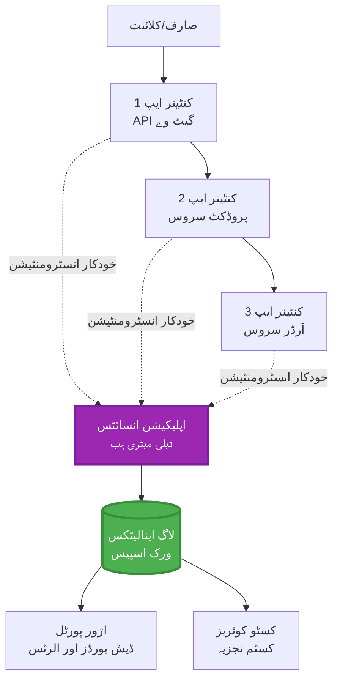
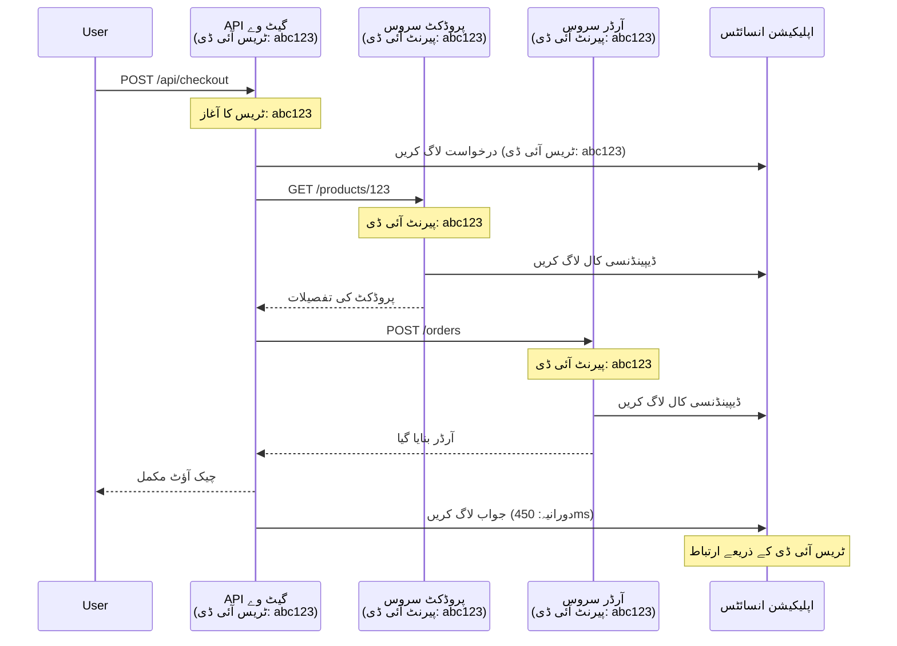

\u202B# Application Insights کا AZD کے ساتھ انضمام

⏱️ **تخمینی وقت**: 40-50 منٹ | 💰 **لاگت کا اثر**: ~$5-15/ماہ | ⭐ **پیچیدگی**: درمیانہ

**📚 سیکھنے کا راستہ:**
- ← پچھلا: [Preflight Checks](preflight-checks.md) - تعیناتی سے پہلے کی جانچ
- 🎯 **آپ یہاں ہیں**: Application Insights انضمام (مانیٹرنگ، ٹیلیمیٹری، ڈیبگنگ)
- → اگلا: [Deployment Guide](../chapter-04-infrastructure/deployment-guide.md) - Azure پر تعینات کریں
- 🏠 [Course Home](../../README.md)

---

## آپ کیا سیکھیں گے

اس سبق کو مکمل کرکے آپ:
- AZD پروجیکٹس میں خودکار طور پر **Application Insights** شامل کریں گے
- مائیکرو سروسز کے لیے **distributed tracing** کو ترتیب دیں گے
- **کسٹم ٹیلیمیٹری** (میٹرکس، ایونٹس، ڈیپنڈنسیز) نافذ کریں گے
- ریئل ٹائم مانیٹرنگ کے لیے **لائیو میٹرکس** سیٹ اپ کریں گے
- AZD ڈپلائمنٹس سے **الرٹس اور ڈیش بورڈز** بنائیں گے
- **ٹیلیمیٹری سوالات** کے ذریعے پروڈکشن مسائل ڈیبگ کریں گے
- **لاگت اور سیمپلنگ** حکمتِ عملیاں بہتر کریں گے
- **AI/LLM ایپلیکیشنز** (ٹوکنز، لیٹنسی، لاگت) کی مانیٹرنگ کریں گے

## کیوں Application Insights اور AZD اہم ہیں

### مسئلہ: پروڈکشن میں مشاہدہ

**Application Insights کے بغیر:**
```
❌ No visibility into production behavior
❌ Manual log aggregation across services
❌ Reactive debugging (wait for customer complaints)
❌ No performance metrics
❌ Cannot trace requests across services
❌ Unknown failure rates and bottlenecks
```

**Application Insights + AZD کے ساتھ:**
```
✅ Automatic telemetry collection
✅ Centralized logs from all services
✅ Proactive issue detection
✅ End-to-end request tracing
✅ Performance metrics and insights
✅ Real-time dashboards
✅ AZD provisions everything automatically
```

**تشبیہ**: Application Insights آپ کی ایپلیکیشن کے لیے ایک "بلیک باکس" فلائٹ ریکارڈر + کاک پٹ ڈیش بورڈ کی طرح ہے۔ آپ ریئل ٹائم میں ہر چیز دیکھ سکتے ہیں اور کسی بھی واقعے کو دوبارہ چلانے کے قابل ہوتے ہیں۔

---

## فن تعمیر کا جائزہ

### AZD فن تعمیر میں Application Insights


### کیا خودکار طور پر مانیٹر ہوتا ہے

| Telemetry Type | What It Captures | Use Case |
|----------------|------------------|----------|
| **Requests** | HTTP درخواستیں، اسٹیٹس کوڈز، دورانیہ | API کارکردگی کی مانیٹرنگ |
| **Dependencies** | بیرونی کالز (DB، APIs، اسٹوریج) | بوتل نیک کی شناخت |
| **Exceptions** | اسٹیک ٹریس کے ساتھ غیر سنبھالی گئی خامیاں | فالٹس کی ڈیبگنگ |
| **Custom Events** | بزنس ایونٹس (سائن اپ، خریداری) | اینالیٹکس اور فنلز |
| **Metrics** | پرفارمنس کاؤنٹرز، کسٹم میٹرکس | کیپیسٹی پلاننگ |
| **Traces** | شدت کے ساتھ لاگ میسجز | ڈیبگنگ اور آڈٹنگ |
| **Availability** | اپ ٹائم اور ریسپانس ٹائم ٹیسٹس | SLA کی مانیٹرنگ |

---

## پیشگی شرائط

### ضروری ٹولز

```bash
# Azure Developer CLI کی تصدیق کریں
azd version
# ✅ متوقع: azd ورژن 1.0.0 یا اس سے اوپر

# Azure CLI کی تصدیق کریں
az --version
# ✅ متوقع: azure-cli ورژن 2.50.0 یا اس سے اوپر
```

### Azure کے تقاضے

- فعال Azure سبسکرپشن
- بنانے کی اجازتیں:
  - Application Insights resources
  - Log Analytics workspaces
  - Container Apps
  - Resource groups

### علمی ضروریات

آپ کو یہ مکمل کرچکا ہونا چاہیے:
- [AZD Basics](../chapter-01-foundation/azd-basics.md) - بنیادی AZD تصورات
- [Configuration](../chapter-03-configuration/configuration.md) - ماحول کی ترتیب
- [First Project](../chapter-01-foundation/first-project.md) - بنیادی تعیناتی

---

## سبق 1: AZD کے ساتھ خودکار Application Insights

### AZD کیسے Application Insights فراہم کرتا ہے

جب آپ تعینات کرتے ہیں تو AZD خودبخود Application Insights بناتا اور کنفیگر کرتا ہے۔ آئیے دیکھتے ہیں یہ کیسے کام کرتا ہے۔

### پروجیکٹ کی ساخت

```
monitored-app/
├── azure.yaml                     # AZD configuration
├── infra/
│   ├── main.bicep                # Main infrastructure
│   ├── core/
│   │   └── monitoring.bicep      # Application Insights + Log Analytics
│   └── app/
│       └── api.bicep             # Container App with monitoring
└── src/
    ├── app.py                    # Application with telemetry
    ├── requirements.txt
    └── Dockerfile
```

---

### قدم 1: AZD کو کنفیگر کریں (azure.yaml)

**File: `azure.yaml`**

```yaml
name: monitored-app
metadata:
  template: monitored-app@1.0.0

services:
  api:
    project: ./src
    language: python
    host: containerapp

# AZD automatically provisions monitoring!
```

**بس اتنا ہی!** AZD بنیادی مانیٹرنگ کے لیے ڈیفالٹ کے طور پر Application Insights بنائے گا۔ اضافی کنفیگریشن کی ضرورت نہیں ہے۔

---

### قدم 2: مانیٹرنگ انفراسٹرکچر (Bicep)

**File: `infra/core/monitoring.bicep`**

```bicep
param logAnalyticsName string
param applicationInsightsName string
param location string = resourceGroup().location
param tags object = {}

// Log Analytics Workspace (required for Application Insights)
resource logAnalytics 'Microsoft.OperationalInsights/workspaces@2022-10-01' = {
  name: logAnalyticsName
  location: location
  tags: tags
  properties: {
    sku: {
      name: 'PerGB2018'  // Pay-as-you-go pricing
    }
    retentionInDays: 30  // Keep logs for 30 days
    features: {
      enableLogAccessUsingOnlyResourcePermissions: true
    }
  }
}

// Application Insights
resource applicationInsights 'Microsoft.Insights/components@2020-02-02' = {
  name: applicationInsightsName
  location: location
  tags: tags
  kind: 'web'
  properties: {
    Application_Type: 'web'
    WorkspaceResourceId: logAnalytics.id
    IngestionMode: 'LogAnalytics'
    publicNetworkAccessForIngestion: 'Enabled'
    publicNetworkAccessForQuery: 'Enabled'
  }
}

// Outputs for Container Apps
output logAnalyticsWorkspaceId string = logAnalytics.id
output logAnalyticsWorkspaceName string = logAnalytics.name
output applicationInsightsConnectionString string = applicationInsights.properties.ConnectionString
output applicationInsightsInstrumentationKey string = applicationInsights.properties.InstrumentationKey
output applicationInsightsName string = applicationInsights.name
```

---

### قدم 3: Container App کو Application Insights سے جوڑیں

**File: `infra/app/api.bicep`**

```bicep
param name string
param location string
param tags object = {}
param containerAppsEnvironmentName string
param applicationInsightsConnectionString string

resource containerApp 'Microsoft.App/containerApps@2023-05-01' = {
  name: name
  location: location
  tags: tags
  properties: {
    configuration: {
      ingress: {
        external: true
        targetPort: 8000
      }
      secrets: [
        {
          name: 'appinsights-connection-string'
          value: applicationInsightsConnectionString
        }
      ]
    }
    template: {
      containers: [
        {
          name: 'api'
          image: 'myregistry.azurecr.io/api:latest'
          resources: {
            cpu: json('0.5')
            memory: '1Gi'
          }
          env: [
            {
              name: 'APPLICATIONINSIGHTS_CONNECTION_STRING'
              secretRef: 'appinsights-connection-string'
            }
            {
              name: 'APPLICATIONINSIGHTS_ENABLED'
              value: 'true'
            }
          ]
        }
      ]
    }
  }
}

output uri string = 'https://${containerApp.properties.configuration.ingress.fqdn}'
```

---

### قدم 4: ٹیلیمیٹری کے ساتھ ایپلیکیشن کوڈ

**File: `src/app.py`**

```python
from flask import Flask, request, jsonify
from opencensus.ext.azure.log_exporter import AzureLogHandler
from opencensus.ext.azure.trace_exporter import AzureExporter
from opencensus.ext.flask.flask_middleware import FlaskMiddleware
from opencensus.trace.samplers import ProbabilitySampler
import logging
import os

app = Flask(__name__)

# Application Insights کنکشن اسٹرنگ حاصل کریں
connection_string = os.environ.get('APPLICATIONINSIGHTS_CONNECTION_STRING')

if connection_string:
    # منتشر شدہ ٹریسنگ کو ترتیب دیں
    middleware = FlaskMiddleware(
        app,
        exporter=AzureExporter(connection_string=connection_string),
        sampler=ProbabilitySampler(rate=1.0)  # ڈویلپمنٹ کے لیے 100% سیمپلنگ
    )
    
    # لاگنگ کو ترتیب دیں
    logger = logging.getLogger(__name__)
    logger.addHandler(AzureLogHandler(connection_string=connection_string))
    logger.setLevel(logging.INFO)
    
    print("✅ Application Insights enabled")
else:
    logger = logging.getLogger(__name__)
    logger.setLevel(logging.INFO)
    print("⚠️ Application Insights not configured")

@app.route('/health')
def health():
    logger.info('Health check endpoint called')
    return jsonify({'status': 'healthy', 'monitoring': 'enabled'})

@app.route('/api/products')
def get_products():
    logger.info('Fetching products')
    
    # ڈیٹا بیس کال کی نقل کریں (خودکار طور پر انحصار کے طور پر ٹریک کی جاتی ہے)
    products = [
        {'id': 1, 'name': 'Laptop', 'price': 999.99},
        {'id': 2, 'name': 'Mouse', 'price': 29.99},
        {'id': 3, 'name': 'Keyboard', 'price': 79.99}
    ]
    
    logger.info(f'Returned {len(products)} products')
    return jsonify(products)

@app.route('/api/error-test')
def error_test():
    """Test error tracking"""
    logger.error('Testing error tracking')
    try:
        raise ValueError('This is a test exception')
    except Exception as e:
        logger.exception('Exception occurred in error-test endpoint')
        return jsonify({'error': str(e)}), 500

@app.route('/api/slow')
def slow_endpoint():
    """Test performance tracking"""
    import time
    logger.info('Slow endpoint called')
    time.sleep(3)  # آہستہ عمل کی نقل کریں
    logger.warning('Endpoint took 3 seconds to respond')
    return jsonify({'message': 'Slow operation completed'})

if __name__ == '__main__':
    app.run(host='0.0.0.0', port=8000)
```

**File: `src/requirements.txt`**

```txt
Flask==3.0.0
opencensus-ext-azure==1.1.13
opencensus-ext-flask==0.8.1
gunicorn==21.2.0
```

---

### قدم 5: ڈپلوئے کریں اور تصدیق کریں

```bash
# AZD کی ابتدائی ترتیب کریں
azd init

# تعینات کریں (Application Insights کو خودکار طور پر فراہم کرتا ہے)
azd up

# ایپ کا URL حاصل کریں
APP_URL=$(azd env get-values | grep API_URL | cut -d '=' -f2 | tr -d '"')

# ٹیلی میٹری تیار کریں
curl $APP_URL/health
curl $APP_URL/api/products
curl $APP_URL/api/error-test
curl $APP_URL/api/slow
```

**✅ متوقع نتیجہ:**
```json
{
  "status": "healthy",
  "monitoring": "enabled"
}
```

---

### قدم 6: Azure پورٹل میں ٹیلیمیٹری دیکھیں

```bash
# Application Insights کی تفصیلات حاصل کریں
azd env get-values | grep APPLICATIONINSIGHTS

# Azure پورٹل میں کھولیں
az monitor app-insights component show \
  --app $(azd env get-values | grep APPLICATIONINSIGHTS_NAME | cut -d '=' -f2 | tr -d '"') \
  --resource-group $(azd env get-values | grep AZURE_RESOURCE_GROUP | cut -d '=' -f2 | tr -d '"') \
  --query "appId" -o tsv
```

**Azure پورٹل → Application Insights → Transaction Search پر جائیں**

آپ کو یہ نظر آنا چاہیے:
- ✅ HTTP درخواستیں اسٹیٹس کوڈز کے ساتھ
- ✅ درخواست کا دورانیہ (مثلاً `/api/slow` کے لیے 3+ سیکنڈ)
- ✅ `/api/error-test` سے استثنائی تفصیلات
- ✅ کسٹم لاگ پیغامات

---

## سبق 2: کسٹم ٹیلیمیٹری اور ایونٹس

### بزنس ایونٹس کا سراغ لگائیں

آئیے بزنس-کریٹیکل ایونٹس کے لیے کسٹم ٹیلیمیٹری شامل کریں۔

**File: `src/telemetry.py`**

```python
from opencensus.ext.azure import metrics_exporter
from opencensus.stats import aggregation as aggregation_module
from opencensus.stats import measure as measure_module
from opencensus.stats import stats as stats_module
from opencensus.stats import view as view_module
from opencensus.tags import tag_map as tag_map_module
from opencensus.ext.azure.log_exporter import AzureLogHandler
from opencensus.ext.azure.trace_exporter import AzureExporter
from opencensus.trace import tracer as tracer_module
import logging
import os

class TelemetryClient:
    """Custom telemetry client for Application Insights"""
    
    def __init__(self, connection_string=None):
        self.connection_string = connection_string or os.environ.get('APPLICATIONINSIGHTS_CONNECTION_STRING')
        
        if not self.connection_string:
            print("⚠️ Application Insights connection string not found")
            return
        
        # لاگر ترتیب دیں
        self.logger = logging.getLogger(__name__)
        self.logger.addHandler(AzureLogHandler(connection_string=self.connection_string))
        self.logger.setLevel(logging.INFO)
        
        # میٹرکس ایکسپورٹر ترتیب دیں
        self.stats = stats_module.stats
        self.view_manager = self.stats.view_manager
        self.stats_recorder = self.stats.stats_recorder
        
        exporter = metrics_exporter.new_metrics_exporter(
            connection_string=self.connection_string
        )
        self.view_manager.register_exporter(exporter)
        
        # ٹریسر ترتیب دیں
        self.tracer = tracer_module.Tracer(
            exporter=AzureExporter(connection_string=self.connection_string)
        )
        
        print("✅ Custom telemetry client initialized")
    
    def track_event(self, event_name: str, properties: dict = None):
        """Track custom business event"""
        properties = properties or {}
        self.logger.info(
            f"CustomEvent: {event_name}",
            extra={
                'custom_dimensions': {
                    'event_name': event_name,
                    **properties
                }
            }
        )
    
    def track_metric(self, metric_name: str, value: float, properties: dict = None):
        """Track custom metric"""
        properties = properties or {}
        self.logger.info(
            f"CustomMetric: {metric_name} = {value}",
            extra={
                'custom_dimensions': {
                    'metric_name': metric_name,
                    'value': value,
                    **properties
                }
            }
        )
    
    def track_dependency(self, name: str, dependency_type: str, duration: float, success: bool):
        """Track external dependency call"""
        with self.tracer.span(name=name) as span:
            span.add_attribute('dependency.type', dependency_type)
            span.add_attribute('duration', duration)
            span.add_attribute('success', success)

# عالمی ٹیلی میٹری کلائنٹ
telemetry = TelemetryClient()
```

### ایپ میں کسٹم ایونٹس اپڈیٹ کریں

**File: `src/app.py` (enhanced)**

```python
from flask import Flask, request, jsonify
from telemetry import telemetry
import time
import random

app = Flask(__name__)

@app.route('/api/purchase', methods=['POST'])
def purchase():
    """Track purchase event with custom telemetry"""
    data = request.json
    product_id = data.get('product_id')
    quantity = data.get('quantity', 1)
    price = data.get('price', 0)
    
    # کاروباری واقعے کو ٹریک کریں
    telemetry.track_event('Purchase', {
        'product_id': product_id,
        'quantity': quantity,
        'total_amount': price * quantity,
        'user_id': request.headers.get('X-User-Id', 'anonymous')
    })
    
    # آمدنی کے میٹرک کو ٹریک کریں
    telemetry.track_metric('Revenue', price * quantity, {
        'product_id': product_id,
        'currency': 'USD'
    })
    
    return jsonify({
        'order_id': f'ORD-{random.randint(1000, 9999)}',
        'status': 'confirmed',
        'total': price * quantity
    })

@app.route('/api/search')
def search():
    """Track search queries"""
    query = request.args.get('q', '')
    
    start_time = time.time()
    
    # تلاش کی نقل کریں (جو حقیقی ڈیٹا بیس کوئری ہوتی)
    results = [{'id': 1, 'name': f'Result for {query}'}]
    
    duration = (time.time() - start_time) * 1000  # ملی سیکنڈز میں تبدیل کریں
    
    # تلاش کے واقعے کو ٹریک کریں
    telemetry.track_event('Search', {
        'query': query,
        'results_count': len(results),
        'duration_ms': duration
    })
    
    # تلاش کی کارکردگی کے میٹرک کو ٹریک کریں
    telemetry.track_metric('SearchDuration', duration, {
        'query_length': len(query)
    })
    
    return jsonify({'results': results, 'count': len(results)})

@app.route('/api/external-call')
def external_call():
    """Track external API dependency"""
    import requests
    
    start_time = time.time()
    success = True
    
    try:
        # بیرونی API کال کی نقل کریں
        response = requests.get('https://api.example.com/data', timeout=5)
        result = response.json()
    except Exception as e:
        success = False
        result = {'error': str(e)}
    
    duration = (time.time() - start_time) * 1000
    
    # انحصار کو ٹریک کریں
    telemetry.track_dependency(
        name='ExternalAPI',
        dependency_type='HTTP',
        duration=duration,
        success=success
    )
    
    return jsonify(result)

if __name__ == '__main__':
    app.run(host='0.0.0.0', port=8000)
```

### کسٹم ٹیلیمیٹری کی جانچ کریں

```bash
# خریداری کے ایونٹ کو ٹریک کریں
curl -X POST $APP_URL/api/purchase \
  -H "Content-Type: application/json" \
  -H "X-User-Id: user123" \
  -d '{"product_id": 1, "quantity": 2, "price": 29.99}'

# تلاش کے ایونٹ کو ٹریک کریں
curl "$APP_URL/api/search?q=laptop"

# بیرونی انحصار کو ٹریک کریں
curl $APP_URL/api/external-call
```

**Azure پورٹل میں دیکھیں:**

Azure پورٹل → Application Insights → Logs پر جائیں، پھر مندرجہ ذیل چلائیں:

```kusto
// View purchase events
traces
| where customDimensions.event_name == "Purchase"
| project 
    timestamp,
    product_id = tostring(customDimensions.product_id),
    total_amount = todouble(customDimensions.total_amount),
    user_id = tostring(customDimensions.user_id)
| order by timestamp desc

// View revenue metrics
traces
| where customDimensions.metric_name == "Revenue"
| summarize TotalRevenue = sum(todouble(customDimensions.value)) by bin(timestamp, 1h)
| render timechart

// View search performance
traces
| where customDimensions.event_name == "Search"
| summarize 
    AvgDuration = avg(todouble(customDimensions.duration_ms)),
    SearchCount = count()
  by bin(timestamp, 5m)
| render timechart
```

---

## سبق 3: مائیکرو سروسز کے لیے ڈسٹریبیوٹڈ ٹریسنگ

### کراس-سروس ٹریسنگ فعال کریں

مائیکرو سروسز کے لیے، Application Insights خود بخود سروسز کے درمیان درخواستوں کو مربوط کرتا ہے۔

**File: `infra/main.bicep`**

```bicep
targetScope = 'subscription'

param environmentName string
param location string = 'eastus'

var tags = { 'azd-env-name': environmentName }

resource rg 'Microsoft.Resources/resourceGroups@2021-04-01' = {
  name: 'rg-${environmentName}'
  location: location
  tags: tags
}

// Monitoring (shared by all services)
module monitoring './core/monitoring.bicep' = {
  name: 'monitoring'
  scope: rg
  params: {
    logAnalyticsName: 'log-${environmentName}'
    applicationInsightsName: 'appi-${environmentName}'
    location: location
    tags: tags
  }
}

// API Gateway
module apiGateway './app/api-gateway.bicep' = {
  name: 'api-gateway'
  scope: rg
  params: {
    name: 'ca-gateway-${environmentName}'
    location: location
    tags: union(tags, { 'azd-service-name': 'gateway' })
    applicationInsightsConnectionString: monitoring.outputs.applicationInsightsConnectionString
  }
}

// Product Service
module productService './app/product-service.bicep' = {
  name: 'product-service'
  scope: rg
  params: {
    name: 'ca-products-${environmentName}'
    location: location
    tags: union(tags, { 'azd-service-name': 'products' })
    applicationInsightsConnectionString: monitoring.outputs.applicationInsightsConnectionString
  }
}

// Order Service
module orderService './app/order-service.bicep' = {
  name: 'order-service'
  scope: rg
  params: {
    name: 'ca-orders-${environmentName}'
    location: location
    tags: union(tags, { 'azd-service-name': 'orders' })
    applicationInsightsConnectionString: monitoring.outputs.applicationInsightsConnectionString
  }
}

output APPLICATIONINSIGHTS_CONNECTION_STRING string = monitoring.outputs.applicationInsightsConnectionString
output GATEWAY_URL string = apiGateway.outputs.uri
```

### اینڈ ٹو اینڈ ٹرانزیکشن دیکھیں


**اینڈ-ٹو-اینڈ ٹریس کیلئے سوال چلائیں:**

```kusto
// Find complete request flow
let traceId = "abc123...";  // Get from response header
dependencies
| union requests
| where operation_Id == traceId
| project 
    timestamp,
    type = itemType,
    name,
    duration,
    success,
    cloud_RoleName
| order by timestamp asc
```

---

## سبق 4: لائیو میٹرکس اور ریئل ٹائم مانیٹرنگ

### لائیو میٹرکس اسٹریم فعال کریں

لائیو میٹرکس <1 سیکنڈ تاخیر کے ساتھ ریئل ٹائم ٹیلیمیٹری فراہم کرتا ہے۔

**لائیو میٹرکس تک رسائی:**

```bash
# Application Insights کا ریسورس حاصل کریں
APPI_NAME=$(azd env get-values | grep APPLICATIONINSIGHTS_NAME | cut -d '=' -f2 | tr -d '"')

# ریسورس گروپ حاصل کریں
RG_NAME=$(azd env get-values | grep AZURE_RESOURCE_GROUP | cut -d '=' -f2 | tr -d '"')

echo "Navigate to: Azure Portal → Resource Groups → $RG_NAME → $APPI_NAME → Live Metrics"
```

**جو آپ ریئل ٹائم میں دیکھیں گے:**
- ✅ آنے والی درخواستوں کی شرح (requests/sec)
- ✅ باہر جانے والی dependency کالز
- ✅ استثنائی شمار
- ✅ CPU اور میموری کا استعمال
- ✅ فعال سرورز کی گنتی
- ✅ سیمپلڈ ٹیلیمیٹری

### ٹیسٹنگ کے لیے لوڈ پیدا کریں

```bash
# لائیو میٹرکس دیکھنے کے لیے لوڈ پیدا کریں
for i in {1..100}; do
  curl $APP_URL/api/products &
  curl $APP_URL/api/search?q=test$i &
done

# Azure پورٹل میں لائیو میٹرکس دیکھیں
# آپ کو درخواستوں کی شرح میں اچانک اضافہ دکھائی دینا چاہیے
```

---

## عملی مشقیں

### مشق 1: الرٹس سیٹ کریں ⭐⭐ (درمیانہ)

**مقصد**: اعلیٰ ایرر ریٹس اور سست جوابات کے لیے الرٹس بنائیں۔

**قدم بہ قدم:**

1. **ایرر ریٹ کے لیے الرٹ بنائیں:**

```bash
# Application Insights کے ریسورس ID حاصل کریں
APPI_ID=$(az monitor app-insights component show \
  --app $APPI_NAME \
  --resource-group $RG_NAME \
  --query "id" -o tsv)

# ناکام درخواستوں کے لیے میٹرک الرٹ بنائیں
az monitor metrics alert create \
  --name "High-Error-Rate" \
  --resource-group $RG_NAME \
  --scopes $APPI_ID \
  --condition "count requests/failed > 10" \
  --window-size 5m \
  --evaluation-frequency 1m \
  --description "Alert when error rate exceeds 10 per 5 minutes"
```

2. **سست جوابات کے لیے الرٹ بنائیں:**

```bash
az monitor metrics alert create \
  --name "Slow-Responses" \
  --resource-group $RG_NAME \
  --scopes $APPI_ID \
  --condition "avg requests/duration > 3000" \
  --window-size 5m \
  --evaluation-frequency 1m \
  --description "Alert when average response time exceeds 3 seconds"
```

3. **Bicep کے ذریعے الرٹ بنائیں (AZD کے لیے ترجیحی):**

**File: `infra/core/alerts.bicep`**

```bicep
param applicationInsightsId string
param actionGroupId string = ''
param location string = resourceGroup().location

// High error rate alert
resource errorRateAlert 'Microsoft.Insights/metricAlerts@2018-03-01' = {
  name: 'high-error-rate'
  location: 'global'
  properties: {
    description: 'Alert when error rate exceeds threshold'
    severity: 2
    enabled: true
    scopes: [
      applicationInsightsId
    ]
    evaluationFrequency: 'PT1M'
    windowSize: 'PT5M'
    criteria: {
      'odata.type': 'Microsoft.Azure.Monitor.SingleResourceMultipleMetricCriteria'
      allOf: [
        {
          name: 'Error rate'
          metricName: 'requests/failed'
          operator: 'GreaterThan'
          threshold: 10
          timeAggregation: 'Count'
        }
      ]
    }
    actions: actionGroupId != '' ? [
      {
        actionGroupId: actionGroupId
      }
    ] : []
  }
}

// Slow response alert
resource slowResponseAlert 'Microsoft.Insights/metricAlerts@2018-03-01' = {
  name: 'slow-responses'
  location: 'global'
  properties: {
    description: 'Alert when response time is too high'
    severity: 3
    enabled: true
    scopes: [
      applicationInsightsId
    ]
    evaluationFrequency: 'PT1M'
    windowSize: 'PT5M'
    criteria: {
      'odata.type': 'Microsoft.Azure.Monitor.SingleResourceMultipleMetricCriteria'
      allOf: [
        {
          name: 'Response duration'
          metricName: 'requests/duration'
          operator: 'GreaterThan'
          threshold: 3000
          timeAggregation: 'Average'
        }
      ]
    }
  }
}

output errorAlertId string = errorRateAlert.id
output slowResponseAlertId string = slowResponseAlert.id
```

4. **الرٹس کی جانچ کریں:**

```bash
# غلطیاں پیدا کریں
for i in {1..20}; do
  curl $APP_URL/api/error-test
done

# آہستہ جوابات پیدا کریں
for i in {1..10}; do
  curl $APP_URL/api/slow
done

# الارٹ کی حیثیت چیک کریں (5-10 منٹ انتظار کریں)
az monitor metrics alert list \
  --resource-group $RG_NAME \
  --query "[].{Name:name, Enabled:enabled, State:properties.enabled}" \
  --output table
```

**✅ کامیابی کے معیار:**
- ✅ الرٹس کامیابی سے بن گئے ہوں
- ✅ حدیں عبور ہونے پر الرٹس فائر ہوں
- ✅ Azure پورٹل میں الرٹ ہسٹری دیکھی جا سکے
- ✅ AZD ڈپلائمنٹ کے ساتھ مربوط ہوں

**وقت**: 20-25 منٹ

---

### مشق 2: کسٹم ڈیش بورڈ بنائیں ⭐⭐ (درمیانہ)

**مقصد**: اہم ایپلیکیشن میٹرکس دکھانے والا ڈیش بورڈ بنائیں۔

**قدم بہ قدم:**

1. **Azure پورٹل کے ذریعے ڈیش بورڈ بنائیں:**

Azure پورٹل → Dashboards → New Dashboard

2. **اہم میٹرکس کے لیے ٹائلز شامل کریں:**

- درخواستوں کی تعداد (گزشتہ 24 گھنٹے)
- اوسط ریسپانس ٹائم
- ایرر ریٹ
- سب سے سست 5 آپریشنز
- صارفین کی جغرافیائی تقسیم

3. **Bicep کے ذریعے ڈیش بورڈ بنائیں:**

**File: `infra/core/dashboard.bicep`**

```bicep
param dashboardName string
param applicationInsightsId string
param location string = resourceGroup().location

resource dashboard 'Microsoft.Portal/dashboards@2020-09-01-preview' = {
  name: dashboardName
  location: location
  properties: {
    lenses: [
      {
        order: 0
        parts: [
          // Request count
          {
            position: { x: 0, y: 0, rowSpan: 4, colSpan: 6 }
            metadata: {
              type: 'Extension/Microsoft_OperationsManagementSuite_Workspace/PartType/LogsDashboardPart'
              inputs: [
                {
                  name: 'resourceId'
                  value: applicationInsightsId
                }
                {
                  name: 'query'
                  value: '''
                    requests
                    | summarize RequestCount = count() by bin(timestamp, 1h)
                    | render timechart
                  '''
                }
              ]
            }
          }
          // Error rate
          {
            position: { x: 6, y: 0, rowSpan: 4, colSpan: 6 }
            metadata: {
              type: 'Extension/Microsoft_OperationsManagementSuite_Workspace/PartType/LogsDashboardPart'
              inputs: [
                {
                  name: 'resourceId'
                  value: applicationInsightsId
                }
                {
                  name: 'query'
                  value: '''
                    requests
                    | summarize 
                        Total = count(),
                        Failed = countif(success == false)
                    | extend ErrorRate = (Failed * 100.0) / Total
                    | project ErrorRate
                  '''
                }
              ]
            }
          }
        ]
      }
    ]
  }
}

output dashboardId string = dashboard.id
```

4. **ڈپلائ کریں:**

```bash
# main.bicep میں شامل کریں
module dashboard './core/dashboard.bicep' = {
  name: 'dashboard'
  scope: rg
  params: {
    dashboardName: 'dashboard-${environmentName}'
    applicationInsightsId: monitoring.outputs.applicationInsightsId
    location: location
  }
}

# ڈیپلائے کریں
azd up
```

**✅ کامیابی کے معیار:**
- ✅ ڈیش بورڈ کلیدی میٹرکس دکھا رہا ہو
- ✅ Azure پورٹل ہوم پر پِن کیا جا سکے
- ✅ ریئل ٹائم میں اپڈیٹ ہوتا رہے
- ✅ AZD کے ذریعے ڈپلائ ایبل ہو

**وقت**: 25-30 منٹ

---

### مشق 3: AI/LLM ایپلیکیشن کی مانیٹرنگ ⭐⭐⭐ (ایڈوانس)

**مقصد**: Azure OpenAI استعمال (ٹوکنز، لاگت، لیٹنسی) کا سراغ لگائیں۔

**قدم بہ قدم:**

1. **AI مانیٹرنگ ریپر بنائیں:**

**File: `src/ai_telemetry.py`**

```python
from telemetry import telemetry
from openai import AzureOpenAI
import time

class MonitoredAzureOpenAI:
    """Azure OpenAI client with automatic telemetry"""
    
    def __init__(self, api_key, endpoint, api_version="2024-02-01"):
        self.client = AzureOpenAI(
            api_key=api_key,
            api_version=api_version,
            azure_endpoint=endpoint
        )
    
    def chat_completion(self, model: str, messages: list, **kwargs):
        """Track chat completion with telemetry"""
        start_time = time.time()
        
        try:
            # Azure OpenAI کو کال کریں
            response = self.client.chat.completions.create(
                model=model,
                messages=messages,
                **kwargs
            )
            
            duration = (time.time() - start_time) * 1000  # ملی سیکنڈ
            
            # استعمال نکالیں
            usage = response.usage
            prompt_tokens = usage.prompt_tokens
            completion_tokens = usage.completion_tokens
            total_tokens = usage.total_tokens
            
            # لاگت کا حساب کریں (GPT-4 کی قیمتیں)
            prompt_cost = (prompt_tokens / 1000) * 0.03  # $0.03 فی 1K ٹوکن
            completion_cost = (completion_tokens / 1000) * 0.06  # $0.06 فی 1K ٹوکن
            total_cost = prompt_cost + completion_cost
            
            # کسٹم ایونٹ کو ٹریک کریں
            telemetry.track_event('OpenAI_Request', {
                'model': model,
                'prompt_tokens': prompt_tokens,
                'completion_tokens': completion_tokens,
                'total_tokens': total_tokens,
                'duration_ms': duration,
                'cost_usd': total_cost,
                'success': True
            })
            
            # میٹرکس کو ٹریک کریں
            telemetry.track_metric('OpenAI_Tokens', total_tokens, {
                'model': model,
                'type': 'total'
            })
            
            telemetry.track_metric('OpenAI_Cost', total_cost, {
                'model': model,
                'currency': 'USD'
            })
            
            telemetry.track_metric('OpenAI_Duration', duration, {
                'model': model
            })
            
            return response
            
        except Exception as e:
            duration = (time.time() - start_time) * 1000
            
            telemetry.track_event('OpenAI_Request', {
                'model': model,
                'duration_ms': duration,
                'success': False,
                'error': str(e)
            })
            
            raise
```

2. **مانیٹرڈ کلائنٹ استعمال کریں:**

```python
from flask import Flask, request, jsonify
from ai_telemetry import MonitoredAzureOpenAI
import os

app = Flask(__name__)

# نگرانی شدہ OpenAI کلائنٹ کو ابتدائی ترتیب دیں
openai_client = MonitoredAzureOpenAI(
    api_key=os.environ['AZURE_OPENAI_API_KEY'],
    endpoint=os.environ['AZURE_OPENAI_ENDPOINT']
)

@app.route('/api/chat', methods=['POST'])
def chat():
    data = request.json
    user_message = data.get('message')
    
    # خودکار نگرانی کے ساتھ کال کریں
    response = openai_client.chat_completion(
        model='gpt-4',
        messages=[
            {'role': 'user', 'content': user_message}
        ]
    )
    
    return jsonify({
        'response': response.choices[0].message.content,
        'tokens': response.usage.total_tokens
    })
```

3. **AI میٹرکس کو سوال کریں:**

```kusto
// Total AI spend over time
traces
| where customDimensions.event_name == "OpenAI_Request"
| where customDimensions.success == "True"
| summarize TotalCost = sum(todouble(customDimensions.cost_usd)) by bin(timestamp, 1h)
| render timechart

// Token usage by model
traces
| where customDimensions.event_name == "OpenAI_Request"
| summarize 
    TotalTokens = sum(toint(customDimensions.total_tokens)),
    RequestCount = count()
  by Model = tostring(customDimensions.model)

// Average latency
traces
| where customDimensions.event_name == "OpenAI_Request"
| summarize AvgDuration = avg(todouble(customDimensions.duration_ms))
| project AvgDurationSeconds = AvgDuration / 1000

// Cost per request
traces
| where customDimensions.event_name == "OpenAI_Request"
| extend Cost = todouble(customDimensions.cost_usd)
| summarize 
    TotalCost = sum(Cost),
    RequestCount = count(),
    AvgCostPerRequest = avg(Cost)
```

**✅ کامیابی کے معیار:**
- ✅ ہر OpenAI کال خودکار طور پر ٹریک ہو رہی ہو
- ✅ ٹوکن استعمال اور لاگت دکھائی دے رہی ہو
- ✅ لیٹنسی مانیٹر ہو رہی ہو
- ✅ بجٹ الرٹس بنائی جا سکیں

**وقت**: 35-45 منٹ

---

## لاگت کی اصلاح

### سیمپلنگ حکمتِ عملیاں

ٹیلیمیٹری کو سیمپل کر کے لاگت کنٹرول کریں:

```python
from opencensus.trace.samplers import ProbabilitySampler

# ڈیولپمنٹ: 100٪ نمونہ سازی
sampler = ProbabilitySampler(rate=1.0)

# پروڈکشن: 10٪ نمونہ سازی (لاگت میں 90٪ کمی)
sampler = ProbabilitySampler(rate=0.1)

# مطابقتی نمونہ سازی (خود بخود ایڈجسٹ ہو جاتی ہے)
from opencensus.trace.samplers import AdaptiveSampler
sampler = AdaptiveSampler()
```

**Bicep میں:**

```bicep
resource applicationInsights 'Microsoft.Insights/components@2020-02-02' = {
  name: applicationInsightsName
  properties: {
    SamplingPercentage: 10  // 10% sampling
  }
}
```

### ڈیٹا برقرار رکھنے کی مدت

```bicep
resource logAnalytics 'Microsoft.OperationalInsights/workspaces@2022-10-01' = {
  name: logAnalyticsName
  properties: {
    retentionInDays: 30  // Minimum (cheapest)
    // Options: 30, 31, 60, 90, 120, 180, 270, 365, 550, 730
  }
}
```

### ماہانہ لاگت کے اندازے

| Data Volume | Retention | Monthly Cost |
|-------------|-----------|--------------|
| 1 GB/month | 30 days | ~$2-5 |
| 5 GB/month | 30 days | ~$10-15 |
| 10 GB/month | 90 days | ~$25-40 |
| 50 GB/month | 90 days | ~$100-150 |

**فری ٹئیر**: 5 GB/ماہ شامل ہے

---

## علمی جانچ پوائنٹ

### 1. بنیادی انضمام ✓

اپنی سمجھ کا امتحان لیں:

- [ ] **سوال 1**: AZD کیسے Application Insights فراہم کرتا ہے؟
  - **جواب**: خودکار طریقے سے `infra/core/monitoring.bicep` میں موجود Bicep ٹیمپلیٹس کے ذریعے

- [ ] **سوال 2**: کون سا ماحول ویری ایبل Application Insights کو فعال کرتا ہے؟
  - **جواب**: `APPLICATIONINSIGHTS_CONNECTION_STRING`

- [ ] **سوال 3**: تین بنیادی ٹیلیمیٹری اقسام کون سی ہیں؟
  - **جواب**: Requests (HTTP کالز)، Dependencies (بیرونی کالز)، Exceptions (غلطیاں)

**عملی تصدیق:**
```bash
# چیک کریں کہ آیا Application Insights کنفیگر کیا گیا ہے
azd env get-values | grep APPLICATIONINSIGHTS

# تصدیق کریں کہ ٹیلی میٹری کا بہاؤ جاری ہے
az monitor app-insights metrics show \
  --app $APPI_NAME \
  --resource-group $RG_NAME \
  --metric "requests/count"
```

---

### 2. کسٹم ٹیلیمیٹری ✓

اپنی سمجھ کا امتحان لیں:

- [ ] **سوال 1**: آپ کسٹم بزنس ایونٹس کا سراغ کیسے لگاتے ہیں؟
  - **جواب**: `custom_dimensions` کے ساتھ لاگر استعمال کریں یا `TelemetryClient.track_event()` کال کریں

- [ ] **سوال 2**: ایونٹس اور میٹرکس میں کیا فرق ہے؟
  - **جواب**: ایونٹس الگ الگ واقعات ہوتے ہیں، جبکہ میٹرکس عددی پیمائشیں ہوتی ہیں

- [ ] **سوال 3**: آپ سروسز کے درمیان ٹیلیمیٹری کو کیسے مربوط کرتے ہیں؟
  - **جواب**: Application Insights خودکار طور پر correlation کے لیے `operation_Id` استعمال کرتا ہے

**عملی تصدیق:**
```kusto
// Verify custom events
traces
| where customDimensions.event_name != ""
| summarize count() by tostring(customDimensions.event_name)
```

---

### 3. پروڈکشن مانیٹرنگ ✓

اپنی سمجھ کا امتحان لیں:

- [ ] **سوال 1**: سیمپلنگ کیا ہے اور اسے کیوں استعمال کریں؟
  - **جواب**: سیمپلنگ ڈیٹا کی مقدار (اور لاگت) کم کرتی ہے، صرف ایک فیصد ٹیلیمیٹری کو کیپچر کر کے

- [ ] **سوال 2**: آپ الرٹس کیسے سیٹ کرتے ہیں؟
  - **جواب**: Application Insights میٹرکس کی بنیاد پر Bicep یا Azure پورٹل میں میٹرک الرٹس استعمال کریں

- [ ] **سوال 3**: Log Analytics اور Application Insights میں کیا فرق ہے؟
  - **جواب**: Application Insights کا ڈیٹا Log Analytics workspace میں ذخیرہ ہوتا ہے؛ App Insights ایپلیکیشن مخصوص نظارے فراہم کرتا ہے

**عملی تصدیق:**
```bash
# نمونہ لینے کی ترتیب چیک کریں
az monitor app-insights component show \
  --app $APPI_NAME \
  --resource-group $RG_NAME \
  --query "properties.SamplingPercentage"
```

---

## بہترین طریقے

### ✅ کریں:

1. **Correlation IDs استعمال کریں**
   ```python
   logger.info('Processing order', extra={
       'custom_dimensions': {
           'order_id': order_id,
           'user_id': user_id
       }
   })
   ```

2. **اہم میٹرکس کے لیے الرٹس سیٹ کریں**
   ```bicep
   // Error rate, slow responses, availability
   ```

3. **عنصر دار لاگنگ (structured logging) استعمال کریں**
   ```python
   # ✅ اچھا: منظم
   logger.info('User signup', extra={'custom_dimensions': {'user_id': 123}})
   
   # ❌ برا: غیر منظم
   logger.info(f'User 123 signed up')
   ```

4. **Dependencies کی مانیٹرنگ کریں**
   ```python
   # خودکار طور پر ڈیٹا بیس کالز، HTTP درخواستیں وغیرہ کو ٹریک کریں۔
   ```

5. **ڈپلائمنٹس کے دوران Live Metrics استعمال کریں**

### ❌ نہ کریں:

1. **حساس ڈیٹا لاگ مت کریں**
   ```python
   # خراب ❌
   logger.info(f'Login: {username}:{password}')
   
   # اچھا ✅
   logger.info('Login attempt', extra={'custom_dimensions': {'username': username}})
   ```

2. **پروڈکشن میں 100% سیمپلنگ استعمال مت کریں**
   ```python
   # ❌ مہنگا
   sampler = ProbabilitySampler(rate=1.0)
   
   # ✅ لاگت مؤثر
   sampler = ProbabilitySampler(rate=0.1)
   ```

3. **ڈِیڈ لیٹر قطاروں (dead letter queues) کو نظرانداز مت کریں**

4. **ڈیٹا برقرار رکھنے کی حدیں مقرر کرنا نہ بھولیں**

---

## مسائل کا حل

### مسئلہ: کوئی ٹیلیمیٹری ظاہر نہیں ہو رہی

**تشخیص:**
```bash
# یقین کریں کہ کنکشن سٹرنگ سیٹ ہے
azd env get-values | grep APPLICATIONINSIGHTS

# Azure Monitor کے ذریعے ایپلیکیشن کے لاگز چیک کریں
azd monitor --logs

# یا Container Apps کے لیے Azure CLI استعمال کریں:
az containerapp logs show --name $APP_NAME --resource-group $RG_NAME --tail 50
```

**حل:**
```bash
# کنٹینر ایپ میں کنکشن سٹرنگ کی تصدیق کریں
az containerapp show \
  --name $APP_NAME \
  --resource-group $RG_NAME \
  --query "properties.template.containers[0].env" \
  | grep -i applicationinsights
```

---

### مسئلہ: زیادہ لاگت

**تشخیص:**
```bash
# ڈیٹا کے حصول کو چیک کریں
az monitor app-insights metrics show \
  --app $APPI_NAME \
  --resource-group $RG_NAME \
  --metric "availabilityResults/count"
```

**حل:**
- سیمپلنگ ریٹ کم کریں
- برقرار رکھنے کی مدت گھٹائیں
- verbose لاگنگ ہٹائیں

---

## مزید جانیں

### آفیشل ڈاکیومنٹیشن
- [Application Insights Overview](https://learn.microsoft.com/azure/azure-monitor/app/app-insights-overview)
- [Application Insights for Python](https://learn.microsoft.com/azure/azure-monitor/app/opencensus-python)
- [Kusto Query Language](https://learn.microsoft.com/azure/data-explorer/kusto/query/)
- [AZD Monitoring](https://learn.microsoft.com/azure/developer/azure-developer-cli/monitor-your-app)

### کورس میں اگلے اقدامات
- ← پچھلا: [Preflight Checks](preflight-checks.md)
- → اگلا: [Deployment Guide](../chapter-04-infrastructure/deployment-guide.md)
- 🏠 [Course Home](../../README.md)

### متعلقہ مثالیں
- [Azure OpenAI Example](../../../../examples/azure-openai-chat) - AI ٹیلیمیٹری
- [Microservices Example](../../../../examples/microservices) - ڈسٹریبیوٹڈ ٹریسنگ

---

## خلاصہ

**آپ نے سیکھا:**
- ✅ AZD کے ساتھ خودکار Application Insights پروویژنینگ
- ✅ کسٹم ٹیلیمیٹری (ایونٹس، میٹرکس، ڈیپنڈنسیز)
- ✅ مائیکرو سروسز میں ڈسٹریبیوٹڈ ٹریسنگ\u202C
- ✅ براہِ راست میٹرکس اور حقیقی وقت کی نگرانی
- ✅ الارٹس اور ڈیش بورڈز
- ✅ AI/LLM ایپلیکیشن کی نگرانی
- ✅ لاگت کی اصلاح کی حکمتِ عملیاں

**اہم نکات:**
1. **AZD نگرانی خودکار طریقے سے فراہم کرتا ہے** - کسی دستی سیٹ اپ کی ضرورت نہیں
2. **منظم لاگنگ استعمال کریں** - کوئری کرنا آسان بناتا ہے
3. **کاروباری واقعات کا سراغ رکھیں** - صرف تکنیکی میٹرکس تک محدود نہیں
4. **AI کی لاگت کی نگرانی کریں** - ٹوکنز اور اخراجات کو ٹریک کریں
5. **الارٹس مرتب کریں** - جوابی نہیں، پیش قدم رہیں
6. **لاگت کو بہتر بنائیں** - سمپلنگ اور برقرار رکھنے کی حدود استعمال کریں

**اگلے اقدامات:**
1. عملی مشقیں مکمل کریں
2. اپنے AZD پروجیکٹس میں Application Insights شامل کریں
3. اپنی ٹیم کے لیے کسٹم ڈیش بورڈز بنائیں
4. جانیں [تعیناتی گائیڈ](../chapter-04-infrastructure/deployment-guide.md)

---

<!-- CO-OP TRANSLATOR DISCLAIMER START -->
دستبرداری:
یہ دستاویز مصنوعی ذہانت کی ترجمہ سروس [Co-op Translator](https://github.com/Azure/co-op-translator) کے ذریعے ترجمہ کی گئی ہے۔ اگرچہ ہم درستگی کے لیے کوشاں ہیں، براہِ کرم نوٹ کریں کہ خودکار ترجمے میں غلطیاں یا نواقص ہو سکتے ہیں۔ اصل دستاویز کو اس کی مادری زبان میں معتبر ماخذ سمجھا جانا چاہیے۔ اہم معلومات کے لیے ماہر انسانی مترجم کی خدمات تجویز کی جاتی ہیں۔ اس ترجمے کے استعمال سے پیدا ہونے والی کسی بھی غلط فہمی یا غلط تعبیر کے لیے ہم ذمہ دار نہیں ہیں۔
<!-- CO-OP TRANSLATOR DISCLAIMER END -->