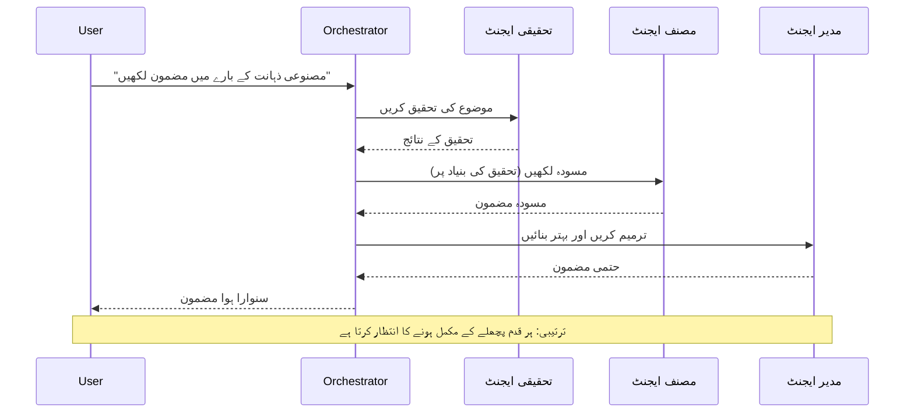
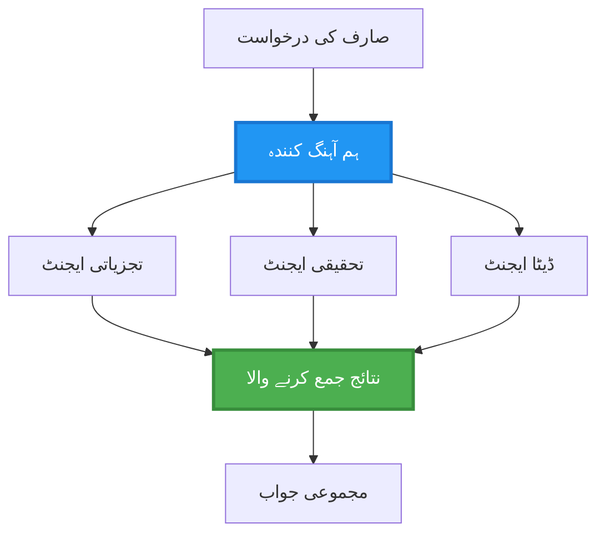
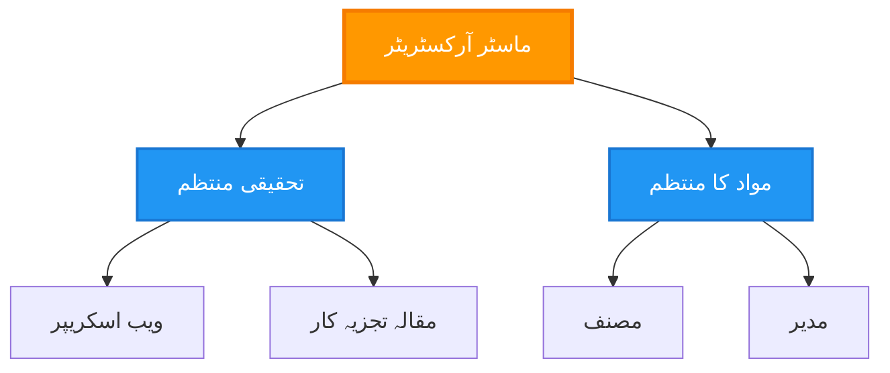
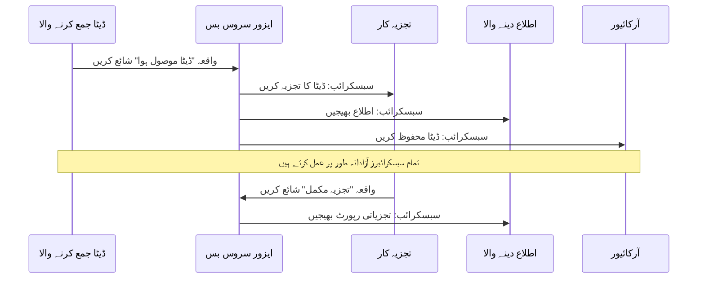
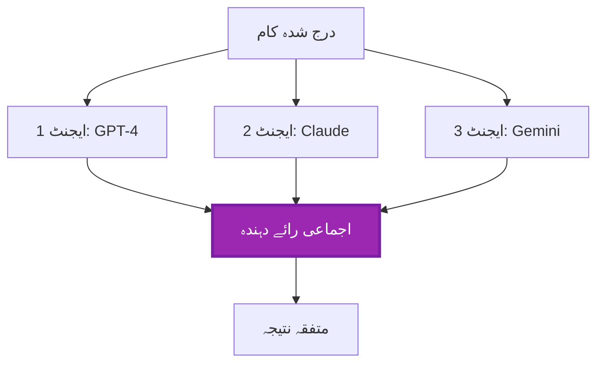
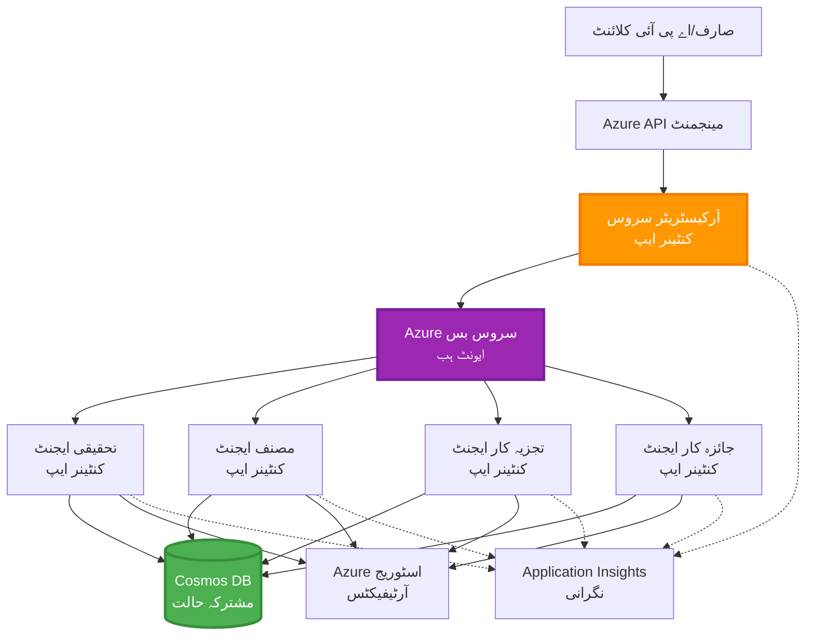

# ملٹی-ایجنٹ کوآرڈینیشن پیٹرنز

⏱️ **متوقع وقت**: 60-75 منٹ | 💰 **متوقع لاگت**: ~ $100-300/مہینہ | ⭐ **پیچیدگی**: اعلیٰ

**📚 سیکھنے کا راستہ:**
- ← پچھلا: [صلاحیت کی منصوبہ بندی](capacity-planning.md) - وسائل کا سائز اور اسکیلنگ حکمت عملیاں
- 🎯 **آپ یہاں ہیں**: ملٹی-ایجنٹ کوآرڈینیشن پیٹرنز (آرکسٹریشن، مواصلات، ریاست کا انتظام)
- → اگلا: [SKU Selection](sku-selection.md) - صحیح Azure سروسز کا انتخاب
- 🏠 [کورس ہوم](../../README.md)

---

## آپ کیا سیکھیں گے

اس سبق کو مکمل کرنے کے بعد آپ:
- سمجھیں **ملٹی-ایجنٹ آرکیٹیکچر** پیٹرنز اور کب انہیں استعمال کرنا چاہیے
- عملی جامہ پہنائیں **آرکسٹریشن پیٹرنز** (مرکزی، غیر مرکزی، درجہ وار)
- ڈیزائن کریں **ایجنٹ کمیونیکیشن** حکمت عملیاں (ہم وقت، غیر ہم وقت، واقعہ پر مبنی)
- منتظم کریں **مشترکہ ریاست** کو تقسیم شدہ ایجنٹس کے درمیان
- Azure پر AZD کے ساتھ **ملٹی-ایجنٹ سسٹمز** کو تعینات کریں
- حقیقی دنیا کے AI منظرناموں کے لیے **ہم آہنگی پیٹرنز** لاگو کریں
- تقسیم شدہ ایجنٹ سسٹمز کی نگرانی اور ڈیبگ کریں

## کیوں ملٹی-ایجنٹ ہم آہنگی اہم ہے

### ارتقاء: سنگل ایجنٹ سے ملٹی-ایجنٹ تک

**سنگل ایجنٹ (سادہ):**
```
User → Agent → Response
```

- ✅ سمجھنے اور نافذ کرنے میں آسان
- ✅ سادہ کاموں کے لیے تیز
- ❌ ایک ہی ماڈل کی صلاحیتوں تک محدود
- ❌ پیچیدہ کاموں کو متوازی نہیں کر سکتا
- ❌ کوئی تخصص نہیں

**ملٹی-ایجنٹ سسٹم (اعلیٰ):**
```
           ┌─────────────┐
           │ Orchestrator│
           └──────┬──────┘
        ┌─────────┼─────────┐
        │         │         │
    ┌───▼──┐  ┌──▼───┐  ┌──▼────┐
    │Agent1│  │Agent2│  │Agent3 │
    │(Plan)│  │(Code)│  │(Review)│
    └──────┘  └──────┘  └───────┘
```

- ✅ مخصوص کاموں کے لیے تخصصی ایجنٹس
- ✅ رفتار کے لیے متوازی اجرا
- ✅ ماڈیولر اور قابلِ دیکھ بھال
- ✅ پیچیدہ ورک فلو میں بہتر
- ⚠️ ہم آہنگی لاجک کی ضرورت ہوتی ہے

**تشبیہ**: ایک سنگل ایجنٹ ایسے ہے جیسے ایک شخص تمام کام کر رہا ہو۔ ملٹی-ایجنٹ ایسے ہے جیسے ایک ٹیم جہاں ہر رکن کے مخصوص ہنر ہوں (محقق، کوڈر، جائزہ نگار، لکھنے والا) اور وہ مل کر کام کرتے ہیں۔

---

## بنیادی ہم آہنگی پیٹرنز

### پیٹرن 1: ترتیب وار ہم آہنگی (ذمہ داری کی زنجیر)

**استعمال کب کریں**: کام مخصوص ترتیب میں مکمل ہونے چاہئیں، ہر ایجنٹ پچھلے آؤٹ پٹ پر تعمیر کرتا ہے۔


**فائدے:**
- ✅ واضح ڈیٹا فلو
- ✅ ڈیبگ کرنا آسان
- ✅ قابلِ پیش گوئی اجرا کی ترتیب

**حدود:**
- ❌ سست (متوازی نہیں)
- ❌ ایک ناکامی پوری زنجیر کو روکتی ہے
- ❌ باہمی انحصار والے کاموں کو سنبھال نہیں سکتا

**مثالی استعمال کے معاملات:**
- مواد تخلیق پائپ لائن (تحقیق → لکھنا → ترمیم → شائع کرنا)
- کوڈ جنریشن (منصوبہ بندی → نفاذ → ٹیسٹ → تعیناتی)
- رپورٹ جنریشن (ڈیٹا جمع کرنا → تجزیہ → بصری نمائندگی → خلاصہ)

---

### پیٹرن 2: متوازی ہم آہنگی (فین-آؤٹ/فین-ان)

**استعمال کب کریں**: آزادانہ کام بیک وقت چل سکتے ہیں، نتائج آخر میں یکجا کیے جاتے ہیں۔


**فائدے:**
- ✅ تیز (متوازی اجرا)
- ✅ نقص برداشت کرنے کے قابل (جزوی نتائج قابلِ قبول)
- ✅ افقی طور پر قابلِ اسکیل

**حدود:**
- ⚠️ نتائج غیر ترتیب میں پہنچ سکتے ہیں
- ⚠️ تجمیعی لاجک کی ضرورت
- ⚠️ پیچیدہ اسٹیٹ مینجمنٹ

**مثالی استعمال کے معاملات:**
- متعدد ماخذوں سے ڈیٹا جمع کرنا (APIs + ڈیٹا بیس + ویب اسکریپنگ)
- مسابقتی تجزیہ (متعدد ماڈلز حل تیار کرتے ہیں، بہترین منتخب کیا جاتا ہے)
- ترجمہ خدمات (متعدد زبانوں میں ایک ہی وقت میں ترجمہ)

---

### پیٹرن 3: درجہ وار ہم آہنگی (مینجر-ورکر)

**استعمال کب کریں**: پیچیدہ ورک فلو جن میں ذیلی کام ہوں اور تفویض ضروری ہو۔


**فائدے:**
- ✅ پیچیدہ ورک فلو سنبھالتا ہے
- ✅ ماڈیولر اور قابلِ دیکھ بھال
- ✅ ذمہ داریوں کی واضح حد بندی

**حدود:**
- ⚠️ مزید پیچیدہ آرکیٹیکچر
- ⚠️ زیادہ لیٹنسی (متعدد ہم آہنگی پرتیں)
- ⚠️ نفیس آرکسٹریشن درکار ہے

**مثالی استعمال کے معاملات:**
- انٹرپرائز دستاویز پروسیسنگ (درجہ بندی → بھیجنا → پروسیس کرنا → آرکائیو)
- کئی مرحلوں والی ڈیٹا پائپ لائنز (انجسٹ → صاف کرنا → تبدیل کرنا → تجزیہ → رپورٹ)
- پیچیدہ آٹومیشن ورک فلو (منصوبہ بندی → وسائل کی تقسیم → عملدرآمد → نگرانی)

---

### پیٹرن 4: واقعہ پر مبنی ہم آہنگی (پبلش-سبسکرائب)

**استعمال کب کریں**: جب ایجنٹس کو واقعات پر ردِ عمل دکھانا ہو اور کم جوڑنے والی ساخت مطلوب ہو۔


**فائدے:**
- ✅ ایجنٹس کے درمیان کم مربوطی
- ✅ نئے ایجنٹس شامل کرنا آسان (بس سبسکرائب کریں)
- ✅ غیر ہم وقتی پروسیسنگ
- ✅ مضبوط (پیغام کا مستقل رہنا)

**حدود:**
- ⚠️ بالآخر مطابقت
- ⚠️ پیچیدہ ڈیبگنگ
- ⚠️ پیغامات کے ترتیب کے مسائل

**مثالی استعمال کے معاملات:**
- حقیقی وقت کی نگرانی کے نظام (الرٹس، ڈیش بورڈز، لاگز)
- کئی چینلز پر اطلاعات (ای میل، SMS، پش، Slack)
- ڈیٹا پروسیسنگ پائپ لائنز (ایک ہی ڈیٹا کے متعدد کنزیومرز)

---

### پیٹرن 5: اتفاقِ رائے پر مبنی ہم آہنگی (ووٹنگ/کوارم)

**استعمال کب کریں**: قدم بڑھانے سے پہلے متعدد ایجنٹس سے اتفاقِ رائے درکار ہو۔


**فائدے:**
- ✅ بہتر درستگی (متعدد آراء)
- ✅ نقص برداشت کرنے کے قابل (اقلیت کی ناکامیاں قابلِ قبول)
- ✅ معیار کی یقین دہانی شامل

**حدود:**
- ❌ مہنگا (متعدد ماڈل کالز)
- ❌ سست (تمام ایجنٹس کے انتظار میں)
- ⚠️ تنازعات کے حل کی ضرورت

**مثالی استعمال کے معاملات:**
- مواد کی مانیٹرنگ (متعدد ماڈلز مواد کا جائزہ لیتے ہیں)
- کوڈ ریویو (متعدد لینٹرز/تجزیہ کار)
- طبی تشخیص (متعدد AI ماڈلز، ماہر کی تصدیق)

---

## آرکیٹیکچر کا جائزہ

### Azure پر مکمل ملٹی-ایجنٹ سسٹم


**کلیدی اجزاء:**

| جزو | مقصد | Azure سروس |
|-----------|---------|---------------|
| **API Gateway** | داخلے کا مقام، ریٹ لمٹنگ، توثیق | API Management |
| **آرکسٹریٹر** | ایجنٹ ورک فلو کی ہم آہنگی کرتا ہے | Container Apps |
| **Message Queue** | غیر ہم وقتی مواصلات | Service Bus / Event Hubs |
| **Agents** | مخصوص AI ورکرز | Container Apps / Functions |
| **State Store** | مشترکہ ریاست، ٹاسک ٹریکنگ | Cosmos DB |
| **Artifact Storage** | دستاویزات، نتائج، لاگز | Blob Storage |
| **Monitoring** | تقسیم شدہ ٹریسنگ، لاگز | Application Insights |

---

## پیشگی شرائط

### درکار ٹولز

```bash
# Azure Developer CLI کی توثیق کریں
azd version
# ✅ متوقع: azd ورژن 1.0.0 یا اس سے اوپر

# Azure CLI کی توثیق کریں
az --version
# ✅ متوقع: azure-cli ورژن 2.50.0 یا اس سے اوپر

# مقامی جانچ کے لیے Docker کی توثیق کریں
docker --version
# ✅ متوقع: Docker ورژن 20.10 یا اس سے اوپر
```

### Azure ضروریات

- فعال Azure سبسکرپشن
- بنانے کی اجازتیں:
  - Container Apps
  - Service Bus namespaces
  - Cosmos DB اکاؤنٹس
  - Storage accounts
  - Application Insights

### مطلوبہ علمی پس منظر

آپ کو مکمل کرنا چاہیے:
- [کنفیگریشن مینجمنٹ](../chapter-03-configuration/configuration.md)
- [توثیق اور سکیورٹی](../chapter-03-configuration/authsecurity.md)
- [مائیکرو سروسز کی مثال](../../../../examples/microservices)

---

## نفاذ کا رہنما

### پراجیکٹ کا ڈھانچہ

```
multi-agent-system/
├── azure.yaml                    # AZD configuration
├── infra/
│   ├── main.bicep               # Main infrastructure
│   ├── core/
│   │   ├── servicebus.bicep     # Message queue
│   │   ├── cosmos.bicep         # State store
│   │   ├── storage.bicep        # Artifact storage
│   │   └── monitoring.bicep     # Application Insights
│   └── app/
│       ├── orchestrator.bicep   # Orchestrator service
│       └── agent.bicep          # Agent template
└── src/
    ├── orchestrator/            # Orchestration logic
    │   ├── app.py
    │   ├── workflows.py
    │   └── Dockerfile
    ├── agents/
    │   ├── research/            # Research agent
    │   ├── writer/              # Writer agent
    │   ├── analyst/             # Analyst agent
    │   └── reviewer/            # Reviewer agent
    └── shared/
        ├── state_manager.py     # Shared state logic
        └── message_handler.py   # Message handling
```

---

## سبق 1: ترتیب وار ہم آہنگی پیٹرن

### نفاذ: مواد تخلیق پائپ لائن

آئیں ایک ترتیب وار پائپ لائن بنائیں: تحقیق → لکھنا → ترمیم → شائع کرنا

### 1. AZD کنفیگریشن

**فائل: `azure.yaml`**

```yaml
name: content-pipeline
metadata:
  template: multi-agent-sequential@1.0.0

services:
  orchestrator:
    project: ./src/orchestrator
    language: python
    host: containerapp
  
  research-agent:
    project: ./src/agents/research
    language: python
    host: containerapp
  
  writer-agent:
    project: ./src/agents/writer
    language: python
    host: containerapp
  
  editor-agent:
    project: ./src/agents/editor
    language: python
    host: containerapp
```

### 2. انفراسٹرکچر: ہم آہنگی کے لیے Service Bus

**فائل: `infra/core/servicebus.bicep`**

```bicep
param name string
param location string
param tags object = {}

resource serviceBusNamespace 'Microsoft.ServiceBus/namespaces@2022-10-01-preview' = {
  name: name
  location: location
  tags: tags
  sku: {
    name: 'Standard'
    tier: 'Standard'
  }
  properties: {
    minimumTlsVersion: '1.2'
  }
}

// Queue for orchestrator → research agent
resource researchQueue 'Microsoft.ServiceBus/namespaces/queues@2022-10-01-preview' = {
  parent: serviceBusNamespace
  name: 'research-tasks'
  properties: {
    maxDeliveryCount: 3
    lockDuration: 'PT5M'
    deadLetteringOnMessageExpiration: true
  }
}

// Queue for research agent → writer agent
resource writerQueue 'Microsoft.ServiceBus/namespaces/queues@2022-10-01-preview' = {
  parent: serviceBusNamespace
  name: 'writer-tasks'
  properties: {
    maxDeliveryCount: 3
    lockDuration: 'PT5M'
  }
}

// Queue for writer agent → editor agent
resource editorQueue 'Microsoft.ServiceBus/namespaces/queues@2022-10-01-preview' = {
  parent: serviceBusNamespace
  name: 'editor-tasks'
  properties: {
    maxDeliveryCount: 3
    lockDuration: 'PT5M'
  }
}

output namespace string = serviceBusNamespace.name
output connectionString string = listKeys('${serviceBusNamespace.id}/AuthorizationRules/RootManageSharedAccessKey', serviceBusNamespace.apiVersion).primaryConnectionString
```

### 3. مشترکہ ریاست منیجر

**فائل: `src/shared/state_manager.py`**

```python
from azure.cosmos import CosmosClient, PartitionKey
from datetime import datetime
import os

class StateManager:
    """Manages shared state across agents using Cosmos DB"""
    
    def __init__(self):
        endpoint = os.environ['COSMOS_ENDPOINT']
        key = os.environ['COSMOS_KEY']
        
        self.client = CosmosClient(endpoint, key)
        self.database = self.client.get_database_client('agent-state')
        self.container = self.database.get_container_client('tasks')
    
    def create_task(self, task_id: str, task_type: str, input_data: dict):
        """Create a new task"""
        task = {
            'id': task_id,
            'type': task_type,
            'status': 'pending',
            'input': input_data,
            'created_at': datetime.utcnow().isoformat(),
            'steps': []
        }
        self.container.create_item(task)
        return task
    
    def update_task_step(self, task_id: str, step_name: str, result: dict):
        """Update task with completed step"""
        task = self.container.read_item(task_id, partition_key=task_id)
        
        task['steps'].append({
            'name': step_name,
            'completed_at': datetime.utcnow().isoformat(),
            'result': result
        })
        
        self.container.replace_item(task_id, task)
        return task
    
    def complete_task(self, task_id: str, final_result: dict):
        """Mark task as complete"""
        task = self.container.read_item(task_id, partition_key=task_id)
        task['status'] = 'completed'
        task['result'] = final_result
        task['completed_at'] = datetime.utcnow().isoformat()
        self.container.replace_item(task_id, task)
        return task
    
    def get_task(self, task_id: str):
        """Retrieve task state"""
        return self.container.read_item(task_id, partition_key=task_id)
```

### 4. آرکسٹریٹر سروس

**فائل: `src/orchestrator/app.py`**

```python
from flask import Flask, request, jsonify
from azure.servicebus import ServiceBusClient, ServiceBusMessage
import json
import uuid
import os
from shared.state_manager import StateManager

app = Flask(__name__)
state_manager = StateManager()

# سروس بس کنکشن
servicebus_connection_str = os.environ['SERVICEBUS_CONNECTION_STRING']
servicebus_client = ServiceBusClient.from_connection_string(servicebus_connection_str)

@app.route('/health', methods=['GET'])
def health():
    return jsonify({'status': 'healthy', 'service': 'orchestrator'})

@app.route('/create-content', methods=['POST'])
def create_content():
    """
    Sequential workflow: Research → Write → Edit → Publish
    """
    data = request.json
    topic = data.get('topic')
    
    if not topic:
        return jsonify({'error': 'Topic required'}), 400
    
    # اسٹیٹ اسٹور میں ٹاسک بنائیں
    task_id = str(uuid.uuid4())
    task = state_manager.create_task(
        task_id=task_id,
        task_type='content_creation',
        input_data={'topic': topic}
    )
    
    # ریسرچ ایجنٹ کو پیغام بھیجیں (پہلا مرحلہ)
    sender = servicebus_client.get_queue_sender('research-tasks')
    message = ServiceBusMessage(
        body=json.dumps({
            'task_id': task_id,
            'topic': topic,
            'next_queue': 'writer-tasks'  # نتائج کہاں بھیجنے ہیں
        }),
        content_type='application/json'
    )
    
    with sender:
        sender.send_messages(message)
    
    return jsonify({
        'task_id': task_id,
        'status': 'started',
        'workflow': 'sequential',
        'steps': ['research', 'write', 'edit', 'publish'],
        'message': 'Content creation pipeline initiated'
    }), 202

@app.route('/task/<task_id>', methods=['GET'])
def get_task_status(task_id):
    """Check task status"""
    try:
        task = state_manager.get_task(task_id)
        return jsonify(task)
    except Exception as e:
        return jsonify({'error': str(e)}), 404

if __name__ == '__main__':
    app.run(host='0.0.0.0', port=8080)
```

### 5. تحقیقاتی ایجنٹ

**فائل: `src/agents/research/app.py`**

```python
from azure.servicebus import ServiceBusClient, ServiceBusMessage
from openai import AzureOpenAI
import json
import os
import time
from shared.state_manager import StateManager

# کلائنٹس کو ابتدائی ترتیب دیں
state_manager = StateManager()
servicebus_client = ServiceBusClient.from_connection_string(
    os.environ['SERVICEBUS_CONNECTION_STRING']
)

openai_client = AzureOpenAI(
    api_key=os.environ['AZURE_OPENAI_API_KEY'],
    api_version="2024-02-01",
    azure_endpoint=os.environ['AZURE_OPENAI_ENDPOINT']
)

def process_research_task(message_data):
    """Process research request and pass to writer"""
    task_id = message_data['task_id']
    topic = message_data['topic']
    next_queue = message_data['next_queue']
    
    print(f"🔬 Researching: {topic}")
    
    # تحقیق کے لیے Azure OpenAI کو کال کریں
    response = openai_client.chat.completions.create(
        model="gpt-4",
        messages=[
            {"role": "system", "content": "You are a research assistant. Provide comprehensive research on the given topic."},
            {"role": "user", "content": f"Research this topic thoroughly: {topic}"}
        ],
        max_tokens=1500
    )
    
    research_results = response.choices[0].message.content
    
    # حالت کو اپ ڈیٹ کریں
    state_manager.update_task_step(
        task_id=task_id,
        step_name='research',
        result={'research': research_results}
    )
    
    # اگلے ایجنٹ (مصنف) کو بھیجیں
    sender = servicebus_client.get_queue_sender(next_queue)
    message = ServiceBusMessage(
        body=json.dumps({
            'task_id': task_id,
            'topic': topic,
            'research': research_results,
            'next_queue': 'editor-tasks'
        }),
        content_type='application/json'
    )
    
    with sender:
        sender.send_messages(message)
    
    print(f"✅ Research complete for task {task_id}")

def main():
    """Listen to research queue"""
    receiver = servicebus_client.get_queue_receiver('research-tasks')
    
    print("🔬 Research Agent started, listening for tasks...")
    
    with receiver:
        while True:
            messages = receiver.receive_messages(max_wait_time=5)
            for message in messages:
                try:
                    message_data = json.loads(str(message))
                    process_research_task(message_data)
                    receiver.complete_message(message)
                except Exception as e:
                    print(f"❌ Error processing message: {e}")
                    receiver.abandon_message(message)

if __name__ == '__main__':
    main()
```

### 6. رائٹر ایجنٹ

**فائل: `src/agents/writer/app.py`**

```python
from azure.servicebus import ServiceBusClient, ServiceBusMessage
from openai import AzureOpenAI
import json
import os
from shared.state_manager import StateManager

state_manager = StateManager()
servicebus_client = ServiceBusClient.from_connection_string(
    os.environ['SERVICEBUS_CONNECTION_STRING']
)

openai_client = AzureOpenAI(
    api_key=os.environ['AZURE_OPENAI_API_KEY'],
    api_version="2024-02-01",
    azure_endpoint=os.environ['AZURE_OPENAI_ENDPOINT']
)

def process_writing_task(message_data):
    """Write article based on research"""
    task_id = message_data['task_id']
    topic = message_data['topic']
    research = message_data['research']
    next_queue = message_data['next_queue']
    
    print(f"✍️ Writing article: {topic}")
    
    # مضمون لکھنے کے لیے Azure OpenAI کو کال کریں
    response = openai_client.chat.completions.create(
        model="gpt-4",
        messages=[
            {"role": "system", "content": "You are a professional writer. Write engaging, well-structured articles."},
            {"role": "user", "content": f"Based on this research:\n\n{research}\n\nWrite a comprehensive article about: {topic}"}
        ],
        max_tokens=2000
    )
    
    article_draft = response.choices[0].message.content
    
    # حالت کو اپ ڈیٹ کریں
    state_manager.update_task_step(
        task_id=task_id,
        step_name='writing',
        result={'draft': article_draft}
    )
    
    # ایڈیٹر کو بھیجیں
    sender = servicebus_client.get_queue_sender(next_queue)
    message = ServiceBusMessage(
        body=json.dumps({
            'task_id': task_id,
            'topic': topic,
            'draft': article_draft
        }),
        content_type='application/json'
    )
    
    with sender:
        sender.send_messages(message)
    
    print(f"✅ Article draft complete for task {task_id}")

def main():
    """Listen to writer queue"""
    receiver = servicebus_client.get_queue_receiver('writer-tasks')
    
    print("✍️ Writer Agent started, listening for tasks...")
    
    with receiver:
        while True:
            messages = receiver.receive_messages(max_wait_time=5)
            for message in messages:
                try:
                    message_data = json.loads(str(message))
                    process_writing_task(message_data)
                    receiver.complete_message(message)
                except Exception as e:
                    print(f"❌ Error: {e}")
                    receiver.abandon_message(message)

if __name__ == '__main__':
    main()
```

### 7. ایڈیٹر ایجنٹ

**فائل: `src/agents/editor/app.py`**

```python
from azure.servicebus import ServiceBusClient
from openai import AzureOpenAI
import json
import os
from shared.state_manager import StateManager

state_manager = StateManager()
servicebus_client = ServiceBusClient.from_connection_string(
    os.environ['SERVICEBUS_CONNECTION_STRING']
)

openai_client = AzureOpenAI(
    api_key=os.environ['AZURE_OPENAI_API_KEY'],
    api_version="2024-02-01",
    azure_endpoint=os.environ['AZURE_OPENAI_ENDPOINT']
)

def process_editing_task(message_data):
    """Edit and finalize article"""
    task_id = message_data['task_id']
    topic = message_data['topic']
    draft = message_data['draft']
    
    print(f"📝 Editing article: {topic}")
    
    # Azure OpenAI کو ترمیم کے لیے کال کریں
    response = openai_client.chat.completions.create(
        model="gpt-4",
        messages=[
            {"role": "system", "content": "You are an expert editor. Improve grammar, clarity, and structure."},
            {"role": "user", "content": f"Edit and improve this article:\n\n{draft}"}
        ],
        max_tokens=2000
    )
    
    final_article = response.choices[0].message.content
    
    # ٹاسک کو مکمل نشان زد کریں
    state_manager.complete_task(
        task_id=task_id,
        final_result={
            'topic': topic,
            'final_article': final_article,
            'word_count': len(final_article.split())
        }
    )
    
    print(f"✅ Article finalized for task {task_id}")

def main():
    """Listen to editor queue"""
    receiver = servicebus_client.get_queue_receiver('editor-tasks')
    
    print("📝 Editor Agent started, listening for tasks...")
    
    with receiver:
        while True:
            messages = receiver.receive_messages(max_wait_time=5)
            for message in messages:
                try:
                    message_data = json.loads(str(message))
                    process_editing_task(message_data)
                    receiver.complete_message(message)
                except Exception as e:
                    print(f"❌ Error: {e}")
                    receiver.abandon_message(message)

if __name__ == '__main__':
    main()
```

### 8. تعینات کریں اور ٹیسٹ کریں

```bash
# ابتدائی ترتیب دیں اور تعینات کریں
azd init
azd up

# آرکیسٹریٹر کا یو آر ایل حاصل کریں
ORCHESTRATOR_URL=$(azd env get-values | grep ORCHESTRATOR_URL | cut -d '=' -f2 | tr -d '"')

# مواد بنائیں
curl -X POST $ORCHESTRATOR_URL/create-content \
  -H "Content-Type: application/json" \
  -d '{"topic": "The Future of AI in Healthcare"}'
```

**✅ متوقع نتیجہ:**
```json
{
  "task_id": "a1b2c3d4-e5f6-7890-abcd-ef1234567890",
  "status": "started",
  "workflow": "sequential",
  "steps": ["research", "write", "edit", "publish"],
  "message": "Content creation pipeline initiated"
}
```

**ٹاسک کی پیش رفت چیک کریں:**
```bash
TASK_ID="a1b2c3d4-e5f6-7890-abcd-ef1234567890"
curl $ORCHESTRATOR_URL/task/$TASK_ID
```

**✅ متوقع نتیجہ (مکمل):**
```json
{
  "id": "a1b2c3d4-e5f6-7890-abcd-ef1234567890",
  "type": "content_creation",
  "status": "completed",
  "steps": [
    {
      "name": "research",
      "completed_at": "2025-11-19T10:30:00Z",
      "result": {"research": "..."}
    },
    {
      "name": "writing",
      "completed_at": "2025-11-19T10:32:00Z",
      "result": {"draft": "..."}
    }
  ],
  "result": {
    "topic": "The Future of AI in Healthcare",
    "final_article": "...",
    "word_count": 1500
  }
}
```

---

## سبق 2: متوازی ہم آہنگی پیٹرن

### نفاذ: کثیر ماخذ تحقیق ایگریگیٹر

آئیں ایک متوازی نظام بنائیں جو ایک ہی وقت میں متعدد ماخذوں سے معلومات اکٹھی کرے۔

### متوازی آرکسٹریٹر

**فائل: `src/orchestrator/parallel_workflow.py`**

```python
from flask import Flask, request, jsonify
from azure.servicebus import ServiceBusClient, ServiceBusMessage
import json
import uuid
import os
from shared.state_manager import StateManager

app = Flask(__name__)
state_manager = StateManager()

servicebus_client = ServiceBusClient.from_connection_string(
    os.environ['SERVICEBUS_CONNECTION_STRING']
)

@app.route('/research-parallel', methods=['POST'])
def research_parallel():
    """
    Parallel workflow: Multiple agents work simultaneously
    """
    data = request.json
    query = data.get('query')
    
    task_id = str(uuid.uuid4())
    task = state_manager.create_task(
        task_id=task_id,
        task_type='parallel_research',
        input_data={
            'query': query,
            'agents': ['web', 'academic', 'news', 'social']
        }
    )
    
    # فین آؤٹ: تمام ایجنٹس کو بیک وقت بھیجیں
    agents = [
        ('web-research-queue', 'web'),
        ('academic-research-queue', 'academic'),
        ('news-research-queue', 'news'),
        ('social-research-queue', 'social')
    ]
    
    for queue_name, agent_type in agents:
        sender = servicebus_client.get_queue_sender(queue_name)
        message = ServiceBusMessage(
            body=json.dumps({
                'task_id': task_id,
                'query': query,
                'agent_type': agent_type,
                'result_queue': 'aggregation-queue'
            }),
            content_type='application/json'
        )
        
        with sender:
            sender.send_messages(message)
    
    return jsonify({
        'task_id': task_id,
        'status': 'started',
        'workflow': 'parallel',
        'agents_dispatched': 4,
        'message': 'Parallel research initiated'
    }), 202

if __name__ == '__main__':
    app.run(host='0.0.0.0', port=8080)
```

### تجمیعی لاجک

**فائل: `src/agents/aggregator/app.py`**

```python
from azure.servicebus import ServiceBusClient
import json
import os
from collections import defaultdict
from shared.state_manager import StateManager

state_manager = StateManager()
servicebus_client = ServiceBusClient.from_connection_string(
    os.environ['SERVICEBUS_CONNECTION_STRING']
)

# ہر کام کے لیے نتائج کا ریکارڈ رکھیں
task_results = defaultdict(list)
expected_agents = 4  # ویب، تعلیمی، خبریں، سماجی

def process_result(message_data):
    """Aggregate results from parallel agents"""
    task_id = message_data['task_id']
    agent_type = message_data['agent_type']
    result = message_data['result']
    
    # نتیجہ محفوظ کریں
    task_results[task_id].append({
        'agent': agent_type,
        'data': result
    })
    
    print(f"📊 Received result from {agent_type} agent ({len(task_results[task_id])}/{expected_agents})")
    
    # چیک کریں کہ آیا تمام ایجنٹس مکمل ہو چکے ہیں (فین-ان)
    if len(task_results[task_id]) == expected_agents:
        print(f"✅ All agents completed for task {task_id}. Aggregating...")
        
        # نتائج کو یکجا کریں
        aggregated = {
            'query': message_data['query'],
            'sources': task_results[task_id],
            'summary': generate_summary(task_results[task_id])
        }
        
        # مکمل نشان زد کریں
        state_manager.complete_task(task_id, aggregated)
        
        # صفائی کریں
        del task_results[task_id]
        
        print(f"✅ Aggregation complete for task {task_id}")

def generate_summary(results):
    """Generate summary from all sources"""
    summaries = [r['data'].get('summary', '') for r in results]
    return '\n\n'.join(summaries)

def main():
    """Listen to aggregation queue"""
    receiver = servicebus_client.get_queue_receiver('aggregation-queue')
    
    print("📊 Aggregator started, listening for results...")
    
    with receiver:
        while True:
            messages = receiver.receive_messages(max_wait_time=5)
            for message in messages:
                try:
                    message_data = json.loads(str(message))
                    process_result(message_data)
                    receiver.complete_message(message)
                except Exception as e:
                    print(f"❌ Error: {e}")
                    receiver.abandon_message(message)

if __name__ == '__main__':
    main()
```

**متوازی پیٹرن کے فوائد:**
- ⚡ **4 گنا تیز** (ایجنٹس بیک وقت چلتے ہیں)
- 🔄 **نقص برداشت کرنے کے قابل** (جزوی نتائج قبول ہیں)
- 📈 **قابلِ توسیع** (مزید ایجنٹس آسانی سے شامل کریں)

---

## عملی مشقیں

### مشق 1: ٹائم آؤٹ ہینڈلنگ شامل کریں ⭐⭐ (درمیانہ)

**مقصد**: ٹائم آؤٹ لاجک نافذ کریں تاکہ ایگریگیٹر سست ایجنٹس کے لیے ہمیشہ انتظار نہ کرے۔

**اقدامات**:

1. **ایگریگیٹر میں ٹائم آؤٹ ٹریکنگ شامل کریں:**

```python
from datetime import datetime, timedelta

task_timeouts = {}  # task_id -> ختم ہونے کا وقت

def process_result(message_data):
    task_id = message_data['task_id']
    
    # پہلے نتیجے کے لیے ٹائم آؤٹ سیٹ کریں
    if task_id not in task_timeouts:
        task_timeouts[task_id] = datetime.utcnow() + timedelta(seconds=30)
    
    task_results[task_id].append({
        'agent': message_data['agent_type'],
        'data': message_data['result']
    })
    
    # چیک کریں کہ آیا مکمل ہوا ہے یا ٹائم آؤٹ ہو گیا ہے
    if len(task_results[task_id]) == expected_agents or \
       datetime.utcnow() > task_timeouts[task_id]:
        
        print(f"📊 Aggregating with {len(task_results[task_id])}/{expected_agents} results")
        
        aggregated = {
            'query': message_data['query'],
            'sources': task_results[task_id],
            'completed_agents': len(task_results[task_id]),
            'timed_out': len(task_results[task_id]) < expected_agents
        }
        
        state_manager.complete_task(task_id, aggregated)
        
        # صفائی
        del task_results[task_id]
        del task_timeouts[task_id]
```

2. **مصنوعی تاخیر کے ساتھ ٹیسٹ کریں:**

```python
# ایک ایجنٹ میں سست پروسیسنگ کی نقل کے لیے تاخیر شامل کریں
import time
time.sleep(35)  # 30 سیکنڈ کی ٹائم آؤٹ سے تجاوز کرتا ہے
```

3. **تعینات کریں اور تصدیق کریں:**

```bash
azd deploy aggregator

# ٹاسک جمع کروائیں
curl -X POST $ORCHESTRATOR_URL/research-parallel \
  -H "Content-Type: application/json" \
  -d '{"query": "AI safety research"}'

# 30 سیکنڈ کے بعد نتائج چیک کریں
curl $ORCHESTRATOR_URL/task/$TASK_ID
```

**✅ کامیابی کے معیار:**
- ✅ ٹاسک 30 سیکنڈ کے بعد مکمل ہو جاتا ہے حتیٰ کہ ایجنٹس نامکمل ہوں
- ✅ جواب جزوی نتائج کی نشاندہی کرتا ہے (`"timed_out": true`)
- ✅ دستیاب نتائج واپس کیے جاتے ہیں (4 میں سے 3 ایجنٹس)

**وقت**: 20-25 منٹ

---

### مشق 2: ریٹری لاجک نافذ کریں ⭐⭐⭐ (اعلیٰ)

**مقصد**: ناکام ایجنٹ ٹاسکس کو خودکار طور پر دوبارہ کوشش کریں قبل اس کے کہ ترک کر دیا جائے۔

**اقدامات**:

1. **آرکسٹریٹر میں ریٹری ٹریکنگ شامل کریں:**

```python
from dataclasses import dataclass
from typing import Dict

@dataclass
class RetryConfig:
    max_retries: int = 3
    backoff_seconds: int = 5

retry_counts: Dict[str, int] = {}  # پیغام_شناخت -> دوبارہ_کوشش_گنتی

def send_with_retry(queue_name: str, message_data: dict, retry_config: RetryConfig):
    """Send message with retry metadata"""
    message_id = message_data.get('message_id', str(uuid.uuid4()))
    message_data['message_id'] = message_id
    message_data['retry_count'] = retry_counts.get(message_id, 0)
    message_data['max_retries'] = retry_config.max_retries
    
    sender = servicebus_client.get_queue_sender(queue_name)
    message = ServiceBusMessage(
        body=json.dumps(message_data),
        content_type='application/json',
        message_id=message_id
    )
    
    with sender:
        sender.send_messages(message)
```

2. **ایجنٹس میں ریٹری ہینڈلر شامل کریں:**

```python
def process_with_retry(message, receiver, process_func):
    """Process message with automatic retry on failure"""
    try:
        message_data = json.loads(str(message))
        
        # پیغام کو پراسیس کریں
        process_func(message_data)
        
        # کامیابی - مکمل
        receiver.complete_message(message)
        
    except Exception as e:
        message_id = message.message_id
        retry_count = message_data.get('retry_count', 0)
        max_retries = message_data.get('max_retries', 3)
        
        if retry_count < max_retries:
            # دوبارہ کوشش: ترک کریں اور بڑھائی گئی گنتی کے ساتھ دوبارہ قطار میں ڈالیں
            print(f"⚠️ Retry {retry_count + 1}/{max_retries} for message {message_id}")
            
            message_data['retry_count'] = retry_count + 1
            
            # اسی قطار میں تاخیر کے ساتھ واپس بھیجیں
            time.sleep(5 * (retry_count + 1))  # نمایی تاخیر
            send_with_retry(queue_name, message_data, RetryConfig())
            
            receiver.complete_message(message)  # اصل کو حذف کریں
        else:
            # زیادہ سے زیادہ دوبارہ کوششیں پوری ہو گئیں - ڈیڈ لیٹر قطار میں منتقل کریں
            print(f"❌ Max retries exceeded for message {message_id}")
            receiver.dead_letter_message(
                message,
                reason="MaxRetriesExceeded",
                error_description=str(e)
            )
```

3. **ڈیڈ لیٹر قطار کی نگرانی کریں:**

```python
def monitor_dead_letters():
    """Check dead letter queue for failed messages"""
    receiver = servicebus_client.get_queue_receiver(
        'research-queue',
        sub_queue='deadletter'
    )
    
    with receiver:
        messages = receiver.receive_messages(max_wait_time=5)
        for message in messages:
            print(f"☠️ Dead letter: {message.message_id}")
            print(f"Reason: {message.dead_letter_reason}")
            print(f"Description: {message.dead_letter_error_description}")
```

**✅ کامیابی کے معیار:**
- ✅ ناکام ٹاسک خودکار طور پر دوبارہ کوشش کرتے ہیں (زیادہ سے زیادہ 3 بار)
- ✅ ریٹریز کے درمیان نمایاں بیک آف (5s، 10s، 15s)
- ✅ زیادہ سے زیادہ ریٹریز کے بعد، پیغامات dead letter queue میں چلے جاتے ہیں
- ✅ dead letter queue کی نگرانی اور ری پلے کی جا سکتی ہے

**وقت**: 30-40 منٹ

---

### مشق 3: سرکٹ بریکر نافذ کریں ⭐⭐⭐ (اعلیٰ)

**مقصد**: ناکام ہونے والے ایجنٹس کو درخواستیں روک کر زنجیری ناکامیوں کو روکنا۔

**اقدامات**:

1. **سرکٹ بریکر کلاس بنائیں:**

```python
from enum import Enum
from datetime import datetime, timedelta

class CircuitState(Enum):
    CLOSED = "closed"      # معمول کے مطابق عمل
    OPEN = "open"          # ناکام، درخواستیں مسترد کریں
    HALF_OPEN = "half_open"  # چیک کیا جا رہا ہے کہ آیا بحال ہوا ہے

class CircuitBreaker:
    def __init__(self, failure_threshold=5, timeout_seconds=60):
        self.failure_threshold = failure_threshold
        self.timeout_seconds = timeout_seconds
        self.failure_count = 0
        self.last_failure_time = None
        self.state = CircuitState.CLOSED
    
    def call(self, func):
        """Execute function with circuit breaker protection"""
        if self.state == CircuitState.OPEN:
            # چیک کریں کہ ٹائم آؤٹ ختم ہو چکا ہے
            if datetime.utcnow() - self.last_failure_time > timedelta(seconds=self.timeout_seconds):
                self.state = CircuitState.HALF_OPEN
                print("🔄 Circuit breaker: HALF_OPEN (testing)")
            else:
                raise Exception(f"Circuit breaker OPEN for agent. Try again in {self.timeout_seconds}s")
        
        try:
            result = func()
            
            # کامیابی
            if self.state == CircuitState.HALF_OPEN:
                self.state = CircuitState.CLOSED
                self.failure_count = 0
                print("✅ Circuit breaker: CLOSED (recovered)")
            
            return result
            
        except Exception as e:
            self.failure_count += 1
            self.last_failure_time = datetime.utcnow()
            
            if self.failure_count >= self.failure_threshold:
                self.state = CircuitState.OPEN
                print(f"🔴 Circuit breaker: OPEN (too many failures)")
            
            raise e
```

2. **ایجنٹ کالز پر لاگو کریں:**

```python
# آرکیسٹریٹر میں
agent_circuits = {
    'web': CircuitBreaker(failure_threshold=5, timeout_seconds=60),
    'academic': CircuitBreaker(failure_threshold=5, timeout_seconds=60),
    'news': CircuitBreaker(failure_threshold=5, timeout_seconds=60),
    'social': CircuitBreaker(failure_threshold=5, timeout_seconds=60)
}

def send_to_agent(agent_type, message_data):
    """Send with circuit breaker protection"""
    circuit = agent_circuits[agent_type]
    
    try:
        circuit.call(lambda: send_message(agent_type, message_data))
    except Exception as e:
        print(f"⚠️ Skipping {agent_type} agent: {e}")
        # دوسرے ایجنٹس کے ساتھ جاری رکھیں
```

3. **سرکٹ بریکر کا ٹیسٹ کریں:**

```bash
# بار بار ناکامیوں کی تقلید کریں (ایک ایجنٹ کو روکیں)
az containerapp stop --name web-research-agent --resource-group rg-agents

# متعدد درخواستیں بھیجیں
for i in {1..10}; do
  curl -X POST $ORCHESTRATOR_URL/research-parallel \
    -H "Content-Type: application/json" \
    -d '{"query": "test query '$i'"}'
  sleep 2
done

# لاگز چیک کریں - 5 ناکامیوں کے بعد سرکٹ کھلا نظر آنا چاہیے
# کنٹینر ایپ کے لاگز کے لیے Azure CLI استعمال کریں:
az containerapp logs show --name orchestrator --resource-group $RG_NAME --tail 50
```

**✅ کامیابی کے معیار:**
- ✅ 5 ناکامیوں کے بعد، سرکٹ کھل جاتا ہے (درخواستیں مسترد کرتا ہے)
- ✅ 60 سیکنڈ کے بعد، سرکٹ نصف کھل جاتا ہے (ریکوری کی جانچ کرتا ہے)
- ✅ دوسرے ایجنٹس معمول کے مطابق کام جاری رکھتے ہیں
- ✅ جب ایجنٹ بحال ہوتا ہے تو سرکٹ خود بخود بند ہو جاتا ہے

**وقت**: 40-50 منٹ

---

## مانیٹرنگ اور ڈیبگنگ

### Application Insights کے ساتھ تقسیم شدہ ٹریسنگ

**فائل: `src/shared/tracing.py`**

```python
from opencensus.ext.azure.log_exporter import AzureLogHandler
from opencensus.ext.azure.trace_exporter import AzureExporter
from opencensus.trace import config_integration
from opencensus.trace.tracer import Tracer
from opencensus.trace.samplers import AlwaysOnSampler
import logging
import os

# ٹریسنگ کو ترتیب دیں
config_integration.trace_integrations(['requests', 'logging'])

connection_string = os.environ.get('APPLICATIONINSIGHTS_CONNECTION_STRING')

# ٹریسر بنائیں
tracer = Tracer(
    exporter=AzureExporter(connection_string=connection_string),
    sampler=AlwaysOnSampler()
)

# لاگنگ کو ترتیب دیں
logger = logging.getLogger(__name__)
logger.addHandler(AzureLogHandler(connection_string=connection_string))
logger.setLevel(logging.INFO)

def trace_agent_call(agent_name, task_id, operation):
    """Trace agent operations"""
    with tracer.span(name=f'{agent_name}.{operation}') as span:
        span.add_attribute('agent', agent_name)
        span.add_attribute('task_id', task_id)
        span.add_attribute('operation', operation)
        
        try:
            result = operation()
            span.add_attribute('status', 'success')
            return result
        except Exception as e:
            span.add_attribute('status', 'error')
            span.add_attribute('error', str(e))
            raise
```

### Application Insights کی کوئریز

**ملٹی-ایجنٹ ورک فلو کی ٹریکنگ:**

```kusto
// Trace complete workflow for a task
traces
| where customDimensions.task_id == "a1b2c3d4-..."
| project timestamp, message, customDimensions.agent, customDimensions.operation
| order by timestamp asc
```

**ایجنٹ کارکردگی کا موازنہ:**

```kusto
// Compare agent execution times
dependencies
| where name contains "agent"
| summarize 
    avg_duration = avg(duration),
    p95_duration = percentile(duration, 95),
    count = count()
  by agent = tostring(customDimensions.agent)
| order by avg_duration desc
```

**ناکامی کا تجزیہ:**

```kusto
// Find which agents fail most
exceptions
| where customDimensions.agent != ""
| summarize 
    failure_count = count(),
    unique_errors = dcount(outerMessage)
  by agent = tostring(customDimensions.agent)
| order by failure_count desc
```

---

## لاگت کا تجزیہ

### ملٹی-ایجنٹ سسٹم کی لاگت (ماہانہ تخمینے)

| جزو | کنفیگریشن | لاگت |
|-----------|--------------|------|
| **آرکسٹریٹر** | 1 Container App (1 vCPU, 2GB) | $30-50 |
| **4 ایجنٹس** | 4 Container Apps (0.5 vCPU, 1GB ہر ایک) | $60-120 |
| **Service Bus** | معیاری سطح، 10M پیغامات | $10-20 |
| **Cosmos DB** | Serverless, 5GB storage, 1M RUs | $25-50 |
| **Blob Storage** | 10GB storage, 100K operations | $5-10 |
| **Application Insights** | 5GB ingestion | $10-15 |
| **Azure OpenAI** | GPT-4, 10M tokens | $100-300 |
| **کل** | | **$240-565/ماہ** |

### لاگت کم کرنے کی حکمت عملیاں

1. **جہاں ممکن ہو سرور لیس استعمال کریں:**
   ```bicep
   // Cosmos DB serverless (no minimum cost)
   properties: {
     databaseAccountOfferType: 'Standard'
     capabilities: [{ name: 'EnableServerless' }]
   }
   ```

2. **ایجنٹس کو جب غیر فعال ہوں صفر تک اسکیل کریں:**
   ```bicep
   scale: {
     minReplicas: 0  // Scale to zero when no messages
     maxReplicas: 10
   }
   ```

3. **Service Bus کے لیے بیچنگ استعمال کریں:**
   ```python
   # پیغامات کو بیچوں میں بھیجیں (سستا)
   sender.send_messages([message1, message2, message3])
   ```

4. **بار بار استعمال ہونے والے نتائج کو کیش کریں:**
   ```python
   # Redis کے لیے Azure Cache استعمال کریں
   if cache.exists(query_hash):
       return cache.get(query_hash)
   ```

---

## بہترین طریقے

### ✅ کریں:

1. **ایدمپوٹنٹ آپریشنز استعمال کریں**
   ```python
   # ایجنٹ ایک ہی پیغام کو کئی بار محفوظ طریقے سے پروسیس کر سکتا ہے
   def process_task(task_id):
       if state_manager.task_exists(task_id):
           print(f"Task {task_id} already processed, skipping")
           return
       # کام پر عملدرآمد...
   ```

2. **جامع لاگنگ نافذ کریں**
   ```python
   logger.info(f"Agent: {agent_name}, Task: {task_id}, Action: {action}")
   ```

3. **Correlation IDs کا استعمال کریں**
   ```python
   # task_id کو پورے ورک فلو میں منتقل کریں
   message_data = {
       'task_id': task_id,  # مطابقتی شناخت
       'timestamp': datetime.utcnow().isoformat()
   }
   ```

4. **پیغام کا TTL (time-to-live) سیٹ کریں**
   ```bicep
   properties: {
     defaultMessageTimeToLive: 'PT1H'  // 1 hour max
   }
   ```

5. **dead letter queues کی نگرانی کریں**
   ```python
   # ناکام پیغامات کی باقاعدہ نگرانی
   monitor_dead_letters()
   ```

### ❌ نہ کریں:

1. **گول دائرہ نما انحصارات پیدا نہ کریں**
   ```python
   # ❌ خراب: ایجنٹ A → ایجنٹ B → ایجنٹ A (لامتناہی لوپ)
   # ✅ اچھا: واضح ہدایتی غیرحلقوی گراف (DAG) متعین کریں
   ```

2. **ایجنٹ تھریڈز کو بلاک نہ کریں**
   ```python
   # ❌ خراب: ہم وقتی انتظار
   while not task_complete:
       time.sleep(1)
   
   # ✅ اچھا: پیغام قطار کے کال بیکس استعمال کریں
   ```

3. **جزوی ناکامیوں کو نظر انداز نہ کریں**
   ```python
   # ❌ خراب: اگر کوئی ایک ایجنٹ ناکام ہوجائے تو پورا ورک فلو ناکام سمجھ لیں
   # ✅ اچھا: خرابی کے اشاروں کے ساتھ جزوی نتائج واپس کریں
   ```

4. **لامحدود ریٹریز کا استعمال نہ کریں**
   ```python
   # ❌ برا: ہمیشہ دوبارہ کوشش کرنا
   # ✅ اچھا: max_retries = 3، پھر dead letter میں بھیجیں
   ```

---
‮## مسائل حل کرنے کی رہنمائی

### مسئلہ: پیغامات قطار میں پھنس گئے

**علامات:**
- پیغامات قطار میں جمع ہو رہے ہیں
- ایجنٹس عمل نہیں کر رہے
- ٹاسک کی حیثیت "pending" پر پھنس گئی

**تشخیص:**
```bash
# قطار کی گہرائی چیک کریں
az servicebus queue show \
  --namespace-name mybus \
  --name research-tasks \
  --query "countDetails"

# Azure CLI استعمال کرتے ہوئے ایجنٹ کے لاگز چیک کریں
az containerapp logs show --name research-agent --resource-group $RG_NAME --tail 50
```

**حل:**

1. **ایجنٹس کی تعداد بڑھائیں:**
   ```bash
   az containerapp update \
     --name research-agent \
     --min-replicas 3 \
     --max-replicas 10
   ```

2. **ڈیڈ لیٹر کی قطار چیک کریں:**
   ```bash
   az servicebus queue show \
     --namespace-name mybus \
     --name research-tasks \
     --query "countDetails.deadLetterMessageCount"
   ```

---

### مسئلہ: ٹاسک کا ٹائم آؤٹ/کبھی مکمل نہیں ہوتا

**علامات:**
- ٹاسک کی حیثیت "in_progress" رہتی ہے
- کچھ ایجنٹس مکمل ہو جاتے ہیں، جبکہ دوسرے نہیں
- کوئی خرابی کے پیغامات نہیں

**تشخیص:**
```bash
# ٹاسک کی حالت چیک کریں
curl $ORCHESTRATOR_URL/task/$TASK_ID

# ایپلیکیشن انسائٹس چیک کریں
# کوئری چلائیں: traces | where customDimensions.task_id == "..."
```

**حل:**

1. **ایگریگیٹر میں ٹائم آؤٹ نافذ کریں (مشق 1)**

2. **Azure Monitor کے ذریعے ایجنٹ کی ناکامیوں کی جانچ کریں:**
   ```bash
   # azd monitor کے ذریعے لاگز دیکھیں
   azd monitor --logs
   
   # یا مخصوص کنٹینر ایپ کے لاگز چیک کرنے کے لیے Azure CLI استعمال کریں
   az containerapp logs show --name <agent-name> --resource-group $RG_NAME --follow | grep "ERROR\|FAIL"
   ```

3. **تصدیق کریں کہ تمام ایجنٹس چل رہے ہیں:**
   ```bash
   az containerapp list \
     --resource-group rg-agents \
     --query "[].{name:name, status:properties.runningStatus}"
   ```

---

## مزید جانیں

### سرکاری دستاویزات
- [Azure سروس بس](https://learn.microsoft.com/azure/service-bus-messaging/service-bus-messaging-overview)
- [Cosmos DB](https://learn.microsoft.com/azure/cosmos-db/introduction)
- [Container Apps DAPR](https://learn.microsoft.com/azure/container-apps/dapr-overview)
- [ملٹی-ایجنٹ ڈیزائن پیٹرنز](https://learn.microsoft.com/azure/architecture/guide/ai/multi-agent-systems)

### اس کورس میں اگلے اقدامات
- ← پچھلا: [ظرفیت کی منصوبہ بندی](capacity-planning.md)
- → اگلا: [SKU کا انتخاب](sku-selection.md)
- 🏠 [کورس ہوم](../../README.md)

### متعلقہ مثالیں
- [مائیکرو سروسز کی مثال](../../../../examples/microservices) - سروس مواصلت کے نمونے
- [Azure OpenAI کی مثال](../../../../examples/azure-openai-chat) - مصنوعی ذہانت کا انضمام

---

## خلاصہ

**آپ نے سیکھا:**
- ✅ پانچ ہم آہنگی پیٹرنز (تسلسلی، متوازی، درجہ بندی، واقعہ پر مبنی، اتفاق رائے)
- ✅ Azure پر ملٹی-ایجنٹ آرکیٹیکچر (Service Bus, Cosmos DB, Container Apps)
- ✅ تقسیم شدہ ایجنٹس میں حالت کا انتظام
- ✅ ٹائم آؤٹ ہینڈلنگ، دوبارہ کوششیں، اور سرکٹ بریکرز
- ✅ تقسیم شدہ سسٹمز کی مانیٹرنگ اور خرابیوں کا سراغ لگانا
- ✅ لاگت کی اصلاح کی حکمت عملیاں

**اہم نکات:**
1. **صحیح پیٹرن کا انتخاب کریں** - ترتیب وار ورک فلو کے لیے تسلسلی، رفتار کے لیے متوازی، لچک کے لیے واقعہ پر مبنی
2. **حالت کو احتیاط سے سنبھالیں** - مشترکہ حالت کے لیے Cosmos DB یا اسی جیسے استعمال کریں
3. **ناکامیوں کو بہتر طریقے سے سنبھالیں** - ٹائم آؤٹس، دوبارہ کوششیں، سرکٹ بریکرز، ڈیڈ لیٹر قطاریں
4. **ہر چیز کی نگرانی کریں** - تقسیم شدہ ٹریسنگ ڈی بگنگ کے لیے ضروری ہے
5. **لاگت کو بہتر بنائیں** - زیرو تک اسکیل کریں، سرور لیس استعمال کریں، کیشنگ نافذ کریں

**اگلے اقدامات:**
1. عملی مشقیں مکمل کریں
2. اپنے استعمال کے کیس کے لیے ملٹی-ایجنٹ سسٹم بنائیں
3. کارکردگی اور لاگت کو بہتر بنانے کے لیے [SKU کا انتخاب](sku-selection.md) کا مطالعہ کریں‮.

---

<!-- CO-OP TRANSLATOR DISCLAIMER START -->
دستبرداری:
یہ دستاویز مصنوعی ذہانت (AI) پر مبنی ترجمہ سروس [Co-op Translator](https://github.com/Azure/co-op-translator) کے ذریعے ترجمہ کی گئی ہے۔ اگرچہ ہم درستگی کے لیے کوشاں ہیں، براہِ کرم نوٹ کریں کہ خودکار تراجم میں غلطیاں یا غیر درستیاں موجود ہو سکتی ہیں۔ اصل دستاویز اس کی مادری زبان میں معتبر ماخذ سمجھی جائے گی۔ اہم معلومات کے لیے پیشہ ور انسانی ترجمہ کی سفارش کی جاتی ہے۔ ہم اس ترجمے کے استعمال سے پیدا ہونے والی کسی بھی غلط فہمی یا غلط تشریح کے لیے ذمہ دار نہیں ہیں۔
<!-- CO-OP TRANSLATOR DISCLAIMER END -->