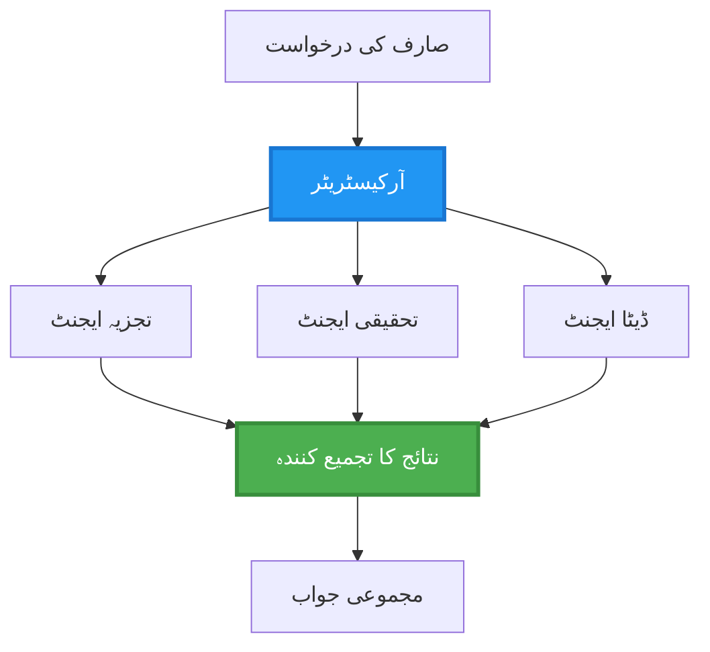
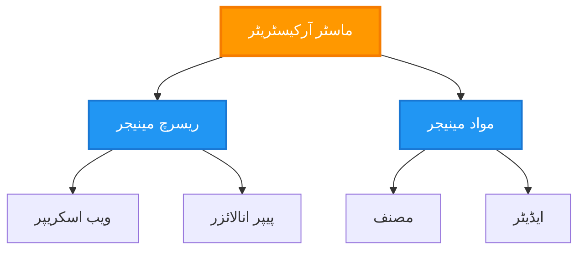
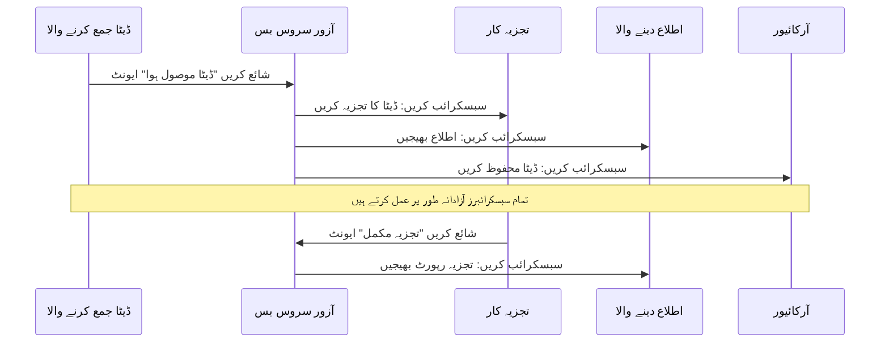
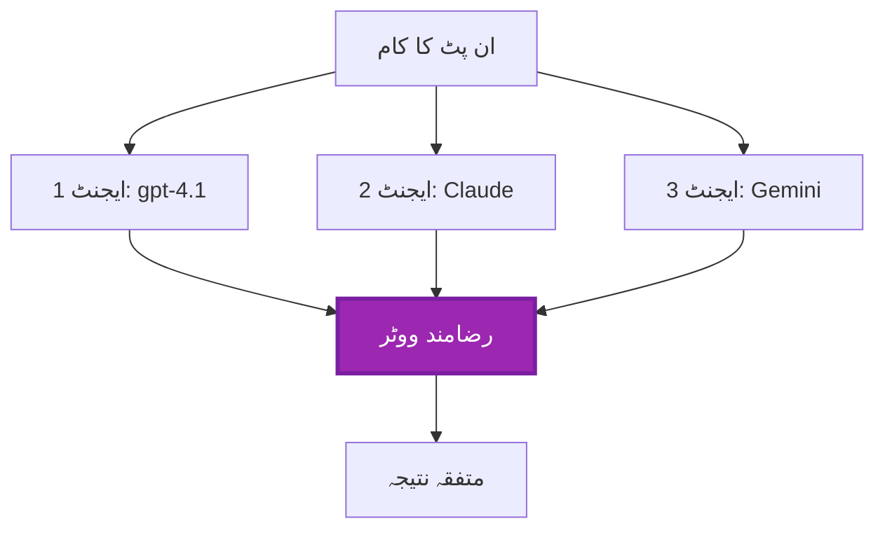
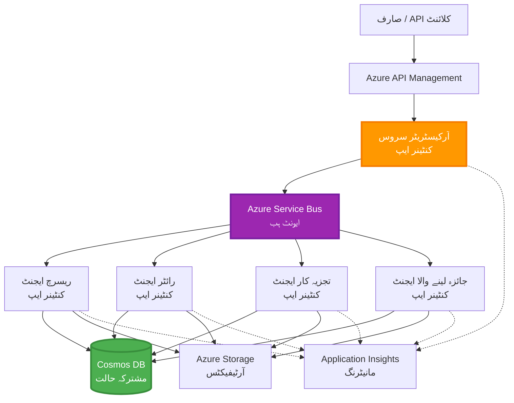

# ملٹی ایجنٹ کوآرڈینیشن پیٹرنز

⏱️ **متوقع وقت**: 60-75 منٹ | 💰 **متوقع لاگت**: تقریباً $100-300/ماہ | ⭐ **پیچیدگی**: اعلیٰ

**📚 سیکھنے کا راستہ:**
- ← پچھلا: [کیپیسٹی پلاننگ](capacity-planning.md) - وسائل کی پیمائش اور توسیعی حکمت عملیاں
- 🎯 **آپ یہاں ہیں**: ملٹی ایجنٹ کوآرڈینیشن پیٹرنز (اورکسٹریشن، ارتباط، ریاست کا انتظام)
- → اگلا: [SKU سلیکشن](sku-selection.md) - مناسب Azure خدمات کا انتخاب
- 🏠 [کورس ہوم](../../README.md)

---

## آپ کیا سیکھیں گے

اس سبق کو مکمل کرنے سے آپ:
- **ملٹی ایجنٹ آرکیٹیکچر** پیٹرنز کو سمجھیں گے اور کب استعمال کرنا ہے
- **اورکسٹریشن پیٹرنز** نافذ کریں گے (مرکزی، غیر مرکزی، درجہ بندی شدہ)
- **ایجنٹ رابطہ کاری** حکمت عملیاں ڈیزائن کریں گے (ہم وقت، غیر ہم وقت، واقعہ پر مبنی)
- تقسیم شدہ ایجنٹس کے درمیان **مشترکہ ریاست** کا انتظام کریں گے
- AZD کے ساتھ Azure پر **ملٹی ایجنٹ سسٹمز** ڈیپلائے کریں گے
- حقیقی دنیا کے AI مناظر کے لیے **کوآرڈینیشن پیٹرنز** لاگو کریں گے
- تقسیم شدہ ایجنٹ سسٹمز کی مانیٹرنگ اور ڈیبگ کریں گے

## کیوں ملٹی ایجنٹ کوآرڈینیشن اہم ہے

### ارتقا: واحد ایجنٹ سے ملٹی ایجنٹ تک

**واحد ایجنٹ (سادہ):**
```
User → Agent → Response
```
- ✅ سمجھنے اور نافذ کرنے میں آسان
- ✅ سادہ کاموں کے لیے تیز
- ❌ واحد ماڈل کی صلاحیتوں سے محدود
- ❌ پیچیدہ کاموں کو متوازی نہیں کر سکتا
- ❌ تخصص نہیں

**ملٹی ایجنٹ سسٹم (اعلیٰ):**
```mermaid
graph TD
    Orchestrator[آرکیسٹریٹر] --> Agent1[ایجنٹ1<br/>منصوبہ]
    Orchestrator --> Agent2[ایجنٹ2<br/>کوڈ]
    Orchestrator --> Agent3[ایجنٹ3<br/>جائزہ]
```- ✅ مخصوص کاموں کے لیے تخصیص یافتہ ایجنٹس
- ✅ رفتار کے لیے متوازی عمل درآمد
- ✅ ماڈیولر اور قابل انتظام
- ✅ پیچیدہ ورک فلو میں بہتر
- ⚠️ کوآرڈینیشن منطق کی ضرورت

**مثال**: واحد ایجنٹ ایسا ہے جیسے ایک شخص تمام کام کر رہا ہو۔ ملٹی ایجنٹ ایک ٹیم کی طرح ہے جہاں ہر رکن کی مخصوص مہارتیں ہوتی ہیں (محقق، کوڈر، جائزہ نگار، مصنف) جو مل کر کام کرتے ہیں۔

---

## بنیادی کوآرڈینیشن پیٹرنز

### پیٹرن 1: متواتر کوآرڈینیشن (ذمہ داری کی زنجیر)

**کب استعمال کریں**: کام مخصوص ترتیب میں مکمل ہونے چاہئیں، ہر ایجنٹ پچھلے نتیجے پر کام کرتا ہے۔

```mermaid
sequenceDiagram
    participant User
    participant Orchestrator
    participant Agent1 as تحقیقی ایجنٹ
    participant Agent2 as لکھاری ایجنٹ
    participant Agent3 as ایڈیٹر ایجنٹ
    
    User->>Orchestrator: "مصنوعی ذہانت کے بارے میں مضمون لکھیں"
    Orchestrator->>Agent1: موضوع کی تحقیق کریں
    Agent1-->>Orchestrator: تحقیق کے نتائج
    Orchestrator->>Agent2: مسودہ لکھیں (تحقیق کے استعمال سے)
    Agent2-->>Orchestrator: مسودہ مضمون
    Orchestrator->>Agent3: ترمیم کریں اور بہتر بنائیں
    Agent3-->>Orchestrator: آخری مضمون
    Orchestrator-->>User: صاف کردہ مضمون
    
    Note over User,Agent3: تسلسل: ہر قدم پچھلے کے انتظار میں ہے
```
**فوائد:**
- ✅ واضح ڈیٹا فلو
- ✅ آسانی سے ڈیبگ کیا جا سکتا ہے
- ✅ قابل پیش گوئی عمل درآمد کی ترتیب

**حدود:**
- ❌ سست (کوئی متوازی عمل درآمد نہیں)
- ❌ ایک ناکامی پوری زنجیر کو بلاک کر دیتی ہے
- ❌ باہم انحصار والے کاموں کو سنبھال نہیں سکتا

**مثال استعمال:**
- مواد کی تیاری کا سلسلہ (تحقیق → لکھنا → تدوین → اشاعت)
- کوڈ تخلیق (منصوبہ → نفاذ → جانچ → تعیناتی)
- رپورٹ کی تیاری (ڈیٹا جمع کرنا → تجزیہ → بصری نمائندگی → خلاصہ)

---

### پیٹرن 2: متوازی کوآرڈینیشن (فین آؤٹ/فین اِن)

**کب استعمال کریں**: آزاد کام بیک وقت چل سکتے ہیں، نتائج آخر میں جوڑے جاتے ہیں۔


```mermaid
graph TB
    User[صارف کی درخواست]
    Orchestrator[آرکیسٹریٹر]
    Agent1[تجزیہ ایجنٹ]
    Agent2[تحقیقی ایجنٹ]
    Agent3[ڈیٹا ایجنٹ]
    Aggregator[نتائج کا تجمیع کنندہ]
    Response[مجموعی جواب]
    
    User --> Orchestrator
    Orchestrator --> Agent1
    Orchestrator --> Agent2
    Orchestrator --> Agent3
    Agent1 --> Aggregator
    Agent2 --> Aggregator
    Agent3 --> Aggregator
    Aggregator --> Response
    
    style Orchestrator fill:#2196F3,stroke:#1976D2,stroke-width:3px,color:#fff
    style Aggregator fill:#4CAF50,stroke:#388E3C,stroke-width:3px,color:#fff
```
**فوائد:**
- ✅ تیز (متوازی عمل درآمد)
- ✅ نقص برداشت (جزوی نتائج قابل قبول)
- ✅ افقی اسکیلنگ

**حدود:**
- ⚠️ نتائج غیر ترتیب کے آ سکتے ہیں
- ⚠️ اجتماع کی منطق کی ضرورت
- ⚠️ پیچیدہ ریاست کا انتظام

**مثال استعمال:**
- کثیر ذرائع سے ڈیٹا جمع کرنا (APIs + ڈیٹا بیس + ویب اسکریپنگ)
- مقابلتی تجزیہ (متعدد ماڈلز حل تیار کرتے ہیں، بہترین منتخب کیا جاتا ہے)
- ترجمہ خدمات (متعدد زبانوں میں بیک وقت ترجمہ)

---

### پیٹرن 3: درجہ بندی شدہ کوآرڈینیشن (مینجر-ورکر)

**کب استعمال کریں**: پیچیدہ ورک فلو جس میں ذیلی کام ہوں، تفویض کی ضرورت ہو۔


```mermaid
graph TB
    Master[ماسٹر آرکیسٹریٹر]
    Manager1[ریسرچ مینیجر]
    Manager2[مواد مینیجر]
    W1[ویب اسکریپر]
    W2[پیپر انالائزر]
    W3[مصنف]
    W4[ایڈیٹر]
    
    Master --> Manager1
    Master --> Manager2
    Manager1 --> W1
    Manager1 --> W2
    Manager2 --> W3
    Manager2 --> W4
    
    style Master fill:#FF9800,stroke:#F57C00,stroke-width:3px,color:#fff
    style Manager1 fill:#2196F3,stroke:#1976D2,stroke-width:2px,color:#fff
    style Manager2 fill:#2196F3,stroke:#1976D2,stroke-width:2px,color:#fff
```
**فوائد:**
- ✅ پیچیدہ ورک فلو کو سنبھالتا ہے
- ✅ ماڈیولر اور قابل انتظام
- ✅ واضح ذمہ داری کی حد بندی

**حدود:**
- ⚠️ زیادہ پیچیدہ آرکیٹیکچر
- ⚠️ زیادہ تاخیر (متعدد کوآرڈینیشن لیئرز)
- ⚠️ ماہر اورکسٹریشن کی ضرورت

**مثال استعمال:**
- ادارہ جاتی دستاویزات کی پراسیسنگ (درجہ بندی → راستہ → عمل → محفوظ کرنا)
- کثیر مرحلے کے ڈیٹا پائپ لائنز (جمع آوری → صفائی → تبدیلی → تجزیہ → رپورٹ)
- پیچیدہ خودکار ورک فلو (منصوبہ بندی → وسائل کی تقسیم → عمل درآمد → نگرانی)

---

### پیٹرن 4: واقعہ پر مبنی کوآرڈینیشن (پبلش-سبسکرائب)

**کب استعمال کریں**: ایجنٹس کو واقعات پر ردعمل دینا ہو، کم جوڑتوڑ درکار ہو۔


```mermaid
sequenceDiagram
    participant Agent1 as ڈیٹا جمع کرنے والا
    participant EventBus as آزور سروس بس
    participant Agent2 as تجزیہ کار
    participant Agent3 as اطلاع دینے والا
    participant Agent4 as آرکائیور
    
    Agent1->>EventBus: شائع کریں "ڈیٹا موصول ہوا" ایونٹ
    EventBus->>Agent2: سبسکرائب کریں: ڈیٹا کا تجزیہ کریں
    EventBus->>Agent3: سبسکرائب کریں: اطلاع بھیجیں
    EventBus->>Agent4: سبسکرائب کریں: ڈیٹا محفوظ کریں
    
    Note over Agent1,Agent4: تمام سبسکرائبرز آزادانہ طور پر عمل کرتے ہیں
    
    Agent2->>EventBus: شائع کریں "تجزیہ مکمل" ایونٹ
    EventBus->>Agent3: سبسکرائب کریں: تجزیہ رپورٹ بھیجیں
```
**فوائد:**
- ✅ ایجنٹس کے درمیان کم جوڑتوڑ
- ✅ نئے ایجنٹس کا آسان اضافہ (بس سبسکرائب کریں)
- ✅ غیر ہم وقت پروسیسنگ
- ✅ مضبوط (پیغام کی مستقل مزاجی)

**حدود:**
- ⚠️ بالآخر مستقل مزاجی
- ⚠️ پیچیدہ ڈیبگنگ
- ⚠️ پیغام کی ترتیب میں چیلنجز

**مثال استعمال:**
- حقیقی وقت کی نگرانی سسٹمز (الرٹس، ڈیش بورڈز، لاگز)
- کثیر چینل اطلاعات (ای میل، SMS، پوش، سلیک)
- ڈیٹا پراسیسنگ پائپ لائنز (اکی ڈیٹا کے متعدد صارفین)

---

### پیٹرن 5: اتفاق رائے پر مبنی کوآرڈینیشن (ووٹنگ/کوام)

**کب استعمال کریں**: آگے بڑھنے سے پہلے متعدد ایجنٹس کی رضامندی ضروری ہو۔


```mermaid
graph TB
    Input[ان پٹ کا کام]
    Agent1[ایجنٹ 1: gpt-4.1]
    Agent2[ایجنٹ 2: Claude]
    Agent3[ایجنٹ 3: Gemini]
    Voter[رضامند ووٹر]
    Output[متفقہ نتیجہ]
    
    Input --> Agent1
    Input --> Agent2
    Input --> Agent3
    Agent1 --> Voter
    Agent2 --> Voter
    Agent3 --> Voter
    Voter --> Output
    
    style Voter fill:#9C27B0,stroke:#7B1FA2,stroke-width:3px,color:#fff
```
**فوائد:**
- ✅ زیادہ درستگی (متعدد آراء)
- ✅ نقص برداشت (اقلیت کی ناکامیاں قابل قبول)
- ✅ معیار کی ضمانت شامل

**حدود:**
- ❌ مہنگا (متعدد ماڈل کالز)
- ❌ سست (تمام ایجنٹس کے انتظار میں)
- ⚠️ تصادم حل کی ضرورت

**مثال استعمال:**
- مواد کی نگرانی (متعدد ماڈلز جائزہ لیتے ہیں)
- کوڈ کا جائزہ (متعدد لینٹرز/تجزیہ کار)
- طبی تشخیص (متعدد AI ماڈلز، ماہر کی توثیق)

---

## آرکیٹیکچر کا جائزہ

### Azure پر مکمل ملٹی ایجنٹ سسٹم


```mermaid
graph TB
    User[صارف / API کلائنٹ]
    APIM[Azure API Management]
    Orchestrator[آرکیسٹریٹر سروس<br/>کنٹینر ایپ]
    ServiceBus[Azure Service Bus<br/>ایونٹ ہب]
    
    Agent1[ریسرچ ایجنٹ<br/>کنٹینر ایپ]
    Agent2[رائٹر ایجنٹ<br/>کنٹینر ایپ]
    Agent3[تجزیہ کار ایجنٹ<br/>کنٹینر ایپ]
    Agent4[جائزہ لینے والا ایجنٹ<br/>کنٹینر ایپ]
    
    CosmosDB[(Cosmos DB<br/>مشترکہ حالت)]
    Storage[Azure Storage<br/>آرٹیفیکٹس]
    AppInsights[Application Insights<br/>مانیٹرنگ]
    
    User --> APIM
    APIM --> Orchestrator
    
    Orchestrator --> ServiceBus
    ServiceBus --> Agent1
    ServiceBus --> Agent2
    ServiceBus --> Agent3
    ServiceBus --> Agent4
    
    Agent1 --> CosmosDB
    Agent2 --> CosmosDB
    Agent3 --> CosmosDB
    Agent4 --> CosmosDB
    
    Agent1 --> Storage
    Agent2 --> Storage
    Agent3 --> Storage
    Agent4 --> Storage
    
    Orchestrator -.-> AppInsights
    Agent1 -.-> AppInsights
    Agent2 -.-> AppInsights
    Agent3 -.-> AppInsights
    Agent4 -.-> AppInsights
    
    style Orchestrator fill:#FF9800,stroke:#F57C00,stroke-width:3px,color:#fff
    style ServiceBus fill:#9C27B0,stroke:#7B1FA2,stroke-width:3px,color:#fff
    style CosmosDB fill:#4CAF50,stroke:#388E3C,stroke-width:3px,color:#fff
```
**اہم اجزاء:**

| جزو | مقصد | Azure سروس |
|-----------|---------|---------------|
| **API گیٹ وے** | انٹری پوائنٹ، ریٹ لمٹنگ، تصدیق | API Management |
| **اورکسٹریٹر** | ایجنٹ ورک فلو کوآرڈینیٹ کرتا ہے | Container Apps |
| **پیغام قطار** | غیر ہم وقت ارتباط | Service Bus / Event Hubs |
| **ایجنٹس** | مخصوص AI کارکن | Container Apps / Functions |
| **ریاست اسٹور** | شیئرڈ ریاست، کام کی ٹریکنگ | Cosmos DB |
| **آرٹیفیکٹ اسٹوریج** | دستاویزات، نتائج، لاگز | Blob Storage |
| **مانیٹرنگ** | تقسیم شدہ ٹریسنگ، لاگز | Application Insights |

---

## پیشگی ضروریات

### ضروری آلات

```bash
# ایزور ڈویلپر CLI کی تصدیق کریں
azd version
# ✅ متوقع: azd ورژن 1.0.0 یا اس سے زیادہ

# ایزور CLI کی تصدیق کریں
az --version
# ✅ متوقع: azure-cli ورژن 2.50.0 یا اس سے زیادہ

# ڈوکر کی تصدیق کریں (مقامی ٹیسٹنگ کے لیے)
docker --version
# ✅ متوقع: ڈوکر ورژن 20.10 یا اس سے زیادہ
```

### Azure کی ضروریات

- فعال Azure سبسکرپشن
- بنانا کی اجازت:
  - Container Apps
  - Service Bus namespaces
  - Cosmos DB اکاؤنٹس
  - اسٹوریج اکاؤنٹس
  - Application Insights

### علمی ضروریات

آپ نے مکمل کیا ہونا چاہیے:
- [کنفیگریشن مینجمنٹ](../chapter-03-configuration/configuration.md)
- [تصدیق اور سیکیورٹی](../chapter-03-configuration/authsecurity.md)
- [مائیکروسروسز کی مثال](../../../../examples/microservices)

---

## نفاذ کی رہنمائی

### پروجیکٹ کی ساخت

```
multi-agent-system/
├── azure.yaml                    # AZD configuration
├── infra/
│   ├── main.bicep               # Main infrastructure
│   ├── core/
│   │   ├── servicebus.bicep     # Message queue
│   │   ├── cosmos.bicep         # State store
│   │   ├── storage.bicep        # Artifact storage
│   │   └── monitoring.bicep     # Application Insights
│   └── app/
│       ├── orchestrator.bicep   # Orchestrator service
│       └── agent.bicep          # Agent template
└── src/
    ├── orchestrator/            # Orchestration logic
    │   ├── app.py
    │   ├── workflows.py
    │   └── Dockerfile
    ├── agents/
    │   ├── research/            # Research agent
    │   ├── writer/              # Writer agent
    │   ├── analyst/             # Analyst agent
    │   └── reviewer/            # Reviewer agent
    └── shared/
        ├── state_manager.py     # Shared state logic
        └── message_handler.py   # Message handling
```

---

## سبق 1: متواتر کوآرڈینیشن پیٹرن

### نفاذ: مواد کی تخلیق کا سلسلہ

آئیے ایک متواتر سلسلہ بنائیں: تحقیق → لکھنا → تدوین → اشاعت

### 1. AZD کنفیگریشن

**فائل: `azure.yaml`**

```yaml
name: content-pipeline
metadata:
  template: multi-agent-sequential@1.0.0

services:
  orchestrator:
    project: ./src/orchestrator
    language: python
    host: containerapp
  
  research-agent:
    project: ./src/agents/research
    language: python
    host: containerapp
  
  writer-agent:
    project: ./src/agents/writer
    language: python
    host: containerapp
  
  editor-agent:
    project: ./src/agents/editor
    language: python
    host: containerapp
```

### 2. انفراسٹرکچر: کوآرڈینیشن کے لیے سروس بس

**فائل: `infra/core/servicebus.bicep`**

```bicep
param name string
param location string
param tags object = {}

resource serviceBusNamespace 'Microsoft.ServiceBus/namespaces@2022-10-01-preview' = {
  name: name
  location: location
  tags: tags
  sku: {
    name: 'Standard'
    tier: 'Standard'
  }
  properties: {
    minimumTlsVersion: '1.2'
  }
}

// Queue for orchestrator → research agent
resource researchQueue 'Microsoft.ServiceBus/namespaces/queues@2022-10-01-preview' = {
  parent: serviceBusNamespace
  name: 'research-tasks'
  properties: {
    maxDeliveryCount: 3
    lockDuration: 'PT5M'
    deadLetteringOnMessageExpiration: true
  }
}

// Queue for research agent → writer agent
resource writerQueue 'Microsoft.ServiceBus/namespaces/queues@2022-10-01-preview' = {
  parent: serviceBusNamespace
  name: 'writer-tasks'
  properties: {
    maxDeliveryCount: 3
    lockDuration: 'PT5M'
  }
}

// Queue for writer agent → editor agent
resource editorQueue 'Microsoft.ServiceBus/namespaces/queues@2022-10-01-preview' = {
  parent: serviceBusNamespace
  name: 'editor-tasks'
  properties: {
    maxDeliveryCount: 3
    lockDuration: 'PT5M'
  }
}

output namespace string = serviceBusNamespace.name
output connectionString string = listKeys('${serviceBusNamespace.id}/AuthorizationRules/RootManageSharedAccessKey', serviceBusNamespace.apiVersion).primaryConnectionString
```

### 3. مشترکہ ریاست کا مینیجر

**فائل: `src/shared/state_manager.py`**

```python
from azure.cosmos import CosmosClient, PartitionKey
from datetime import datetime
import os

class StateManager:
    """Manages shared state across agents using Cosmos DB"""
    
    def __init__(self):
        endpoint = os.environ['COSMOS_ENDPOINT']
        key = os.environ['COSMOS_KEY']
        
        self.client = CosmosClient(endpoint, key)
        self.database = self.client.get_database_client('agent-state')
        self.container = self.database.get_container_client('tasks')
    
    def create_task(self, task_id: str, task_type: str, input_data: dict):
        """Create a new task"""
        task = {
            'id': task_id,
            'type': task_type,
            'status': 'pending',
            'input': input_data,
            'created_at': datetime.utcnow().isoformat(),
            'steps': []
        }
        self.container.create_item(task)
        return task
    
    def update_task_step(self, task_id: str, step_name: str, result: dict):
        """Update task with completed step"""
        task = self.container.read_item(task_id, partition_key=task_id)
        
        task['steps'].append({
            'name': step_name,
            'completed_at': datetime.utcnow().isoformat(),
            'result': result
        })
        
        self.container.replace_item(task_id, task)
        return task
    
    def complete_task(self, task_id: str, final_result: dict):
        """Mark task as complete"""
        task = self.container.read_item(task_id, partition_key=task_id)
        task['status'] = 'completed'
        task['result'] = final_result
        task['completed_at'] = datetime.utcnow().isoformat()
        self.container.replace_item(task_id, task)
        return task
    
    def get_task(self, task_id: str):
        """Retrieve task state"""
        return self.container.read_item(task_id, partition_key=task_id)
```

### 4. اورکسٹریٹر سروس

**فائل: `src/orchestrator/app.py`**

```python
from flask import Flask, request, jsonify
from azure.servicebus import ServiceBusClient, ServiceBusMessage
import json
import uuid
import os
from shared.state_manager import StateManager

app = Flask(__name__)
state_manager = StateManager()

# سروس بس کنکشن
servicebus_connection_str = os.environ['SERVICEBUS_CONNECTION_STRING']
servicebus_client = ServiceBusClient.from_connection_string(servicebus_connection_str)

@app.route('/health', methods=['GET'])
def health():
    return jsonify({'status': 'healthy', 'service': 'orchestrator'})

@app.route('/create-content', methods=['POST'])
def create_content():
    """
    Sequential workflow: Research → Write → Edit → Publish
    """
    data = request.json
    topic = data.get('topic')
    
    if not topic:
        return jsonify({'error': 'Topic required'}), 400
    
    # اسٹیٹ اسٹور میں ٹاسک بنائیں
    task_id = str(uuid.uuid4())
    task = state_manager.create_task(
        task_id=task_id,
        task_type='content_creation',
        input_data={'topic': topic}
    )
    
    # ریسرچ ایجنٹ کو پیغام بھیجیں (پہلا مرحلہ)
    sender = servicebus_client.get_queue_sender('research-tasks')
    message = ServiceBusMessage(
        body=json.dumps({
            'task_id': task_id,
            'topic': topic,
            'next_queue': 'writer-tasks'  # نتائج کہاں بھیجنے ہیں
        }),
        content_type='application/json'
    )
    
    with sender:
        sender.send_messages(message)
    
    return jsonify({
        'task_id': task_id,
        'status': 'started',
        'workflow': 'sequential',
        'steps': ['research', 'write', 'edit', 'publish'],
        'message': 'Content creation pipeline initiated'
    }), 202

@app.route('/task/<task_id>', methods=['GET'])
def get_task_status(task_id):
    """Check task status"""
    try:
        task = state_manager.get_task(task_id)
        return jsonify(task)
    except Exception as e:
        return jsonify({'error': str(e)}), 404

if __name__ == '__main__':
    app.run(host='0.0.0.0', port=8080)
```

### 5. تحقیق کا ایجنٹ

**فائل: `src/agents/research/app.py`**

```python
from azure.servicebus import ServiceBusClient, ServiceBusMessage
from openai import AzureOpenAI
import json
import os
import time
from shared.state_manager import StateManager

# کلائنٹس کی ابتدا کریں
state_manager = StateManager()
servicebus_client = ServiceBusClient.from_connection_string(
    os.environ['SERVICEBUS_CONNECTION_STRING']
)

openai_client = AzureOpenAI(
    api_key=os.environ['AZURE_OPENAI_API_KEY'],
    api_version="2024-02-01",
    azure_endpoint=os.environ['AZURE_OPENAI_ENDPOINT']
)

def process_research_task(message_data):
    """Process research request and pass to writer"""
    task_id = message_data['task_id']
    topic = message_data['topic']
    next_queue = message_data['next_queue']
    
    print(f"🔬 Researching: {topic}")
    
    # تحقیق کے لیے مائیکروسافٹ فاؤنڈری ماڈلز کو کال کریں
    response = openai_client.chat.completions.create(
        model="gpt-4.1",
        messages=[
            {"role": "system", "content": "You are a research assistant. Provide comprehensive research on the given topic."},
            {"role": "user", "content": f"Research this topic thoroughly: {topic}"}
        ],
        max_tokens=1500
    )
    
    research_results = response.choices[0].message.content
    
    # حالت کو اپ ڈیٹ کریں
    state_manager.update_task_step(
        task_id=task_id,
        step_name='research',
        result={'research': research_results}
    )
    
    # اگلے ایجنٹ (مصنف) کو بھیجیں
    sender = servicebus_client.get_queue_sender(next_queue)
    message = ServiceBusMessage(
        body=json.dumps({
            'task_id': task_id,
            'topic': topic,
            'research': research_results,
            'next_queue': 'editor-tasks'
        }),
        content_type='application/json'
    )
    
    with sender:
        sender.send_messages(message)
    
    print(f"✅ Research complete for task {task_id}")

def main():
    """Listen to research queue"""
    receiver = servicebus_client.get_queue_receiver('research-tasks')
    
    print("🔬 Research Agent started, listening for tasks...")
    
    with receiver:
        while True:
            messages = receiver.receive_messages(max_wait_time=5)
            for message in messages:
                try:
                    message_data = json.loads(str(message))
                    process_research_task(message_data)
                    receiver.complete_message(message)
                except Exception as e:
                    print(f"❌ Error processing message: {e}")
                    receiver.abandon_message(message)

if __name__ == '__main__':
    main()
```

### 6. مصنف ایجنٹ

**فائل: `src/agents/writer/app.py`**

```python
from azure.servicebus import ServiceBusClient, ServiceBusMessage
from openai import AzureOpenAI
import json
import os
from shared.state_manager import StateManager

state_manager = StateManager()
servicebus_client = ServiceBusClient.from_connection_string(
    os.environ['SERVICEBUS_CONNECTION_STRING']
)

openai_client = AzureOpenAI(
    api_key=os.environ['AZURE_OPENAI_API_KEY'],
    api_version="2024-02-01",
    azure_endpoint=os.environ['AZURE_OPENAI_ENDPOINT']
)

def process_writing_task(message_data):
    """Write article based on research"""
    task_id = message_data['task_id']
    topic = message_data['topic']
    research = message_data['research']
    next_queue = message_data['next_queue']
    
    print(f"✍️ Writing article: {topic}")
    
    # مضمون لکھنے کے لیے مائیکروسافٹ فاؤنڈری ماڈلز کو کال کریں
    response = openai_client.chat.completions.create(
        model="gpt-4.1",
        messages=[
            {"role": "system", "content": "You are a professional writer. Write engaging, well-structured articles."},
            {"role": "user", "content": f"Based on this research:\n\n{research}\n\nWrite a comprehensive article about: {topic}"}
        ],
        max_tokens=2000
    )
    
    article_draft = response.choices[0].message.content
    
    # حالت کو اپ ڈیٹ کریں
    state_manager.update_task_step(
        task_id=task_id,
        step_name='writing',
        result={'draft': article_draft}
    )
    
    # مدیر کو بھیجیں
    sender = servicebus_client.get_queue_sender(next_queue)
    message = ServiceBusMessage(
        body=json.dumps({
            'task_id': task_id,
            'topic': topic,
            'draft': article_draft
        }),
        content_type='application/json'
    )
    
    with sender:
        sender.send_messages(message)
    
    print(f"✅ Article draft complete for task {task_id}")

def main():
    """Listen to writer queue"""
    receiver = servicebus_client.get_queue_receiver('writer-tasks')
    
    print("✍️ Writer Agent started, listening for tasks...")
    
    with receiver:
        while True:
            messages = receiver.receive_messages(max_wait_time=5)
            for message in messages:
                try:
                    message_data = json.loads(str(message))
                    process_writing_task(message_data)
                    receiver.complete_message(message)
                except Exception as e:
                    print(f"❌ Error: {e}")
                    receiver.abandon_message(message)

if __name__ == '__main__':
    main()
```

### 7. ایڈیٹر ایجنٹ

**فائل: `src/agents/editor/app.py`**

```python
from azure.servicebus import ServiceBusClient
from openai import AzureOpenAI
import json
import os
from shared.state_manager import StateManager

state_manager = StateManager()
servicebus_client = ServiceBusClient.from_connection_string(
    os.environ['SERVICEBUS_CONNECTION_STRING']
)

openai_client = AzureOpenAI(
    api_key=os.environ['AZURE_OPENAI_API_KEY'],
    api_version="2024-02-01",
    azure_endpoint=os.environ['AZURE_OPENAI_ENDPOINT']
)

def process_editing_task(message_data):
    """Edit and finalize article"""
    task_id = message_data['task_id']
    topic = message_data['topic']
    draft = message_data['draft']
    
    print(f"📝 Editing article: {topic}")
    
    # مائیکروسافٹ فاؤنڈری ماڈلز کو ترمیم کے لیے کال کریں
    response = openai_client.chat.completions.create(
        model="gpt-4.1",
        messages=[
            {"role": "system", "content": "You are an expert editor. Improve grammar, clarity, and structure."},
            {"role": "user", "content": f"Edit and improve this article:\n\n{draft}"}
        ],
        max_tokens=2000
    )
    
    final_article = response.choices[0].message.content
    
    # کام کو مکمل کے طور پر نشان زد کریں
    state_manager.complete_task(
        task_id=task_id,
        final_result={
            'topic': topic,
            'final_article': final_article,
            'word_count': len(final_article.split())
        }
    )
    
    print(f"✅ Article finalized for task {task_id}")

def main():
    """Listen to editor queue"""
    receiver = servicebus_client.get_queue_receiver('editor-tasks')
    
    print("📝 Editor Agent started, listening for tasks...")
    
    with receiver:
        while True:
            messages = receiver.receive_messages(max_wait_time=5)
            for message in messages:
                try:
                    message_data = json.loads(str(message))
                    process_editing_task(message_data)
                    receiver.complete_message(message)
                except Exception as e:
                    print(f"❌ Error: {e}")
                    receiver.abandon_message(message)

if __name__ == '__main__':
    main()
```

### 8. ڈیپلائے اور ٹیسٹ کریں

```bash
# اختیار A: ٹیمپلیٹ کی بنیاد پر تعیناتی
azd init
azd up

# اختیار B: ایجنٹ مینیفیسٹ تعیناتی (درکار توسیع)
azd extension install azure.ai.agents
azd ai agent init -m agent-manifest.yaml
azd up
```

> تمام `azd ai` فلیگز اور اختیارات کے لیے [AZD AI CLI کمانڈز](../chapter-08-production/production-ai-practices.md#azd-ai-cli-commands-and-extensions) دیکھیں۔

```bash
# آرکیسٹریٹر کا یو آر ایل حاصل کریں
ORCHESTRATOR_URL=$(azd env get-values | grep ORCHESTRATOR_URL | cut -d '=' -f2 | tr -d '"')

# مواد تخلیق کریں
curl -X POST $ORCHESTRATOR_URL/create-content \
  -H "Content-Type: application/json" \
  -d '{"topic": "The Future of AI in Healthcare"}'
```

**✅ متوقع آؤٹ پٹ:**
```json
{
  "task_id": "a1b2c3d4-e5f6-7890-abcd-ef1234567890",
  "status": "started",
  "workflow": "sequential",
  "steps": ["research", "write", "edit", "publish"],
  "message": "Content creation pipeline initiated"
}
```

**ٹاسک کی پیش رفت چیک کریں:**
```bash
TASK_ID="a1b2c3d4-e5f6-7890-abcd-ef1234567890"
curl $ORCHESTRATOR_URL/task/$TASK_ID
```

**✅ متوقع آؤٹ پٹ (مکمل شدہ):**
```json
{
  "id": "a1b2c3d4-e5f6-7890-abcd-ef1234567890",
  "type": "content_creation",
  "status": "completed",
  "steps": [
    {
      "name": "research",
      "completed_at": "2025-11-19T10:30:00Z",
      "result": {"research": "..."}
    },
    {
      "name": "writing",
      "completed_at": "2025-11-19T10:32:00Z",
      "result": {"draft": "..."}
    }
  ],
  "result": {
    "topic": "The Future of AI in Healthcare",
    "final_article": "...",
    "word_count": 1500
  }
}
```

---

## سبق 2: متوازی کوآرڈینیشن پیٹرن

### نفاذ: کثیر ذرائع تحقیق ایکٹھا کرنے والا

آئیے ایک متوازی سسٹم بنائیں جو ایک وقت میں متعدد ذرائع سے معلومات جمع کرے۔

### متوازی اورکسٹریٹر

**فائل: `src/orchestrator/parallel_workflow.py`**

```python
from flask import Flask, request, jsonify
from azure.servicebus import ServiceBusClient, ServiceBusMessage
import json
import uuid
import os
from shared.state_manager import StateManager

app = Flask(__name__)
state_manager = StateManager()

servicebus_client = ServiceBusClient.from_connection_string(
    os.environ['SERVICEBUS_CONNECTION_STRING']
)

@app.route('/research-parallel', methods=['POST'])
def research_parallel():
    """
    Parallel workflow: Multiple agents work simultaneously
    """
    data = request.json
    query = data.get('query')
    
    task_id = str(uuid.uuid4())
    task = state_manager.create_task(
        task_id=task_id,
        task_type='parallel_research',
        input_data={
            'query': query,
            'agents': ['web', 'academic', 'news', 'social']
        }
    )
    
    # وین-آؤٹ: تمام ایجنٹس کو بیک وقت بھیجیں
    agents = [
        ('web-research-queue', 'web'),
        ('academic-research-queue', 'academic'),
        ('news-research-queue', 'news'),
        ('social-research-queue', 'social')
    ]
    
    for queue_name, agent_type in agents:
        sender = servicebus_client.get_queue_sender(queue_name)
        message = ServiceBusMessage(
            body=json.dumps({
                'task_id': task_id,
                'query': query,
                'agent_type': agent_type,
                'result_queue': 'aggregation-queue'
            }),
            content_type='application/json'
        )
        
        with sender:
            sender.send_messages(message)
    
    return jsonify({
        'task_id': task_id,
        'status': 'started',
        'workflow': 'parallel',
        'agents_dispatched': 4,
        'message': 'Parallel research initiated'
    }), 202

if __name__ == '__main__':
    app.run(host='0.0.0.0', port=8080)
```

### اجتماع کی منطق

**فائل: `src/agents/aggregator/app.py`**

```python
from azure.servicebus import ServiceBusClient
import json
import os
from collections import defaultdict
from shared.state_manager import StateManager

state_manager = StateManager()
servicebus_client = ServiceBusClient.from_connection_string(
    os.environ['SERVICEBUS_CONNECTION_STRING']
)

# ہر کام کے نتائج کا سراغ لگائیں
task_results = defaultdict(list)
expected_agents = 4  # ویب، تعلیمی، خبریں، سماجی

def process_result(message_data):
    """Aggregate results from parallel agents"""
    task_id = message_data['task_id']
    agent_type = message_data['agent_type']
    result = message_data['result']
    
    # نتیجہ محفوظ کریں
    task_results[task_id].append({
        'agent': agent_type,
        'data': result
    })
    
    print(f"📊 Received result from {agent_type} agent ({len(task_results[task_id])}/{expected_agents})")
    
    # چیک کریں کہ آیا تمام ایجنٹ مکمل ہو گئے ہیں (فین اِن)
    if len(task_results[task_id]) == expected_agents:
        print(f"✅ All agents completed for task {task_id}. Aggregating...")
        
        # نتائج کو یکجا کریں
        aggregated = {
            'query': message_data['query'],
            'sources': task_results[task_id],
            'summary': generate_summary(task_results[task_id])
        }
        
        # مکمل نشان زد کریں
        state_manager.complete_task(task_id, aggregated)
        
        # صفائی کریں
        del task_results[task_id]
        
        print(f"✅ Aggregation complete for task {task_id}")

def generate_summary(results):
    """Generate summary from all sources"""
    summaries = [r['data'].get('summary', '') for r in results]
    return '\n\n'.join(summaries)

def main():
    """Listen to aggregation queue"""
    receiver = servicebus_client.get_queue_receiver('aggregation-queue')
    
    print("📊 Aggregator started, listening for results...")
    
    with receiver:
        while True:
            messages = receiver.receive_messages(max_wait_time=5)
            for message in messages:
                try:
                    message_data = json.loads(str(message))
                    process_result(message_data)
                    receiver.complete_message(message)
                except Exception as e:
                    print(f"❌ Error: {e}")
                    receiver.abandon_message(message)

if __name__ == '__main__':
    main()
```

**متوازی پیٹرن کے فوائد:**
- ⚡ **4 گنا تیز** (ایجنٹس بیک وقت چلتے ہیں)
- 🔄 **نقص برداشت** (جزوی نتائج قابل قبول)
- 📈 **اسکیل ایبل** (آسانی سے مزید ایجنٹس شامل کریں)

---

## عملی مشقیں

### مشق 1: ٹائم آؤٹ ہینڈلنگ شامل کریں ⭐⭐ (درمیانہ)

**ہدف**: aggregator کے لیے ٹائم آؤٹ منطق نافذ کریں تاکہ وہ سست ایجنٹس کے لیے ہمیشہ انتظار نہ کرے۔

**قدم:**

1. **aggregator میں ٹائم آؤٹ ٹریکنگ شامل کریں:**

```python
from datetime import datetime, timedelta

task_timeouts = {}  # task_id -> اختتامی وقت

def process_result(message_data):
    task_id = message_data['task_id']
    
    # پہلے نتیجہ پر وقت مقرر کریں
    if task_id not in task_timeouts:
        task_timeouts[task_id] = datetime.utcnow() + timedelta(seconds=30)
    
    task_results[task_id].append({
        'agent': message_data['agent_type'],
        'data': message_data['result']
    })
    
    # چیک کریں کہ مکمل ہوا یا وقت ختم ہو گیا
    if len(task_results[task_id]) == expected_agents or \
       datetime.utcnow() > task_timeouts[task_id]:
        
        print(f"📊 Aggregating with {len(task_results[task_id])}/{expected_agents} results")
        
        aggregated = {
            'query': message_data['query'],
            'sources': task_results[task_id],
            'completed_agents': len(task_results[task_id]),
            'timed_out': len(task_results[task_id]) < expected_agents
        }
        
        state_manager.complete_task(task_id, aggregated)
        
        # صفائی کریں
        del task_results[task_id]
        del task_timeouts[task_id]
```

2. **مصنوعی تاخیر کے ساتھ ٹیسٹ کریں:**

```python
# ایک ایجنٹ میں، سست عمل درآمد کی نقل کرنے کے لیے تاخیر شامل کریں
import time
time.sleep(35)  # 30 سیکنڈ کی ٹائم آؤٹ سے تجاوز کرتا ہے
```

3. **ڈیپلائے اور تصدیق کریں:**

```bash
azd deploy aggregator

# کام جمع کروائیں
curl -X POST $ORCHESTRATOR_URL/research-parallel \
  -H "Content-Type: application/json" \
  -d '{"query": "AI safety research"}'

# 30 سیکنڈ کے بعد نتائج چیک کریں
curl $ORCHESTRATOR_URL/task/$TASK_ID
```

**✅ کامیابی کے معیار:**
- ✅ کام 30 سیکنڈ کے بعد مکمل ہو جائے چاہے ایجنٹس مکمل نہ ہوں
- ✅ جواب میں جزوی نتائج ظاہر ہوں (`"timed_out": true`)
- ✅ دستیاب نتائج واپسی ہوں (4 میں سے 3 ایجنٹس)

**وقت**: 20-25 منٹ

---

### مشق 2: ریٹری منطق نافذ کریں ⭐⭐⭐ (اعلیٰ)

**ہدف**: ناکام ایجنٹ کاموں کی خودکار ریٹری قبل از ترک کرنے کے۔

**قدم:**

1. **اورکسٹریٹر میں ریٹری ٹریکنگ شامل کریں:**

```python
from dataclasses import dataclass
from typing import Dict

@dataclass
class RetryConfig:
    max_retries: int = 3
    backoff_seconds: int = 5

retry_counts: Dict[str, int] = {}  # message_id -> کوشش کی جانے کی تعداد

def send_with_retry(queue_name: str, message_data: dict, retry_config: RetryConfig):
    """Send message with retry metadata"""
    message_id = message_data.get('message_id', str(uuid.uuid4()))
    message_data['message_id'] = message_id
    message_data['retry_count'] = retry_counts.get(message_id, 0)
    message_data['max_retries'] = retry_config.max_retries
    
    sender = servicebus_client.get_queue_sender(queue_name)
    message = ServiceBusMessage(
        body=json.dumps(message_data),
        content_type='application/json',
        message_id=message_id
    )
    
    with sender:
        sender.send_messages(message)
```

2. **ایجنٹس میں ریٹری ہینڈلر شامل کریں:**

```python
def process_with_retry(message, receiver, process_func):
    """Process message with automatic retry on failure"""
    try:
        message_data = json.loads(str(message))
        
        # پیغام کو پروسیس کریں
        process_func(message_data)
        
        # کامیابی - مکمل
        receiver.complete_message(message)
        
    except Exception as e:
        message_id = message.message_id
        retry_count = message_data.get('retry_count', 0)
        max_retries = message_data.get('max_retries', 3)
        
        if retry_count < max_retries:
            # دوبارہ کوشش کریں: ترک کریں اور بڑھائی گئی گنتی کے ساتھ دوبارہ قطار میں ڈالیں
            print(f"⚠️ Retry {retry_count + 1}/{max_retries} for message {message_id}")
            
            message_data['retry_count'] = retry_count + 1
            
            # تاخیر کے ساتھ اسی قطار میں واپس بھیجیں
            time.sleep(5 * (retry_count + 1))  # تیزی سے بڑھتا ہوا انتظار
            send_with_retry(queue_name, message_data, RetryConfig())
            
            receiver.complete_message(message)  # اصل کو ہٹا دیں
        else:
            # زیادہ سے زیادہ کوششیں ختم ہو گئیں - مردہ خط کی قطار میں منتقل کریں
            print(f"❌ Max retries exceeded for message {message_id}")
            receiver.dead_letter_message(
                message,
                reason="MaxRetriesExceeded",
                error_description=str(e)
            )
```

3. **ڈیڈ لیٹر قطار کی نگرانی کریں:**

```python
def monitor_dead_letters():
    """Check dead letter queue for failed messages"""
    receiver = servicebus_client.get_queue_receiver(
        'research-queue',
        sub_queue='deadletter'
    )
    
    with receiver:
        messages = receiver.receive_messages(max_wait_time=5)
        for message in messages:
            print(f"☠️ Dead letter: {message.message_id}")
            print(f"Reason: {message.dead_letter_reason}")
            print(f"Description: {message.dead_letter_error_description}")
```

**✅ کامیابی کے معیار:**
- ✅ ناکام کام خودکار طور پر دوبارہ کوشش کیے جائیں (3 بار تک)
- ✅ ریٹریز کے درمیان اکسپلونینشل بیک آف (5، 10، 15 سیکنڈ)
- ✅ زیادہ سے زیادہ کوششوں کے بعد پیغامات ڈیڈ لیٹر قطار میں جائیں
- ✅ ڈیڈ لیٹر قطار کی مانیٹرنگ اور ری پلے ممکن ہو

**وقت**: 30-40 منٹ

---

### مشق 3: سرکٹ بریکر نافذ کریں ⭐⭐⭐ (اعلیٰ)

**ہدف**: ناکام ایجنٹس کو درخواستیں روک کر زنجیر وار ناکامیوں کو روکنا۔

**قدم:**

1. **سرکٹ بریکر کلاس بنائیں:**

```python
from enum import Enum
from datetime import datetime, timedelta

class CircuitState(Enum):
    CLOSED = "closed"      # معمول کا عمل
    OPEN = "open"          # ناکامی، درخواستیں مسترد کریں
    HALF_OPEN = "half_open"  # جانچ رہے ہیں کہ آیا بحال ہوا ہے

class CircuitBreaker:
    def __init__(self, failure_threshold=5, timeout_seconds=60):
        self.failure_threshold = failure_threshold
        self.timeout_seconds = timeout_seconds
        self.failure_count = 0
        self.last_failure_time = None
        self.state = CircuitState.CLOSED
    
    def call(self, func):
        """Execute function with circuit breaker protection"""
        if self.state == CircuitState.OPEN:
            # چیک کریں کہ آیا وقت ختم ہوا ہے
            if datetime.utcnow() - self.last_failure_time > timedelta(seconds=self.timeout_seconds):
                self.state = CircuitState.HALF_OPEN
                print("🔄 Circuit breaker: HALF_OPEN (testing)")
            else:
                raise Exception(f"Circuit breaker OPEN for agent. Try again in {self.timeout_seconds}s")
        
        try:
            result = func()
            
            # کامیابی
            if self.state == CircuitState.HALF_OPEN:
                self.state = CircuitState.CLOSED
                self.failure_count = 0
                print("✅ Circuit breaker: CLOSED (recovered)")
            
            return result
            
        except Exception as e:
            self.failure_count += 1
            self.last_failure_time = datetime.utcnow()
            
            if self.failure_count >= self.failure_threshold:
                self.state = CircuitState.OPEN
                print(f"🔴 Circuit breaker: OPEN (too many failures)")
            
            raise e
```

2. **ایجنٹ کالز پر لاگو کریں:**

```python
# اورکیسٹریٹر میں
agent_circuits = {
    'web': CircuitBreaker(failure_threshold=5, timeout_seconds=60),
    'academic': CircuitBreaker(failure_threshold=5, timeout_seconds=60),
    'news': CircuitBreaker(failure_threshold=5, timeout_seconds=60),
    'social': CircuitBreaker(failure_threshold=5, timeout_seconds=60)
}

def send_to_agent(agent_type, message_data):
    """Send with circuit breaker protection"""
    circuit = agent_circuits[agent_type]
    
    try:
        circuit.call(lambda: send_message(agent_type, message_data))
    except Exception as e:
        print(f"⚠️ Skipping {agent_type} agent: {e}")
        # دوسرے ایجنٹس کے ساتھ جاری رکھیں
```

3. **سرکٹ بریکر کا ٹیسٹ کریں:**

```bash
# متعدد ناکامیوں کی نقالی کریں (ایک ایجنٹ کو روکیں)
az containerapp stop --name web-research-agent --resource-group rg-agents

# متعدد درخواستیں بھیجیں
for i in {1..10}; do
  curl -X POST $ORCHESTRATOR_URL/research-parallel \
    -H "Content-Type: application/json" \
    -d '{"query": "test query '$i'"}'
  sleep 2
done

# لاگز چیک کریں - 5 ناکامیوں کے بعد سرکٹ کھلا دیکھنا چاہیے
# کنٹینر ایپ لاگز کے لیے Azure CLI استعمال کریں:
az containerapp logs show --name orchestrator --resource-group $RG_NAME --tail 50
```

**✅ کامیابی کے معیار:**
- ✅ 5 ناکامیوں کے بعد سرکٹ کھل جائے (درخواستیں مسترد)
- ✅ 60 سیکنڈ بعد سرکٹ نیم کھلا ہو جائے (بحالی کا ٹیسٹ)
- ✅ دوسرے ایجنٹس معمول کے مطابق کام کرتے رہیں
- ✅ ایجنٹ کی بحالی پر سرکٹ خود بخود بند ہو جائے

**وقت**: 40-50 منٹ

---

## مانیٹرنگ اور ڈیبگنگ

### Application Insights کے ساتھ تقسیم شدہ ٹریسنگ

**فائل: `src/shared/tracing.py`**

```python
from opencensus.ext.azure.log_exporter import AzureLogHandler
from opencensus.ext.azure.trace_exporter import AzureExporter
from opencensus.trace import config_integration
from opencensus.trace.tracer import Tracer
from opencensus.trace.samplers import AlwaysOnSampler
import logging
import os

# ٹریسنگ کو تشکیل دیں
config_integration.trace_integrations(['requests', 'logging'])

connection_string = os.environ.get('APPLICATIONINSIGHTS_CONNECTION_STRING')

# ٹریسر بنائیں
tracer = Tracer(
    exporter=AzureExporter(connection_string=connection_string),
    sampler=AlwaysOnSampler()
)

# لاگنگ کو تشکیل دیں
logger = logging.getLogger(__name__)
logger.addHandler(AzureLogHandler(connection_string=connection_string))
logger.setLevel(logging.INFO)

def trace_agent_call(agent_name, task_id, operation):
    """Trace agent operations"""
    with tracer.span(name=f'{agent_name}.{operation}') as span:
        span.add_attribute('agent', agent_name)
        span.add_attribute('task_id', task_id)
        span.add_attribute('operation', operation)
        
        try:
            result = operation()
            span.add_attribute('status', 'success')
            return result
        except Exception as e:
            span.add_attribute('status', 'error')
            span.add_attribute('error', str(e))
            raise
```

### Application Insights کے سوالات

**ملٹی ایجنٹ ورک فلو ٹریک کریں:**

```kusto
// Trace complete workflow for a task
traces
| where customDimensions.task_id == "a1b2c3d4-..."
| project timestamp, message, customDimensions.agent, customDimensions.operation
| order by timestamp asc
```

**ایجنٹ کی کارکردگی کا موازنہ:**

```kusto
// Compare agent execution times
dependencies
| where name contains "agent"
| summarize 
    avg_duration = avg(duration),
    p95_duration = percentile(duration, 95),
    count = count()
  by agent = tostring(customDimensions.agent)
| order by avg_duration desc
```

**ناکامیوں کا تجزیہ:**

```kusto
// Find which agents fail most
exceptions
| where customDimensions.agent != ""
| summarize 
    failure_count = count(),
    unique_errors = dcount(outerMessage)
  by agent = tostring(customDimensions.agent)
| order by failure_count desc
```

---

## لاگت کا تجزیہ

### ملٹی ایجنٹ سسٹم کی لاگت (ماہانہ تخمینے)

| جزو | ترتیب | لاگت |
|-----------|--------------|------|
| **اورکسٹریٹر** | 1 کنٹینر ایپ (1 vCPU، 2GB) | $30-50 |
| **4 ایجنٹس** | 4 کنٹینر ایپس (0.5 vCPU، 1GB ہر ایک) | $60-120 |
| **سروس بس** | اسٹینڈرڈ ٹئیر، 10M پیغامات | $10-20 |
| **کوزموس DB** | سرور لیس، 5GB اسٹوریج، 1M RUs | $25-50 |
| **بلاب اسٹوریج** | 10GB اسٹوریج، 100K آپریشنز | $5-10 |
| **Application Insights** | 5GB انٹیک | $10-15 |
| **Microsoft Foundry Models** | gpt-4.1، 10M ٹوکنز | $100-300 |
| **کل** | | **$240-565/ماہ** |

### لاگت کی بچت کی حکمت عملیاں

1. **جہاں ممکن ہو سرور لیس استعمال کریں:**
   ```bicep
   // Cosmos DB serverless (no minimum cost)
   properties: {
     databaseAccountOfferType: 'Standard'
     capabilities: [{ name: 'EnableServerless' }]
   }
   ```

2. **ایجنٹس کو بیکار ہونے پر زیرو پر اسکیل کریں:**
   ```bicep
   scale: {
     minReplicas: 0  // Scale to zero when no messages
     maxReplicas: 10
   }
   ```

3. **سروس بس کے لیے بیچنگ کا استعمال کریں:**
   ```python
   # پیغامات کو بیچز میں بھیجیں (سستا)
   sender.send_messages([message1, message2, message3])
   ```

4. **اکثر استعمال ہونے والے نتائج کیش کریں:**
   ```python
   # ازور کیش برائے ریڈس استعمال کریں
   if cache.exists(query_hash):
       return cache.get(query_hash)
   ```

---

## بہترین طریقے

### ✅ کریں:

1. **آئیڈیمپوٹنٹ آپریشنز کا استعمال کریں**
   ```python
   # ایجنٹ ایک ہی پیغام کو کئی بار محفوظ طریقے سے پروسیس کر سکتا ہے
   def process_task(task_id):
       if state_manager.task_exists(task_id):
           print(f"Task {task_id} already processed, skipping")
           return
       # کام پر عملدرآمد کریں...
   ```

2. **جامع لاگنگ نافذ کریں**
   ```python
   logger.info(f"Agent: {agent_name}, Task: {task_id}, Action: {action}")
   ```

3. **کوریلیشن IDs کا استعمال کریں**
   ```python
   # پورے ورک فلو کے دوران task_id کو منتقل کریں
   message_data = {
       'task_id': task_id,  # ارتباط شناختی نمبر
       'timestamp': datetime.utcnow().isoformat()
   }
   ```

4. **پیغام TTL (وقت زندگی) سیٹ کریں**
   ```bicep
   properties: {
     defaultMessageTimeToLive: 'PT1H'  // 1 hour max
   }
   ```

5. **ڈیڈ لیٹر قطاروں کی مانیٹرنگ کریں**
   ```python
   # ناکام پیغامات کی باقاعدہ نگرانی
   monitor_dead_letters()
   ```

### ❌ نہ کریں:

1. **سرکلر انحصارات پیدا نہ کریں**
   ```python
   # ❌ برا: ایجنٹ A → ایجنٹ B → ایجنٹ A (لاانتہا لوپ)
   # ✅ اچھا: واضح ہدایت شدہ غیر سائکلک گراف (DAG) کی تعریف کریں
   ```

2. **ایجنٹ تھریڈز کو بلاک نہ کریں**
   ```python
   # ❌ خراب: ہم عصر انتظار
   while not task_complete:
       time.sleep(1)
   
   # ✅ اچھا: پیغام قطار کال بیک استعمال کریں
   ```

3. **جزوی ناکامیوں کو نظرانداز نہ کریں**
   ```python
   # ❌ خراب: اگر ایک ایجنٹ ناکام ہو تو پورا ورک فلو فیل ہو جائے
   # ✅ اچھا: جزوی نتائج کے ساتھ غلطی کے اشارے واپس کریں
   ```

4. **لا محدود دوبارہ کوششیں نہ کریں**
   ```python
   # ❌ برا: ہمیشہ دوبارہ کوشش کریں
   # ✅ اچھا: max_retries = 3، پھر dead letter
   ```

---

## مسئلہ حل کرنے کی رہنمائی

### مسئلہ: پیغامات قطار میں پھنس گئے ہیں

**علامات:**
- پیغامات قطار میں جمع ہو رہے ہیں
- ایجنٹس پروسیس نہیں کر رہے
- ٹاسک کی حالت "منتظر" پر پھنس گئی ہے

**تشخیص:**
```bash
# قطار کی گہرائی چیک کریں
az servicebus queue show \
  --namespace-name mybus \
  --name research-tasks \
  --query "countDetails"

# Azure CLI کا استعمال کرتے ہوئے ایجنٹ لاگز چیک کریں
az containerapp logs show --name research-agent --resource-group $RG_NAME --tail 50
```

**حل:**

1. **ایجنٹ کی نقول بڑھائیں:**
   ```bash
   az containerapp update \
     --name research-agent \
     --min-replicas 3 \
     --max-replicas 10
   ```

2. **ڈیڈ لیٹر قطار چیک کریں:**
   ```bash
   az servicebus queue show \
     --namespace-name mybus \
     --name research-tasks \
     --query "countDetails.deadLetterMessageCount"
   ```

---

### مسئلہ: ٹاسک کا وقت ختم ہونا/کبھی مکمل نہ ہونا

**علامات:**
- ٹاسک کی حالت "کام جاری ہے" پر رہتی ہے
- کچھ ایجنٹس مکمل کر لیتے ہیں، بعض نہیں
- کوئی ایرر میسجز نہیں

**تشخیص:**
```bash
# ٹاسک کی حالت چیک کریں
curl $ORCHESTRATOR_URL/task/$TASK_ID

# اپلیکیشن انسائٹس چیک کریں
# کوئری چلائیں: traces | جہاں customDimensions.task_id == "..."
```

**حل:**

1. **ایگریگیٹر میں ٹائم آؤٹ لاگو کریں (ورزش 1)**

2. **ایجنٹ کی خرابیوں کے لیے Azure Monitor استعمال کریں:**
   ```bash
   # azd monitor کے ذریعے لاگز دیکھیں
   azd monitor --logs
   
   # یا مخصوص کنٹینر ایپ لاگز چیک کرنے کے لیے Azure CLI استعمال کریں
   az containerapp logs show --name <agent-name> --resource-group $RG_NAME --follow | grep "ERROR\|FAIL"
   ```

3. **تصدیق کریں کہ تمام ایجنٹس چل رہے ہیں:**
   ```bash
   az containerapp list \
     --resource-group rg-agents \
     --query "[].{name:name, status:properties.runningStatus}"
   ```

---

## مزید جانیں

### سرکاری دستاویزات
- [Azure Service Bus](https://learn.microsoft.com/azure/service-bus-messaging/service-bus-messaging-overview)
- [Cosmos DB](https://learn.microsoft.com/azure/cosmos-db/introduction)
- [Container Apps DAPR](https://learn.microsoft.com/azure/container-apps/dapr-overview)
- [Multi-Agent Design Patterns](https://learn.microsoft.com/azure/architecture/guide/ai/multi-agent-systems)

### اس کورس کے اگلے مراحل
- ← پچھلا: [Capacity Planning](capacity-planning.md)
- → اگلا: [SKU Selection](sku-selection.md)
- 🏠 [کورس ہوم](../../README.md)

### متعلقہ مثالیں
- [Microservices Example](../../../../examples/microservices) - سروس کمیونیکیشن پیٹرن
- [Microsoft Foundry Models Example](../../../../examples/azure-openai-chat) - AI انضمام

---

## خلاصہ

**آپ نے سیکھا:**
- ✅ پانچ ہم آہنگی کے نمونے (تسلسل، متوازی، درجی، واقعہ پر مبنی، اتفاق رائے)
- ✅ Azure پر کثیر ایجنٹ فن تعمیر (سیروس بس، کاسموس ڈی بی، کنٹینر ایپس)
- ✅ تقسیم شدہ ایجنٹس میں حالت کا انتظام
- ✅ ٹائم آؤٹ ہینڈلنگ، دوبارہ کوششیں، اور سرکٹ بریکرز
- ✅ تقسیم شدہ نظام کی نگرانی اور ڈیبگنگ
- ✅ لاگت کی تخصیص کے طریقے

**اہم نکات:**
1. **صحیح نمونہ منتخب کریں** - ترتیب وار ورک فلو کے لیے ترتیب، رفتار کے لیے متوازی، لچک کے لیے واقعہ پر مبنی
2. **حالت کو احتیاط سے سنبھالیں** - مشترکہ حالت کے لیے Cosmos DB یا اسی طرح کا استعمال کریں
3. **ناکامیوں کو مہربانی سے سنبھالیں** - ٹائم آؤٹ، دوبارہ کوششیں، سرکٹ بریکرز، ڈیڈ لیٹر قطاریں
4. **ہر چیز کی نگرانی کریں** - ڈسٹری بیوٹڈ ٹریسنگ ڈیبگنگ کے لیے ضروری ہے
5. **لاگت کو بہتر بنائیں** - صفر تک اسکیل کریں، سرورلیس استعمال کریں، کیشنگ نافذ کریں

**آگے کے اقدامات:**
1. عملی مشقیں مکمل کریں
2. اپنے استعمال کے لیے کثیر ایجنٹ سسٹم بنائیں
3. کارکردگی اور لاگت کو بہتر بنانے کے لیے [SKU Selection](sku-selection.md) کا مطالعہ کریں

---

<!-- CO-OP TRANSLATOR DISCLAIMER START -->
**تردید**:  
اس دستاویز کا ترجمہ AI ترجمہ سروس [Co-op Translator](https://github.com/Azure/co-op-translator) کے ذریعے کیا گیا ہے۔ جبکہ ہم درستگی کے لیے کوشاں ہیں، براہِ کرم جان لیں کہ خودکار تراجم میں غلطیاں یا نقائص ہو سکتے ہیں۔ اصل دستاویز اپنی مادری زبان میں ہی ماخذِ مستند سمجھی جانی چاہیے۔ اہم معلومات کے لیے، پیشہ ورانہ انسانی ترجمہ تجویز کیا جاتا ہے۔ اس ترجمے کے استعمال سے پیدا ہونے والی کسی بھی غلط فہمی یا غلط تعبیرات کے لیے ہم ذمہ دار نہیں ہیں۔
<!-- CO-OP TRANSLATOR DISCLAIMER END -->