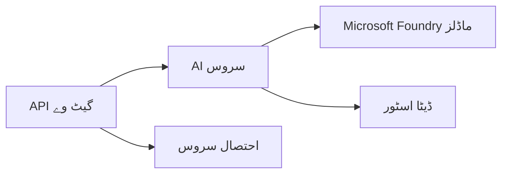

# باب 8: پروڈکشن اور انٹرپرائز پیٹرنز

**📚 کورس**: [AZD برائے مبتدی](../../README.md) | **⏱️ دورانیہ**: 2-3 گھنٹے | **⭐ پیچیدگی**: جدید

---

## جائزہ

یہ باب انٹرپرائز کے لیے تیار کئے گئے تعیناتی کے پیٹرنز، سیکیورٹی سختی، مانیٹرنگ، اور پروڈکشن AI کاموں کے لیے لاگت کی بہتری کو کور کرتا ہے۔

> جون 2026 میں `azd 1.25.6` کے خلاف تصدیق شدہ۔

## سیکھنے کے مقاصد

اس باب کو مکمل کرنے کے بعد، آپ:
- کثیر علاقائی مزاحم ایپلیکیشنز تعینات کریں گے
- انٹرپرائز سیکیورٹی پیٹرنز نافذ کریں گے
- جامع مانیٹرنگ ترتیب دیں گے
- بڑے پیمانے پر لاگت کی بہترکاری کریں گے
- AZD کے ساتھ CI/CD پائپ لائن سیٹ اپ کریں گے

---

## 📚 اسباق

| # | سبق | وضاحت | وقت |
|---|--------|-------------|------|
| 1 | [پروڈکشن AI طریقے](production-ai-practices.md) | انٹرپرائز تعیناتی کے پیٹرنز | 90 منٹ |

---

## 🚀 پروڈکشن چیک لسٹ

- [ ] مزاحمت کے لیے کثیر علاقائی تعیناتی
- [ ] تصدیق کے لیے منیجڈ شناخت (کوئی کیز نہیں)
- [ ] مانیٹرنگ کے لیے ایپلیکیشن انسائٹس
- [ ] لاگت کے بجٹ اور انتباہات ترتیب دیے گئے
- [ ] سیکیورٹی اسکیننگ فعال
- [ ] CI/CD پائپ لائن انٹیگریشن
- [ ] آفت کی بحالی کا منصوبہ

---

## 🏗️ تعمیراتی پیٹرنز

### پیٹرن 1: مائیکروسروسز AI



### پیٹرن 2: ایونٹ ڈرائیون AI


---

## 🔐 سیکیورٹی کی بہترین طریقہ کار

```bicep
// Use managed identity
identity: {
  type: 'SystemAssigned'
}

// Private endpoints for AI services
properties: {
  publicNetworkAccess: 'Disabled'
  networkAcls: {
    defaultAction: 'Deny'
  }
}
```

---

## 💰 لاگت کی بہترکاری

| حکمت عملی | بچت |
|----------|---------|
| زیرو تک پیمانہ (کنٹینر ایپس) | 60-80% |
| ترقی کے لیے استعمال کے مطابق طبقات | 50-70% |
| شیڈول شدہ پیمانے | 30-50% |
| مختص شدہ گنجائش | 20-40% |

```bash
# بجٹ انتباہات سیٹ کریں
az consumption budget create \
  --budget-name "AI-Budget" \
  --amount 500 \
  --category Cost \
  --time-grain Monthly
```

---

## 📊 مانیٹرنگ سیٹ اپ

```bash
# لاگز کی ترسیل
azd monitor --logs

# ایپلیکیشن انسائٹس چیک کریں
azd monitor --overview

# میٹرکس دیکھیں
az monitor metrics list --resource <resource-id>
```

---

## 🔗 نیویگیشن

| سمت | باب |
|-----------|---------|
| **پچھلا** | [باب 7: مسائل کا حل](../chapter-07-troubleshooting/README.md) |
| **کورس مکمل** | [کورس ہوم](../../README.md) |

---

## 📖 متعلقہ وسائل

- [AI ایجنٹس گائیڈ](../chapter-02-ai-development/agents.md)
- [ایپلیکیشن انسائٹس](../chapter-06-pre-deployment/application-insights.md)
- [کثیر ایجنٹ حل](../chapter-05-multi-agent/README.md)
- [مائیکروسروسز کی مثال](../../examples/microservices/README.md)

---

<!-- CO-OP TRANSLATOR DISCLAIMER START -->
**ڈس کلیمر**:
یہ دستاویز AI ترجمہ سروس [Co-op Translator](https://github.com/Azure/co-op-translator) کے ذریعے ترجمہ کی گئی ہے۔ جبکہ ہم درستگی کے لیے کوشاں ہیں، براہ کرم اس بات سے آگاہ رہیں کہ خودکار ترجمے میں غلطیاں یا عدم درستیاں ہو سکتی ہیں۔ اصل دستاویز اپنے مادری زبان میں مستند ماخذ سمجھی جائے گی۔ حساس معلومات کے لیے پیشہ ور انسانی ترجمہ کی سفارش کی جاتی ہے۔ اس ترجمے کے استعمال سے پیدا ہونے والی کسی بھی غلط فہمی یا غلط تشریح کی ذمہ داری ہم قبول نہیں کرتے۔
<!-- CO-OP TRANSLATOR DISCLAIMER END -->