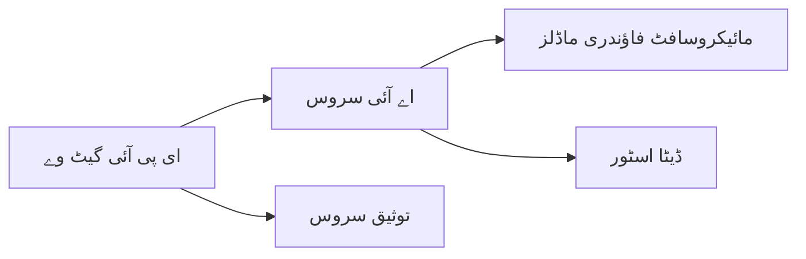

# باب 8: پیداواری اور صنعتی نمونے

**📚 کورس**: [AZD برائے مبتدیان](../../README.md) | **⏱️ دورانیہ**: 2-3 گھنٹے | **⭐ پیچیدگی**: اعلیٰ

---

## جائزہ

یہ باب صنعتی تیار ڈیپلائمنٹ نمونوں، سیکیورٹی مضبوطی، نگرانی، اور پیداواری AI ورک لوڈز کے لئے لاگت کی اصلاح کو محیط کرتا ہے۔

## سیکھنے کے مقاصد

اس باب کو مکمل کرنے کے بعد، آپ:
- کثیر خطوں میں مزاحم ایپلیکیشنز کو تعینات کریں گے
- صنعتی سیکیورٹی نمونے نافذ کریں گے
- جامع نگرانی تشکیل دیں گے
- پیمانے پر لاگت کو بہتر بنائیں گے
- AZD کے ساتھ CI/CD پائپ لائن قائم کریں گے

---

## 📚 اسباق

| # | سبق | وضاحت | وقت |
|---|--------|-------------|------|
| 1 | [پیداواری AI طریقہ کار](production-ai-practices.md) | صنعتی تعیناتی نمونے | 90 منٹ |

---

## 🚀 پیداواری چیک لسٹ

- [ ] مزاحمت کے لیے کثیر خطوں میں تعیناتی
- [ ] تصدیق کے لیے منظم شناخت (کوئی کیز نہیں)
- [ ] نگرانی کے لیے ایپلیکیشن انسائٹس
- [ ] لاگت کے بجٹ اور الرٹس تشکیل دیے گئے
- [ ] سیکیورٹی اسکیننگ فعال کی گئی
- [ ] CI/CD پائپ لائن انضمام
- [ ] آفت کی صورت میں بحالی کا منصوبہ

---

## 🏗️ ساختی نمونے

### نمونہ 1: مائیکرو سروسز AI


### نمونہ 2: ایونٹ پر مبنی AI


---

## 🔐 سیکیورٹی کے بہترین طریقے

```bicep
// Use managed identity
identity: {
  type: 'SystemAssigned'
}

// Private endpoints for AI services
properties: {
  publicNetworkAccess: 'Disabled'
  networkAcls: {
    defaultAction: 'Deny'
  }
}
```

---

## 💰 لاگت کی اصلاح

| حکمت عملی | بچت |
|----------|---------|
| صفر تک اسکیل کریں (کنٹینر ایپلیکیشنز) | 60-80% |
| ڈویلپمنٹ کے لیے مصرف پرتیں استعمال کریں | 50-70% |
| شیڈولڈ اسکیلنگ | 30-50% |
| مخصوص صلاحیت | 20-40% |

```bash
# بجٹ کی اطلاع مقرر کریں
az consumption budget create \
  --budget-name "AI-Budget" \
  --amount 500 \
  --category Cost \
  --time-grain Monthly
```

---

## 📊 نگرانی کا قیام

```bash
# لاگز کو دھارے کی صورت میں دکھائیں
azd monitor --logs

# ایپلیکیشن انسائٹس چیک کریں
azd monitor

# میٹرکس دیکھیں
az monitor metrics list --resource <resource-id>
```

---

## 🔗 نیویگیشن

| سمت | باب |
|-----------|---------|
| **پچھلا** | [باب 7: مسائل حل کرنا](../chapter-07-troubleshooting/README.md) |
| **کورس مکمل** | [کورس ہوم](../../README.md) |

---

## 📖 متعلقہ وسائل

- [AI ایجنٹس کی رہنمائی](../chapter-02-ai-development/agents.md)
- [ایپلیکیشن انسائٹس](../chapter-06-pre-deployment/application-insights.md)
- [کثیر ایجنٹ حل](../chapter-05-multi-agent/README.md)
- [مائیکرو سروسز مثال](../../examples/microservices/README.md)

---

<!-- CO-OP TRANSLATOR DISCLAIMER START -->
**دستخط**:  
یہ دستاویز AI ترجمہ سروس [Co-op Translator](https://github.com/Azure/co-op-translator) کا استعمال کرتے ہوئے ترجمہ کی گئی ہے۔ اگرچہ ہم درستگی کے لیے کوشاں ہیں، براہ کرم آگاہ رہیں کہ خودکار ترجمے میں غلطیاں یا عدم صحت ہو سکتی ہے۔ اصل دستاویز اپنی مادری زبان میں معتبر ذریعہ سمجھی جانی چاہیے۔ اہم معلومات کے لیے، پیشہ ورانہ انسانی ترجمہ تجویز کیا جاتا ہے۔ ہم اس ترجمہ کے استعمال سے پیدا ہونے والی کسی بھی غلط فہمی یا غلط تشریح کے لیے ذمہ دار نہیں ہیں۔
<!-- CO-OP TRANSLATOR DISCLAIMER END -->