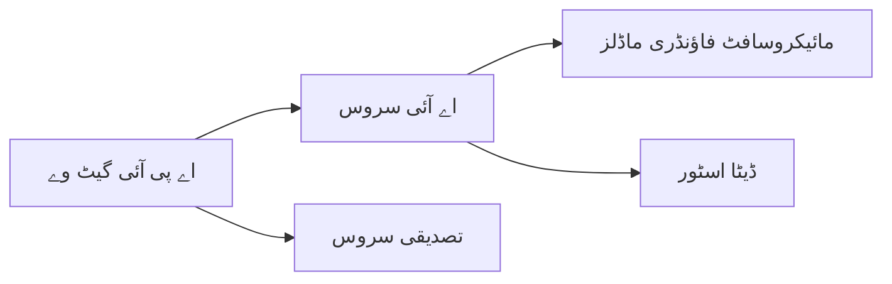

# باب 8: پیداوار اور انٹرپرائز پیٹرنز

**📚 کورس**: [AZD شروعات کرنے والوں کے لئے](../../README.md) | **⏱️ دورانیہ**: 2-3 گھنٹے | **⭐ پیچیدگی**: اعلیٰ

---

## جائزہ

یہ باب انٹرپرائز کے لئے تیار شدہ تعیناتی کے پیٹرنز، سیکیورٹی مضبوطی، مانیٹرنگ، اور پیداوار کے AI ورک لوڈز کے لئے لاگت کی بہتری کا احاطہ کرتا ہے۔

> `azd 1.27.1` کے ساتھ جولائی 2026 میں توثیق شدہ۔

## سیکھنے کے مقاصد

اس باب کو مکمل کرکے، آپ:
- کثیرالخطہ متحمل ایپلیکیشنز کو تعینات کریں گے
- انٹرپرائز سیکیورٹی پیٹرنز کو نافذ کریں گے
- جامع مانیٹرنگ کو ترتیب دیں گے
- پیمانے پر لاگت کو بہتر بنائیں گے
- AZD کے ساتھ CI/CD پائپ لائنز قائم کریں گے

---

## 📚 اسباق

| # | سبق | وضاحت | وقت |
|---|--------|-------------|------|
| 1 | [پیداوار AI طریقہ کار](production-ai-practices.md) | انٹرپرائز تعیناتی کے پیٹرنز | 90 منٹ |

---

## 🚀 پیداوار چیک لسٹ

- [ ] کثیرالخطہ تعیناتی برائے متحمل مزاحمت
- [ ] توثیق کے لیے منظم شناخت (کوئی چابیاں نہیں)
- [ ] مانیٹرنگ کے لیے ایپلیکیشن انسائٹس
- [ ] لاگت کے بجٹس اور الرٹس کی ترتیب
- [ ] سیکیورٹی اسکیننگ فعال
- [ ] CI/CD پائپ لائن انضمام
- [ ] آفت سے بحالی کا منصوبہ

---

## 🏗️ فن تعمیر کے پیٹرنز

### پیٹرن 1: مائیکروسروسز AI



### پیٹرن 2: ایونٹ ڈرائیون AI


---

## 🔐 سیکیورٹی کی بہترین مشقیں

```bicep
// Use managed identity
identity: {
  type: 'SystemAssigned'
}

// Private endpoints for AI services
properties: {
  publicNetworkAccess: 'Disabled'
  networkAcls: {
    defaultAction: 'Deny'
  }
}
```

---

## 💰 لاگت کی بہتری

| حکمت عملی | بچت |
|----------|---------|
| صفر تک پیمانہ (کنٹینر ایپس) | 60-80% |
| ترقیاتی استعمال کے لیے کنزیومر ٹیرز | 50-70% |
| شیڈیول شدہ پیمانہ | 30-50% |
| مخصوص گنجائش | 20-40% |

```bash
# بجٹ الرٹس سیٹ کریں
az consumption budget create \
  --budget-name "AI-Budget" \
  --amount 500 \
  --category Cost \
  --time-grain Monthly
```

---

## 📊 مانیٹرنگ کی ترتیب

```bash
# لاگز کو اسٹریم کریں
azd monitor --logs

# ایپلیکیشن انسائٹس چیک کریں
azd monitor --overview

# میٹرکس دیکھیں
az monitor metrics list --resource <resource-id>
```

---

## 🔗 نیوی گیشن

| سمت | باب |
|-----------|---------|
| **پچھلا** | [باب 7: مسائل کا حل](../chapter-07-troubleshooting/README.md) |
| **کورس مکمل** | [کورس ہوم](../../README.md) |

---

## 📖 متعلقہ وسائل

- [AI ایجنٹس گائیڈ](../chapter-02-ai-development/agents.md)
- [ایپلیکیشن انسائٹس](../chapter-06-pre-deployment/application-insights.md)
- [کثیر ایجنٹ حل](../chapter-05-multi-agent/README.md)
- [مائیکروسروسز کی مثال](../../examples/microservices/README.md)

---

<!-- CO-OP TRANSLATOR DISCLAIMER START -->
**ڈس کلیمر**:
یہ دستاویز AI ترجمہ سروس [Co-op Translator](https://github.com/Azure/co-op-translator) کے ذریعے ترجمہ کی گئی ہے۔ جبکہ ہم درستگی کے لیے کوشاں ہیں، براہ کرم اس بات سے آگاہ رہیں کہ خودکار ترجمے میں غلطیاں یا عدم درستیاں ہو سکتی ہیں۔ اصل دستاویز اپنے مادری زبان میں مستند ماخذ سمجھی جائے گی۔ حساس معلومات کے لیے پیشہ ور انسانی ترجمہ کی سفارش کی جاتی ہے۔ اس ترجمے کے استعمال سے پیدا ہونے والی کسی بھی غلط فہمی یا غلط تشریح کی ذمہ داری ہم قبول نہیں کرتے۔
<!-- CO-OP TRANSLATOR DISCLAIMER END -->