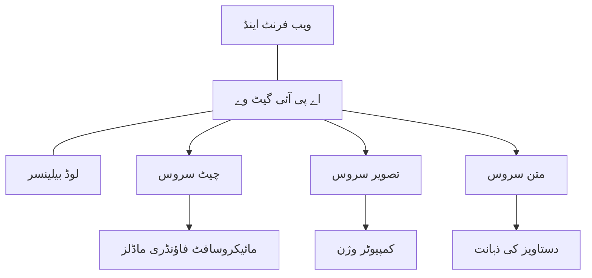

# پروڈکشن AI ورک لوڈ کی بہترین مشقیں AZD کے ساتھ

**باب کی تشریح:**
- **📚 کورس ہوم**: [AZD For Beginners](../../README.md)
- **📖 موجودہ باب**: باب 8 - پروڈکشن اور انٹرپرائز پیٹرنز
- **⬅️ پچھلا باب**: [باب 7: مسائل حل کرنا](../chapter-07-troubleshooting/debugging.md)
- **⬅️ متعلقہ موضوع**: [AI Workshop Lab](ai-workshop-lab.md)
- **🎯 کورس مکمل**: [AZD For Beginners](../../README.md)

## جائزہ

یہ گائیڈ Azure Developer CLI (AZD) استعمال کرتے ہوئے پروڈکشن کے قابل AI ورک لوڈ کی تعیناتی کے جامع بہترین طریقے فراہم کرتی ہے۔ Microsoft Foundry Discord کمیونٹی کی رائے اور حقیقی دنیا کے صارفین کی تعیناتیوں کی بنیاد پر، یہ مشقیں پروڈکشن AI سسٹمز میں سب سے عام چیلنجز کو حل کرتی ہیں۔

## کلیدی چیلنجز جن کا مقابلہ کیا گیا ہے

ہماری کمیونٹی کے پول کے نتائج کی بنیاد پر، یہ سب سے بڑے چیلنجز ہیں جن کا سامنا ڈویلپرز کو ہوتا ہے:

- **45%** ملٹی سروس AI تعیناتیاں چلانے میں دشواری کا سامنا
- **38%** کریڈینشل اور سیکرٹ مینجمنٹ کے مسائل
- **35%** پروڈکشن کے لئے تیار ہونے اور اسکیل کرنے میں مشکلات
- **32%** بہتر لاگت کی اصلاح کی حکمت عملیاں چاہِیں
- **29%** بہتری شدہ مانیٹرنگ اور ٹربل شوٹنگ درکار ہے

## پروڈکشن AI کے لیے آرکیٹیکچر پیٹرنز

### پیٹرن 1: مائیکروسروسز AI آرکیٹیکچر

**استعمال کب کریں**: متعدد صلاحیتوں والے پیچیدہ AI اطلاقات کے لیے


**AZD نفاذ**:

```yaml
# azure.yaml
name: enterprise-ai-platform
services:
  web:
    project: ./web
    host: staticwebapp
  api-gateway:
    project: ./api-gateway
    host: containerapp
  chat-service:
    project: ./services/chat
    host: containerapp
  vision-service:
    project: ./services/vision
    host: containerapp
  text-service:
    project: ./services/text
    host: containerapp
```

### پیٹرن 2: ایونٹ پر مبنی AI پراسیسنگ

**استعمال کب کریں**: بیچ پراسیسنگ، دستاویز تجزیہ، غیر متزامن ورک فلو

```bicep
// Event Hub for AI processing pipeline
resource eventHub 'Microsoft.EventHub/namespaces@2023-01-01-preview' = {
  name: eventHubNamespaceName
  location: location
  sku: {
    name: 'Standard'
    tier: 'Standard'
    capacity: 1
  }
}

// Service Bus for reliable message processing
resource serviceBus 'Microsoft.ServiceBus/namespaces@2022-10-01-preview' = {
  name: serviceBusNamespaceName
  location: location
  sku: {
    name: 'Premium'
    tier: 'Premium'
    capacity: 1
  }
}

// Function App for processing
resource functionApp 'Microsoft.Web/sites@2023-01-01' = {
  name: functionAppName
  location: location
  kind: 'functionapp,linux'
  properties: {
    siteConfig: {
      appSettings: [
        {
          name: 'FUNCTIONS_EXTENSION_VERSION'
          value: '~4'
        }
        {
          name: 'AZURE_OPENAI_ENDPOINT'
          value: '@Microsoft.KeyVault(VaultName=${keyVault.name};SecretName=openai-endpoint)'
        }
      ]
    }
  }
}
```

## AI ایجنٹ کی صحت کے بارے میں سوچنا

جب کوئی روایتی ویب ایپ خراب ہوتی ہے، تو علامات مشہور ہوتی ہیں: ایک صفحہ لوڈ نہیں ہوتا، API میں غلطی آتی ہے، یا تعیناتی ناکام ہوجاتی ہے۔ AI سے چلنے والی ایپلیکیشنز بھی ان تمام طریقوں سے خراب ہو سکتی ہیں—لیکن وہ مزید نازک انداز میں خراب بھی ہو سکتی ہیں جس سے واضح نقصانات ظاہر نہیں ہوتے۔

یہ سیکشن آپ کو AI ورک لوڈ کو مانیٹر کرنے کے لیے ذہنی ماڈل بنانے میں مدد دیتا ہے تاکہ جب چیزیں ٹھیک نہ لگیں تو آپ جان سکیں کہاں دیکھنا ہے۔

### ایجنٹ کی صحت روایتی ایپ کی صحت سے کیسے مختلف ہے

ایک روایتی ایپ یا تو کام کرتی ہے یا نہیں۔ AI ایجنٹ کام کرتا ہوا نظر آ سکتا ہے مگر خراب نتائج دے سکتا ہے۔ ایجنٹ کی صحت کو دو سطحوں میں سوچیں:

| سطح | کیا دیکھنا ہے | کہاں دیکھنا ہے |
|-------|--------------|---------------|
| **انفراسٹرکچر کی صحت** | کیا سروس چل رہی ہے؟ کیا وسائل مہیا کیے گئے ہیں؟ کیا اینڈپوائنٹس قابل رسائی ہیں؟ | `azd monitor`، Azure پورٹل کا وسائل کی صحت، کنٹینر/ایپ کے لاگز |
| **رویئے کی صحت** | کیا ایجنٹ درست جواب دے رہا ہے؟ کیا جوابات وقت پر ہیں؟ کیا ماڈل کو صحیح طور پر کال کیا جا رہا ہے؟ | ایپلیکیشن انسائٹس ٹریسز، ماڈل کال کی تاخیر کے میٹرکس، جوابی معیار کے لاگز |

انفراسٹرکچر کی صحت جانی پہچانی ہے—یہ کسی بھی azd ایپ کے لیے ایک جیسی ہے۔ رویے کی صحت AI ورک لوڈز کی طرف سے نیا اضافہ ہے۔

### جب AI ایپس توقعات کے مطابق کام نہ کریں تو کہاں دیکھیں

اگر آپ کی AI ایپ وہ نتائج نہیں دے رہی جو آپ توقع کرتے ہیں، تو یہ تصوراتی چیک لسٹ ہے:

1. **بنیادی باتوں سے شروع کریں۔** کیا ایپ چل رہی ہے؟ کیا یہ اپنی انحصار کو پہنچ سکتی ہے؟ `azd monitor` اور وسائل کی صحت چیک کریں جیسے کہ آپ کسی بھی ایپ کے لیے کرتے ہیں۔
2. **ماڈل کنکشن چیک کریں۔** کیا آپ کی ایپلیکیشن کامیابی سے AI ماڈل کو کال کر رہی ہے؟ ناکام یا ٹائم آؤٹ ماڈل کالز AI ایپس کے مسائل کی سب سے عام وجہ ہیں اور یہ آپ کی ایپلیکیشن کے لاگز میں ظاہر ہوں گی۔
3. **دیکھیں کہ ماڈل کیا وصول کر رہا ہے۔** AI کے جوابات ان پٹ (پرومپٹ اور کسی بھی حاصل شدہ سیاق و سباق) پر منحصر ہوتے ہیں۔ اگر آؤٹ پٹ غلط ہے، تو ان پٹ عموماً غلط ہوتا ہے۔ چیک کریں کہ آیا آپ کی ایپ ماڈل کو درست ڈیٹا بھیج رہی ہے۔
4. **جوابی تاخیر کا جائزہ لیں۔** AI ماڈل کی کالز عام API کالز سے سست ہوتی ہیں۔ اگر آپ کی ایپ سُست محسوس ہو رہی ہے، تو دیکھیں کیا ماڈل کے جواب کے وقت میں اضافہ ہوا ہے—یہ تھرٹلنگ، صلاحیت کی حدوں یا علاقے کی بھیڑ کا اشارہ ہوسکتا ہے۔
5. **لاگت کے اشارے دیکھیں۔** ٹوکن کے استعمال یا API کالز میں غیر متوقع اضافہ کسی لوپ، غلط کنفیگرڈ پرومپٹ، یا زیادہ کوششوں کی نشاندہی کر سکتا ہے۔

آپ کو فوراً مشاہداتی آلات میں مہارت حاصل کرنے کی ضرورت نہیں ہے۔ اہم بات یہ ہے کہ AI ایپلیکیشنز کے رویے کی ایک اضافی پرت کی مانیٹرنگ ضروری ہے، اور azd کا بلٹ ان مانیٹرنگ (`azd monitor`) دونوں پرتوں کی تحقیقات کے لیے ایک شروعاتی نقطہ فراہم کرتا ہے۔

---

## سیکیورٹی کی بہترین مشقیں

### 1. زیرو ٹرسٹ سیکیورٹی ماڈل

**نفاذ کی حکمت عملی**:
- تصدیق کے بغیر سروس سے سروس کوئی کمیونیکیشن نہیں
- تمام API کالز کے لیے منیجڈ شناختیں استعمال ہوں
- نجی اینڈپوائنٹس کے ساتھ نیٹ ورک کی الگ تھلگ صورتحال
- کم سے کم اختیارات کی رسائی کنٹرول

```bicep
// Managed Identity for each service
resource chatServiceIdentity 'Microsoft.ManagedIdentity/userAssignedIdentities@2023-01-31' = {
  name: 'chat-service-identity'
  location: location
}

// Role assignments with minimal permissions
resource openAIUserRole 'Microsoft.Authorization/roleAssignments@2022-04-01' = {
  scope: openAIAccount
  name: guid(openAIAccount.id, chatServiceIdentity.id, openAIUserRoleDefinitionId)
  properties: {
    roleDefinitionId: subscriptionResourceId('Microsoft.Authorization/roleDefinitions', '5e0bd9bd-7b93-4f28-af87-19fc36ad61bd')
    principalId: chatServiceIdentity.properties.principalId
    principalType: 'ServicePrincipal'
  }
}
```

### 2. محفوظ سیکرٹ مینجمنٹ

**کی والٹ انٹیگریشن پیٹرن**:

```bicep
// Key Vault with proper access policies
resource keyVault 'Microsoft.KeyVault/vaults@2023-02-01' = {
  name: keyVaultName
  location: location
  properties: {
    tenantId: tenant().tenantId
    sku: {
      family: 'A'
      name: 'premium'  // Use premium for production
    }
    enableRbacAuthorization: true  // Use RBAC instead of access policies
    enablePurgeProtection: true    // Prevent accidental deletion
    enableSoftDelete: true
    softDeleteRetentionInDays: 90
  }
}

// Store all AI service credentials
resource openAIKeySecret 'Microsoft.KeyVault/vaults/secrets@2023-02-01' = {
  parent: keyVault
  name: 'openai-api-key'
  properties: {
    value: openAIAccount.listKeys().key1
    attributes: {
      enabled: true
    }
  }
}
```

### 3. نیٹ ورک سیکیورٹی

**پرائیویٹ اینڈپوائنٹ کنفیگریشن**:

```bicep
// Virtual Network for AI services
resource virtualNetwork 'Microsoft.Network/virtualNetworks@2023-04-01' = {
  name: vnetName
  location: location
  properties: {
    addressSpace: {
      addressPrefixes: ['10.0.0.0/16']
    }
    subnets: [
      {
        name: 'ai-services-subnet'
        properties: {
          addressPrefix: '10.0.1.0/24'
          privateEndpointNetworkPolicies: 'Disabled'
        }
      }
      {
        name: 'app-services-subnet'
        properties: {
          addressPrefix: '10.0.2.0/24'
          delegations: [
            {
              name: 'Microsoft.Web/serverFarms'
              properties: {
                serviceName: 'Microsoft.Web/serverFarms'
              }
            }
          ]
        }
      }
    ]
  }
}

// Private endpoints for all AI services
resource openAIPrivateEndpoint 'Microsoft.Network/privateEndpoints@2023-04-01' = {
  name: '${openAIAccountName}-pe'
  location: location
  properties: {
    subnet: {
      id: virtualNetwork.properties.subnets[0].id
    }
    privateLinkServiceConnections: [
      {
        name: 'openai-connection'
        properties: {
          privateLinkServiceId: openAIAccount.id
          groupIds: ['account']
        }
      }
    ]
  }
}
```

## کارکردگی اور اسکیلنگ

### 1. خودکار اسکیلنگ کی حکمت عملیاں

**کنٹینر ایپ کی خودکار اسکیلنگ**:

```bicep
resource containerApp 'Microsoft.App/containerApps@2023-05-01' = {
  name: containerAppName
  location: location
  properties: {
    configuration: {
      ingress: {
        external: true
        targetPort: 8000
        transport: 'http'
      }
    }
    template: {
      scale: {
        minReplicas: 2  // Always have 2 instances minimum
        maxReplicas: 50 // Scale up to 50 for high load
        rules: [
          {
            name: 'http-scaling'
            http: {
              metadata: {
                concurrentRequests: '20'  // Scale when >20 concurrent requests
              }
            }
          }
          {
            name: 'cpu-scaling'
            custom: {
              type: 'cpu'
              metadata: {
                type: 'Utilization'
                value: '70'  // Scale when CPU >70%
              }
            }
          }
        ]
      }
    }
  }
}
```

### 2. کیشنگ کی حکمت عملیاں

**AI جوابات کے لیے Redis کیش**:

```bicep
// Redis Premium for production workloads
resource redisCache 'Microsoft.Cache/redis@2023-04-01' = {
  name: redisCacheName
  location: location
  properties: {
    sku: {
      name: 'Premium'
      family: 'P'
      capacity: 1
    }
    enableNonSslPort: false
    minimumTlsVersion: '1.2'
    redisConfiguration: {
      'maxmemory-policy': 'allkeys-lru'
    }
    // Enable clustering for high availability
    redisVersion: '6.0'
    shardCount: 2
  }
}

// Cache configuration in application
var cacheConnectionString = '${redisCache.properties.hostName}:6380,password=${redisCache.listKeys().primaryKey},ssl=True,abortConnect=False'
```

### 3. لوڈ بیلنسنگ اور ٹریفک مینجمنٹ

**WAF کے ساتھ اپلیکیشن گیٹ وے**:

```bicep
// Application Gateway with Web Application Firewall
resource applicationGateway 'Microsoft.Network/applicationGateways@2023-04-01' = {
  name: appGatewayName
  location: location
  properties: {
    sku: {
      name: 'WAF_v2'
      tier: 'WAF_v2'
      capacity: 2
    }
    webApplicationFirewallConfiguration: {
      enabled: true
      firewallMode: 'Prevention'
      ruleSetType: 'OWASP'
      ruleSetVersion: '3.2'
    }
    // Backend pools for AI services
    backendAddressPools: [
      {
        name: 'ai-services-pool'
        properties: {
          backendAddresses: [
            {
              fqdn: '${containerApp.properties.configuration.ingress.fqdn}'
            }
          ]
        }
      }
    ]
  }
}
```

## 💰 لاگت کی اصلاح

### 1. وسائل کی مناسب مقدار کا تعین

**ماحول کے مخصوص کنفیگریشنز**:

```bash
# ترقیاتی ماحول
azd env new development
azd env set AZURE_OPENAI_SKU "S0"
azd env set AZURE_OPENAI_CAPACITY 10
azd env set AZURE_SEARCH_SKU "basic"
azd env set CONTAINER_CPU 0.5
azd env set CONTAINER_MEMORY 1.0

# پیداواری ماحول
azd env new production
azd env set AZURE_OPENAI_SKU "S0"
azd env set AZURE_OPENAI_CAPACITY 100
azd env set AZURE_SEARCH_SKU "standard"
azd env set CONTAINER_CPU 2.0
azd env set CONTAINER_MEMORY 4.0
```

### 2. لاگت مانیٹرنگ اور بجٹ

```bicep
// Cost management and budgets
resource budget 'Microsoft.Consumption/budgets@2023-05-01' = {
  name: 'ai-workload-budget'
  properties: {
    timePeriod: {
      startDate: '2024-01-01'
      endDate: '2024-12-31'
    }
    timeGrain: 'Monthly'
    amount: 2000  // $2000 monthly budget
    category: 'Cost'
    notifications: {
      warning: {
        enabled: true
        operator: 'GreaterThan'
        threshold: 80
        contactEmails: [
          'finance@company.com'
          'engineering@company.com'
        ]
        contactRoles: [
          'Owner'
          'Contributor'
        ]
      }
      critical: {
        enabled: true
        operator: 'GreaterThan'
        threshold: 95
        contactEmails: [
          'cto@company.com'
        ]
      }
    }
  }
}
```

### 3. ٹوکن استعمال کی اصلاح

**OpenAI لاگت مینجمنٹ**:

```typescript
// درخواست کی سطح پر ٹوکن کی بہتری
class TokenOptimizer {
  private readonly maxTokens = 4000;
  private readonly reserveTokens = 500;
  
  optimizePrompt(userInput: string, context: string): string {
    const availableTokens = this.maxTokens - this.reserveTokens;
    const estimatedTokens = this.estimateTokens(userInput + context);
    
    if (estimatedTokens > availableTokens) {
      // تناظر کو مختصر کریں، صارف کی ان پٹ نہیں
      context = this.truncateContext(context, availableTokens - this.estimateTokens(userInput));
    }
    
    return `${context}\n\nUser: ${userInput}`;
  }
  
  private estimateTokens(text: string): number {
    // تخمینی اندازہ: 1 ٹوکن ≈ 4 حروف
    return Math.ceil(text.length / 4);
  }
}
```

## مانیٹرنگ اور مشاہدہ

### 1. جامع ایپلیکیشن انسائٹس

```bicep
// Application Insights with advanced features
resource applicationInsights 'Microsoft.Insights/components@2020-02-02' = {
  name: applicationInsightsName
  location: location
  kind: 'web'
  properties: {
    Application_Type: 'web'
    WorkspaceResourceId: logAnalyticsWorkspace.id
    SamplingPercentage: 100  // Full sampling for AI apps
    DisableIpMasking: false  // Enable for security
  }
}

// Custom metrics for AI operations
resource aiMetricAlerts 'Microsoft.Insights/metricAlerts@2018-03-01' = {
  name: 'ai-high-error-rate'
  location: 'global'
  properties: {
    description: 'Alert when AI service error rate is high'
    severity: 2
    enabled: true
    scopes: [
      applicationInsights.id
    ]
    evaluationFrequency: 'PT1M'
    windowSize: 'PT5M'
    criteria: {
      'odata.type': 'Microsoft.Azure.Monitor.SingleResourceMultipleMetricCriteria'
      allOf: [
        {
          name: 'high-error-rate'
          metricName: 'requests/failed'
          operator: 'GreaterThan'
          threshold: 10
          timeAggregation: 'Count'
        }
      ]
    }
  }
}
```

### 2. AI مخصوص مانیٹرنگ

**AI میٹرکس کے لیے کسٹم ڈیش بورڈز**:

```json
// Dashboard configuration for AI workloads
{
  "dashboard": {
    "name": "AI Application Monitoring",
    "tiles": [
      {
        "name": "OpenAI Request Volume",
        "query": "requests | where name contains 'openai' | summarize count() by bin(timestamp, 5m)"
      },
      {
        "name": "AI Response Latency",
        "query": "requests | where name contains 'openai' | summarize avg(duration) by bin(timestamp, 5m)"
      },
      {
        "name": "Token Usage",
        "query": "customMetrics | where name == 'openai_tokens_used' | summarize sum(value) by bin(timestamp, 1h)"
      },
      {
        "name": "Cost per Hour",
        "query": "customMetrics | where name == 'openai_cost' | summarize sum(value) by bin(timestamp, 1h)"
      }
    ]
  }
}
```

### 3. صحت کی جانچ اور اپ ٹائم مانیٹرنگ

```bicep
// Application Insights availability tests
resource availabilityTest 'Microsoft.Insights/webtests@2022-06-15' = {
  name: 'ai-app-availability-test'
  location: location
  tags: {
    'hidden-link:${applicationInsights.id}': 'Resource'
  }
  properties: {
    SyntheticMonitorId: 'ai-app-availability-test'
    Name: 'AI Application Availability Test'
    Description: 'Tests AI application endpoints'
    Enabled: true
    Frequency: 300  // 5 minutes
    Timeout: 120    // 2 minutes
    Kind: 'ping'
    Locations: [
      {
        Id: 'us-east-2-azr'
      }
      {
        Id: 'us-west-2-azr'
      }
    ]
    Configuration: {
      WebTest: '''
        <WebTest Name="AI Health Check" 
                 Id="8d2de8d2-a2b0-4c2e-9a0d-8f9c9a0b8c8d" 
                 Enabled="True" 
                 CssProjectStructure="" 
                 CssIteration="" 
                 Timeout="120" 
                 WorkItemIds="" 
                 xmlns="http://microsoft.com/schemas/VisualStudio/TeamTest/2010" 
                 Description="" 
                 CredentialUserName="" 
                 CredentialPassword="" 
                 PreAuthenticate="True" 
                 Proxy="default" 
                 StopOnError="False" 
                 RecordedResultFile="" 
                 ResultsLocale="">
          <Items>
            <Request Method="GET" 
                     Guid="a5f10126-e4cd-570d-961c-cea43999a200" 
                     Version="1.1" 
                     Url="${webApp.properties.defaultHostName}/health" 
                     ThinkTime="0" 
                     Timeout="120" 
                     ParseDependentRequests="True" 
                     FollowRedirects="True" 
                     RecordResult="True" 
                     Cache="False" 
                     ResponseTimeGoal="0" 
                     Encoding="utf-8" 
                     ExpectedHttpStatusCode="200" 
                     ExpectedResponseUrl="" 
                     ReportingName="" 
                     IgnoreHttpStatusCode="False" />
          </Items>
        </WebTest>
      '''
    }
  }
}
```

## ڈیزاسٹر ریکوری اور ہائی ایویلیبیلیٹی

### 1. ملٹی ریجن تعیناتی

```yaml
# azure.yaml - Multi-region configuration
name: ai-app-multiregion
services:
  api-primary:
    project: ./api
    host: containerapp
    env:
      - AZURE_REGION=eastus
  api-secondary:
    project: ./api
    host: containerapp
    env:
      - AZURE_REGION=westus2
```

```bicep
// Traffic Manager for global load balancing
resource trafficManager 'Microsoft.Network/trafficManagerProfiles@2022-04-01' = {
  name: trafficManagerProfileName
  location: 'global'
  properties: {
    profileStatus: 'Enabled'
    trafficRoutingMethod: 'Priority'
    dnsConfig: {
      relativeName: trafficManagerProfileName
      ttl: 30
    }
    monitorConfig: {
      protocol: 'HTTPS'
      port: 443
      path: '/health'
      intervalInSeconds: 30
      toleratedNumberOfFailures: 3
      timeoutInSeconds: 10
    }
    endpoints: [
      {
        name: 'primary-endpoint'
        type: 'Microsoft.Network/trafficManagerProfiles/azureEndpoints'
        properties: {
          targetResourceId: primaryAppService.id
          endpointStatus: 'Enabled'
          priority: 1
        }
      }
      {
        name: 'secondary-endpoint'
        type: 'Microsoft.Network/trafficManagerProfiles/azureEndpoints'
        properties: {
          targetResourceId: secondaryAppService.id
          endpointStatus: 'Enabled'
          priority: 2
        }
      }
    ]
  }
}
```

### 2. ڈیٹا بیک اپ اور ریکوری

```bicep
// Backup configuration for critical data
resource backupVault 'Microsoft.DataProtection/backupVaults@2023-05-01' = {
  name: backupVaultName
  location: location
  identity: {
    type: 'SystemAssigned'
  }
  properties: {
    storageSettings: [
      {
        datastoreType: 'VaultStore'
        type: 'LocallyRedundant'
      }
    ]
  }
}

// Backup policy for AI models and data
resource backupPolicy 'Microsoft.DataProtection/backupVaults/backupPolicies@2023-05-01' = {
  parent: backupVault
  name: 'ai-data-backup-policy'
  properties: {
    policyRules: [
      {
        backupParameters: {
          backupType: 'Full'
          objectType: 'AzureBackupParams'
        }
        trigger: {
          schedule: {
            repeatingTimeIntervals: [
              'R/2024-01-01T02:00:00+00:00/P1D'  // Daily at 2 AM
            ]
          }
          objectType: 'ScheduleBasedTriggerContext'
        }
        dataStore: {
          datastoreType: 'VaultStore'
          objectType: 'DataStoreInfoBase'
        }
        name: 'BackupDaily'
        objectType: 'AzureBackupRule'
      }
    ]
  }
}
```

## ڈیو آپس اور CI/CD انٹیگریشن

### 1. GitHub Actions ورک فلو

```yaml
# .github/workflows/deploy-ai-app.yml
name: Deploy AI Application

on:
  push:
    branches: [main]
  pull_request:
    branches: [main]

jobs:
  test:
    runs-on: ubuntu-latest
    steps:
      - uses: actions/checkout@v4
      
      - name: Setup Python
        uses: actions/setup-python@v4
        with:
          python-version: '3.11'
          
      - name: Install dependencies
        run: |
          pip install -r requirements.txt
          pip install pytest
          
      - name: Run tests
        run: pytest tests/
        
      - name: AI Safety Tests
        run: |
          python scripts/test_ai_safety.py
          python scripts/validate_prompts.py

  deploy-staging:
    needs: test
    if: github.event_name == 'pull_request'
    runs-on: ubuntu-latest
    steps:
      - uses: actions/checkout@v4
      
      - name: Setup AZD
        uses: Azure/setup-azd@v2
        
      - name: Login to Azure
        uses: azure/login@v1
        with:
          creds: ${{ secrets.AZURE_CREDENTIALS }}
          
      - name: Deploy to Staging
        run: |
          azd env select staging
          azd deploy

  deploy-production:
    needs: test
    if: github.ref == 'refs/heads/main'
    runs-on: ubuntu-latest
    steps:
      - uses: actions/checkout@v4
      
      - name: Setup AZD
        uses: Azure/setup-azd@v2
        
      - name: Login to Azure
        uses: azure/login@v1
        with:
          creds: ${{ secrets.AZURE_CREDENTIALS }}
          
      - name: Deploy to Production
        run: |
          azd env select production
          azd deploy
          
      - name: Run Production Health Checks
        run: |
          python scripts/health_check.py --env production
```

### 2. انفراسٹرکچر کی توثیق

```bash
# scripts/validate_infrastructure.sh
#!/bin/bash

echo "Validating AI infrastructure deployment..."

# چیک کریں کہ تمام مطلوبہ سروسز چل رہی ہیں
services=("openai" "search" "storage" "keyvault")
for service in "${services[@]}"; do
    echo "Checking $service..."
    if ! az resource list --resource-type "Microsoft.CognitiveServices/accounts" --query "[?contains(name, '$service')]" -o tsv; then
        echo "ERROR: $service not found"
        exit 1
    fi
done

# OpenAI ماڈل کی تنصیبات کی توثیق کریں
echo "Validating OpenAI model deployments..."
models=$(az cognitiveservices account deployment list --name $AZURE_OPENAI_NAME --resource-group $AZURE_RESOURCE_GROUP --query "[].name" -o tsv)
if [[ ! $models == *"gpt-4.1-mini"* ]]; then
  echo "ERROR: Required model gpt-4.1-mini not deployed"
    exit 1
fi

# AI سروس کی کنیکٹیویٹی کا ٹیسٹ کریں
echo "Testing AI service connectivity..."
python scripts/test_connectivity.py

echo "Infrastructure validation completed successfully!"
```

## پروڈکشن ریڈینس چیک لسٹ

### سیکیورٹی ✅
- [ ] تمام سروسز منیجڈ شناختیں استعمال کریں
- [ ] سیکرٹس کی والٹ میں محفوظ ہوں
- [ ] نجی اینڈپوائنٹس کنفیگر کیے گئے ہوں
- [ ] نیٹ ورک سیکیورٹی گروپس نافذ کیے گئے ہوں
- [ ] کم سے کم اختیارات کے ساتھ RBAC ہو
- [ ] پبلک اینڈپوائنٹس پر WAF فعال ہو

### کارکردگی ✅
- [ ] خودکار اسکیلنگ کنفیگر ہو
- [ ] کیشنگ نافذ ہو
- [ ] لوڈ بیلنسنگ سیٹ اپ کیا گیا ہو
- [ ] جامد مواد کے لیے CDN ہو
- [ ] ڈیٹابیس کنکشن پولنگ ہو
- [ ] ٹوکن استعمال کی اصلاح ہو

### مانیٹرنگ ✅
- [ ] اپلیکیشن انسائٹس ترتیب دی گئی ہو
- [ ] کسٹم میٹرکس ڈیفائن کیے گئے ہوں
- [ ] الرٹنگ رولز بنائے گئے ہوں
- [ ] ڈیش بورڈ بنایا گیا ہو
- [ ] صحت کی جانچ کی گئی ہو
- [ ] لاگ کے تحفظ کی پالیسیاں ہوں

### اعتبار ✅
- [ ] ملٹی ریجن تعیناتی ہو
- [ ] بیک اپ اور ریکوری پلان ہو
- [ ] سرکٹ بریکرز نفاذ کیے گئے ہوں
- [ ] ری ٹرائی پالیسیاں کنفیگر ہوئیں
- [ ] نرمی کے ساتھ گِرنا (Graceful degradation) ہو
- [ ] صحت جانچ کے اینڈپوائنٹس ہوں

### لاگت مینجمنٹ ✅
- [ ] بجٹ الرٹس کنفیگر کیے گئے ہوں
- [ ] وسائل کی مناسب مقدار کا تعین ہو
- [ ] ڈیو/ٹیسٹ چھوٹیں لگائی گئی ہوں
- [ ] ریزروڈ انسٹینسز خریدی گئی ہوں
- [ ] لاگت مانیٹرنگ ڈیش بورڈ ہو
- [ ] باقاعدہ لاگت جائزے ہوں

### تعمیل ✅
- [ ] ڈیٹا رہائش کے تقاضے پورے کیے گئے ہوں
- [ ] آڈیٹ لاگنگ فعال ہو
- [ ] تعمیل کی پالیسیاں نافذ کی گئی ہوں
- [ ] سیکیورٹی کے بنیادی اصول نافذ کیے گئے ہوں
- [ ] باقاعدہ سیکیورٹی جائزے ہوں
- [ ] واقعہ جواب پلان ہو

## کارکردگی کے معیارات

### عام پروڈکشن میٹرکس

| میٹرک | ہدف | مانیٹرنگ |
|--------|--------|------------|
| **جوابی وقت** | 2 سیکنڈ سے کم | ایپلیکیشن انسائٹس |
| **دستیابی** | 99.9% | اپ ٹائم مانیٹرنگ |
| **غلطی کی شرح** | 0.1% سے کم | ایپلیکیشن لاگز |
| **ٹوکن استعمال** | ماہانہ $500 سے کم | لاگت مینجمنٹ |
| **یک وقت صارفین** | 1000+ | لوڈ ٹیسٹنگ |
| **ریکوری وقت** | 1 گھنٹے سے کم | ڈیزاسٹر ریکوری ٹیسٹ |

### لوڈ ٹیسٹنگ

```bash
# اے آئی ایپلیکیشنز کے لیے لوڈ ٹیسٹنگ اسکرپٹ
python scripts/load_test.py \
  --endpoint https://your-ai-app.azurewebsites.net \
  --concurrent-users 100 \
  --duration 300 \
  --ramp-up 60
```

## 🤝 کمیونٹی کی بہترین مشقیں

Microsoft Foundry Discord کمیونٹی کی رائے کی بنیاد پر:

### کمیونٹی کی طرف سے ٹاپ سفارشات:

1. **چھوٹے سے شروع کریں، آہستہ آہستہ اسکیل کریں**: بنیادی SKU سے شروع کریں اور اصل استعمال کی بنیاد پر اسکیل کریں  
2. **سب کچھ مانیٹر کریں**: پہلے دن سے جامع مانیٹرنگ سیٹ اپ کریں  
3. **سیکیورٹی کو خودکار بنائیں**: مستقل سیکیورٹی کے لیے انفراسٹرکچر کوڈ کی طرح استعمال کریں  
4. **مکمل جانچ کریں**: آپ کی پائپ لائن میں AI مخصوص ٹیسٹنگ شامل کریں  
5. **لاگت کے لیے منصوبہ بندی کریں**: ٹوکن استعمال مانیٹر کریں اور ابتدائی بجٹ الرٹس سیٹ کریں  

### عام غلطیاں جن سے بچنا چاہیے:

- ❌ کوڈ میں API کیز ہارڈ کوڈ کرنا  
- ❌ مناسب مانیٹرنگ سیٹ اپ نہ کرنا  
- ❌ لاگت کی اصلاح کو نظر انداز کرنا  
- ❌ ناکامی کے مناظر آزمانے سے گریز کرنا  
- ❌ صحت کی جانچ کے بغیر تعینات کرنا  

## AZD AI CLI کمانڈز اور ایکسٹینشنز

AZD میں AI مخصوص کمانڈز اور ایکسٹینشنز کا ایک بڑھتا ہوا مجموعہ شامل ہے جو پروڈکشن AI ورک فلو کو آسان بناتا ہے۔ یہ ٹولز مقامی ترقی اور AI ورک لوڈ کے پروڈکشن تعیناتی کے درمیان پل کا کام کرتے ہیں۔

### AI کے لیے AZD ایکسٹینشنز

AZD ایکسٹینشن سسٹم کے ذریعے AI مخصوص صلاحیتیں شامل کرتا ہے۔ ایکسٹینشنز انسٹال اور مینیج کریں:

```bash
# تمام دستیاب توسیعات کی فہرست بنائیں (بشمول AI)
azd extension list

# نصب شدہ توسیعات کی تفصیلات کا معائنہ کریں
azd extension show azure.ai.agents

# فاؤنڈری ایجنٹس توسیع انسٹال کریں
azd extension install azure.ai.agents

# فائن ٹوننگ توسیع انسٹال کریں
azd extension install azure.ai.finetune

# کسٹم ماڈلز توسیع انسٹال کریں
azd extension install azure.ai.models

# تمام نصب شدہ توسیعات کو اپ گریڈ کریں
azd extension upgrade --all
```

**دستیاب AI ایکسٹینشنز:**

| ایکسٹینشن | مقصد | اسٹیٹس |
|-----------|---------|--------|
| `azure.ai.agents` | Foundry ایجنٹ سروس مینجمنٹ | پریویو |
| `azure.ai.finetune` | Foundry ماڈل فائن ٹیوننگ | پریویو |
| `azure.ai.models` | Foundry کسٹم ماڈلز | پریویو |
| `azure.coding-agent` | کوڈنگ ایجنٹ کنفیگریشن | دستیاب |

### `azd ai agent init` کے ساتھ ایجنٹ پروجیکٹس کی شروعات

`azd ai agent init` کمانڈ Microsoft Foundry Agent Service کے ساتھ انٹیگریٹڈ پروڈکشن تیار AI ایجنٹ پروجیکٹ تیار کرتی ہے:

```bash
# ایک ایجنٹ مینیفیسٹ سے نیا ایجنٹ پروجیکٹ شروع کریں
azd ai agent init -m <manifest-path-or-uri>

# ایک مخصوص Foundry پروجیکٹ کو شروع اور ہدف بنائیں
azd ai agent init -m agent-manifest.yaml --project-id <foundry-project-id>

# ایک حسب ضرورت ماخذ ڈائرکٹری کے ساتھ شروع کریں
azd ai agent init -m agent-manifest.yaml --src ./agents/my-agent

# میزبان کے طور پر کنٹینر ایپس کو ہدف بنائیں
azd ai agent init -m agent-manifest.yaml --host containerapp
```

**اہم فلیگز:**

| فلیگ | وضاحت |
|------|-------------|
| `-m, --manifest` | آپ کے پروجیکٹ میں شامل کرنے کے لیے ایجنٹ مینفی اسٹ کا راستہ یا URI |
| `-p, --project-id` | آپ کے azd ماحول کے لیے موجودہ Microsoft Foundry پروجیکٹ آئی ڈی |
| `-s, --src` | ایجنٹ کی تعریف ڈاؤن لوڈ کرنے کے لیے ڈائریکٹری (ڈیفالٹ `src/<agent-id>`) |
| `--host` | ڈیفالٹ ہوسٹ کو اوور رائڈ کریں (مثلاً `containerapp`) |
| `-e, --environment` | استعمال کرنے کے لیے azd ماحول |

**پروڈکشن ٹپ**: `--project-id` استعمال کریں تاکہ آپ براہ راست کسی موجودہ Foundry پروجیکٹ سے کنیکٹ کر سکیں، جس سے آپ کے ایجنٹ کوڈ اور کلاؤڈ وسائل شروع ہی سے منسلک رہیں۔

### ماڈل کنٹیکسٹ پروٹوکول (MCP) `azd mcp` کے ساتھ

AZD بلٹ ان MCP سرور سپورٹ (الفا) شامل کرتا ہے، جو AI ایجنٹس اور ٹولز کو آپ کے Azure وسائل کے ساتھ معیاری پروٹوکول کے ذریعے تعامل کرنے کی اجازت دیتا ہے:

```bash
# اپنے پروجیکٹ کے لیے MCP سرور شروع کریں
azd mcp start

# ٹول کے نفاذ کے لیے موجودہ کوپائلٹ رضامندی کے قواعد کا جائزہ لیں
azd copilot consent list
```

MCP سرور آپ کے azd پروجیکٹ کے سیاق و سباق—ماحول، سروسز، اور Azure وسائل کو AI سے چلنے والے ڈیولپمنٹ ٹولز کے لیے کھولتا ہے۔ اس سے یہ ممکن ہوتا ہے:

- **AI سے مدد یافتہ تعیناتی**: کوڈنگ ایجنٹس کو آپ کی پروجیکٹ کی حالت کو دریافت کرنے اور تعیناتی شروع کرنے دیں  
- **وسائل کی دریافت**: AI ٹولز یہ دیکھ سکتے ہیں کہ آپ کی پروجیکٹ کون سے Azure وسائل استعمال کر رہی ہے  
- **ماحول کا انتظام**: ایجنٹس کو ترقی/اسٹیجنگ/پروڈکشن ماحولوں کے درمیان سوئچ کرنے کا اختیار  

### `azd infra generate` کے ساتھ انفراسٹرکچر جنریشن

پروڈکشن AI ورک لوڈز کے لیے، آپ خودکار فراہمی پر انحصار کرنے کے بجائے Infrastructure as Code کو تیار اور حسب ضرورت بنا سکتے ہیں:

```bash
# آپ کے پروجیکٹ کی تعریف سے بائسِپ/ٹیرraform فائلیں تیار کریں
azd infra generate
```

یہ IaC کو ڈسک پر لکھتا ہے تاکہ آپ:
- تعیناتی سے پہلے انفراسٹرکچر کا جائزہ اور آڈٹ کر سکیں  
- اپنی سیکیورٹی پالیسیاں شامل کریں (نیٹ ورک رولز، نجی اینڈپوائنٹس)  
- موجودہ IaC جائزہ کے عمل میں انضمام کریں  
- ایپلیکیشن کوڈ سے علیحدہ انفراسٹرکچر تبدیلیوں کو ورژن کنٹرول کریں  

### پروڈکشن لائف سائیکل ہکس

AZD ہکس آپ کو ہر تعیناتی کی زندگی کے چکر میں اپنی کسٹم منطق شامل کرنے دیتے ہیں—پروڈکشن AI ورک فلو کے لیے انتہائی اہم:

```yaml
# azure.yaml - Production hooks example
name: ai-production-app
hooks:
  preprovision:
    shell: sh
    run: scripts/validate-quotas.sh    # Check AI model quota before provisioning
  postprovision:
    shell: sh
    run: scripts/configure-networking.sh  # Set up private endpoints
  predeploy:
    shell: sh
    run: scripts/run-ai-safety-tests.sh  # Run prompt safety checks
  postdeploy:
    shell: sh
    run: scripts/smoke-test.sh           # Verify agent responses post-deploy
services:
  agent-api:
    project: ./src/agent
    host: containerapp
    hooks:
      predeploy:
        shell: sh
        run: scripts/validate-model-access.sh  # Per-service hook
```

```bash
# ترقی کے دوران ایک مخصوص ہک کو دستی طور پر چلائیں
azd hooks run predeploy
```

**AI ورک لوڈز کے لیے تجویز کردہ پروڈکشن ہکس:**

| ہک | استعمال کا کیس |
|------|----------|
| `preprovision` | AI ماڈل کی صلاحیت کے لیے سبسکرپشن کوٹہ کی تصدیق |
| `postprovision` | نجی اینڈپوائنٹس کی کنفیگریشن، ماڈل ویٹس کی تعیناتی |
| `predeploy` | AI حفاظتی ٹیسٹ چلائیں، پرومپٹ ٹیمپلیٹس کی توثیق کریں |
| `postdeploy` | ایجنٹ کے جوابات کا سمک ٹیسٹ کریں، ماڈل کنیکٹیویٹی کی جانچ کریں |

### CI/CD پائپ لائن کنفیگریشن

`azd pipeline config` استعمال کریں تاکہ آپ کا پروجیکٹ GitHub Actions یا Azure Pipelines سے محفوظ Azure تصدیق کے ساتھ جڑ جائے:

```bash
# سی آئی/سی ڈی پائپ لائن کو ترتیب دیں (تفاعلی)
azd pipeline config

# مخصوص فراہم کنندہ کے ساتھ ترتیب دیں
azd pipeline config --provider github
```

یہ کمانڈ:
- کم سے کم اختیارات کے ساتھ ایک سروس پرنسپل بناتی ہے  
- فیڈریٹڈ کریڈینشلز سیٹ اپ کرتی ہے (کوئی ذخیرہ شدہ سیکرٹس نہیں)  
- آپ کی پائپ لائن کی تعریف فائل تیار یا اپڈیٹ کرتی ہے  
- آپ کے CI/CD سسٹم میں ضروری ماحول کی متغیرات سیٹ کرتی ہے  

**پائپ لائن کنفیگریشن کے ساتھ پروڈکشن ورک فلو:**

```bash
# 1. پیداواری ماحول قائم کریں
azd env new production
azd env set AZURE_OPENAI_CAPACITY 100

# 2. پائپ لائن کو ترتیب دیں
azd pipeline config --provider github

# 3. پائپ لائن ہر دفعہ مین پر کسی بھی پوش کے دوران azd deploy چلاتی ہے
```

### `azd add` کے ساتھ کمپونینٹس شامل کرنا

موجودہ پروجیکٹ میں Azure سروسز بتدریج شامل کریں:

```bash
# نیا سروس کمپونینٹ انٹرایکٹیو طریقے سے شامل کریں
azd add
```

یہ خاص طور پر پروڈکشن AI اطلاقات کو وسیع کرنے کے لیے مفید ہے—مثلاً، ویکٹر سرچ سروس، نیا ایجنٹ اینڈپوائنٹ، یا مانیٹرنگ کمپونینٹ ایک موجودہ تعیناتی میں شامل کرنا۔

## اضافی وسائل
- **ایزور ویل-آرکیٹیکٹڈ فریم ورک**: [AI ورک لوڈ کی رہنمائی](https://learn.microsoft.com/azure/well-architected/ai/)
- **مائیکروسافٹ فاؤنڈری ڈاکیومینٹیشن**: [سرکاری دستاویزات](https://learn.microsoft.com/azure/ai-studio/)
- **کمیونٹی ٹیمپلیٹس**: [ایزور سیمپلز](https://github.com/Azure-Samples)
- **ڈسکارڈ کمیونٹی**: [#Azure چینل](https://discord.gg/microsoft-azure)
- **ایجنٹ اسکلز برائے ایزور**: [microsoft/github-copilot-for-azure on skills.sh](https://skills.sh/microsoft/github-copilot-for-azure) - ایزور AI، فاؤنڈری، تعیناتی، لاگت کی اصلاح، اور تشخیص کے لئے 37 کھلے ایجنٹ اسکلز۔ اپنے ایڈیٹر میں انسٹال کریں:
  ```bash
  npx skills add microsoft/github-copilot-for-azure
  ```

---

**باب کی نیویگیشن:**
- **📚 کورس ہوم**: [AZD For Beginners](../../README.md)
- **📖 موجودہ باب**: باب 8 - پروڈکشن اور انٹرپرائز پیٹرنز
- **⬅️ پچھلا باب**: [باب 7: ٹرابل شوٹنگ](../chapter-07-troubleshooting/debugging.md)
- **⬅️ متعلقہ بھی**: [AI ورکشاپ لیب](ai-workshop-lab.md)
- **� کورس مکمل**: [AZD For Beginners](../../README.md)

**یاد رکھیں**: پروڈکشن AI ورک لوڈز کے لیے محتاط منصوبہ بندی، نگرانی، اور مسلسل بہتری ضروری ہے۔ ان پیٹرنز سے آغاز کریں اور انہیں اپنی مخصوص ضروریات کے مطابق ڈھالیں۔

---

<!-- CO-OP TRANSLATOR DISCLAIMER START -->
**تنبیہ**:  
یہ دستاویز AI ترجمہ سروس [Co-op Translator](https://github.com/Azure/co-op-translator) کے ذریعے ترجمہ کی گئی ہے۔ جبکہ ہم درستگی کے لئے کوشاں ہیں، براہ کرم آگاہ رہیں کہ خودکار ترجمے میں غلطیاں یا بے دقتیاں ہو سکتی ہیں۔ اصل دستاویز اس کی مادری زبان میں قابلِ اعتماد ماخذ سمجھی جانی چاہیے۔ اہم معلومات کے لیے پیشہ ورانہ انسانی ترجمہ کی سفارش کی جاتی ہے۔ ہم اس ترجمے کے استعمال سے پیدا ہونے والی کسی بھی غلط فہمی یا غلط تشریحات کے ذمہ دار نہیں ہیں۔
<!-- CO-OP TRANSLATOR DISCLAIMER END -->