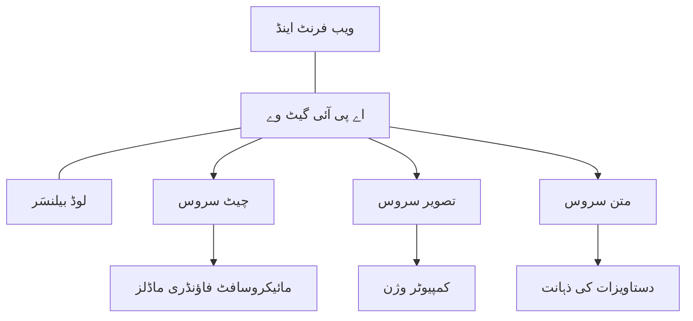

# پروڈکشن AI ورک لوڈ بہترین طریقے AZD کے ساتھ

**باب کی نیوی گیشن:**
- **📚 کورس ہوم**: [AZD For Beginners](../../README.md)
- **📖 موجودہ باب**: باب 8 - پروڈکشن اور انٹرپرائز پیٹرنز
- **⬅️ پچھلا باب**: [باب 7: مشکلات کا حل](../chapter-07-troubleshooting/debugging.md)
- **⬅️ متعلقہ**: [AI ورکشاپ لیب](ai-workshop-lab.md)
- **🎯 کورس مکمل**: [AZD For Beginners](../../README.md)

## جائزہ

یہ رہنما Azure Developer CLI (AZD) کے ذریعے پروڈکشن کے قابل AI ورک لوڈز کو تعینات کرنے کے لیے جامع بہترین طریقے فراہم کرتی ہے۔ مائیکروسافٹ فاؤنڈری ڈسکارڈ کمیونٹی کے تاثرات اور حقیقی دنیا کے گاہکوں کی تعیناتیوں کی بنیاد پر، یہ طریقے پروڈکشن AI سسٹمز میں سب سے عام چیلنجوں کو حل کرتی ہیں۔

## حل شدہ کلیدی چیلنجز

کمیونٹی پول کے نتائج کی بنیاد پر، یہ وہ سب سے بڑے چیلنجز ہیں جن کا ڈویلپرز کو سامنا ہے:

- **45%** کو کثیر-سروس AI تعیناتیوں میں مشکلات
- **38%** کو اسناد اور سیکریٹ مینجمنٹ کے مسائل  
- **35%** کے لیے پروڈکشن کی تیاری اور اسکیلنگ مشکل
- **32%** کو بہتر لاگت کی بہتری کی ضرورت ہے
- **29%** کو بہتر مانیٹرنگ اور مسائل کے حل کی ضرورت

## پروڈکشن AI کے لیے آرکیٹیکچر پیٹرنز

### پیٹرن 1: مائیکرو سروسز AI آرکیٹیکچر

**استعمال کب کریں**: متعدد صلاحیتوں والے پیچیدہ AI ایپلیکیشنز


**AZD نفاذ**:

```yaml
# azure.yaml
name: enterprise-ai-platform
services:
  web:
    project: ./web
    host: staticwebapp
  api-gateway:
    project: ./api-gateway
    host: containerapp
  chat-service:
    project: ./services/chat
    host: containerapp
  vision-service:
    project: ./services/vision
    host: containerapp
  text-service:
    project: ./services/text
    host: containerapp
```

### پیٹرن 2: ایونٹ ڈریون AI پروسیسنگ

**استعمال کب کریں**: بیچ پروسیسنگ، دستاویز کا تجزیہ، غیر ہم وقت عمل

```bicep
// Event Hub for AI processing pipeline
resource eventHub 'Microsoft.EventHub/namespaces@2023-01-01-preview' = {
  name: eventHubNamespaceName
  location: location
  sku: {
    name: 'Standard'
    tier: 'Standard'
    capacity: 1
  }
}

// Service Bus for reliable message processing
resource serviceBus 'Microsoft.ServiceBus/namespaces@2022-10-01-preview' = {
  name: serviceBusNamespaceName
  location: location
  sku: {
    name: 'Premium'
    tier: 'Premium'
    capacity: 1
  }
}

// Function App for processing
resource functionApp 'Microsoft.Web/sites@2023-01-01' = {
  name: functionAppName
  location: location
  kind: 'functionapp,linux'
  properties: {
    siteConfig: {
      appSettings: [
        {
          name: 'FUNCTIONS_EXTENSION_VERSION'
          value: '~4'
        }
        {
          name: 'AZURE_OPENAI_ENDPOINT'
          value: '@Microsoft.KeyVault(VaultName=${keyVault.name};SecretName=openai-endpoint)'
        }
      ]
    }
  }
}
```

## AI ایجنٹ کی صحت کے بارے میں سوچنا

جب کوئی روایتی ویب ایپ خراب ہوتی ہے تو علامات معروف ہوتی ہیں: ایک صفحہ لوڈ نہیں ہوتا، API خرابی دیتا ہے، یا تعیناتی ناکام ہو جاتی ہے۔ AI سے چلنے والی ایپلیکیشنز بھی انہی طریقوں سے خراب ہو سکتی ہیں—لیکن یہ زیادہ نفیس طریقوں سے بھی خراب ہو سکتی ہیں جو واضح خرابی پیغام نہیں دیتیں۔

یہ سیکشن آپ کو AI ورک لوڈز کی مانیٹرنگ کے لیے ذہنی ماڈل بنانے میں مدد دیتا ہے تاکہ آپ کو معلوم ہو کہ جب چیزیں ٹھیک نہ لگیں تو کہاں دیکھنا ہے۔

### ایجنٹ کی صحت روایتی ایپ کی صحت سے کیسے مختلف ہے

ایک روایتی ایپ یا تو کام کرتی ہے یا نہیں۔ AI ایجنٹ کام کرتا ہوا نظر آ سکتا ہے لیکن نتائج خراب دے سکتا ہے۔ ایجنٹ کی صحت کو دو پرتوں میں سوچیں:

| پرت | کیا دیکھنا ہے | کہاں دیکھنا ہے |
|-------|--------------|---------------|
| **انفراسٹرکچر کی صحت** | کیا سروس چل رہی ہے؟ کیا وسائل فراہم کیے گئے ہیں؟ کیا اینڈپوائنٹس قابل رسائی ہیں؟ | `azd monitor`, Azure پورٹل ریسورس ہیلتھ، کنٹینر/ایپ لاگز |
| **رویے کی صحت** | کیا ایجنٹ درست جواب دے رہا ہے؟ کیا جوابات وقت پر ہیں؟ کیا ماڈل کو صحیح طریقے سے کال کیا جا رہا ہے؟ | Application Insights ٹریسز، ماڈل کال کی تاخیر کے میٹرکس، جواب کی کوالٹی کے لاگز |

انفراسٹرکچر کی صحت معروف ہے—یہ کسی بھی azd ایپ کے لیے ایک جیسی ہے۔ رویے کی صحت وہ نئی پرت ہے جو AI ورک لوڈز متعارف کرواتی ہیں۔

### جب AI ایپس متوقع طور پر کام نہ کریں تو کہاں دیکھیں

اگر آپ کی AI ایپ وہ نتائج نہیں دے رہی جو آپ توقع کرتے ہیں، تو یہ ایک تصوری چیک لسٹ ہے:

1. **بنیادی چیزوں سے آغاز کریں۔** کیا ایپ چل رہی ہے؟ کیا یہ اپنی انحصاریوں تک پہنچ سکتی ہے؟ `azd monitor` اور ریسورس ہیلتھ کو چیک کریں جیسے کسی بھی ایپ کے لیے کرتے ہیں۔
2. **ماڈل کنکشن چیک کریں۔** کیا آپ کی ایپلیکیشن کامیابی کے ساتھ AI ماڈل کو کال کر رہی ہے؟ ناکام یا ٹائم آؤٹ ماڈل کالز AI ایپ مسائل کی سب سے عام وجہ ہیں اور آپ کی ایپ لاگز میں ظاہر ہوں گی۔
3. **ماڈل کو کیا ملا دیکھیں۔** AI جوابات ان پٹ (پرومپٹ اور کوئی بھی بازیافت شدہ کانٹیکسٹ) پر منحصر ہوتے ہیں۔ اگر آؤٹ پٹ غلط ہے تو ان پٹ عام طور پر غلط ہوتا ہے۔ چیک کریں کہ آپ کی ایپ ماڈل کو درست ڈیٹا بھیج رہی ہے یا نہیں۔
4. **جواب کی تاخیر کا جائزہ لیں۔** AI ماڈل کالز عام API کالز سے سست ہوتی ہیں۔ اگر آپ کی ایپ سستی محسوس ہو رہی ہے تو دیکھیں کہ ماڈل کا جوابی وقت بڑھا ہے یا نہیں—یہ تھروٹلنگ، صلاحیتی حدود، یا ريجن سطح کے جام ہونے کی نشاندہی کر سکتا ہے۔
5. **لاگت کے اشارے دیکھیں۔** ٹوکن کے استعمال یا API کالز میں غیر متوقع اضافہ کسی لوپ، غلط کنفیگرڈ پرومپٹ، یا ضرورت سے زیادہ کوششوں کی علامت ہو سکتا ہے۔

آپ کو فوراً آبزرویبیلٹی ٹولز میں مہارت حاصل کرنے کی ضرورت نہیں۔ کلیدی بات یہ ہے کہ AI ایپلیکیشنز میں ایک اضافی رویے کی پرت ہوتی ہے جس کی نگرانی کرنی ہوتی ہے، اور azd کی بلٹ ان مانیٹرنگ (`azd monitor`) آپ کو دونوں پرتوں کی تحقیقات کے لیے ایک آغاز فراہم کرتی ہے۔

---

## سیکیورٹی کے بہترین طریقے

### 1. زیرو ٹرسٹ سیکیورٹی ماڈل

**نفاذ کی حکمت عملی**:
- بغیر تصدیق کے کوئی سروس سے سروس رابطہ نہیں
- تمام API کالز منیجڈ آئیڈینٹٹیز استعمال کرتی ہیں
- نیٹ ورک تنہائی پرائیویٹ اینڈپوائنٹس کے ساتھ
- کم از کم مراعات تک رسائی کنٹرولز

```bicep
// Managed Identity for each service
resource chatServiceIdentity 'Microsoft.ManagedIdentity/userAssignedIdentities@2023-01-31' = {
  name: 'chat-service-identity'
  location: location
}

// Role assignments with minimal permissions
resource openAIUserRole 'Microsoft.Authorization/roleAssignments@2022-04-01' = {
  scope: openAIAccount
  name: guid(openAIAccount.id, chatServiceIdentity.id, openAIUserRoleDefinitionId)
  properties: {
    roleDefinitionId: subscriptionResourceId('Microsoft.Authorization/roleDefinitions', '5e0bd9bd-7b93-4f28-af87-19fc36ad61bd')
    principalId: chatServiceIdentity.properties.principalId
    principalType: 'ServicePrincipal'
  }
}
```

### 2. محفوظ سیکریٹ مینجمنٹ

**کی وولت انٹیگریشن پیٹرن**:

```bicep
// Key Vault with proper access policies
resource keyVault 'Microsoft.KeyVault/vaults@2023-02-01' = {
  name: keyVaultName
  location: location
  properties: {
    tenantId: tenant().tenantId
    sku: {
      family: 'A'
      name: 'premium'  // Use premium for production
    }
    enableRbacAuthorization: true  // Use RBAC instead of access policies
    enablePurgeProtection: true    // Prevent accidental deletion
    enableSoftDelete: true
    softDeleteRetentionInDays: 90
  }
}

// Store all AI service credentials
resource openAIKeySecret 'Microsoft.KeyVault/vaults/secrets@2023-02-01' = {
  parent: keyVault
  name: 'openai-api-key'
  properties: {
    value: openAIAccount.listKeys().key1
    attributes: {
      enabled: true
    }
  }
}
```

### 3. نیٹ ورک سیکیورٹی

**پرائیویٹ اینڈپوائنٹ کنفیگریشن**:

```bicep
// Virtual Network for AI services
resource virtualNetwork 'Microsoft.Network/virtualNetworks@2023-04-01' = {
  name: vnetName
  location: location
  properties: {
    addressSpace: {
      addressPrefixes: ['10.0.0.0/16']
    }
    subnets: [
      {
        name: 'ai-services-subnet'
        properties: {
          addressPrefix: '10.0.1.0/24'
          privateEndpointNetworkPolicies: 'Disabled'
        }
      }
      {
        name: 'app-services-subnet'
        properties: {
          addressPrefix: '10.0.2.0/24'
          delegations: [
            {
              name: 'Microsoft.Web/serverFarms'
              properties: {
                serviceName: 'Microsoft.Web/serverFarms'
              }
            }
          ]
        }
      }
    ]
  }
}

// Private endpoints for all AI services
resource openAIPrivateEndpoint 'Microsoft.Network/privateEndpoints@2023-04-01' = {
  name: '${openAIAccountName}-pe'
  location: location
  properties: {
    subnet: {
      id: virtualNetwork.properties.subnets[0].id
    }
    privateLinkServiceConnections: [
      {
        name: 'openai-connection'
        properties: {
          privateLinkServiceId: openAIAccount.id
          groupIds: ['account']
        }
      }
    ]
  }
}
```

## کارکردگی اور اسکیلنگ

### 1. آٹو اسکیلنگ حکمت عملیاں

**کنٹینر ایپس آٹو اسکیلنگ**:

```bicep
resource containerApp 'Microsoft.App/containerApps@2023-05-01' = {
  name: containerAppName
  location: location
  properties: {
    configuration: {
      ingress: {
        external: true
        targetPort: 8000
        transport: 'http'
      }
    }
    template: {
      scale: {
        minReplicas: 2  // Always have 2 instances minimum
        maxReplicas: 50 // Scale up to 50 for high load
        rules: [
          {
            name: 'http-scaling'
            http: {
              metadata: {
                concurrentRequests: '20'  // Scale when >20 concurrent requests
              }
            }
          }
          {
            name: 'cpu-scaling'
            custom: {
              type: 'cpu'
              metadata: {
                type: 'Utilization'
                value: '70'  // Scale when CPU >70%
              }
            }
          }
        ]
      }
    }
  }
}
```

### 2. کیشنگ حکمت عملیاں

**AI جوابات کے لیے ریڈس کیشے**:

```bicep
// Redis Premium for production workloads
resource redisCache 'Microsoft.Cache/redis@2023-04-01' = {
  name: redisCacheName
  location: location
  properties: {
    sku: {
      name: 'Premium'
      family: 'P'
      capacity: 1
    }
    enableNonSslPort: false
    minimumTlsVersion: '1.2'
    redisConfiguration: {
      'maxmemory-policy': 'allkeys-lru'
    }
    // Enable clustering for high availability
    redisVersion: '6.0'
    shardCount: 2
  }
}

// Cache configuration in application
var cacheConnectionString = '${redisCache.properties.hostName}:6380,password=${redisCache.listKeys().primaryKey},ssl=True,abortConnect=False'
```

### 3. لوڈ بیلنسنگ اور ٹریفک مینجمنٹ

**اپلیکیشن گیٹ وے WAF کے ساتھ**:

```bicep
// Application Gateway with Web Application Firewall
resource applicationGateway 'Microsoft.Network/applicationGateways@2023-04-01' = {
  name: appGatewayName
  location: location
  properties: {
    sku: {
      name: 'WAF_v2'
      tier: 'WAF_v2'
      capacity: 2
    }
    webApplicationFirewallConfiguration: {
      enabled: true
      firewallMode: 'Prevention'
      ruleSetType: 'OWASP'
      ruleSetVersion: '3.2'
    }
    // Backend pools for AI services
    backendAddressPools: [
      {
        name: 'ai-services-pool'
        properties: {
          backendAddresses: [
            {
              fqdn: '${containerApp.properties.configuration.ingress.fqdn}'
            }
          ]
        }
      }
    ]
  }
}
```

## 💰 لاگت کی بہتری

### 1. وسائل کا صحیح سائز مقرر کرنا

**ماحول پر مبنی کنفیگریشنز**:

```bash
# ترقی کا ماحول
azd env new development
azd env set AZURE_OPENAI_SKU "S0"
azd env set AZURE_OPENAI_CAPACITY 10
azd env set AZURE_SEARCH_SKU "basic"
azd env set CONTAINER_CPU 0.5
azd env set CONTAINER_MEMORY 1.0

# پیداوار کا ماحول
azd env new production
azd env set AZURE_OPENAI_SKU "S0"
azd env set AZURE_OPENAI_CAPACITY 100
azd env set AZURE_SEARCH_SKU "standard"
azd env set CONTAINER_CPU 2.0
azd env set CONTAINER_MEMORY 4.0
```

### 2. لاگت کی نگرانی اور بجٹس

```bicep
// Cost management and budgets
resource budget 'Microsoft.Consumption/budgets@2023-05-01' = {
  name: 'ai-workload-budget'
  properties: {
    timePeriod: {
      startDate: '2024-01-01'
      endDate: '2024-12-31'
    }
    timeGrain: 'Monthly'
    amount: 2000  // $2000 monthly budget
    category: 'Cost'
    notifications: {
      warning: {
        enabled: true
        operator: 'GreaterThan'
        threshold: 80
        contactEmails: [
          'finance@company.com'
          'engineering@company.com'
        ]
        contactRoles: [
          'Owner'
          'Contributor'
        ]
      }
      critical: {
        enabled: true
        operator: 'GreaterThan'
        threshold: 95
        contactEmails: [
          'cto@company.com'
        ]
      }
    }
  }
}
```

### 3. ٹوکن استعمال کی بہتری

**OpenAI لاگت مینجمنٹ**:

```typescript
// ایپلیکیشن کی سطح پر ٹوکن کی بہتری
class TokenOptimizer {
  private readonly maxTokens = 4000;
  private readonly reserveTokens = 500;
  
  optimizePrompt(userInput: string, context: string): string {
    const availableTokens = this.maxTokens - this.reserveTokens;
    const estimatedTokens = this.estimateTokens(userInput + context);
    
    if (estimatedTokens > availableTokens) {
      // مواد کو مختصر کریں، صارف کی ان پٹ کو نہیں
      context = this.truncateContext(context, availableTokens - this.estimateTokens(userInput));
    }
    
    return `${context}\n\nUser: ${userInput}`;
  }
  
  private estimateTokens(text: string): number {
    // تخمینہ لگانا: 1 ٹوکن ≈ 4 حروف
    return Math.ceil(text.length / 4);
  }
}
```

## مانیٹرنگ اور آبزرویبیلٹی

### 1. جامع اپلیکیشن انسائٹس

```bicep
// Application Insights with advanced features
resource applicationInsights 'Microsoft.Insights/components@2020-02-02' = {
  name: applicationInsightsName
  location: location
  kind: 'web'
  properties: {
    Application_Type: 'web'
    WorkspaceResourceId: logAnalyticsWorkspace.id
    SamplingPercentage: 100  // Full sampling for AI apps
    DisableIpMasking: false  // Enable for security
  }
}

// Custom metrics for AI operations
resource aiMetricAlerts 'Microsoft.Insights/metricAlerts@2018-03-01' = {
  name: 'ai-high-error-rate'
  location: 'global'
  properties: {
    description: 'Alert when AI service error rate is high'
    severity: 2
    enabled: true
    scopes: [
      applicationInsights.id
    ]
    evaluationFrequency: 'PT1M'
    windowSize: 'PT5M'
    criteria: {
      'odata.type': 'Microsoft.Azure.Monitor.SingleResourceMultipleMetricCriteria'
      allOf: [
        {
          name: 'high-error-rate'
          metricName: 'requests/failed'
          operator: 'GreaterThan'
          threshold: 10
          timeAggregation: 'Count'
        }
      ]
    }
  }
}
```

### 2. AI مخصوص مانیٹرنگ

**AI میٹرکس کے لیے کسٹم ڈیش بورڈز**:

```json
// Dashboard configuration for AI workloads
{
  "dashboard": {
    "name": "AI Application Monitoring",
    "tiles": [
      {
        "name": "OpenAI Request Volume",
        "query": "requests | where name contains 'openai' | summarize count() by bin(timestamp, 5m)"
      },
      {
        "name": "AI Response Latency",
        "query": "requests | where name contains 'openai' | summarize avg(duration) by bin(timestamp, 5m)"
      },
      {
        "name": "Token Usage",
        "query": "customMetrics | where name == 'openai_tokens_used' | summarize sum(value) by bin(timestamp, 1h)"
      },
      {
        "name": "Cost per Hour",
        "query": "customMetrics | where name == 'openai_cost' | summarize sum(value) by bin(timestamp, 1h)"
      }
    ]
  }
}
```

### 3. ہیلتھ چیک اور اپ ٹائم مانیٹرنگ

```bicep
// Application Insights availability tests
resource availabilityTest 'Microsoft.Insights/webtests@2022-06-15' = {
  name: 'ai-app-availability-test'
  location: location
  tags: {
    'hidden-link:${applicationInsights.id}': 'Resource'
  }
  properties: {
    SyntheticMonitorId: 'ai-app-availability-test'
    Name: 'AI Application Availability Test'
    Description: 'Tests AI application endpoints'
    Enabled: true
    Frequency: 300  // 5 minutes
    Timeout: 120    // 2 minutes
    Kind: 'ping'
    Locations: [
      {
        Id: 'us-east-2-azr'
      }
      {
        Id: 'us-west-2-azr'
      }
    ]
    Configuration: {
      WebTest: '''
        <WebTest Name="AI Health Check" 
                 Id="8d2de8d2-a2b0-4c2e-9a0d-8f9c9a0b8c8d" 
                 Enabled="True" 
                 CssProjectStructure="" 
                 CssIteration="" 
                 Timeout="120" 
                 WorkItemIds="" 
                 xmlns="http://microsoft.com/schemas/VisualStudio/TeamTest/2010" 
                 Description="" 
                 CredentialUserName="" 
                 CredentialPassword="" 
                 PreAuthenticate="True" 
                 Proxy="default" 
                 StopOnError="False" 
                 RecordedResultFile="" 
                 ResultsLocale="">
          <Items>
            <Request Method="GET" 
                     Guid="a5f10126-e4cd-570d-961c-cea43999a200" 
                     Version="1.1" 
                     Url="${webApp.properties.defaultHostName}/health" 
                     ThinkTime="0" 
                     Timeout="120" 
                     ParseDependentRequests="True" 
                     FollowRedirects="True" 
                     RecordResult="True" 
                     Cache="False" 
                     ResponseTimeGoal="0" 
                     Encoding="utf-8" 
                     ExpectedHttpStatusCode="200" 
                     ExpectedResponseUrl="" 
                     ReportingName="" 
                     IgnoreHttpStatusCode="False" />
          </Items>
        </WebTest>
      '''
    }
  }
}
```

## ڈیزاسٹر ریکوری اور ہائی ایویلیبیلٹی

### 1. کثیر ریجن تعیناتی

```yaml
# azure.yaml - Multi-region configuration
name: ai-app-multiregion
services:
  api-primary:
    project: ./api
    host: containerapp
    env:
      - AZURE_REGION=eastus
  api-secondary:
    project: ./api
    host: containerapp
    env:
      - AZURE_REGION=westus2
```

```bicep
// Traffic Manager for global load balancing
resource trafficManager 'Microsoft.Network/trafficManagerProfiles@2022-04-01' = {
  name: trafficManagerProfileName
  location: 'global'
  properties: {
    profileStatus: 'Enabled'
    trafficRoutingMethod: 'Priority'
    dnsConfig: {
      relativeName: trafficManagerProfileName
      ttl: 30
    }
    monitorConfig: {
      protocol: 'HTTPS'
      port: 443
      path: '/health'
      intervalInSeconds: 30
      toleratedNumberOfFailures: 3
      timeoutInSeconds: 10
    }
    endpoints: [
      {
        name: 'primary-endpoint'
        type: 'Microsoft.Network/trafficManagerProfiles/azureEndpoints'
        properties: {
          targetResourceId: primaryAppService.id
          endpointStatus: 'Enabled'
          priority: 1
        }
      }
      {
        name: 'secondary-endpoint'
        type: 'Microsoft.Network/trafficManagerProfiles/azureEndpoints'
        properties: {
          targetResourceId: secondaryAppService.id
          endpointStatus: 'Enabled'
          priority: 2
        }
      }
    ]
  }
}
```

### 2. ڈیٹا بیک اپ اور ریکوری

```bicep
// Backup configuration for critical data
resource backupVault 'Microsoft.DataProtection/backupVaults@2023-05-01' = {
  name: backupVaultName
  location: location
  identity: {
    type: 'SystemAssigned'
  }
  properties: {
    storageSettings: [
      {
        datastoreType: 'VaultStore'
        type: 'LocallyRedundant'
      }
    ]
  }
}

// Backup policy for AI models and data
resource backupPolicy 'Microsoft.DataProtection/backupVaults/backupPolicies@2023-05-01' = {
  parent: backupVault
  name: 'ai-data-backup-policy'
  properties: {
    policyRules: [
      {
        backupParameters: {
          backupType: 'Full'
          objectType: 'AzureBackupParams'
        }
        trigger: {
          schedule: {
            repeatingTimeIntervals: [
              'R/2024-01-01T02:00:00+00:00/P1D'  // Daily at 2 AM
            ]
          }
          objectType: 'ScheduleBasedTriggerContext'
        }
        dataStore: {
          datastoreType: 'VaultStore'
          objectType: 'DataStoreInfoBase'
        }
        name: 'BackupDaily'
        objectType: 'AzureBackupRule'
      }
    ]
  }
}
```

## ڈیو آپس اور CI/CD انٹیگریشن

### 1. GitHub Actions ورک فلو

```yaml
# .github/workflows/deploy-ai-app.yml
name: Deploy AI Application

on:
  push:
    branches: [main]
  pull_request:
    branches: [main]

jobs:
  test:
    runs-on: ubuntu-latest
    steps:
      - uses: actions/checkout@v4
      
      - name: Setup Python
        uses: actions/setup-python@v4
        with:
          python-version: '3.11'
          
      - name: Install dependencies
        run: |
          pip install -r requirements.txt
          pip install pytest
          
      - name: Run tests
        run: pytest tests/
        
      - name: AI Safety Tests
        run: |
          python scripts/test_ai_safety.py
          python scripts/validate_prompts.py

  deploy-staging:
    needs: test
    if: github.event_name == 'pull_request'
    runs-on: ubuntu-latest
    steps:
      - uses: actions/checkout@v4
      
      - name: Setup AZD
        uses: Azure/setup-azd@v1.0.0
        
      - name: Login to Azure
        uses: azure/login@v1
        with:
          creds: ${{ secrets.AZURE_CREDENTIALS }}
          
      - name: Deploy to Staging
        run: |
          azd env select staging
          azd deploy

  deploy-production:
    needs: test
    if: github.ref == 'refs/heads/main'
    runs-on: ubuntu-latest
    steps:
      - uses: actions/checkout@v4
      
      - name: Setup AZD
        uses: Azure/setup-azd@v1.0.0
        
      - name: Login to Azure
        uses: azure/login@v1
        with:
          creds: ${{ secrets.AZURE_CREDENTIALS }}
          
      - name: Deploy to Production
        run: |
          azd env select production
          azd deploy
          
      - name: Run Production Health Checks
        run: |
          python scripts/health_check.py --env production
```

### 2. انفراسٹرکچر کی تصدیق

```bash
# اسکرپٹس/validate_infrastructure.sh
#!/bin/bash

echo "Validating AI infrastructure deployment..."

# چیک کریں کہ تمام ضروری خدمات چل رہی ہیں
services=("openai" "search" "storage" "keyvault")
for service in "${services[@]}"; do
    echo "Checking $service..."
    if ! az resource list --resource-type "Microsoft.CognitiveServices/accounts" --query "[?contains(name, '$service')]" -o tsv; then
        echo "ERROR: $service not found"
        exit 1
    fi
done

# اوپن اے آئی ماڈل کی تنصیبات کی تصدیق کریں
echo "Validating OpenAI model deployments..."
models=$(az cognitiveservices account deployment list --name $AZURE_OPENAI_NAME --resource-group $AZURE_RESOURCE_GROUP --query "[].name" -o tsv)
if [[ ! $models == *"gpt-35-turbo"* ]]; then
    echo "ERROR: Required model gpt-35-turbo not deployed"
    exit 1
fi

# AI سروس کنیکٹیویٹی کا ٹیسٹ کریں
echo "Testing AI service connectivity..."
python scripts/test_connectivity.py

echo "Infrastructure validation completed successfully!"
```

## پروڈکشن تیاری چیک لسٹ

### سیکیورٹی ✅
- [ ] تمام سروسز منیجڈ آئیڈینٹٹیز استعمال کریں
- [ ] سیکریٹس کی وولت میں محفوظ ہوں
- [ ] پرائیویٹ اینڈپوائنٹس کنفیگر کیے گئے ہوں
- [ ] نیٹ ورک سیکیورٹی گروپس نافذ کیے گئے ہوں
- [ ] RBAC کم از کم مراعات کے ساتھ
- [ ] پبلک اینڈپوائنٹس پر WAF فعال ہو

### کارکردگی ✅
- [ ] آٹو اسکیلنگ کنفیگر کی گئی ہو
- [ ] کیشنگ نافذ ہو
- [ ] لوڈ بیلنسنگ سیٹ اپ ہو
- [ ] جامد مواد کے لیے CDN ہو
- [ ] ڈیٹا بیس کنکشن پولنگ ہو
- [ ] ٹوکن کے استعمال کی بہتری کی گئی ہو

### مانیٹرنگ ✅
- [ ] اپلیکیشن انسائٹس کنفیگر کی گئی ہو
- [ ] کسٹم میٹرکس بیان کیے گئے ہوں
- [ ] الرٹنگ رولز سیٹ اپ کیے گئے ہوں
- [ ] ڈیش بورڈ تیار کیا گیا ہو
- [ ] ہیلتھ چیکس نافذ ہوں
- [ ] لاگ رٹینشن پالیسیز ہوں

### اعتماد قابل ✅
- [ ] کثیر ریجن تعیناتی ہو
- [ ] بیک اپ اور ریکوری پلان ہو
- [ ] سرکٹ بریکرز نافذ ہوں
- [ ] ریٹائی پالیسیز کنفیگر ہوں
- [ ] مہذب کمی
- [ ] ہیلتھ چیک اینڈپوائنٹس ہوں

### لاگت کا انتظام ✅
- [ ] بجٹ الرٹس کنفیگر کیے گئے ہوں
- [ ] وسائل کا صحیح سائز مقرر ہو
- [ ] ڈیو/ٹیسٹ ڈسکاونٹس لاگو ہوں
- [ ] ریزروڈ انسٹینسز خریدی گئی ہوں
- [ ] لاگت مانیٹرنگ ڈیش بورڈ ہو
- [ ] باقاعدہ لاگت جائزے ہوں

### تعمیل ✅
- [ ] ڈیٹا رہائش کے تقاضے پورے کیے گئے ہوں
- [ ] آڈٹ لاگنگ فعال ہو
- [ ] تعمیل کی پالیسیاں لاگو ہوں
- [ ] سیکیورٹی بیس لائنز نافذ ہوں
- [ ] باقاعدہ سیکیورٹی جائزے ہوں
- [ ] واقعے کے جواب کا منصوبہ ہو

## کارکردگی کے معیار

### عام پروڈکشن میٹرکس

| میٹرک | ہدف | مانیٹرنگ |
|--------|--------|------------|
| **جواب کا وقت** | < 2 سیکنڈ | اپلیکیشن انسائٹس |
| **دستیابی** | 99.9% | اپ ٹائم مانیٹرنگ |
| **خرابی کی شرح** | < 0.1% | اپلیکیشن لاگز |
| **ٹوکن استعمال** | < $500/ماہ | لاگت کا انتظام |
| **ہم وقت صارفین** | 1000+ | لوڈ ٹیسٹنگ |
| **ریکوری کا وقت** | < 1 گھنٹہ | ڈیزاسٹر ریکوری ٹیسٹس |

### لوڈ ٹیسٹنگ

```bash
# اے آئی ایپلیکیشنز کے لیے لوڈ ٹیسٹنگ اسکرپٹ
python scripts/load_test.py \
  --endpoint https://your-ai-app.azurewebsites.net \
  --concurrent-users 100 \
  --duration 300 \
  --ramp-up 60
```

## 🤝 کمیونٹی کے بہترین طریقے

مائیکروسافٹ فاؤنڈری ڈسکارڈ کمیونٹی کے تاثرات کی بنیاد پر:

### کمیونٹی کی اعلی سفارشات:

1. **چھوٹے سے شروع کریں، تدریجی اسکیل کریں**: بنیادی SKUs سے آغاز کریں اور حقیقی استعمال کی بنیاد پر اسکیل اپ کریں
2. **سب کچھ مانیٹر کریں**: دن ایک سے جامع مانیٹرنگ سیٹ اپ کریں
3. **سیکیورٹی کو خودکار بنائیں**: مستقل سیکیورٹی کے لیے انفراسٹرکچر ایز کوڈ استعمال کریں
4. **مکمل جانچ کریں**: اپنے پائپ لائن میں AI مخصوص جانچ شامل کریں
5. **لاگت کے لیے منصوبہ بندی کریں**: ٹوکن کے استعمال کو مانیٹر کریں اور جلد بجٹ الرٹس سیٹ کریں

### عام غلطیاں جن سے بچنا چاہیے:

- ❌ کوڈ میں API کیز ہارڈکوڈ کرنا
- ❌ مناسب مانیٹرنگ نہ لگانا
- ❌ لاگت کی بہتری کو نظر انداز کرنا
- ❌ ناکامی کے مناظر کی جانچ نہ کرنا
- ❌ ہیلتھ چیکس کے بغیر تعینات کرنا

## AZD AI CLI کمانڈز اور ایکسٹینشنز

AZD میں AI مخصوص کمانڈز اور ایکسٹینشنز کا بڑھتا ہوا مجموعہ شامل ہے جو پروڈکشن AI ورک فلو کو ہموار بناتے ہیں۔ یہ ٹولز مقامی ترقی اور پروڈکشن تعیناتی کے درمیان پل کا کام کرتے ہیں۔

### AI کے لیے AZD ایکسٹینشنز

AZD ایکسٹینشن سسٹم استعمال کرتا ہے تاکہ AI مخصوص صلاحیتیں شامل کی جا سکیں۔ ایکسٹینشنز انسٹال اور مینج کرنے کے لیے:

```bash
# تمام دستیاب ایکسٹینشنز کی فہرست بنائیں (بشمول AI)
azd extension list

# فاؤنڈری ایجنٹس ایکسٹینشن انسٹال کریں
azd extension install azure.ai.agents

# فائن ٹیوننگ ایکسٹینشن انسٹال کریں
azd extension install azure.ai.finetune

# کسٹم ماڈلز ایکسٹینشن انسٹال کریں
azd extension install azure.ai.models

# تمام انسٹال کردہ ایکسٹینشنز کو اپ گریڈ کریں
azd extension upgrade --all
```

**دستیاب AI ایکسٹینشنز:**

| ایکسٹینشن | مقصد | اسٹیٹس |
|-----------|---------|--------|
| `azure.ai.agents` | فاؤنڈری ایجنٹ سروس مینجمنٹ | پری ویو |
| `azure.ai.finetune` | فاؤنڈری ماڈل فائن-ٹیوننگ | پری ویو |
| `azure.ai.models` | فاؤنڈری کسٹم ماڈلز | پری ویو |
| `azure.coding-agent` | کوڈنگ ایجنٹ کنفیگریشن | دستیاب |

### `azd ai agent init` کے ساتھ ایجنٹ پروجیکٹس کی شروعات

`azd ai agent init` کمانڈ ایک پروڈکشن کے قابل AI ایجنٹ پروجیکٹ کو سکیفولڈ کرتی ہے جو مائیکروسافٹ فاؤنڈری ایجنٹ سروس کے ساتھ مربوط ہوتا ہے:

```bash
# ایک ایجنٹ مینیفیسٹ سے نیا ایجنٹ پروجیکٹ شروع کریں
azd ai agent init -m <manifest-path-or-uri>

# ایک مخصوص فاؤنڈری پروجیکٹ کو شروع کریں اور ہدف بنائیں
azd ai agent init -m agent-manifest.yaml --project-id <foundry-project-id>

# ایک کسٹم سورس ڈائریکٹری کے ساتھ شروع کریں
azd ai agent init -m agent-manifest.yaml --src ./agents/my-agent

# ہوسٹ کے طور پر کنٹینر ایپس کو ہدف بنائیں
azd ai agent init -m agent-manifest.yaml --host containerapp
```

**اہم فلیگز:**

| فلیگ | وضاحت |
|------|-------------|
| `-m, --manifest` | ایجنٹ مینیفیسٹ کا راستہ یا URI جو آپ کے پروجیکٹ میں شامل کیا جائے |
| `-p, --project-id` | آپ کے azd ماحول کے لیے موجودہ مائیکروسافٹ فاؤنڈری پروجیکٹ آئی ڈی |
| `-s, --src` | ایجنٹ کی تعریف ڈاؤن لوڈ کرنے کے لیے ڈائریکٹری (ڈیفالٹ `src/<agent-id>`) |
| `--host` | ڈیفالٹ ہوسٹ کو اوور رائیڈ کریں (مثال کے طور پر `containerapp`) |
| `-e, --environment` | استعمال کرنے کے لیے azd ماحول |

**پروڈکشن ٹپ**: `--project-id` استعمال کریں تاکہ آپ براہ راست موجودہ فاؤنڈری پروجیکٹ سے جڑ جائیں، جس سے آپ کے ایجنٹ کوڈ اور کلاؤڈ وسائل شروع سے ہی لنک رہیں۔

### `azd mcp` کے ساتھ ماڈل کانٹیکسٹ پروٹوکول (MCP)

AZD بلٹ ان MCP سرور سپورٹ (الفا) شامل کرتا ہے، جو AI ایجنٹس اور ٹولز کو آپ کے Azure وسائل کے ساتھ ایک معیاری پروٹوکول کے ذریعے بات چیت کرنے کی اجازت دیتا ہے:

```bash
# اپنے پروجیکٹ کے لیے MCP سرور شروع کریں
azd mcp start

# MCP آپریشنز کے لیے ٹول کی رضا مندی کا انتظام کریں
azd mcp consent
```

MCP سرور آپ کے azd پروجیکٹ کے کانٹیکسٹ—ماحول، سروسز، اور Azure وسائل—کو AI سے چلنے والے ڈیولپمنٹ ٹولز کے لیے پیش کرتا ہے۔ اس سے یہ ممکن ہوتا ہے:

- **AI مدد یافتہ تعیناتی**: کوڈنگ ایجنٹس کو آپ کے پروجیکٹ کی حالت معلوم کرنے اور تعیناتیاں شروع کرنے دیں
- **وسائل کی دریافت**: AI ٹولز معلوم کر سکتے ہیں کہ آپ کا پروجیکٹ کون سے Azure وسائل استعمال کرتا ہے
- **ماحول مینجمنٹ**: ایجنٹس ڈیو/اسٹیجنگ/پروڈکشن ماحول کے درمیان سوئچ کر سکتے ہیں

### `azd infra generate` کے ساتھ انفراسٹرکچر جنریشن

پروڈکشن AI ورک لوڈز کے لیے، آپ انفراسٹرکچر ایز کوڈ کو جنریٹ اور تخصیص کر سکتے ہیں بجائے خودکار پروویژننگ کے انحصار کے:

```bash
# آپ کی پروجیکٹ تعریف سے بائسپس / ٹیررا فارم فائلیں بنائیں
azd infra generate
```

یہ IaC کو ڈسک پر لکھتا ہے تاکہ آپ:
- تعیناتی سے پہلے انفراسٹرکچر کا جائزہ اور آڈٹ کر سکیں
- کسٹم سیکیورٹی پالیسیاں شامل کریں (نیٹ ورک رولز، پرائیویٹ اینڈپوائنٹس)
- موجودہ IaC جائزہ کے عمل میں ضم کریں
- انفراسٹرکچر تبدیلیوں کو ایپلیکیشن کوڈ سے الگ ورژن کنٹرول کریں

### پروڈکشن لائف سائیکل ہکس

AZD ہکس آپ کو تعیناتی کے ہر مرحلے پر کسٹم لاجک انجیکٹ کرنے دیتے ہیں—پروڈکشن AI ورک فلو کے لیے ناگزیر:

```yaml
# azure.yaml - Production hooks example
name: ai-production-app
hooks:
  preprovision:
    shell: sh
    run: scripts/validate-quotas.sh    # Check AI model quota before provisioning
  postprovision:
    shell: sh
    run: scripts/configure-networking.sh  # Set up private endpoints
  predeploy:
    shell: sh
    run: scripts/run-ai-safety-tests.sh  # Run prompt safety checks
  postdeploy:
    shell: sh
    run: scripts/smoke-test.sh           # Verify agent responses post-deploy
services:
  agent-api:
    project: ./src/agent
    host: containerapp
    hooks:
      predeploy:
        shell: sh
        run: scripts/validate-model-access.sh  # Per-service hook
```

```bash
# ترقی کے دوران مخصوص ہک کو دستی طور پر چلائیں
azd hooks run predeploy
```

**AI ورک لوڈز کے لیے سفارش کردہ پروڈکشن ہکس:**

| ہک | استعمال کا کیس |
|------|----------|
| `preprovision` | AI ماڈل کی صلاحیت کے لیے سبسکرپشن کوٹا کی تصدیق |
| `postprovision` | پرائیویٹ اینڈپوائنٹس کنفیگر کرنا، ماڈل ویٹس تعینات کرنا |
| `predeploy` | AI سیفٹی ٹیسٹ چلانا، پرومپٹ ٹیمپلیٹس کی تصدیق |
| `postdeploy` | ایجنٹ جوابات کا سمک ٹیسٹ، ماڈل کنیکٹوٹی کی تصدیق |

### CI/CD پائپ لائن کنفیگریشن

`azd pipeline config` استعمال کریں تاکہ آپ کا پروجیکٹ GitHub Actions یا Azure Pipelines سے محفوظ Azure تصدیق کے ساتھ جڑ جائے:

```bash
# CI/CD پائپ لائن کو ترتیب دیں (تعاملی)
azd pipeline config

# مخصوص پرووائیڈر کے ساتھ ترتیب دیں
azd pipeline config --provider github
```

یہ کمانڈ:
- کم از کم مراعات کے ساتھ سروس پرنسپل تخلیق کرتا ہے
- فیڈریٹڈ اسناد کنفیگر کرتا ہے (کوئی اسٹور شدہ سیکریٹس نہیں)
- آپ کی پائپ لائن تعریف فائل کو جنریٹ یا اپ ڈیٹ کرتا ہے
- آپ کے CI/CD سسٹم میں ضروری ماحول متغیرات سیٹ کرتا ہے

**پروڈکشن ورک فلو کے لیے پائپ لائن کنفیگریشن:**

```bash
# 1. پیداواری ماحول ترتیب دیں
azd env new production
azd env set AZURE_OPENAI_CAPACITY 100

# 2. پائپ لائن تشکیل دیں
azd pipeline config --provider github

# 3. پائپ لائن ہر دفعہ مین پر پش کرنے پر azd deploy چلائے گا
```

### `azd add` کے ساتھ کمپونینٹس شامل کرنا

ایک موجودہ پروجیکٹ میں آہستہ آہستہ Azure سروسز شامل کریں:

```bash
# ایک نیا سروس کمپونینٹ انٹرایکٹو طریقے سے شامل کریں
azd add
```

یہ خاص طور پر پروڈکشن AI ایپلیکیشنز کے توسیع کے لیے مفید ہے—مثلاً، ایک ویکٹر سرچ سروس شامل کرنا، نیا ایجنٹ اینڈپوائنٹ، یا مانیٹرنگ کمپونینٹ کو موجودہ تعیناتی میں شامل کرنا۔

## اضافی وسائل
- **ایزور ویل-آرکیٹیکٹڈ فریم ورک**: [AI ورک لوڈ گائیڈنس](https://learn.microsoft.com/azure/well-architected/ai/)
- **مائیکروسافٹ فاؤنڈری دستاویزات**: [سرکاری دستاویزات](https://learn.microsoft.com/azure/ai-studio/)
- **کمیونٹی ٹیمپلیٹس**: [ایزور سیمپلز](https://github.com/Azure-Samples)
- **ڈسکارڈ کمیونٹی**: [#ایزور چینل](https://discord.gg/microsoft-azure)
- **ایجنٹ اسکلز فار ایزور**: [microsoft/github-copilot-for-azure on skills.sh](https://skills.sh/microsoft/github-copilot-for-azure) - ایزور AI، فاؤنڈری، تعیناتی، لاگت کی اصلاح اور تشخیص کے لیے 37 کھلے ایجنٹ اسکلز۔ اپنے ایڈیٹر میں انسٹال کریں:
  ```bash
  npx skills add microsoft/github-copilot-for-azure
  ```

---

**بابی تشریف لے جانا:**
- **📚 کورس ہوم**: [AZD For Beginners](../../README.md)
- **📖 موجودہ باب**: باب 8 - پروڈکشن اور انٹرپرائز پیٹرنز
- **⬅️ پچھلا باب**: [باب 7: مسئلہ حل کرنا](../chapter-07-troubleshooting/debugging.md)
- **⬅️ اس سے متعلق**: [AI ورکشاپ لیب](ai-workshop-lab.md)
- **� کورس مکمل**: [AZD For Beginners](../../README.md)

**یاد رکھیں**: پروڈکشن AI ورک لوڈز کے لیے محتاط منصوبہ بندی، نگرانی، اور مسلسل اصلاح کی ضرورت ہوتی ہے۔ ان پیٹرنز سے شروع کریں اور انہیں اپنی مخصوص ضروریات کے مطابق ڈھالیں۔

---

<!-- CO-OP TRANSLATOR DISCLAIMER START -->
**ڈس کلیمر**:
یہ دستاویز AI ترجمہ خدمات [Co-op Translator](https://github.com/Azure/co-op-translator) کا استعمال کرتے ہوئے ترجمہ کی گئی ہے۔ اگرچہ ہم درستگی کے لیے کوشاں ہیں، براہ کرم آگاہ رہیں کہ خودکار تراجم میں غلطیاں یا عدم صحت ہو سکتی ہے۔ اصل دستاویز اپنے مادری زبان میں معتبر ماخذ سمجھا جانا چاہیے۔ اہم معلومات کے لیے پیشہ ورانہ انسانی ترجمہ کی سفارش کی جاتی ہے۔ اس ترجمہ کے استعمال سے پیدا ہونے والی کسی بھی غلط فہمی یا غلط تشریح کے لیے ہم ذمہ دار نہیں ہیں۔
<!-- CO-OP TRANSLATOR DISCLAIMER END -->