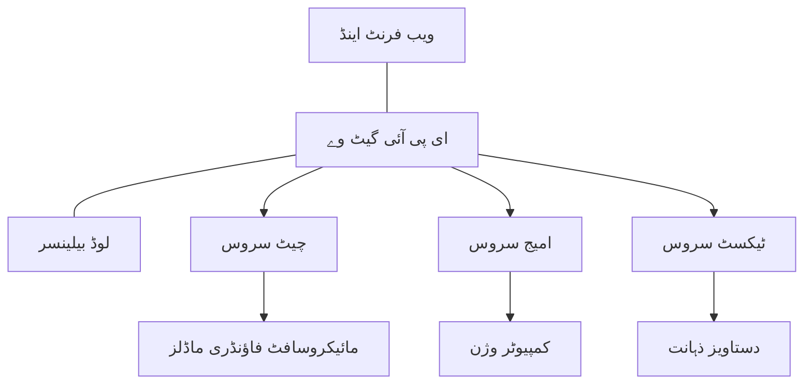

# پروڈکشن AI کام کے بوجھ کے لیے بہترین طریقے AZD کے ساتھ

**باب کی نیوی گیشن:**
- **📚 کورس ہوم**: [AZD برائے مبتدی](../../README.md)
- **📖 موجودہ باب**: باب 8 - پروڈکشن اور انٹرپرائز پیٹرنز
- **⬅️ پچھلا باب**: [باب 7: ٹربلشوٹنگ](../chapter-07-troubleshooting/debugging.md)
- **⬅️ متعلقہ بھی**: [AI ورکشاپ لیب](ai-workshop-lab.md)
- **🎯 کورس مکمل**: [AZD برائے مبتدی](../../README.md)

## جائزہ

یہ گائیڈ Azure Developer CLI (AZD) استعمال کرتے ہوئے پروڈکشن-ریڈی AI ورک لوڈز کو تعینات کرنے کے لیے جامع بہترین طریقے فراہم کرتا ہے۔ مائیکروسافٹ فاؤنڈری ڈسکارڈ کمیونٹی کی رائے اور حقیقی دنیا کے گاہکوں کی تعیناتیوں کی بنیاد پر، یہ طریقے پروڈکشن AI سسٹمز میں سب سے عام چیلنجز کو حل کرتے ہیں۔

## حل کیے گئے کلیدی چیلنجز

کمیونٹی پول کے نتائج کی بنیاد پر، یہ اعلیٰ ترین چیلنجز ہیں جن کا سامنا ڈویلپرز کو ہوتا ہے:

- **45%** کو ملٹی سروس AI تعیناتیوں میں دشواری ہوتی ہے
- **38%** کو کریڈینشل اور سیکرٹ مینجمنٹ میں مسائل ہوتے ہیں  
- **35%** کو پروڈکشن ریڈینس اور اسکیلنگ مشکل لگتی ہے
- **32%** کو بہتر لاگت کی اصلاح کی حکمت عملیوں کی ضرورت ہے
- **29%** کو بہتر مانیٹرنگ اور ٹربلشوٹنگ کی ضرورت ہوتی ہے

## پروڈکشن AI کے لیے آرکیٹیکچر پیٹرنز

### پیٹرن 1: مائیکرو سروسز AI آرکیٹیکچر

**استعمال کا وقت**: پیچیدہ AI ایپلیکیشنز جن میں متعدد صلاحیتیں ہوں



**AZD عمل درآمد**:

```yaml
# azure.yaml
name: enterprise-ai-platform
services:
  web:
    project: ./web
    host: staticwebapp
  api-gateway:
    project: ./api-gateway
    host: containerapp
  chat-service:
    project: ./services/chat
    host: containerapp
  vision-service:
    project: ./services/vision
    host: containerapp
  text-service:
    project: ./services/text
    host: containerapp
```

### پیٹرن 2: ایونٹ پر مبنی AI پروسیسنگ

**استعمال کا وقت**: بیچ پروسیسنگ، دستاویز تجزیہ، غیر ہم وقت ورک فلو

```bicep
// Event Hub for AI processing pipeline
resource eventHub 'Microsoft.EventHub/namespaces@2023-01-01-preview' = {
  name: eventHubNamespaceName
  location: location
  sku: {
    name: 'Standard'
    tier: 'Standard'
    capacity: 1
  }
}

// Service Bus for reliable message processing
resource serviceBus 'Microsoft.ServiceBus/namespaces@2022-10-01-preview' = {
  name: serviceBusNamespaceName
  location: location
  sku: {
    name: 'Premium'
    tier: 'Premium'
    capacity: 1
  }
}

// Function App for processing
resource functionApp 'Microsoft.Web/sites@2023-01-01' = {
  name: functionAppName
  location: location
  kind: 'functionapp,linux'
  properties: {
    siteConfig: {
      appSettings: [
        {
          name: 'FUNCTIONS_EXTENSION_VERSION'
          value: '~4'
        }
        {
          name: 'AZURE_OPENAI_ENDPOINT'
          value: '@Microsoft.KeyVault(VaultName=${keyVault.name};SecretName=openai-endpoint)'
        }
      ]
    }
  }
}
```

## AI ایجنٹ کی صحت کے بارے میں سوچنا

جب کوئی روایتی ویب ایپ ٹوٹتی ہے، تو علامات جانی پہچانی ہوتی ہیں: کوئی صفحہ لوڈ نہیں ہوتا، API غلطی دیتا ہے، یا تعیناتی ناکام ہوجاتی ہے۔ AI سے چلنے والی ایپلیکیشنز بھی انہی طریقوں سے ٹوٹ سکتی ہیں—لیکن وہ اس طرح بھی خراب ہو سکتی ہیں جو واضح غلطی کے پیغامات پیدا نہیں کرتے۔

یہ سیکشن آپ کو AI ورک لوڈز کی مانیٹرنگ کے لیے ذہنی ماڈل بنانے میں مدد دیتا ہے تاکہ آپ جان سکیں کہ جب چیزیں درست نہ لگیں تو کہاں دیکھنا ہے۔

### ایجنٹ کی صحت روایتی ایپ کی صحت سے کیسے مختلف ہے

روایتی ایپ یا تو کام کرتی ہے یا نہیں۔ AI ایجنٹ ظاہرہو سکتا ہے کہ کام کر رہا ہے لیکن خراب نتائج دے رہا ہو۔ ایجنٹ کی صحت کو دو سطحوں میں سوچیں:

| سطح | کیا دیکھنا ہے | کہاں دیکھنا ہے |
|-------|--------------|---------------|
| **انفراسٹرکچر صحت** | کیا سروس چل رہی ہے؟ کیا وسائل مہیا کیے گئے ہیں؟ کیا انڈپوائنٹس قابل رسائی ہیں؟ | `azd monitor`, Azure پورٹل سرمایہ کاری صحت، کنٹینر/ایپ لاگز |
| **رویے کی صحت** | کیا ایجنٹ درست جواب دے رہا ہے؟ کیا جوابات بروقت ہیں؟ کیا ماڈل کو درست طریقے سے کال کیا جا رہا ہے؟ | Application Insights کے ٹریس، ماڈل کال کی تاخیر میٹرکس، جواب کی کوالٹی لاگز |

انفراسٹرکچر کی صحت شناسا ہے—یہ کسی بھی azd ایپ کے لیے ایک جیسی ہوتی ہے۔ رویے کی صحت وہ نیا پہلو ہے جو AI ورک لوڈز لاتے ہیں۔

### جب AI ایپس متوقع طریقے سے کام نہ کریں تو کہاں دیکھیں

اگر آپ کی AI ایپ وہ نتائج نہیں دے رہی جو آپ توقع کرتے ہیں، تو یہاں ایک تصوراتی چیک لسٹ ہے:

1. **بنیادی باتوں سے آغاز کریں۔** کیا ایپ چل رہی ہے؟ کیا یہ اپنی انحصاریوں تک پہنچ سکتی ہے؟ `azd monitor` اور سرمایہ کاری کی صحت چیک کریں جیسے آپ کسی بھی ایپ کے لیے کرتے ہیں۔
2. **ماڈل کنکشن چیک کریں۔** کیا آپ کی ایپلیکیشن کامیابی سے AI ماڈل کو کال کر رہی ہے؟ ناکام یا ٹائم آؤٹ ماڈل کالز AI ایپ مسائل کا سب سے عام سبب ہیں اور یہ آپ کی اپلیکیشن لاگز میں ظاہر ہوں گی۔
3. **دیکھیں کہ ماڈل کو کیا ملا۔** AI کے جواب ان پٹ (پرومپٹ اور حاصل شدہ سیاق و سباق) پر منحصر ہوتے ہیں۔ اگر آؤٹ پٹ غلط ہے، تو اکثر ان پٹ غلط ہوتا ہے۔ چیک کریں کہ آیا آپ کی ایپ ماڈل کو درست ڈیٹا بھیج رہی ہے۔
4. **جواب کی تاخیر کا جائزہ لیں۔** AI ماڈل کالز عام API کالز کے مقابلے میں سست ہوتی ہیں۔ اگر آپ کی ایپ سست محسوس ہو رہی ہے، تو چیک کریں کہ ماڈل کے جواب کے اوقات میں اضافہ ہوا ہے یا نہیں—یہ تھروٹلنگ، صلاحیت کی حدود، یا علاقائی سطح کے بھیڑ کا اشارہ ہوسکتا ہے۔
5. **لاگت کے اشارے دیکھیں۔** ٹوکن استعمال یا API کالز میں غیر متوقع اضافہ ایک لوپ، غلط کنفیگر شدہ پرومپٹ، یا اضافی کوششوں کی نشاندہی کر سکتا ہے۔

آپ کو فوراً ابزرویبلٹی ٹولنگ میں ماہر بننے کی ضرورت نہیں ہے۔ کلیدی بات یہ ہے کہ AI ایپلیکیشنز میں رویے کا ایک اضافی پہلو ہوتا ہے جسے مانیٹر کرنا ہوتا ہے، اور azd کی بلٹ ان مانیٹرنگ (`azd monitor`) آپ کو دونوں سطحوں کی ابتدائی جانچ کی جگہ فراہم کرتی ہے۔

---

## سیکیورٹی کے بہترین طریقے

### 1. زیرو ٹرسٹ سیکیورٹی ماڈل

**عمل درآمد کی حکمت عملی**:
- بغیر تصدیق کے کوئی سروس سے سروس رابطہ نہیں
- تمام API کالز مینجڈ آئیڈنٹٹیز استعمال کریں
- نیٹ ورک آئسولیشن پرائیویٹ انڈپوائنٹس کے ساتھ
- کم سے کم مراعات کی رسائی کنٹرولز

```bicep
// Managed Identity for each service
resource chatServiceIdentity 'Microsoft.ManagedIdentity/userAssignedIdentities@2023-01-31' = {
  name: 'chat-service-identity'
  location: location
}

// Role assignments with minimal permissions
resource openAIUserRole 'Microsoft.Authorization/roleAssignments@2022-04-01' = {
  scope: openAIAccount
  name: guid(openAIAccount.id, chatServiceIdentity.id, openAIUserRoleDefinitionId)
  properties: {
    roleDefinitionId: subscriptionResourceId('Microsoft.Authorization/roleDefinitions', '5e0bd9bd-7b93-4f28-af87-19fc36ad61bd')
    principalId: chatServiceIdentity.properties.principalId
    principalType: 'ServicePrincipal'
  }
}
```

### 2. محفوظ سیکرٹ مینجمنٹ

**کی والٹ انٹیگریشن پیٹرن**:

```bicep
// Key Vault with proper access policies
resource keyVault 'Microsoft.KeyVault/vaults@2023-02-01' = {
  name: keyVaultName
  location: location
  properties: {
    tenantId: tenant().tenantId
    sku: {
      family: 'A'
      name: 'premium'  // Use premium for production
    }
    enableRbacAuthorization: true  // Use RBAC instead of access policies
    enablePurgeProtection: true    // Prevent accidental deletion
    enableSoftDelete: true
    softDeleteRetentionInDays: 90
  }
}

// Store all AI service credentials
resource openAIKeySecret 'Microsoft.KeyVault/vaults/secrets@2023-02-01' = {
  parent: keyVault
  name: 'openai-api-key'
  properties: {
    value: openAIAccount.listKeys().key1
    attributes: {
      enabled: true
    }
  }
}
```

### 3. نیٹ ورک سیکیورٹی

**پرائیویٹ انڈپوائنٹ کنفیگریشن**:

```bicep
// Virtual Network for AI services
resource virtualNetwork 'Microsoft.Network/virtualNetworks@2023-04-01' = {
  name: vnetName
  location: location
  properties: {
    addressSpace: {
      addressPrefixes: ['10.0.0.0/16']
    }
    subnets: [
      {
        name: 'ai-services-subnet'
        properties: {
          addressPrefix: '10.0.1.0/24'
          privateEndpointNetworkPolicies: 'Disabled'
        }
      }
      {
        name: 'app-services-subnet'
        properties: {
          addressPrefix: '10.0.2.0/24'
          delegations: [
            {
              name: 'Microsoft.Web/serverFarms'
              properties: {
                serviceName: 'Microsoft.Web/serverFarms'
              }
            }
          ]
        }
      }
    ]
  }
}

// Private endpoints for all AI services
resource openAIPrivateEndpoint 'Microsoft.Network/privateEndpoints@2023-04-01' = {
  name: '${openAIAccountName}-pe'
  location: location
  properties: {
    subnet: {
      id: virtualNetwork.properties.subnets[0].id
    }
    privateLinkServiceConnections: [
      {
        name: 'openai-connection'
        properties: {
          privateLinkServiceId: openAIAccount.id
          groupIds: ['account']
        }
      }
    ]
  }
}
```

## کارکردگی اور اسکیلنگ

### 1. آٹو اسکیلنگ حکمت عملی

**کنٹینر ایپس آٹو اسکیلنگ**:

```bicep
resource containerApp 'Microsoft.App/containerApps@2023-05-01' = {
  name: containerAppName
  location: location
  properties: {
    configuration: {
      ingress: {
        external: true
        targetPort: 8000
        transport: 'http'
      }
    }
    template: {
      scale: {
        minReplicas: 2  // Always have 2 instances minimum
        maxReplicas: 50 // Scale up to 50 for high load
        rules: [
          {
            name: 'http-scaling'
            http: {
              metadata: {
                concurrentRequests: '20'  // Scale when >20 concurrent requests
              }
            }
          }
          {
            name: 'cpu-scaling'
            custom: {
              type: 'cpu'
              metadata: {
                type: 'Utilization'
                value: '70'  // Scale when CPU >70%
              }
            }
          }
        ]
      }
    }
  }
}
```

### 2. کیشنگ حکمت عملی

**AI جوابات کے لیے Redis Cache**:

```bicep
// Redis Premium for production workloads
resource redisCache 'Microsoft.Cache/redis@2023-04-01' = {
  name: redisCacheName
  location: location
  properties: {
    sku: {
      name: 'Premium'
      family: 'P'
      capacity: 1
    }
    enableNonSslPort: false
    minimumTlsVersion: '1.2'
    redisConfiguration: {
      'maxmemory-policy': 'allkeys-lru'
    }
    // Enable clustering for high availability
    redisVersion: '6.0'
    shardCount: 2
  }
}

// Cache configuration in application
var cacheConnectionString = '${redisCache.properties.hostName}:6380,password=${redisCache.listKeys().primaryKey},ssl=True,abortConnect=False'
```

### 3. لوڈ بیلنسنگ اور ٹریفک مینجمنٹ

**ویب ایپلیکیشن گیٹ وے WAF کے ساتھ**:

```bicep
// Application Gateway with Web Application Firewall
resource applicationGateway 'Microsoft.Network/applicationGateways@2023-04-01' = {
  name: appGatewayName
  location: location
  properties: {
    sku: {
      name: 'WAF_v2'
      tier: 'WAF_v2'
      capacity: 2
    }
    webApplicationFirewallConfiguration: {
      enabled: true
      firewallMode: 'Prevention'
      ruleSetType: 'OWASP'
      ruleSetVersion: '3.2'
    }
    // Backend pools for AI services
    backendAddressPools: [
      {
        name: 'ai-services-pool'
        properties: {
          backendAddresses: [
            {
              fqdn: '${containerApp.properties.configuration.ingress.fqdn}'
            }
          ]
        }
      }
    ]
  }
}
```

## 💰 لاگت کی اصلاح

### 1. وسائل کا مناسب سائز

**ماحول مخصوص کنفیگریشنز**:

```bash
# ترقی کا ماحول
azd env new development
azd env set AZURE_OPENAI_SKU "S0"
azd env set AZURE_OPENAI_CAPACITY 10
azd env set AZURE_SEARCH_SKU "basic"
azd env set CONTAINER_CPU 0.5
azd env set CONTAINER_MEMORY 1.0

# پیداواری ماحول
azd env new production
azd env set AZURE_OPENAI_SKU "S0"
azd env set AZURE_OPENAI_CAPACITY 100
azd env set AZURE_SEARCH_SKU "standard"
azd env set CONTAINER_CPU 2.0
azd env set CONTAINER_MEMORY 4.0
```

### 2. لاگت کی مانیٹرنگ اور بجٹس

```bicep
// Cost management and budgets
resource budget 'Microsoft.Consumption/budgets@2023-05-01' = {
  name: 'ai-workload-budget'
  properties: {
    timePeriod: {
      startDate: '2024-01-01'
      endDate: '2024-12-31'
    }
    timeGrain: 'Monthly'
    amount: 2000  // $2000 monthly budget
    category: 'Cost'
    notifications: {
      warning: {
        enabled: true
        operator: 'GreaterThan'
        threshold: 80
        contactEmails: [
          'finance@company.com'
          'engineering@company.com'
        ]
        contactRoles: [
          'Owner'
          'Contributor'
        ]
      }
      critical: {
        enabled: true
        operator: 'GreaterThan'
        threshold: 95
        contactEmails: [
          'cto@company.com'
        ]
      }
    }
  }
}
```

### 3. ٹوکن استعمال کی اصلاح

**OpenAI لاگت مینجمنٹ**:

```typescript
// سطح ایپلیکیشن ٹوکن کی اصلاح
class TokenOptimizer {
  private readonly maxTokens = 4000;
  private readonly reserveTokens = 500;
  
  optimizePrompt(userInput: string, context: string): string {
    const availableTokens = this.maxTokens - this.reserveTokens;
    const estimatedTokens = this.estimateTokens(userInput + context);
    
    if (estimatedTokens > availableTokens) {
      // سیاق و سباق کو مختصر کریں، صارف کی ان پٹ نہیں
      context = this.truncateContext(context, availableTokens - this.estimateTokens(userInput));
    }
    
    return `${context}\n\nUser: ${userInput}`;
  }
  
  private estimateTokens(text: string): number {
    // اندازہ: 1 ٹوکن ≈ 4 حروف
    return Math.ceil(text.length / 4);
  }
}
```

## مانیٹرنگ اور ابزرویبلٹی

### 1. جامع اپلیکیشن انسائٹس

```bicep
// Application Insights with advanced features
resource applicationInsights 'Microsoft.Insights/components@2020-02-02' = {
  name: applicationInsightsName
  location: location
  kind: 'web'
  properties: {
    Application_Type: 'web'
    WorkspaceResourceId: logAnalyticsWorkspace.id
    SamplingPercentage: 100  // Full sampling for AI apps
    DisableIpMasking: false  // Enable for security
  }
}

// Custom metrics for AI operations
resource aiMetricAlerts 'Microsoft.Insights/metricAlerts@2018-03-01' = {
  name: 'ai-high-error-rate'
  location: 'global'
  properties: {
    description: 'Alert when AI service error rate is high'
    severity: 2
    enabled: true
    scopes: [
      applicationInsights.id
    ]
    evaluationFrequency: 'PT1M'
    windowSize: 'PT5M'
    criteria: {
      'odata.type': 'Microsoft.Azure.Monitor.SingleResourceMultipleMetricCriteria'
      allOf: [
        {
          name: 'high-error-rate'
          metricName: 'requests/failed'
          operator: 'GreaterThan'
          threshold: 10
          timeAggregation: 'Count'
        }
      ]
    }
  }
}
```

### 2. AI مخصوص مانیٹرنگ

**AI میٹرکس کے لیے کسٹم ڈیش بورڈز**:

```json
// Dashboard configuration for AI workloads
{
  "dashboard": {
    "name": "AI Application Monitoring",
    "tiles": [
      {
        "name": "OpenAI Request Volume",
        "query": "requests | where name contains 'openai' | summarize count() by bin(timestamp, 5m)"
      },
      {
        "name": "AI Response Latency",
        "query": "requests | where name contains 'openai' | summarize avg(duration) by bin(timestamp, 5m)"
      },
      {
        "name": "Token Usage",
        "query": "customMetrics | where name == 'openai_tokens_used' | summarize sum(value) by bin(timestamp, 1h)"
      },
      {
        "name": "Cost per Hour",
        "query": "customMetrics | where name == 'openai_cost' | summarize sum(value) by bin(timestamp, 1h)"
      }
    ]
  }
}
```

### 3. صحت چیکس اور اپ ٹائم مانیٹرنگ

```bicep
// Application Insights availability tests
resource availabilityTest 'Microsoft.Insights/webtests@2022-06-15' = {
  name: 'ai-app-availability-test'
  location: location
  tags: {
    'hidden-link:${applicationInsights.id}': 'Resource'
  }
  properties: {
    SyntheticMonitorId: 'ai-app-availability-test'
    Name: 'AI Application Availability Test'
    Description: 'Tests AI application endpoints'
    Enabled: true
    Frequency: 300  // 5 minutes
    Timeout: 120    // 2 minutes
    Kind: 'ping'
    Locations: [
      {
        Id: 'us-east-2-azr'
      }
      {
        Id: 'us-west-2-azr'
      }
    ]
    Configuration: {
      WebTest: '''
        <WebTest Name="AI Health Check" 
                 Id="8d2de8d2-a2b0-4c2e-9a0d-8f9c9a0b8c8d" 
                 Enabled="True" 
                 CssProjectStructure="" 
                 CssIteration="" 
                 Timeout="120" 
                 WorkItemIds="" 
                 xmlns="http://microsoft.com/schemas/VisualStudio/TeamTest/2010" 
                 Description="" 
                 CredentialUserName="" 
                 CredentialPassword="" 
                 PreAuthenticate="True" 
                 Proxy="default" 
                 StopOnError="False" 
                 RecordedResultFile="" 
                 ResultsLocale="">
          <Items>
            <Request Method="GET" 
                     Guid="a5f10126-e4cd-570d-961c-cea43999a200" 
                     Version="1.1" 
                     Url="${webApp.properties.defaultHostName}/health" 
                     ThinkTime="0" 
                     Timeout="120" 
                     ParseDependentRequests="True" 
                     FollowRedirects="True" 
                     RecordResult="True" 
                     Cache="False" 
                     ResponseTimeGoal="0" 
                     Encoding="utf-8" 
                     ExpectedHttpStatusCode="200" 
                     ExpectedResponseUrl="" 
                     ReportingName="" 
                     IgnoreHttpStatusCode="False" />
          </Items>
        </WebTest>
      '''
    }
  }
}
```

## ڈیزاسٹر ریکاوری اور ہائی ایویلیبیلٹی

### 1. ملٹی-ریجن تعیناتی

```yaml
# azure.yaml - Multi-region configuration
name: ai-app-multiregion
services:
  api-primary:
    project: ./api
    host: containerapp
    env:
      - AZURE_REGION=eastus
  api-secondary:
    project: ./api
    host: containerapp
    env:
      - AZURE_REGION=westus2
```

```bicep
// Traffic Manager for global load balancing
resource trafficManager 'Microsoft.Network/trafficManagerProfiles@2022-04-01' = {
  name: trafficManagerProfileName
  location: 'global'
  properties: {
    profileStatus: 'Enabled'
    trafficRoutingMethod: 'Priority'
    dnsConfig: {
      relativeName: trafficManagerProfileName
      ttl: 30
    }
    monitorConfig: {
      protocol: 'HTTPS'
      port: 443
      path: '/health'
      intervalInSeconds: 30
      toleratedNumberOfFailures: 3
      timeoutInSeconds: 10
    }
    endpoints: [
      {
        name: 'primary-endpoint'
        type: 'Microsoft.Network/trafficManagerProfiles/azureEndpoints'
        properties: {
          targetResourceId: primaryAppService.id
          endpointStatus: 'Enabled'
          priority: 1
        }
      }
      {
        name: 'secondary-endpoint'
        type: 'Microsoft.Network/trafficManagerProfiles/azureEndpoints'
        properties: {
          targetResourceId: secondaryAppService.id
          endpointStatus: 'Enabled'
          priority: 2
        }
      }
    ]
  }
}
```

### 2. ڈیٹا بیک اپ اور ریکاوری

```bicep
// Backup configuration for critical data
resource backupVault 'Microsoft.DataProtection/backupVaults@2023-05-01' = {
  name: backupVaultName
  location: location
  identity: {
    type: 'SystemAssigned'
  }
  properties: {
    storageSettings: [
      {
        datastoreType: 'VaultStore'
        type: 'LocallyRedundant'
      }
    ]
  }
}

// Backup policy for AI models and data
resource backupPolicy 'Microsoft.DataProtection/backupVaults/backupPolicies@2023-05-01' = {
  parent: backupVault
  name: 'ai-data-backup-policy'
  properties: {
    policyRules: [
      {
        backupParameters: {
          backupType: 'Full'
          objectType: 'AzureBackupParams'
        }
        trigger: {
          schedule: {
            repeatingTimeIntervals: [
              'R/2024-01-01T02:00:00+00:00/P1D'  // Daily at 2 AM
            ]
          }
          objectType: 'ScheduleBasedTriggerContext'
        }
        dataStore: {
          datastoreType: 'VaultStore'
          objectType: 'DataStoreInfoBase'
        }
        name: 'BackupDaily'
        objectType: 'AzureBackupRule'
      }
    ]
  }
}
```

## ڈیواپس اور CI/CD انٹیگریشن

### 1. گٹ ہب ایکشنز ورک فلو

```yaml
# .github/workflows/deploy-ai-app.yml
name: Deploy AI Application

on:
  push:
    branches: [main]
  pull_request:
    branches: [main]

jobs:
  test:
    runs-on: ubuntu-latest
    steps:
      - uses: actions/checkout@v4
      
      - name: Setup Python
        uses: actions/setup-python@v4
        with:
          python-version: '3.11'
          
      - name: Install dependencies
        run: |
          pip install -r requirements.txt
          pip install pytest
          
      - name: Run tests
        run: pytest tests/
        
      - name: AI Safety Tests
        run: |
          python scripts/test_ai_safety.py
          python scripts/validate_prompts.py

  deploy-staging:
    needs: test
    if: github.event_name == 'pull_request'
    runs-on: ubuntu-latest
    steps:
      - uses: actions/checkout@v4
      
      - name: Setup AZD
        uses: Azure/setup-azd@v2
        
      - name: Login to Azure
        uses: azure/login@v1
        with:
          creds: ${{ secrets.AZURE_CREDENTIALS }}
          
      - name: Deploy to Staging
        run: |
          azd env select staging
          azd deploy

  deploy-production:
    needs: test
    if: github.ref == 'refs/heads/main'
    runs-on: ubuntu-latest
    steps:
      - uses: actions/checkout@v4
      
      - name: Setup AZD
        uses: Azure/setup-azd@v2
        
      - name: Login to Azure
        uses: azure/login@v1
        with:
          creds: ${{ secrets.AZURE_CREDENTIALS }}
          
      - name: Deploy to Production
        run: |
          azd env select production
          azd deploy
          
      - name: Run Production Health Checks
        run: |
          python scripts/health_check.py --env production
```

### 2. انفراسٹرکچر کی توثیق

```bash
# scripts/validate_infrastructure.sh
#!/bin/bash

echo "Validating AI infrastructure deployment..."

# چیک کریں کہ تمام ضروری خدمات چل رہی ہیں
services=("openai" "search" "storage" "keyvault")
for service in "${services[@]}"; do
    echo "Checking $service..."
    if ! az resource list --resource-type "Microsoft.CognitiveServices/accounts" --query "[?contains(name, '$service')]" -o tsv; then
        echo "ERROR: $service not found"
        exit 1
    fi
done

# اوپن اے آئی ماڈل کی تعیناتی کی تصدیق کریں
echo "Validating OpenAI model deployments..."
models=$(az cognitiveservices account deployment list --name $AZURE_OPENAI_NAME --resource-group $AZURE_RESOURCE_GROUP --query "[].name" -o tsv)
if [[ ! $models == *"gpt-4.1-mini"* ]]; then
  echo "ERROR: Required model gpt-4.1-mini not deployed"
    exit 1
fi

# اے آئی سروس کی کنیکٹیویٹی کا ٹیسٹ کریں
echo "Testing AI service connectivity..."
python scripts/test_connectivity.py

echo "Infrastructure validation completed successfully!"
```

## پروڈکشن ریڈینس چیک لسٹ

### سیکیورٹی ✅
- [ ] تمام سروسز مینجڈ آئیڈنٹٹیز استعمال کریں
- [ ] سیکرٹس کی والٹ میں محفوظ کیے گئے
- [ ] پرائیویٹ انڈپوائنٹس کنفیگرڈ
- [ ] نیٹ ورک سیکیورٹی گروپس نافذ
- [ ] RBAC کم سے کم مراعات کے ساتھ
- [ ] عوامی انڈپوائنٹس پر WAF فعال

### کارکردگی ✅
- [ ] آٹو اسکیلنگ کنفیگرڈ
- [ ] کیشنگ نافذ
- [ ] لوڈ بیلنسنگ سیٹ اپ
- [ ] جامد مواد کے لیے CDN
- [ ] ڈیٹا بیس کنکشن پولنگ
- [ ] ٹوکن استعمال کی اصلاح

### مانیٹرنگ ✅
- [ ] اپلیکیشن انسائٹس کنفیگرڈ
- [ ] کسٹم میٹرکس متعین
- [ ] الرٹنگ رولز سیٹ اپ
- [ ] ڈیش بورڈ بنایا گیا
- [ ] صحت چیکس نافذ
- [ ] لاگ ریٹینشن پالیسیز

### بھروسہ مندی ✅
- [ ] ملٹی-ریجن تعیناتی
- [ ] بیک اپ اور ریکاوری پلان
- [ ] سرکٹ بریکرز نافذ
- [ ] ری ٹرائی پالیسیاں کنفیگرڈ
- [ ] نرمی سے خراب ہونا
- [ ] صحت چیک انڈپوائنٹس

### لاگت کا انتظام ✅
- [ ] بجٹ الرٹس کنفیگرڈ
- [ ] وسائل کا مناسب سائز
- [ ] ڈیو/ٹیسٹ ڈسکاونٹس لگائے گئے
- [ ] ریزروڈ انسٹینسز خریدے گئے
- [ ] لاگت مانیٹرنگ ڈیش بورڈ
- [ ] باقاعدہ لاگت جائزہ

### تعمیل ✅
- [ ] ڈیٹا ریزیڈنسی کی ضروریات پوری کی گئیں
- [ ] آڈٹ لاگنگ فعال
- [ ] تعمیل کی پالیسیاں نافذ
- [ ] سیکیورٹی بیس لائنز نافذ
- [ ] باقاعدہ سیکیورٹی جائزے
- [ ] واقعہ ردعمل پلان

## کارکردگی کے معیارات

### عام پروڈکشن میٹرکس

| میٹرک | ہدف | مانیٹرنگ |
|--------|--------|------------|
| **جواب کا وقت** | < 2 سیکنڈ | اپلیکیشن انسائٹس |
| **دستیابی** | 99.9٪ | اپ ٹائم مانیٹرنگ |
| **غلطی کی شرح** | < 0.1٪ | اپلیکیشن لاگز |
| **ٹوکن استعمال** | < $500/ماہ | لاگت مینجمنٹ |
| **ہم وقت صارفین** | 1000+ | لوڈ ٹیسٹنگ |
| **ریکوری وقت** | < 1 گھنٹہ | ڈیزاسٹر ریکاوری ٹیسٹس |

### لوڈ ٹیسٹنگ

```bash
# اے آئی ایپلیکیشنز کے لیے لوڈ ٹیسٹنگ اسکرپٹ
python scripts/load_test.py \
  --endpoint https://your-ai-app.azurewebsites.net \
  --concurrent-users 100 \
  --duration 300 \
  --ramp-up 60
```

## 🤝 کمیونٹی کے بہترین طریقے

مائیکروسافٹ فاؤنڈری ڈسکارڈ کمیونٹی کی رائے کی بنیاد پر:

### کمیونٹی کی اوپر کی سفارشات:

1. **چھوٹا شروع کریں، تدریجی اسکیل کریں**: بنیادی SKUs سے شروع کریں اور اصل استعمال کی بنیاد پر اسکیل کریں
2. **سب کچھ مانیٹر کریں**: پہلے دن سے جامع مانیٹرنگ سیٹ اپ کریں
3. **سیکیورٹی کو خودکار بنائیں**: مستقل سیکیورٹی کے لیے انفراسٹرکچر ایز کوڈ استعمال کریں
4. **مکمل ٹیسٹنگ کریں**: اپنے پائپ لائن میں AI مخصوص ٹیسٹنگ شامل کریں
5. **لاگت کے لیے منصوبہ بندی کریں**: ٹوکن استعمال کی نگرانی کریں اور جلد بجٹ الرٹس سیٹ کریں

### عام غلطیوں سے بچیں:

- ❌ API کیز کوڈ میں ہارڈ کوڈ کرنا
- ❌ مناسب مانیٹرنگ کا نہ ہونا
- ❌ لاگت کی اصلاح کو نظر انداز کرنا
- ❌ ناکامی کے منظرناموں کی جانچ نہ کرنا
- ❌ صحت چیکس کے بغیر تعیناتی

## AZD AI CLI کمانڈز اور ایکسٹینشنز

AZD میں AI مخصوص کمانڈز اور ایکسٹینشنز کا بڑھتا ہوا سیٹ شامل ہے جو پروڈکشن AI ورک فلو کو آسان بناتے ہیں۔ یہ ٹولز مقامی ترقی اور پروڈکشن تعیناتی کے درمیان پل کا کام کرتے ہیں۔

### AI کے لیے AZD ایکسٹینشنز

AZD ایکسٹینشن سسٹم استعمال کرتا ہے تاکہ AI مخصوص صلاحیتیں شامل کی جا سکیں۔ ایکسٹینشنز انسٹال اور منیج کریں:

```bash
# تمام دستیاب ایکسٹینشنز کی فہرست بنائیں (بشمول AI)
azd extension list

# نصب شدہ ایکسٹینشن کی تفصیلات کا معائنہ کریں
azd extension show azure.ai.agents

# Foundry agents ایکسٹینشن انسٹال کریں
azd extension install azure.ai.agents

# fine-tuning ایکسٹینشن انسٹال کریں
azd extension install azure.ai.finetune

# custom models ایکسٹینشن انسٹال کریں
azd extension install azure.ai.models

# تمام نصب شدہ ایکسٹینشنز کو اپ گریڈ کریں
azd extension upgrade --all
```

**دستیاب AI ایکسٹینشنز:**

| ایکسٹینشن | مقصد | حیثیت |
|-----------|---------|--------|
| `azure.ai.agents` | فاؤنڈری ایجنٹ سروس مینجمنٹ | پریویو |
| `azure.ai.skills` | دوبارہ استعمال ہونے والی ایجنٹ اسکلز | پریویو |
| `azure.ai.connections` | فاؤنڈری کنیکشنز (ڈیٹا سورسز، ٹولز) | پریویو |
| `azure.ai.finetune` | فاؤنڈری ماڈل فائن ٹیوننگ | پریویو |
| `azure.ai.models` | فاؤنڈری کسٹم ماڈل | پریویو |
| `azure.coding-agent` | کوڈنگ ایجنٹ کی کنفیگریشن | دستیاب |

> `azure.ai.agents` ایکسٹینشن تیزی سے ترقی کر رہا ہے۔ یہ کورس `0.1.40-preview` کے خلاف تصدیق شدہ ہے۔ تازہ ترین کمانڈ سیٹ لینے کے لیے `azd extension upgrade --all` چلائیں، اور اپنے نصب شدہ ورژن کی تصدیق کے لیے `azd extension show azure.ai.agents` چلائیں۔

**نئے `skills` اور `connections` ایکسٹینشنز کیا ہیں؟**

دو پریویو ایکسٹینشنز ایجنٹ ٹولنگ کے ساتھ سامنے آئے ہیں اور شروع میں سمجھنا فائدہ مند ہے:

- **`azure.ai.skills`** — ایک **اسکل** ایک قابل استعمال صلاحیت ہے (ایک پیک شدہ ٹول یا رویہ) جسے آپ ایک یا زیادہ ایجنٹس سے منسلک کر سکتے ہیں بجائے اس کے کہ ہر بار اسے دوبارہ نافذ کریں۔ اسے ایک مشترکہ بلاک سمجھیں: "دستاویزات تلاش کریں" یا "آرڈر دیکھیں" اسکل کو ایک بار ڈیفائن کریں، پھر ایجنٹس میں دوبارہ استعمال کریں۔ یہ ملٹی ایجنٹ سسٹمز (باب 5) کو مستقل بناتا ہے اور کاپی پیسٹ سے بچاتا ہے۔
- **`azure.ai.connections`** — ایک **کنکشن** آپ کے فاؤنڈری پروجیکٹ سے بیرونی وسائل کے لیے مینجڈ لنک ہے جو آپ کے ایجنٹس کو درکار ہوتا ہے—ایک ڈیٹا سورس (جیسے Azure AI سرچ)، ایک ٹول انڈپوائنٹ، یا کوئی اور سروس۔ کنیکشنز یہ مرکزیت فراہم کرتے ہیں کہ ایجنٹس کو ڈیٹا کہاں اور کیسے حاصل ہوتا ہے، اس لیے کریڈینشلز اور انڈپوائنٹس کوڈ کے بجائے ایک کنٹرولڈ جگہ پر ہوتے ہیں۔

آپ کو اپنے پہلے ایجنٹس تعینات کرنے کے لیے ان کی ضرورت نہیں ہے—سیکھتے ہوئے `azure.ai.agents` کے ساتھ چلیں۔ جب آپ کو وہی ٹول مختلف ایجنٹس میں بار بار لگتا نظر آئے تو `skills` استعمال کریں، اور جب کئی ایجنٹس کو ایک ہی ڈیٹا سورس کی ضرورت ہو تو `connections`۔

### `azd ai agent init` کے ساتھ ایجنٹ پروجیکٹس کی ابتدا

`azd ai agent init` کمانڈ ایک پروڈکشن-ریڈی AI ایجنٹ پروجیکٹ کا ڈھانچہ تخلیق کرتا ہے جو مائیکروسافٹ فاؤنڈری ایجنٹ سروس کے ساتھ مربوط ہوتا ہے:

```bash
# ایک ایجنٹ مینیفیسٹ سے نیا ایجنٹ پروجیکٹ شروع کریں
azd ai agent init -m <manifest-path-or-uri>

# ایک مخصوص فاؤنڈری پروجیکٹ کو شروع کریں اور ہدف بنائیں
azd ai agent init -m agent-manifest.yaml --project-id <foundry-project-id>

# ایک حسب ضرورت سورس ڈائریکٹری کے ساتھ شروع کریں
azd ai agent init -m agent-manifest.yaml --src ./agents/my-agent

# میزبان کے طور پر کنٹینر ایپس کو ہدف بنائیں
azd ai agent init -m agent-manifest.yaml --host containerapp
```

**اہم فلیگز:**

| فلیگ | وضاحت |
|------|-------------|
| `-m, --manifest` | پروجیکٹ میں شامل کرنے کے لیے ایجنٹ مینفیست کا راستہ یا URI |
| `-p, --project-id` | آپ کے azd ماحول کے لیے موجودہ مائیکروسافٹ فاؤنڈری پروجیکٹ ID |
| `-s, --src` | ایجنٹ کی تعریف ڈاؤن لوڈ کرنے کے لیے ڈائریکٹری (ڈیفالٹ `src/<agent-id>`) |
| `--host` | ڈیفالٹ ہوسٹ کو اووررائیڈ کریں (مثلاً `containerapp`) |
| `-e, --environment` | استعمال کرنے کے لیے azd ماحول |

**پروڈکشن ٹپ**: `--project-id` استعمال کریں تاکہ آپ کا ایجنٹ کوڈ اور کلاؤڈ وسائل شروع سے ایک موجودہ فاؤنڈری پروجیکٹ سے منسلک رہیں۔

### ایجنٹ کے لائف سائیکل کا انتظام

`init` کے علاوہ، `azure.ai.agents` ایکسٹینشن میزبان ایجنٹ کے مکمل لائف سائیکل کے لیے کمانڈز فراہم کرتا ہے—ٹیسٹنگ، جانچ، بہتری، اور ریٹائرمنٹ:

```bash
# تعینات کیے گئے ایجنٹ کو بلائیں اور سرور کے جواب کے وقت کو دیکھیں
# (کل تاخیر اور پہلا بائٹ پہنچنے کا وقت)
azd ai agent invoke

# تبدیلی سے پہلے لائیو اینڈپوائنٹ کی ترتیب دکھائیں
azd ai agent endpoint show

# ایجنٹ کے لیے ایک جانچنے والا ڈیٹا سیٹ تیار کریں
azd ai agent eval generate --dataset ./eval/dataset.jsonl

# اپنی جانچنے والے ڈیٹا کے مطابق ایجنٹ کی ہدایات کو بہتر بنائیں
# (ایجنٹ پروجیکٹ میں optimization_model کی ضرورت ہے)
azd ai agent optimize

# کوڈ کی بنیاد پر ہوسٹ کیے گئے ایجنٹ کے تعینات شدہ ماخذ کو ڈاؤن لوڈ کریں
# (SHA-256 توثیق کے ساتھ)
azd ai agent code download

# ایک ہوسٹ کیا گیا ایجنٹ اور اس کے تمام ورژنز کو حذف کریں
# (--force فعال سیشنز کو ختم کر دیتا ہے)
azd ai agent delete --force
```

**لائف سائیکل ایک نظر:**

| مرحلہ | کمانڈ | پروڈکشن استعمال |
|-------|---------|----------------|
| ٹیسٹ | `azd ai agent invoke` | ریلیز سے پہلے جوابات کی تصدیق اور تاخیر کی پیمائش |
| معائنہ | `azd ai agent endpoint show` | انڈپوائنٹ کی توثیق/کنفیگریشن کا جائزہ؛ بریکنگ چینجز کا جلد پتہ لگائیں |
| پیمائش | `azd ai agent eval generate` | حقیقی ٹریسز سے دوبارہ قابل عمل تشخیصی سیٹ بنائیں |
| بہتری | `azd ai agent optimize` | ماپے گئے معیار کے خلاف ہدایات بہتر کریں |
| بازیابی | `azd ai agent code download` | آڈٹ/رول بیک کے لیے تعینات شدہ ماخذ بالکل حاصل کریں |
| ریٹائر | `azd ai agent delete --force` | ایجنٹ اور اس کے ورژنز کو صاف طریقے سے ختم کریں |

> یہ پریویو کمانڈز ہیں اور ایکسٹینشن ریلیزز کے درمیان بدل سکتے ہیں۔ اپنے نصب ورژن میں دستیاب سب کمانڈز دیکھنے کے لیے `azd ai agent --help` چلائیں۔

### ماڈل کانٹیکسٹ پروٹوکول (MCP) `azd mcp` کے ساتھ
AZD میں بلٹ ان MCP سرور سپورٹ (الفا) شامل ہے، جو AI ایجنٹس اور ٹولز کو آپ کے Azure وسائل کے ساتھ معیاری پروٹوکول کے ذریعے بات چیت کرنے کے قابل بناتا ہے:

```bash
# اپنے پروجیکٹ کے لیے MCP سرور شروع کریں
azd mcp start

# ٹول کے نفاذ کے لیے موجودہ کوپائلٹ رضامندی کے قواعد کا جائزہ لیں
azd copilot consent list
```

MCP سرور آپ کے azd پراجیکٹ کے سیاق و سباق—ماحولیات، خدمات، اور Azure وسائل—کو AI سے چلنے والے ترقیاتی ٹولز کے لیے ظاہر کرتا ہے۔ اس سے یہ ممکن ہوتا ہے:

- **AI معاونت کے ساتھ تعیناتی**: کوڈنگ ایجنٹس کو آپ کے پراجیکٹ کی حالت پوچھنے دیں اور تعیناتی چالو کریں
- **وسائل کی تلاش**: AI ٹولز یہ جان سکتے ہیں کہ آپ کا پراجیکٹ کون سے Azure وسائل استعمال کرتا ہے
- **ماحول کی مینجمنٹ**: ایجنٹس dev/staging/production ماحولیات کے درمیان سوئچ کر سکتے ہیں

### `azd infra generate` کے ساتھ انفراسٹرکچر کی تخلیق

پروڈکشن AI ورکلوڈز کے لیے، آپ انفراسٹرکچر بطور کوڈ تیار اور حسب ضرورت کر سکتے ہیں بجائے خودکار پروویژننگ پر انحصار کرنے کے:

```bash
# اپنی منصوبہ بندی کی تعریف سے بائسپس/ٹیررا فارم فائلز تیار کریں
azd infra generate
```

یہ IaC کو ڈسک پر لکھتا ہے تاکہ آپ:
- تعیناتی سے پہلے انفراسٹرکچر کا جائزہ اور آڈٹ کر سکیں
- حسب ضرورت سیکیورٹی پالیسیز شامل کر سکیں (نیٹ ورک قواعد، پرائیویٹ اینڈ پوائنٹس)
- موجودہ IaC جائزہ عمل کے ساتھ انضمام کر سکیں
- انفراسٹرکچر کی تبدیلیوں کو ایپلیکیشن کوڈ سے الگ ورژن کنٹرول کر سکیں

### پروڈکشن لائف سائیکل ہکس

AZD ہکس آپ کو تعیناتی لائف سائیکل کے ہر مرحلے پر حسب ضرورت لاجک ڈالنے دیتے ہیں—جو پروڈکشن AI ورک فلو کے لیے ضروری ہے:

```yaml
# azure.yaml - Production hooks example
name: ai-production-app
hooks:
  preprovision:
    shell: sh
    run: scripts/validate-quotas.sh    # Check AI model quota before provisioning
  postprovision:
    shell: sh
    run: scripts/configure-networking.sh  # Set up private endpoints
  predeploy:
    shell: sh
    run: scripts/run-ai-safety-tests.sh  # Run prompt safety checks
  postdeploy:
    shell: sh
    run: scripts/smoke-test.sh           # Verify agent responses post-deploy
services:
  agent-api:
    project: ./src/agent
    host: containerapp
    hooks:
      predeploy:
        shell: sh
        run: scripts/validate-model-access.sh  # Per-service hook
```

```bash
# ترقی کے دوران مخصوص ہک کو دستی طور پر چلائیں
azd hooks run predeploy
```

**AI ورکلوڈز کے لیے سفارش کردہ پروڈکشن ہکس:**

| ہُک | استعمال کا کیس |
|------|----------|
| `preprovision` | AI ماڈل کیپیسٹی کے لیے سبسکرپشن کوٹس کی تصدیق |
| `postprovision` | پرائیویٹ اینڈ پوائنٹس کی ترتیب، ماڈل ویٹس کی تعیناتی |
| `predeploy` | AI سیفٹی ٹیسٹ چلائیں، پرامپٹ ٹیمپلیٹس کی تصدیق کریں |
| `postdeploy` | ایجنٹ جوابات کا سموک ٹیسٹ، ماڈل کنیکٹیویٹی کی تصدیق کریں |

### CI/CD پائپ لائن کی ترتیب

اپنے پراجیکٹ کو GitHub Actions یا Azure Pipelines کے ساتھ محفوظ Azure توثیق کے ذریعے جوڑنے کے لیے `azd pipeline config` استعمال کریں:

```bash
# سی آئی/سی ڈی پائپ لائن ترتیب دیں (تفاعلی)
azd pipeline config

# مخصوص فراہم کنندہ کے ساتھ ترتیب دیں
azd pipeline config --provider github
```

یہ کمانڈ:
- کم سے کم مراعات والی سروس پرنسپل بناتا ہے
- فیڈر ایٹیڈ تصدیقات (کوئی محفوظ شدہ سیکرٹس نہیں) ترتیب دیتا ہے
- آپ کی پائپ لائن کی تعریف فائل تیار یا اپ ڈیٹ کرتا ہے
- آپ کے CI/CD سسٹم میں ضروری ماحول کی متغیرات مقرر کرتا ہے

#### مرحلہ وار: آپ کی پہلی GitHub Actions پائپ لائن

یہاں ایک کام کرنے والے azd پراجیکٹ سے ہر پش پر خودکار تعیناتی تک مکمل ہدایت ہے۔

**1. یقینی بنائیں کہ آپ کا پروجیکٹ GitHub پر ہے**

```bash
git init
git add .
git commit -m "Initial azd project"
gh repo create my-ai-app --private --source=. --push
```

**2. پائپ لائن کنفیگر چلائیں**

```bash
azd pipeline config --provider github
```

azd انٹرایکٹیو طور پر:
- پوچھے گا کہ کون سا Azure سبسکرپشن اور ماحول مستهدف کرنا ہے
- پائپ لائن کے لیے Entra **ایپ رجسٹریشن + سروس پرنسپل** بنائے گا
- **فیڈر ایٹیڈ تصدیقات (OIDC)** قائم کرے گا—تاکہ GitHub مختصر مدت کے ٹوکن کے ساتھ Azure کو تصدیق کرے اور **کوئی سیکرٹس محفوظ نہ ہوں**
- آپ کے GitHub ریپو میں مطلوبہ **متغیرات** دھکیل دے گا (`AZURE_CLIENT_ID`, `AZURE_TENANT_ID`, `AZURE_SUBSCRIPTION_ID`, `AZURE_ENV_NAME`, `AZURE_LOCATION`)

**3. تیار شدہ ورک فلو کو سمجھیں**

azd `.github/workflows/azure-dev.yml` شامل کرتا ہے۔ کلیدی حصے اس طرح دکھتے ہیں:

```yaml
# .github/workflows/azure-dev.yml
on:
  push:
    branches: [ main ]
  workflow_dispatch:        # lets you run it manually too

permissions:
  id-token: write           # required for OIDC federated login
  contents: read

jobs:
  build:
    runs-on: ubuntu-latest
    env:
      AZURE_CLIENT_ID: ${{ vars.AZURE_CLIENT_ID }}
      AZURE_TENANT_ID: ${{ vars.AZURE_TENANT_ID }}
      AZURE_SUBSCRIPTION_ID: ${{ vars.AZURE_SUBSCRIPTION_ID }}
      AZURE_ENV_NAME: ${{ vars.AZURE_ENV_NAME }}
      AZURE_LOCATION: ${{ vars.AZURE_LOCATION }}
    steps:
      - uses: actions/checkout@v4
      - name: Install azd
        uses: Azure/setup-azd@v2
      - name: Log in with OIDC
        run: azd auth login --client-id "$AZURE_CLIENT_ID" --federated-credential-provider "github" --tenant-id "$AZURE_TENANT_ID"
      - name: Provision infrastructure
        run: azd provision --no-prompt
      - name: Deploy application
        run: azd deploy --no-prompt
```

**4. اس کی فعالیت کی تصدیق کریں**

```bash
# پائپ لائن کو متحرک کرنے کے لیے تبدیلی پش کریں
git commit -am "Trigger pipeline" --allow-empty
git push
```

اپنے GitHub ریپو کے **Actions** ٹیب کو کھولیں اور ورک فلو کو `azd provision` اور `azd deploy` خودکار طریقے سے چلتے دیکھیں۔

> **فیڈر ایٹیڈ تصدیقات کیوں اہم ہیں:** پرانی پائپ لائنز میں GitHub میں کلائنٹ سیکرٹ محفوظ ہوتا تھا۔ OIDC فیڈر ایٹیڈ تصدیقات وہ سیکرٹ مکمل طور پر ہٹا دیتی ہے—GitHub چلانے کے وقت مختصر مدت کا ٹوکن درخواست کرتا ہے، جو زیادہ محفوظ ہوتا ہے اور جسے گھمانا یا لیک ہونے کا خطرہ نہیں ہوتا۔ یہ `azd pipeline config` کا ڈیفالٹ سیٹ اپ ہے۔

> **سیکرٹس بمقابلہ متغیرات:** غیر حساس شناخت کنندگان (`AZURE_CLIENT_ID` وغیرہ) ریپو **متغیرات** میں جاتے ہیں۔ اگر آپ کی ایپ کو واقعی بلڈ ٹائم سیکرٹ چاہئے، اسے GitHub **سیکرٹ** کے طور پر شامل کریں اور `${{ secrets.NAME }}` کے ذریعہ حوالہ دیں—لیکن رن ٹائم پر Key Vault + مینیجڈ شناخت کو ترجیح دیں (دیکھیں [باب 3](../chapter-03-configuration/authsecurity.md))۔

**پائپ لائن کنفیگر کے ساتھ پروڈکشن ورک فلو:**

```bash
# ۱۔ تیار کاری کے ماحول کا قیام کریں
azd env new production
azd env set AZURE_OPENAI_CAPACITY 100

# ۲۔ پائپ لائن کی ترتیب دیں
azd pipeline config --provider github

# ۳۔ ہر دفعہ مرکزی برانچ کو پش کرنے پر پائپ لائن 'azd deploy' چلاتی ہے
```

#### مرحلہ وار: Azure DevOps پائپ لائنز

GitHub Actions کی جگہ Azure DevOps پسند کریں؟ azd اسے `azdo` پرووائیڈر کے ساتھ نیٹو سپورٹ کرتا ہے۔ بہاؤ تقریباً بالکل ایک جیسا ہے—azd پائپ لائن فائل تیار کرتا ہے، سروس کنکشن بناتا ہے، اور توثیق کو مربوط کرتا ہے۔

**1. یقینی بنائیں کہ آپ کے پاس Azure DevOps پراجیکٹ ہے**

آپ کو `https://dev.azure.com/<your-org>` پر ایک تنظیم اور پراجیکٹ کی ضرورت ہے۔ Personal Access Token (PAT) بنائیں جس میں **Build (Read & execute)**، **Code (Read & write)**، اور **Service Connections (Read, query & manage)** اسکاپس شامل ہوں—azd آپ سے یہ طلب کرے گا۔

**2. پائپ لائن کنفیگر کریں**

```bash
azd pipeline config --provider azdo
```

azd:
- آپ کی Azure DevOps تنظیم اور پراجیکٹ پوچھے گا
- سروس پرنسپل کے ذریعے Azure کے لیے **سروس کنکشن** بنائے گا (یا موجودہ استعمال کرے گا)
- **ورک لوڈ شناختی فیڈریشن (OIDC)** ترتیب دے گا تاکہ کلائنٹ سیکرٹ محفوظ نہ ہو
- ایک `azure-dev.yml` پائپ لائن تعریف کو آپ کے ریپو میں شامل کرے گا

**3. تیار شدہ `azure-dev.yml` کا جائزہ لیں**

azd ایک ایسی پائپ لائن تحریر کرتا ہے جو ہر دفعہ `main` پر پش کرنے پر پروویژن اور ڈپلائے کرتی ہے:

```yaml
# azure-dev.yml
trigger:
  - main

pool:
  vmImage: ubuntu-latest

steps:
  - task: setup-azd@1
    displayName: Install azd

  - script: azd provision --no-prompt
    displayName: Provision Infrastructure
    env:
      AZURE_SUBSCRIPTION_ID: $(AZURE_SUBSCRIPTION_ID)
      AZURE_ENV_NAME: $(AZURE_ENV_NAME)
      AZURE_LOCATION: $(AZURE_LOCATION)

  - script: azd deploy --no-prompt
    displayName: Deploy Application
    env:
      AZURE_SUBSCRIPTION_ID: $(AZURE_SUBSCRIPTION_ID)
      AZURE_ENV_NAME: $(AZURE_ENV_NAME)
      AZURE_LOCATION: $(AZURE_LOCATION)
```

**4. متغیرات کہاں سے آتے ہیں**

azd ماحول کی قدریں (`AZURE_ENV_NAME`, `AZURE_LOCATION`, `AZURE_SUBSCRIPTION_ID`) کو Azure DevOps میں **ویریئیبل گروپ** کے طور پر ذخیرہ کرتا ہے تاکہ پائپ لائن انہیں پڑھ سکے۔ آپ انہیں **Pipelines → Library** میں دیکھ اور ایڈٹ کر سکتے ہیں۔

> **GitHub کی طرح OIDC فائدہ:** `azdo` پرووائیڈر بھی ڈیفالٹ طور پر ورک لوڈ شناختی فیڈریشن ترتیب دیتا ہے، اس لیے سروس کنکشن میں کوئی کلائنٹ سیکرٹ محفوظ نہیں ہوتا—Azure DevOps رن ٹائم پر مختصر مدت کا ٹوکن تبدیل کرتا ہے۔ صرف اس صورت میں `--auth-type client-credentials` پاس کریں جب آپ کی تنظیم ابھی OIDC استعمال نہیں کر سکتی۔

**5. اسے چلائیں**

```bash
git commit -am "Add Azure DevOps pipeline" --allow-empty
git push
```

Azure DevOps میں **Pipelines** کھولیں اور `azd provision` اور `azd deploy` کے چلتے ہوئے کام دیکھیں۔

### `azd add` کے ساتھ کمپونینٹس شامل کرنا

موجودہ پراجیکٹ میں بتدریج مزید Azure خدمات شامل کریں:

```bash
# نیا سروس کمپونینٹ انٹرایکٹیولی شامل کریں
azd add
```

یہ خاص طور پر پروڈکشن AI ایپلیکیشنز کے توسیع کے لیے مفید ہے—مثلاً، ویکٹر سرچ سروس، نیا ایجنٹ اینڈ پوائنٹ، یا موجودہ تعیناتی میں مانیٹرنگ کمپونینٹ کا اضافہ۔

## اضافی وسائل

- **Azure Well-Architected Framework**: [AI ورک لوڈ گائیڈنس](https://learn.microsoft.com/azure/well-architected/ai/)
- **Microsoft Foundry دستاویزات**: [سرکاری دستاویزات](https://learn.microsoft.com/azure/ai-studio/)
- **کمیونٹی ٹیمپلیٹس**: [Azure Samples](https://github.com/Azure-Samples)
- **ڈسکارڈ کمیونٹی**: [#Azure چینل](https://discord.gg/microsoft-azure)
- **Azure کے لیے ایجنٹ مہارتیں**: [microsoft/github-copilot-for-azure on skills.sh](https://skills.sh/microsoft/github-copilot-for-azure) - Azure AI، Foundry، تعیناتی، لاگت کی اصلاح، اور تشخیص کے لیے 37 کھلی ایجنٹ مہارتیں۔ اپنے ایڈیٹر میں انسٹال کریں:
  ```bash
  npx skills add microsoft/github-copilot-for-azure
  ```

---

**باب نیویگیشن:**
- **📚 کورس ہوم**: [ابتدائیوں کے لیے AZD](../../README.md)
- **📖 حاضرہ باب**: باب 8 - پروڈکشن اور انٹرپرائز پیٹرنز
- **⬅️ پچھلا باب**: [باب 7: ٹربل شوٹنگ](../chapter-07-troubleshooting/debugging.md)
- **⬅️ بھی متعلقہ**: [AI ورکشاپ لیب](ai-workshop-lab.md)
- **� کورس مکمل**: [ابتدائیوں کے لیے AZD](../../README.md)

**یاد رکھیں**: پروڈکشن AI ورک لوڈز کو محتاط منصوبہ بندی، مانیٹرنگ، اور مسلسل اصلاح کی ضرورت ہوتی ہے۔ ان پیٹرنز سے شروع کریں اور انہیں اپنی مخصوص ضروریات کے مطابق ڈھالیں۔

---

<!-- CO-OP TRANSLATOR DISCLAIMER START -->
**ڈس کلیمر**:
یہ دستاویز AI ترجمہ سروس [Co-op Translator](https://github.com/Azure/co-op-translator) کے ذریعے ترجمہ کی گئی ہے۔ جبکہ ہم درستگی کے لیے کوشاں ہیں، براہ کرم اس بات سے آگاہ رہیں کہ خودکار ترجمے میں غلطیاں یا عدم درستیاں ہو سکتی ہیں۔ اصل دستاویز اپنے مادری زبان میں مستند ماخذ سمجھی جائے گی۔ حساس معلومات کے لیے پیشہ ور انسانی ترجمہ کی سفارش کی جاتی ہے۔ اس ترجمے کے استعمال سے پیدا ہونے والی کسی بھی غلط فہمی یا غلط تشریح کی ذمہ داری ہم قبول نہیں کرتے۔
<!-- CO-OP TRANSLATOR DISCLAIMER END -->