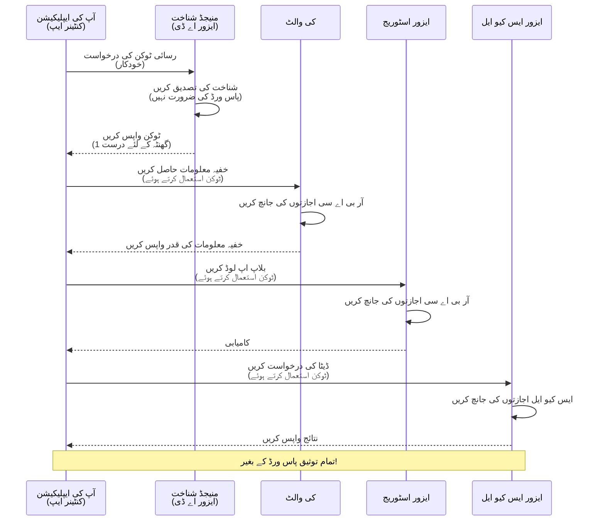
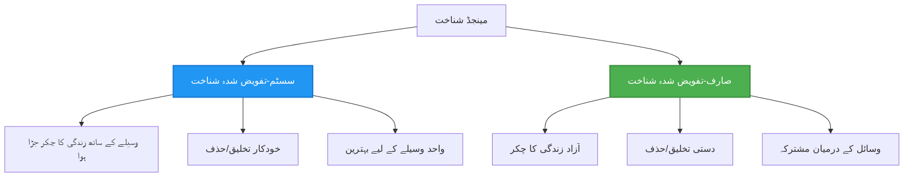

# تصدیق کے طریقے اور منیجڈ شناخت

⏱️ **تخمینی وقت**: 45-60 منٹ | 💰 **لاگت کا اثر**: مفت (کوئی اضافی چارجز نہیں) | ⭐ **پیچیدگی**: درمیانی

**📚 سیکھنے کا راستہ:**
- ← پچھلا: [کنفیگریشن مینجمنٹ](configuration.md) - ماحول کے متغیرات اور رازوں کا انتظام
- 🎯 **آپ یہاں ہیں**: تصدیق اور سیکیورٹی (منیجڈ شناخت، کی والٹ، محفوظ طریقے)
- → اگلا: [پہلا پروجیکٹ](first-project.md) - اپنا پہلا AZD ایپلیکیشن بنائیں
- 🏠 [کورس ہوم](../../README.md)

---

## آپ کیا سیکھیں گے

اس سبق کو مکمل کرنے کے بعد، آپ:
- Azure تصدیق کے طریقے (چابیاں، کنکشن اسٹرنگز، منیجڈ شناخت) کو سمجھیں گے
- **منیجڈ شناخت** کو پاس ورڈ کے بغیر تصدیق کے لیے نافذ کریں گے
- **Azure Key Vault** انضمام کے ساتھ رازوں کو محفوظ کریں گے
- AZD ڈیپلائمنٹس کے لیے **رول بیسڈ ایکسس کنٹرول (RBAC)** کو ترتیب دیں گے
- کنٹینر ایپس اور Azure سروسز میں سیکیورٹی کے بہترین طریقے اپلائی کریں گے
- چابی پر مبنی تصدیق سے شناخت پر مبنی تصدیق میں منتقلی کریں گے

## منیجڈ شناخت کیوں اہم ہے

### مسئلہ: روایتی تصدیق

**منیجڈ شناخت سے پہلے:**
```javascript
// ❌ سیکیورٹی خطرہ: کوڈ میں سخت کوڈ شدہ راز
const connectionString = "Server=mydb.database.windows.net;User=admin;Password=P@ssw0rd123";
const storageKey = "xK7mN9pQ2wR5tY8uI0oP3aS6dF1gH4jK...";
const cosmosKey = "C2x7B9n4M1p8Q5w3E6r0T2y5U8i1O4p7...";
```

**مسائل:**
- 🔴 **کوڈ، کنفیگریشن فائلز، ماحول کے متغیرات میں ظاہر راز**
- 🔴 **کریڈینشل کی تبدیلی** کوڈ میں تبدیلی اور دوبارہ ڈیپلائمنٹ کی ضرورت
- 🔴 **آڈٹ کے مسائل** - کس نے کب کیا رسائی حاصل کی؟
- 🔴 **بکھراؤ** - مختلف سسٹمز میں راز بکھرے ہوئے
- 🔴 **تعمیل کے خطرات** - سیکیورٹی آڈٹس میں ناکامی

### حل: منیجڈ شناخت

**منیجڈ شناخت کے بعد:**
```javascript
// ✅ محفوظ: کوڈ میں کوئی راز نہیں
const credential = new DefaultAzureCredential();
const client = new BlobServiceClient(
  "https://mystorageaccount.blob.core.windows.net",
  credential  // Azure خود بخود تصدیق کو سنبھالتا ہے
);
```

**فوائد:**
- ✅ **کوڈ یا کنفیگریشن میں کوئی راز نہیں**
- ✅ **خودکار تبدیلی** - Azure اس کا خیال رکھتا ہے
- ✅ **مکمل آڈٹ ٹریل** Azure AD لاگز میں
- ✅ **مرکزی سیکیورٹی** - Azure پورٹل میں انتظام کریں
- ✅ **تعمیل کے لیے تیار** - سیکیورٹی کے معیارات پر پورا اترتا ہے

**تشبیہہ**: روایتی تصدیق مختلف دروازوں کے لیے متعدد جسمانی چابیاں رکھنے جیسی ہے۔ منیجڈ شناخت ایک سیکیورٹی بیج کی طرح ہے جو خود بخود آپ کی شناخت کی بنیاد پر رسائی دیتا ہے—کوئی چابیاں گم کرنے، کاپی کرنے، یا تبدیل کرنے کی ضرورت نہیں۔

---

## آرکیٹیکچر کا جائزہ

### منیجڈ شناخت کے ساتھ تصدیق کا بہاؤ


### منیجڈ شناخت کی اقسام


| خصوصیت | سسٹم-تفویض کردہ | صارف-تفویض کردہ |
|---------|----------------|---------------|
| **زندگی کا دورانیہ** | وسائل سے منسلک | آزاد |
| **تخلیق** | وسائل کے ساتھ خودکار | دستی تخلیق |
| **حذف** | وسائل کے ساتھ حذف | وسائل کے حذف کے بعد بھی برقرار |
| **شیئرنگ** | صرف ایک وسائل | متعدد وسائل |
| **استعمال کا کیس** | سادہ منظرنامے | پیچیدہ کثیر وسائل منظرنامے |
| **AZD ڈیفالٹ** | ✅ تجویز کردہ | اختیاری |

---

## ضروریات

### مطلوبہ ٹولز

آپ کو پچھلے اسباق سے یہ انسٹال شدہ ہونا چاہیے:

```bash
# Azure Developer CLI کی تصدیق کریں
azd version
# ✅ متوقع: azd ورژن 1.0.0 یا اس سے زیادہ

# Azure CLI کی تصدیق کریں
az --version
# ✅ متوقع: azure-cli 2.50.0 یا اس سے زیادہ
```

### Azure کی ضروریات

- فعال Azure سبسکرپشن
- اجازتیں:
  - منیجڈ شناختیں تخلیق کریں
  - RBAC رولز تفویض کریں
  - Key Vault وسائل تخلیق کریں
  - کنٹینر ایپس ڈیپلائے کریں

### علم کی ضروریات

آپ کو مکمل کرنا چاہیے:
- [انسٹالیشن گائیڈ](installation.md) - AZD سیٹ اپ
- [AZD بنیادی باتیں](azd-basics.md) - بنیادی تصورات
- [کنفیگریشن مینجمنٹ](configuration.md) - ماحول کے متغیرات

---

## سبق 1: تصدیق کے طریقوں کو سمجھنا

### طریقہ 1: کنکشن اسٹرنگز (پرانا - گریز کریں)

**یہ کیسے کام کرتا ہے:**
```bash
# کنکشن سٹرنگ میں اسناد شامل ہیں
STORAGE_CONNECTION_STRING="DefaultEndpointsProtocol=https;AccountName=myaccount;AccountKey=xK7mN9pQ2wR5..."
COSMOS_CONNECTION_STRING="AccountEndpoint=https://myaccount.documents.azure.com:443/;AccountKey=C2x7..."
SQL_CONNECTION_STRING="Server=myserver.database.windows.net;User=admin;Password=P@ssw0rd..."
```

**مسائل:**
- ❌ راز ماحول کے متغیرات میں ظاہر
- ❌ ڈیپلائمنٹ سسٹمز میں لاگ کیا گیا
- ❌ تبدیل کرنا مشکل
- ❌ رسائی کا کوئی آڈٹ ٹریل نہیں

**استعمال کب کریں:** صرف مقامی ترقی کے لیے، کبھی پروڈکشن میں نہیں۔

---

### طریقہ 2: کی والٹ حوالہ جات (بہتر)

**یہ کیسے کام کرتا ہے:**
```bicep
// Store secret in Key Vault
resource keyVault 'Microsoft.KeyVault/vaults@2023-02-01' = {
  name: 'mykv'
  properties: {
    enableRbacAuthorization: true
  }
}

// Reference in Container App
env: [
  {
    name: 'STORAGE_KEY'
    secretRef: 'storage-key'  // References Key Vault
  }
]
```

**فوائد:**
- ✅ راز محفوظ طریقے سے کی والٹ میں ذخیرہ کیے گئے
- ✅ مرکزی راز کا انتظام
- ✅ کوڈ میں تبدیلی کے بغیر گردش

**حدود:**
- ⚠️ اب بھی چابیاں/پاس ورڈز استعمال کر رہے ہیں
- ⚠️ کی والٹ رسائی کا انتظام کرنا ضروری ہے

**استعمال کب کریں:** کنکشن اسٹرنگز سے منیجڈ شناخت کی طرف منتقلی کا مرحلہ۔

---

### طریقہ 3: منیجڈ شناخت (بہترین طریقہ)

**یہ کیسے کام کرتا ہے:**
```bicep
// Enable managed identity
resource containerApp 'Microsoft.App/containerApps@2023-05-01' = {
  name: 'myapp'
  identity: {
    type: 'SystemAssigned'  // Automatically creates identity
  }
}

// Grant permissions
resource roleAssignment 'Microsoft.Authorization/roleAssignments@2022-04-01' = {
  scope: storageAccount
  properties: {
    roleDefinitionId: storageBlobDataContributorRole
    principalId: containerApp.identity.principalId
  }
}
```

**ایپلیکیشن کوڈ:**
```javascript
// کوئی راز درکار نہیں!
const { DefaultAzureCredential } = require('@azure/identity');
const { BlobServiceClient } = require('@azure/storage-blob');

const credential = new DefaultAzureCredential();
const blobServiceClient = new BlobServiceClient(
  'https://mystorageaccount.blob.core.windows.net',
  credential
);
```

**فوائد:**
- ✅ کوڈ/کنفیگریشن میں کوئی راز نہیں
- ✅ خودکار کریڈینشل گردش
- ✅ مکمل آڈٹ ٹریل
- ✅ RBAC پر مبنی اجازتیں
- ✅ تعمیل کے لیے تیار

**استعمال کب کریں:** ہمیشہ، پروڈکشن ایپلیکیشنز کے لیے۔

---

## سبق 2: AZD کے ساتھ منیجڈ شناخت کو نافذ کرنا

### مرحلہ وار نفاذ

آئیے ایک محفوظ کنٹینر ایپ بنائیں جو منیجڈ شناخت کا استعمال کرتے ہوئے Azure اسٹوریج اور کی والٹ تک رسائی حاصل کرے۔

### پروجیکٹ کا ڈھانچہ

```
secure-app/
├── azure.yaml                 # AZD configuration
├── infra/
│   ├── main.bicep            # Main infrastructure
│   ├── core/
│   │   ├── identity.bicep    # Managed identity setup
│   │   ├── keyvault.bicep    # Key Vault configuration
│   │   └── storage.bicep     # Storage with RBAC
│   └── app/
│       └── container-app.bicep
└── src/
    ├── app.js                # Application code
    ├── package.json
    └── Dockerfile
```

### 1. AZD کو ترتیب دیں (azure.yaml)

```yaml
name: secure-app
metadata:
  template: secure-app@1.0.0

services:
  api:
    project: ./src
    language: js
    host: containerapp

# Enable managed identity (AZD handles this automatically)
```

### 2. انفراسٹرکچر: منیجڈ شناخت کو فعال کریں

**فائل: `infra/main.bicep`**

```bicep
targetScope = 'subscription'

param environmentName string
param location string = 'eastus'

var tags = { 'azd-env-name': environmentName }

// Resource group
resource rg 'Microsoft.Resources/resourceGroups@2021-04-01' = {
  name: 'rg-${environmentName}'
  location: location
  tags: tags
}

// Storage Account
module storage './core/storage.bicep' = {
  name: 'storage'
  scope: rg
  params: {
    name: 'st${uniqueString(rg.id)}'
    location: location
    tags: tags
  }
}

// Key Vault
module keyVault './core/keyvault.bicep' = {
  name: 'keyvault'
  scope: rg
  params: {
    name: 'kv-${uniqueString(rg.id)}'
    location: location
    tags: tags
  }
}

// Container App with Managed Identity
module containerApp './app/container-app.bicep' = {
  name: 'container-app'
  scope: rg
  params: {
    name: 'ca-${environmentName}'
    location: location
    tags: tags
    storageAccountName: storage.outputs.name
    keyVaultName: keyVault.outputs.name
  }
}

// Grant Container App access to Storage
module storageRoleAssignment './core/role-assignment.bicep' = {
  name: 'storage-role'
  scope: rg
  params: {
    principalId: containerApp.outputs.identityPrincipalId
    roleDefinitionId: 'ba92f5b4-2d11-453d-a403-e96b0029c9fe'  // Storage Blob Data Contributor
    targetResourceId: storage.outputs.id
  }
}

// Grant Container App access to Key Vault
module kvRoleAssignment './core/role-assignment.bicep' = {
  name: 'kv-role'
  scope: rg
  params: {
    principalId: containerApp.outputs.identityPrincipalId
    roleDefinitionId: '4633458b-17de-408a-b874-0445c86b69e6'  // Key Vault Secrets User
    targetResourceId: keyVault.outputs.id
  }
}

// Outputs
output AZURE_STORAGE_ACCOUNT_NAME string = storage.outputs.name
output AZURE_KEY_VAULT_NAME string = keyVault.outputs.name
output APP_URL string = containerApp.outputs.url
```

### 3. سسٹم-تفویض کردہ شناخت کے ساتھ کنٹینر ایپ

**فائل: `infra/app/container-app.bicep`**

```bicep
param name string
param location string
param tags object = {}
param storageAccountName string
param keyVaultName string

resource containerApp 'Microsoft.App/containerApps@2023-05-01' = {
  name: name
  location: location
  tags: tags
  identity: {
    type: 'SystemAssigned'  // 🔑 Enable managed identity
  }
  properties: {
    configuration: {
      ingress: {
        external: true
        targetPort: 3000
      }
    }
    template: {
      containers: [
        {
          name: 'api'
          image: 'myregistry.azurecr.io/api:latest'
          resources: {
            cpu: json('0.5')
            memory: '1Gi'
          }
          env: [
            {
              name: 'AZURE_STORAGE_ACCOUNT_NAME'
              value: storageAccountName
            }
            {
              name: 'AZURE_KEY_VAULT_NAME'
              value: keyVaultName
            }
            // 🔑 No secrets - managed identity handles authentication!
          ]
        }
      ]
    }
  }
}

// Output the identity for RBAC assignments
output identityPrincipalId string = containerApp.identity.principalId
output id string = containerApp.id
output url string = 'https://${containerApp.properties.configuration.ingress.fqdn}'
```

### 4. RBAC رول تفویض ماڈیول

**فائل: `infra/core/role-assignment.bicep`**

```bicep
param principalId string
param roleDefinitionId string  // Azure built-in role ID
param targetResourceId string

resource roleAssignment 'Microsoft.Authorization/roleAssignments@2022-04-01' = {
  name: guid(principalId, roleDefinitionId, targetResourceId)
  scope: resourceId('Microsoft.Resources/resourceGroups', resourceGroup().name)
  properties: {
    roleDefinitionId: subscriptionResourceId('Microsoft.Authorization/roleDefinitions', roleDefinitionId)
    principalId: principalId
    principalType: 'ServicePrincipal'
  }
}

output id string = roleAssignment.id
```

### 5. منیجڈ شناخت کے ساتھ ایپلیکیشن کوڈ

**فائل: `src/app.js`**

```javascript
const express = require('express');
const { DefaultAzureCredential } = require('@azure/identity');
const { BlobServiceClient } = require('@azure/storage-blob');
const { SecretClient } = require('@azure/keyvault-secrets');

const app = express();
const PORT = process.env.PORT || 3000;

// 🔑 اسناد کو شروع کریں (منظم شناخت کے ساتھ خود بخود کام کرتا ہے)
const credential = new DefaultAzureCredential();

// ایزور اسٹوریج کی ترتیب
const storageAccountName = process.env.AZURE_STORAGE_ACCOUNT_NAME;
const blobServiceClient = new BlobServiceClient(
  `https://${storageAccountName}.blob.core.windows.net`,
  credential  // کوئی چابیاں درکار نہیں!
);

// کی والٹ کی ترتیب
const keyVaultName = process.env.AZURE_KEY_VAULT_NAME;
const secretClient = new SecretClient(
  `https://${keyVaultName}.vault.azure.net`,
  credential  // کوئی چابیاں درکار نہیں!
);

// صحت کی جانچ
app.get('/health', (req, res) => {
  res.json({ status: 'healthy', authentication: 'managed-identity' });
});

// بلاپ اسٹوریج میں فائل اپ لوڈ کریں
app.post('/upload', async (req, res) => {
  try {
    const containerClient = blobServiceClient.getContainerClient('uploads');
    await containerClient.createIfNotExists();
    
    const blobName = `file-${Date.now()}.txt`;
    const blockBlobClient = containerClient.getBlockBlobClient(blobName);
    
    await blockBlobClient.upload('Hello from managed identity!', 30);
    
    res.json({
      success: true,
      blobName: blobName,
      message: 'File uploaded using managed identity!'
    });
  } catch (error) {
    console.error('Upload error:', error);
    res.status(500).json({ error: error.message });
  }
});

// کی والٹ سے راز حاصل کریں
app.get('/secret/:name', async (req, res) => {
  try {
    const secretName = req.params.name;
    const secret = await secretClient.getSecret(secretName);
    
    res.json({
      name: secretName,
      value: secret.value,
      message: 'Secret retrieved using managed identity!'
    });
  } catch (error) {
    console.error('Secret error:', error);
    res.status(500).json({ error: error.message });
  }
});

// بلاپ کنٹینرز کی فہرست بنائیں (پڑھنے کی رسائی کا مظاہرہ کرتا ہے)
app.get('/containers', async (req, res) => {
  try {
    const containers = [];
    for await (const container of blobServiceClient.listContainers()) {
      containers.push(container.name);
    }
    
    res.json({
      containers: containers,
      count: containers.length,
      message: 'Containers listed using managed identity!'
    });
  } catch (error) {
    console.error('List error:', error);
    res.status(500).json({ error: error.message });
  }
});

app.listen(PORT, () => {
  console.log(`Secure API listening on port ${PORT}`);
  console.log('Authentication: Managed Identity (passwordless)');
});
```

**فائل: `src/package.json`**

```json
{
  "name": "secure-app",
  "version": "1.0.0",
  "dependencies": {
    "express": "^4.18.2",
    "@azure/identity": "^4.0.0",
    "@azure/storage-blob": "^12.17.0",
    "@azure/keyvault-secrets": "^4.7.0"
  },
  "scripts": {
    "start": "node app.js"
  }
}
```

### 6. ڈیپلائے کریں اور ٹیسٹ کریں

```bash
# AZD ماحول کو شروع کریں
azd init

# بنیادی ڈھانچے اور ایپلیکیشن کو تعینات کریں
azd up

# ایپ کا URL حاصل کریں
APP_URL=$(azd env get-values | grep APP_URL | cut -d '=' -f2 | tr -d '"')

# صحت کی جانچ کریں
curl $APP_URL/health
```

**✅ متوقع نتیجہ:**
```json
{
  "status": "healthy",
  "authentication": "managed-identity"
}
```

**بلاب اپلوڈ ٹیسٹ کریں:**
```bash
curl -X POST $APP_URL/upload
```

**✅ متوقع نتیجہ:**
```json
{
  "success": true,
  "blobName": "file-1700404800000.txt",
  "message": "File uploaded using managed identity!"
}
```

**کنٹینر لسٹنگ ٹیسٹ کریں:**
```bash
curl $APP_URL/containers
```

**✅ متوقع نتیجہ:**
```json
{
  "containers": ["uploads"],
  "count": 1,
  "message": "Containers listed using managed identity!"
}
```

---

## عام Azure RBAC رولز

### منیجڈ شناخت کے لیے بلٹ ان رول IDs

| سروس | رول کا نام | رول ID | اجازتیں |
|---------|-----------|---------|-------------|
| **اسٹوریج** | اسٹوریج بلاب ڈیٹا ریڈر | `2a2b9908-6b94-4a3d-8e5a-a7d8f8cc8a12` | بلابز اور کنٹینرز پڑھیں |
| **اسٹوریج** | اسٹوریج بلاب ڈیٹا کنٹریبیوٹر | `ba92f5b4-2d11-453d-a403-e96b0029c9fe` | پڑھیں، لکھیں، بلابز حذف کریں |
| **اسٹوریج** | اسٹوریج کیو ڈیٹا کنٹریبیوٹر | `974c5e8b-45b9-4653-ba55-5f855dd0fb88` | کیو میسجز پڑھیں، لکھیں، حذف کریں |
| **کی والٹ** | کی والٹ سیکریٹس یوزر | `4633458b-17de-408a-b874-0445c86b69e6` | راز پڑھیں |
| **کی والٹ** | کی والٹ سیکریٹس آفیسر | `b86a8fe4-44ce-4948-aee5-eccb2c155cd7` | راز پڑھیں، لکھیں، حذف کریں |
| **کوسموس DB** | کوسموس DB بلٹ ان ڈیٹا ریڈر | `00000000-0000-0000-0000-000000000001` | کوسموس DB ڈیٹا پڑھیں |
| **کوسموس DB** | کوسموس DB بلٹ ان ڈیٹا کنٹریبیوٹر | `00000000-0000-0000-0000-000000000002` | کوسموس DB ڈیٹا پڑھیں، لکھیں |
| **SQL ڈیٹابیس** | SQL DB کنٹریبیوٹر | `9b7fa17d-e63e-47b0-bb0a-15c516ac86ec` | SQL ڈیٹابیسز کا انتظام کریں |
| **سروس بس** | Azure سروس بس ڈیٹا اونر | `090c5cfd-751d-490a-894a-3ce6f1109419` | میسجز بھیجیں، وصول کریں، انتظام کریں |

### رول IDs کیسے تلاش کریں

```bash
# تمام بلٹ ان کرداروں کی فہرست بنائیں
az role definition list --query "[].{Name:roleName, ID:name}" --output table

# مخصوص کردار تلاش کریں
az role definition list --query "[?contains(roleName, 'Storage Blob')].{Name:roleName, ID:name}" --output table

# کردار کی تفصیلات حاصل کریں
az role definition list --name "Storage Blob Data Contributor"
```

---

## عملی مشقیں

### مشق 1: موجودہ ایپ کے لیے منیجڈ شناخت کو فعال کریں ⭐⭐ (درمیانی)

**مقصد**: موجودہ کنٹینر ایپ ڈیپلائمنٹ میں منیجڈ شناخت شامل کریں

**منظرنامہ**: آپ کے پاس ایک کنٹینر ایپ ہے جو کنکشن اسٹرنگز استعمال کر رہی ہے۔ اسے منیجڈ شناخت میں تبدیل کریں۔

**آغاز کا نقطہ**: کنٹینر ایپ اس کنفیگریشن کے ساتھ:

```bicep
// ❌ Current: Using connection string
env: [
  {
    name: 'STORAGE_CONNECTION_STRING'
    secretRef: 'storage-connection'
  }
]
```

**اقدامات**:

1. **Bicep میں منیجڈ شناخت کو فعال کریں:**

```bicep
resource containerApp 'Microsoft.App/containerApps@2023-05-01' = {
  name: 'myapp'
  identity: {
    type: 'SystemAssigned'  // Add this
  }
  // ... rest of configuration
}
```

2. **اسٹوریج تک رسائی دیں:**

```bicep
// Get storage account reference
resource storageAccount 'Microsoft.Storage/storageAccounts@2023-01-01' existing = {
  name: storageAccountName
}

// Assign role
resource roleAssignment 'Microsoft.Authorization/roleAssignments@2022-04-01' = {
  name: guid(containerApp.id, 'ba92f5b4-2d11-453d-a403-e96b0029c9fe', storageAccount.id)
  scope: storageAccount
  properties: {
    roleDefinitionId: subscriptionResourceId('Microsoft.Authorization/roleDefinitions', 'ba92f5b4-2d11-453d-a403-e96b0029c9fe')
    principalId: containerApp.identity.principalId
    principalType: 'ServicePrincipal'
  }
}
```

3. **ایپلیکیشن کوڈ کو اپ ڈیٹ کریں:**

**پہلے (کنکشن اسٹرنگ):**
```javascript
const { BlobServiceClient } = require('@azure/storage-blob');

const blobServiceClient = BlobServiceClient.fromConnectionString(
  process.env.STORAGE_CONNECTION_STRING
);
```

**بعد میں (منیجڈ شناخت):**
```javascript
const { DefaultAzureCredential } = require('@azure/identity');
const { BlobServiceClient } = require('@azure/storage-blob');

const credential = new DefaultAzureCredential();
const blobServiceClient = new BlobServiceClient(
  `https://${process.env.STORAGE_ACCOUNT_NAME}.blob.core.windows.net`,
  credential
);
```

4. **ماحول کے متغیرات کو اپ ڈیٹ کریں:**

```bicep
env: [
  {
    name: 'STORAGE_ACCOUNT_NAME'
    value: storageAccountName  // Just the name, no secrets!
  }
  // Remove STORAGE_CONNECTION_STRING
]
```

5. **ڈیپلائے کریں اور ٹیسٹ کریں:**

```bash
# دوبارہ تعینات کریں
azd up

# جانچ کریں کہ یہ اب بھی کام کرتا ہے
curl https://myapp.azurecontainerapps.io/upload
```

**✅ کامیابی کے معیار:**
- ✅ ایپلیکیشن بغیر کسی غلطی کے ڈیپلائے ہوتی ہے
- ✅ اسٹوریج آپریشنز کام کرتے ہیں (اپلوڈ، لسٹ، ڈاؤنلوڈ)
- ✅ ماحول کے متغیرات میں کوئی کنکشن اسٹرنگز نہیں
- ✅ شناخت Azure پورٹل میں "Identity" بلیڈ کے تحت نظر آتی ہے

**تصدیق:**

```bash
# چیک کریں کہ منظم شناخت فعال ہے
az containerapp show \
  --name myapp \
  --resource-group rg-myapp \
  --query "identity.type"
# ✅ متوقع: "SystemAssigned"

# کردار کی تفویض چیک کریں
az role assignment list \
  --assignee $(az containerapp show --name myapp --resource-group rg-myapp --query "identity.principalId" -o tsv) \
  --scope /subscriptions/{sub-id}/resourceGroups/rg-myapp/providers/Microsoft.Storage/storageAccounts/mystorageaccount
# ✅ متوقع: "Storage Blob Data Contributor" کردار دکھاتا ہے
```

**وقت**: 20-30 منٹ

---

### مشق 2: صارف-تفویض کردہ شناخت کے ساتھ کثیر سروس رسائی ⭐⭐⭐ (اعلی درجے کا)

**مقصد**: ایک صارف-تفویض کردہ شناخت بنائیں جو متعدد کنٹینر ایپس کے درمیان شیئر ہو

**منظرنامہ**: آپ کے پاس 3 مائیکرو سروسز ہیں جنہیں ایک ہی اسٹوریج اکاؤنٹ اور کی والٹ تک رسائی کی ضرورت ہے۔

**اقدامات**:

1. **صارف-تفویض کردہ شناخت بنائیں:**

**فائل: `infra/core/identity.bicep`**

```bicep
param name string
param location string
param tags object = {}

resource userAssignedIdentity 'Microsoft.ManagedIdentity/userAssignedIdentities@2023-01-31' = {
  name: name
  location: location
  tags: tags
}

output id string = userAssignedIdentity.id
output principalId string = userAssignedIdentity.properties.principalId
output clientId string = userAssignedIdentity.properties.clientId
```

2. **صارف-تفویض کردہ شناخت کو رولز تفویض کریں:**

```bicep
// In main.bicep
module userIdentity './core/identity.bicep' = {
  name: 'user-identity'
  scope: rg
  params: {
    name: 'id-${environmentName}'
    location: location
    tags: tags
  }
}

// Grant Storage access
resource storageRoleAssignment 'Microsoft.Authorization/roleAssignments@2022-04-01' = {
  name: guid(userIdentity.outputs.principalId, 'storage-contributor')
  scope: storageAccount
  properties: {
    roleDefinitionId: subscriptionResourceId('Microsoft.Authorization/roleDefinitions', 'ba92f5b4-2d11-453d-a403-e96b0029c9fe')
    principalId: userIdentity.outputs.principalId
    principalType: 'ServicePrincipal'
  }
}

// Grant Key Vault access
resource kvRoleAssignment 'Microsoft.Authorization/roleAssignments@2022-04-01' = {
  name: guid(userIdentity.outputs.principalId, 'kv-secrets-user')
  scope: keyVault
  properties: {
    roleDefinitionId: subscriptionResourceId('Microsoft.Authorization/roleDefinitions', '4633458b-17de-408a-b874-0445c86b69e6')
    principalId: userIdentity.outputs.principalId
    principalType: 'ServicePrincipal'
  }
}
```

3. **متعدد کنٹینر ایپس کو شناخت تفویض کریں:**

```bicep
resource apiGateway 'Microsoft.App/containerApps@2023-05-01' = {
  name: 'api-gateway'
  identity: {
    type: 'UserAssigned'
    userAssignedIdentities: {
      '${userIdentity.outputs.id}': {}
    }
  }
  // ... rest of config
}

resource productService 'Microsoft.App/containerApps@2023-05-01' = {
  name: 'product-service'
  identity: {
    type: 'UserAssigned'
    userAssignedIdentities: {
      '${userIdentity.outputs.id}': {}
    }
  }
  // ... rest of config
}

resource orderService 'Microsoft.App/containerApps@2023-05-01' = {
  name: 'order-service'
  identity: {
    type: 'UserAssigned'
    userAssignedIdentities: {
      '${userIdentity.outputs.id}': {}
    }
  }
  // ... rest of config
}
```

4. **ایپلیکیشن کوڈ (تمام سروسز ایک ہی پیٹرن استعمال کرتی ہیں):**

```javascript
const { DefaultAzureCredential, ManagedIdentityCredential } = require('@azure/identity');

// صارف کے تفویض کردہ شناخت کے لیے، کلائنٹ آئی ڈی کی وضاحت کریں
const credential = new ManagedIdentityCredential(
  process.env.AZURE_CLIENT_ID  // صارف کے تفویض کردہ شناخت کلائنٹ آئی ڈی
);

// یا DefaultAzureCredential استعمال کریں (خودکار پتہ لگاتا ہے)
const credential = new DefaultAzureCredential();

const blobServiceClient = new BlobServiceClient(
  `https://${process.env.STORAGE_ACCOUNT_NAME}.blob.core.windows.net`,
  credential
);
```

5. **ڈیپلائے کریں اور تصدیق کریں:**

```bash
azd up

# تمام سروسز کی جانچ کریں کہ وہ اسٹوریج تک رسائی حاصل کر سکتی ہیں
curl https://api-gateway.azurecontainerapps.io/upload
curl https://product-service.azurecontainerapps.io/upload
curl https://order-service.azurecontainerapps.io/upload
```

**✅ کامیابی کے معیار:**
- ✅ ایک شناخت 3 سروسز کے درمیان شیئر کی گئی
- ✅ تمام سروسز اسٹوریج اور کی والٹ تک رسائی حاصل کر سکتی ہیں
- ✅ شناخت ایک سروس کو حذف کرنے پر برقرار رہتی ہے
- ✅ مرکزی اجازت کا انتظام

**صارف-تفویض کردہ شناخت کے فوائد:**
- انتظام کرنے کے لیے ایک شناخت
- سروسز کے درمیان مستقل اجازتیں
- سروس حذف کرنے پر برقرار رہتی ہے
- پیچیدہ آرکیٹیکچرز کے لیے بہتر

**وقت**: 30-40 منٹ

---

### مشق 3: کی والٹ سیکریٹ گردش کو نافذ کریں ⭐⭐⭐ (اعلی درجے کا)

**مقصد**: تیسرے فریق API چابیاں کی والٹ میں ذخیرہ کریں اور انہیں منیجڈ شناخت کا استعمال کرتے ہوئے حاصل کریں

**منظرنامہ**: آپ کی ایپ کو ایک بیرونی API (OpenAI، Stripe، SendGrid) کو کال کرنے کی ضرورت ہے جو API چابیاں کی ضرورت ہے۔

**اقدامات**:

1. **RBAC کے ساتھ کی والٹ بنائیں:**

**فائل: `infra/core/keyvault.bicep`**

```bicep
param name string
param location string
param tags object = {}

resource keyVault 'Microsoft.KeyVault/vaults@2023-02-01' = {
  name: name
  location: location
  tags: tags
  properties: {
    enableRbacAuthorization: true  // Use RBAC instead of access policies
    sku: {
      family: 'A'
      name: 'standard'
    }
    tenantId: subscription().tenantId
    enableSoftDelete: true
    softDeleteRetentionInDays: 90
  }
}

// Allow Container App to read secrets
output id string = keyVault.id
output name string = keyVault.name
output uri string = keyVault.properties.vaultUri
```

2. **کی والٹ میں راز ذخیرہ کریں:**

```bash
# کلیدی والٹ کا نام حاصل کریں
KV_NAME=$(azd env get-values | grep AZURE_KEY_VAULT_NAME | cut -d '=' -f2 | tr -d '"')

# تیسرے فریق کے API کیز کو محفوظ کریں
az keyvault secret set \
  --vault-name $KV_NAME \
  --name "OpenAI-ApiKey" \
  --value "sk-proj-xxxxxxxxxxxxx"

az keyvault secret set \
  --vault-name $KV_NAME \
  --name "Stripe-ApiKey" \
  --value "sk_live_xxxxxxxxxxxxx"

az keyvault secret set \
  --vault-name $KV_NAME \
  --name "SendGrid-ApiKey" \
  --value "SG.xxxxxxxxxxxxx"
```

3. **راز حاصل کرنے کے لیے ایپلیکیشن کوڈ:**

**فائل: `src/config.js`**

```javascript
const { DefaultAzureCredential } = require('@azure/identity');
const { SecretClient } = require('@azure/keyvault-secrets');

class Config {
  constructor() {
    this.credential = new DefaultAzureCredential();
    this.secretClient = new SecretClient(
      `https://${process.env.AZURE_KEY_VAULT_NAME}.vault.azure.net`,
      this.credential
    );
    this.cache = {};
  }

  async getSecret(secretName) {
    // پہلے کیش کو چیک کریں
    if (this.cache[secretName]) {
      return this.cache[secretName];
    }

    try {
      const secret = await this.secretClient.getSecret(secretName);
      this.cache[secretName] = secret.value;
      console.log(`✅ Retrieved secret: ${secretName}`);
      return secret.value;
    } catch (error) {
      console.error(`❌ Failed to get secret ${secretName}:`, error.message);
      throw error;
    }
  }

  async getOpenAIKey() {
    return this.getSecret('OpenAI-ApiKey');
  }

  async getStripeKey() {
    return this.getSecret('Stripe-ApiKey');
  }

  async getSendGridKey() {
    return this.getSecret('SendGrid-ApiKey');
  }
}

module.exports = new Config();
```

4. **ایپلیکیشن میں راز استعمال کریں:**

**فائل: `src/app.js`**

```javascript
const express = require('express');
const config = require('./config');
const { OpenAI } = require('openai');

const app = express();

// کلیدی والٹ سے کلید کے ساتھ اوپن اے آئی کو شروع کریں
let openaiClient;

async function initializeServices() {
  const openaiKey = await config.getOpenAIKey();
  openaiClient = new OpenAI({ apiKey: openaiKey });
  console.log('✅ Services initialized with secrets from Key Vault');
}

// آغاز پر کال کریں
initializeServices().catch(console.error);

app.post('/chat', async (req, res) => {
  try {
    const completion = await openaiClient.chat.completions.create({
      model: 'gpt-4',
      messages: [{ role: 'user', content: 'Hello!' }]
    });
    
    res.json({
      response: completion.choices[0].message.content,
      authentication: 'Key from Key Vault via Managed Identity'
    });
  } catch (error) {
    res.status(500).json({ error: error.message });
  }
});

app.listen(3000, () => {
  console.log('Secure API with Key Vault integration running');
});
```

5. **ڈیپلائے کریں اور ٹیسٹ کریں:**

```bash
azd up

# جانچ کریں کہ API کیز کام کرتی ہیں
curl -X POST https://myapp.azurecontainerapps.io/chat \
  -H "Content-Type: application/json" \
  -d '{"message":"Hello AI"}'
```

**✅ کامیابی کے معیار:**
- ✅ کوڈ یا ماحول کے متغیرات میں کوئی API چابیاں نہیں
- ✅ ایپلیکیشن کی والٹ سے چابیاں حاصل کرتی ہے
- ✅ تیسرے فریق APIs صحیح کام کرتے ہیں
- ✅ کوڈ میں تبدیلی کے بغیر چابیاں گردش کر سکتے ہیں

**ایک راز کو گردش کریں:**

```bash
# کلیدی والٹ میں راز کو اپ ڈیٹ کریں
az keyvault secret set \
  --vault-name $KV_NAME \
  --name "OpenAI-ApiKey" \
  --value "sk-proj-NEW_KEY_HERE"

# نئی کلید کو اٹھانے کے لیے ایپ کو دوبارہ شروع کریں
az containerapp revision restart \
  --name myapp \
  --resource-group rg-myapp
```

**وقت**: 25-35 منٹ

---

## علم کا چیک پوائنٹ

### 1. تصدیق کے طریقے ✓

اپنی سمجھ کو جانچیں:

- [ ] **Q1**: تین اہم تصدیق کے طریقے کیا ہیں؟ 
  - **A**: کنکشن اسٹرنگز (پرانا)، کی والٹ حوالہ جات (منتقلی)، منیجڈ شناخت (بہترین)

- [ ] **Q2**: منیجڈ شناخت کنکشن اسٹرنگز سے کیوں بہتر ہے؟
  - **A**: کوڈ میں کوئی راز نہیں، خودکار گردش، مکمل آڈٹ ٹریل، RBAC اجازتیں

- [ ] **Q3**: آپ کب صارف-تفویض کردہ شناخت استعمال کریں گے بجائے سسٹم-تفویض کردہ؟
  - **A**: جب شناخت کو متعدد وسائل کے درمیان شیئر کرنا ہو یا جب شناخت کا زندگی کا دورانیہ وسائل کے زندگی کے دورانیے سے آزاد ہو

**عملی تصدیق:**
```bash
# چیک کریں کہ آپ کی ایپ کس قسم کی شناخت استعمال کرتی ہے
az containerapp show \
  --name myapp \
  --resource-group rg-myapp \
  --query "identity.type"

# شناخت کے لئے تمام رول اسائنمنٹس کی فہرست بنائیں
az role assignment list \
  --assignee $(az containerapp show --name myapp --resource-group rg-myapp --query "identity.principalId" -o tsv)
```

---

### 2. RBAC اور اجازتیں ✓

اپنی سمجھ کو جانچیں:

- [ ] **Q1**: "Storage Blob Data Contributor" کے لیے رول ID کیا ہے؟
  - **A**: `ba92f5b4-2d11-453d-a403-e96b0029c9fe`

- [ ] **Q2**: "Key Vault Secrets User" کیا اجازتیں فراہم کرتا ہے؟
  - **A**: رازوں تک صرف پڑھنے کی رسائی (تخلیق، اپ ڈیٹ، یا حذف نہیں کر سکتا)

- [ ] **Q3**: آپ کنٹینر ایپ کو Azure SQL تک رسائی کیسے دیں گے؟
  - **A**: "SQL DB Contributor" رول تفویض کریں یا SQL کے لیے Azure AD تصدیق ترتیب دیں

**عملی تصدیق:**
```bash
# مخصوص کردار تلاش کریں
az role definition list --name "Storage Blob Data Contributor"

# چیک کریں کہ آپ کی شناخت کو کون سے کردار تفویض کیے گئے ہیں
PRINCIPAL_ID=$(az containerapp show --name myapp --resource-group rg-myapp --query "identity.principalId" -o tsv)
az role assignment list --assignee $PRINCIPAL_ID --output table
```

---

### 3. کی والٹ انضمام ✓

اپنی سمجھ کو جانچیں:
- [ ] **سوال 1**: Key Vault کے لیے RBAC کو access policies کے بجائے کیسے فعال کریں؟
  - **جواب**: Bicep میں `enableRbacAuthorization: true` سیٹ کریں

- [ ] **سوال 2**: کون سی Azure SDK لائبریری managed identity authentication کو ہینڈل کرتی ہے؟
  - **جواب**: `@azure/identity` کے ساتھ `DefaultAzureCredential` کلاس

- [ ] **سوال 3**: Key Vault کے راز کتنی دیر تک کیش میں رہتے ہیں؟
  - **جواب**: ایپلیکیشن پر منحصر؛ اپنی کیشنگ حکمت عملی نافذ کریں

**عملی تصدیق:**
```bash
# کلیدی والٹ تک رسائی کی جانچ کریں
az keyvault secret show \
  --vault-name $KV_NAME \
  --name "OpenAI-ApiKey" \
  --query "value"

# چیک کریں کہ RBAC فعال ہے
az keyvault show \
  --name $KV_NAME \
  --query "properties.enableRbacAuthorization"
# ✅ متوقع: درست
```

---

## سیکیورٹی کے بہترین طریقے

### ✅ کریں:

1. **پروڈکشن میں ہمیشہ managed identity استعمال کریں**
   ```bicep
   identity: {
     type: 'SystemAssigned'
   }
   ```

2. **کم سے کم اختیارات والے RBAC رولز استعمال کریں**
   - جہاں ممکن ہو "Reader" رولز استعمال کریں
   - "Owner" یا "Contributor" سے گریز کریں جب تک ضروری نہ ہو

3. **تیسری پارٹی کی چابیاں Key Vault میں محفوظ کریں**
   ```javascript
   const apiKey = await secretClient.getSecret('ThirdPartyApiKey');
   ```

4. **آڈٹ لاگنگ کو فعال کریں**
   ```bicep
   diagnosticSettings: {
     logs: [{ category: 'AuditEvent', enabled: true }]
   }
   ```

5. **ڈویلپمنٹ، اسٹیجنگ، اور پروڈکشن کے لیے مختلف شناختیں استعمال کریں**
   ```bash
   azd env new dev
   azd env new staging
   azd env new prod
   ```

6. **رازوں کو باقاعدگی سے گھمائیں**
   - Key Vault رازوں پر ختم ہونے کی تاریخیں سیٹ کریں
   - Azure Functions کے ساتھ گھماؤ کو خودکار بنائیں

### ❌ نہ کریں:

1. **رازوں کو کبھی بھی ہارڈ کوڈ نہ کریں**
   ```javascript
   // ❌ خراب
   const apiKey = "sk-proj-xxxxxxxxxxxxx";
   ```

2. **پروڈکشن میں کنکشن اسٹرنگز استعمال نہ کریں**
   ```javascript
   // ❌ خراب
   BlobServiceClient.fromConnectionString(process.env.STORAGE_CONNECTION_STRING)
   ```

3. **زیادہ اختیارات نہ دیں**
   ```bicep
   // ❌ BAD - too much access
   roleDefinitionId: 'Owner'
   
   // ✅ GOOD - least privilege
   roleDefinitionId: 'Storage Blob Data Reader'
   ```

4. **رازوں کو لاگ نہ کریں**
   ```javascript
   // ❌ خراب
   console.log('API Key:', apiKey);
   
   // ✅ اچھا
   console.log('API Key retrieved successfully');
   ```

5. **پروڈکشن شناختوں کو مختلف ماحول میں شیئر نہ کریں**
   ```bicep
   // ❌ BAD - same identity for dev and prod
   // ✅ GOOD - separate identities per environment
   ```

---

## خرابیوں کا سراغ لگانے کی گائیڈ

### مسئلہ: Azure Storage تک رسائی پر "Unauthorized"

**علامات:**
```
Error: Unauthorized (403)
AuthorizationPermissionMismatch: This request is not authorized to perform this operation
```

**تشخیص:**

```bash
# چیک کریں کہ منظم شناخت فعال ہے
az containerapp show \
  --name myapp \
  --resource-group rg-myapp \
  --query "identity.type"
# ✅ متوقع: "SystemAssigned" یا "UserAssigned"

# کردار کی تفویضات چیک کریں
PRINCIPAL_ID=$(az containerapp show --name myapp --resource-group rg-myapp --query "identity.principalId" -o tsv)
az role assignment list --assignee $PRINCIPAL_ID

# متوقع: "Storage Blob Data Contributor" یا اسی طرح کا کردار دیکھنا چاہیے
```

**حل:**

1. **صحیح RBAC رول دیں:**
```bash
STORAGE_ID=$(az storage account show --name mystorageaccount --resource-group rg-myapp --query "id" -o tsv)
az role assignment create \
  --assignee $PRINCIPAL_ID \
  --role "Storage Blob Data Contributor" \
  --scope $STORAGE_ID
```

2. **پھیلاؤ کے لیے انتظار کریں (5-10 منٹ لگ سکتے ہیں):**
```bash
# کردار تفویض کی حیثیت چیک کریں
az role assignment list --assignee $PRINCIPAL_ID --scope $STORAGE_ID
```

3. **یقینی بنائیں کہ ایپلیکیشن کوڈ صحیح شناخت استعمال کر رہا ہے:**
```javascript
// یقینی بنائیں کہ آپ DefaultAzureCredential استعمال کر رہے ہیں۔
const credential = new DefaultAzureCredential();
```

---

### مسئلہ: Key Vault تک رسائی مسترد

**علامات:**
```
Error: Forbidden (403)
The user, group or application does not have secrets get permission
```

**تشخیص:**

```bash
# چیک کریں کہ Key Vault RBAC فعال ہے
az keyvault show \
  --name $KV_NAME \
  --query "properties.enableRbacAuthorization"
# ✅ متوقع: درست

# رول اسائنمنٹس چیک کریں
az role assignment list \
  --assignee $PRINCIPAL_ID \
  --scope /subscriptions/{sub-id}/resourceGroups/rg-myapp/providers/Microsoft.KeyVault/vaults/$KV_NAME
```

**حل:**

1. **Key Vault پر RBAC کو فعال کریں:**
```bash
az keyvault update \
  --name $KV_NAME \
  --enable-rbac-authorization true
```

2. **Key Vault Secrets User رول دیں:**
```bash
KV_ID=$(az keyvault show --name $KV_NAME --query "id" -o tsv)
az role assignment create \
  --assignee $PRINCIPAL_ID \
  --role "Key Vault Secrets User" \
  --scope $KV_ID
```

---

### مسئلہ: DefaultAzureCredential مقامی طور پر ناکام ہو رہا ہے

**علامات:**
```
Error: DefaultAzureCredential failed to retrieve a token
CredentialUnavailableError: No credential available
```

**تشخیص:**

```bash
# چیک کریں کہ آپ لاگ ان ہیں
az account show

# Azure CLI کی تصدیق چیک کریں
az ad signed-in-user show
```

**حل:**

1. **Azure CLI میں لاگ ان کریں:**
```bash
az login
```

2. **Azure سبسکرپشن سیٹ کریں:**
```bash
az account set --subscription "Your Subscription Name"
```

3. **مقامی ترقی کے لیے، ماحول کے متغیرات استعمال کریں:**
```bash
export AZURE_TENANT_ID="your-tenant-id"
export AZURE_CLIENT_ID="your-client-id"
export AZURE_CLIENT_SECRET="your-client-secret"
```

4. **یا مقامی طور پر مختلف شناخت استعمال کریں:**
```javascript
const { DefaultAzureCredential, AzureCliCredential } = require('@azure/identity');

// مقامی ترقی کے لئے AzureCliCredential استعمال کریں
const credential = process.env.NODE_ENV === 'production' 
  ? new DefaultAzureCredential()
  : new AzureCliCredential();
```

---

### مسئلہ: رول اسائنمنٹ کے پھیلاؤ میں زیادہ وقت لگ رہا ہے

**علامات:**
- رول کامیابی سے اسائن کیا گیا
- پھر بھی 403 ایرر آ رہے ہیں
- کبھی کبھار رسائی (کبھی کام کرتا ہے، کبھی نہیں)

**وضاحت:**
Azure RBAC تبدیلیوں کو عالمی سطح پر پھیلنے میں 5-10 منٹ لگ سکتے ہیں۔

**حل:**

```bash
# انتظار کریں اور دوبارہ کوشش کریں
echo "Waiting for RBAC propagation..."
sleep 300  # 5 منٹ انتظار کریں

# رسائی کی جانچ کریں
curl https://myapp.azurecontainerapps.io/upload

# اگر ابھی بھی ناکام ہو رہا ہے، ایپ کو دوبارہ شروع کریں
az containerapp revision restart \
  --name myapp \
  --resource-group rg-myapp
```

---

## لاگت کے تحفظات

### Managed Identity کی لاگت

| وسیلہ | لاگت |
|-------|------|
| **Managed Identity** | 🆓 **مفت** - کوئی چارج نہیں |
| **RBAC رول اسائنمنٹس** | 🆓 **مفت** - کوئی چارج نہیں |
| **Azure AD ٹوکن درخواستیں** | 🆓 **مفت** - شامل |
| **Key Vault آپریشنز** | $0.03 فی 10,000 آپریشنز |
| **Key Vault اسٹوریج** | $0.024 فی راز فی مہینہ |

**Managed identity پیسے بچاتا ہے:**
- ✅ سروس ٹو سروس آتھ کے لیے Key Vault آپریشنز کو ختم کر کے
- ✅ سیکیورٹی کے واقعات کو کم کر کے (کوئی لیکڈ اسناد نہیں)
- ✅ آپریشنل اوور ہیڈ کو کم کر کے (کوئی دستی گھماؤ نہیں)

**مثال لاگت کا موازنہ (ماہانہ):**

| منظرنامہ | کنکشن اسٹرنگز | Managed Identity | بچت |
|-----------|----------------|------------------|------|
| چھوٹا ایپ (1M درخواستیں) | ~$50 (Key Vault + آپریشنز) | ~$0 | $50/ماہ |
| درمیانہ ایپ (10M درخواستیں) | ~$200 | ~$0 | $200/ماہ |
| بڑا ایپ (100M درخواستیں) | ~$1,500 | ~$0 | $1,500/ماہ |

---

## مزید سیکھیں

### سرکاری دستاویزات
- [Azure Managed Identity](https://learn.microsoft.com/entra/identity/managed-identities-azure-resources/overview)
- [Azure RBAC](https://learn.microsoft.com/azure/role-based-access-control/overview)
- [Azure Key Vault](https://learn.microsoft.com/azure/key-vault/general/overview)
- [DefaultAzureCredential](https://learn.microsoft.com/dotnet/api/azure.identity.defaultazurecredential)

### SDK دستاویزات
- [@azure/identity (Node.js)](https://www.npmjs.com/package/@azure/identity)
- [Azure.Identity (C#)](https://www.nuget.org/packages/Azure.Identity/)
- [azure-identity (Python)](https://pypi.org/project/azure-identity/)

### اس کورس میں اگلے اقدامات
- ← پچھلا: [کنفیگریشن مینجمنٹ](configuration.md)
- → اگلا: [پہلا پروجیکٹ](first-project.md)
- 🏠 [کورس ہوم](../../README.md)

### متعلقہ مثالیں
- [Azure OpenAI چیٹ کی مثال](../../../../examples/azure-openai-chat) - Azure OpenAI کے لیے managed identity استعمال کرتا ہے
- [مائیکرو سروسز کی مثال](../../../../examples/microservices) - ملٹی سروس آتھنٹیکیشن پیٹرنز

---

## خلاصہ

**آپ نے سیکھا:**
- ✅ تین آتھنٹیکیشن پیٹرنز (کنکشن اسٹرنگز، Key Vault، managed identity)
- ✅ AZD میں managed identity کو فعال اور ترتیب دینے کا طریقہ
- ✅ Azure سروسز کے لیے RBAC رول اسائنمنٹس
- ✅ تیسری پارٹی کے رازوں کے لیے Key Vault انضمام
- ✅ یوزر اسائنڈ اور سسٹم اسائنڈ شناختوں کے درمیان فرق
- ✅ سیکیورٹی کے بہترین طریقے اور خرابیوں کا سراغ لگانا

**اہم نکات:**
1. **پروڈکشن میں ہمیشہ managed identity استعمال کریں** - کوئی راز نہیں، خودکار گھماؤ
2. **کم سے کم اختیارات والے RBAC رولز استعمال کریں** - صرف ضروری اجازتیں دیں
3. **تیسری پارٹی کی چابیاں Key Vault میں محفوظ کریں** - مرکزی راز مینجمنٹ
4. **ہر ماحول کے لیے علیحدہ شناختیں رکھیں** - ڈویلپمنٹ، اسٹیجنگ، پروڈکشن کی علیحدگی
5. **آڈٹ لاگنگ کو فعال کریں** - ٹریک کریں کہ کس نے کیا رسائی حاصل کی

**اگلے اقدامات:**
1. اوپر دیے گئے عملی مشقیں مکمل کریں
2. کسی موجودہ ایپ کو کنکشن اسٹرنگز سے managed identity پر منتقل کریں
3. پہلے دن سے سیکیورٹی کے ساتھ اپنا پہلا AZD پروجیکٹ بنائیں: [پہلا پروجیکٹ](first-project.md)

---

<!-- CO-OP TRANSLATOR DISCLAIMER START -->
**اعلانِ لاتعلقی**:  
یہ دستاویز AI ترجمہ سروس [Co-op Translator](https://github.com/Azure/co-op-translator) کا استعمال کرتے ہوئے ترجمہ کی گئی ہے۔ ہم درستگی کی بھرپور کوشش کرتے ہیں، لیکن براہ کرم آگاہ رہیں کہ خودکار ترجمے میں غلطیاں یا غیر درستیاں ہو سکتی ہیں۔ اصل دستاویز کو اس کی اصل زبان میں مستند ذریعہ سمجھا جانا چاہیے۔ اہم معلومات کے لیے، پیشہ ور انسانی ترجمہ کی سفارش کی جاتی ہے۔ اس ترجمے کے استعمال سے پیدا ہونے والی کسی بھی غلط فہمی یا غلط تشریح کے لیے ہم ذمہ دار نہیں ہیں۔
<!-- CO-OP TRANSLATOR DISCLAIMER END -->