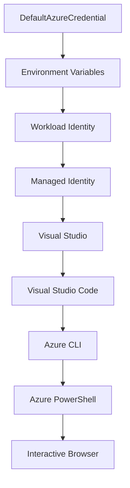

<!--
CO_OP_TRANSLATOR_METADATA:
{
  "original_hash": "4dc26ed8004b58a51875efd07203340f",
  "translation_date": "2025-09-26T18:27:24+00:00",
  "source_file": "docs/getting-started/azd-basics.md",
  "language_code": "ur"
}
-->
# AZD بنیادی اصول - Azure Developer CLI کو سمجھنا

# AZD بنیادی اصول - اہم تصورات اور بنیادی معلومات

**باب کی نیویگیشن:**
- **📚 کورس ہوم**: [AZD ابتدائیوں کے لیے](../../README.md)
- **📖 موجودہ باب**: باب 1 - بنیاد اور فوری آغاز
- **⬅️ پچھلا**: [کورس کا جائزہ](../../README.md#-chapter-1-foundation--quick-start)
- **➡️ اگلا**: [انسٹالیشن اور سیٹ اپ](installation.md)
- **🚀 اگلا باب**: [باب 2: AI-فرسٹ ڈیولپمنٹ](../ai-foundry/azure-ai-foundry-integration.md)

## تعارف

یہ سبق آپ کو Azure Developer CLI (azd) سے متعارف کراتا ہے، جو ایک طاقتور کمانڈ لائن ٹول ہے جو مقامی ترقی سے Azure پر تعیناتی تک کے سفر کو تیز کرتا ہے۔ آپ بنیادی تصورات، اہم خصوصیات سیکھیں گے اور سمجھیں گے کہ azd کلاؤڈ نیٹو ایپلیکیشن کی تعیناتی کو کس طرح آسان بناتا ہے۔

## سیکھنے کے اہداف

اس سبق کے اختتام تک، آپ:
- سمجھ سکیں گے کہ Azure Developer CLI کیا ہے اور اس کا بنیادی مقصد کیا ہے
- ٹیمپلیٹس، ماحولیات، اور سروسز کے بنیادی تصورات سیکھیں گے
- اہم خصوصیات جیسے ٹیمپلیٹ پر مبنی ترقی اور انفراسٹرکچر کوڈ کے طور پر دریافت کریں گے
- azd پروجیکٹ کی ساخت اور ورک فلو کو سمجھیں گے
- اپنے ترقیاتی ماحول کے لیے azd انسٹال اور ترتیب دینے کے لیے تیار ہوں گے

## سیکھنے کے نتائج

اس سبق کو مکمل کرنے کے بعد، آپ:
- جدید کلاؤڈ ڈیولپمنٹ ورک فلو میں azd کے کردار کی وضاحت کر سکیں گے
- azd پروجیکٹ کی ساخت کے اجزاء کی شناخت کر سکیں گے
- بیان کر سکیں گے کہ ٹیمپلیٹس، ماحولیات، اور سروسز کس طرح مل کر کام کرتے ہیں
- azd کے ساتھ انفراسٹرکچر کوڈ کے فوائد کو سمجھ سکیں گے
- مختلف azd کمانڈز اور ان کے مقاصد کو پہچان سکیں گے

## Azure Developer CLI (azd) کیا ہے؟

Azure Developer CLI (azd) ایک کمانڈ لائن ٹول ہے جو مقامی ترقی سے Azure پر تعیناتی تک کے سفر کو تیز کرنے کے لیے ڈیزائن کیا گیا ہے۔ یہ Azure پر کلاؤڈ نیٹو ایپلیکیشنز کی تعمیر، تعیناتی، اور انتظام کے عمل کو آسان بناتا ہے۔

## بنیادی تصورات

### ٹیمپلیٹس
ٹیمپلیٹس azd کی بنیاد ہیں۔ ان میں شامل ہیں:
- **ایپلیکیشن کوڈ** - آپ کا سورس کوڈ اور ڈیپینڈنسیز
- **انفراسٹرکچر کی تعریفیں** - Azure وسائل جو Bicep یا Terraform میں بیان کیے گئے ہیں
- **کنفیگریشن فائلز** - سیٹنگز اور ماحولیات کے متغیرات
- **تعیناتی اسکرپٹس** - خودکار تعیناتی ورک فلو

### ماحولیات
ماحولیات مختلف تعیناتی اہداف کی نمائندگی کرتے ہیں:
- **ترقی** - ٹیسٹنگ اور ترقی کے لیے
- **اسٹیجنگ** - پری پروڈکشن ماحول
- **پروڈکشن** - لائیو پروڈکشن ماحول

ہر ماحول اپنے:
- Azure ریسورس گروپ
- کنفیگریشن سیٹنگز
- تعیناتی کی حالت کو برقرار رکھتا ہے

### سروسز
سروسز آپ کی ایپلیکیشن کے بلڈنگ بلاکس ہیں:
- **فرنٹ اینڈ** - ویب ایپلیکیشنز، SPAs
- **بیک اینڈ** - APIs، مائیکرو سروسز
- **ڈیٹا بیس** - ڈیٹا اسٹوریج حل
- **اسٹوریج** - فائل اور بلاک اسٹوریج

## اہم خصوصیات

### 1. ٹیمپلیٹ پر مبنی ترقی
```bash
# Browse available templates
azd template list

# Initialize from a template
azd init --template <template-name>
```

### 2. انفراسٹرکچر کوڈ کے طور پر
- **Bicep** - Azure کی ڈومین مخصوص زبان
- **Terraform** - ملٹی کلاؤڈ انفراسٹرکچر ٹول
- **ARM ٹیمپلیٹس** - Azure Resource Manager ٹیمپلیٹس

### 3. مربوط ورک فلو
```bash
# Complete deployment workflow
azd up            # Provision + Deploy this is hands off for first time setup
azd provision     # Create Azure resources if you update the infrastructure use this
azd deploy        # Deploy application code or redeploy application code once update
azd down          # Clean up resources
```

### 4. ماحولیات کا انتظام
```bash
# Create and manage environments
azd env new <environment-name>
azd env select <environment-name>
azd env list
```

## 📁 پروجیکٹ کی ساخت

ایک عام azd پروجیکٹ کی ساخت:
```
my-app/
├── .azd/                    # azd configuration
│   └── config.json
├── .azure/                  # Azure deployment artifacts
├── .devcontainer/          # Development container config
├── .github/workflows/      # GitHub Actions
├── .vscode/               # VS Code settings
├── infra/                 # Infrastructure code
│   ├── main.bicep        # Main infrastructure template
│   ├── main.parameters.json
│   └── modules/          # Reusable modules
├── src/                  # Application source code
│   ├── api/             # Backend services
│   └── web/             # Frontend application
├── azure.yaml           # azd project configuration
└── README.md
```

## 🔧 کنفیگریشن فائلز

### azure.yaml
مرکزی پروجیکٹ کنفیگریشن فائل:
```yaml
name: my-awesome-app
metadata:
  template: my-template@1.0.0

services:
  web:
    project: ./src/web
    language: js
    host: appservice
  api:
    project: ./src/api
    language: js
    host: appservice

hooks:
  preprovision:
    shell: pwsh
    run: echo "Preparing to provision..."
```

### .azure/config.json
ماحولیات کے لیے مخصوص کنفیگریشن:
```json
{
  "version": 1,
  "defaultEnvironment": "dev",
  "environments": {
    "dev": {
      "subscriptionId": "your-subscription-id",
      "location": "eastus"
    }
  }
}
```

## 🎪 عام ورک فلو

### نیا پروجیکٹ شروع کرنا
```bash
# Method 1: Use existing template
azd init --template todo-nodejs-mongo

# Method 2: Start from scratch
azd init

# Method 3: Use current directory
azd init .
```

### ترقیاتی سائیکل
```bash
# Set up development environment
azd auth login
azd env new dev
azd env select dev

# Deploy everything
azd up

# Make changes and redeploy
azd deploy

# Clean up when done
azd down --force --purge # command in the Azure Developer CLI is a **hard reset** for your environment—especially useful when you're troubleshooting failed deployments, cleaning up orphaned resources, or prepping for a fresh redeploy.
```

## `azd down --force --purge` کو سمجھنا
`azd down --force --purge` کمانڈ آپ کے azd ماحول اور تمام متعلقہ وسائل کو مکمل طور پر ختم کرنے کا ایک طاقتور طریقہ ہے۔ یہاں ہر فلیگ کا تجزیہ ہے:
```
--force
```
- تصدیقی پرامپٹس کو چھوڑ دیتا ہے۔
- آٹومیشن یا اسکرپٹنگ کے لیے مفید ہے جہاں دستی ان پٹ ممکن نہیں۔
- یقینی بناتا ہے کہ ختم کرنے کا عمل بغیر کسی رکاوٹ کے جاری رہے، چاہے CLI تضادات کا پتہ لگائے۔

```
--purge
```
**تمام متعلقہ میٹا ڈیٹا** کو حذف کرتا ہے، بشمول:
ماحولیات کی حالت
مقامی `.azure` فولڈر
کیچڈ تعیناتی معلومات
azd کو "پچھلی تعیناتیوں" کو یاد رکھنے سے روکتا ہے، جو مسائل جیسے غیر مماثل ریسورس گروپس یا پرانے رجسٹری حوالہ جات کا سبب بن سکتے ہیں۔

### دونوں کو کیوں استعمال کریں؟
جب آپ `azd up` کے ساتھ کسی مسئلے کا سامنا کرتے ہیں جو باقی حالت یا جزوی تعیناتیوں کی وجہ سے ہوتا ہے، تو یہ امتزاج ایک **صاف آغاز** کو یقینی بناتا ہے۔

یہ خاص طور پر Azure پورٹل میں دستی وسائل کو حذف کرنے کے بعد یا ٹیمپلیٹس، ماحولیات، یا ریسورس گروپ کے نام دینے کے کنونشنز کو تبدیل کرتے وقت مددگار ہے۔

### متعدد ماحولیات کا انتظام
```bash
# Create staging environment
azd env new staging
azd env select staging
azd up

# Switch back to dev
azd env select dev

# Compare environments
azd env list
```

## 🔐 تصدیق اور اسناد

تصدیق کو سمجھنا کامیاب azd تعیناتیوں کے لیے بہت ضروری ہے۔ Azure متعدد تصدیق کے طریقے استعمال کرتا ہے، اور azd وہی اسناد چین استعمال کرتا ہے جو دیگر Azure ٹولز استعمال کرتے ہیں۔

### Azure CLI تصدیق (`az login`)

azd استعمال کرنے سے پہلے، آپ کو Azure کے ساتھ تصدیق کرنی ہوگی۔ سب سے عام طریقہ Azure CLI کا استعمال ہے:

```bash
# Interactive login (opens browser)
az login

# Login with specific tenant
az login --tenant <tenant-id>

# Login with service principal
az login --service-principal -u <app-id> -p <password> --tenant <tenant-id>

# Check current login status
az account show

# List available subscriptions
az account list --output table

# Set default subscription
az account set --subscription <subscription-id>
```

### تصدیق کا بہاؤ
1. **انٹرایکٹو لاگ ان**: تصدیق کے لیے آپ کے ڈیفالٹ براؤزر کو کھولتا ہے
2. **ڈیوائس کوڈ فلو**: ایسے ماحول کے لیے جہاں براؤزر تک رسائی نہیں ہے
3. **سروس پرنسپل**: آٹومیشن اور CI/CD منظرناموں کے لیے
4. **منیجڈ آئیڈینٹیٹی**: Azure پر ہوسٹ کردہ ایپلیکیشنز کے لیے

### DefaultAzureCredential چین

`DefaultAzureCredential` ایک اسناد کی قسم ہے جو متعدد اسناد کے ذرائع کو ایک مخصوص ترتیب میں خود بخود آزمانے کے ذریعے ایک آسان تصدیق کا تجربہ فراہم کرتی ہے:

#### اسناد چین ترتیب


#### 1. ماحولیات کے متغیرات
```bash
# Set environment variables for service principal
export AZURE_CLIENT_ID="<app-id>"
export AZURE_CLIENT_SECRET="<password>"
export AZURE_TENANT_ID="<tenant-id>"
```

#### 2. ورک لوڈ آئیڈینٹیٹی (Kubernetes/GitHub Actions)
خود بخود استعمال ہوتا ہے:
- Azure Kubernetes Service (AKS) کے ساتھ ورک لوڈ آئیڈینٹیٹی
- GitHub Actions کے ساتھ OIDC فیڈریشن
- دیگر فیڈریٹڈ آئیڈینٹیٹی منظرنامے

#### 3. منیجڈ آئیڈینٹیٹی
Azure وسائل کے لیے جیسے:
- ورچوئل مشینز
- ایپ سروس
- Azure فنکشنز
- کنٹینر انسٹینسز

```bash
# Check if running on Azure resource with managed identity
az account show --query "user.type" --output tsv
# Returns: "servicePrincipal" if using managed identity
```

#### 4. ڈیولپر ٹولز انٹیگریشن
- **Visual Studio**: خود بخود سائن ان شدہ اکاؤنٹ استعمال کرتا ہے
- **VS Code**: Azure اکاؤنٹ ایکسٹینشن کی اسناد استعمال کرتا ہے
- **Azure CLI**: `az login` کی اسناد استعمال کرتا ہے (مقامی ترقی کے لیے سب سے عام)

### AZD تصدیق سیٹ اپ

```bash
# Method 1: Use Azure CLI (Recommended for development)
az login
azd auth login  # Uses existing Azure CLI credentials

# Method 2: Direct azd authentication
azd auth login --use-device-code  # For headless environments

# Method 3: Check authentication status
azd auth login --check-status

# Method 4: Logout and re-authenticate
azd auth logout
azd auth login
```

### تصدیق کے بہترین طریقے

#### مقامی ترقی کے لیے
```bash
# 1. Login with Azure CLI
az login

# 2. Verify correct subscription
az account show
az account set --subscription "Your Subscription Name"

# 3. Use azd with existing credentials
azd auth login
```

#### CI/CD پائپ لائنز کے لیے
```yaml
# GitHub Actions example
- name: Azure Login
  uses: azure/login@v1
  with:
    creds: ${{ secrets.AZURE_CREDENTIALS }}

- name: Deploy with azd
  run: |
    azd auth login --client-id ${{ secrets.AZURE_CLIENT_ID }} \
                    --client-secret ${{ secrets.AZURE_CLIENT_SECRET }} \
                    --tenant-id ${{ secrets.AZURE_TENANT_ID }}
    azd up --no-prompt
```

#### پروڈکشن ماحولیات کے لیے
- Azure وسائل پر چلتے وقت **منیجڈ آئیڈینٹیٹی** استعمال کریں
- آٹومیشن منظرناموں کے لیے **سروس پرنسپل** استعمال کریں
- کوڈ یا کنفیگریشن فائلز میں اسناد ذخیرہ کرنے سے گریز کریں
- حساس کنفیگریشن کے لیے **Azure Key Vault** استعمال کریں

### عام تصدیق کے مسائل اور حل

#### مسئلہ: "کوئی سبسکرپشن نہیں ملا"
```bash
# Solution: Set default subscription
az account list --output table
az account set --subscription "<subscription-id>"
azd env set AZURE_SUBSCRIPTION_ID "<subscription-id>"
```

#### مسئلہ: "ناکافی اجازتیں"
```bash
# Solution: Check and assign required roles
az role assignment list --assignee $(az account show --query user.name --output tsv)

# Common required roles:
# - Contributor (for resource management)
# - User Access Administrator (for role assignments)
```

#### مسئلہ: "ٹوکن کی میعاد ختم ہوگئی"
```bash
# Solution: Re-authenticate
az logout
az login
azd auth logout
azd auth login
```

### مختلف منظرناموں میں تصدیق

#### مقامی ترقی
```bash
# Personal development account
az login
azd auth login
```

#### ٹیم ترقی
```bash
# Use specific tenant for organization
az login --tenant contoso.onmicrosoft.com
azd auth login
```

#### ملٹی ٹیننٹ منظرنامے
```bash
# Switch between tenants
az login --tenant tenant1.onmicrosoft.com
# Deploy to tenant 1
azd up

az login --tenant tenant2.onmicrosoft.com  
# Deploy to tenant 2
azd up
```

### سیکیورٹی کے تحفظات

1. **اسناد کا ذخیرہ**: اسناد کو سورس کوڈ میں کبھی ذخیرہ نہ کریں
2. **دائرہ محدود کرنا**: سروس پرنسپل کے لیے کم سے کم مراعات کے اصول کا استعمال کریں
3. **ٹوکن کی گردش**: سروس پرنسپل کے راز کو باقاعدگی سے گھمائیں
4. **آڈٹ ٹریل**: تصدیق اور تعیناتی کی سرگرمیوں کی نگرانی کریں
5. **نیٹ ورک سیکیورٹی**: ممکن ہو تو نجی اینڈپوائنٹس استعمال کریں

### تصدیق کی خرابیوں کا ازالہ

```bash
# Debug authentication issues
azd auth login --check-status
az account show
az account get-access-token

# Common diagnostic commands
whoami                          # Current user context
az ad signed-in-user show      # Azure AD user details
az group list                  # Test resource access
```

## `azd down --force --purge` کو سمجھنا

### دریافت
```bash
azd template list              # Browse templates
azd template show <template>   # Template details
azd init --help               # Initialization options
```

### پروجیکٹ کا انتظام
```bash
azd show                     # Project overview
azd env show                 # Current environment
azd config list             # Configuration settings
```

### نگرانی
```bash
azd monitor                  # Open Azure portal
azd pipeline config          # Set up CI/CD
azd logs                     # View application logs
```

## بہترین طریقے

### 1. معنی خیز نام استعمال کریں
```bash
# Good
azd env new production-east
azd init --template web-app-secure

# Avoid
azd env new env1
azd init --template template1
```

### 2. ٹیمپلیٹس کا فائدہ اٹھائیں
- موجودہ ٹیمپلیٹس سے شروع کریں
- اپنی ضروریات کے مطابق حسب ضرورت بنائیں
- اپنی تنظیم کے لیے دوبارہ قابل استعمال ٹیمپلیٹس بنائیں

### 3. ماحولیات کی علیحدگی
- ترقی/اسٹیجنگ/پروڈکشن کے لیے الگ ماحولیات استعمال کریں
- مقامی مشین سے براہ راست پروڈکشن پر کبھی تعیناتی نہ کریں
- پروڈکشن تعیناتیوں کے لیے CI/CD پائپ لائنز استعمال کریں

### 4. کنفیگریشن کا انتظام
- حساس ڈیٹا کے لیے ماحولیات کے متغیرات استعمال کریں
- کنفیگریشن کو ورژن کنٹرول میں رکھیں
- ماحولیات کے لیے مخصوص سیٹنگز کو دستاویز کریں

## سیکھنے کی ترقی

### ابتدائی (ہفتہ 1-2)
1. azd انسٹال کریں اور تصدیق کریں
2. ایک سادہ ٹیمپلیٹ تعینات کریں
3. پروجیکٹ کی ساخت کو سمجھیں
4. بنیادی کمانڈز سیکھیں (up, down, deploy)

### درمیانی (ہفتہ 3-4)
1. ٹیمپلیٹس کو حسب ضرورت بنائیں
2. متعدد ماحولیات کا انتظام کریں
3. انفراسٹرکچر کوڈ کو سمجھیں
4. CI/CD پائپ لائنز سیٹ اپ کریں

### اعلیٰ درجے کا (ہفتہ 5+)
1. حسب ضرورت ٹیمپلیٹس بنائیں
2. اعلیٰ درجے کے انفراسٹرکچر پیٹرنز
3. ملٹی ریجن تعیناتیاں
4. انٹرپرائز گریڈ کنفیگریشنز

## اگلے مراحل

**📖 باب 1 کی سیکھنے کو جاری رکھیں:**
- [انسٹالیشن اور سیٹ اپ](installation.md) - azd انسٹال کریں اور ترتیب دیں
- [آپ کا پہلا پروجیکٹ](first-project.md) - مکمل ہینڈز آن ٹیوٹوریل
- [کنفیگریشن گائیڈ](configuration.md) - اعلیٰ درجے کے کنفیگریشن آپشنز

**🎯 اگلے باب کے لیے تیار؟**
- [باب 2: AI-فرسٹ ڈیولپمنٹ](../ai-foundry/azure-ai-foundry-integration.md) - AI ایپلیکیشنز بنانا شروع کریں

## اضافی وسائل

- [Azure Developer CLI کا جائزہ](https://learn.microsoft.com/en-us/azure/developer/azure-developer-cli/)
- [ٹیمپلیٹ گیلری](https://azure.github.io/awesome-azd/)
- [کمیونٹی سیمپلز](https://github.com/Azure-Samples)

---

**باب کی نیویگیشن:**
- **📚 کورس ہوم**: [AZD ابتدائیوں کے لیے](../../README.md)
- **📖 موجودہ باب**: باب 1 - بنیاد اور فوری آغاز  
- **⬅️ پچھلا**: [کورس کا جائزہ](../../README.md#-chapter-1-foundation--quick-start)
- **➡️ اگلا**: [انسٹالیشن اور سیٹ اپ](installation.md)
- **🚀 اگلا باب**: [باب 2: AI-فرسٹ ڈیولپمنٹ](../ai-foundry/azure-ai-foundry-integration.md)

---

