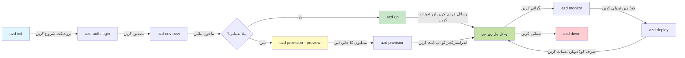
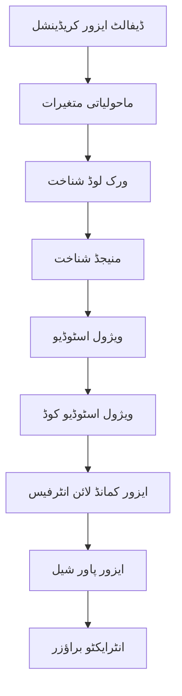

# AZD بنیادی باتیں - Azure Developer CLI کو سمجھنا

# AZD بنیادی باتیں - اہم تصورات اور اصول

**باب کی نیویگیشن:**
- **📚 کورس ہوم**: [AZD ابتدائیوں کے لیے](../../README.md)
- **📖 موجودہ باب**: باب 1 - بنیاد اور فوری آغاز
- **⬅️ پچھلا**: [کورس کا جائزہ](../../README.md#-chapter-1-foundation--quick-start)
- **➡️ اگلا**: [انسٹالیشن اور سیٹ اپ](installation.md)
- **🚀 اگلا باب**: [باب 2: AI-فرسٹ ڈیولپمنٹ](../microsoft-foundry/microsoft-foundry-integration.md)

## تعارف

اس سبق میں آپ کو Azure Developer CLI (azd) سے متعارف کرایا جائے گا، جو ایک طاقتور کمانڈ لائن ٹول ہے جو آپ کے مقامی ترقی سے Azure پر تعیناتی کے سفر کو تیز کرتا ہے۔ آپ بنیادی تصورات، اہم خصوصیات سیکھیں گے اور سمجھیں گے کہ azd کلاؤڈ نیٹو ایپلیکیشن کی تعیناتی کو کس طرح آسان بناتا ہے۔

## سیکھنے کے اہداف

اس سبق کے اختتام تک، آپ:
- Azure Developer CLI کیا ہے اور اس کا بنیادی مقصد سمجھ سکیں گے
- ٹیمپلیٹس، ماحولیات، اور سروسز کے بنیادی تصورات سیکھیں گے
- اہم خصوصیات جیسے ٹیمپلیٹ پر مبنی ترقی اور انفراسٹرکچر کوڈ کے طور پر دریافت کریں گے
- azd پروجیکٹ کی ساخت اور ورک فلو کو سمجھیں گے
- اپنے ترقیاتی ماحول کے لیے azd انسٹال اور ترتیب دینے کے لیے تیار ہوں گے

## سیکھنے کے نتائج

سبق مکمل کرنے کے بعد، آپ:
- جدید کلاؤڈ ترقیاتی ورک فلو میں azd کے کردار کی وضاحت کر سکیں گے
- azd پروجیکٹ کی ساخت کے اجزاء کی شناخت کر سکیں گے
- وضاحت کر سکیں گے کہ ٹیمپلیٹس، ماحولیات، اور سروسز کس طرح مل کر کام کرتے ہیں
- azd کے ساتھ انفراسٹرکچر کوڈ کے فوائد کو سمجھ سکیں گے
- مختلف azd کمانڈز اور ان کے مقاصد کو پہچان سکیں گے

## Azure Developer CLI (azd) کیا ہے؟

Azure Developer CLI (azd) ایک کمانڈ لائن ٹول ہے جو آپ کے مقامی ترقی سے Azure پر تعیناتی کے سفر کو تیز کرنے کے لیے ڈیزائن کیا گیا ہے۔ یہ Azure پر کلاؤڈ نیٹو ایپلیکیشنز کی تعمیر، تعیناتی، اور انتظام کے عمل کو آسان بناتا ہے۔

### 🎯 AZD کیوں استعمال کریں؟ حقیقی دنیا کا موازنہ

آئیے ایک سادہ ویب ایپ کو ڈیٹا بیس کے ساتھ تعینات کرنے کا موازنہ کریں:

#### ❌ AZD کے بغیر: دستی Azure تعیناتی (30+ منٹ)

```bash
# مرحلہ 1: وسائل گروپ بنائیں
az group create --name myapp-rg --location eastus

# مرحلہ 2: ایپ سروس پلان بنائیں
az appservice plan create --name myapp-plan \
  --resource-group myapp-rg \
  --sku B1 --is-linux

# مرحلہ 3: ویب ایپ بنائیں
az webapp create --name myapp-web-unique123 \
  --resource-group myapp-rg \
  --plan myapp-plan \
  --runtime "NODE:18-lts"

# مرحلہ 4: کاسماس ڈی بی اکاؤنٹ بنائیں (10-15 منٹ)
az cosmosdb create --name myapp-cosmos-unique123 \
  --resource-group myapp-rg \
  --kind MongoDB

# مرحلہ 5: ڈیٹا بیس بنائیں
az cosmosdb mongodb database create \
  --account-name myapp-cosmos-unique123 \
  --resource-group myapp-rg \
  --name tododb

# مرحلہ 6: کلیکشن بنائیں
az cosmosdb mongodb collection create \
  --account-name myapp-cosmos-unique123 \
  --resource-group myapp-rg \
  --database-name tododb \
  --name todos

# مرحلہ 7: کنکشن اسٹرنگ حاصل کریں
CONN_STR=$(az cosmosdb keys list \
  --name myapp-cosmos-unique123 \
  --resource-group myapp-rg \
  --type connection-strings \
  --query "connectionStrings[0].connectionString" -o tsv)

# مرحلہ 8: ایپ سیٹنگز کو ترتیب دیں
az webapp config appsettings set \
  --name myapp-web-unique123 \
  --resource-group myapp-rg \
  --settings MONGODB_URI="$CONN_STR"

# مرحلہ 9: لاگنگ کو فعال کریں
az webapp log config --name myapp-web-unique123 \
  --resource-group myapp-rg \
  --application-logging filesystem \
  --detailed-error-messages true

# مرحلہ 10: ایپلیکیشن انسائٹس ترتیب دیں
az monitor app-insights component create \
  --app myapp-insights \
  --location eastus \
  --resource-group myapp-rg

# مرحلہ 11: ایپ انسائٹس کو ویب ایپ سے لنک کریں
INSTRUMENTATION_KEY=$(az monitor app-insights component show \
  --app myapp-insights \
  --resource-group myapp-rg \
  --query "instrumentationKey" -o tsv)

az webapp config appsettings set \
  --name myapp-web-unique123 \
  --resource-group myapp-rg \
  --settings APPINSIGHTS_INSTRUMENTATIONKEY="$INSTRUMENTATION_KEY"

# مرحلہ 12: ایپلیکیشن کو مقامی طور پر بنائیں
npm install
npm run build

# مرحلہ 13: تعیناتی پیکیج بنائیں
zip -r app.zip . -x "*.git*" "node_modules/*"

# مرحلہ 14: ایپلیکیشن کو تعینات کریں
az webapp deployment source config-zip \
  --resource-group myapp-rg \
  --name myapp-web-unique123 \
  --src app.zip

# مرحلہ 15: انتظار کریں اور دعا کریں کہ یہ کام کرے 🙏
# (کوئی خودکار توثیق نہیں، دستی جانچ کی ضرورت ہے)
```

**مسائل:**
- ❌ 15+ کمانڈز یاد رکھنا اور ترتیب سے چلانا
- ❌ 30-45 منٹ کا دستی کام
- ❌ غلطیاں کرنا آسان (ٹائپوز، غلط پیرامیٹرز)
- ❌ کنکشن اسٹرنگز ٹرمینل ہسٹری میں ظاہر ہوتی ہیں
- ❌ اگر کچھ ناکام ہو جائے تو کوئی خودکار رول بیک نہیں
- ❌ ٹیم کے اراکین کے لیے دوبارہ بنانا مشکل
- ❌ ہر بار مختلف (غیر قابل تکرار)

#### ✅ AZD کے ساتھ: خودکار تعیناتی (5 کمانڈز، 10-15 منٹ)

```bash
# مرحلہ 1: ٹیمپلیٹ سے آغاز کریں
azd init --template todo-nodejs-mongo

# مرحلہ 2: تصدیق کریں
azd auth login

# مرحلہ 3: ماحول بنائیں
azd env new dev

# مرحلہ 4: تبدیلیوں کا پیش نظارہ کریں (اختیاری لیکن تجویز کردہ)
azd provision --preview

# مرحلہ 5: سب کچھ تعینات کریں
azd up

# ✨ مکمل! سب کچھ تعینات، ترتیب دیا گیا، اور نگرانی کی گئی
```

**فوائد:**
- ✅ **5 کمانڈز** بمقابلہ 15+ دستی مراحل
- ✅ **10-15 منٹ** کل وقت (زیادہ تر Azure کے انتظار میں)
- ✅ **صفر غلطیاں** - خودکار اور آزمودہ
- ✅ **راز محفوظ طریقے سے منظم** Key Vault کے ذریعے
- ✅ **ناکامیوں پر خودکار رول بیک**
- ✅ **مکمل طور پر قابل تکرار** - ہر بار ایک جیسا نتیجہ
- ✅ **ٹیم کے لیے تیار** - کوئی بھی وہی کمانڈز استعمال کر کے تعینات کر سکتا ہے
- ✅ **انفراسٹرکچر کوڈ کے طور پر** - ورژن کنٹرول شدہ Bicep ٹیمپلیٹس
- ✅ **بلٹ ان مانیٹرنگ** - Application Insights خودکار طور پر ترتیب دیا گیا

### 📊 وقت اور غلطی میں کمی

| میٹرک | دستی تعیناتی | AZD تعیناتی | بہتری |
|:-------|:------------------|:---------------|:------------|
| **کمانڈز** | 15+ | 5 | 67% کم |
| **وقت** | 30-45 منٹ | 10-15 منٹ | 60% تیز |
| **غلطی کی شرح** | ~40% | <5% | 88% کمی |
| **استقلال** | کم (دستی) | 100% (خودکار) | کامل |
| **ٹیم آن بورڈنگ** | 2-4 گھنٹے | 30 منٹ | 75% تیز |
| **رول بیک وقت** | 30+ منٹ (دستی) | 2 منٹ (خودکار) | 93% تیز |

## بنیادی تصورات

### ٹیمپلیٹس
ٹیمپلیٹس azd کی بنیاد ہیں۔ ان میں شامل ہیں:
- **ایپلیکیشن کوڈ** - آپ کا سورس کوڈ اور ڈیپینڈنسیز
- **انفراسٹرکچر کی تعریفیں** - Azure وسائل Bicep یا Terraform میں بیان کیے گئے
- **کنفیگریشن فائلز** - سیٹنگز اور ماحولیات کے متغیرات
- **تعیناتی اسکرپٹس** - خودکار تعیناتی ورک فلو

### ماحولیات
ماحولیات مختلف تعیناتی اہداف کی نمائندگی کرتے ہیں:
- **ترقی** - ٹیسٹنگ اور ترقی کے لیے
- **اسٹیجنگ** - پری پروڈکشن ماحول
- **پروڈکشن** - لائیو پروڈکشن ماحول

ہر ماحول اپنا:
- Azure ریسورس گروپ
- کنفیگریشن سیٹنگز
- تعیناتی حالت برقرار رکھتا ہے

### سروسز
سروسز آپ کی ایپلیکیشن کے بلڈنگ بلاکس ہیں:
- **فرنٹ اینڈ** - ویب ایپلیکیشنز، SPAs
- **بیک اینڈ** - APIs، مائیکرو سروسز
- **ڈیٹا بیس** - ڈیٹا اسٹوریج حل
- **اسٹوریج** - فائل اور بلاک اسٹوریج

## اہم خصوصیات

### 1. ٹیمپلیٹ پر مبنی ترقی
```bash
# دستیاب سانچوں کو براؤز کریں
azd template list

# سانچے سے شروع کریں
azd init --template <template-name>
```

### 2. انفراسٹرکچر کوڈ کے طور پر
- **Bicep** - Azure کی ڈومین مخصوص زبان
- **Terraform** - ملٹی کلاؤڈ انفراسٹرکچر ٹول
- **ARM ٹیمپلیٹس** - Azure Resource Manager ٹیمپلیٹس

### 3. مربوط ورک فلو
```bash
# مکمل تعیناتی ورک فلو
azd up            # فراہمی + تعیناتی، پہلی بار سیٹ اپ کے لیے بغیر کسی مداخلت کے

# 🧪 نیا: تعیناتی سے پہلے بنیادی ڈھانچے میں تبدیلیوں کا پیش نظارہ کریں (محفوظ)
azd provision --preview    # بنیادی ڈھانچے کی تعیناتی کی نقل کریں بغیر کسی تبدیلی کے

azd provision     # Azure وسائل بنائیں اگر آپ بنیادی ڈھانچے کو اپ ڈیٹ کریں تو اسے استعمال کریں
azd deploy        # ایپلیکیشن کوڈ تعینات کریں یا اپ ڈیٹ کے بعد ایپلیکیشن کوڈ کو دوبارہ تعینات کریں
azd down          # وسائل کو صاف کریں
```

#### 🛡️ محفوظ انفراسٹرکچر پلاننگ کے ساتھ پیش نظارہ
`azd provision --preview` کمانڈ محفوظ تعیناتیوں کے لیے ایک گیم چینجر ہے:
- **ڈرائی رن تجزیہ** - دکھاتا ہے کہ کیا بنایا جائے گا، ترمیم یا حذف کیا جائے گا
- **صفر خطرہ** - Azure ماحول میں کوئی حقیقی تبدیلی نہیں کی جاتی
- **ٹیم تعاون** - تعیناتی سے پہلے پیش نظارہ کے نتائج شیئر کریں
- **لاگت کا تخمینہ** - عزم سے پہلے وسائل کی لاگت کو سمجھیں

```bash
# پیش نظارہ ورک فلو کی مثال
azd provision --preview           # دیکھیں کیا تبدیل ہوگا
# نتائج کا جائزہ لیں، ٹیم کے ساتھ تبادلہ خیال کریں
azd provision                     # اعتماد کے ساتھ تبدیلیاں نافذ کریں
```

### 📊 بصری: AZD ترقیاتی ورک فلو


**ورک فلو کی وضاحت:**
1. **Init** - ٹیمپلیٹ یا نئے پروجیکٹ کے ساتھ شروع کریں
2. **Auth** - Azure کے ساتھ تصدیق کریں
3. **Environment** - الگ تھلگ تعیناتی ماحول بنائیں
4. **Preview** - 🆕 ہمیشہ انفراسٹرکچر تبدیلیوں کا پیش نظارہ کریں (محفوظ عمل)
5. **Provision** - Azure وسائل بنائیں/اپ ڈیٹ کریں
6. **Deploy** - اپنی ایپلیکیشن کوڈ کو پش کریں
7. **Monitor** - ایپلیکیشن کی کارکردگی کا مشاہدہ کریں
8. **Iterate** - تبدیلیاں کریں اور کوڈ کو دوبارہ تعینات کریں
9. **Cleanup** - کام ختم ہونے پر وسائل کو ہٹا دیں

### 4. ماحولیات کا انتظام
```bash
# ماحول بنائیں اور ان کا انتظام کریں
azd env new <environment-name>
azd env select <environment-name>
azd env list
```

## 📁 پروجیکٹ کی ساخت

ایک عام azd پروجیکٹ کی ساخت:
```
my-app/
├── .azd/                    # azd configuration
│   └── config.json
├── .azure/                  # Azure deployment artifacts
├── .devcontainer/          # Development container config
├── .github/workflows/      # GitHub Actions
├── .vscode/               # VS Code settings
├── infra/                 # Infrastructure code
│   ├── main.bicep        # Main infrastructure template
│   ├── main.parameters.json
│   └── modules/          # Reusable modules
├── src/                  # Application source code
│   ├── api/             # Backend services
│   └── web/             # Frontend application
├── azure.yaml           # azd project configuration
└── README.md
```

## 🔧 کنفیگریشن فائلز

### azure.yaml
مرکزی پروجیکٹ کنفیگریشن فائل:
```yaml
name: my-awesome-app
metadata:
  template: my-template@1.0.0

services:
  web:
    project: ./src/web
    language: js
    host: appservice
  api:
    project: ./src/api
    language: js
    host: appservice

hooks:
  preprovision:
    shell: pwsh
    run: echo "Preparing to provision..."
```

### .azure/config.json
ماحولیات کے لیے مخصوص کنفیگریشن:
```json
{
  "version": 1,
  "defaultEnvironment": "dev",
  "environments": {
    "dev": {
      "subscriptionId": "your-subscription-id",
      "location": "eastus"
    }
  }
}
```

## 🎪 عام ورک فلو کے ساتھ عملی مشقیں

> **💡 سیکھنے کا مشورہ:** ان مشقوں کو ترتیب وار مکمل کریں تاکہ آپ کے AZD مہارتیں ترقی کریں۔

### 🎯 مشق 1: اپنا پہلا پروجیکٹ شروع کریں

**مقصد:** ایک AZD پروجیکٹ بنائیں اور اس کی ساخت کو دریافت کریں

**مراحل:**
```bash
# ایک ثابت شدہ سانچہ استعمال کریں
azd init --template todo-nodejs-mongo

# پیدا کردہ فائلوں کو دریافت کریں
ls -la  # تمام فائلیں دیکھیں بشمول چھپی ہوئی

# کلیدی فائلیں تخلیق کی گئیں:
# - azure.yaml (مرکزی ترتیب)
# - infra/ (انفراسٹرکچر کوڈ)
# - src/ (ایپلیکیشن کوڈ)
```

**✅ کامیابی:** آپ کے پاس azure.yaml، infra/، اور src/ ڈائریکٹریز ہیں

---

### 🎯 مشق 2: Azure پر تعینات کریں

**مقصد:** مکمل اختتام سے اختتام تعیناتی

**مراحل:**
```bash
# 1. تصدیق کریں
az login && azd auth login

# 2. ماحول بنائیں
azd env new dev
azd env set AZURE_LOCATION eastus

# 3. تبدیلیوں کا پیش نظارہ کریں (تجویز کردہ)
azd provision --preview

# 4. سب کچھ تعینات کریں
azd up

# 5. تعیناتی کی تصدیق کریں
azd show    # اپنی ایپ کا URL دیکھیں
```

**متوقع وقت:** 10-15 منٹ  
**✅ کامیابی:** ایپلیکیشن URL براؤزر میں کھلتا ہے

---

### 🎯 مشق 3: متعدد ماحولیات

**مقصد:** ترقی اور اسٹیجنگ پر تعینات کریں

**مراحل:**
```bash
# پہلے سے ہی ڈیو موجود ہے، اسٹیجنگ بنائیں
azd env new staging
azd env set AZURE_LOCATION westus2
azd up

# ان کے درمیان سوئچ کریں
azd env list
azd env select dev
```

**✅ کامیابی:** Azure پورٹل میں دو الگ الگ ریسورس گروپس

---

### 🛡️ صاف آغاز: `azd down --force --purge`

جب آپ کو مکمل طور پر ری سیٹ کرنے کی ضرورت ہو:

```bash
azd down --force --purge
```

**یہ کیا کرتا ہے:**
- `--force`: کوئی تصدیقی پرامپٹ نہیں
- `--purge`: تمام مقامی حالت اور Azure وسائل کو حذف کرتا ہے

**استعمال کریں جب:**
- تعیناتی درمیان میں ناکام ہو گئی ہو
- پروجیکٹس تبدیل کر رہے ہوں
- نیا آغاز درکار ہو

---

## 🎪 اصل ورک فلو حوالہ

### نیا پروجیکٹ شروع کرنا
```bash
# طریقہ 1: موجودہ سانچہ استعمال کریں
azd init --template todo-nodejs-mongo

# طریقہ 2: شروع سے آغاز کریں
azd init

# طریقہ 3: موجودہ ڈائریکٹری استعمال کریں
azd init .
```

### ترقیاتی سائیکل
```bash
# ترقیاتی ماحول قائم کریں
azd auth login
azd env new dev
azd env select dev

# سب کچھ تعینات کریں
azd up

# تبدیلیاں کریں اور دوبارہ تعینات کریں
azd deploy

# کام مکمل ہونے پر صفائی کریں
azd down --force --purge # Azure Developer CLI میں کمانڈ آپ کے ماحول کے لیے ایک **سخت ری سیٹ** ہے—خاص طور پر ناکام تعیناتیوں کو حل کرنے، یتیم وسائل کو صاف کرنے، یا تازہ دوبارہ تعیناتی کی تیاری کے وقت مفید۔
```

## `azd down --force --purge` کو سمجھنا
`azd down --force --purge` کمانڈ آپ کے azd ماحول اور تمام متعلقہ وسائل کو مکمل طور پر ختم کرنے کا ایک طاقتور طریقہ ہے۔ یہاں ہر فلیگ کا تجزیہ ہے:
```
--force
```
- تصدیقی پرامپٹس کو چھوڑ دیتا ہے۔
- آٹومیشن یا اسکرپٹنگ کے لیے مفید جہاں دستی ان پٹ ممکن نہیں۔
- یقینی بناتا ہے کہ CLI کی عدم مطابقتوں کا پتہ لگانے کے باوجود ختم کرنے کا عمل بغیر کسی رکاوٹ کے جاری رہے۔

```
--purge
```
تمام متعلقہ میٹا ڈیٹا کو حذف کرتا ہے، بشمول:
ماحولیات کی حالت
مقامی `.azure` فولڈر
کیچڈ تعیناتی معلومات
azd کو "پچھلی تعیناتیوں" کو یاد رکھنے سے روکتا ہے، جو مسائل جیسے غیر مطابقت ریسورس گروپس یا پرانے رجسٹری حوالوں کا سبب بن سکتے ہیں۔

### دونوں کو کیوں استعمال کریں؟
جب آپ `azd up` کے ساتھ دیوار سے ٹکرا گئے ہوں کیونکہ باقی حالت یا جزوی تعیناتیوں کی وجہ سے، یہ امتزاج ایک **صاف آغاز** کو یقینی بناتا ہے۔

یہ خاص طور پر Azure پورٹل میں دستی وسائل کو حذف کرنے کے بعد یا ٹیمپلیٹس، ماحولیات، یا ریسورس گروپ کے نام دینے کے کنونشنز کو تبدیل کرتے وقت مددگار ہے۔

### متعدد ماحولیات کا انتظام
```bash
# اسٹیجنگ ماحول بنائیں
azd env new staging
azd env select staging
azd up

# واپس ڈیولپمنٹ پر جائیں
azd env select dev

# ماحول کا موازنہ کریں
azd env list
```

## 🔐 تصدیق اور اسناد

تصدیق کو سمجھنا کامیاب azd تعیناتیوں کے لیے بہت ضروری ہے۔ Azure متعدد تصدیقی طریقے استعمال کرتا ہے، اور azd وہی اسناد چین استعمال کرتا ہے جو دیگر Azure ٹولز استعمال کرتے ہیں۔

### Azure CLI تصدیق (`az login`)

azd استعمال کرنے سے پہلے، آپ کو Azure کے ساتھ تصدیق کرنی ہوگی۔ سب سے عام طریقہ Azure CLI استعمال کرنا ہے:

```bash
# انٹرایکٹو لاگ ان (براؤزر کھولتا ہے)
az login

# مخصوص کرایہ دار کے ساتھ لاگ ان کریں
az login --tenant <tenant-id>

# سروس پرنسپل کے ساتھ لاگ ان کریں
az login --service-principal -u <app-id> -p <password> --tenant <tenant-id>

# موجودہ لاگ ان کی حیثیت چیک کریں
az account show

# دستیاب سبسکرپشنز کی فہرست بنائیں
az account list --output table

# ڈیفالٹ سبسکرپشن سیٹ کریں
az account set --subscription <subscription-id>
```

### تصدیقی فلو
1. **انٹرایکٹو لاگ ان**: تصدیق کے لیے آپ کے ڈیفالٹ براؤزر کو کھولتا ہے
2. **ڈیوائس کوڈ فلو**: ایسے ماحول کے لیے جہاں براؤزر تک رسائی نہ ہو
3. **سروس پرنسپل**: آٹومیشن اور CI/CD منظرناموں کے لیے
4. **منیجڈ آئیڈینٹیٹی**: Azure پر ہوسٹ کردہ ایپلیکیشنز کے لیے

### DefaultAzureCredential چین

`DefaultAzureCredential` ایک اسناد کی قسم ہے جو متعدد اسناد کے ذرائع کو مخصوص ترتیب میں خودکار طور پر آزمانے کے ذریعے ایک آسان تصدیقی تجربہ فراہم کرتی ہے:

#### اسناد چین آرڈر

#### 1. ماحولیات کے متغیرات
```bash
# سروس پرنسپل کے لیے ماحول کے متغیرات سیٹ کریں
export AZURE_CLIENT_ID="<app-id>"
export AZURE_CLIENT_SECRET="<password>"
export AZURE_TENANT_ID="<tenant-id>"
```

#### 2. ورک لوڈ آئیڈینٹیٹی (Kubernetes/GitHub Actions)
خودکار طور پر استعمال ہوتا ہے:
- Azure Kubernetes Service (AKS) کے ساتھ ورک لوڈ آئیڈینٹیٹی
- GitHub Actions کے ساتھ OIDC فیڈریشن
- دیگر فیڈریٹڈ آئیڈینٹیٹی منظرنامے

#### 3. منیجڈ آئیڈینٹیٹی
Azure وسائل کے لیے جیسے:
- ورچوئل مشینز
- ایپ سروس
- Azure فنکشنز
- کنٹینر انسٹینسز

```bash
# چیک کریں کہ آیا منیجڈ شناخت کے ساتھ Azure وسائل پر چل رہا ہے
az account show --query "user.type" --output tsv
# واپسی: "servicePrincipal" اگر منیجڈ شناخت استعمال کر رہا ہو
```

#### 4. ڈویلپر ٹولز انٹیگریشن
- **Visual Studio**: خودکار طور پر سائن ان شدہ اکاؤنٹ استعمال کرتا ہے
- **VS Code**: Azure اکاؤنٹ ایکسٹینشن اسناد استعمال کرتا ہے
- **Azure CLI**: `az login` اسناد استعمال کرتا ہے (مقامی ترقی کے لیے سب سے عام)

### AZD تصدیق سیٹ اپ

```bash
# طریقہ 1: Azure CLI استعمال کریں (ترقی کے لئے تجویز کردہ)
az login
azd auth login  # موجودہ Azure CLI اسناد استعمال کرتا ہے

# طریقہ 2: براہ راست azd تصدیق
azd auth login --use-device-code  # بغیر سر والے ماحول کے لئے

# طریقہ 3: تصدیق کی حالت چیک کریں
azd auth login --check-status

# طریقہ 4: لاگ آؤٹ کریں اور دوبارہ تصدیق کریں
azd auth logout
azd auth login
```

### تصدیق کے بہترین طریقے

#### مقامی ترقی کے لیے
```bash
# 1. Azure CLI کے ساتھ لاگ ان کریں
az login

# 2. درست سبسکرپشن کی تصدیق کریں
az account show
az account set --subscription "Your Subscription Name"

# 3. موجودہ اسناد کے ساتھ azd استعمال کریں
azd auth login
```

#### CI/CD پائپ لائنز کے لیے
```yaml
# GitHub Actions example
- name: Azure Login
  uses: azure/login@v1
  with:
    creds: ${{ secrets.AZURE_CREDENTIALS }}

- name: Deploy with azd
  run: |
    azd auth login --client-id ${{ secrets.AZURE_CLIENT_ID }} \
                    --client-secret ${{ secrets.AZURE_CLIENT_SECRET }} \
                    --tenant-id ${{ secrets.AZURE_TENANT_ID }}
    azd up --no-prompt
```

#### پروڈکشن ماحولیات کے لیے
- Azure وسائل پر چلتے وقت **منیجڈ آئیڈینٹیٹی** استعمال کریں
- آٹومیشن منظرناموں کے لیے **سروس پرنسپل** استعمال کریں
- کوڈ یا کنفیگریشن فائلز میں اسناد ذخیرہ کرنے سے گریز کریں
- حساس کنفیگریشن کے لیے **Azure Key Vault** استعمال کریں

### عام تصدیقی مسائل اور حل

#### مسئلہ: "کوئی سبسکرپشن نہیں ملا"
```bash
# حل: ڈیفالٹ سبسکرپشن سیٹ کریں
az account list --output table
az account set --subscription "<subscription-id>"
azd env set AZURE_SUBSCRIPTION_ID "<subscription-id>"
```

#### مسئلہ: "ناکافی اجازتیں"
```bash
# حل: مطلوبہ کرداروں کو چیک کریں اور تفویض کریں
az role assignment list --assignee $(az account show --query user.name --output tsv)

# عام مطلوبہ کردار:
# - معاون (وسائل کے انتظام کے لئے)
# - صارف رسائی منتظم (کرداروں کی تفویض کے لئے)
```

#### مسئلہ: "ٹوکن کی میعاد ختم ہو گئی"
```bash
# حل: دوبارہ تصدیق کریں
az logout
az login
azd auth logout
azd auth login
```

### مختلف منظرناموں میں تصدیق

#### مقامی ترقی
```bash
# ذاتی ترقی کا اکاؤنٹ
az login
azd auth login
```

#### ٹیم ترقی
```bash
# تنظیم کے لئے مخصوص کرایہ دار استعمال کریں
az login --tenant contoso.onmicrosoft.com
azd auth login
```

#### ملٹی ٹیننٹ منظرنامے
```bash
# کرایہ داروں کے درمیان سوئچ کریں
az login --tenant tenant1.onmicrosoft.com
# کرایہ دار 1 پر تعینات کریں
azd up

az login --tenant tenant2.onmicrosoft.com  
# کرایہ دار 2 پر تعینات کریں
azd up
```

### سیکیورٹی کے تحفظات

1. **اسناد ذخیرہ کرنا**: کبھی بھی اسناد کو سورس کوڈ میں ذخیرہ نہ کریں
2. **دائرہ محدود کرنا**: سروس پرنسپل کے لیے کم سے کم مراعات کا اصول استعمال کریں
3. **ٹوکن کی گردش**: سروس پرنسپل کے رازوں کو باقاعدگی سے گھمائیں
4. **آڈٹ ٹریل**: تصدیق اور تعیناتی کی سرگرمیوں کی نگرانی کریں
5. **نیٹ ورک سیکیورٹی**: ممکن ہو تو نجی اینڈپوائنٹس استعمال کریں

### تصدیق کی خرابیوں کا پتہ لگانا

```bash
# تصدیق کے مسائل کی ڈیبگنگ
azd auth login --check-status
az account show
az account get-access-token

# عام تشخیصی کمانڈز
whoami                          # موجودہ صارف کا سیاق و سباق
az ad signed-in-user show      # Azure AD صارف کی تفصیلات
az group list                  # وسائل تک رسائی کی جانچ
```

## `azd down --force --purge` کو سمجھنا

### دریافت
```bash
azd template list              # ٹیمپلیٹس براؤز کریں
azd template show <template>   # ٹیمپلیٹ کی تفصیلات
azd init --help               # ابتدائی اختیارات
```

### پروجیکٹ مینجمنٹ
```bash
azd show                     # پروجیکٹ کا جائزہ
azd env show                 # موجودہ ماحول
azd config list             # ترتیب کی ترتیبات
```

### مانیٹرنگ
```bash
azd monitor                  # ایزور پورٹل کھولیں
azd pipeline config          # سی آئی/سی ڈی ترتیب دیں
azd logs                     # ایپلیکیشن لاگز دیکھیں
```

## بہترین طریقے

### 1. معنی خیز نام استعمال کریں
```bash
# اچھا
azd env new production-east
azd init --template web-app-secure

# پرہیز کریں
azd env new env1
azd init --template template1
```

### 2. ٹیمپلیٹس کا فائدہ اٹھائیں
- موجودہ ٹیمپلیٹس کے ساتھ شروع کریں
- اپنی ضروریات کے مطابق حسب ضرورت بنائیں
- اپنی تنظیم کے لیے دوبارہ استعمال کے قابل ٹیمپلیٹس بنائیں

### 3. ماحولیات کی تنہائی
- ترقی/اسٹیجنگ/پروڈکشن کے لیے الگ ماحولیات استعمال کریں
- کبھی بھی مقامی مشین سے براہ راست پروڈکشن پر تعینات نہ کریں
- پروڈکشن تعیناتیوں کے لیے CI/CD پائپ لائنز استعمال کریں

### 4. کنفیگریشن مینجمنٹ
- حساس ڈیٹا کے لیے ماحولیات کے متغیرات استعمال کریں
- کنفیگریشن کو ورژن کنٹرول میں رکھیں
- ماحولیات کے لیے مخصوص سیٹنگز کو دستاویز کریں

## سیکھنے کی ترقی

### ابتدائی (ہفتہ 1-2)
1. azd انسٹال کریں اور تصدیق کریں
2. ایک سادہ ٹیمپلیٹ تعینات کریں
3. پروجیکٹ کی ساخت کو
- [انسٹالیشن اور سیٹ اپ](installation.md) - azd کو انسٹال کریں اور ترتیب دیں
- [آپ کا پہلا پروجیکٹ](first-project.md) - مکمل عملی ٹیوٹوریل
- [کنفیگریشن گائیڈ](configuration.md) - اعلی درجے کی کنفیگریشن کے اختیارات

**🎯 اگلے باب کے لیے تیار؟**
- [باب 2: AI-فرسٹ ڈیولپمنٹ](../microsoft-foundry/microsoft-foundry-integration.md) - AI ایپلیکیشنز بنانا شروع کریں

## اضافی وسائل

- [Azure Developer CLI کا جائزہ](https://learn.microsoft.com/en-us/azure/developer/azure-developer-cli/)
- [ٹیمپلیٹ گیلری](https://azure.github.io/awesome-azd/)
- [کمیونٹی سیمپلز](https://github.com/Azure-Samples)

---

## 🙋 اکثر پوچھے گئے سوالات

### عمومی سوالات

**سوال: AZD اور Azure CLI میں کیا فرق ہے؟**

جواب: Azure CLI (`az`) انفرادی Azure وسائل کو منظم کرنے کے لیے ہے۔ AZD (`azd`) پورے ایپلیکیشنز کو منظم کرنے کے لیے ہے:

```bash
# Azure CLI - کم سطح وسائل کا انتظام
az webapp create --name myapp --resource-group rg
az sql server create --name myserver --resource-group rg
# ...مزید کمانڈز کی ضرورت ہے

# AZD - ایپلیکیشن سطح کا انتظام
azd up  # پوری ایپ کو تمام وسائل کے ساتھ تعینات کرتا ہے
```

**اسے اس طرح سمجھیں:**
- `az` = انفرادی لیگو بلاکس پر کام کرنا
- `azd` = مکمل لیگو سیٹ کے ساتھ کام کرنا

---

**سوال: کیا مجھے AZD استعمال کرنے کے لیے Bicep یا Terraform جاننا ضروری ہے؟**

جواب: نہیں! ٹیمپلیٹس کے ساتھ شروع کریں:
```bash
# موجودہ ٹیمپلیٹ استعمال کریں - کوئی IaC علم کی ضرورت نہیں
azd init --template todo-nodejs-mongo
azd up
```

آپ بعد میں Bicep سیکھ سکتے ہیں تاکہ انفراسٹرکچر کو حسب ضرورت بنایا جا سکے۔ ٹیمپلیٹس کام کرنے کی مثالیں فراہم کرتے ہیں جن سے سیکھا جا سکتا ہے۔

---

**سوال: AZD ٹیمپلیٹس چلانے کی لاگت کتنی ہے؟**

جواب: لاگت ٹیمپلیٹ کے لحاظ سے مختلف ہوتی ہے۔ زیادہ تر ڈیولپمنٹ ٹیمپلیٹس کی لاگت $50-150/ماہ ہوتی ہے:

```bash
# تعیناتی سے پہلے اخراجات کا پیش نظارہ کریں
azd provision --preview

# استعمال نہ کرنے پر ہمیشہ صفائی کریں
azd down --force --purge  # تمام وسائل کو ہٹا دیتا ہے
```

**پرو ٹپ:** جہاں ممکن ہو مفت درجے استعمال کریں:
- ایپ سروس: F1 (مفت) درجے
- Azure OpenAI: 50,000 ٹوکن/ماہ مفت
- Cosmos DB: 1000 RU/s مفت درجے

---

**سوال: کیا میں AZD کو موجودہ Azure وسائل کے ساتھ استعمال کر سکتا ہوں؟**

جواب: ہاں، لیکن نئے سرے سے شروع کرنا آسان ہے۔ AZD پورے لائف سائیکل کو منظم کرنے میں بہترین کام کرتا ہے۔ موجودہ وسائل کے لیے:

```bash
# آپشن 1: موجودہ وسائل درآمد کریں (اعلی درجے کا)
azd init
# پھر infra/ میں ترمیم کریں تاکہ موجودہ وسائل کا حوالہ دے سکیں

# آپشن 2: نیا آغاز کریں (تجویز کردہ)
azd init --template matching-your-stack
azd up  # نیا ماحول تخلیق کرتا ہے
```

---

**سوال: میں اپنا پروجیکٹ ٹیم کے ساتھیوں کے ساتھ کیسے شیئر کروں؟**

جواب: AZD پروجیکٹ کو Git میں کمیٹ کریں (لیکن .azure فولڈر کو نہیں):

```bash
# پہلے سے .gitignore میں موجود ہے
.azure/        # راز اور ماحول کا ڈیٹا شامل ہے
*.env          # ماحول کے متغیرات

# پھر ٹیم کے اراکین:
git clone <your-repo>
azd auth login
azd env new <their-name>-dev
azd up
```

ہر کوئی ایک جیسے ٹیمپلیٹس سے ایک جیسا انفراسٹرکچر حاصل کرتا ہے۔

---

### خرابیوں کے سوالات

**سوال: "azd up" آدھے راستے میں ناکام ہو گیا۔ مجھے کیا کرنا چاہیے؟**

جواب: غلطی چیک کریں، اسے ٹھیک کریں، پھر دوبارہ کوشش کریں:

```bash
# تفصیلی لاگز دیکھیں
azd show

# عام اصلاحات:

# 1. اگر کوٹہ ختم ہو گیا:
azd env set AZURE_LOCATION "westus2"  # مختلف علاقہ آزمائیں

# 2. اگر وسائل کے نام میں تضاد ہو:
azd down --force --purge  # صاف آغاز
azd up  # دوبارہ کوشش کریں

# 3. اگر اجازت ختم ہو گئی:
az login
azd auth login
azd up
```

**سب سے عام مسئلہ:** غلط Azure سبسکرپشن منتخب کی گئی
```bash
az account list --output table
az account set --subscription "<correct-subscription>"
```

---

**سوال: میں کوڈ کی تبدیلیوں کو دوبارہ پروویژن کیے بغیر کیسے تعینات کروں؟**

جواب: `azd up` کے بجائے `azd deploy` استعمال کریں:

```bash
azd up          # پہلی بار: فراہمی + تعیناتی (سست)

# کوڈ میں تبدیلی کریں...

azd deploy      # اگلی بار: صرف تعیناتی (تیز)
```

رفتار کا موازنہ:
- `azd up`: 10-15 منٹ (انفراسٹرکچر پروویژن کرتا ہے)
- `azd deploy`: 2-5 منٹ (صرف کوڈ)

---

**سوال: کیا میں انفراسٹرکچر ٹیمپلیٹس کو حسب ضرورت بنا سکتا ہوں؟**

جواب: ہاں! `infra/` میں Bicep فائلز کو ایڈٹ کریں:

```bash
# ازڈ انیشیٹ کے بعد
cd infra/
code main.bicep  # وی ایس کوڈ میں ترمیم کریں

# تبدیلیوں کا پیش نظارہ کریں
azd provision --preview

# تبدیلیوں کو لاگو کریں
azd provision
```

**ٹپ:** چھوٹے سے شروع کریں - پہلے SKUs تبدیل کریں:
```bicep
// infra/main.bicep
sku: {
  name: 'B1'  // Change to 'P1V2' for production
}
```

---

**سوال: AZD کے بنائے گئے سب کچھ کیسے حذف کریں؟**

جواب: ایک کمانڈ تمام وسائل کو ہٹا دیتی ہے:

```bash
azd down --force --purge

# یہ حذف کرتا ہے:
# - تمام Azure وسائل
# - وسائل گروپ
# - مقامی ماحول کی حالت
# - کیش شدہ تعیناتی ڈیٹا
```

**ہمیشہ یہ چلائیں جب:**
- ٹیمپلیٹ کی جانچ ختم ہو گئی ہو
- مختلف پروجیکٹ پر سوئچ کر رہے ہوں
- نئے سرے سے شروع کرنا چاہتے ہوں

**لاگت کی بچت:** غیر استعمال شدہ وسائل کو حذف کرنا = $0 چارجز

---

**سوال: اگر میں نے Azure پورٹل میں وسائل غلطی سے حذف کر دیے تو کیا ہوگا؟**

جواب: AZD کی حالت غیر مطابقت پذیر ہو سکتی ہے۔ صاف سلیٹ اپروچ:

```bash
# 1. مقامی حالت کو ہٹا دیں
azd down --force --purge

# 2. نئے سرے سے شروع کریں
azd up

# متبادل: AZD کو پتہ لگانے اور درست کرنے دیں
azd provision  # گمشدہ وسائل تخلیق کرے گا
```

---

### اعلی درجے کے سوالات

**سوال: کیا میں AZD کو CI/CD پائپ لائنز میں استعمال کر سکتا ہوں؟**

جواب: ہاں! GitHub Actions کی مثال:

```yaml
# .github/workflows/deploy.yml
name: Deploy with AZD

on:
  push:
    branches: [main]

jobs:
  deploy:
    runs-on: ubuntu-latest
    steps:
      - uses: actions/checkout@v2
      
      - name: Install azd
        run: curl -fsSL https://aka.ms/install-azd.sh | bash
      
      - name: Azure Login
        run: |
          azd auth login \
            --client-id ${{ secrets.AZURE_CLIENT_ID }} \
            --client-secret ${{ secrets.AZURE_CLIENT_SECRET }} \
            --tenant-id ${{ secrets.AZURE_TENANT_ID }}
      
      - name: Deploy
        run: azd up --no-prompt
```

---

**سوال: میں راز اور حساس ڈیٹا کو کیسے سنبھالوں؟**

جواب: AZD خودکار طور پر Azure Key Vault کے ساتھ انٹیگریٹ کرتا ہے:

```bash
# راز کوڈ میں نہیں بلکہ کی وولٹ میں محفوظ کیے جاتے ہیں
azd env set DATABASE_PASSWORD "$(openssl rand -base64 32)"

# AZD خودکار طور پر:
# 1. کی وولٹ بناتا ہے
# 2. راز محفوظ کرتا ہے
# 3. ایپ کو منیجڈ آئیڈینٹی کے ذریعے رسائی دیتا ہے
# 4. رن ٹائم پر شامل کرتا ہے
```

**کبھی کمیٹ نہ کریں:**
- `.azure/` فولڈر (ماحولیاتی ڈیٹا پر مشتمل ہے)
- `.env` فائلز (مقامی راز)
- کنکشن اسٹرنگز

---

**سوال: کیا میں متعدد علاقوں میں تعینات کر سکتا ہوں؟**

جواب: ہاں، ہر علاقے کے لیے ماحول بنائیں:

```bash
# مشرقی امریکہ کا ماحول
azd env new prod-eastus
azd env set AZURE_LOCATION eastus
azd up

# مغربی یورپ کا ماحول
azd env new prod-westeurope
azd env set AZURE_LOCATION westeurope
azd up

# ہر ماحول آزاد ہے
azd env list
```

حقیقی ملٹی ریجن ایپس کے لیے، Bicep ٹیمپلیٹس کو حسب ضرورت بنائیں تاکہ ایک ساتھ متعدد علاقوں میں تعینات کیا جا سکے۔

---

**سوال: اگر میں پھنس گیا ہوں تو مدد کہاں سے حاصل کر سکتا ہوں؟**

1. **AZD دستاویزات:** https://learn.microsoft.com/azure/developer/azure-developer-cli/
2. **GitHub مسائل:** https://github.com/Azure/azure-dev/issues
3. **ڈسکارڈ:** [Azure Discord](https://discord.gg/microsoft-azure) - #azure-developer-cli چینل
4. **اسٹیک اوور فلو:** ٹیگ `azure-developer-cli`
5. **یہ کورس:** [خرابیوں کی گائیڈ](../troubleshooting/common-issues.md)

**پرو ٹپ:** سوال پوچھنے سے پہلے، چلائیں:
```bash
azd show       # موجودہ حالت دکھاتا ہے
azd version    # آپ کا ورژن دکھاتا ہے
```
اپنے سوال میں یہ معلومات شامل کریں تاکہ جلدی مدد مل سکے۔

---

## 🎓 آگے کیا ہے؟

آپ نے AZD کے بنیادی اصول سمجھ لیے ہیں۔ اپنا راستہ منتخب کریں:

### 🎯 ابتدائی افراد کے لیے:
1. **اگلا:** [انسٹالیشن اور سیٹ اپ](installation.md) - اپنی مشین پر AZD انسٹال کریں
2. **پھر:** [آپ کا پہلا پروجیکٹ](first-project.md) - اپنا پہلا ایپ تعینات کریں
3. **مشق کریں:** اس سبق میں تمام 3 مشقیں مکمل کریں

### 🚀 AI ڈیولپرز کے لیے:
1. **چھلانگ لگائیں:** [باب 2: AI-فرسٹ ڈیولپمنٹ](../microsoft-foundry/microsoft-foundry-integration.md)
2. **تعینات کریں:** `azd init --template get-started-with-ai-chat` کے ساتھ شروع کریں
3. **سیکھیں:** تعینات کرتے ہوئے بنائیں

### 🏗️ تجربہ کار ڈیولپرز کے لیے:
1. **جائزہ لیں:** [کنفیگریشن گائیڈ](configuration.md) - اعلی درجے کی ترتیبات
2. **دریافت کریں:** [انفراسٹرکچر بطور کوڈ](../deployment/provisioning.md) - Bicep کی گہرائی میں جائیں
3. **بنائیں:** اپنے اسٹیک کے لیے حسب ضرورت ٹیمپلیٹس بنائیں

---

**باب نیویگیشن:**
- **📚 کورس ہوم**: [AZD ابتدائی افراد کے لیے](../../README.md)
- **📖 موجودہ باب**: باب 1 - بنیاد اور فوری آغاز  
- **⬅️ پچھلا**: [کورس کا جائزہ](../../README.md#-chapter-1-foundation--quick-start)
- **➡️ اگلا**: [انسٹالیشن اور سیٹ اپ](installation.md)
- **🚀 اگلا باب**: [باب 2: AI-فرسٹ ڈیولپمنٹ](../microsoft-foundry/microsoft-foundry-integration.md)

---

<!-- CO-OP TRANSLATOR DISCLAIMER START -->
**اعلانِ لاتعلقی**:  
یہ دستاویز AI ترجمہ سروس [Co-op Translator](https://github.com/Azure/co-op-translator) کا استعمال کرتے ہوئے ترجمہ کی گئی ہے۔ ہم درستگی کی بھرپور کوشش کرتے ہیں، لیکن براہ کرم آگاہ رہیں کہ خودکار ترجمے میں غلطیاں یا غیر درستیاں ہو سکتی ہیں۔ اصل دستاویز کو اس کی اصل زبان میں مستند ذریعہ سمجھا جانا چاہیے۔ اہم معلومات کے لیے، پیشہ ور انسانی ترجمہ کی سفارش کی جاتی ہے۔ اس ترجمے کے استعمال سے پیدا ہونے والی کسی بھی غلط فہمی یا غلط تشریح کے لیے ہم ذمہ دار نہیں ہیں۔
<!-- CO-OP TRANSLATOR DISCLAIMER END -->