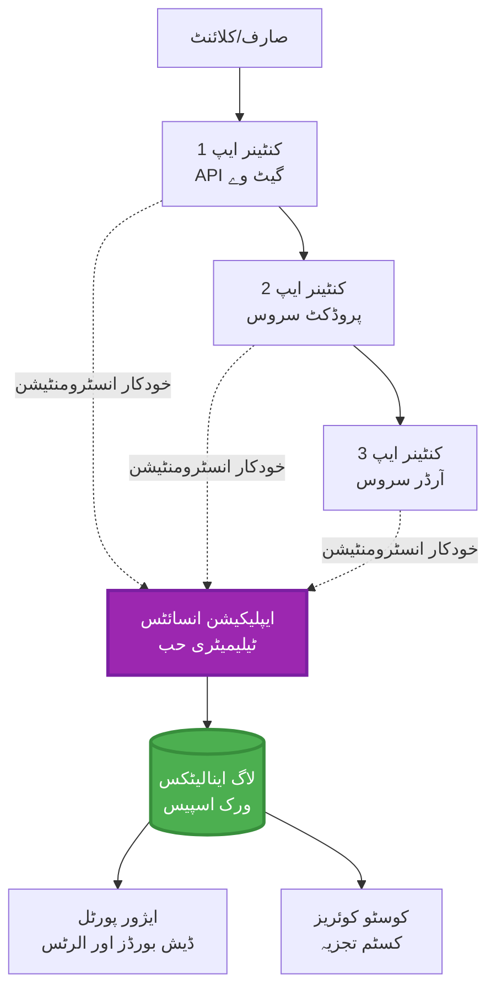
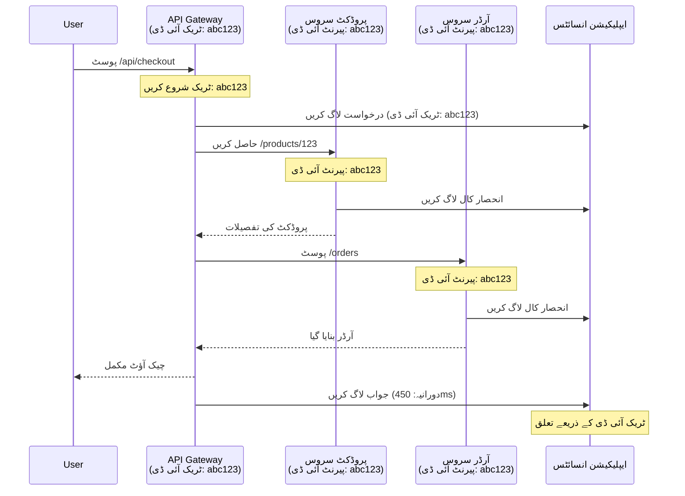

# ایپلیکیشن انسائٹس کا AZD کے ساتھ انضمام

⏱️ **تخمینی وقت**: 40-50 منٹ | 💰 **لاگت کا اثر**: ~$5-15/ماہ | ⭐ **پیچیدگی**: درمیانی

**📚 سیکھنے کا راستہ:**
- ← پچھلا: [پری فلائٹ چیکس](preflight-checks.md) - تعیناتی سے پہلے کی توثیق
- 🎯 **آپ یہاں ہیں**: ایپلیکیشن انسائٹس انضمام (مانیٹرنگ، ٹیلیمیٹری، ڈیبگنگ)
- → اگلا: [تعیناتی گائیڈ](../deployment/deployment-guide.md) - Azure پر تعیناتی
- 🏠 [کورس ہوم](../../README.md)

---

## آپ کیا سیکھیں گے

اس سبق کو مکمل کرنے کے بعد، آپ:
- **ایپلیکیشن انسائٹس** کو AZD پروجیکٹس میں خودکار طور پر شامل کریں گے
- **مائیکرو سروسز** کے لیے تقسیم شدہ ٹریسنگ کو ترتیب دیں گے
- **کسٹم ٹیلیمیٹری** (میٹرکس، ایونٹس، ڈیپینڈنسیز) نافذ کریں گے
- **لائیو میٹرکس** کو حقیقی وقت کی نگرانی کے لیے ترتیب دیں گے
- AZD تعیناتیوں سے **الرٹس اور ڈیش بورڈز** بنائیں گے
- **ٹیلیمیٹری کوئریز** کے ذریعے پروڈکشن مسائل کو ڈیبگ کریں گے
- **لاگت اور سیمپلنگ** حکمت عملیوں کو بہتر بنائیں گے
- **AI/LLM ایپلیکیشنز** (ٹوکنز، لیٹنسی، لاگت) کی نگرانی کریں گے

## AZD کے ساتھ ایپلیکیشن انسائٹس کیوں اہم ہے

### چیلنج: پروڈکشن کی نگرانی

**ایپلیکیشن انسائٹس کے بغیر:**
```
❌ No visibility into production behavior
❌ Manual log aggregation across services
❌ Reactive debugging (wait for customer complaints)
❌ No performance metrics
❌ Cannot trace requests across services
❌ Unknown failure rates and bottlenecks
```

**ایپلیکیشن انسائٹس + AZD کے ساتھ:**
```
✅ Automatic telemetry collection
✅ Centralized logs from all services
✅ Proactive issue detection
✅ End-to-end request tracing
✅ Performance metrics and insights
✅ Real-time dashboards
✅ AZD provisions everything automatically
```

**تشبیہ**: ایپلیکیشن انسائٹس آپ کی ایپلیکیشن کے لیے "بلیک باکس" فلائٹ ریکارڈر + کاک پٹ ڈیش بورڈ کی طرح ہے۔ آپ حقیقی وقت میں سب کچھ دیکھ سکتے ہیں اور کسی بھی واقعے کو دوبارہ چلا سکتے ہیں۔

---

## آرکیٹیکچر کا جائزہ

### AZD آرکیٹیکچر میں ایپلیکیشن انسائٹس


### خودکار طور پر کیا مانیٹر ہوتا ہے

| ٹیلیمیٹری کی قسم | یہ کیا پکڑتا ہے | استعمال کا کیس |
|------------------|------------------|----------------|
| **ریکویسٹز** | HTTP ریکویسٹز، اسٹیٹس کوڈز، دورانیہ | API کی کارکردگی کی نگرانی |
| **ڈیپینڈنسیز** | بیرونی کالز (DB، APIs، اسٹوریج) | رکاوٹوں کی شناخت |
| **ایکسپشنز** | غیر ہینڈل شدہ غلطیاں اسٹیک ٹریسز کے ساتھ | ناکامیوں کو ڈیبگ کرنا |
| **کسٹم ایونٹس** | کاروباری ایونٹس (سائن اپ، خریداری) | تجزیات اور فنلز |
| **میٹرکس** | کارکردگی کے کاؤنٹرز، کسٹم میٹرکس | صلاحیت کی منصوبہ بندی |
| **ٹریسز** | لاگ پیغامات شدت کے ساتھ | ڈیبگنگ اور آڈٹنگ |
| **دستیابی** | اپ ٹائم اور رسپانس ٹائم ٹیسٹس | SLA کی نگرانی |

---

## ضروریات

### مطلوبہ ٹولز

```bash
# Azure Developer CLI کی تصدیق کریں
azd version
# ✅ متوقع: azd ورژن 1.0.0 یا اس سے زیادہ

# Azure CLI کی تصدیق کریں
az --version
# ✅ متوقع: azure-cli 2.50.0 یا اس سے زیادہ
```

### Azure کی ضروریات

- فعال Azure سبسکرپشن
- تخلیق کرنے کی اجازت:
  - ایپلیکیشن انسائٹس وسائل
  - لاگ اینالیٹکس ورک اسپیسز
  - کنٹینر ایپس
  - ریسورس گروپس

### علم کی ضروریات

آپ کو مکمل کرنا چاہیے:
- [AZD بنیادی باتیں](../getting-started/azd-basics.md) - AZD کے بنیادی تصورات
- [کنفیگریشن](../getting-started/configuration.md) - ماحول کی ترتیب
- [پہلا پروجیکٹ](../getting-started/first-project.md) - بنیادی تعیناتی

---

## سبق 1: AZD کے ساتھ خودکار ایپلیکیشن انسائٹس

### AZD ایپلیکیشن انسائٹس کو کیسے فراہم کرتا ہے

AZD آپ کی تعیناتی کے وقت خودکار طور پر ایپلیکیشن انسائٹس تخلیق اور ترتیب دیتا ہے۔ آئیے دیکھتے ہیں یہ کیسے کام کرتا ہے۔

### پروجیکٹ کا ڈھانچہ

```
monitored-app/
├── azure.yaml                     # AZD configuration
├── infra/
│   ├── main.bicep                # Main infrastructure
│   ├── core/
│   │   └── monitoring.bicep      # Application Insights + Log Analytics
│   └── app/
│       └── api.bicep             # Container App with monitoring
└── src/
    ├── app.py                    # Application with telemetry
    ├── requirements.txt
    └── Dockerfile
```

---

### مرحلہ 1: AZD کو ترتیب دیں (azure.yaml)

**فائل: `azure.yaml`**

```yaml
name: monitored-app
metadata:
  template: monitored-app@1.0.0

services:
  api:
    project: ./src
    language: python
    host: containerapp

# AZD automatically provisions monitoring!
```

**بس اتنا ہی!** AZD بنیادی نگرانی کے لیے ڈیفالٹ طور پر ایپلیکیشن انسائٹس تخلیق کرے گا۔ اضافی ترتیب کی ضرورت نہیں۔

---

### مرحلہ 2: مانیٹرنگ انفراسٹرکچر (Bicep)

**فائل: `infra/core/monitoring.bicep`**

```bicep
param logAnalyticsName string
param applicationInsightsName string
param location string = resourceGroup().location
param tags object = {}

// Log Analytics Workspace (required for Application Insights)
resource logAnalytics 'Microsoft.OperationalInsights/workspaces@2022-10-01' = {
  name: logAnalyticsName
  location: location
  tags: tags
  properties: {
    sku: {
      name: 'PerGB2018'  // Pay-as-you-go pricing
    }
    retentionInDays: 30  // Keep logs for 30 days
    features: {
      enableLogAccessUsingOnlyResourcePermissions: true
    }
  }
}

// Application Insights
resource applicationInsights 'Microsoft.Insights/components@2020-02-02' = {
  name: applicationInsightsName
  location: location
  tags: tags
  kind: 'web'
  properties: {
    Application_Type: 'web'
    WorkspaceResourceId: logAnalytics.id
    IngestionMode: 'LogAnalytics'
    publicNetworkAccessForIngestion: 'Enabled'
    publicNetworkAccessForQuery: 'Enabled'
  }
}

// Outputs for Container Apps
output logAnalyticsWorkspaceId string = logAnalytics.id
output logAnalyticsWorkspaceName string = logAnalytics.name
output applicationInsightsConnectionString string = applicationInsights.properties.ConnectionString
output applicationInsightsInstrumentationKey string = applicationInsights.properties.InstrumentationKey
output applicationInsightsName string = applicationInsights.name
```

---

### مرحلہ 3: کنٹینر ایپ کو ایپلیکیشن انسائٹس سے جوڑیں

**فائل: `infra/app/api.bicep`**

```bicep
param name string
param location string
param tags object = {}
param containerAppsEnvironmentName string
param applicationInsightsConnectionString string

resource containerApp 'Microsoft.App/containerApps@2023-05-01' = {
  name: name
  location: location
  tags: tags
  properties: {
    configuration: {
      ingress: {
        external: true
        targetPort: 8000
      }
      secrets: [
        {
          name: 'appinsights-connection-string'
          value: applicationInsightsConnectionString
        }
      ]
    }
    template: {
      containers: [
        {
          name: 'api'
          image: 'myregistry.azurecr.io/api:latest'
          resources: {
            cpu: json('0.5')
            memory: '1Gi'
          }
          env: [
            {
              name: 'APPLICATIONINSIGHTS_CONNECTION_STRING'
              secretRef: 'appinsights-connection-string'
            }
            {
              name: 'APPLICATIONINSIGHTS_ENABLED'
              value: 'true'
            }
          ]
        }
      ]
    }
  }
}

output uri string = 'https://${containerApp.properties.configuration.ingress.fqdn}'
```

---

### مرحلہ 4: ٹیلیمیٹری کے ساتھ ایپلیکیشن کوڈ

**فائل: `src/app.py`**

```python
from flask import Flask, request, jsonify
from opencensus.ext.azure.log_exporter import AzureLogHandler
from opencensus.ext.azure.trace_exporter import AzureExporter
from opencensus.ext.flask.flask_middleware import FlaskMiddleware
from opencensus.trace.samplers import ProbabilitySampler
import logging
import os

app = Flask(__name__)

# ایپلیکیشن انسائٹس کنکشن سٹرنگ حاصل کریں
connection_string = os.environ.get('APPLICATIONINSIGHTS_CONNECTION_STRING')

if connection_string:
    # تقسیم شدہ ٹریسنگ ترتیب دیں
    middleware = FlaskMiddleware(
        app,
        exporter=AzureExporter(connection_string=connection_string),
        sampler=ProbabilitySampler(rate=1.0)  # ڈویلپمنٹ کے لئے 100% سیمپلنگ
    )
    
    # لاگنگ ترتیب دیں
    logger = logging.getLogger(__name__)
    logger.addHandler(AzureLogHandler(connection_string=connection_string))
    logger.setLevel(logging.INFO)
    
    print("✅ Application Insights enabled")
else:
    logger = logging.getLogger(__name__)
    logger.setLevel(logging.INFO)
    print("⚠️ Application Insights not configured")

@app.route('/health')
def health():
    logger.info('Health check endpoint called')
    return jsonify({'status': 'healthy', 'monitoring': 'enabled'})

@app.route('/api/products')
def get_products():
    logger.info('Fetching products')
    
    # ڈیٹا بیس کال کی نقل کریں (خودکار طور پر انحصار کے طور پر ٹریک کیا گیا)
    products = [
        {'id': 1, 'name': 'Laptop', 'price': 999.99},
        {'id': 2, 'name': 'Mouse', 'price': 29.99},
        {'id': 3, 'name': 'Keyboard', 'price': 79.99}
    ]
    
    logger.info(f'Returned {len(products)} products')
    return jsonify(products)

@app.route('/api/error-test')
def error_test():
    """Test error tracking"""
    logger.error('Testing error tracking')
    try:
        raise ValueError('This is a test exception')
    except Exception as e:
        logger.exception('Exception occurred in error-test endpoint')
        return jsonify({'error': str(e)}), 500

@app.route('/api/slow')
def slow_endpoint():
    """Test performance tracking"""
    import time
    logger.info('Slow endpoint called')
    time.sleep(3)  # سست آپریشن کی نقل کریں
    logger.warning('Endpoint took 3 seconds to respond')
    return jsonify({'message': 'Slow operation completed'})

if __name__ == '__main__':
    app.run(host='0.0.0.0', port=8000)
```

**فائل: `src/requirements.txt`**

```txt
Flask==3.0.0
opencensus-ext-azure==1.1.13
opencensus-ext-flask==0.8.1
gunicorn==21.2.0
```

---

### مرحلہ 5: تعیناتی اور تصدیق کریں

```bash
# AZD کو شروع کریں
azd init

# تعین کریں (خودکار طور پر ایپلیکیشن انسائٹس فراہم کرتا ہے)
azd up

# ایپ کا URL حاصل کریں
APP_URL=$(azd env get-values | grep API_URL | cut -d '=' -f2 | tr -d '"')

# ٹیلیمیٹری تیار کریں
curl $APP_URL/health
curl $APP_URL/api/products
curl $APP_URL/api/error-test
curl $APP_URL/api/slow
```

**✅ متوقع نتیجہ:**
```json
{
  "status": "healthy",
  "monitoring": "enabled"
}
```

---

### مرحلہ 6: Azure پورٹل میں ٹیلیمیٹری دیکھیں

```bash
# ایپلیکیشن انسائٹس کی تفصیلات حاصل کریں
azd env get-values | grep APPLICATIONINSIGHTS

# ایزور پورٹل میں کھولیں
az monitor app-insights component show \
  --app $(azd env get-values | grep APPLICATIONINSIGHTS_NAME | cut -d '=' -f2 | tr -d '"') \
  --resource-group $(azd env get-values | grep AZURE_RESOURCE_GROUP | cut -d '=' -f2 | tr -d '"') \
  --query "appId" -o tsv
```

**Azure پورٹل → ایپلیکیشن انسائٹس → ٹرانزیکشن سرچ پر جائیں**

آپ کو دیکھنا چاہیے:
- ✅ HTTP ریکویسٹز اسٹیٹس کوڈز کے ساتھ
- ✅ ریکویسٹ کا دورانیہ (`/api/slow` کے لیے 3+ سیکنڈ)
- ✅ `/api/error-test` سے ایکسپشن کی تفصیلات
- ✅ کسٹم لاگ پیغامات

---

## سبق 2: کسٹم ٹیلیمیٹری اور ایونٹس

### کاروباری ایونٹس کو ٹریک کریں

آئیے کاروباری اہمیت کے حامل ایونٹس کے لیے کسٹم ٹیلیمیٹری شامل کریں۔

**فائل: `src/telemetry.py`**

```python
from opencensus.ext.azure import metrics_exporter
from opencensus.stats import aggregation as aggregation_module
from opencensus.stats import measure as measure_module
from opencensus.stats import stats as stats_module
from opencensus.stats import view as view_module
from opencensus.tags import tag_map as tag_map_module
from opencensus.ext.azure.log_exporter import AzureLogHandler
from opencensus.ext.azure.trace_exporter import AzureExporter
from opencensus.trace import tracer as tracer_module
import logging
import os

class TelemetryClient:
    """Custom telemetry client for Application Insights"""
    
    def __init__(self, connection_string=None):
        self.connection_string = connection_string or os.environ.get('APPLICATIONINSIGHTS_CONNECTION_STRING')
        
        if not self.connection_string:
            print("⚠️ Application Insights connection string not found")
            return
        
        # لاگر ترتیب دیں
        self.logger = logging.getLogger(__name__)
        self.logger.addHandler(AzureLogHandler(connection_string=self.connection_string))
        self.logger.setLevel(logging.INFO)
        
        # میٹرکس ایکسپورٹر ترتیب دیں
        self.stats = stats_module.stats
        self.view_manager = self.stats.view_manager
        self.stats_recorder = self.stats.stats_recorder
        
        exporter = metrics_exporter.new_metrics_exporter(
            connection_string=self.connection_string
        )
        self.view_manager.register_exporter(exporter)
        
        # ٹریسر ترتیب دیں
        self.tracer = tracer_module.Tracer(
            exporter=AzureExporter(connection_string=self.connection_string)
        )
        
        print("✅ Custom telemetry client initialized")
    
    def track_event(self, event_name: str, properties: dict = None):
        """Track custom business event"""
        properties = properties or {}
        self.logger.info(
            f"CustomEvent: {event_name}",
            extra={
                'custom_dimensions': {
                    'event_name': event_name,
                    **properties
                }
            }
        )
    
    def track_metric(self, metric_name: str, value: float, properties: dict = None):
        """Track custom metric"""
        properties = properties or {}
        self.logger.info(
            f"CustomMetric: {metric_name} = {value}",
            extra={
                'custom_dimensions': {
                    'metric_name': metric_name,
                    'value': value,
                    **properties
                }
            }
        )
    
    def track_dependency(self, name: str, dependency_type: str, duration: float, success: bool):
        """Track external dependency call"""
        with self.tracer.span(name=name) as span:
            span.add_attribute('dependency.type', dependency_type)
            span.add_attribute('duration', duration)
            span.add_attribute('success', success)

# عالمی ٹیلیمیٹری کلائنٹ
telemetry = TelemetryClient()
```

### کسٹم ایونٹس کے ساتھ ایپلیکیشن کو اپ ڈیٹ کریں

**فائل: `src/app.py` (بہتر شدہ)**

```python
from flask import Flask, request, jsonify
from telemetry import telemetry
import time
import random

app = Flask(__name__)

@app.route('/api/purchase', methods=['POST'])
def purchase():
    """Track purchase event with custom telemetry"""
    data = request.json
    product_id = data.get('product_id')
    quantity = data.get('quantity', 1)
    price = data.get('price', 0)
    
    # کاروباری واقعہ کا پتہ لگائیں
    telemetry.track_event('Purchase', {
        'product_id': product_id,
        'quantity': quantity,
        'total_amount': price * quantity,
        'user_id': request.headers.get('X-User-Id', 'anonymous')
    })
    
    # آمدنی میٹرک کا پتہ لگائیں
    telemetry.track_metric('Revenue', price * quantity, {
        'product_id': product_id,
        'currency': 'USD'
    })
    
    return jsonify({
        'order_id': f'ORD-{random.randint(1000, 9999)}',
        'status': 'confirmed',
        'total': price * quantity
    })

@app.route('/api/search')
def search():
    """Track search queries"""
    query = request.args.get('q', '')
    
    start_time = time.time()
    
    # تلاش کی نقل کریں (یہ حقیقی ڈیٹا بیس کی درخواست ہوگی)
    results = [{'id': 1, 'name': f'Result for {query}'}]
    
    duration = (time.time() - start_time) * 1000  # ملی سیکنڈ میں تبدیل کریں
    
    # تلاش کے واقعہ کا پتہ لگائیں
    telemetry.track_event('Search', {
        'query': query,
        'results_count': len(results),
        'duration_ms': duration
    })
    
    # تلاش کی کارکردگی میٹرک کا پتہ لگائیں
    telemetry.track_metric('SearchDuration', duration, {
        'query_length': len(query)
    })
    
    return jsonify({'results': results, 'count': len(results)})

@app.route('/api/external-call')
def external_call():
    """Track external API dependency"""
    import requests
    
    start_time = time.time()
    success = True
    
    try:
        # بیرونی API کال کی نقل کریں
        response = requests.get('https://api.example.com/data', timeout=5)
        result = response.json()
    except Exception as e:
        success = False
        result = {'error': str(e)}
    
    duration = (time.time() - start_time) * 1000
    
    # انحصار کا پتہ لگائیں
    telemetry.track_dependency(
        name='ExternalAPI',
        dependency_type='HTTP',
        duration=duration,
        success=success
    )
    
    return jsonify(result)

if __name__ == '__main__':
    app.run(host='0.0.0.0', port=8000)
```

### کسٹم ٹیلیمیٹری کی جانچ کریں

```bash
# خریداری کے واقعہ کو ٹریک کریں
curl -X POST $APP_URL/api/purchase \
  -H "Content-Type: application/json" \
  -H "X-User-Id: user123" \
  -d '{"product_id": 1, "quantity": 2, "price": 29.99}'

# تلاش کے واقعہ کو ٹریک کریں
curl "$APP_URL/api/search?q=laptop"

# بیرونی انحصار کو ٹریک کریں
curl $APP_URL/api/external-call
```

**Azure پورٹل میں دیکھیں:**

ایپلیکیشن انسائٹس → لاگز پر جائیں، پھر چلائیں:

```kusto
// View purchase events
traces
| where customDimensions.event_name == "Purchase"
| project 
    timestamp,
    product_id = tostring(customDimensions.product_id),
    total_amount = todouble(customDimensions.total_amount),
    user_id = tostring(customDimensions.user_id)
| order by timestamp desc

// View revenue metrics
traces
| where customDimensions.metric_name == "Revenue"
| summarize TotalRevenue = sum(todouble(customDimensions.value)) by bin(timestamp, 1h)
| render timechart

// View search performance
traces
| where customDimensions.event_name == "Search"
| summarize 
    AvgDuration = avg(todouble(customDimensions.duration_ms)),
    SearchCount = count()
  by bin(timestamp, 5m)
| render timechart
```

---

## سبق 3: مائیکرو سروسز کے لیے تقسیم شدہ ٹریسنگ

### کراس سروس ٹریسنگ کو فعال کریں

مائیکرو سروسز کے لیے، ایپلیکیشن انسائٹس خودکار طور پر سروسز کے درمیان ریکویسٹز کو مربوط کرتا ہے۔

**فائل: `infra/main.bicep`**

```bicep
targetScope = 'subscription'

param environmentName string
param location string = 'eastus'

var tags = { 'azd-env-name': environmentName }

resource rg 'Microsoft.Resources/resourceGroups@2021-04-01' = {
  name: 'rg-${environmentName}'
  location: location
  tags: tags
}

// Monitoring (shared by all services)
module monitoring './core/monitoring.bicep' = {
  name: 'monitoring'
  scope: rg
  params: {
    logAnalyticsName: 'log-${environmentName}'
    applicationInsightsName: 'appi-${environmentName}'
    location: location
    tags: tags
  }
}

// API Gateway
module apiGateway './app/api-gateway.bicep' = {
  name: 'api-gateway'
  scope: rg
  params: {
    name: 'ca-gateway-${environmentName}'
    location: location
    tags: union(tags, { 'azd-service-name': 'gateway' })
    applicationInsightsConnectionString: monitoring.outputs.applicationInsightsConnectionString
  }
}

// Product Service
module productService './app/product-service.bicep' = {
  name: 'product-service'
  scope: rg
  params: {
    name: 'ca-products-${environmentName}'
    location: location
    tags: union(tags, { 'azd-service-name': 'products' })
    applicationInsightsConnectionString: monitoring.outputs.applicationInsightsConnectionString
  }
}

// Order Service
module orderService './app/order-service.bicep' = {
  name: 'order-service'
  scope: rg
  params: {
    name: 'ca-orders-${environmentName}'
    location: location
    tags: union(tags, { 'azd-service-name': 'orders' })
    applicationInsightsConnectionString: monitoring.outputs.applicationInsightsConnectionString
  }
}

output APPLICATIONINSIGHTS_CONNECTION_STRING string = monitoring.outputs.applicationInsightsConnectionString
output GATEWAY_URL string = apiGateway.outputs.uri
```

### اینڈ ٹو اینڈ ٹرانزیکشن دیکھیں


**اینڈ ٹو اینڈ ٹریس کوئری کریں:**

```kusto
// Find complete request flow
let traceId = "abc123...";  // Get from response header
dependencies
| union requests
| where operation_Id == traceId
| project 
    timestamp,
    type = itemType,
    name,
    duration,
    success,
    cloud_RoleName
| order by timestamp asc
```

---

## سبق 4: لائیو میٹرکس اور حقیقی وقت کی نگرانی

### لائیو میٹرکس اسٹریم کو فعال کریں

لائیو میٹرکس <1 سیکنڈ کی لیٹنسی کے ساتھ حقیقی وقت کی ٹیلیمیٹری فراہم کرتا ہے۔

**لائیو میٹرکس تک رسائی:**

```bash
# ایپلیکیشن انسائٹس وسائل حاصل کریں
APPI_NAME=$(azd env get-values | grep APPLICATIONINSIGHTS_NAME | cut -d '=' -f2 | tr -d '"')

# وسائل گروپ حاصل کریں
RG_NAME=$(azd env get-values | grep AZURE_RESOURCE_GROUP | cut -d '=' -f2 | tr -d '"')

echo "Navigate to: Azure Portal → Resource Groups → $RG_NAME → $APPI_NAME → Live Metrics"
```

**آپ حقیقی وقت میں کیا دیکھتے ہیں:**
- ✅ آنے والی ریکویسٹ کی شرح (ریکویسٹز/سیکنڈ)
- ✅ جانے والی ڈیپینڈنسی کالز
- ✅ ایکسپشن کی تعداد
- ✅ CPU اور میموری کا استعمال
- ✅ فعال سرور کی تعداد
- ✅ سیمپل ٹیلیمیٹری

### جانچ کے لیے لوڈ پیدا کریں

```bash
# لائیو میٹرکس دیکھنے کے لیے لوڈ پیدا کریں
for i in {1..100}; do
  curl $APP_URL/api/products &
  curl $APP_URL/api/search?q=test$i &
done

# Azure پورٹل میں لائیو میٹرکس دیکھیں
# آپ کو درخواست کی شرح میں اضافہ نظر آنا چاہیے
```

---

## عملی مشقیں

### مشق 1: الرٹس ترتیب دیں ⭐⭐ (درمیانی)

**مقصد**: زیادہ غلطی کی شرح اور سست ردعمل کے لیے الرٹس بنائیں۔

**اقدامات:**

1. **غلطی کی شرح کے لیے الرٹ بنائیں:**

```bash
# ایپلیکیشن انسائٹس ریسورس آئی ڈی حاصل کریں
APPI_ID=$(az monitor app-insights component show \
  --app $APPI_NAME \
  --resource-group $RG_NAME \
  --query "id" -o tsv)

# ناکام درخواستوں کے لئے میٹرک الرٹ بنائیں
az monitor metrics alert create \
  --name "High-Error-Rate" \
  --resource-group $RG_NAME \
  --scopes $APPI_ID \
  --condition "count requests/failed > 10" \
  --window-size 5m \
  --evaluation-frequency 1m \
  --description "Alert when error rate exceeds 10 per 5 minutes"
```

2. **سست ردعمل کے لیے الرٹ بنائیں:**

```bash
az monitor metrics alert create \
  --name "Slow-Responses" \
  --resource-group $RG_NAME \
  --scopes $APPI_ID \
  --condition "avg requests/duration > 3000" \
  --window-size 5m \
  --evaluation-frequency 1m \
  --description "Alert when average response time exceeds 3 seconds"
```

3. **Bicep کے ذریعے الرٹ بنائیں (AZD کے لیے ترجیحی):**

**فائل: `infra/core/alerts.bicep`**

```bicep
param applicationInsightsId string
param actionGroupId string = ''
param location string = resourceGroup().location

// High error rate alert
resource errorRateAlert 'Microsoft.Insights/metricAlerts@2018-03-01' = {
  name: 'high-error-rate'
  location: 'global'
  properties: {
    description: 'Alert when error rate exceeds threshold'
    severity: 2
    enabled: true
    scopes: [
      applicationInsightsId
    ]
    evaluationFrequency: 'PT1M'
    windowSize: 'PT5M'
    criteria: {
      'odata.type': 'Microsoft.Azure.Monitor.SingleResourceMultipleMetricCriteria'
      allOf: [
        {
          name: 'Error rate'
          metricName: 'requests/failed'
          operator: 'GreaterThan'
          threshold: 10
          timeAggregation: 'Count'
        }
      ]
    }
    actions: actionGroupId != '' ? [
      {
        actionGroupId: actionGroupId
      }
    ] : []
  }
}

// Slow response alert
resource slowResponseAlert 'Microsoft.Insights/metricAlerts@2018-03-01' = {
  name: 'slow-responses'
  location: 'global'
  properties: {
    description: 'Alert when response time is too high'
    severity: 3
    enabled: true
    scopes: [
      applicationInsightsId
    ]
    evaluationFrequency: 'PT1M'
    windowSize: 'PT5M'
    criteria: {
      'odata.type': 'Microsoft.Azure.Monitor.SingleResourceMultipleMetricCriteria'
      allOf: [
        {
          name: 'Response duration'
          metricName: 'requests/duration'
          operator: 'GreaterThan'
          threshold: 3000
          timeAggregation: 'Average'
        }
      ]
    }
  }
}

output errorAlertId string = errorRateAlert.id
output slowResponseAlertId string = slowResponseAlert.id
```

4. **الرٹس کی جانچ کریں:**

```bash
# غلطیاں پیدا کریں
for i in {1..20}; do
  curl $APP_URL/api/error-test
done

# سست ردعمل پیدا کریں
for i in {1..10}; do
  curl $APP_URL/api/slow
done

# الرٹ کی حالت چیک کریں (5-10 منٹ انتظار کریں)
az monitor metrics alert list \
  --resource-group $RG_NAME \
  --query "[].{Name:name, Enabled:enabled, State:properties.enabled}" \
  --output table
```

**✅ کامیابی کے معیار:**
- ✅ الرٹس کامیابی سے بنائے گئے
- ✅ جب حد سے تجاوز ہو تو الرٹس فائر کریں
- ✅ Azure پورٹل میں الرٹ کی تاریخ دیکھ سکتے ہیں
- ✅ AZD تعیناتی کے ساتھ مربوط

**وقت**: 20-25 منٹ

---

### مشق 2: کسٹم ڈیش بورڈ بنائیں ⭐⭐ (درمیانی)

**مقصد**: کلیدی ایپلیکیشن میٹرکس دکھانے والا ڈیش بورڈ بنائیں۔

**اقدامات:**

1. **Azure پورٹل کے ذریعے ڈیش بورڈ بنائیں:**

Azure پورٹل → ڈیش بورڈز → نیا ڈیش بورڈ پر جائیں

2. **کلیدی میٹرکس کے لیے ٹائلز شامل کریں:**

- ریکویسٹ کی تعداد (پچھلے 24 گھنٹے)
- اوسط ردعمل کا وقت
- غلطی کی شرح
- سب سے سست 5 آپریشنز
- صارفین کی جغرافیائی تقسیم

3. **Bicep کے ذریعے ڈیش بورڈ بنائیں:**

**فائل: `infra/core/dashboard.bicep`**

```bicep
param dashboardName string
param applicationInsightsId string
param location string = resourceGroup().location

resource dashboard 'Microsoft.Portal/dashboards@2020-09-01-preview' = {
  name: dashboardName
  location: location
  properties: {
    lenses: [
      {
        order: 0
        parts: [
          // Request count
          {
            position: { x: 0, y: 0, rowSpan: 4, colSpan: 6 }
            metadata: {
              type: 'Extension/Microsoft_OperationsManagementSuite_Workspace/PartType/LogsDashboardPart'
              inputs: [
                {
                  name: 'resourceId'
                  value: applicationInsightsId
                }
                {
                  name: 'query'
                  value: '''
                    requests
                    | summarize RequestCount = count() by bin(timestamp, 1h)
                    | render timechart
                  '''
                }
              ]
            }
          }
          // Error rate
          {
            position: { x: 6, y: 0, rowSpan: 4, colSpan: 6 }
            metadata: {
              type: 'Extension/Microsoft_OperationsManagementSuite_Workspace/PartType/LogsDashboardPart'
              inputs: [
                {
                  name: 'resourceId'
                  value: applicationInsightsId
                }
                {
                  name: 'query'
                  value: '''
                    requests
                    | summarize 
                        Total = count(),
                        Failed = countif(success == false)
                    | extend ErrorRate = (Failed * 100.0) / Total
                    | project ErrorRate
                  '''
                }
              ]
            }
          }
        ]
      }
    ]
  }
}

output dashboardId string = dashboard.id
```

4. **ڈیش بورڈ تعینات کریں:**

```bash
# مرکزی.bicep میں شامل کریں
module dashboard './core/dashboard.bicep' = {
  name: 'dashboard'
  scope: rg
  params: {
    dashboardName: 'dashboard-${environmentName}'
    applicationInsightsId: monitoring.outputs.applicationInsightsId
    location: location
  }
}

# تعین کریں
azd up
```

**✅ کامیابی کے معیار:**
- ✅ ڈیش بورڈ کلیدی میٹرکس دکھاتا ہے
- ✅ Azure پورٹل ہوم پر پن کر سکتے ہیں
- ✅ حقیقی وقت میں اپ ڈیٹ ہوتا ہے
- ✅ AZD کے ذریعے تعیناتی کے قابل

**وقت**: 25-30 منٹ

---

### مشق 3: AI/LLM ایپلیکیشن کی نگرانی کریں ⭐⭐⭐ (اعلی درجے کی)

**مقصد**: Azure OpenAI کے استعمال (ٹوکنز، لاگت، لیٹنسی) کو ٹریک کریں۔

**اقدامات:**

1. **AI مانیٹرنگ ریپر بنائیں:**

**فائل: `src/ai_telemetry.py`**

```python
from telemetry import telemetry
from openai import AzureOpenAI
import time

class MonitoredAzureOpenAI:
    """Azure OpenAI client with automatic telemetry"""
    
    def __init__(self, api_key, endpoint, api_version="2024-02-01"):
        self.client = AzureOpenAI(
            api_key=api_key,
            api_version=api_version,
            azure_endpoint=endpoint
        )
    
    def chat_completion(self, model: str, messages: list, **kwargs):
        """Track chat completion with telemetry"""
        start_time = time.time()
        
        try:
            # ایزور اوپن اے آئی کو کال کریں
            response = self.client.chat.completions.create(
                model=model,
                messages=messages,
                **kwargs
            )
            
            duration = (time.time() - start_time) * 1000  # ایم ایس
            
            # استعمال نکالیں
            usage = response.usage
            prompt_tokens = usage.prompt_tokens
            completion_tokens = usage.completion_tokens
            total_tokens = usage.total_tokens
            
            # قیمت کا حساب لگائیں (جی پی ٹی-4 قیمت)
            prompt_cost = (prompt_tokens / 1000) * 0.03  # $0.03 فی 1K ٹوکنز
            completion_cost = (completion_tokens / 1000) * 0.06  # $0.06 فی 1K ٹوکنز
            total_cost = prompt_cost + completion_cost
            
            # کسٹم ایونٹ کو ٹریک کریں
            telemetry.track_event('OpenAI_Request', {
                'model': model,
                'prompt_tokens': prompt_tokens,
                'completion_tokens': completion_tokens,
                'total_tokens': total_tokens,
                'duration_ms': duration,
                'cost_usd': total_cost,
                'success': True
            })
            
            # میٹرکس کو ٹریک کریں
            telemetry.track_metric('OpenAI_Tokens', total_tokens, {
                'model': model,
                'type': 'total'
            })
            
            telemetry.track_metric('OpenAI_Cost', total_cost, {
                'model': model,
                'currency': 'USD'
            })
            
            telemetry.track_metric('OpenAI_Duration', duration, {
                'model': model
            })
            
            return response
            
        except Exception as e:
            duration = (time.time() - start_time) * 1000
            
            telemetry.track_event('OpenAI_Request', {
                'model': model,
                'duration_ms': duration,
                'success': False,
                'error': str(e)
            })
            
            raise
```

2. **مانیٹرڈ کلائنٹ استعمال کریں:**

```python
from flask import Flask, request, jsonify
from ai_telemetry import MonitoredAzureOpenAI
import os

app = Flask(__name__)

# مانیٹر شدہ اوپن اے آئی کلائنٹ کو شروع کریں
openai_client = MonitoredAzureOpenAI(
    api_key=os.environ['AZURE_OPENAI_API_KEY'],
    endpoint=os.environ['AZURE_OPENAI_ENDPOINT']
)

@app.route('/api/chat', methods=['POST'])
def chat():
    data = request.json
    user_message = data.get('message')
    
    # خودکار نگرانی کے ساتھ کال کریں
    response = openai_client.chat_completion(
        model='gpt-4',
        messages=[
            {'role': 'user', 'content': user_message}
        ]
    )
    
    return jsonify({
        'response': response.choices[0].message.content,
        'tokens': response.usage.total_tokens
    })
```

3. **AI میٹرکس کوئری کریں:**

```kusto
// Total AI spend over time
traces
| where customDimensions.event_name == "OpenAI_Request"
| where customDimensions.success == "True"
| summarize TotalCost = sum(todouble(customDimensions.cost_usd)) by bin(timestamp, 1h)
| render timechart

// Token usage by model
traces
| where customDimensions.event_name == "OpenAI_Request"
| summarize 
    TotalTokens = sum(toint(customDimensions.total_tokens)),
    RequestCount = count()
  by Model = tostring(customDimensions.model)

// Average latency
traces
| where customDimensions.event_name == "OpenAI_Request"
| summarize AvgDuration = avg(todouble(customDimensions.duration_ms))
| project AvgDurationSeconds = AvgDuration / 1000

// Cost per request
traces
| where customDimensions.event_name == "OpenAI_Request"
| extend Cost = todouble(customDimensions.cost_usd)
| summarize 
    TotalCost = sum(Cost),
    RequestCount = count(),
    AvgCostPerRequest = avg(Cost)
```

**✅ کامیابی کے معیار:**
- ✅ ہر OpenAI کال خودکار طور پر ٹریک کی گئی
- ✅ ٹوکن کا استعمال اور لاگت نظر آتی ہے
- ✅ لیٹنسی کی نگرانی کی گئی
- ✅ بجٹ الرٹس ترتیب دے سکتے ہیں

**وقت**: 35-45 منٹ

---

## لاگت کی اصلاح

### سیمپلنگ حکمت عملی

ٹیلیمیٹری کو سیمپلنگ کے ذریعے لاگت کو کنٹرول کریں:

```python
from opencensus.trace.samplers import ProbabilitySampler

# ترقی: 100% نمونہ کاری
sampler = ProbabilitySampler(rate=1.0)

# پیداوار: 10% نمونہ کاری (اخراجات کو 90% کم کریں)
sampler = ProbabilitySampler(rate=0.1)

# موافقت پذیر نمونہ کاری (خود بخود ایڈجسٹ ہوتی ہے)
from opencensus.trace.samplers import AdaptiveSampler
sampler = AdaptiveSampler()
```

**Bicep میں:**

```bicep
resource applicationInsights 'Microsoft.Insights/components@2020-02-02' = {
  name: applicationInsightsName
  properties: {
    SamplingPercentage: 10  // 10% sampling
  }
}
```

### ڈیٹا برقرار رکھنے

```bicep
resource logAnalytics 'Microsoft.OperationalInsights/workspaces@2022-10-01' = {
  name: logAnalyticsName
  properties: {
    retentionInDays: 30  // Minimum (cheapest)
    // Options: 30, 31, 60, 90, 120, 180, 270, 365, 550, 730
  }
}
```

### ماہانہ لاگت کے تخمینے

| ڈیٹا کا حجم | برقرار رکھنے کی مدت | ماہانہ لاگت |
|------------|---------------------|-------------|
| 1 GB/ماہ | 30 دن | ~$2-5 |
| 5 GB/ماہ | 30 دن | ~$10-15 |
| 10 GB/ماہ | 90 دن | ~$25-40 |
| 50 GB/ماہ | 90 دن | ~$100-150 |

**مفت ٹائر**: 5 GB/ماہ شامل

---

## علم کا چیک پوائنٹ

### 1. بنیادی انضمام ✓

اپنی سمجھ کی جانچ کریں:

- [ ] **Q1**: AZD ایپلیکیشن انسائٹس کو کیسے فراہم کرتا ہے؟
  - **A**: خودکار طور پر `infra/core/monitoring.bicep` میں Bicep ٹیمپلیٹس کے ذریعے

- [ ] **Q2**: کون سا ماحول متغیر ایپلیکیشن انسائٹس کو فعال کرتا ہے؟
  - **A**: `APPLICATIONINSIGHTS_CONNECTION_STRING`

- [ ] **Q3**: تین اہم ٹیلیمیٹری کی اقسام کیا ہیں؟
  - **A**: ریکویسٹز (HTTP کالز)، ڈیپینڈنسیز (بیرونی کالز)، ایکسپشنز (غلطیاں)

**ہینڈز آن تصدیق:**
```bash
# چیک کریں کہ آیا ایپلیکیشن انسائٹس تشکیل دیا گیا ہے
azd env get-values | grep APPLICATIONINSIGHTS

# تصدیق کریں کہ ٹیلیمیٹری بہہ رہی ہے
az monitor app-insights metrics show \
  --app $APPI_NAME \
  --resource-group $RG_NAME \
  --metric "requests/count"
```

---

### 2. کسٹم ٹیلیمیٹری ✓

اپنی سمجھ کی جانچ کریں:

- [ ] **Q1**: آپ کسٹم کاروباری ایونٹس کو کیسے ٹریک کرتے ہیں؟
  - **A**: `custom_dimensions` کے ساتھ لاگر یا `TelemetryClient.track_event()` استعمال کریں

- [ ] **Q2**: ایونٹس اور میٹرکس میں کیا فرق ہے؟
  - **A**: ایونٹس الگ الگ واقعات ہیں، میٹرکس عددی پیمائشیں ہیں

- [ ] **Q3**: آپ سروسز کے درمیان ٹیلیمیٹری کو کیسے مربوط کرتے ہیں؟
  - **A**: ایپلیکیشن انسائٹس خودکار طور پر `operation_Id` استعمال کرتا ہے

**ہینڈز آن تصدیق:**
```kusto
// Verify custom events
traces
| where customDimensions.event_name != ""
| summarize count() by tostring(customDimensions.event_name)
```

---

### 3. پروڈکشن مانیٹرنگ ✓

اپنی سمجھ کی جانچ کریں:

- [ ] **Q1**: سیمپلنگ کیا ہے اور اسے کیوں استعمال کریں؟
  - **A**: سیمپلنگ ٹیلیمیٹری کا صرف ایک فیصد پکڑ کر ڈیٹا کے حجم (اور لاگت) کو کم کرتی ہے

- [ ] **Q2**: آپ الرٹس کیسے ترتیب دیتے ہیں؟
  - **A**: ایپلیکیشن انسائٹس میٹرکس کی بنیاد پر Bicep یا Azure پورٹل میں میٹرک الرٹس استعمال کریں

- [ ] **Q3**: لاگ اینالیٹکس اور ایپلیکیشن انسائٹس میں کیا فرق ہے؟
  - **A**: ایپلیکیشن انسائٹس ڈیٹا کو لاگ اینالیٹکس ورک اسپیس میں اسٹور کرتا ہے؛ ایپ انسائٹس ایپلیکیشن مخصوص نظارے فراہم کرتا ہے

**ہینڈز آن تصدیق:**
```bash
# نمونہ بندی کی تشکیل چیک کریں
az monitor app-insights component show \
  --app $APPI_NAME \
  --resource-group $RG_NAME \
  --query "properties.SamplingPercentage"
```

---

## بہترین طریقے

### ✅ کریں:

1. **کورلیشن IDs استعمال کریں**
   ```python
   logger.info('Processing order', extra={
       'custom_dimensions': {
           'order_id': order_id,
           'user_id': user_id
       }
   })
   ```

2. **اہم میٹرکس کے لیے الرٹس ترتیب دیں**
   ```bicep
   // Error rate, slow responses, availability
   ```

3. **ساختی لاگنگ استعمال کریں**
   ```python
   # ✅ اچھا: منظم
   logger.info('User signup', extra={'custom_dimensions': {'user_id': 123}})
   
   # ❌ برا: غیر منظم
   logger.info(f'User 123 signed up')
   ```

4. **ڈیپینڈنسیز کی نگرانی کریں**
   ```python
   # خودکار طور پر ڈیٹا بیس کالز، HTTP درخواستیں وغیرہ کو ٹریک کریں۔
   ```

5. **تعیناتیوں کے دوران لائیو میٹرکس استعمال کریں**

### ❌ نہ کریں:

1. **حساس ڈیٹا لاگ نہ کریں**
   ```python
   # ❌ خراب
   logger.info(f'Login: {username}:{password}')
   
   # ✅ اچھا
   logger.info('Login attempt', extra={'custom_dimensions': {'username': username}})
   ```

2. **پروڈکشن میں 100% سیمپلنگ استعمال نہ کریں**
   ```python
   # ❌ مہنگا
   sampler = ProbabilitySampler(rate=1.0)
   
   # ✅ لاگت مؤثر
   sampler = ProbabilitySampler(rate=0.1)
   ```

3. **ڈیڈ لیٹر کیو کو نظر انداز نہ کریں**

4. **ڈیٹا برقرار رکھنے کی حدود مقرر کرنا نہ بھولیں**

---

## خرابیوں کا پتہ لگانا

### مسئلہ: کوئی ٹیلیمیٹری ظاہر نہیں ہو رہی

**تشخیص:**
```bash
# چیک کریں کہ کنکشن سٹرنگ سیٹ ہے
azd env get-values | grep APPLICATIONINSIGHTS

# ایپلیکیشن لاگز چیک کریں
azd logs api --tail 50
```

**حل:**
```bash
# کنٹینر ایپ میں کنکشن سٹرنگ کی تصدیق کریں
az containerapp show \
  --name $APP_NAME \
  --resource-group $RG_NAME \
  --query "properties.template.containers[0].env" \
  | grep -i applicationinsights
```

---

### مسئلہ: زیادہ لاگت

**تشخیص:**
```bash
# ڈیٹا انضمام چیک کریں
az monitor app-insights metrics show \
  --app $APPI_NAME \
  --resource-group $RG_NAME \
  --metric "availabilityResults/count"
```

**حل:**
- سیمپلنگ کی شرح کم کریں
- برقرار رکھنے کی مدت کم کریں
- تفصیلی لاگنگ کو ہٹا دیں

---

## مزید سیکھیں

### سرکاری دستاویزات
- [ایپلیکیشن انسائٹس کا جائزہ](https://learn.microsoft.com/azure/azure-monitor/app/app-insights-overview)
- [Python کے لیے ایپلیکیشن انسائٹس](https://learn.microsoft.com/azure/azure-monitor/app/opencensus-python)
- [Kusto کوئری زبان](https://learn.microsoft.com/azure/data-explorer/kusto/query/)
- [AZD مانیٹرنگ](https://learn.microsoft.com/azure/developer/azure-developer-cli/monitor-your-app)

### اس کورس میں اگلے مراحل
- ← پچھلا: [پری فلائٹ چیکس](preflight-checks.md)
- → اگلا: [تعیناتی گائیڈ](../deployment/deployment-guide.md)
- 🏠 [کورس ہوم](../../README.md)

### متعلقہ مثالیں
- [Azure OpenAI مثال](../../../../examples/azure-openai-chat) - AI ٹیلیمیٹری
- [مائیکرو سروسز مثال](../../../../examples/microservices) - تقسیم شدہ ٹریسنگ

---

## خلاصہ

**آپ نے سیکھا:**
- ✅ AZD کے ساتھ خودکار ایپلیکیشن انسائٹس کی فراہمی
- ✅ کسٹم ٹیلیمیٹری (ایونٹس، میٹرکس، ڈیپینڈنسیز)
- ✅ مائیکرو سروسز کے درمیان تقسیم شدہ ٹریسنگ
- ✅ لائیو میٹرکس اور حقیقی وقت کی نگرانی
- ✅ الرٹس اور ڈیش بورڈز
- ✅ اے آئی/ایل ایل ایم ایپلیکیشن مانیٹرنگ  
- ✅ لاگت کو بہتر بنانے کی حکمت عملی  

**اہم نکات:**  
1. **AZD خودکار طور پر مانیٹرنگ فراہم کرتا ہے** - کوئی دستی سیٹ اپ کی ضرورت نہیں  
2. **منظم لاگنگ استعمال کریں** - سوالات کرنا آسان بناتا ہے  
3. **کاروباری ایونٹس کو ٹریک کریں** - صرف تکنیکی میٹرکس نہیں  
4. **اے آئی کی لاگت کو مانیٹر کریں** - ٹوکنز اور خرچ کو ٹریک کریں  
5. **الرٹس سیٹ کریں** - ردعمل کے بجائے پیشگی اقدامات کریں  
6. **لاگت کو بہتر بنائیں** - سیمپلنگ اور ریٹینشن حدود استعمال کریں  

**اگلے اقدامات:**  
1. عملی مشقیں مکمل کریں  
2. اپنے AZD پروجیکٹس میں ایپلیکیشن انسائٹس شامل کریں  
3. اپنی ٹیم کے لیے کسٹم ڈیش بورڈز بنائیں  
4. [ڈیپلائمنٹ گائیڈ](../deployment/deployment-guide.md) سیکھیں  

---

<!-- CO-OP TRANSLATOR DISCLAIMER START -->
**اعلانِ لاتعلقی**:  
یہ دستاویز AI ترجمہ سروس [Co-op Translator](https://github.com/Azure/co-op-translator) کا استعمال کرتے ہوئے ترجمہ کی گئی ہے۔ ہم درستگی کے لیے کوشش کرتے ہیں، لیکن براہ کرم آگاہ رہیں کہ خودکار ترجمے میں غلطیاں یا غیر درستیاں ہو سکتی ہیں۔ اصل دستاویز کو اس کی اصل زبان میں مستند ذریعہ سمجھا جانا چاہیے۔ اہم معلومات کے لیے، پیشہ ور انسانی ترجمہ کی سفارش کی جاتی ہے۔ ہم اس ترجمے کے استعمال سے پیدا ہونے والی کسی بھی غلط فہمی یا غلط تشریح کے ذمہ دار نہیں ہیں۔
<!-- CO-OP TRANSLATOR DISCLAIMER END -->