# ملٹی ایجنٹ کوآرڈینیشن پیٹرنز

⏱️ **متوقع وقت**: 60-75 منٹ | 💰 **متوقع لاگت**: ~$100-300/ماہ | ⭐ **پیچیدگی**: اعلیٰ

**📚 لرننگ پاتھ:**
- ← پچھلا: [صلاحیت کی منصوبہ بندی](capacity-planning.md) - وسائل کی سائزنگ اور اسکیلنگ کی حکمت عملی
- 🎯 **آپ یہاں ہیں**: ملٹی ایجنٹ کوآرڈینیشن پیٹرنز (آرکیسٹریشن، کمیونیکیشن، اسٹیٹ مینجمنٹ)
- → اگلا: [SKU کا انتخاب](sku-selection.md) - صحیح Azure سروسز کا انتخاب
- 🏠 [کورس ہوم](../../README.md)

---

## آپ کیا سیکھیں گے

اس سبق کو مکمل کرنے کے بعد، آپ:
- **ملٹی ایجنٹ آرکیٹیکچر** پیٹرنز کو سمجھیں گے اور ان کا استعمال کب کرنا ہے
- **آرکیسٹریشن پیٹرنز** (مرکزی، غیر مرکزی، درجہ بندی) کو نافذ کریں گے
- **ایجنٹ کمیونیکیشن** حکمت عملی ڈیزائن کریں گے (ہم وقت ساز، غیر ہم وقت ساز، ایونٹ ڈرائیون)
- تقسیم شدہ ایجنٹس کے درمیان **مشترکہ اسٹیٹ** کا انتظام کریں گے
- Azure پر **ملٹی ایجنٹ سسٹمز** کو تعینات کریں گے
- حقیقی دنیا کے AI منظرناموں کے لیے **کوآرڈینیشن پیٹرنز** کا اطلاق کریں گے
- تقسیم شدہ ایجنٹ سسٹمز کی نگرانی اور ڈیبگ کریں گے

## ملٹی ایجنٹ کوآرڈینیشن کیوں اہم ہے

### ارتقاء: سنگل ایجنٹ سے ملٹی ایجنٹ تک

**سنگل ایجنٹ (سادہ):**
```
User → Agent → Response
```
- ✅ سمجھنے اور نافذ کرنے میں آسان
- ✅ سادہ کاموں کے لیے تیز
- ❌ ایک ماڈل کی صلاحیتوں تک محدود
- ❌ پیچیدہ کاموں کو متوازی طور پر انجام نہیں دے سکتا
- ❌ کوئی تخصص نہیں

**ملٹی ایجنٹ سسٹم (اعلیٰ):**
```
           ┌─────────────┐
           │ Orchestrator│
           └──────┬──────┘
        ┌─────────┼─────────┐
        │         │         │
    ┌───▼──┐  ┌──▼───┐  ┌──▼────┐
    │Agent1│  │Agent2│  │Agent3 │
    │(Plan)│  │(Code)│  │(Review)│
    └──────┘  └──────┘  └───────┘
```
- ✅ مخصوص کاموں کے لیے ماہر ایجنٹس
- ✅ رفتار کے لیے متوازی عمل
- ✅ ماڈیولر اور قابل دیکھ بھال
- ✅ پیچیدہ ورک فلو میں بہتر
- ⚠️ کوآرڈینیشن لاجک کی ضرورت

**تشبیہ**: سنگل ایجنٹ ایک شخص کی طرح ہے جو تمام کام کرتا ہے۔ ملٹی ایجنٹ ایک ٹیم کی طرح ہے جہاں ہر رکن کے پاس مخصوص مہارتیں ہیں (ریسرچر، کوڈر، ریویور، رائٹر) اور وہ مل کر کام کرتے ہیں۔

---

## بنیادی کوآرڈینیشن پیٹرنز

### پیٹرن 1: ترتیب وار کوآرڈینیشن (چین آف ریسپانسبلیٹی)

**استعمال کب کریں**: کاموں کو مخصوص ترتیب میں مکمل کرنا ضروری ہے، ہر ایجنٹ پچھلے آؤٹ پٹ پر کام کرتا ہے۔

```mermaid
sequenceDiagram
    participant User
    participant Orchestrator
    participant Agent1 as تحقیق کرنے والا ایجنٹ
    participant Agent2 as لکھنے والا ایجنٹ
    participant Agent3 as ایڈیٹر ایجنٹ
    
    User->>Orchestrator: "اے آئی کے بارے میں مضمون لکھیں"
    Orchestrator->>Agent1: موضوع پر تحقیق کریں
    Agent1-->>Orchestrator: تحقیق کے نتائج
    Orchestrator->>Agent2: مسودہ لکھیں (تحقیق کا استعمال کرتے ہوئے)
    Agent2-->>Orchestrator: مضمون کا مسودہ
    Orchestrator->>Agent3: ترمیم کریں اور بہتر بنائیں
    Agent3-->>Orchestrator: حتمی مضمون
    Orchestrator-->>User: پالش شدہ مضمون
    
    Note over User,Agent3: ترتیب وار: ہر مرحلہ پچھلے کا انتظار کرتا ہے
```


**فوائد:**
- ✅ واضح ڈیٹا فلو
- ✅ ڈیبگ کرنے میں آسان
- ✅ متوقع عمل کی ترتیب

**حدود:**
- ❌ سست (کوئی متوازی عمل نہیں)
- ❌ ایک ناکامی پوری چین کو بلاک کر دیتی ہے
- ❌ باہمی انحصار والے کاموں کو ہینڈل نہیں کر سکتا

**مثال کے استعمال:**
- مواد تخلیق کا عمل (ریسرچ → لکھنا → ایڈیٹ → شائع کرنا)
- کوڈ جنریشن (پلان → نافذ → ٹیسٹ → تعینات)
- رپورٹ جنریشن (ڈیٹا کلیکشن → تجزیہ → ویژولائزیشن → خلاصہ)

---

### پیٹرن 2: متوازی کوآرڈینیشن (فین آؤٹ/فین ان)

**استعمال کب کریں**: آزاد کام بیک وقت چل سکتے ہیں، نتائج آخر میں یکجا کیے جاتے ہیں۔

```mermaid
graph TB
    User[صارف کی درخواست]
    Orchestrator[آرکسٹریٹر]
    Agent1[تجزیہ ایجنٹ]
    Agent2[تحقیق ایجنٹ]
    Agent3[ڈیٹا ایجنٹ]
    Aggregator[نتائج جمع کرنے والا]
    Response[مشترکہ جواب]
    
    User --> Orchestrator
    Orchestrator --> Agent1
    Orchestrator --> Agent2
    Orchestrator --> Agent3
    Agent1 --> Aggregator
    Agent2 --> Aggregator
    Agent3 --> Aggregator
    Aggregator --> Response
    
    style Orchestrator fill:#2196F3,stroke:#1976D2,stroke-width:3px,color:#fff
    style Aggregator fill:#4CAF50,stroke:#388E3C,stroke-width:3px,color:#fff
```


**فوائد:**
- ✅ تیز (متوازی عمل)
- ✅ فالٹ ٹولیرنٹ (جزوی نتائج قابل قبول)
- ✅ افقی طور پر اسکیل ہوتا ہے

**حدود:**
- ⚠️ نتائج ترتیب سے باہر آ سکتے ہیں
- ⚠️ ایگریگیشن لاجک کی ضرورت
- ⚠️ پیچیدہ اسٹیٹ مینجمنٹ

**مثال کے استعمال:**
- ملٹی سورس ڈیٹا کلیکشن (APIs + ڈیٹا بیس + ویب اسکریپنگ)
- مسابقتی تجزیہ (متعدد ماڈلز حل پیدا کرتے ہیں، بہترین منتخب کیا جاتا ہے)
- ترجمہ خدمات (ایک ساتھ متعدد زبانوں میں ترجمہ)

---

### پیٹرن 3: درجہ بندی کوآرڈینیشن (منیجر-ورکر)

**استعمال کب کریں**: پیچیدہ ورک فلو کے ساتھ سب ٹاسکس، تفویض کی ضرورت ہے۔

```mermaid
graph TB
    Master[ماسٹر آرکسٹریٹر]
    Manager1[ریسرچ مینیجر]
    Manager2[مواد مینیجر]
    W1[ویب سکریپر]
    W2[پیپر تجزیہ کار]
    W3[مصنف]
    W4[ایڈیٹر]
    
    Master --> Manager1
    Master --> Manager2
    Manager1 --> W1
    Manager1 --> W2
    Manager2 --> W3
    Manager2 --> W4
    
    style Master fill:#FF9800,stroke:#F57C00,stroke-width:3px,color:#fff
    style Manager1 fill:#2196F3,stroke:#1976D2,stroke-width:2px,color:#fff
    style Manager2 fill:#2196F3,stroke:#1976D2,stroke-width:2px,color:#fff
```


**فوائد:**
- ✅ پیچیدہ ورک فلو کو ہینڈل کرتا ہے
- ✅ ماڈیولر اور قابل دیکھ بھال
- ✅ واضح ذمہ داری کی حدود

**حدود:**
- ⚠️ زیادہ پیچیدہ آرکیٹیکچر
- ⚠️ زیادہ تاخیر (متعدد کوآرڈینیشن لیئرز)
- ⚠️ نفیس آرکیسٹریشن کی ضرورت

**مثال کے استعمال:**
- انٹرپرائز ڈاکیومنٹ پروسیسنگ (کلاسیفائی → روٹ → پروسیس → آرکائیو)
- ملٹی اسٹیج ڈیٹا پائپ لائنز (انجیسٹ → کلین → ٹرانسفارم → تجزیہ → رپورٹ)
- پیچیدہ آٹومیشن ورک فلو (پلاننگ → وسائل کی تقسیم → عمل → نگرانی)

---

### پیٹرن 4: ایونٹ ڈرائیون کوآرڈینیشن (پبلش-سبسکرائب)

**استعمال کب کریں**: ایجنٹس کو ایونٹس پر ردعمل دینا ہے، ڈھیلا جوڑ مطلوب ہے۔

```mermaid
sequenceDiagram
    participant Agent1 as ڈیٹا جمع کرنے والا
    participant EventBus as ایزور سروس بس
    participant Agent2 as تجزیہ کار
    participant Agent3 as اطلاع دینے والا
    participant Agent4 as محفوظ کرنے والا
    
    Agent1->>EventBus: شائع کریں "ڈیٹا موصول ہوا" واقعہ
    EventBus->>Agent2: سبسکرائب کریں: ڈیٹا کا تجزیہ کریں
    EventBus->>Agent3: سبسکرائب کریں: اطلاع بھیجیں
    EventBus->>Agent4: سبسکرائب کریں: ڈیٹا محفوظ کریں
    
    Note over Agent1,Agent4: تمام سبسکرائبرز آزادانہ طور پر عمل کرتے ہیں
    
    Agent2->>EventBus: شائع کریں "تجزیہ مکمل ہوا" واقعہ
    EventBus->>Agent3: سبسکرائب کریں: تجزیہ رپورٹ بھیجیں
```


**فوائد:**
- ✅ ایجنٹس کے درمیان ڈھیلا جوڑ
- ✅ نئے ایجنٹس شامل کرنا آسان (صرف سبسکرائب کریں)
- ✅ غیر ہم وقت ساز پروسیسنگ
- ✅ لچکدار (پیغام کی مستقل مزاجی)

**حدود:**
- ⚠️ ایونچوئل کنسسٹنسی
- ⚠️ پیچیدہ ڈیبگنگ
- ⚠️ پیغام کی ترتیب کے چیلنجز

**مثال کے استعمال:**
- ریئل ٹائم مانیٹرنگ سسٹمز (الرٹس، ڈیش بورڈز، لاگز)
- ملٹی چینل نوٹیفکیشنز (ای میل، SMS، پش، سلیک)
- ڈیٹا پروسیسنگ پائپ لائنز (ایک ہی ڈیٹا کے متعدد صارفین)

---

### پیٹرن 5: اتفاق رائے پر مبنی کوآرڈینیشن (ووٹنگ/کوارم)

**استعمال کب کریں**: آگے بڑھنے سے پہلے متعدد ایجنٹس سے اتفاق رائے کی ضرورت ہے۔

```mermaid
graph TB
    Input[کام کا ان پٹ]
    Agent1[ایجنٹ 1: GPT-4]
    Agent2[ایجنٹ 2: Claude]
    Agent3[ایجنٹ 3: Gemini]
    Voter[اتفاق رائے ووٹر]
    Output[متفقہ نتیجہ]
    
    Input --> Agent1
    Input --> Agent2
    Input --> Agent3
    Agent1 --> Voter
    Agent2 --> Voter
    Agent3 --> Voter
    Voter --> Output
    
    style Voter fill:#9C27B0,stroke:#7B1FA2,stroke-width:3px,color:#fff
```


**فوائد:**
- ✅ زیادہ درستگی (متعدد آراء)
- ✅ فالٹ ٹولیرنٹ (اقلیت کی ناکامی قابل قبول)
- ✅ کوالٹی اشورنس بلٹ ان

**حدود:**
- ❌ مہنگا (متعدد ماڈل کالز)
- ❌ سست (تمام ایجنٹس کا انتظار)
- ⚠️ تنازعہ حل کی ضرورت

**مثال کے استعمال:**
- مواد کی نگرانی (متعدد ماڈلز مواد کا جائزہ لیتے ہیں)
- کوڈ ریویو (متعدد لنٹرز/اینالائزرز)
- طبی تشخیص (متعدد AI ماڈلز، ماہر کی توثیق)

---

## آرکیٹیکچر کا جائزہ

### Azure پر مکمل ملٹی ایجنٹ سسٹم

```mermaid
graph TB
    User[صارف/اے پی آئی کلائنٹ]
    APIM[ایزور اے پی آئی مینجمنٹ]
    Orchestrator[آرکسٹریٹر سروس<br/>کنٹینر ایپ]
    ServiceBus[ایزور سروس بس<br/>ایونٹ حب]
    
    Agent1[ریسرچ ایجنٹ<br/>کنٹینر ایپ]
    Agent2[رائٹر ایجنٹ<br/>کنٹینر ایپ]
    Agent3[تجزیہ کار ایجنٹ<br/>کنٹینر ایپ]
    Agent4[جائزہ لینے والا ایجنٹ<br/>کنٹینر ایپ]
    
    CosmosDB[(کوسموس ڈی بی<br/>مشترکہ حالت)]
    Storage[ایزور اسٹوریج<br/>مصنوعات]
    AppInsights[ایپلیکیشن انسائٹس<br/>مانیٹرنگ]
    
    User --> APIM
    APIM --> Orchestrator
    
    Orchestrator --> ServiceBus
    ServiceBus --> Agent1
    ServiceBus --> Agent2
    ServiceBus --> Agent3
    ServiceBus --> Agent4
    
    Agent1 --> CosmosDB
    Agent2 --> CosmosDB
    Agent3 --> CosmosDB
    Agent4 --> CosmosDB
    
    Agent1 --> Storage
    Agent2 --> Storage
    Agent3 --> Storage
    Agent4 --> Storage
    
    Orchestrator -.-> AppInsights
    Agent1 -.-> AppInsights
    Agent2 -.-> AppInsights
    Agent3 -.-> AppInsights
    Agent4 -.-> AppInsights
    
    style Orchestrator fill:#FF9800,stroke:#F57C00,stroke-width:3px,color:#fff
    style ServiceBus fill:#9C27B0,stroke:#7B1FA2,stroke-width:3px,color:#fff
    style CosmosDB fill:#4CAF50,stroke:#388E3C,stroke-width:3px,color:#fff
```


**اہم اجزاء:**

| جزو | مقصد | Azure سروس |
|-----------|---------|---------------|
| **API گیٹ وے** | انٹری پوائنٹ، ریٹ لمیٹنگ، آتھ | API مینجمنٹ |
| **آرکیسٹریٹر** | ایجنٹ ورک فلو کوآرڈینیٹ کرتا ہے | کنٹینر ایپس |
| **میسج کیو** | غیر ہم وقت ساز کمیونیکیشن | سروس بس / ایونٹ ہبز |
| **ایجنٹس** | ماہر AI ورکرز | کنٹینر ایپس / فنکشنز |
| **اسٹیٹ اسٹور** | مشترکہ اسٹیٹ، ٹاسک ٹریکنگ | کاسموس DB |
| **آرٹفیکٹ اسٹوریج** | دستاویزات، نتائج، لاگز | بلاپ اسٹوریج |
| **مانیٹرنگ** | تقسیم شدہ ٹریسنگ، لاگز | ایپلیکیشن انسائٹس |

---

## ضروریات

### مطلوبہ ٹولز

```bash
# Azure Developer CLI کی تصدیق کریں
azd version
# ✅ متوقع: azd ورژن 1.0.0 یا اس سے زیادہ

# Azure CLI کی تصدیق کریں
az --version
# ✅ متوقع: azure-cli 2.50.0 یا اس سے زیادہ

# Docker کی تصدیق کریں (مقامی جانچ کے لیے)
docker --version
# ✅ متوقع: Docker ورژن 20.10 یا اس سے زیادہ
```

### Azure کی ضروریات

- ایکٹیو Azure سبسکرپشن
- درج ذیل بنانے کی اجازت:
  - کنٹینر ایپس
  - سروس بس نیم اسپیسز
  - کاسموس DB اکاؤنٹس
  - اسٹوریج اکاؤنٹس
  - ایپلیکیشن انسائٹس

### علم کی ضروریات

آپ کو مکمل کرنا چاہیے:
- [کنفیگریشن مینجمنٹ](../getting-started/configuration.md)
- [تصدیق اور سیکیورٹی](../getting-started/authsecurity.md)
- [مائیکروسروسز کی مثال](../../../../examples/microservices)

---

## عمل درآمد گائیڈ

### پروجیکٹ کا ڈھانچہ

```
multi-agent-system/
├── azure.yaml                    # AZD configuration
├── infra/
│   ├── main.bicep               # Main infrastructure
│   ├── core/
│   │   ├── servicebus.bicep     # Message queue
│   │   ├── cosmos.bicep         # State store
│   │   ├── storage.bicep        # Artifact storage
│   │   └── monitoring.bicep     # Application Insights
│   └── app/
│       ├── orchestrator.bicep   # Orchestrator service
│       └── agent.bicep          # Agent template
└── src/
    ├── orchestrator/            # Orchestration logic
    │   ├── app.py
    │   ├── workflows.py
    │   └── Dockerfile
    ├── agents/
    │   ├── research/            # Research agent
    │   ├── writer/              # Writer agent
    │   ├── analyst/             # Analyst agent
    │   └── reviewer/            # Reviewer agent
    └── shared/
        ├── state_manager.py     # Shared state logic
        └── message_handler.py   # Message handling
```

---

## سبق 1: ترتیب وار کوآرڈینیشن پیٹرن

### عمل درآمد: مواد تخلیق کا عمل

آئیے ایک ترتیب وار پائپ لائن بنائیں: ریسرچ → لکھنا → ایڈیٹ → شائع کرنا

### 1. AZD کنفیگریشن

**فائل: `azure.yaml`**

```yaml
name: content-pipeline
metadata:
  template: multi-agent-sequential@1.0.0

services:
  orchestrator:
    project: ./src/orchestrator
    language: python
    host: containerapp
  
  research-agent:
    project: ./src/agents/research
    language: python
    host: containerapp
  
  writer-agent:
    project: ./src/agents/writer
    language: python
    host: containerapp
  
  editor-agent:
    project: ./src/agents/editor
    language: python
    host: containerapp
```

### 2. انفراسٹرکچر: کوآرڈینیشن کے لیے سروس بس

**فائل: `infra/core/servicebus.bicep`**

```bicep
param name string
param location string
param tags object = {}

resource serviceBusNamespace 'Microsoft.ServiceBus/namespaces@2022-10-01-preview' = {
  name: name
  location: location
  tags: tags
  sku: {
    name: 'Standard'
    tier: 'Standard'
  }
  properties: {
    minimumTlsVersion: '1.2'
  }
}

// Queue for orchestrator → research agent
resource researchQueue 'Microsoft.ServiceBus/namespaces/queues@2022-10-01-preview' = {
  parent: serviceBusNamespace
  name: 'research-tasks'
  properties: {
    maxDeliveryCount: 3
    lockDuration: 'PT5M'
    deadLetteringOnMessageExpiration: true
  }
}

// Queue for research agent → writer agent
resource writerQueue 'Microsoft.ServiceBus/namespaces/queues@2022-10-01-preview' = {
  parent: serviceBusNamespace
  name: 'writer-tasks'
  properties: {
    maxDeliveryCount: 3
    lockDuration: 'PT5M'
  }
}

// Queue for writer agent → editor agent
resource editorQueue 'Microsoft.ServiceBus/namespaces/queues@2022-10-01-preview' = {
  parent: serviceBusNamespace
  name: 'editor-tasks'
  properties: {
    maxDeliveryCount: 3
    lockDuration: 'PT5M'
  }
}

output namespace string = serviceBusNamespace.name
output connectionString string = listKeys('${serviceBusNamespace.id}/AuthorizationRules/RootManageSharedAccessKey', serviceBusNamespace.apiVersion).primaryConnectionString
```

### 3. مشترکہ اسٹیٹ مینیجر

**فائل: `src/shared/state_manager.py`**

```python
from azure.cosmos import CosmosClient, PartitionKey
from datetime import datetime
import os

class StateManager:
    """Manages shared state across agents using Cosmos DB"""
    
    def __init__(self):
        endpoint = os.environ['COSMOS_ENDPOINT']
        key = os.environ['COSMOS_KEY']
        
        self.client = CosmosClient(endpoint, key)
        self.database = self.client.get_database_client('agent-state')
        self.container = self.database.get_container_client('tasks')
    
    def create_task(self, task_id: str, task_type: str, input_data: dict):
        """Create a new task"""
        task = {
            'id': task_id,
            'type': task_type,
            'status': 'pending',
            'input': input_data,
            'created_at': datetime.utcnow().isoformat(),
            'steps': []
        }
        self.container.create_item(task)
        return task
    
    def update_task_step(self, task_id: str, step_name: str, result: dict):
        """Update task with completed step"""
        task = self.container.read_item(task_id, partition_key=task_id)
        
        task['steps'].append({
            'name': step_name,
            'completed_at': datetime.utcnow().isoformat(),
            'result': result
        })
        
        self.container.replace_item(task_id, task)
        return task
    
    def complete_task(self, task_id: str, final_result: dict):
        """Mark task as complete"""
        task = self.container.read_item(task_id, partition_key=task_id)
        task['status'] = 'completed'
        task['result'] = final_result
        task['completed_at'] = datetime.utcnow().isoformat()
        self.container.replace_item(task_id, task)
        return task
    
    def get_task(self, task_id: str):
        """Retrieve task state"""
        return self.container.read_item(task_id, partition_key=task_id)
```

### 4. آرکیسٹریٹر سروس

**فائل: `src/orchestrator/app.py`**

```python
from flask import Flask, request, jsonify
from azure.servicebus import ServiceBusClient, ServiceBusMessage
import json
import uuid
import os
from shared.state_manager import StateManager

app = Flask(__name__)
state_manager = StateManager()

# سروس بس کنکشن
servicebus_connection_str = os.environ['SERVICEBUS_CONNECTION_STRING']
servicebus_client = ServiceBusClient.from_connection_string(servicebus_connection_str)

@app.route('/health', methods=['GET'])
def health():
    return jsonify({'status': 'healthy', 'service': 'orchestrator'})

@app.route('/create-content', methods=['POST'])
def create_content():
    """
    Sequential workflow: Research → Write → Edit → Publish
    """
    data = request.json
    topic = data.get('topic')
    
    if not topic:
        return jsonify({'error': 'Topic required'}), 400
    
    # ریاست اسٹور میں کام بنائیں
    task_id = str(uuid.uuid4())
    task = state_manager.create_task(
        task_id=task_id,
        task_type='content_creation',
        input_data={'topic': topic}
    )
    
    # تحقیق ایجنٹ کو پیغام بھیجیں (پہلا قدم)
    sender = servicebus_client.get_queue_sender('research-tasks')
    message = ServiceBusMessage(
        body=json.dumps({
            'task_id': task_id,
            'topic': topic,
            'next_queue': 'writer-tasks'  # نتائج کہاں بھیجنے ہیں
        }),
        content_type='application/json'
    )
    
    with sender:
        sender.send_messages(message)
    
    return jsonify({
        'task_id': task_id,
        'status': 'started',
        'workflow': 'sequential',
        'steps': ['research', 'write', 'edit', 'publish'],
        'message': 'Content creation pipeline initiated'
    }), 202

@app.route('/task/<task_id>', methods=['GET'])
def get_task_status(task_id):
    """Check task status"""
    try:
        task = state_manager.get_task(task_id)
        return jsonify(task)
    except Exception as e:
        return jsonify({'error': str(e)}), 404

if __name__ == '__main__':
    app.run(host='0.0.0.0', port=8080)
```

### 5. ریسرچ ایجنٹ

**فائل: `src/agents/research/app.py`**

```python
from azure.servicebus import ServiceBusClient, ServiceBusMessage
from openai import AzureOpenAI
import json
import os
import time
from shared.state_manager import StateManager

# کلائنٹس کو شروع کریں
state_manager = StateManager()
servicebus_client = ServiceBusClient.from_connection_string(
    os.environ['SERVICEBUS_CONNECTION_STRING']
)

openai_client = AzureOpenAI(
    api_key=os.environ['AZURE_OPENAI_API_KEY'],
    api_version="2024-02-01",
    azure_endpoint=os.environ['AZURE_OPENAI_ENDPOINT']
)

def process_research_task(message_data):
    """Process research request and pass to writer"""
    task_id = message_data['task_id']
    topic = message_data['topic']
    next_queue = message_data['next_queue']
    
    print(f"🔬 Researching: {topic}")
    
    # تحقیق کے لیے Azure OpenAI کو کال کریں
    response = openai_client.chat.completions.create(
        model="gpt-4",
        messages=[
            {"role": "system", "content": "You are a research assistant. Provide comprehensive research on the given topic."},
            {"role": "user", "content": f"Research this topic thoroughly: {topic}"}
        ],
        max_tokens=1500
    )
    
    research_results = response.choices[0].message.content
    
    # حالت کو اپ ڈیٹ کریں
    state_manager.update_task_step(
        task_id=task_id,
        step_name='research',
        result={'research': research_results}
    )
    
    # اگلے ایجنٹ (مصنف) کو بھیجیں
    sender = servicebus_client.get_queue_sender(next_queue)
    message = ServiceBusMessage(
        body=json.dumps({
            'task_id': task_id,
            'topic': topic,
            'research': research_results,
            'next_queue': 'editor-tasks'
        }),
        content_type='application/json'
    )
    
    with sender:
        sender.send_messages(message)
    
    print(f"✅ Research complete for task {task_id}")

def main():
    """Listen to research queue"""
    receiver = servicebus_client.get_queue_receiver('research-tasks')
    
    print("🔬 Research Agent started, listening for tasks...")
    
    with receiver:
        while True:
            messages = receiver.receive_messages(max_wait_time=5)
            for message in messages:
                try:
                    message_data = json.loads(str(message))
                    process_research_task(message_data)
                    receiver.complete_message(message)
                except Exception as e:
                    print(f"❌ Error processing message: {e}")
                    receiver.abandon_message(message)

if __name__ == '__main__':
    main()
```

### 6. رائٹر ایجنٹ

**فائل: `src/agents/writer/app.py`**

```python
from azure.servicebus import ServiceBusClient, ServiceBusMessage
from openai import AzureOpenAI
import json
import os
from shared.state_manager import StateManager

state_manager = StateManager()
servicebus_client = ServiceBusClient.from_connection_string(
    os.environ['SERVICEBUS_CONNECTION_STRING']
)

openai_client = AzureOpenAI(
    api_key=os.environ['AZURE_OPENAI_API_KEY'],
    api_version="2024-02-01",
    azure_endpoint=os.environ['AZURE_OPENAI_ENDPOINT']
)

def process_writing_task(message_data):
    """Write article based on research"""
    task_id = message_data['task_id']
    topic = message_data['topic']
    research = message_data['research']
    next_queue = message_data['next_queue']
    
    print(f"✍️ Writing article: {topic}")
    
    # ایزور اوپن اے آئی کو مضمون لکھنے کے لیے کال کریں
    response = openai_client.chat.completions.create(
        model="gpt-4",
        messages=[
            {"role": "system", "content": "You are a professional writer. Write engaging, well-structured articles."},
            {"role": "user", "content": f"Based on this research:\n\n{research}\n\nWrite a comprehensive article about: {topic}"}
        ],
        max_tokens=2000
    )
    
    article_draft = response.choices[0].message.content
    
    # حالت کو اپ ڈیٹ کریں
    state_manager.update_task_step(
        task_id=task_id,
        step_name='writing',
        result={'draft': article_draft}
    )
    
    # ایڈیٹر کو بھیجیں
    sender = servicebus_client.get_queue_sender(next_queue)
    message = ServiceBusMessage(
        body=json.dumps({
            'task_id': task_id,
            'topic': topic,
            'draft': article_draft
        }),
        content_type='application/json'
    )
    
    with sender:
        sender.send_messages(message)
    
    print(f"✅ Article draft complete for task {task_id}")

def main():
    """Listen to writer queue"""
    receiver = servicebus_client.get_queue_receiver('writer-tasks')
    
    print("✍️ Writer Agent started, listening for tasks...")
    
    with receiver:
        while True:
            messages = receiver.receive_messages(max_wait_time=5)
            for message in messages:
                try:
                    message_data = json.loads(str(message))
                    process_writing_task(message_data)
                    receiver.complete_message(message)
                except Exception as e:
                    print(f"❌ Error: {e}")
                    receiver.abandon_message(message)

if __name__ == '__main__':
    main()
```

### 7. ایڈیٹر ایجنٹ

**فائل: `src/agents/editor/app.py`**

```python
from azure.servicebus import ServiceBusClient
from openai import AzureOpenAI
import json
import os
from shared.state_manager import StateManager

state_manager = StateManager()
servicebus_client = ServiceBusClient.from_connection_string(
    os.environ['SERVICEBUS_CONNECTION_STRING']
)

openai_client = AzureOpenAI(
    api_key=os.environ['AZURE_OPENAI_API_KEY'],
    api_version="2024-02-01",
    azure_endpoint=os.environ['AZURE_OPENAI_ENDPOINT']
)

def process_editing_task(message_data):
    """Edit and finalize article"""
    task_id = message_data['task_id']
    topic = message_data['topic']
    draft = message_data['draft']
    
    print(f"📝 Editing article: {topic}")
    
    # ایزور اوپن اے آئی کو ایڈٹ کرنے کے لیے کال کریں
    response = openai_client.chat.completions.create(
        model="gpt-4",
        messages=[
            {"role": "system", "content": "You are an expert editor. Improve grammar, clarity, and structure."},
            {"role": "user", "content": f"Edit and improve this article:\n\n{draft}"}
        ],
        max_tokens=2000
    )
    
    final_article = response.choices[0].message.content
    
    # کام کو مکمل کے طور پر نشان زد کریں
    state_manager.complete_task(
        task_id=task_id,
        final_result={
            'topic': topic,
            'final_article': final_article,
            'word_count': len(final_article.split())
        }
    )
    
    print(f"✅ Article finalized for task {task_id}")

def main():
    """Listen to editor queue"""
    receiver = servicebus_client.get_queue_receiver('editor-tasks')
    
    print("📝 Editor Agent started, listening for tasks...")
    
    with receiver:
        while True:
            messages = receiver.receive_messages(max_wait_time=5)
            for message in messages:
                try:
                    message_data = json.loads(str(message))
                    process_editing_task(message_data)
                    receiver.complete_message(message)
                except Exception as e:
                    print(f"❌ Error: {e}")
                    receiver.abandon_message(message)

if __name__ == '__main__':
    main()
```

### 8. تعینات کریں اور ٹیسٹ کریں

```bash
# شروع کریں اور تعینات کریں
azd init
azd up

# آرکسٹریٹر یو آر ایل حاصل کریں
ORCHESTRATOR_URL=$(azd env get-values | grep ORCHESTRATOR_URL | cut -d '=' -f2 | tr -d '"')

# مواد تخلیق کریں
curl -X POST $ORCHESTRATOR_URL/create-content \
  -H "Content-Type: application/json" \
  -d '{"topic": "The Future of AI in Healthcare"}'
```

**✅ متوقع آؤٹ پٹ:**
```json
{
  "task_id": "a1b2c3d4-e5f6-7890-abcd-ef1234567890",
  "status": "started",
  "workflow": "sequential",
  "steps": ["research", "write", "edit", "publish"],
  "message": "Content creation pipeline initiated"
}
```

**ٹاسک کی پیش رفت چیک کریں:**
```bash
TASK_ID="a1b2c3d4-e5f6-7890-abcd-ef1234567890"
curl $ORCHESTRATOR_URL/task/$TASK_ID
```

**✅ متوقع آؤٹ پٹ (مکمل):**
```json
{
  "id": "a1b2c3d4-e5f6-7890-abcd-ef1234567890",
  "type": "content_creation",
  "status": "completed",
  "steps": [
    {
      "name": "research",
      "completed_at": "2025-11-19T10:30:00Z",
      "result": {"research": "..."}
    },
    {
      "name": "writing",
      "completed_at": "2025-11-19T10:32:00Z",
      "result": {"draft": "..."}
    }
  ],
  "result": {
    "topic": "The Future of AI in Healthcare",
    "final_article": "...",
    "word_count": 1500
  }
}
```

---

## سبق 2: متوازی کوآرڈینیشن پیٹرن

### عمل درآمد: ملٹی سورس ریسرچ ایگریگیٹر

آئیے ایک متوازی سسٹم بنائیں جو بیک وقت متعدد ذرائع سے معلومات اکٹھا کرے۔

### متوازی آرکیسٹریٹر

**فائل: `src/orchestrator/parallel_workflow.py`**

```python
from flask import Flask, request, jsonify
from azure.servicebus import ServiceBusClient, ServiceBusMessage
import json
import uuid
import os
from shared.state_manager import StateManager

app = Flask(__name__)
state_manager = StateManager()

servicebus_client = ServiceBusClient.from_connection_string(
    os.environ['SERVICEBUS_CONNECTION_STRING']
)

@app.route('/research-parallel', methods=['POST'])
def research_parallel():
    """
    Parallel workflow: Multiple agents work simultaneously
    """
    data = request.json
    query = data.get('query')
    
    task_id = str(uuid.uuid4())
    task = state_manager.create_task(
        task_id=task_id,
        task_type='parallel_research',
        input_data={
            'query': query,
            'agents': ['web', 'academic', 'news', 'social']
        }
    )
    
    # فین آؤٹ: تمام ایجنٹس کو ایک ساتھ بھیجیں
    agents = [
        ('web-research-queue', 'web'),
        ('academic-research-queue', 'academic'),
        ('news-research-queue', 'news'),
        ('social-research-queue', 'social')
    ]
    
    for queue_name, agent_type in agents:
        sender = servicebus_client.get_queue_sender(queue_name)
        message = ServiceBusMessage(
            body=json.dumps({
                'task_id': task_id,
                'query': query,
                'agent_type': agent_type,
                'result_queue': 'aggregation-queue'
            }),
            content_type='application/json'
        )
        
        with sender:
            sender.send_messages(message)
    
    return jsonify({
        'task_id': task_id,
        'status': 'started',
        'workflow': 'parallel',
        'agents_dispatched': 4,
        'message': 'Parallel research initiated'
    }), 202

if __name__ == '__main__':
    app.run(host='0.0.0.0', port=8080)
```

### ایگریگیشن لاجک

**فائل: `src/agents/aggregator/app.py`**

```python
from azure.servicebus import ServiceBusClient
import json
import os
from collections import defaultdict
from shared.state_manager import StateManager

state_manager = StateManager()
servicebus_client = ServiceBusClient.from_connection_string(
    os.environ['SERVICEBUS_CONNECTION_STRING']
)

# نتائج کو ہر کام کے مطابق ٹریک کریں
task_results = defaultdict(list)
expected_agents = 4  # ویب، تعلیمی، خبریں، سماجی

def process_result(message_data):
    """Aggregate results from parallel agents"""
    task_id = message_data['task_id']
    agent_type = message_data['agent_type']
    result = message_data['result']
    
    # نتیجہ محفوظ کریں
    task_results[task_id].append({
        'agent': agent_type,
        'data': result
    })
    
    print(f"📊 Received result from {agent_type} agent ({len(task_results[task_id])}/{expected_agents})")
    
    # چیک کریں کہ آیا تمام ایجنٹس مکمل ہو گئے ہیں (فین-ان)
    if len(task_results[task_id]) == expected_agents:
        print(f"✅ All agents completed for task {task_id}. Aggregating...")
        
        # نتائج کو یکجا کریں
        aggregated = {
            'query': message_data['query'],
            'sources': task_results[task_id],
            'summary': generate_summary(task_results[task_id])
        }
        
        # مکمل نشان لگائیں
        state_manager.complete_task(task_id, aggregated)
        
        # صفائی کریں
        del task_results[task_id]
        
        print(f"✅ Aggregation complete for task {task_id}")

def generate_summary(results):
    """Generate summary from all sources"""
    summaries = [r['data'].get('summary', '') for r in results]
    return '\n\n'.join(summaries)

def main():
    """Listen to aggregation queue"""
    receiver = servicebus_client.get_queue_receiver('aggregation-queue')
    
    print("📊 Aggregator started, listening for results...")
    
    with receiver:
        while True:
            messages = receiver.receive_messages(max_wait_time=5)
            for message in messages:
                try:
                    message_data = json.loads(str(message))
                    process_result(message_data)
                    receiver.complete_message(message)
                except Exception as e:
                    print(f"❌ Error: {e}")
                    receiver.abandon_message(message)

if __name__ == '__main__':
    main()
```

**متوازی پیٹرن کے فوائد:**
- ⚡ **4x تیز** (ایجنٹس بیک وقت چلتے ہیں)
- 🔄 **فالٹ ٹولیرنٹ** (جزوی نتائج قابل قبول)
- 📈 **اسکیل ایبل** (آسانی سے مزید ایجنٹس شامل کریں)

---

## عملی مشقیں

### مشق 1: ٹائم آؤٹ ہینڈلنگ شامل کریں ⭐⭐ (درمیانہ)

**مقصد**: ٹائم آؤٹ لاجک نافذ کریں تاکہ ایگریگیٹر سست ایجنٹس کا ہمیشہ انتظار نہ کرے۔

**اقدامات**:

1. **ایگریگیٹر میں ٹائم آؤٹ ٹریکنگ شامل کریں:**

```python
from datetime import datetime, timedelta

task_timeouts = {}  # کام_شناخت -> ختم_ہونے_کا_وقت

def process_result(message_data):
    task_id = message_data['task_id']
    
    # پہلے نتیجے پر وقت ختم ہونے کا تعین کریں
    if task_id not in task_timeouts:
        task_timeouts[task_id] = datetime.utcnow() + timedelta(seconds=30)
    
    task_results[task_id].append({
        'agent': message_data['agent_type'],
        'data': message_data['result']
    })
    
    # مکمل یا وقت ختم ہونے کی جانچ کریں
    if len(task_results[task_id]) == expected_agents or \
       datetime.utcnow() > task_timeouts[task_id]:
        
        print(f"📊 Aggregating with {len(task_results[task_id])}/{expected_agents} results")
        
        aggregated = {
            'query': message_data['query'],
            'sources': task_results[task_id],
            'completed_agents': len(task_results[task_id]),
            'timed_out': len(task_results[task_id]) < expected_agents
        }
        
        state_manager.complete_task(task_id, aggregated)
        
        # صفائی
        del task_results[task_id]
        del task_timeouts[task_id]
```

2. **مصنوعی تاخیر کے ساتھ ٹیسٹ کریں:**

```python
# ایک ایجنٹ میں، سست پروسیسنگ کی نقل کرنے کے لیے تاخیر شامل کریں
import time
time.sleep(35)  # 30 سیکنڈ کی ٹائم آؤٹ سے تجاوز کرتا ہے
```

3. **تعینات کریں اور تصدیق کریں:**

```bash
azd deploy aggregator

# کام جمع کروائیں
curl -X POST $ORCHESTRATOR_URL/research-parallel \
  -H "Content-Type: application/json" \
  -d '{"query": "AI safety research"}'

# 30 سیکنڈ کے بعد نتائج چیک کریں
curl $ORCHESTRATOR_URL/task/$TASK_ID
```

**✅ کامیابی کے معیار:**
- ✅ ٹاسک 30 سیکنڈ کے بعد مکمل ہو جاتا ہے چاہے ایجنٹس نامکمل ہوں
- ✅ جواب جزوی نتائج کی نشاندہی کرتا ہے (`"timed_out": true`)
- ✅ دستیاب نتائج واپس کیے جاتے ہیں (4 میں سے 3 ایجنٹس)

**وقت**: 20-25 منٹ

---

### مشق 2: ریٹری لاجک نافذ کریں ⭐⭐⭐ (اعلیٰ)

**مقصد**: ناکام ایجنٹ ٹاسکس کو خودکار طور پر دوبارہ کوشش کریں۔

**اقدامات**:

1. **آرکیسٹریٹر میں ریٹری ٹریکنگ شامل کریں:**

```python
from dataclasses import dataclass
from typing import Dict

@dataclass
class RetryConfig:
    max_retries: int = 3
    backoff_seconds: int = 5

retry_counts: Dict[str, int] = {}  # پیغام_شناخت -> دوبارہ کوشش_گنتی

def send_with_retry(queue_name: str, message_data: dict, retry_config: RetryConfig):
    """Send message with retry metadata"""
    message_id = message_data.get('message_id', str(uuid.uuid4()))
    message_data['message_id'] = message_id
    message_data['retry_count'] = retry_counts.get(message_id, 0)
    message_data['max_retries'] = retry_config.max_retries
    
    sender = servicebus_client.get_queue_sender(queue_name)
    message = ServiceBusMessage(
        body=json.dumps(message_data),
        content_type='application/json',
        message_id=message_id
    )
    
    with sender:
        sender.send_messages(message)
```

2. **ایجنٹس میں ریٹری ہینڈلر شامل کریں:**

```python
def process_with_retry(message, receiver, process_func):
    """Process message with automatic retry on failure"""
    try:
        message_data = json.loads(str(message))
        
        # پیغام پر عمل کریں
        process_func(message_data)
        
        # کامیابی - مکمل
        receiver.complete_message(message)
        
    except Exception as e:
        message_id = message.message_id
        retry_count = message_data.get('retry_count', 0)
        max_retries = message_data.get('max_retries', 3)
        
        if retry_count < max_retries:
            # دوبارہ کوشش کریں: چھوڑ دیں اور شمار بڑھا کر دوبارہ قطار میں ڈالیں
            print(f"⚠️ Retry {retry_count + 1}/{max_retries} for message {message_id}")
            
            message_data['retry_count'] = retry_count + 1
            
            # تاخیر کے ساتھ اسی قطار میں واپس بھیجیں
            time.sleep(5 * (retry_count + 1))  # بڑھتی ہوئی واپسی
            send_with_retry(queue_name, message_data, RetryConfig())
            
            receiver.complete_message(message)  # اصل کو ہٹا دیں
        else:
            # زیادہ سے زیادہ کوششیں ختم ہو گئیں - مردہ خط کی قطار میں منتقل کریں
            print(f"❌ Max retries exceeded for message {message_id}")
            receiver.dead_letter_message(
                message,
                reason="MaxRetriesExceeded",
                error_description=str(e)
            )
```

3. **ڈیڈ لیٹر کیو کی نگرانی کریں:**

```python
def monitor_dead_letters():
    """Check dead letter queue for failed messages"""
    receiver = servicebus_client.get_queue_receiver(
        'research-queue',
        sub_queue='deadletter'
    )
    
    with receiver:
        messages = receiver.receive_messages(max_wait_time=5)
        for message in messages:
            print(f"☠️ Dead letter: {message.message_id}")
            print(f"Reason: {message.dead_letter_reason}")
            print(f"Description: {message.dead_letter_error_description}")
```

**✅ کامیابی کے معیار:**
- ✅ ناکام ٹاسکس خودکار طور پر دوبارہ کوشش کرتے ہیں (زیادہ سے زیادہ 3 بار)
- ✅ ریٹریز کے درمیان ایکسپونینشل بیک آف (5s, 10s, 15s)
- ✅ زیادہ سے زیادہ ریٹریز کے بعد، پیغامات ڈیڈ لیٹر کیو میں جاتے ہیں
- ✅ ڈیڈ لیٹر کیو کی نگرانی اور دوبارہ چلایا جا سکتا ہے

**وقت**: 30-40 منٹ

---

### مشق 3: سرکٹ بریکر نافذ کریں ⭐⭐⭐ (اعلیٰ)

**مقصد**: ناکام ایجنٹس کو درخواستیں بھیجنے سے روک کر سلسلہ وار ناکامیوں کو روکیں۔

**اقدامات**:

1. **سرکٹ بریکر کلاس بنائیں:**

```python
from enum import Enum
from datetime import datetime, timedelta

class CircuitState(Enum):
    CLOSED = "closed"      # معمول کا آپریشن
    OPEN = "open"          # ناکام، درخواستوں کو مسترد کریں
    HALF_OPEN = "half_open"  # جانچ کریں کہ آیا بحال ہوا

class CircuitBreaker:
    def __init__(self, failure_threshold=5, timeout_seconds=60):
        self.failure_threshold = failure_threshold
        self.timeout_seconds = timeout_seconds
        self.failure_count = 0
        self.last_failure_time = None
        self.state = CircuitState.CLOSED
    
    def call(self, func):
        """Execute function with circuit breaker protection"""
        if self.state == CircuitState.OPEN:
            # چیک کریں کہ آیا وقت ختم ہو گیا
            if datetime.utcnow() - self.last_failure_time > timedelta(seconds=self.timeout_seconds):
                self.state = CircuitState.HALF_OPEN
                print("🔄 Circuit breaker: HALF_OPEN (testing)")
            else:
                raise Exception(f"Circuit breaker OPEN for agent. Try again in {self.timeout_seconds}s")
        
        try:
            result = func()
            
            # کامیابی
            if self.state == CircuitState.HALF_OPEN:
                self.state = CircuitState.CLOSED
                self.failure_count = 0
                print("✅ Circuit breaker: CLOSED (recovered)")
            
            return result
            
        except Exception as e:
            self.failure_count += 1
            self.last_failure_time = datetime.utcnow()
            
            if self.failure_count >= self.failure_threshold:
                self.state = CircuitState.OPEN
                print(f"🔴 Circuit breaker: OPEN (too many failures)")
            
            raise e
```

2. **ایجنٹ کالز پر لاگو کریں:**

```python
# آرکسٹریٹر میں
agent_circuits = {
    'web': CircuitBreaker(failure_threshold=5, timeout_seconds=60),
    'academic': CircuitBreaker(failure_threshold=5, timeout_seconds=60),
    'news': CircuitBreaker(failure_threshold=5, timeout_seconds=60),
    'social': CircuitBreaker(failure_threshold=5, timeout_seconds=60)
}

def send_to_agent(agent_type, message_data):
    """Send with circuit breaker protection"""
    circuit = agent_circuits[agent_type]
    
    try:
        circuit.call(lambda: send_message(agent_type, message_data))
    except Exception as e:
        print(f"⚠️ Skipping {agent_type} agent: {e}")
        # دوسرے ایجنٹس کے ساتھ جاری رکھیں
```

3. **سرکٹ بریکر ٹیسٹ کریں:**

```bash
# ایک ایجنٹ کو روک کر بار بار ناکامیوں کی نقل کریں
az containerapp stop --name web-research-agent --resource-group rg-agents

# متعدد درخواستیں بھیجیں
for i in {1..10}; do
  curl -X POST $ORCHESTRATOR_URL/research-parallel \
    -H "Content-Type: application/json" \
    -d '{"query": "test query '$i'"}'
  sleep 2
done

# لاگز چیک کریں - 5 ناکامیوں کے بعد سرکٹ کھلا ہونا چاہیے
azd logs orchestrator --tail 50
```

**✅ کامیابی کے معیار:**
- ✅ 5 ناکامیوں کے بعد، سرکٹ کھلتا ہے (درخواستیں مسترد کرتا ہے)
- ✅ 60 سیکنڈ کے بعد، سرکٹ آدھا کھلا ہو جاتا ہے (ریکوری ٹیسٹ کرتا ہے)
- ✅ دیگر ایجنٹس معمول کے مطابق کام کرتے رہتے ہیں
- ✅ ایجنٹ کی بحالی پر سرکٹ خود بخود بند ہو جاتا ہے

**وقت**: 40-50 منٹ

---

## نگرانی اور ڈیبگنگ

### ایپلیکیشن انسائٹس کے ساتھ تقسیم شدہ ٹریسنگ

**فائل: `src/shared/tracing.py`**

```python
from opencensus.ext.azure.log_exporter import AzureLogHandler
from opencensus.ext.azure.trace_exporter import AzureExporter
from opencensus.trace import config_integration
from opencensus.trace.tracer import Tracer
from opencensus.trace.samplers import AlwaysOnSampler
import logging
import os

# ٹریسنگ ترتیب دیں
config_integration.trace_integrations(['requests', 'logging'])

connection_string = os.environ.get('APPLICATIONINSIGHTS_CONNECTION_STRING')

# ٹریسر بنائیں
tracer = Tracer(
    exporter=AzureExporter(connection_string=connection_string),
    sampler=AlwaysOnSampler()
)

# لاگنگ ترتیب دیں
logger = logging.getLogger(__name__)
logger.addHandler(AzureLogHandler(connection_string=connection_string))
logger.setLevel(logging.INFO)

def trace_agent_call(agent_name, task_id, operation):
    """Trace agent operations"""
    with tracer.span(name=f'{agent_name}.{operation}') as span:
        span.add_attribute('agent', agent_name)
        span.add_attribute('task_id', task_id)
        span.add_attribute('operation', operation)
        
        try:
            result = operation()
            span.add_attribute('status', 'success')
            return result
        except Exception as e:
            span.add_attribute('status', 'error')
            span.add_attribute('error', str(e))
            raise
```

### ایپلیکیشن انسائٹس کوئریز

**ملٹی ایجنٹ ورک فلو کو ٹریک کریں:**

```kusto
// Trace complete workflow for a task
traces
| where customDimensions.task_id == "a1b2c3d4-..."
| project timestamp, message, customDimensions.agent, customDimensions.operation
| order by timestamp asc
```

**ایجنٹ کی کارکردگی کا موازنہ:**

```kusto
// Compare agent execution times
dependencies
| where name contains "agent"
| summarize 
    avg_duration = avg(duration),
    p95_duration = percentile(duration, 95),
    count = count()
  by agent = tostring(customDimensions.agent)
| order by avg_duration desc
```

**ناکامی کا تجزیہ:**

```kusto
// Find which agents fail most
exceptions
| where customDimensions.agent != ""
| summarize 
    failure_count = count(),
    unique_errors = dcount(outerMessage)
  by agent = tostring(customDimensions.agent)
| order by failure_count desc
```

---

## لاگت کا تجزیہ

### ملٹی ایجنٹ سسٹم کی لاگت (ماہانہ تخمینے)

| جزو | کنفیگریشن | لاگت |
|-----------|--------------|------|
| **آرکیسٹریٹر** | 1 کنٹینر ایپ (1 vCPU, 2GB) | $30-50 |
| **4 ایجنٹس** | 4 کنٹینر ایپس (0.5 vCPU, 1GB ہر ایک) | $60-120 |
| **سروس بس** | اسٹینڈرڈ ٹائر, 10M پیغامات | $10-20 |
| **کاسموس DB** | سرور لیس, 5GB اسٹوریج, 1M RUs | $25-50 |
| **بلاپ اسٹوریج** | 10GB اسٹوریج, 100K آپریشنز | $5-10 |
| **ایپلیکیشن انسائٹس** | 5GB ان جیکشن | $10-15 |
| **Azure OpenAI** | GPT-4, 10M ٹوکنز | $100-300 |
| **کل** | | **$240-565/ماہ** |

### لاگت کو کم کرنے کی حکمت عملی

1. **جہاں ممکن ہو سرور لیس استعمال کریں:**
   ```bicep
   // Cosmos DB serverless (no minimum cost)
   properties: {
     databaseAccountOfferType: 'Standard'
     capabilities: [{ name: 'EnableServerless' }]
   }
   ```

2. **ایجنٹس کو فارغ ہونے پر صفر پر اسکیل کریں:**
   ```bicep
   scale: {
     minReplicas: 0  // Scale to zero when no messages
     maxReplicas: 10
   }
   ```

3. **سروس بس کے لیے بیچنگ استعمال کریں:**
   ```python
   # پیغامات کو بیچوں میں بھیجیں (سستا)
   sender.send_messages([message1, message2, message3])
   ```

4. **اکثر استعمال ہونے والے نتائج کو کیش کریں:**
   ```python
   # Azure Cache for Redis استعمال کریں
   if cache.exists(query_hash):
       return cache.get(query_hash)
   ```

---

## بہترین طریقے

### ✅ کریں:

1. **آئیڈیمپوٹنٹ آپریشنز کا استعمال کریں**
   ```python
   # ایجنٹ محفوظ طریقے سے ایک ہی پیغام کو متعدد بار پروسیس کر سکتا ہے
   def process_task(task_id):
       if state_manager.task_exists(task_id):
           print(f"Task {task_id} already processed, skipping")
           return
       # کام کو پروسیس کریں...
   ```

2. **جامع لاگنگ نافذ کریں**
   ```python
   logger.info(f"Agent: {agent_name}, Task: {task_id}, Action: {action}")
   ```

3. **کورلیشن IDs کا استعمال کریں**
   ```python
   # پورے ورک فلو کے ذریعے task_id پاس کریں
   message_data = {
       'task_id': task_id,  # تعلق کی شناخت
       'timestamp': datetime.utcnow().isoformat()
   }
   ```

4. **پیغام TTL (ٹائم ٹو لائیو) سیٹ کریں**
   ```bicep
   properties: {
     defaultMessageTimeToLive: 'PT1H'  // 1 hour max
   }
   ```

5. **
## خرابیوں کا پتہ لگانے کی گائیڈ

### مسئلہ: پیغامات قطار میں پھنسے ہوئے ہیں

**علامات:**
- پیغامات قطار میں جمع ہو رہے ہیں
- ایجنٹس کام نہیں کر رہے
- کام کی حالت "منتظر" پر اٹکی ہوئی ہے

**تشخیص:**
```bash
# قطار کی گہرائی چیک کریں
az servicebus queue show \
  --namespace-name mybus \
  --name research-tasks \
  --query "countDetails"

# ایجنٹ کی صحت چیک کریں
azd logs research-agent --tail 50
```

**حل:**

1. **ایجنٹ کی نقلیں بڑھائیں:**
   ```bash
   az containerapp update \
     --name research-agent \
     --min-replicas 3 \
     --max-replicas 10
   ```

2. **ڈیڈ لیٹر قطار چیک کریں:**
   ```bash
   az servicebus queue show \
     --namespace-name mybus \
     --name research-tasks \
     --query "countDetails.deadLetterMessageCount"
   ```

---

### مسئلہ: کام کا وقت ختم/کبھی مکمل نہیں ہوتا

**علامات:**
- کام کی حالت "جاری" پر رہتی ہے
- کچھ ایجنٹس مکمل کرتے ہیں، کچھ نہیں
- کوئی غلطی کے پیغامات نہیں

**تشخیص:**
```bash
# کام کی حالت چیک کریں
curl $ORCHESTRATOR_URL/task/$TASK_ID

# ایپلیکیشن انسائٹس چیک کریں
# کوئری چلائیں: traces | where customDimensions.task_id == "..."
```

**حل:**

1. **ایگریگیٹر میں وقت ختم کرنے کا نفاذ کریں (مشق 1)**

2. **ایجنٹ کی ناکامیوں کو چیک کریں:**
   ```bash
   azd logs --follow | grep "ERROR\|FAIL"
   ```

3. **تصدیق کریں کہ تمام ایجنٹس چل رہے ہیں:**
   ```bash
   az containerapp list \
     --resource-group rg-agents \
     --query "[].{name:name, status:properties.runningStatus}"
   ```

---

## مزید سیکھیں

### سرکاری دستاویزات
- [Azure Service Bus](https://learn.microsoft.com/azure/service-bus-messaging/service-bus-messaging-overview)
- [Cosmos DB](https://learn.microsoft.com/azure/cosmos-db/introduction)
- [Container Apps DAPR](https://learn.microsoft.com/azure/container-apps/dapr-overview)
- [Multi-Agent Design Patterns](https://learn.microsoft.com/azure/architecture/guide/ai/multi-agent-systems)

### اس کورس میں اگلے مراحل
- ← پچھلا: [Capacity Planning](capacity-planning.md)
- → اگلا: [SKU Selection](sku-selection.md)
- 🏠 [کورس ہوم](../../README.md)

### متعلقہ مثالیں
- [Microservices Example](../../../../examples/microservices) - سروس کمیونیکیشن کے نمونے
- [Azure OpenAI Example](../../../../examples/azure-openai-chat) - AI انضمام

---

## خلاصہ

**آپ نے سیکھا:**
- ✅ پانچ ہم آہنگی کے نمونے (تسلسل، متوازی، درجہ بندی، ایونٹ پر مبنی، اتفاق رائے)
- ✅ Azure پر ملٹی ایجنٹ آرکیٹیکچر (Service Bus، Cosmos DB، Container Apps)
- ✅ تقسیم شدہ ایجنٹس کے درمیان حالت کا انتظام
- ✅ وقت ختم ہونے، دوبارہ کوششوں، اور سرکٹ بریکرز کا انتظام
- ✅ تقسیم شدہ نظاموں کی نگرانی اور خرابیوں کا پتہ لگانا
- ✅ لاگت کی اصلاح کی حکمت عملی

**اہم نکات:**
1. **صحیح نمونہ منتخب کریں** - ترتیب وار کاموں کے لیے، رفتار کے لیے متوازی، لچک کے لیے ایونٹ پر مبنی
2. **حالت کا احتیاط سے انتظام کریں** - مشترکہ حالت کے لیے Cosmos DB یا اسی طرح کا استعمال کریں
3. **ناکامیوں کو خوش اسلوبی سے سنبھالیں** - وقت ختم ہونا، دوبارہ کوششیں، سرکٹ بریکرز، ڈیڈ لیٹر قطاریں
4. **سب کچھ مانیٹر کریں** - خرابیوں کا پتہ لگانے کے لیے تقسیم شدہ ٹریسنگ ضروری ہے
5. **لاگت کو بہتر بنائیں** - صفر تک اسکیل کریں، سرور لیس استعمال کریں، کیشنگ نافذ کریں

**اگلے مراحل:**
1. عملی مشقیں مکمل کریں
2. اپنے استعمال کے کیس کے لیے ملٹی ایجنٹ سسٹم بنائیں
3. [SKU Selection](sku-selection.md) کا مطالعہ کریں تاکہ کارکردگی اور لاگت کو بہتر بنایا جا سکے

---

<!-- CO-OP TRANSLATOR DISCLAIMER START -->
**اعلانِ لاتعلقی**:  
یہ دستاویز AI ترجمہ سروس [Co-op Translator](https://github.com/Azure/co-op-translator) کے ذریعے ترجمہ کی گئی ہے۔ ہم درستگی کے لیے کوشش کرتے ہیں، لیکن براہ کرم آگاہ رہیں کہ خودکار ترجمے میں غلطیاں یا غیر درستیاں ہو سکتی ہیں۔ اصل دستاویز کو اس کی اصل زبان میں مستند ذریعہ سمجھا جانا چاہیے۔ اہم معلومات کے لیے، پیشہ ور انسانی ترجمہ کی سفارش کی جاتی ہے۔ اس ترجمے کے استعمال سے پیدا ہونے والی کسی بھی غلط فہمی یا غلط تشریح کے لیے ہم ذمہ دار نہیں ہیں۔
<!-- CO-OP TRANSLATOR DISCLAIMER END -->