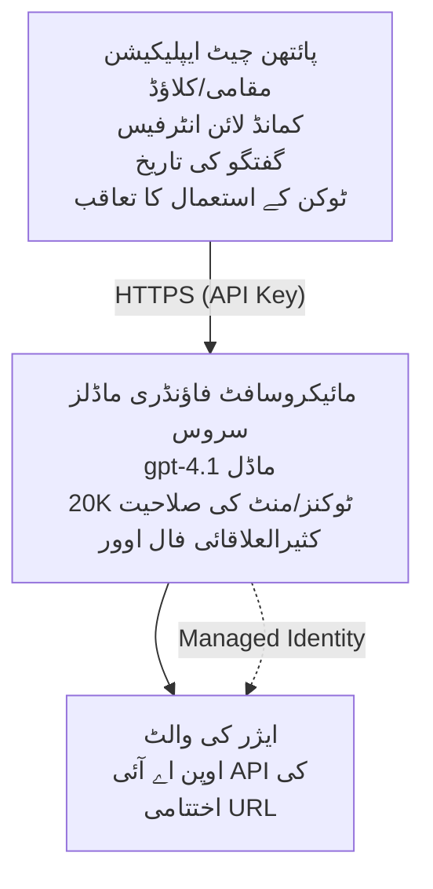

# مائیکروسافٹ فاؤنڈری ماڈلز چیٹ ایپلیکیشن

**سیکھنے کا راستہ:** درمیانی ⭐⭐ | **وقت:** 35-45 منٹ | **لاگت:** $50-200/ماہ

ایک مکمل مائیکروسافٹ فاؤنڈری ماڈلز چیٹ ایپلیکیشن جو Azure Developer CLI (azd) کے ذریعے تعینات کی گئی ہے۔ یہ مثال gpt-4.1 کی تعیناتی، محفوظ API رسائی، اور ایک سادہ چیٹ انٹرفیس دکھاتی ہے۔

## 🎯 آپ کیا سیکھیں گے

- gpt-4.1 ماڈل کے ساتھ Microsoft Foundry Models سروس تعینات کرنا  
- Key Vault کے ذریعے OpenAI API کلیدوں کو محفوظ بنانا  
- Python کے ساتھ ایک سادہ چیٹ انٹرفیس تیار کرنا  
- ٹوکن کے استعمال اور لاگت کی نگرانی  
- ریٹ لمیٹنگ اور ایرر ہینڈلنگ نافذ کرنا  

## 📦 شامل کیا گیا ہے

✅ **Microsoft Foundry Models سروس** - gpt-4.1 ماڈل کی تعیناتی  
✅ **Python چیٹ ایپ** - سادہ کمانڈ لائن چیٹ انٹرفیس  
✅ **Key Vault انٹیگریشن** - API کلیدوں کی محفوظ ذخیرہ اندوزی  
✅ **ARM ٹیمپلیٹس** - مکمل انفراسٹرکچر بطور کوڈ  
✅ **لاگت کی نگرانی** - ٹوکن استعمال کی ٹریکنگ  
✅ **ریٹ لمیٹنگ** - کوٹا ختم ہونے سے بچاؤ  

## فن تعمیر


## پری ریکوائزٹس

### درکار

- **Azure Developer CLI (azd)** - [انسٹال گائیڈ](https://learn.microsoft.com/azure/developer/azure-developer-cli/install-azd)  
- **Azure سبسکرپشن** جس میں OpenAI رسائی ہو - [درخواست دیں](https://aka.ms/oai/access)  
- **Python 3.9+** - [Python انسٹال کریں](https://www.python.org/downloads/)  

### پری ریکوائزٹس کی تصدیق

```bash
# ایزی ڈی کا ورژن چیک کریں (1.5.0 یا اس سے زیادہ چاہیے)
azd version

# آزور لاگ ان کی تصدیق کریں
azd auth login

# پائتھن ورژن چیک کریں
python --version  # یا python3 --version

# اوپن اے آئی تک رسائی کی تصدیق کریں (آزور پورٹل میں چیک کریں)
az cognitiveservices account list-skus \
  --kind OpenAI \
  --location eastus
```

> **⚠️ اہم:** Microsoft Foundry Models کے لیے درخواست کی منظوری ضروری ہے۔ اگر آپ نے درخواست نہیں دی تو [aka.ms/oai/access](https://aka.ms/oai/access) ملاحظہ کریں۔ منظوری عام طور پر 1-2 کاروباری دن لیتی ہے۔

## ⏱️ تعیناتی کا وقت

| مرحلہ | دورانیہ | کیا ہوتا ہے |
|-------|----------|--------------|
| پری ریکوائزٹس کی جانچ | 2-3 منٹ | OpenAI کوٹا کی دستیابی کی تصدیق |
| انفراسٹرکچر تعینات کریں | 8-12 منٹ | OpenAI، Key Vault، ماڈل تعینات کریں |
| ایپلیکیشن کی تشکیلات | 2-3 منٹ | ماحول اور انحصاری سیٹ اپ کریں |
| **کل** | **12-18 منٹ** | gpt-4.1 کے ساتھ چیٹ کے لیے تیار |

**نوٹ:** پہلی بار OpenAI کی تعیناتی ماڈل کی فراہمی کی وجہ سے زیادہ وقت لے سکتی ہے۔

## فوری آغاز

```bash
# مثال پر جائیں
cd examples/azure-openai-chat

# ماحول کو شروع کریں
azd env new myopenai

# سب کچھ تعینات کریں ( بنیادی ڈھانچہ + ترتیب)
azd up
# آپ سے پوچھا جائے گا:
# 1. Azure سبسکرپشن منتخب کریں
# 2. ایسی جگہ منتخب کریں جہاں OpenAI دستیاب ہو (مثلاً، eastus، eastus2، westus)
# 3. تعیناتی کے لیے 12-18 منٹ انتظار کریں

# Python کی dependencies انسٹال کریں
pip install -r requirements.txt

# بات چیت شروع کریں!
python chat.py
```

**متوقع آؤٹ پٹ:**
```
🤖 Microsoft Foundry Models Chat Application
Connected to: gpt-4.1 (eastus)
Type your message (or 'quit' to exit)

You: Hello! Tell me about Microsoft Foundry Models.
Assistant: Microsoft Foundry Models Service provides REST API access to OpenAI's powerful language models including gpt-4.1, GPT-3.5-Turbo, and Embeddings...

[Tokens used: 145 | Estimated cost: $0.0044]
```

## ✅ تعیناتی کی تصدیق

### مرحلہ 1: Azure وسائل چیک کریں

```bash
# تعینات شدہ وسائل دیکھیں
azd show

# متوقع نتیجہ دکھاتا ہے:
# - OpenAI سروس: (وسیلے کا نام)
# - کی والٹ: (وسیلے کا نام)
# - تعیناتی: gpt-4.1
# - مقام: eastus (یا آپ کا منتخب کردہ علاقہ)
```

### مرحلہ 2: OpenAI API کا ٹیسٹ کریں

```bash
# اوپن اے آئی اینڈپوائنٹ اور کلید حاصل کریں
OPENAI_ENDPOINT=$(azd env get-value AZURE_OPENAI_ENDPOINT)
OPENAI_KEY=$(azd env get-value AZURE_OPENAI_API_KEY)

# اے پی آئی کال کا تجربہ کریں
curl "$OPENAI_ENDPOINT/openai/deployments/gpt-4.1/chat/completions?api-version=2024-08-01-preview" \
  -H "Content-Type: application/json" \
  -H "api-key: $OPENAI_KEY" \
  -d '{
    "messages": [{"role": "user", "content": "Say hello!"}],
    "max_tokens": 50
  }'
```

**متوقع جواب:**
```json
{
  "choices": [
    {
      "message": {
        "role": "assistant",
        "content": "Hello! How can I assist you today?"
      }
    }
  ],
  "usage": {
    "prompt_tokens": 8,
    "completion_tokens": 9,
    "total_tokens": 17
  }
}
```

### مرحلہ 3: Key Vault رسائی کی تصدیق

```bash
# کی وولٹ میں سیکرٹس کی فہرست بنائیں
KV_NAME=$(azd env get-value AZURE_KEY_VAULT_NAME)

az keyvault secret list \
  --vault-name $KV_NAME \
  --query "[].name" \
  --output table
```

**متوقع سیکریٹس:**
- `openai-api-key`  
- `openai-endpoint`  

**کامیابی کے معیار:**
- ✅ OpenAI سروس gpt-4.1 کے ساتھ تعینات ہو چکی ہے  
- ✅ API کال سے درست مکمل جواب آ رہا ہے  
- ✅ سیکریٹس Key Vault میں محفوظ ہیں  
- ✅ ٹوکن کے استعمال کی ٹریکنگ کام کر رہی ہے  

## پروجیکٹ کا ڈھانچہ

```
azure-openai-chat/
├── README.md                   ✅ This guide
├── azure.yaml                  ✅ AZD configuration
├── infra/                      ✅ Infrastructure as Code
│   ├── main.bicep             ✅ Main Bicep template
│   ├── main.parameters.json   ✅ Parameters
│   └── openai.bicep           ✅ OpenAI resource definition
├── src/                        ✅ Application code
│   ├── chat.py                ✅ Chat interface
│   ├── config.py              ✅ Configuration loader
│   └── requirements.txt       ✅ Python dependencies
└── .gitignore                  ✅ Git ignore rules
```

## ایپلیکیشن کی خصوصیات

### چیٹ انٹرفیس (`chat.py`)

چیٹ ایپلیکیشن میں شامل ہیں:

- **بات چیت کی تاریخ** - پیغامات کے درمیان سیاق و سباق برقرار رکھتا ہے  
- **ٹوکن گنتی** - استعمال کی ٹریکنگ اور لاگت کا اندازہ لگانا  
- **ایرر ہینڈلنگ** - ریٹ لمیٹس اور API غلطیوں کی شائستہ ہینڈلنگ  
- **لاگت کا اندازہ** - فی پیغام حقیقی وقت پر لاگت کا حساب  
- **اسٹریمنگ سپورٹ** - اختیاری اسٹریمنگ جوابات  

### کمانڈز

چیٹ کرتے وقت آپ استعمال کر سکتے ہیں:
- `quit` یا `exit` - سیشن ختم کریں  
- `clear` - بات چیت کی تاریخ صاف کریں  
- `tokens` - کل استعمال شدہ ٹوکنز دکھائیں  
- `cost` - تخمینہ شدہ کل لاگت دکھائیں  

### کنفیگریشن (`config.py`)

ماحول کی متغیرات سے کنفیگریشن لوڈ کرتا ہے:  
```python
AZURE_OPENAI_ENDPOINT  # کی ویلت سے
AZURE_OPENAI_API_KEY   # کی ویلت سے
AZURE_OPENAI_MODEL     # ڈیفالٹ: gpt-4.1
AZURE_OPENAI_MAX_TOKENS # ڈیفالٹ: 800
```

## استعمال کی مثالیں

### بنیادی چیٹ

```bash
python chat.py
```

### کسٹم ماڈل کے ساتھ چیٹ

```bash
export AZURE_OPENAI_MODEL=gpt-35-turbo
python chat.py
```

### اسٹریمنگ کے ساتھ چیٹ

```bash
python chat.py --stream
```

### مثال کی بات چیت

```
You: Explain Microsoft Foundry Models Service in 3 sentences.
Assistant: Microsoft Foundry Models Service is Microsoft Azure's cloud platform offering 
that provides access to OpenAI's powerful language models. It enables developers 
to integrate capabilities like gpt-4.1 into their applications with enterprise-grade 
security and compliance. The service includes features for content filtering, 
abuse monitoring, and responsible AI practices.

[Tokens used: 89 | Estimated cost: $0.0027]

You: What models are available?
Assistant: Microsoft Foundry Models Service offers several model families including gpt-4.1 
(most capable), GPT-3.5-Turbo (faster and cost-effective), and Embeddings models 
for vector search. Each model has different capabilities, pricing, and token limits.

[Tokens used: 67 | Estimated cost: $0.0020]

Total session: 156 tokens | $0.0047
```

## لاگت کا انتظام

### ٹوکن کی قیمت (gpt-4.1)

| ماڈل | ان پٹ (فی 1K ٹوکن) | آؤٹ پٹ (فی 1K ٹوکن) |
|-------|----------------------|------------------------|
| gpt-4.1 | $0.03 | $0.06 |
| GPT-3.5-Turbo | $0.0015 | $0.002 |

### تخمینہ ماہانہ لاگت

استعمال کے اندازوں کی بنیاد پر:

| استعمال کی سطح | پیغامات/دن | ٹوکنز/دن | ماہانہ لاگت |
|-------------|--------------|------------|--------------|
| **ہلکا** | 20 پیغامات | 3,000 ٹوکنز | $3-5 |
| **درمیانہ** | 100 پیغامات | 15,000 ٹوکنز | $15-25 |
| **زیادہ** | 500 پیغامات | 75,000 ٹوکنز | $75-125 |

**بنیادی انفراسٹرکچر لاگت:** $1-2/ماہ (Key Vault + کم از کم کمپیوٹ)

### لاگت کی اصلاح کے نکات

```bash
# 1۔ آسان کاموں کے لیے GPT-3.5-Turbo استعمال کریں (20 گنا سستا)
export AZURE_OPENAI_MODEL=gpt-35-turbo

# 2۔ جواب مختصر کرنے کے لیے زیادہ سے زیادہ ٹوکنز کم کریں
export AZURE_OPENAI_MAX_TOKENS=400

# 3۔ ٹوکن کے استعمال کی نگرانی کریں
python chat.py --show-tokens

# 4۔ بجٹ_ALERT قائم کریں
az consumption budget create \
  --budget-name "openai-budget" \
  --amount 50 \
  --time-grain Monthly
```

## نگرانی

### ٹوکن کے استعمال کا مشاہدہ کریں

```bash
# ایژور پورٹل میں:
# OpenAI ریسورس → میٹرکس → "ٹوکن ٹرانزیکشن" منتخب کریں

# یا ایژور CLI کے ذریعے:
az monitor metrics list \
  --resource $(azd env get-value AZURE_OPENAI_RESOURCE_ID) \
  --metric "TokenTransaction" \
  --start-time $(date -u -d '1 hour ago' '+%Y-%m-%dT%H:%M:%S') \
  --interval PT1M
```

### API لاگز دیکھیں

```bash
# تشخیصی لاگز کو سلسلہ بہ سلسلہ دکھائیں
az monitor diagnostic-settings create \
  --resource $(azd env get-value AZURE_OPENAI_RESOURCE_ID) \
  --name openai-logs \
  --logs '[{"category": "Audit", "enabled": true}]' \
  --workspace $(azd env get-value LOG_ANALYTICS_WORKSPACE_ID)

# لاگز کو تلاش کریں
az monitor log-analytics query \
  --workspace $(azd env get-value LOG_ANALYTICS_WORKSPACE_ID) \
  --analytics-query "AzureDiagnostics | where Category == 'Audit' | top 10 by TimeGenerated"
```

## مسئلے کا حل

### مسئلہ: "رسائی اجازت نہیں" کی غلطی

**علامات:** API کال کرتے وقت 403 Forbidden

**حل:**
```bash
# ١۔ تصدیق کریں کہ OpenAI تک رسائی کی منظوری دی گئی ہے
az cognitiveservices account show \
  --name $(azd env get-value AZURE_OPENAI_NAME) \
  --resource-group $(azd env get-value AZURE_RESOURCE_GROUP)

# ٢۔ چیک کریں کہ API کلید درست ہے
azd env get-value AZURE_OPENAI_API_KEY

# ٣۔ اینڈ پوائنٹ URL کے فارمیٹ کی تصدیق کریں
azd env get-value AZURE_OPENAI_ENDPOINT
# ہونا چاہیے: https://[name].openai.azure.com/
```

### مسئلہ: "ریٹ لمٹ تجاوز کر گیا"

**علامات:** 429 Too Many Requests

**حل:**
```bash
# 1۔ موجودہ کوٹہ چیک کریں
az cognitiveservices account deployment show \
  --name $(azd env get-value AZURE_OPENAI_NAME) \
  --resource-group $(azd env get-value AZURE_RESOURCE_GROUP) \
  --deployment-name gpt-4.1

# 2۔ کوٹہ میں اضافہ کی درخواست کریں (اگر ضرورت ہو)
# Azure پورٹل پر جائیں → OpenAI وسائل → کوٹے → اضافہ کی درخواست کریں

# 3۔ ریٹری لاجک کو نافذ کریں (پہلے ہی chat.py میں موجود ہے)
# ایپلیکیشن خود بخود تکرار کرتی ہے جس میں اسکیل بڑھاتا ہوا وقفہ ہوتا ہے
```

### مسئلہ: "ماڈل نہیں ملا"

**علامات:** تعیناتی کے لیے 404 کی خرابی

**حل:**
```bash
# 1. دستیاب تعینات کی فہرست بنائیں
az cognitiveservices account deployment list \
  --name $(azd env get-value AZURE_OPENAI_NAME) \
  --resource-group $(azd env get-value AZURE_RESOURCE_GROUP)

# 2. ماحول میں ماڈل کے نام کی تصدیق کریں
echo $AZURE_OPENAI_MODEL

# 3. درست تعینات نام کو اپ ڈیٹ کریں
export AZURE_OPENAI_MODEL=gpt-4.1  # یا gpt-35-turbo
```

### مسئلہ: زیادہ تاخیر

**علامات:** سست ردعمل وقت (>5 سیکنڈ)

**حل:**
```bash
# 1. علاقائی تاخیر چیک کریں
# صارفین کے قریب ترین خطے میں تعینات کریں

# 2. تیز تر جوابات کے لیے max_tokens کم کریں
export AZURE_OPENAI_MAX_TOKENS=400

# 3. بہتر صارف تجربے کے لیے اسٹریمنگ استعمال کریں
python chat.py --stream
```

## سیکیورٹی بہترین طریقے

### 1. API کلیدوں کی حفاظت

```bash
# کبھی بھی چابیاں سورس کنٹرول میں جمع نہ کریں
# کی والٹ استعمال کریں (پہلے سے ترتیب شدہ)

# چابیاں باقاعدگی سے تبدیل کریں
az cognitiveservices account keys regenerate \
  --name $(azd env get-value AZURE_OPENAI_NAME) \
  --resource-group $(azd env get-value AZURE_RESOURCE_GROUP) \
  --key-name key1
```

### 2. مواد کی فلٹرنگ نافذ کریں

```python
# Microsoft Foundry Models میں بلٹ ان مواد کی فلٹرنگ شامل ہے
# Azure پورٹل میں ترتیب دیں:
# OpenAI Resource → Content Filters → Create Custom Filter

# زمرے: نفرت، جنسی، تشدد، خود کو نقصان پہنچانا
# درجات: کم، درمیانہ، اعلیٰ فلٹرنگ
```

### 3. مینیجڈ شناخت استعمال کریں (پیداواری)

```bash
# پیداواری تعینات کے لیے، منظم شناخت استعمال کریں
# API کلیدوں کے بجائے (ایپ کو Azure پر ہوسٹنگ کی ضرورت ہے)

# infra/openai.bicep کو شامل کرنے کے لیے اپ ڈیٹ کریں:
# identity: { قسم: 'SystemAssigned' }
```

## ترقی

### لوکل چلائیں

```bash
# انحصاریات انسٹال کریں
pip install -r src/requirements.txt

# ماحولیاتی متغیرات سیٹ کریں
export AZURE_OPENAI_ENDPOINT="https://[name].openai.azure.com/"
export AZURE_OPENAI_API_KEY="your-api-key"
export AZURE_OPENAI_MODEL="gpt-4.1"

# درخواست چلائیں
python src/chat.py
```

### ٹیسٹ چلائیں

```bash
# ٹیسٹ کی انحصاریوں کو انسٹال کریں
pip install pytest pytest-cov

# ٹیسٹ چلاؤ
pytest tests/ -v

# کورویج کے ساتھ
pytest tests/ --cov=src --cov-report=html
```

### ماڈل کی تعیناتی کو اپ ڈیٹ کریں

```bash
# مختلف ماڈل ورژن کو تعینات کریں
az cognitiveservices account deployment create \
  --name $(azd env get-value AZURE_OPENAI_NAME) \
  --resource-group $(azd env get-value AZURE_RESOURCE_GROUP) \
  --deployment-name gpt-35-turbo \
  --model-name gpt-35-turbo \
  --model-version "0613" \
  --model-format OpenAI \
  --sku-capacity 20 \
  --sku-name "Standard"
```

## صفائی

```bash
# تمام Azure وسائل کو حذف کریں
azd down --force --purge

# یہ مندرجہ ذیل کو حذف کرے گا:
# - OpenAI سروس
# - کی والٹ (90 دن کی نرم حذف کے ساتھ)
# - ریسورس گروپ
# - تمام تعیناتیاں اور ترتیبات
```

## اگلے اقدامات

### اس مثال کو بڑھائیں

1. **ویب انٹرفیس شامل کریں** - React/Vue فرنٹ اینڈ بنائیں  
   ```bash
   # فرنٹ اینڈ سروس کو azure.yaml میں شامل کریں
   # Azure Static Web Apps پر تعینات کریں
   ```

2. **RAG نافذ کریں** - Azure AI سرچ کے ساتھ دستاویزات کی تلاش شامل کریں  
   ```python
   # ایزور کگنیٹیو سرچ کو مربوط کریں
   # دستاویزات اپ لوڈ کریں اور ویکٹر انڈیکس بنائیں
   ```

3. **فنکشن کالنگ شامل کریں** - ٹول کے استعمال کی اجازت دیں  
   ```python
   # چیٹ.py میں فنکشنز کو متعین کریں
   # gpt-4.1 کو خارجی APIs کو کال کرنے دیں
   ```

4. **کثیر ماڈل سپورٹ** - متعدد ماڈلز تعینات کریں  
   ```bash
   # جی پی ٹی-35-ٹربو، ایمبیڈنگز ماڈلز شامل کریں
   # ماڈل روٹنگ منطق نافذ کریں
   ```

### متعلقہ مثالیں

- **[ریٹیل ملٹی ایجنٹ](../retail-scenario.md)** - اعلی درجے کی ملٹی ایجنٹ فن تعمیر  
- **[ڈیٹا بیس ایپ](../../../../examples/database-app)** - مستقل اسٹوریج شامل کریں  
- **[کنٹینر ایپس](../../../../examples/container-app)** - کنٹینرائزڈ سروس کے طور پر تعینات کریں  

### سیکھنے کے وسائل

- 📚 [AZD فار بگنرز کورس](../../README.md) - اہم کورس کا مرکز  
- 📚 [Microsoft Foundry Models دستاویزات](https://learn.microsoft.com/azure/ai-services/openai/) - سرکاری دستاویزات  
- 📚 [OpenAI API ریفرنس](https://platform.openai.com/docs/api-reference) - API تفصیلات  
- 📚 [ریسپانسبل AI](https://www.microsoft.com/ai/responsible-ai) - بہترین عملی طریقے  

## اضافی وسائل

### دستاویزات
- **[Microsoft Foundry Models سروس](https://learn.microsoft.com/azure/ai-services/openai/)** - مکمل رہنما  
- **[gpt-4.1 ماڈلز](https://learn.microsoft.com/azure/ai-services/openai/concepts/models)** - ماڈل کی صلاحیتیں  
- **[مواد کی فلٹرنگ](https://learn.microsoft.com/azure/ai-services/openai/concepts/content-filter)** - حفاظتی خصوصیات  
- **[Azure Developer CLI](https://learn.microsoft.com/azure/developer/azure-developer-cli/)** - azd کا حوالہ  

### ٹیوٹوریلز
- **[OpenAI فوری آغاز](https://learn.microsoft.com/azure/ai-services/openai/quickstart)** - پہلی تعیناتی  
- **[چیٹ مکمل ہونے کے طریقے](https://learn.microsoft.com/azure/ai-services/openai/how-to/chatgpt)** - چیٹ ایپس بنانا  
- **[فنکشن کالنگ](https://learn.microsoft.com/azure/ai-services/openai/how-to/function-calling)** - اعلی درجے کی خصوصیات  

### اوزار
- **[Microsoft Foundry Models اسٹوڈیو](https://oai.azure.com/)** - ویب پر مبنی پلے گراونڈ  
- **[پرومپٹ انجینئرنگ گائیڈ](https://platform.openai.com/docs/guides/prompt-engineering)** - بہتر پرومپٹس لکھنا  
- **[ٹوکن کیلکولیٹر](https://platform.openai.com/tokenizer)** - ٹوکن استعمال کا تخمینہ  

### کمیونٹی
- **[Azure AI Discord](https://discord.gg/azure)** - کمیونٹی سے مدد حاصل کریں  
- **[GitHub مباحثے](https://github.com/Azure-Samples/openai/discussions)** - سوال و جواب فورم  
- **[Azure بلاگ](https://azure.microsoft.com/blog/tag/azure-openai-service/)** - تازہ ترین اپ ڈیٹس  

---

**🎉 کامیابی!** آپ نے Microsoft Foundry Models تعینات کر دیے ہیں اور ایک فعال چیٹ ایپلیکیشن بنا لی ہے۔ gpt-4.1 کی صلاحیتوں کو دریافت کریں اور مختلف پرومپٹس و استعمالات کے ساتھ تجربہ کریں۔

**سوالات؟** [ایک مسئلہ کھولیں](https://github.com/microsoft/AZD-for-beginners/issues) یا [FAQ](../../resources/faq.md) دیکھیں۔

**لاگت کا انتباہ:** ٹیسٹنگ ختم کرنے پر `azd down` کمانڈ چلائیں تاکہ جاری چارجز سے بچا جا سکے (~فعال استعمال کے لیے $50-100/ماہ)۔

---

<!-- CO-OP TRANSLATOR DISCLAIMER START -->
**ڈسکلیمر**:  
اس دستاویز کا ترجمہ AI ترجمہ سروس [Co-op Translator](https://github.com/Azure/co-op-translator) کے ذریعے کیا گیا ہے۔ اگرچہ ہم درستگی کے لیے کوشاں ہیں، براہ کرم اس بات کا خیال رکھیں کہ خودکار ترجمے میں غلطیاں یا عدم صحت ہو سکتی ہے۔ اصل دستاویز اپنی مادری زبان میں معتبر ماخذ سمجھی جانی چاہیے۔ اہم معلومات کے لیے پیشہ ورانہ انسانی ترجمہ کی سفارش کی جاتی ہے۔ اس ترجمے کے استعمال سے پیدا ہونے والی کسی بھی غلط فہمی یا غلط تشریح کے لیے ہم ذمہ دار نہیں ہیں۔
<!-- CO-OP TRANSLATOR DISCLAIMER END -->