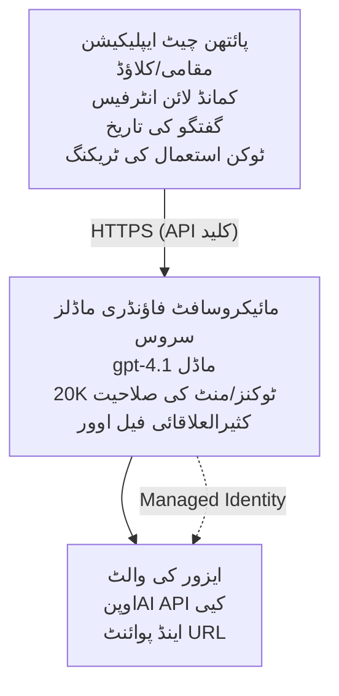

# Microsoft Foundry Models چیٹ ایپلیکیشن

**سیکھنے کا راستہ:** درمیانی ⭐⭐ | **وقت:** 35-45 منٹ | **لاگت:** $50-200/ماہ

ایک مکمل Microsoft Foundry Models چیٹ ایپلیکیشن جو Azure Developer CLI (azd) کے ذریعے تعینات کی گئی ہے۔ یہ مثال gpt-4.1 کی تعیناتی، محفوظ API رسائی، اور ایک سادہ چیٹ انٹرفیس کو ظاہر کرتی ہے۔

## 🎯 آپ کیا سیکھیں گے

- Microsoft Foundry Models سروس کو gpt-4.1 ماڈل کے ساتھ تعینات کرنا  
- OpenAI API کیز کو Key Vault کے ساتھ محفوظ کرنا  
- Python کے ساتھ سادہ چیٹ انٹرفیس بنانا  
- ٹوکن کے استعمال اور لاگت کی نگرانی  
- ریٹ حد بندی اور خرابیوں کی ہینڈلنگ کا نفاذ  

## 📦 شامل کیا گیا ہے

✅ **Microsoft Foundry Models سروس** - gpt-4.1 ماڈل کی تعیناتی  
✅ **Python چیٹ ایپ** - سادہ کمانڈ لائن چیٹ انٹرفیس  
✅ **Key Vault انٹیگریشن** - API کیز کا محفوظ ذخیرہ  
✅ **ARM ٹیمپلیٹس** - مکمل انفراسٹرکچر بطور کوڈ  
✅ **لاگت کی نگرانی** - ٹوکن کے استعمال کی ٹریکنگ  
✅ **ریٹ حد بندی** - کوٹا ختم ہونے سے بچاؤ  

## فن تعمیر



## ضروریات

### درکار

- **Azure Developer CLI (azd)** - [انسٹال گائیڈ](https://learn.microsoft.com/azure/developer/azure-developer-cli/install-azd)  
- **OpenAI رسائی کے ساتھ Azure سبسکرپشن** - [رسائی کی درخواست کریں](https://aka.ms/oai/access)  
- **Python 3.9+** - [Python انسٹال کریں](https://www.python.org/downloads/)  

### ضروریات کی تصدیق

```bash
# azd ورژن چیک کریں (1.5.0 یا اس سے زیادہ درکار ہے)
azd version

# Azure لاگ ان کی تصدیق کریں
azd auth login

# Python ورژن چیک کریں
python --version  # یا python3 --version

# OpenAI رسائی کی تصدیق کریں (Azure پورٹل میں چیک کریں)
az cognitiveservices account list-skus \
  --kind OpenAI \
  --location eastus
```

> **⚠️ اہم:** Microsoft Foundry Models کو درخواست کی منظوری کی ضرورت ہے۔ اگر آپ نے درخواست نہیں دی، تو یہاں جائیں [aka.ms/oai/access](https://aka.ms/oai/access)۔ منظوری عام طور پر 1-2 کاروباری دنوں میں ملتی ہے۔

## ⏱️ تعیناتی کا وقت

| مرحلہ | دورانیہ | کیا ہوتا ہے |
|-------|----------|--------------|
| ضروریات کی جانچ | 2-3 منٹ | OpenAI کوٹا کی دستیابی کی تصدیق |
| انفراسٹرکچر کی تعیناتی | 8-12 منٹ | OpenAI، Key Vault، ماڈل کی تعیناتی بنائیں |
| ایپلیکیشن کی تشکیل | 2-3 منٹ | ماحول اور انحصارات سیٹ کریں |
| **کل** | **12-18 منٹ** | gpt-4.1 کے ساتھ چیٹ کے لیے تیار |

**نوٹ:** پہلی بار OpenAI کی تعیناتی ماڈل کی فراہمی کی وجہ سے زیادہ وقت لے سکتی ہے۔

## فوری آغاز

```bash
# مثال پر جائیں
cd examples/azure-openai-chat

# ماحول شروع کریں
azd env new myopenai

# سب کچھ تعینات کریں (انفراسٹرکچر + ترتیب)
azd up
# آپ سے پوچھا جائے گا:
# 1. Azure سبسکرپشن منتخب کریں
# 2. ایسی جگہ منتخب کریں جہاں OpenAI دستیاب ہو (مثلاً، eastus, eastus2, westus)
# 3. تعیناتی کے لئے 12-18 منٹ انتظار کریں

# Python انحصارات انسٹال کریں
pip install -r requirements.txt

# چیٹ شروع کریں!
python chat.py
```

**متوقع نتیجہ:**  
```
🤖 Microsoft Foundry Models Chat Application
Connected to: gpt-4.1 (eastus)
Type your message (or 'quit' to exit)

You: Hello! Tell me about Microsoft Foundry Models.
Assistant: Microsoft Foundry Models Service provides REST API access to OpenAI's powerful language models including gpt-4.1, GPT-3.5-Turbo, and Embeddings...

[Tokens used: 145 | Estimated cost: $0.0044]
```

## ✅ تعیناتی کی تصدیق

### مرحلہ 1: Azure وسائل کی جانچ

```bash
# تعینات شدہ وسائل دیکھیں
azd show

# متوقع نتیجہ دکھاتا ہے:
# - اوپن اے آئی سروس: (وسیلے کا نام)
# - کی ولٹ: (وسیلے کا نام)
# - تعیناتی: gpt-4.1
# - مقام: eastus (یا آپ کا منتخب کردہ علاقہ)
```

### مرحلہ 2: OpenAI API کا امتحان

```bash
# اوپن اے آئی اینڈ پوائنٹ اور کلید حاصل کریں
OPENAI_ENDPOINT=$(azd env get-value AZURE_OPENAI_ENDPOINT)
OPENAI_KEY=$(azd env get-value AZURE_OPENAI_API_KEY)

# ای پی آئی کال کا ٹیسٹ کریں
curl "$OPENAI_ENDPOINT/openai/deployments/gpt-4.1/chat/completions?api-version=2024-08-01-preview" \
  -H "Content-Type: application/json" \
  -H "api-key: $OPENAI_KEY" \
  -d '{
    "messages": [{"role": "user", "content": "Say hello!"}],
    "max_tokens": 50
  }'
```

**متوقع جواب:**  
```json
{
  "choices": [
    {
      "message": {
        "role": "assistant",
        "content": "Hello! How can I assist you today?"
      }
    }
  ],
  "usage": {
    "prompt_tokens": 8,
    "completion_tokens": 9,
    "total_tokens": 17
  }
}
```

### مرحلہ 3: Key Vault رسائی کی تصدیق

```bash
# کی واؤلٹ میں خفیہ کو فہرست بنائیں
KV_NAME=$(azd env get-value AZURE_KEY_VAULT_NAME)

az keyvault secret list \
  --vault-name $KV_NAME \
  --query "[].name" \
  --output table
```

**متوقع سیکریٹس:**  
- `openai-api-key`  
- `openai-endpoint`  

**کامیابی کے معیار:**  
- ✅ OpenAI سروس gpt-4.1 کے ساتھ تعینات  
- ✅ API کال درست مکمل جواب دیتی ہے  
- ✅ Key Vault میں سیکریٹس محفوظ  
- ✅ ٹوکن کے استعمال کی ٹریکنگ کام کر رہی ہے  

## پروجیکٹ کی ساخت

```
azure-openai-chat/
├── README.md                   ✅ This guide
├── azure.yaml                  ✅ AZD configuration
├── infra/                      ✅ Infrastructure as Code
│   ├── main.bicep             ✅ Main Bicep template
│   ├── main.parameters.json   ✅ Parameters
│   └── openai.bicep           ✅ OpenAI resource definition
├── src/                        ✅ Application code
│   ├── chat.py                ✅ Chat interface
│   ├── config.py              ✅ Configuration loader
│   └── requirements.txt       ✅ Python dependencies
└── .gitignore                  ✅ Git ignore rules
```

## ایپلیکیشن کی خصوصیات

### چیٹ انٹرفیس (`chat.py`)

چیٹ ایپلیکیشن میں شامل ہیں:

- **بات چیت کی تاریخ** - پیغامات کے درمیان سیاق و سباق برقرار رکھتا ہے  
- **ٹوکن گننا** - استعمال کا سراغ لگانا اور اخراجات کا اندازہ  
- **خرابی کی ہینڈلنگ** - ریٹ لمٹس اور API کی خرابیوں کا آرام دہ انتظام  
- **اخراجات کا تخمینہ** - فی پیغام حقیقی وقت لاگت کا حساب  
- **اسٹریمنگ سپورٹ** - اختیاری اسٹریمنگ جوابات  

### کمانڈز

چیٹ کرتے ہوئے آپ استعمال کر سکتے ہیں:  
- `quit` یا `exit` - سیشن ختم کریں  
- `clear` - بات چیت کی تاریخ صاف کریں  
- `tokens` - کل ٹوکن استعمال دکھائیں  
- `cost` - کل لاگت کا اندازہ دکھائیں  

### کنفیگریشن (`config.py`)

ماحول کی متغیرات سے ترتیب لوڈ کرتا ہے:  
```python
AZURE_OPENAI_ENDPOINT  # کی ویلت سے
AZURE_OPENAI_API_KEY   # کی ویلت سے
AZURE_OPENAI_MODEL     # ڈیفالٹ: gpt-4.1
AZURE_OPENAI_MAX_TOKENS # ڈیفالٹ: 800
```

## استعمال کی مثالیں

### بنیادی چیٹ

```bash
python chat.py
```

### کسٹم ماڈل کے ساتھ چیٹ

```bash
export AZURE_OPENAI_MODEL=gpt-35-turbo
python chat.py
```

### اسٹریمنگ کے ساتھ چیٹ

```bash
python chat.py --stream
```

### مثال بات چیت

```
You: Explain Microsoft Foundry Models Service in 3 sentences.
Assistant: Microsoft Foundry Models Service is Microsoft Azure's cloud platform offering 
that provides access to OpenAI's powerful language models. It enables developers 
to integrate capabilities like gpt-4.1 into their applications with enterprise-grade 
security and compliance. The service includes features for content filtering, 
abuse monitoring, and responsible AI practices.

[Tokens used: 89 | Estimated cost: $0.0027]

You: What models are available?
Assistant: Microsoft Foundry Models Service offers several model families including gpt-4.1 
(most capable), GPT-3.5-Turbo (faster and cost-effective), and Embeddings models 
for vector search. Each model has different capabilities, pricing, and token limits.

[Tokens used: 67 | Estimated cost: $0.0020]

Total session: 156 tokens | $0.0047
```

## لاگت کا انتظام

### ٹوکن قیمتیں (gpt-4.1)

| ماڈل | ان پٹ (فی 1K ٹوکن) | آؤٹ پٹ (فی 1K ٹوکن) |
|-------|----------------------|------------------------|
| gpt-4.1 | $0.03 | $0.06 |
| GPT-3.5-Turbo | $0.0015 | $0.002 |

### ماہانہ اندازہ لاگت

استعمال کے نمونوں کی بنیاد پر:

| استعمال کی سطح | پیغامات/دن | ٹوکن/دن | ماہانہ لاگت |
|-------------|--------------|------------|--------------|
| **ہلکا** | 20 پیغامات | 3,000 ٹوکن | $3-5 |
| **درمیانہ** | 100 پیغامات | 15,000 ٹوکن | $15-25 |
| **زیادہ** | 500 پیغامات | 75,000 ٹوکن | $75-125 |

**بنیادی انفراسٹرکچر لاگت:** $1-2/ماہ (Key Vault + کم از کم کمپیوٹ)

### لاگت کی بچت کے نکات

```bash
# 1. آسان کاموں کے لیے GPT-3.5-Turbo استعمال کریں (20 گنا سستا)
export AZURE_OPENAI_MODEL=gpt-35-turbo

# 2. مختصر جوابات کے لیے زیادہ سے زیادہ ٹوکن کم کریں
export AZURE_OPENAI_MAX_TOKENS=400

# 3. ٹوکن کے استعمال کی نگرانی کریں
python chat.py --show-tokens

# 4. بجٹ کی اطلاع ترتیب دیں
az consumption budget create \
  --budget-name "openai-budget" \
  --amount 50 \
  --time-grain Monthly
```

## نگرانی

### ٹوکن کے استعمال کا جائزہ

```bash
# ان اےژور پورٹل میں:
# اوپن اےآئی ریسورس → میٹرکس → "ٹوکن ٹرانزیکشن" منتخب کریں

# یا اےژور کمانڈ لائن انٹرفیس کے ذریعے:
az monitor metrics list \
  --resource $(azd env get-value AZURE_OPENAI_RESOURCE_ID) \
  --metric "TokenTransaction" \
  --start-time $(date -u -d '1 hour ago' '+%Y-%m-%dT%H:%M:%S') \
  --interval PT1M
```

### API لاگز دیکھیں

```bash
# تشخیصی لاگز کو اسٹریم کریں
az monitor diagnostic-settings create \
  --resource $(azd env get-value AZURE_OPENAI_RESOURCE_ID) \
  --name openai-logs \
  --logs '[{"category": "Audit", "enabled": true}]' \
  --workspace $(azd env get-value LOG_ANALYTICS_WORKSPACE_ID)

# کوئری لاگز
az monitor log-analytics query \
  --workspace $(azd env get-value LOG_ANALYTICS_WORKSPACE_ID) \
  --analytics-query "AzureDiagnostics | where Category == 'Audit' | top 10 by TimeGenerated"
```

## مسئلہ حل کرنا

### مسئلہ: "رسائی مسترد" کی خرابی

**علامات:** API کال کرتے ہوئے 403 Forbidden

**حل:**  
```bash
# 1. تصدیق کریں کہ OpenAI کی رسائی منظور ہو چکی ہے
az cognitiveservices account show \
  --name $(azd env get-value AZURE_OPENAI_NAME) \
  --resource-group $(azd env get-value AZURE_RESOURCE_GROUP)

# 2. چیک کریں کہ API کلید درست ہے
azd env get-value AZURE_OPENAI_API_KEY

# 3. endpoint URL فارمیٹ کی تصدیق کریں
azd env get-value AZURE_OPENAI_ENDPOINT
# یہ ہونا چاہیے: https://[name].openai.azure.com/
```

### مسئلہ: "ریٹ حد سے تجاوز"

**علامات:** 429 بہت زیادہ درخواستیں

**حل:**  
```bash
# 1۔ موجودہ کوٹا چیک کریں
az cognitiveservices account deployment show \
  --name $(azd env get-value AZURE_OPENAI_NAME) \
  --resource-group $(azd env get-value AZURE_RESOURCE_GROUP) \
  --deployment-name gpt-4.1

# 2۔ کوٹا میں اضافہ کی درخواست کریں (اگر ضرورت ہو)
# Azure پورٹل پر جائیں → OpenAI ریسورس کھولیں → کوٹاز → اضافہ کی درخواست کریں

# 3۔ ریٹری لاجک نافذ کریں (پہلے سے chat.py میں موجود ہے)
# درخواست خود بخود متواتر وقتوں کے ساتھ دوبارہ کوشش کرتی ہے
```

### مسئلہ: "ماڈل نہیں ملا"

**علامات:** تعیناتی کے لیے 404 خرابی

**حل:**  
```bash
# 1. دستیاب تعیناتیوں کی فہرست بنائیں
az cognitiveservices account deployment list \
  --name $(azd env get-value AZURE_OPENAI_NAME) \
  --resource-group $(azd env get-value AZURE_RESOURCE_GROUP)

# 2. ماحول میں ماڈل کا نام تصدیق کریں
echo $AZURE_OPENAI_MODEL

# 3. درست تعیناتی کے نام کو اپ ڈیٹ کریں
export AZURE_OPENAI_MODEL=gpt-4.1  # یا gpt-35-turbo
```

### مسئلہ: زیادہ تاخیر

**علامات:** جواب میں سستی (>5 سیکنڈ)

**حل:**  
```bash
# 1۔ علاقائی لیٹنسی چیک کریں
# صارفین کے قریب ترین خطے میں تعینات کریں

# 2۔ تیز جوابات کے لیے زیادہ سے زیادہ ٹوکنز کم کریں
export AZURE_OPENAI_MAX_TOKENS=400

# 3۔ بہتر صارف تجربے کے لیے اسٹریمنگ استعمال کریں
python chat.py --stream
```

## حفاظتی بہترین طریقے

### 1. API کیز کی حفاظت کریں

```bash
# کبھی بھی چابیاں سورس کنٹرول میں جمع نہ کریں
# کی وولٹ استعمال کریں (پہلے ہی ترتیب دیا گیا ہے)

# چابیاں باقاعدگی سے گھمائیں
az cognitiveservices account keys regenerate \
  --name $(azd env get-value AZURE_OPENAI_NAME) \
  --resource-group $(azd env get-value AZURE_RESOURCE_GROUP) \
  --key-name key1
```

### 2. مواد کی فلٹرنگ نافذ کریں

```python
# Microsoft Foundry ماڈلز میں بلٹ ان مواد کی فلٹرنگ شامل ہے
# Azure Portal میں ترتیب دیں:
# OpenAI Resource → مواد کے فلٹرز → کسٹم فلٹر بنائیں

# زمرے: نفرت انگیز، جنسی، تشدد، خود کو نقصان
# سطحیں: کم، درمیانی، اعلیٰ فلٹرنگ
```

### 3. منظم شناخت (مینجڈ آئیڈینٹی) استعمال کریں (پیداوار)

```bash
# پیداواری تعیناتی کے لیے، منیجڈ شناخت استعمال کریں
# API چابیاں کے بجائے (ایپ کو آزور پر ہوسٹ کرنا ضروری ہے)

# infrra/openai.bicep کو اپ ڈیٹ کریں تاکہ شامل ہو:
# identity: { قسم: 'SystemAssigned' }
```

## ترقی

### مقامی طور پر چلائیں

```bash
# انحصارات انسٹال کریں
pip install -r src/requirements.txt

# ماحولیاتی متغیرات سیٹ کریں
export AZURE_OPENAI_ENDPOINT="https://[name].openai.azure.com/"
export AZURE_OPENAI_API_KEY="your-api-key"
export AZURE_OPENAI_MODEL="gpt-4.1"

# ایپلی کیشن چلائیں
python src/chat.py
```

### ٹیسٹ چلائیں

```bash
# ٹیسٹ کی ضروریات انسٹال کریں
pip install pytest pytest-cov

# ٹیسٹ چلائیں
pytest tests/ -v

# کوریج کے ساتھ
pytest tests/ --cov=src --cov-report=html
```

### ماڈل کی تعیناتی کو اپ ڈیٹ کریں

```bash
# مختلف ماڈل ورژن تعینات کریں
az cognitiveservices account deployment create \
  --name $(azd env get-value AZURE_OPENAI_NAME) \
  --resource-group $(azd env get-value AZURE_RESOURCE_GROUP) \
  --deployment-name gpt-35-turbo \
  --model-name gpt-35-turbo \
  --model-version "0613" \
  --model-format OpenAI \
  --sku-capacity 20 \
  --sku-name "Standard"
```

## صفائی

```bash
# تمام ایزور وسائل حذف کریں
azd down --force --purge

# یہ ہٹاتا ہے:
# - اوپن اے آئی سروس
# - کی والٹ (90 دن کی نرم حذف کے ساتھ)
# - ریسورس گروپ
# - تمام تعیناتیاں اور ترتیبیں
```

## اگلے اقدامات

### اس مثال کو بڑھائیں

1. **ویب انٹرفیس شامل کریں** - React/Vue فرنٹ اینڈ بنائیں  
   ```bash
   # azure.yaml میں فرنٹ اینڈ سروس شامل کریں
   # Azure Static Web Apps پر تعین کریں
   ```

2. **RAG نافذ کریں** - Azure AI سرچ کے ساتھ دستاویز تلاش شامل کریں  
   ```python
   # ایزور اے آئی سرچ کو ضم کریں
   # دستاویزات اپ لوڈ کریں اور ویکٹر انڈیکس بنائیں
   ```

3. **فنکشن کالنگ شامل کریں** - ٹول استعمال کو فعال کریں  
   ```python
   # chat.py میں فنکشنز کی تعریف کریں
   # gpt-4.1 کو بیرونی API کال کرنے دیں
   ```

4. **کئی ماڈلز کی حمایت** - متعدد ماڈلز کی تعیناتی  
   ```bash
   # جی پی ٹی -۳۵-ٹربو، ایمبیڈنگ ماڈلز شامل کریں
   # ماڈل راؤٹنگ منطق لاگو کریں
   ```

### متعلقہ مثالیں

- **[ریٹیل ملٹی ایجنٹ](../retail-scenario.md)** - جدید ملٹی ایجنٹ فن تعمیر  
- **[ڈیٹابیس ایپ](../../../../examples/database-app)** - مسلسل ذخیرہ شامل کریں  
- **[کنٹینر ایپس](../../../../examples/container-app)** - کنٹینرائزڈ سروس کے طور پر تعینات کریں  

### تعلیمی وسائل

- 📚 [AZD ابتدائیوں کے لیے کورس](../../README.md) - مرکزی کورس ہوم  
- 📚 [Microsoft Foundry Models دستاویزات](https://learn.microsoft.com/azure/ai-services/openai/) - سرکاری دستاویزات  
- 📚 [OpenAI API ریفرنس](https://platform.openai.com/docs/api-reference) - API تفصیلات  
- 📚 [Responsible AI](https://www.microsoft.com/ai/responsible-ai) - بہترین طریقے  

## اضافی وسائل

### دستاویزات
- **[Microsoft Foundry Models سروس](https://learn.microsoft.com/azure/ai-services/openai/)** - مکمل رہنمائی  
- **[gpt-4.1 ماڈلز](https://learn.microsoft.com/azure/ai-services/openai/concepts/models)** - ماڈل کی صلاحیتیں  
- **[مواد کی فلٹرنگ](https://learn.microsoft.com/azure/ai-services/openai/concepts/content-filter)** - حفاظتی خصوصیات  
- **[Azure Developer CLI](https://learn.microsoft.com/azure/developer/azure-developer-cli/)** - azd حوالہ  

### ٹیوٹوریلز
- **[OpenAI فوری آغاز](https://learn.microsoft.com/azure/ai-services/openai/quickstart)** - پہلی تعیناتی  
- **[چیٹ کمپلیشن](https://learn.microsoft.com/azure/ai-services/openai/how-to/chatgpt)** - چیٹ ایپس کی تیاری  
- **[فنکشن کالنگ](https://learn.microsoft.com/azure/ai-services/openai/how-to/function-calling)** - جدید خصوصیات  

### اوزار
- **[Microsoft Foundry Models اسٹوڈیو](https://oai.azure.com/)** - ویب بیسڈ پلے گراؤنڈ  
- **[پرومپٹ انجینئرنگ گائیڈ](https://platform.openai.com/docs/guides/prompt-engineering)** - بہتر پرومپٹ لکھنا  
- **[ٹوکن کیلکولیٹر](https://platform.openai.com/tokenizer)** - ٹوکن کے استعمال کا اندازہ لگائیں  

### کمیونٹی
- **[Azure AI Discord](https://discord.gg/azure)** - کمیونٹی سے مدد حاصل کریں  
- **[GitHub مباحثے](https://github.com/Azure-Samples/openai/discussions)** - سوال و جواب فورم  
- **[Azure بلاگ](https://azure.microsoft.com/blog/tag/azure-openai-service/)** - تازہ ترین اپ ڈیٹس  

---

**🎉 کامیابی!** آپ نے Microsoft Foundry Models کو تعینات کیا اور کام کرنے والی چیٹ ایپلیکیشن بنالی ہے۔ gpt-4.1 کی صلاحیتوں کو تلاش کریں اور مختلف پرومپٹس اور استعمال کیسز کے ساتھ تجربہ کریں۔

**سوالات؟** [ایک مسئلہ کھولیں](https://github.com/microsoft/AZD-for-beginners/issues) یا [FAQ](../../resources/faq.md) دیکھیں۔

**لاگت کی اطلاع:** ٹیسٹنگ مکمل ہونے پر `azd down` چلانا یاد رکھیں تاکہ جاری چارجز سے بچا جا سکے (~$50-100/ماہ فعال استعمال کے لیے)۔

---

<!-- CO-OP TRANSLATOR DISCLAIMER START -->
**ڈس کلیمر**:
یہ دستاویز AI ترجمہ سروس [Co-op Translator](https://github.com/Azure/co-op-translator) کے ذریعے ترجمہ کی گئی ہے۔ جبکہ ہم درستگی کے لیے کوشاں ہیں، براہ کرم اس بات سے آگاہ رہیں کہ خودکار ترجمے میں غلطیاں یا عدم درستیاں ہو سکتی ہیں۔ اصل دستاویز اپنے مادری زبان میں مستند ماخذ سمجھی جائے گی۔ حساس معلومات کے لیے پیشہ ور انسانی ترجمہ کی سفارش کی جاتی ہے۔ اس ترجمے کے استعمال سے پیدا ہونے والی کسی بھی غلط فہمی یا غلط تشریح کی ذمہ داری ہم قبول نہیں کرتے۔
<!-- CO-OP TRANSLATOR DISCLAIMER END -->