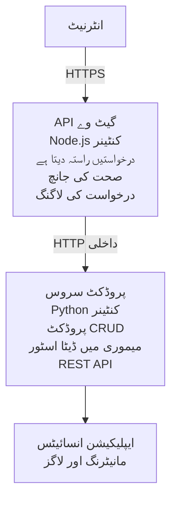

# مائیکروسروسز کا معمار نظام - کنٹینر ایپ کی مثال

⏱️ **تخمینی وقت**: 25-35 منٹ | 💰 **تخمینی لاگت**: تقریباً $50-100/ماہ | ⭐ **پیچیدگی**: اعلی

ایک **سادہ مگر فعال** مائیکروسروسز معمار نظام جو Azure Container Apps پر AZD CLI کے ذریعے ڈیپلوئے کیا گیا ہے۔ یہ مثال سروس سے سروس رابطہ، کنٹینر آرکسٹریشن، اور مانیٹرنگ کو ایک عملی 2-سروس سیٹ اپ کے ساتھ ظاہر کرتی ہے۔

> **📚 سیکھنے کا طریقہ**: یہ مثال ایک معمولی 2-سروس معمار نظام (API Gateway + Backend Service) سے شروع ہوتی ہے جسے آپ حقیقت میں ڈیپلوئے کر کے سیکھ سکتے ہیں۔ اس بنیاد پر عبور حاصل کرنے کے بعد ہم مکمل مائیکروسروسز ماحولیاتی نظام کے لیے رہنمائی فراہم کرتے ہیں۔

## آپ کیا سیکھیں گے

اس مثال کو مکمل کر کے آپ:
- Azure Container Apps میں متعدد کنٹینرز کو ڈیپلوئے کریں گے
- اندرونی نیٹ ورکنگ کے ذریعے سروس سے سروس رابطہ نافظ کریں گے
- ماحولیاتی اسکیلنگ اور صحت کی جانچ ترتیب دیں گے
- Application Insights کے ذریعے تقسیم شدہ ایپلیکیشنز کی مانیٹرنگ کریں گے
- مائیکروسروسز کی ڈیپلائمنٹ پیٹرنز اور بہترین طریقوں کو سمجھیں گے
- سادہ سے پیچیدہ معمار نظام کی تدریجی ترقی سیکھیں گے

## معمار نظام

### مرحلہ 1: ہم کیا بنا رہے ہیں (اس مثال میں شامل)


**سادگی کیوں ابتدائی ہے؟**
- ✅ جلدی ڈیپلوئے کریں اور سمجھیں (25-35 منٹ)
- ✅ بغیر پیچیدگی کے مائیکروسروسز کے بنیادی نمونے سیکھیں
- ✅ کام کرنے والا کوڈ جسے آپ ترمیم اور تجربہ کر سکیں
- ✅ سیکھنے کے لیے کم لاگت (~$50-100/ماہ بمقابلہ $300-1400/ماہ)
- ✅ ڈیٹابیسز اور میسج کیوز شامل کرنے سے پہلے اعتماد پیدا کریں

**تمثیل**: اسے ڈرائیونگ سیکھنے کی طرح سمجھیں۔ آپ خالی پارکنگ لاٹ (2 سروسز) سے شروع کرتے ہیں، بنیادیات میں مہارت حاصل کرتے ہیں، پھر شہر کی ٹریفک (5+ سروسز ڈیٹابیسز کے ساتھ) کی طرف بڑھتے ہیں۔

### مرحلہ 2: مستقبل کی توسیع (حوالہ جاتی معمار نظام)

ایک بار جب آپ 2-سروس معمار نظام میں مہارت حاصل کر لیں، تو آپ بڑھا سکتے ہیں:

```
Full Architecture (Not Included - For Reference)
├── API Gateway (✅ Included)
├── Product Service (✅ Included)
├── Order Service (🔜 Add next)
├── User Service (🔜 Add next)
├── Notification Service (🔜 Add last)
├── Azure Service Bus (🔜 For async communication)
├── Cosmos DB (🔜 For product persistence)
├── Azure SQL (🔜 For order management)
└── Azure Storage (🔜 For file storage)
```

آخر میں "Expansion Guide" سیکشن میں مرحلہ وار ہدایات ملاحظہ کریں۔

## شامل خصوصیات

✅ **سروس دریافت**: کنٹینرز کے درمیان خودکار DNS بنیاد پر دریافت  
✅ **لوڈ بیلنسنگ**: ریپلیکاز کے درمیان بلٹ ان لوڈ بیلنسنگ  
✅ **خودکار اسکیلنگ**: HTTP درخواستوں کی بنیاد پر ہر سروس کی آزاد اسکیلنگ  
✅ **صحت کی مانیٹرنگ**: دونوں سروسز کے لیے لائیونیس اور ریڈینیس پروبس  
✅ **تقسیم شدہ لاگنگ**: Application Insights کے ساتھ مرکزی لاگنگ  
✅ **اندرونی نیٹ ورکنگ**: محفوظ سروس سے سروس رابطہ  
✅ **کنٹینر آرکسٹریشن**: خودکار تعیناتی اور اسکیلنگ  
✅ **زیرو ڈاؤن ٹائم اپڈیٹس**: ریویژن مینجمنٹ کے ساتھ رولنگ اپڈیٹس  

## ضروریات

### مطلوبہ اوزار

شروع کرنے سے پہلے یہ اوزار انسٹال ہونے کی تصدیق کریں:

1. **[Azure Developer CLI (azd)](https://learn.microsoft.com/azure/developer/azure-developer-cli/install-azd)** (ورژن 1.0.0 یا اس سے زیادہ)
   ```bash
   azd version
   # متوقع نتیجہ: azd ورژن 1.0.0 یا اس سے اعلیٰ
   ```

2. **[Azure CLI](https://learn.microsoft.com/cli/azure/install-azure-cli)** (ورژن 2.50.0 یا اس سے زیادہ)
   ```bash
   az --version
   # متوقع نتیجہ: azure-cli 2.50.0 یا اس سے زیادہ
   ```

3. **[Docker](https://www.docker.com/get-started)** (مقامی ترقی/ٹیسٹنگ کے لیے - اختیاری)
   ```bash
   docker --version
   # متوقع نتیجہ: ڈاکر ورژن 20.10 یا اس سے زیادہ
   ```

### Azure کی ضروریات

- ایک فعال **Azure سبسکرپشن** ([مفت اکاؤنٹ بنائیں](https://azure.microsoft.com/free/))
- سبسکرپشن میں وسائل بنانے کی اجازتیں
- سبسکرپشن یا وسائل گروپ پر **Contributor** کردار

### علم کی ضروریات

یہ ایک **اعلیٰ سطحی** مثال ہے۔ آپ کو ہونا چاہیے:
- [Simple Flask API example](../../../../../examples/container-app/simple-flask-api) مکمل کیا ہوا
- مائیکروسروسز معمار نظام کی بنیادی سمجھ
- REST APIs اور HTTP سے واقفیت
- کنٹینر کے تصورات کی سمجھ

**Container Apps میں نئے ہیں؟** بنیادی باتیں سیکھنے کے لیے پہلے [Simple Flask API example](../../../../../examples/container-app/simple-flask-api) سے شروع کریں۔

## جلدی آغاز (مرحلہ وار)

### مرحلہ 1: کلون کریں اور نیویگیٹ کریں

```bash
git clone https://github.com/microsoft/AZD-for-beginners.git
cd AZD-for-beginners/examples/container-app/microservices
```

**✓ کامیابی کی تصدیق**: `azure.yaml` دکھائی دے رہا ہو:
```bash
ls
# متوقع: README.md, azure.yaml, infra/, src/
```

### مرحلہ 2: Azure میں تصدیق کریں

```bash
azd auth login
```

یہ آپ کا براوزر Azure میں تصدیق کے لیے کھولتا ہے۔ Azure کی معلومات کے ساتھ سائن ان کریں۔

**✓ کامیابی کی تصدیق**: آپ کو یہ دیکھنا چاہیے:
```
Logged in to Azure.
```

### مرحلہ 3: ماحول کی ابتداء کریں

```bash
azd init
```

**مطلوبہ معلومات جو آپ سے پوچھی جائیں گی**:
- **ماحول کا نام**: ایک مختصر نام درج کریں (مثلاً `microservices-dev`)
- **Azure سبسکرپشن**: اپنی سبسکرپشن منتخب کریں
- **Azure مقام**: ایک علاقہ منتخب کریں (مثلاً `eastus`, `westeurope`)

**✓ کامیابی کی تصدیق**: آپ کو یہ دیکھنا چاہیے:
```
SUCCESS: New project initialized!
```

### مرحلہ 4: انفراسٹرکچر اور سروسز ڈیپلوئے کریں

```bash
azd up
```

**کیا ہوتا ہے** (8-12 منٹ لگتے ہیں):
1. Container Apps ماحول بناتا ہے
2. مانیٹرنگ کے لیے Application Insights بناتا ہے
3. API Gateway کنٹینر تیار کرتا ہے (Node.js)
4. Product Service کنٹینر تیار کرتا ہے (Python)
5. دونوں کنٹینرز کو Azure پر تعینات کرتا ہے
6. نیٹ ورکنگ اور صحت کی جانچ ترتیب دیتا ہے
7. مانیٹرنگ اور لاگنگ سیٹ اپ کرتا ہے

**✓ کامیابی کی تصدیق**: آپ کو یہ دیکھنا چاہیے:
```
SUCCESS: Your application was deployed to Azure in X minutes Y seconds.
Endpoint: https://api-gateway-<unique-id>.azurecontainerapps.io
```

**⏱️ وقت**: 8-12 منٹ

### مرحلہ 5: ڈیپلائمنٹ کی جانچ کریں

```bash
# گیٹ وے کا اینڈ پوائنٹ حاصل کریں
GATEWAY_URL=$(azd env get-values | grep API_GATEWAY_URL | cut -d '=' -f2 | tr -d '"')

# API گیٹ وے کی صحت کا معائنہ کریں
curl $GATEWAY_URL/health

# متوقع نتیجہ:
# {"status":"healthy","service":"api-gateway","timestamp":"2025-11-19T10:30:00Z"}
```

**گیٹ وے کے ذریعے پروڈکٹ سروس کی جانچ کریں**:
```bash
# مصنوعات کی فہرست بنائیں
curl $GATEWAY_URL/api/products

# متوقع نتیجہ:
# [
#   {"id":1,"name":"لیپ ٹاپ","price":999.99,"stock":50},
#   {"id":2,"name":"ماؤس","price":29.99,"stock":200},
#   {"id":3,"name":"کی بورڈ","price":79.99,"stock":150}
# ]
```

**✓ کامیابی کی تصدیق**: دونوں اینڈ پوائنٹس JSON ڈیٹا بغیر غلطی کے واپس بھیجیں۔

---

**🎉 مبارک ہو!** آپ نے Azure پر مائیکروسروسز معمار نظام ڈیپلوئے کر لیا ہے!

## پروجیکٹ کا ڈھانچہ

تمام نفاذ کی فائلیں شامل ہیں — یہ ایک مکمل، کام کرنے والی مثال ہے:

```
microservices/
│
├── README.md                         # This file
├── azure.yaml                        # AZD configuration
├── .gitignore                        # Git ignore patterns
│
├── infra/                           # Infrastructure as Code (Bicep)
│   ├── main.bicep                   # Main orchestration
│   ├── abbreviations.json           # Naming conventions
│   ├── core/                        # Shared infrastructure
│   │   ├── container-apps-environment.bicep  # Container environment + registry
│   │   └── monitor.bicep            # Application Insights + Log Analytics
│   └── app/                         # Service definitions
│       ├── api-gateway.bicep        # API Gateway container app
│       └── product-service.bicep    # Product Service container app
│
└── src/                             # Application source code
    ├── api-gateway/                 # Node.js API Gateway
    │   ├── app.js                   # Express server with routing
    │   ├── package.json             # Node dependencies
    │   └── Dockerfile               # Container definition
    └── product-service/             # Python Product Service
        ├── main.py                  # Flask API with product data
        ├── requirements.txt         # Python dependencies
        └── Dockerfile               # Container definition
```

**ہر جزو کا کام:**

**انفراسٹرکچر (infra/)**:
- `main.bicep`: تمام Azure وسائل اور ان کی dependencies کا انتظام
- `core/container-apps-environment.bicep`: Container Apps ماحول اور Azure Container Registry بناتا ہے
- `core/monitor.bicep`: Application Insights سیٹ اپ کرتا ہے تقسیم شدہ لاگنگ کے لیے
- `app/*.bicep`: انفرادی کنٹینر ایپ تعریفیں، اسکیلنگ اور صحت کی جانچ کے ساتھ

**API Gateway (src/api-gateway/)**:
- عوامی سطح کی سروس جو بیک اینڈ سروسز کو درخواستیں بھیجتی ہے
- لاگنگ، غلطی کا انتظام، اور درخواست فارورڈنگ نافظ کرتی ہے
- سروس سے سروس HTTP رابطہ کی مثال پیش کرتی ہے

**Product Service (src/product-service/)**:
- اندرونی سروس جو پروڈکٹ کیٹلاگ کو سنبھالتی ہے (سادگی کے لیے ان میموری)
- REST API جس میں صحت کی جانچ شامل ہے
- بیک اینڈ مائیکروسروس پیٹرن کی مثال

## سروسز کا جائزہ

### API Gateway (Node.js/Express)

**پورٹ**: 8080  
**رسائی**: عوامی (بیرونی انگریس)  
**مقصد**: آنے والی درخواستوں کو مناسب بیک اینڈ سروسز کی طرف بھیجنا  

**اینڈ پوائنٹس**:
- `GET /` - سروس کی معلومات
- `GET /health` - صحت کی جانچ اینڈ پوائنٹ
- `GET /api/products` - پروڈکٹ سروس کو فارورڈ کریں (تمام کی فہرست)
- `GET /api/products/:id` - پروڈکٹ سروس کو فارورڈ کریں (شناخت سے حاصل کریں)

**اہم خصوصیات**:
- درخواست روٹنگ axios کے ساتھ
- مرکزی لاگنگ
- غلطی کا انتظام اور ٹائم آؤٹ مینجمنٹ
- ماحول کے متغیرات کے ذریعے سروس دریافت
- Application Insights انٹیگریشن

**کوڈ ہائی لائٹ** (`src/api-gateway/app.js`):
```javascript
// داخلی سروس کمیونیکیشن
app.get('/api/products', async (req, res) => {
  const response = await axios.get(`${PRODUCT_SERVICE_URL}/products`);
  res.json(response.data);
});
```

### Product Service (Python/Flask)

**پورٹ**: 8000  
**رسائی**: صرف اندرونی (کوئی بیرونی انگریس نہیں)  
**مقصد**: پروڈکٹ کیٹلاگ کو ان میموری ڈیٹا کے ساتھ منظم کرتا ہے  

**اینڈ پوائنٹس**:
- `GET /` - سروس کی معلومات
- `GET /health` - صحت کی جانچ اینڈ پوائنٹ
- `GET /products` - تمام پروڈکٹس کی فہرست
- `GET /products/<id>` - شناختی نمبر سے پروڈکٹ حاصل کریں

**اہم خصوصیات**:
- Flask کے ساتھ RESTful API
- ان میموری پروڈکٹ اسٹور (سادہ، کسی ڈیٹابیس کی ضرورت نہیں)
- صحت کی مانیٹرنگ پروبس کے ساتھ
- منظم لاگنگ
- Application Insights انٹیگریشن

**ڈیٹا ماڈل**:
```python
{
  "id": 1,
  "name": "Laptop",
  "description": "High-performance laptop",
  "price": 999.99,
  "stock": 50
}
```

**صرف اندرونی کیوں؟**
پروڈکٹ سروس عوامی طور پر ظاہر نہیں کی گئی۔ تمام درخواستیں API Gateway سے گزرنا ضروری ہے، جو فراہم کرتا ہے:
- سیکیورٹی: کنٹرولڈ رسائی نقطہ
- لچک: بیک اینڈ کو کلائنٹس کو متاثر کیے بغیر تبدیل کیا جا سکتا ہے
- مانیٹرنگ: مرکزی درخواست لاگنگ

## سروس کمیونیکیشن کو سمجھنا

### سروسز آپس میں کیسے بات کرتی ہیں

اس مثال میں، API Gateway پروڈکٹ سروس سے **اندرونی HTTP کالز** کے ذریعے رابطہ کرتا ہے:

```javascript
// اے پی آئی گیٹ وے (src/api-gateway/app.js)
const PRODUCT_SERVICE_URL = process.env.PRODUCT_SERVICE_URL;

// اندرونی HTTP درخواست بنائیں
const response = await axios.get(`${PRODUCT_SERVICE_URL}/products`);
```

**اہم نکات**:

1. **DNS بنیاد پر دریافت**: Container Apps خود بخود اندرونی سروسز کے لیے DNS فراہم کرتا ہے  
   - پروڈکٹ سروس FQDN: `product-service.internal.<environment>.azurecontainerapps.io`  
   - سادہ شکل: `http://product-service` (Container Apps اسے resolve کرتا ہے)

2. **کوئی عوامی نمائش نہیں**: پروڈکٹ سروس میں Bicep میں `external: false` ہے  
   - صرف Container Apps ماحول کے اندر دستیاب  
   - انٹرنیٹ سے قابل رسائی نہیں

3. **ماحول کے متغیرات**: سروس URLs تعیناتی کے وقت انجیکٹ کیے جاتے ہیں  
   - Bicep اندرونی FQDN کو گیٹ وے کو دیتا ہے  
   - ایپلیکیشن کوڈ میں کوئی ہارڈ کوڈ شدہ URLs نہیں

**تمثیل**: اسے دفتر کے کمروں کی طرح سمجھیں۔ API Gateway استقبال ڈیسک (عوامی) ہے، اور پروڈکٹ سروس ایک دفتر کا کمرہ (صرف اندرونی) ہے۔ زائرین کو کسی بھی دفتر تک پہنچنے کے لیے استقبال ڈیسک سے گزرنا ضروری ہے۔

## تعیناتی کے اختیارات

### مکمل تعیناتی (تجویز کردہ)

```bash
# بنیادی ڈھانچہ اور دونوں خدمات کو انسٹال کریں
azd up
```

یہ ڈیپلوئے کرتا ہے:  
1. Container Apps ماحول  
2. Application Insights  
3. Container Registry  
4. API Gateway کنٹینر  
5. Product Service کنٹینر  

**وقت**: 8-12 منٹ

### انفرادی سروس ڈیپلوئے کریں

```bash
# صرف ایک سروس تعینات کریں (ابتدائی azd up کے بعد)
azd deploy api-gateway

# یا پروڈکٹ سروس تعینات کریں
azd deploy product-service
```

**استعمال کا معاملہ**: جب آپ نے کسی ایک سروس میں کوڈ اپڈیٹ کیا ہو اور صرف اسی سروس کو دوبارہ تعینات کرنا چاہتے ہوں۔

### ترتیب اپڈیٹ کریں

```bash
# پیمانے کے پیرامیٹرز تبدیل کریں
azd env set GATEWAY_MAX_REPLICAS 30

# نئی ترتیب کے ساتھ دوبارہ تعینات کریں
azd up
```

## ترتیب

### اسکیلنگ کی ترتیب

دونوں سروسز کو HTTP بنیاد پر autoscaling کے ساتھ ان کے Bicep فائلز میں ترتیب دیا گیا ہے:

**API Gateway**:
- کم از کم ریپلیکاز: 2 (ہمیشہ دستیاب کے لیے کم از کم 2)
- زیادہ سے زیادہ ریپلیکاز: 20
- اسکیل ٹریگر: ہر ریپلیکا پر 50 متوازی درخواستیں

**Product Service**:
- کم از کم ریپلیکاز: 1 (ضرورت پڑنے پر صفر تک اسکیل ہو سکتا ہے)
- زیادہ سے زیادہ ریپلیکاز: 10
- اسکیل ٹریگر: ہر ریپلیکا پر 100 متوازی درخواستیں

**اسکیلنگ تخصیص کریں** (`infra/app/*.bicep` میں):
```bicep
scale: {
  minReplicas: 1
  maxReplicas: 10
  rules: [
    {
      name: 'http-scale-rule'
      http: {
        metadata: {
          concurrentRequests: '100'  // Adjust this
        }
      }
    }
  ]
}
```

### وسائل کی تخصیص

**API Gateway**:
- CPU: 1.0 vCPU  
- میموری: 2 GiB  
- وجہ: تمام خارجی ٹریفک سنبھالتا ہے

**Product Service**:
- CPU: 0.5 vCPU  
- میموری: 1 GiB  
- وجہ: ہلکے پھلکے ان میموری آپریشنز

### صحت کی جانچ

دونوں سروسز میں لائیونیس اور ریڈینیس پروبس شامل ہیں:

```bicep
probes: [
  {
    type: 'Liveness'
    httpGet: {
      path: '/health'
      port: 8080
    }
    initialDelaySeconds: 10
    periodSeconds: 30
  }
  {
    type: 'Readiness'
    httpGet: {
      path: '/health'
      port: 8080
    }
    initialDelaySeconds: 5
    periodSeconds: 10
  }
]
```

**اس کا مطلب**:  
- **لائیونیس**: اگر صحت کی جانچ ناکام ہو تو Container Apps کنٹینر کو دوبارہ شروع کرتا ہے  
- **ریڈینیس**: اگر تیار نہ ہو تو Container Apps اس ریپلیکا کو ٹریفک بھیجنا بند کر دیتا ہے  

## مانیٹرنگ اور مشاہدہ

### سروس لاگز دیکھیں

```bash
# لاگز دیکھیں azd مانیٹر کا استعمال کرتے ہوئے
azd monitor --logs

# یا مخصوص کنٹینر ایپس کے لیے Azure CLI استعمال کریں:
# API گیٹ وے سے لاگز کا سلسلہ جاری کریں
az containerapp logs show --name api-gateway --resource-group $RG_NAME --follow

# حالیہ پروڈکٹ سروس کے لاگز دیکھیں
az containerapp logs show --name product-service --resource-group $RG_NAME --tail 100
```

**متوقع نتیجہ**:
```
[api-gateway] API Gateway listening on port 8080
[api-gateway] Product Service URL: http://product-service
[api-gateway] GET /api/products 200 - 45ms
[product-service] Retrieved 5 products
```

### Application Insights کی چھان بین

Azure پورٹل میں Application Insights تک رسائی حاصل کریں، پھر یہ سوالات چلائیں:

**آہستہ درخواستیں تلاش کریں**:
```kusto
requests
| where timestamp > ago(1h)
| where duration > 1000  // Requests taking >1 second
| summarize count() by name, cloud_RoleName
| order by count_ desc
```

**سروس سے سروس کالز ٹریک کریں**:
```kusto
dependencies
| where timestamp > ago(1h)
| where type == "Http"
| project timestamp, name, target, duration, success
| order by timestamp desc
```

**سروس کے حساب سے غلطی کی شرح**:
```kusto
exceptions
| where timestamp > ago(24h)
| summarize errorCount = count() by cloud_RoleName, type
| order by errorCount desc
```

**درخواستوں کی مقدار وقت کے ساتھ**:
```kusto
requests
| where timestamp > ago(1h)
| summarize requestCount = count() by bin(timestamp, 5m), cloud_RoleName
| render timechart
```

### مانیٹرنگ ڈیش بورڈ تک رسائی

```bash
# ایپلیکیشن انسائٹس کی تفصیلات حاصل کریں
azd env get-values | grep APPLICATIONINSIGHTS

# ایزور پورٹل مانیٹرنگ کھولیں
az monitor app-insights component show \
  --app $(azd env get-values | grep APPLICATIONINSIGHTS_CONNECTION_STRING | cut -d '=' -f2) \
  --resource-group $(azd env get-values | grep AZURE_RESOURCE_GROUP | cut -d '=' -f2) \
  --query "appId" -o tsv
```

### لائیو میٹرکس

1. Azure پورٹل میں Application Insights پر جائیں  
2. "Live Metrics" پر کلک کریں  
3. حقیقی وقت کی درخواستیں، ناکامیاں، اور کارکردگی دیکھیں  
4. آزمائش کے لیے چلائیں: `curl $(azd env get-values | grep API_GATEWAY_URL | cut -d '=' -f2 | tr -d '"')/api/products`

## عملی مشقیں

[نوٹ: مکمل مشقیں "Practical Exercises" سیکشن میں بالا میں دستیاب ہیں جن میں ڈیپلوئے کی تصدیق، ڈیٹا تبدیلی، آٹوسکیلنگ ٹیسٹ، غلطی کا انتظام، اور تیسری سروس کا اضافہ شامل ہیں۔]

## لاگت کا تجزیہ

### اس 2-سروس مثال کے لیے تخمینی ماہانہ لاگت

| وسیلہ | ترتیب | تخمینی لاگت |
|----------|--------------|----------------|
| API Gateway | 2-20 ریپلیکاز، 1 vCPU، 2GB RAM | $30-150 |
| Product Service | 1-10 ریپلیکاز، 0.5 vCPU، 1GB RAM | $15-75 |
| Container Registry | بنیادی سطح | $5 |
| Application Insights | 1-2 GB/ماہ | $5-10 |
| Log Analytics | 1 GB/ماہ | $3 |
| **کل** | | **$58-243/ماہ** |

**استعمال کی بنیاد پر لاگت**:
- **ہلکا ٹریفک** (ٹیسٹنگ/سیکھنا): تقریباً $60/ماہ
- **درمیانہ ٹریفک** (چھوٹے پروڈکشن): تقریباً $120/ماہ
- **زیادہ ٹریفک** (مصروف اوقات): تقریباً $240/ماہ

### لاگت بہتر بنانے کے نکات

1. **ترقی کے لیے زیرو تک اسکیل کریں**:
   ```bicep
   scale: {
     minReplicas: 0  // Save $30-40/month when not in use
     maxReplicas: 10
   }
   ```

2. **Cosmos DB کے لیے consumption plan کا استعمال کریں** (جیسے ہی آپ اسے شامل کریں):
   - صرف جتنا استعمال کریں اس کا معاوضہ ادا کریں  
   - کوئی کم از کم فیس نہیں

3. **Application Insights سیمپلنگ سیٹ کریں**:
   ```javascript
   appInsights.defaultClient.config.samplingPercentage = 50; // درخواستوں کے 50٪ کا نمونہ بنائیں
   ```

4. **ضرورت نہ ہو تو کلین اپ کریں**:
   ```bash
   azd down
   ```

### مفت سطح کے اختیارات

سیکھنے/ٹیسٹنگ کے لیے غور کریں:
- Azure کے مفت کریڈٹس استعمال کریں (پہلے 30 دن)
- ریپلیکا کم سے کم رکھیں
- ٹیسٹنگ کے بعد حذف کریں (کوئی جاری چارجز نہیں)

---

## صفائی

جاری چارجز سے بچنے کے لیے، تمام وسائل حذف کریں:

```bash
azd down --force --purge
```

**تصدیقی پیغام**:
```
? Total resources to delete: 6, are you sure you want to continue? (y/N)
```

تصدیق کرنے کے لیے `y` ٹائپ کریں۔

**کیا حذف ہوگا**:
- کنٹینر ایپس انوائرمنٹ
- دونوں کنٹینر ایپس (گیٹ وے اور پروڈکٹ سروس)
- کنٹینر رجسٹری
- ایپلیکیشن انسائٹس
- لاگ اینالٹکس ورک اسپیس
- ریسورس گروپ

**✓ صفائی کی تصدیق کریں**:
```bash
az group list --query "[?starts_with(name,'rg-microservices')]" --output table
```

خالی واپس آنا چاہیے۔

---

## توسیعی رہنما: 2 سے 5+ سروسز تک

جب آپ اس 2-سروس کے فن تعمیر میں مہارت حاصل کرلیں، تو اسے بڑھانے کا طریقہ یہ ہے:

### مرحلہ 1: ڈیٹا بیس میں مستقل مزاجی شامل کریں (اگلا قدم)

**پروڈکٹ سروس کے لیے Cosmos DB شامل کریں**:

1. `infra/core/cosmos.bicep` بنائیں:
   ```bicep
   resource cosmosAccount 'Microsoft.DocumentDB/databaseAccounts@2023-04-15' = {
     name: name
     location: location
     kind: 'GlobalDocumentDB'
     properties: {
       databaseAccountOfferType: 'Standard'
       locations: [{ locationName: location, failoverPriority: 0 }]
     }
   }
   ```

2. پروڈکٹ سروس کو ان میموری ڈیٹا کی بجائے Cosmos DB استعمال کرنے کے لیے اپ ڈیٹ کریں

3. اندازاً اضافی قیمت: ~$25/ماہ (سرورلیس)

### مرحلہ 2: تیسری سروس شامل کریں (آرڈر مینجمنٹ)

**آرڈر سروس بنائیں**:

1. نیا فولڈر: `src/order-service/` (Python/Node.js/C#)
2. نیا بائسپ: `infra/app/order-service.bicep`
3. API گیٹ وے کو اپڈیٹ کریں تاکہ `/api/orders` کی راہنمائی کرے
4. آرڈر مستقل مزاجی کے لیے Azure SQL ڈیٹابیس شامل کریں

**فن تعمیر یوں ہوگا**:
```
API Gateway → Product Service (Cosmos DB)
           → Order Service (Azure SQL)
```

### مرحلہ 3: غیر ہم وقت مواصلات شامل کریں (سروس بس)

**ایونٹ ڈرائیون فن تعمیر نافذ کریں**:

1. Azure سروس بس شامل کریں: `infra/core/servicebus.bicep`
2. پروڈکٹ سروس "ProductCreated" ایونٹس شائع کرتی ہے
3. آرڈر سروس پروڈکٹ ایونٹس کی سبسکرائب کرتی ہے
4. ایونٹس کو پراسیس کرنے کے لیے نوٹیفیکیشن سروس شامل کریں

**پیٹرن**: درخواست/جواب (HTTP) + ایونٹ ڈرائیون (سروس بس)

### مرحلہ 4: صارف تصدیق شامل کریں

**یوزر سروس نافذ کریں**:

1. `src/user-service/` بنائیں (Go/Node.js)
2. Azure AD B2C یا کسٹم JWT تصدیق شامل کریں
3. API گیٹ وے ٹوکنز کی تصدیق کرتا ہے
4. سروسز صارف کے اجازت نامے چیک کرتی ہیں

### مرحلہ 5: پیداوار کی تیاری

**یہ اجزاء شامل کریں**:
- Azure فرنٹ ڈور (عالمی لوڈ بیلنسنگ)
- Azure Key Vault (رازوں کا انتظام)
- Azure مانیٹر ورک بکس (کسٹم ڈیش بورڈز)
- CI/CD پائپ لائن (GitHub Actions)
- بلیو-گرین ڈپلائمنٹس
- تمام سروسز کے لیے مینیجڈ شناخت

**مکمل پیداواری فن تعمیر کی لاگت**: ~$300-1,400/ماہ

---

## مزید جانیں

### متعلقہ دستاویزات
- [Azure Container Apps Documentation](https://learn.microsoft.com/azure/container-apps/)
- [Microservices Architecture Guide](https://learn.microsoft.com/azure/architecture/guide/architecture-styles/microservices)
- [Application Insights for Distributed Tracing](https://learn.microsoft.com/azure/azure-monitor/app/distributed-tracing)
- [Azure Developer CLI Documentation](https://learn.microsoft.com/azure/developer/azure-developer-cli/)

### اس کورس میں اگلے اقدامات
- ← پچھلا: [Simple Flask API](../../../../../examples/container-app/simple-flask-api) - ابتدائی سنگل کنٹینر مثال
- → اگلا: [AI Integration Guide](../../../../../examples/docs/ai-foundry) - AI صلاحیتیں شامل کریں
- 🏠 [کورس ہوم](../../README.md)

### موازنہ: کب کیا استعمال کریں

**سنگل کنٹینر ایپ** (Simple Flask API مثال):
- ✅ آسان ایپلیکیشنز
- ✅ مونو لیتھک فن تعمیر
- ✅ تیزی سے تعیناتی
- ❌ محدود اسکیل ایبلٹی
- **لاگت**: ~$15-50/ماہ

**مائیکرو سروسز** (یہ مثال):
- ✅ پیچیدہ ایپلیکیشنز
- ✅ ہر سروس کے مطابق آزاد اسکیلنگ
- ✅ ٹیم کی خودمختاری (مختلف سروسز، مختلف ٹیمیں)
- ❌ انتظام میں زیادہ پیچیدہ
- **لاگت**: ~$60-250/ماہ

**کوبرنیٹس (AKS)**:
- ✅ زیادہ سے زیادہ کنٹرول اور لچک
- ✅ ملٹی کلاؤڈ پورٹیبلیٹی
- ✅ جدید نیٹ ورکنگ
- ❌ کوبرنیٹس کی مہارت درکار
- **لاگت**: ~$150-500/ماہ کم از کم

**سفارش**: کنٹینر ایپس سے شروع کریں (یہ مثال)، صرف کوبرنیٹس خصوصی فیچرز کی ضرورت ہو تو AKS پر جائیں۔

---

## اکثر پوچھے گئے سوالات

**س: صرف 2 سروسز کیوں، 5+ کیوں نہیں؟**  
ج: تعلیمی ترقی۔ بنیادی باتیں سیکھیں (سروس مواصلات، مانیٹرنگ، اسکیلنگ) ایک آسان مثال کے ساتھ، پھر پیچیدگی بڑھائیں۔ یہاں سیکھے گئے پیٹرنز 100 سروس فن تعمیر پر بھی لاگو ہوتے ہیں۔

**س: کیا میں خود مزید سروسز شامل کر سکتا ہوں؟**  
ج: بلکل! اوپر دی گئی توسیعی رہنما پر عمل کریں۔ ہر نئی سروس کے لیے ایک src فولڈر بنائیں، بائسپ فائل بنائیں، azure.yaml اپڈیٹ کریں، اور تعینات کریں۔

**س: کیا یہ پیداواری استعمال کے قابل ہے؟**  
ج: یہ ایک مضبوط بنیاد ہے۔ پیداوار کے لیے شامل کریں: مینیجڈ شناخت، کی والٹ، مستقل ڈیٹابیسز، CI/CD پائپ لائن، مانیٹرنگ الرٹس، اور بیک اپ حکمت عملی۔

**س: Dapr یا دوسرے سروس میش کیوں نہیں استعمال کرتے؟**  
ج: سیکھنے کے لیے آسان رکھیں۔ جب آپ نیٹیو کنٹینر ایپس نیٹ ورکنگ سمجھ لیں، تب Dapr ایڈوانسڈ سیناریوز کے لیے شامل کر سکتے ہیں۔

**س: میں لوکل کیسے ڈیبگ کروں؟**  
ج: سروسز کو لوکل طور پر Docker کے ساتھ چلائیں:
```bash
cd src/api-gateway
docker build -t local-gateway .
docker run -p 8080:8080 -e PRODUCT_SERVICE_URL=http://localhost:8000 local-gateway
```

**س: کیا میں مختلف پروگرامنگ زبانیں استعمال کر سکتا ہوں؟**  
ج: ہاں! یہ مثال Node.js (گیٹ وے) + Python (پروڈکٹ سروس) دکھاتی ہے۔ آپ کسی بھی زبان کو جو کنٹینر میں چل سکتی ہو، ملا سکتے ہیں۔

**س: اگر میرے پاس Azure کریڈٹس نہیں ہیں؟**  
ج: Azure مفت ٹائر استعمال کریں (نئے اکاؤنٹس کے لیے پہلے 30 دن)، یا مختصر ٹیسٹنگ کے لیے تعینات کریں اور فوراً حذف کردیں۔

---

> **🎓 لرننگ پاتھ کا خلاصہ**: آپ نے ایک کثیر سروس فن تعمیر سیکھا ہے جو خودکار اسکیلنگ، داخلی نیٹ ورکنگ، مرکزی مانیٹرنگ، اور پیداواری نمونوں کے ساتھ ہے۔ یہ بنیاد آپ کو پیچیدہ تقسیم شدہ نظاموں اور ادارہ جاتی مائیکرو سروسز فن تعمیرات کے لیے تیار کرتی ہے۔

**📚 کورس نیویگیشن:**
- ← پچھلا: [Simple Flask API](../../../../../examples/container-app/simple-flask-api)
- → اگلا: [Database Integration Example](../../../../../examples/database-app)
- 🏠 [کورس ہوم](../../../README.md)
- 📖 [Container Apps Best Practices](../../../docs/chapter-04-infrastructure/deployment-guide.md)

---

<!-- CO-OP TRANSLATOR DISCLAIMER START -->
**ڈسکلیمر**:  
اس دستاویز کا ترجمہ AI ترجمانی سروس [Co-op Translator](https://github.com/Azure/co-op-translator) استعمال کرتے ہوئے کیا گیا ہے۔ جب کہ ہم درستگی کے لیے کوشاں ہیں، براہ کرم آگاہ رہیں کہ خودکار تراجم میں غلطیاں یا عدم صحت ہو سکتی ہے۔ اصل دستاویز اپنی مادری زبان میں معتبر ماخذ سمجھی جانی چاہیے۔ اہم معلومات کے لیے، پیشہ ور انسانی ترجمہ کی سفارش کی جاتی ہے۔ اس ترجمے کے استعمال سے پیدا شدہ کسی بھی غلط فہمی یا غلط تشریح کی ذمہ داری ہم پر عائد نہیں ہوتی۔
<!-- CO-OP TRANSLATOR DISCLAIMER END -->