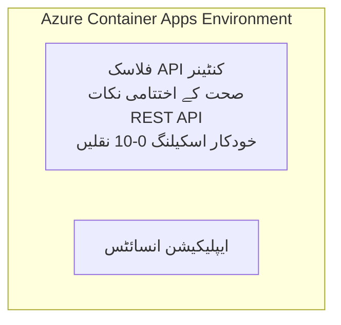

# سادہ Flask API - کنٹینر ایپ کی مثال

**سیکھنے کا راستہ:** ابتدائی ⭐ | **وقت:** 25-35 منٹ | **لاگت:** $0-15/ماہ

ایک مکمل، کام کرنے والا Python Flask REST API جو Azure Container Apps پر Azure Developer CLI (azd) کے ذریعے تعینات کیا گیا ہے۔ یہ مثال کنٹینر کی تعیناتی، آٹو اسکیلنگ، اور مانیٹرنگ کے بنیادی اصولوں کو ظاہر کرتی ہے۔

## 🎯 آپ کیا سیکھیں گے

- Azure پر ایک کنٹینرائزڈ Python ایپلیکیشن کو تعینات کرنا  
- scale-to-zero کے ساتھ آٹو اسکیلنگ کو ترتیب دینا  
- صحت کی جانچ اور تیاری کی پڑتالیں نافذ کرنا  
- ایپلیکیشن کے لاگز اور میٹرکس کی مانیٹرنگ کرنا  
- فوری تعیناتی کے لیے Azure Developer CLI استعمال کرنا  

## 📦 شامل کیا گیا ہے

✅ **Flask ایپلیکیشن** - مکمل REST API CRUD آپریشنز کے ساتھ (`src/app.py`)  
✅ **Dockerfile** - پروڈکشن کے لیے تیار کنٹینر کنفیگریشن  
✅ **Bicep انفراسٹرکچر** - کنٹینر ایپس کا ماحول اور API کی تعیناتی  
✅ **AZD کنفیگریشن** - ایک کمانڈ سے تعیناتی کی ترتیب  
✅ **ہیلتھ پروبز** - لائیونیسیس اور ریڈینیس چیکس ترتیب شدہ  
✅ **آٹو اسکیلنگ** - HTTP لوڈ کی بنیاد پر 0-10 ریپلیکا  

## فن تعمیر



## ضروریات

### ضروری
- **Azure Developer CLI (azd)** - [انسٹال کرنے کی گائیڈ](https://learn.microsoft.com/azure/developer/azure-developer-cli/install-azd)  
- **Azure سبسکرپشن** - [مفت اکاؤنٹ](https://azure.microsoft.com/free/)  
- **Docker Desktop** - [ڈوکر انسٹال کریں](https://www.docker.com/products/docker-desktop/) (مقامی ٹیسٹنگ کے لیے)  

### ضروریات کی تصدیق کریں

```bash
# ایزد ورژن چیک کریں (ضرورت ہے 1.5.0 یا اس سے زیادہ)
azd version

# ایژر لاگ ان کی تصدیق کریں
azd auth login

# ڈاکر چیک کریں (اختیاری، مقامی ٹیسٹنگ کے لیے)
docker --version
```

## ⏱️ تعیناتی کا وقت

| مرحلہ | دورانیہ | کیا ہوتا ہے |
|-------|----------|--------------|
| ماحول کی تیاری | 30 سیکنڈز | azd ماحول بنائیں |
| کنٹینر بنائیں | 2-3 منٹ | Flask ایپ کے لیے Docker build |
| انفراسٹرکچر دستیاب کریں | 3-5 منٹ | کنٹینر ایپس، ریجسٹری، مانیٹرنگ بنائیں |
| ایپلیکیشن تعینات کریں | 2-3 منٹ | امیج پش کریں اور کنٹینر ایپس پر تعینات کریں |
| **کل** | **8-12 منٹ** | مکمل تعیناتی تیار |

## جلدی آغاز

```bash
# مثال پر جائیں
cd examples/container-app/simple-flask-api

# ماحول کی ابتدا کریں (منفرد نام منتخب کریں)
azd env new myflaskapi

# سب کچھ تعینات کریں (انفراسٹرکچر + درخواست)
azd up
# آپ سے کہا جائے گا کہ:
# 1. Azure سبسکرپشن منتخب کریں
# 2. مقام منتخب کریں (مثلاً، eastus2)
# 3. تعیناتی کے لیے 8-12 منٹ انتظار کریں

# اپنا API اینڈپوائنٹ حاصل کریں
azd env get-values

# API کی جانچ کریں
curl $(azd env get-value API_ENDPOINT)/health
```

**متوقع نتائج:**  
```json
{
  "status": "healthy",
  "timestamp": "2025-11-19T10:30:00Z",
  "service": "simple-flask-api",
  "version": "1.0.0"
}
```

## ✅ تعیناتی کی تصدیق کریں

### مرحلہ 1: تعیناتی کی حالت چیک کریں

```bash
# نافذ شدہ خدمات کو دیکھیں
azd show

# متوقع نتیجہ دکھاتا ہے:
# - سروس: api
# - اینڈ پوائنٹ: https://ca-api-[env].xxx.azurecontainerapps.io
# - حیثیت: چل رہا ہے
```

### مرحلہ 2: API اینڈ پوائنٹس کی جانچ کریں

```bash
# حاصل کریں API کا نقطہ انتہا
API_URL=$(azd env get-value API_ENDPOINT)

# صحت کا تجربہ کریں
curl $API_URL/health

# جڑ نقطہ انتہا کا تجربہ کریں
curl $API_URL/

# ایک آئٹم بنائیں
curl -X POST $API_URL/api/items \
  -H "Content-Type: application/json" \
  -d '{"name": "Test Item", "description": "My first item"}'

# تمام آئٹمز حاصل کریں
curl $API_URL/api/items
```

**کامیابی کے معیار:**  
- ✅ ہیلتھ اینڈ پوائنٹ HTTP 200 لوٹاتا ہے  
- ✅ روٹ اینڈ پوائنٹ API معلومات دکھاتا ہے  
- ✅ POST آئٹم بناتا ہے اور HTTP 201 لوٹاتا ہے  
- ✅ GET بنائے گئے آئٹمز لوٹاتا ہے  

### مرحلہ 3: لاگز دیکھیں

```bash
# azd monitor استعمال کرتے ہوئے لائیو لاگز اسٹریم کریں
azd monitor --logs

# یا Azure CLI استعمال کریں:
az containerapp logs show --name api --resource-group $RG_NAME --follow

# آپ کو یہ نظر آنا چاہیے:
# - Gunicorn کے آغاز کے پیغامات
# - HTTP درخواست کے لاگز
# - ایپلیکیشن کی معلومات کے لاگز
```

## پروجیکٹ کی ساخت

```
simple-flask-api/
├── azure.yaml              # AZD configuration
├── infra/
│   ├── main.bicep         # Main infrastructure
│   ├── main.parameters.json
│   └── app/
│       ├── container-env.bicep
│       └── api.bicep
└── src/
    ├── app.py             # Flask application
    ├── requirements.txt
    └── Dockerfile
```

## API اینڈ پوائنٹس

| اینڈ پوائنٹ | طریقہ | وضاحت |
|-------------|--------|--------|
| `/health` | GET | صحت کی جانچ |
| `/api/items` | GET | تمام آئٹمز کی فہرست |
| `/api/items` | POST | نیا آئٹم بنائیں |
| `/api/items/{id}` | GET | مخصوص آئٹم حاصل کریں |
| `/api/items/{id}` | PUT | آئٹم کو اپ ڈیٹ کریں |
| `/api/items/{id}` | DELETE | آئٹم کو حذف کریں |

## کنفیگریشن

### ماحول کے متغیرات

```bash
# حسب ضرورت کنفیگریشن سیٹ کریں
azd env set PORT 8000
azd env set LOG_LEVEL info
azd env set MAX_REPLICAS 20
```

### اسکیلنگ کی ترتیب

API HTTP ٹریفک کی بنیاد پر خود بخود اسکیل ہوتی ہے:  
- **کم از کم ریپلیکا**: 0 (جب غیر فعال ہو تو صفر تک اسکیل ہوتا ہے)  
- **زیادہ سے زیادہ ریپلیکا**: 10  
- **ہر ریپلیکا پر ہم وقت ساز درخواستیں**: 50  

## ترقی

### مقامی طور پر چلائیں

```bash
# انحصارات نصب کریں
cd src
pip install -r requirements.txt

# ایپ چلائیں
python app.py

# مقامی طور پر آزمائیں
curl http://localhost:8000/health
```

### کنٹینر بنائیں اور ٹیسٹ کریں

```bash
# ڈوکر امیج بنائیں
docker build -t flask-api:local ./src

# کنٹینر کو مقامی طور پر چلائیں
docker run -p 8000:8000 flask-api:local

# کنٹینر کو ٹیسٹ کریں
curl http://localhost:8000/health
```

## تعیناتی

### مکمل تعیناتی

```bash
# انفراسٹرکچر اور ایپلیکیشن کو نافذ کریں
azd up
```

### صرف کوڈ کی تعیناتی

```bash
# صرف ایپلیکیشن کوڈ تعینات کریں (انفراسٹرکچر بغیر تبدیلی کے)
azd deploy api
```

### کنفیگریشن کو اپ ڈیٹ کریں

```bash
# ماحول کی متغیرات کو اپ ڈیٹ کریں
azd env set API_KEY "new-api-key"

# نئی ترتیب کے ساتھ دوبارہ تعینات کریں
azd deploy api
```

## مانیٹرنگ

### لاگز دیکھیں

```bash
# ایزد مانیٹر استعمال کرتے ہوئے لائیو لاگز اسٹریم کریں
azd monitor --logs

# یا کنٹینر ایپس کے لیے ایزور کمانڈ لائن انٹرفیس استعمال کریں:
az containerapp logs show --name api --resource-group $RG_NAME --follow

# آخری 100 لائنیں دیکھیں
az containerapp logs show --name api --resource-group $RG_NAME --tail 100
```

### میٹرکس کی نگرانی کریں

```bash
# آزور مانیٹر ڈیش بورڈ کھولیں
azd monitor --overview

# مخصوص میٹرکس دیکھیں
az monitor metrics list \
  --resource $(azd show --output json | jq -r '.services.api.resourceId') \
  --metric "Requests,ResponseTime"
```

## جانچ

### صحت کی جانچ

```bash
curl $(azd show --output json | jq -r '.services.api.endpoint')/health
```

متوقع جواب:  
```json
{
  "status": "healthy",
  "timestamp": "2025-11-19T10:30:00Z"
}
```

### آئٹم بنائیں

```bash
curl -X POST $(azd show --output json | jq -r '.services.api.endpoint')/api/items \
  -H "Content-Type: application/json" \
  -d '{"name": "Test Item", "description": "A test item"}'
```

### تمام آئٹمز حاصل کریں

```bash
curl $(azd show --output json | jq -r '.services.api.endpoint')/api/items
```

## لاگت کی اصلاح

یہ تعیناتی scale-to-zero کا استعمال کرتی ہے، اس لیے آپ صرف تب ادائیگی کرتے ہیں جب API درخواستیں پروسیس کر رہا ہو:  

- **غیر فعال لاگت**: ~ $0/ماہ (صفر تک اسکیل)  
- **فعال لاگت**: تقریبا $0.000024/سیکنڈ فی ریپلیکا  
- **متوقع ماہانہ لاگت** (ہلکی استعمال کے لیے): 5-15 ڈالر  

### مزید لاگت میں کمی

```bash
# زیادہ سے زیادہ ریپلیکسز کو ڈویلپمنٹ کے لیے کم کریں
azd env set MAX_REPLICAS 3

# کم وقت کا غیر فعال ٹائم آؤٹ استعمال کریں
azd env set SCALE_TO_ZERO_TIMEOUT 300  # ۵ منٹ
```

## مسائل کا حل

### کنٹینر شروع نہیں ہو رہا

```bash
# ایزور CLI کا استعمال کرتے ہوئے کنٹینر کے لوگ چیک کریں
az containerapp logs show --name api --resource-group $RG_NAME --tail 100

# ڈاکر امیج کی مقامی طور پر تعمیر کی تصدیق کریں
docker build -t test ./src
```

### API دستیاب نہیں ہے

```bash
# تصدیق کریں کہ انگریس بیرونی ہے
az containerapp show --name api --resource-group rg-simple-flask-api \
  --query properties.configuration.ingress.external
```

### جواب دینے میں زیادہ وقت لگتا ہے

```bash
# سی پی یو/میموری کے استعمال کو چیک کریں
az monitor metrics list \
  --resource $(azd show --output json | jq -r '.services.api.resourceId') \
  --metric "CPUPercentage,MemoryPercentage"

# اگر ضرورت ہو تو وسائل کو بڑھائیں
az containerapp update --name api --resource-group rg-simple-flask-api \
  --cpu 1.0 --memory 2Gi
```

## صفائی

```bash
# تمام وسائل حذف کریں
azd down --force --purge
```

## اگلے اقدامات

### اس مثال کو بڑھائیں

1. **ڈیٹا بیس شامل کریں** - Azure Cosmos DB یا SQL ڈیٹا بیس انٹیگریٹ کریں  
   ```bash
   # infra/main.bicep میں Cosmos DB ماڈیول شامل کریں
   # database connection کے ساتھ app.py کو اپ ڈیٹ کریں
   ```

2. **توثیق شامل کریں** - Microsoft Entra ID یا API keys نافذ کریں  
   ```python
   # app.py میں توثیق کا مڈل ویئر شامل کریں
   from functools import wraps
   ```

3. **CI/CD ترتیب دیں** - GitHub Actions ورک فلو  
   ```yaml
   # Create .github/workflows/deploy.yml
   name: Deploy to Azure
   on: [push]
   ```

4. **مینجڈ شناخت شامل کریں** - Azure خدمات تک محفوظ رسائی  
   ```bicep
   # Update infra/app/api.bicep
   identity: { type: 'SystemAssigned' }
   ```

### متعلقہ مثالیں

- **[Database App](../../../../../examples/database-app)** - SQL ڈیٹا بیس کے ساتھ مکمل مثال  
- **[Microservices](../../../../../examples/container-app/microservices)** - کثیر سروس فن تعمیر  
- **[Container Apps Master Guide](../README.md)** - تمام کنٹینر پیٹرن  

### سیکھنے کے وسائل

- 📚 [ابتدائیوں کے لیے AZD کورس](../../../README.md) - مرکزی کورس کا ہوم  
- 📚 [کنٹینر ایپس کے پیٹرن](../README.md) - مزید تعیناتی کے پیٹرن  
- 📚 [AZD ٹیمپلیٹس گیلری](https://azure.github.io/awesome-azd/) - کمیونٹی ٹیمپلیٹس  

## اضافی وسائل

### دستاویزات  
- **[Flask کی دستاویزات](https://flask.palletsprojects.com/)** - Flask فریم ورک گائیڈ  
- **[Azure Container Apps](https://learn.microsoft.com/azure/container-apps/)** - آفیشل Azure ڈاکیومنٹس  
- **[Azure Developer CLI](https://learn.microsoft.com/azure/developer/azure-developer-cli/)** - azd کمانڈ ریفرنس  

### ٹیوٹوریلز  
- **[کنٹینر ایپس کا جلد آغاز](https://learn.microsoft.com/azure/container-apps/quickstart-portal)** - اپنی پہلی ایپ تعینات کریں  
- **[Azure پر Python](https://learn.microsoft.com/azure/developer/python/)** - Python ترقیاتی گائیڈ  
- **[Bicep زبان](https://learn.microsoft.com/azure/azure-resource-manager/bicep/)** - انفراسٹرکچر ایز کوڈ  

### آلات  
- **[Azure پورٹل](https://portal.azure.com)** - وسائل کو بصری طور پر منظم کریں  
- **[VS Code Azure ایکسٹینشن](https://marketplace.visualstudio.com/items?itemName=ms-azuretools.vscode-azurecontainerapps)** - IDE انٹیگریشن  

---

**🎉 مبارک ہو!** آپ نے Azure Container Apps پر خودکار اسکیلنگ اور مانیٹرنگ کے ساتھ پروڈکشن کے لیے تیار Flask API تعینات کر دی ہے۔

**سوالات؟** [مسئلہ کھولیں](https://github.com/microsoft/AZD-for-beginners/issues) یا [FAQ](../../../resources/faq.md) چیک کریں۔

---

<!-- CO-OP TRANSLATOR DISCLAIMER START -->
**ڈس کلیمر**:
یہ دستاویز AI ترجمہ سروس [Co-op Translator](https://github.com/Azure/co-op-translator) کے ذریعے ترجمہ کی گئی ہے۔ جبکہ ہم درستگی کے لیے کوشاں ہیں، براہ کرم اس بات سے آگاہ رہیں کہ خودکار ترجمے میں غلطیاں یا عدم درستیاں ہو سکتی ہیں۔ اصل دستاویز اپنے مادری زبان میں مستند ماخذ سمجھی جائے گی۔ حساس معلومات کے لیے پیشہ ور انسانی ترجمہ کی سفارش کی جاتی ہے۔ اس ترجمے کے استعمال سے پیدا ہونے والی کسی بھی غلط فہمی یا غلط تشریح کی ذمہ داری ہم قبول نہیں کرتے۔
<!-- CO-OP TRANSLATOR DISCLAIMER END -->