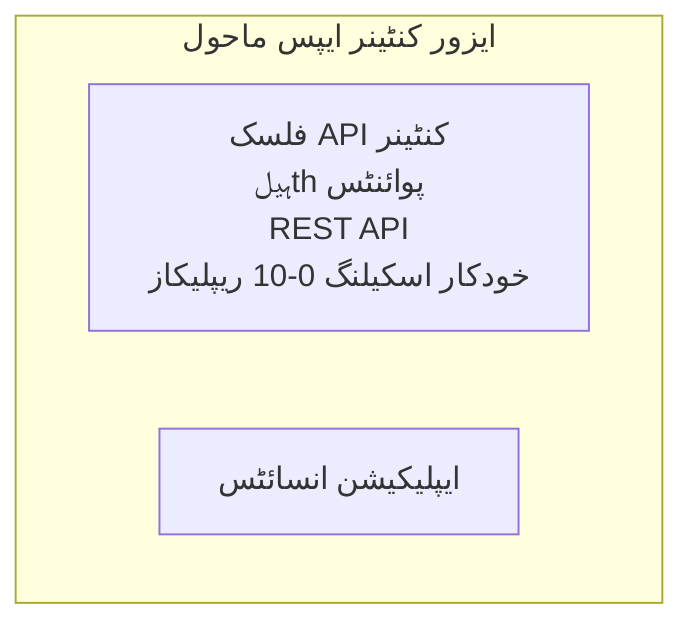

# سادہ فلاسک API - کنٹینر ایپ کی مثال

**سیکھنے کا راستہ:** ابتدائی ⭐ | **وقت:** 25-35 منٹ | **لاگت:** $0-15/ماہ

ایک مکمل، چلنے والا پائتھن فلاسک REST API جو Azure Container Apps میں Azure Developer CLI (azd) کا استعمال کرتے ہوئے تعینات کیا گیا ہے۔ یہ مثال کنٹینر تعیناتی، خودکار اسکیلنگ، اور مانیٹرنگ کی بنیادی باتیں ظاہر کرتی ہے۔

## 🎯 آپ کیا سیکھیں گے

- Azure پر کنٹینرائزڈ پائتھن ایپلیکیشن کی تعیناتی  
- اسکیل ٹو زیرو کے ساتھ خودکار اسکیلنگ کی ترتیب  
- ہیلتھ پروب اور ریڈینیس چیکس کا نفاذ  
- ایپلیکیشن کے لاگز اور میٹرکس کی نگرانی  
- تیز تعیناتی کے لیے Azure Developer CLI کا استعمال  

## 📦 شامل کیا گیا ہے

✅ **فلاسک ایپلیکیشن** - مکمل REST API کے ساتھ CRUD آپریشنز (`src/app.py`)  
✅ **ڈوکر فائل** - پروڈکشن کے لیے تیار کنٹینر کنفیگریشن  
✅ **بائسپس انفراسٹرکچر** - کنٹینر ایپس کا ماحول اور API تعیناتی  
✅ **AZD کنفیگریشن** - ایک کمانڈ پر تعیناتی کا سیٹ اپ  
✅ **ہیلتھ پروب** - لائیونس اور ریڈینیس چیکس ترتیب دی گئی ہیں  
✅ **خودکار اسکیلنگ** - HTTP لوڈ کی بنیاد پر 0-10 ریپلیکیاز  

## فن تعمیر


## ضروریات

### درکار
- **Azure Developer CLI (azd)** - [انسٹال گائیڈ](https://learn.microsoft.com/azure/developer/azure-developer-cli/install-azd)
- **Azure سبسکرپشن** - [مفت اکاؤنٹ](https://azure.microsoft.com/free/)
- **ڈوکر ڈیسک ٹاپ** - [ڈوکر انسٹال کریں](https://www.docker.com/products/docker-desktop/) (لوکل ٹیسٹنگ کے لئے)

### ضروریات کی تصدیق کریں

```bash
# ایزد ورژن چیک کریں (1.5.0 یا اس سے اوپر درکار ہے)
azd version

# Azure لاگ ان کی تصدیق کریں
azd auth login

# Docker چیک کریں (اختیاری، مقامی جانچ کے لیے)
docker --version
```

## ⏱️ تعیناتی کا وقت

| مرحلہ | دورانیہ | کیا ہوتا ہے |
|-------|----------|--------------||
| ماحول کی ترتیب | 30 سیکنڈ | azd ماحول بنائیں |
| کنٹینر تعمیر کریں | 2-3 منٹ | فلاسک ایپ کی ڈوکر بلڈنگ |
| انفراسٹرکچر فراہم کریں | 3-5 منٹ | کنٹینر ایپس، رجسٹری، مانیٹرنگ بنائیں |
| ایپلیکیشن تعینات کریں | 2-3 منٹ | تصویر پش کریں اور کنٹینر ایپس پر تعینات کریں |
| **کل** | **8-12 منٹ** | مکمل تعیناتی تیار ہے |

## فوری آغاز

```bash
# مثال پر جائیں
cd examples/container-app/simple-flask-api

# ماحول کو شروع کریں (منفرد نام منتخب کریں)
azd env new myflaskapi

# سب کچھ تعینات کریں (انفراسٹرکچر + ایپلیکیشن)
azd up
# آپ سے پوچھا جائے گا:
# 1. Azure سبسکرپشن منتخب کریں
# 2. مقام منتخب کریں (مثلاً eastus2)
# 3. تعیناتی کے لیے 8-12 منٹ انتظار کریں

# اپنا API اینڈپوائنٹ حاصل کریں
azd env get-values

# API کی جانچ کریں
curl $(azd env get-value API_ENDPOINT)/health
```

**متوقع آؤٹ پٹ:**
```json
{
  "status": "healthy",
  "timestamp": "2025-11-19T10:30:00Z",
  "service": "simple-flask-api",
  "version": "1.0.0"
}
```

## ✅ تعیناتی کی تصدیق کریں

### مرحلہ 1: تعیناتی کی صورتحال چیک کریں

```bash
# تعینات شدہ خدمات دیکھیں
azd show

# متوقع نتیجہ دکھاتا ہے:
# - خدمت: api
# - اینڈ پوائنٹ: https://ca-api-[env].xxx.azurecontainerapps.io
# - حیثیت: چل رہا ہے
```

### مرحلہ 2: API اینڈ پوائنٹس کی جانچ کریں

```bash
# حاصل کریں API اینڈ پوائنٹ
API_URL=$(azd env get-value API_ENDPOINT)

# صحت کا ٹیسٹ
curl $API_URL/health

# روٹ اینڈ پوائنٹ کا ٹیسٹ کریں
curl $API_URL/

# ایک چیز بنائیں
curl -X POST $API_URL/api/items \
  -H "Content-Type: application/json" \
  -d '{"name": "Test Item", "description": "My first item"}'

# تمام اشیاء حاصل کریں
curl $API_URL/api/items
```

**کامیابی کے معیار:**
- ✅ ہیلتھ اینڈ پوائنٹ HTTP 200 لوٹاتا ہے  
- ✅ روٹ اینڈ پوائنٹ API معلومات دکھاتا ہے  
- ✅ POST آئٹم بناتا ہے اور HTTP 201 لوٹاتا ہے  
- ✅ GET بنائے گئے آئٹمز لوٹاتا ہے  

### مرحلہ 3: لاگز دیکھیں

```bash
# از ڈی مانیٹر کا استعمال کرتے ہوئے براہ راست لاگز دیکھیں
azd monitor --logs

# یا Azure CLI استعمال کریں:
az containerapp logs show --name api --resource-group $RG_NAME --follow

# آپ کو یہ نظر آنا چاہیے:
# - گنیکورن کے اسٹارٹ اپ پیغامات
# - HTTP درخواستوں کے لاگز
# - ایپلیکیشن کی معلومات کے لاگز
```

## پروجیکٹ کی ساخت

```
simple-flask-api/
├── azure.yaml              # AZD configuration
├── infra/
│   ├── main.bicep         # Main infrastructure
│   ├── main.parameters.json
│   └── app/
│       ├── container-env.bicep
│       └── api.bicep
└── src/
    ├── app.py             # Flask application
    ├── requirements.txt
    └── Dockerfile
```

## API اینڈ پوائنٹس

| اینڈ پوائنٹ | طریقہ کار | وضاحت |
|----------|--------|-------------|
| `/health` | GET | صحت کی جانچ |
| `/api/items` | GET | تمام آئٹمز کی فہرست |
| `/api/items` | POST | نیا آئٹم بنائیں |
| `/api/items/{id}` | GET | مخصوص آئٹم حاصل کریں |
| `/api/items/{id}` | PUT | آئٹم کو اپ ڈیٹ کریں |
| `/api/items/{id}` | DELETE | آئٹم کو حذف کریں |

## کنفیگریشن

### ماحول کے متغیرات

```bash
# اپنی مرضی کی ترتیبات سیٹ کریں
azd env set PORT 8000
azd env set LOG_LEVEL info
azd env set MAX_REPLICAS 20
```

### اسکیلنگ کنفیگریشن

API HTTP ٹریفک کی بنیاد پر خود بخود اسکیل ہوتی ہے:  
- **کم از کم ریپلیکاز:** 0 (جب بے کار ہو تو زیرو تک اسکیل ہوتی ہے)  
- **زیادہ سے زیادہ ریپلیکاز:** 10  
- **ہر ریپلیکا پر متوازی درخواستیں:** 50

## ترقی

### لوکل چلائیں

```bash
# انحصار انسٹال کریں
cd src
pip install -r requirements.txt

# ایپ چلائیں
python app.py

# مقامی طور پر جانچ کریں
curl http://localhost:8000/health
```

### کنٹینر کی تعمیر اور جانچ

```bash
# ڈاکر امیج بنائیں
docker build -t flask-api:local ./src

# کنٹینر کو مقامی طور پر چلائیں
docker run -p 8000:8000 flask-api:local

# کنٹینر کا معائنہ کریں
curl http://localhost:8000/health
```

## تعیناتی

### مکمل تعیناتی

```bash
# انفراسٹرکچر اور ایپلیکیشن تعینات کریں
azd up
```

### صرف کوڈ کی تعیناتی

```bash
# صرف ایپلیکیشن کوڈ تعینات کریں (انفراسٹرکچر بغیر تبدیلی کے)
azd deploy api
```

### کنفیگریشن کو اپ ڈیٹ کریں

```bash
# ماحول کے متغیرات کو اپ ڈیٹ کریں
azd env set API_KEY "new-api-key"

# نئی ترتیب کے ساتھ دوبارہ تعینات کریں
azd deploy api
```

## مانیٹرنگ

### لاگز دیکھیں

```bash
# ایذ مانیٹر استعمال کرتے ہوئے لائیو لوگز سٹریم کریں
azd monitor --logs

# یا کنٹینر ایپس کے لیے ایزور کمانڈ لائن انٹرفیس استعمال کریں:
az containerapp logs show --name api --resource-group $RG_NAME --follow

# آخری 100 لائنیں دیکھیں
az containerapp logs show --name api --resource-group $RG_NAME --tail 100
```

### میٹرکس کی نگرانی کریں

```bash
# ایزور مانیٹر ڈیش بورڈ کھولیں
azd monitor --overview

# مخصوص میٹرکس دیکھیں
az monitor metrics list \
  --resource $(azd show --output json | jq -r '.services.api.resourceId') \
  --metric "Requests,ResponseTime"
```

## جانچ

### صحت کی جانچ

```bash
curl $(azd show --output json | jq -r '.services.api.endpoint')/health
```

متوقع جواب:  
```json
{
  "status": "healthy",
  "timestamp": "2025-11-19T10:30:00Z"
}
```

### آئٹم بنائیں

```bash
curl -X POST $(azd show --output json | jq -r '.services.api.endpoint')/api/items \
  -H "Content-Type: application/json" \
  -d '{"name": "Test Item", "description": "A test item"}'
```

### تمام آئٹمز حاصل کریں

```bash
curl $(azd show --output json | jq -r '.services.api.endpoint')/api/items
```

## لاگت کی بہتری

یہ تعیناتی اسکیل ٹو زیرو کا استعمال کرتی ہے، اس لیے آپ صرف اس وقت ادائیگی کریں جب API درخواستیں پراسیس کر رہی ہو:

- **بے کار لاگت:** تقریباً $0/ماہ (زیرو تک اسکیل)  
- **فعال لاگت:** تقریباً $0.000024/سیکنڈ فی ریپلیکا  
- **متوقع ماہانہ لاگت** (ہلکی استعمال کی صورت میں): $5-15

### لاگت مزید کم کریں

```bash
# ترقی کے لیے زیادہ سے زیادہ نقول کم کریں
azd env set MAX_REPLICAS 3

# کم وقفے کا وقت استعمال کریں
azd env set SCALE_TO_ZERO_TIMEOUT 300  # 5 منٹ
```

## مسائل کا حل

### کنٹینر شروع نہیں ہوتا

```bash
# Azure CLI کا استعمال کرتے ہوئے کنٹینر لاگز چیک کریں
az containerapp logs show --name api --resource-group $RG_NAME --tail 100

# Docker امیج کی مقامی طور پر تعمیر کی پڑتال کریں
docker build -t test ./src
```

### API دستیاب نہیں ہے

```bash
# تصدیق کریں کہ داخلہ بیرونی ہے
az containerapp show --name api --resource-group rg-simple-flask-api \
  --query properties.configuration.ingress.external
```

### زیادہ جوابی اوقات

```bash
# سی پی یو/میموری کے استعمال کو چیک کریں
az monitor metrics list \
  --resource $(azd show --output json | jq -r '.services.api.resourceId') \
  --metric "CPUPercentage,MemoryPercentage"

# اگر ضرورت ہو تو وسائل کو بڑھائیں
az containerapp update --name api --resource-group rg-simple-flask-api \
  --cpu 1.0 --memory 2Gi
```

## صفائی

```bash
# تمام وسائل کو حذف کریں
azd down --force --purge
```

## اگلے اقدامات

### اس مثال کو بڑھائیں

1. **ڈیٹا بیس شامل کریں** - Azure Cosmos DB یا SQL Database انٹیگریٹ کریں  
   ```bash
   # انفراسٹرکچر/مین.bicep میں کاسموس DB ماڈیول شامل کریں
   # ڈیٹا بیس کنکشن کے ساتھ app.py کو اپ ڈیٹ کریں
   ```

2. **تصدیق شامل کریں** - Azure AD یا API کیز نافذ کریں  
   ```python
   # app.py میں تصدیق کا درمیانی سوفٹ ویئر شامل کریں
   from functools import wraps
   ```

3. **CI/CD سیٹ اپ کریں** - GitHub Actions ورک فلو  
   ```yaml
   # Create .github/workflows/deploy.yml
   name: Deploy to Azure
   on: [push]
   ```

4. **مینجڈ آئیڈینٹی شامل کریں** - Azure سروسز تک محفوظ رسائی  
   ```bicep
   # Update infra/app/api.bicep
   identity: { type: 'SystemAssigned' }
   ```

### متعلقہ مثالیں

- **[ڈیٹا بیس ایپ](../../../../../examples/database-app)** - SQL ڈیٹا بیس کے ساتھ مکمل مثال  
- **[مائیکروسروسز](../../../../../examples/container-app/microservices)** - کثیرالسروس فن تعمیر  
- **[کنٹینر ایپس ماسٹر گائیڈ](../README.md)** - تمام کنٹینر پیٹرنز  

### سیکھنے کے وسائل

- 📚 [AZD برائے ابتدائی کورس](../../../README.md) - مرکزی کورس ہوم  
- 📚 [کنٹینر ایپس پیٹرنز](../README.md) - مزید تعیناتی کے پیٹرن  
- 📚 [AZD ٹیمپلیٹس گیلری](https://azure.github.io/awesome-azd/) - کمیونٹی ٹیمپلیٹس  

## اضافی وسائل

### دستاویزات
- **[فلاسک دستاویزات](https://flask.palletsprojects.com/)** - فلاسک فریم ورک گائیڈ  
- **[Azure کنٹینر ایپس](https://learn.microsoft.com/azure/container-apps/)** - آفیشل Azure دستاویزات  
- **[Azure Developer CLI](https://learn.microsoft.com/azure/developer/azure-developer-cli/)** - azd کمانڈ ریفرنس  

### سبق
- **[کنٹینر ایپس کوئیک اسٹارٹ](https://learn.microsoft.com/azure/container-apps/quickstart-portal)** - اپنی پہلی ایپ تعینات کریں  
- **[Azure پر پائتھن](https://learn.microsoft.com/azure/developer/python/)** - پائتھن ترقیاتی رہنما  
- **[بائسپس زبان](https://learn.microsoft.com/azure/azure-resource-manager/bicep/)** - انفراسٹرکچر ایز کوڈ  

### اوزار
- **[Azure پورٹل](https://portal.azure.com)** - بصری طور پر وسائل کا انتظام  
- **[VS کوڈ Azure ایکسٹینشن](https://marketplace.visualstudio.com/items?itemName=ms-azuretools.vscode-azurecontainerapps)** - IDE انٹیگریشن  

---

**🎉 مبارک ہو!** آپ نے Azure Container Apps پر ایک پروڈکشن-ریڈی فلاسک API کو خودکار اسکیلنگ اور مانیٹرنگ کے ساتھ تعینات کر دیا ہے۔

**سوالات؟** [ایک ایشو کھولیں](https://github.com/microsoft/AZD-for-beginners/issues) یا [FAQ](../../../resources/faq.md) چیک کریں۔

---

<!-- CO-OP TRANSLATOR DISCLAIMER START -->
**خاکہ دستبرداری**:  
اس دستاویز کا ترجمہ AI ترجمہ سروس [Co-op Translator](https://github.com/Azure/co-op-translator) کا استعمال کرتے ہوئے کیا گیا ہے۔ اگرچہ ہم درستگی کی کوشش کرتے ہیں، براہ کرم آگاہ رہیں کہ خودکار ترجموں میں غلطیاں یا عدم دقیقیت ہو سکتی ہے۔ اصل دستاویز اپنی مادری زبان میں معتبر ماخذ سمجھی جائے۔ اہم معلومات کے لیے پیشہ ور انسانی ترجمہ تجویز کیا جاتا ہے۔ ہم اس ترجمے کے استعمال سے پیدا ہونے والی کسی بھی غلط فہمی یا غلط تعبیر کے ذمہ دار نہیں ہیں۔
<!-- CO-OP TRANSLATOR DISCLAIMER END -->