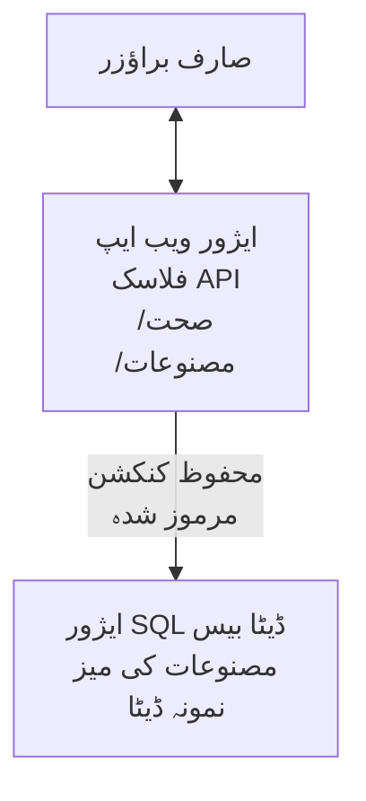

# AZD کے ساتھ Microsoft SQL ڈیٹا بیس اور ویب ایپ تعینات کرنا

⏱️ **تخمینی وقت**: 20-30 منٹ | 💰 **تخمینی لاگت**: ~15-25 ڈالر/ماہ | ⭐ **پیچیدگی**: درمیانہ

یہ **مکمل، عملی مثال** دکھاتی ہے کہ [Azure Developer CLI (azd)](https://learn.microsoft.com/azure/developer/azure-developer-cli/) کو استعمال کرتے ہوئے Python Flask ویب ایپلیکیشن کو Microsoft SQL ڈیٹا بیس کے ساتھ Azure پر کیسے تعینات کیا جائے۔ تمام کوڈ شامل اور ٹیسٹ شدہ ہے—کوئی بیرونی انحصار درکار نہیں۔

## آپ کیا سیکھیں گے

اس مثال کو مکمل کرکے، آپ:
- انفراسٹرکچر-ایز-کوڈ کے ذریعے ملٹی-ٹیر ایپلیکیشن (ویب ایپ + ڈیٹا بیس) تعینات کریں گے
- سیکریٹس کو ہارڈ کوڈ کیے بغیر محفوظ ڈیٹا بیس کنیکشنز ترتیب دیں گے
- Application Insights کے ذریعے ایپلیکیشن کی صحت مانیٹر کریں گے
- AZD CLI سے Azure وسائل کا مؤثر انتظام کریں گے
- سیکورٹی، لاگت کی بچت، اور مشاہداتی میں Azure کی بہترین مشقوں پر عمل کریں گے

## منظرنامہ کا جائزہ
- **ویب ایپ**: Python Flask REST API جس میں ڈیٹا بیس کنیکٹیویٹی ہے
- **ڈیٹا بیس**: Azure SQL ڈیٹا بیس جس میں نمونہ ڈیٹا ہے
- **انفراسٹرکچر**: Bicep (ماڈیولر، دوبارہ استعمال کے قابل ٹیمپلیٹس) سے فراہم کی گئی
- **تعیناتی**: `azd` کمانڈز کے ذریعے مکمل خودکار
- **مانیٹرنگ**: لاگز اور ٹیلیمیٹری کے لیے Application Insights

## ضروریات

### درکار ٹولز

شروع کرنے سے پہلے تصدیق کریں کہ آپ کے پاس یہ ٹولز نصب ہیں:

1. **[Azure CLI](https://learn.microsoft.com/cli/azure/install-azure-cli)** (ورژن 2.50.0 یا اس سے زیادہ)
   ```sh
   az --version
   # متوقع نتیجہ: azure-cli 2.50.0 یا اس سے زیادہ
   ```

2. **[Azure Developer CLI (azd)](https://learn.microsoft.com/azure/developer/azure-developer-cli/install-azd)** (ورژن 1.0.0 یا اس سے زیادہ)
   ```sh
   azd version
   # متوقع نتیجہ: azd ورژن 1.0.0 یا اس سے اوپر
   ```

3. **[Python 3.8+](https://www.python.org/downloads/)** (مقامی ترقی کے لیے)
   ```sh
   python --version
   # متوقع نتیجہ: پائتھن 3.8 یا اس سے اعلیٰ
   ```

4. **[Docker](https://www.docker.com/get-started)** (اختیاری، مقامی کنٹینرائزڈ ترقی کے لیے)
   ```sh
   docker --version
   # متوقع نتیجہ: ڈوکر ورژن 20.10 یا اس سے زیادہ
   ```

### Azure کی ضروریات

- ایک فعال **Azure سبسکرپشن** ([مفت اکاؤنٹ بنائیں](https://azure.microsoft.com/free/))
- آپ کی سبسکرپشن میں وسائل بنانے کی اجازت
- سبسکرپشن یا ریسورس گروپ پر **مالک** یا **کنٹریبیوٹر** کا کردار

### معلومات کی بنیادیات

یہ ایک **درمیانہ سطح** کی مثال ہے۔ آپ کو درج ذیل کا علم ہونا چاہیے:
- بنیادی کمانڈ لائن آپریشنز
- کلاؤڈ کے بنیادی تصورات (ریسورسز، ریسورس گروپس)
- ویب ایپس اور ڈیٹا بیسز کی بنیادی سمجھ

**AZD کے لیے نیا؟** پہلے [Getting Started گائیڈ](../../docs/chapter-01-foundation/azd-basics.md) سے آغاز کریں۔

## فن تعمیر

یہ مثال دو-ٹیر فن تعمیر تعینات کرتی ہے جس میں ویب ایپ اور SQL ڈیٹا بیس شامل ہیں:



**ریسورس تعیناتی:**
- **ریسورس گروپ**: تمام وسائل کا کنٹینر
- **ایپ سروس پلان**: Linux پر مبنی ہوسٹنگ (B1 ٹئیر لاگت مؤثر)
- **ویب ایپ**: Python 3.11 رن ٹائم کے ساتھ Flask ایپلیکیشن
- **SQL سرور**: منیجڈ ڈیٹا بیس سرور جس میں TLS 1.2 کم از کم ہے
- **SQL ڈیٹا بیس**: بیسک ٹئیر (2GB، ترقی/ٹیسٹ کے لئے موزوں)
- **Application Insights**: مانیٹرنگ اور لاگنگ
- **Log Analytics ورک اسپیس**: مرکزی لاگ اسٹوریج

**تشبیہ**: اسے ایک ریستوران سمجھیں (ویب ایپ) جس کے پاس ایک واک-ان فریزر (ڈیٹا بیس) ہے۔ صارفین مینو (API endpoints) سے آرڈر کرتے ہیں، اور کچن (Flask ایپ) فریزر سے اجزاء (ڈیٹا) حاصل کرتا ہے۔ ریستوران کا مینیجر (Application Insights) ہر واقعہ پر نظر رکھتا ہے۔

## فولڈر کی ساخت

تمام فائلیں اس مثال میں شامل ہیں—کوئی بیرونی انحصار درکار نہیں:

```
examples/database-app/
│
├── README.md                    # This file
├── azure.yaml                   # AZD configuration file
├── .env.sample                  # Sample environment variables
├── .gitignore                   # Git ignore patterns
│
├── infra/                       # Infrastructure as Code (Bicep)
│   ├── main.bicep              # Main orchestration template
│   ├── abbreviations.json      # Azure naming conventions
│   └── resources/              # Modular resource templates
│       ├── sql-server.bicep    # SQL Server configuration
│       ├── sql-database.bicep  # Database configuration
│       ├── app-service-plan.bicep  # Hosting plan
│       ├── app-insights.bicep  # Monitoring setup
│       └── web-app.bicep       # Web application
│
└── src/
    └── web/                    # Application source code
        ├── app.py              # Flask REST API
        ├── requirements.txt    # Python dependencies
        └── Dockerfile          # Container definition
```

**ہر فائل کا کام:**
- **azure.yaml**: AZD کو بتاتا ہے کہ کیا اور کہاں تعینات کرنا ہے
- **infra/main.bicep**: تمام Azure وسائل کی نظم و نسق کرتا ہے
- **infra/resources/*.bicep**: انفرادی ریسورس کی تعریفیں (دوبارہ استعمال کے لیے ماڈیولر)
- **src/web/app.py**: Flask ایپلیکیشن جس میں ڈیٹا بیس منطق ہے
- **requirements.txt**: Python پیکج انحصار
- **Dockerfile**: تعیناتی کے لیے کنٹینرائزیشن ہدایات

## فوری آغاز (قدم بہ قدم)

### قدم 1: کلون کریں اور نیویگیٹ کریں

```sh
git clone https://github.com/microsoft/AZD-for-beginners.git
cd AZD-for-beginners/examples/database-app
```

**✓ کامیابی کی جانچ**: تصدیق کریں کہ آپ کو `azure.yaml` اور `infra/` فولڈر نظر آ رہا ہو:
```sh
ls
# متوقع: README.md, azure.yaml, infra/, src/
```

### قدم 2: Azure کے ساتھ توثیق کریں

```sh
azd auth login
```

یہ Azure کی توثیق کے لیے آپ کا براؤزر کھولتا ہے۔ اپنے Azure اسناد کے ساتھ لاگ ان کریں۔

**✓ کامیابی کی جانچ**: آپ کو یہ دیکھنا چاہیے:
```
Logged in to Azure.
```

### قدم 3: ماحولیہ کو ابتدائی بنایا جائے

```sh
azd init
```

**کیا ہوتا ہے**: AZD آپ کی تعیناتی کے لیے مقامی کنفیگریشن بناتا ہے۔

**جو پوچھا جائے گا**:
- **ماحول کا نام**: ایک مختصر نام درج کریں (مثلاً `dev`, `myapp`)
- **Azure سبسکرپشن**: فہرست سے اپنی سبسکرپشن منتخب کریں
- **Azure مقام**: کوئی علاقہ منتخب کریں (مثلاً `eastus`, `westeurope`)

**✓ کامیابی کی جانچ**: آپ کو یہ دیکھنا چاہیے:
```
SUCCESS: New project initialized!
```

### قدم 4: Azure وسائل فراہم کریں

```sh
azd provision
```

**کیا ہوتا ہے**: AZD تمام انفراسٹرکچر تعینات کرتا ہے (5-8 منٹ لگ سکتے ہیں):
1. ریسورس گروپ بناتا ہے
2. SQL سرور اور ڈیٹا بیس بناتا ہے
3. ایپ سروس پلان بناتا ہے
4. ویب ایپ بناتا ہے
5. Application Insights بناتا ہے
6. نیٹ ورکنگ اور سیکورٹی کو ترتیب دیتا ہے

**آپ سے پوچھا جائے گا**:
- **SQL ایڈمن صارف نام**: ایک صارف نام درج کریں (مثلاً `sqladmin`)
- **SQL ایڈمن پاسورڈ**: ایک مضبوط پاسورڈ درج کریں (اسے محفوظ کریں!)

**✓ کامیابی کی جانچ**: آپ کو یہ دیکھنا چاہیے:
```
SUCCESS: Your application was provisioned in Azure in X minutes Y seconds.
You can view the resources created under the resource group rg-<env-name> in Azure Portal:
https://portal.azure.com/#@/resource/subscriptions/.../resourceGroups/rg-<env-name>
```

**⏱️ وقت**: 5-8 منٹ

### قدم 5: ایپلیکیشن تعینات کریں

```sh
azd deploy
```

**کیا ہوتا ہے**: AZD آپ کی Flask ایپلیکیشن تیار اور تعینات کرتا ہے:
1. Python ایپلیکیشن پیکج کرتا ہے
2. Docker کنٹینر بناتا ہے
3. Azure ویب ایپ پر پُش کرتا ہے
4. نمونہ ڈیٹا کے ساتھ ڈیٹا بیس کو شروع کرتا ہے
5. ایپلیکیشن کو شروع کرتا ہے

**✓ کامیابی کی جانچ**: آپ کو یہ دیکھنا چاہیے:
```
SUCCESS: Your application was deployed to Azure in X minutes Y seconds.
You can view the resources created under the resource group rg-<env-name> in Azure Portal:
https://portal.azure.com/#@/resource/subscriptions/.../resourceGroups/rg-<env-name>
```

**⏱️ وقت**: 3-5 منٹ

### قدم 6: ایپلیکیشن کو براؤز کریں

```sh
azd browse
```

یہ آپ کی تعینات کردہ ویب ایپ کو براؤزر میں کھولتا ہے `https://app-<unique-id>.azurewebsites.net`

**✓ کامیابی کی جانچ**: آپ کو JSON آؤٹ پٹ دیکھنا چاہیے:
```json
{
  "message": "Welcome to the Database App API",
  "endpoints": {
    "/": "This help message",
    "/health": "Health check endpoint",
    "/products": "List all products",
    "/products/<id>": "Get product by ID"
  }
}
```

### قدم 7: API endpoints کی جانچ کریں

**ہیلتھ چیک** (ڈیٹا بیس کنیکشن کی تصدیق):
```sh
curl https://app-<your-id>.azurewebsites.net/health
```

**متوقع جواب**:
```json
{
  "status": "healthy",
  "database": "connected"
}
```

**پروڈکٹس کی فہرست** (نمونہ ڈیٹا):
```sh
curl https://app-<your-id>.azurewebsites.net/products
```

**متوقع جواب**:
```json
[
  {
    "id": 1,
    "name": "Laptop",
    "description": "High-performance laptop",
    "price": 1299.99,
    "created_at": "2025-11-19T10:30:00"
  },
  ...
]
```

**ایک پروڈکٹ حاصل کریں**:
```sh
curl https://app-<your-id>.azurewebsites.net/products/1
```

**✓ کامیابی کی جانچ**: تمام endpoints JSON ڈیٹا بغیر کسی خطا کے لوٹاتے ہیں۔

---

**🎉 مبارک ہو!** آپ نے کامیابی سے AZD کے ذریعے Azure پر ویب ایپلیکیشن اور ڈیٹا بیس تعینات کر لیا ہے۔

## کنفیگریشن کی گہری سمجھ

### ماحول کے متغیرات

سیکریٹس Azure App Service کنفیگریشن کے ذریعے محفوظ طریقے سے منظم کیے جاتے ہیں—**کبھی سورس کوڈ میں ہارڈکوڈ نہ کریں**۔

**AZD بذات خود ترتیب دیتا ہے**:
- `SQL_CONNECTION_STRING`: ڈیٹا بیس کنکشن جس میں خفیہ کردہ اسناد ہوں
- `APPLICATIONINSIGHTS_CONNECTION_STRING`: مانیٹرنگ ٹیلیمیٹری کا اینڈ پوائنٹ
- `SCM_DO_BUILD_DURING_DEPLOYMENT`: خودکار انحصار کی تنصیب کو فعال کرتا ہے

**سیکریٹس کہاں محفوظ ہوتے ہیں**:
1. `azd provision` کے دوران آپ SQL اسناد سیکور پرامپٹس کے ذریعے دیتے ہیں
2. AZD انہیں آپ کی مقامی `.azure/<env-name>/.env` فائل (git-ignored) میں ذخیرہ کرتا ہے
3. AZD انہیں Azure App Service کنفیگریشن میں داخل کرتا ہے (رہتے ہوئے خفیہ کردہ)
4. ایپلیکیشن انہیں `os.getenv()` کے ذریعے رن ٹائم پر پڑھتی ہے

### مقامی ترقی

مقامی جانچ کے لیے، نمونے سے `.env` فائل بنائیں:

```sh
cp .env.sample .env
# اپنے مقامی ڈیٹا بیس کنکشن کے ساتھ .env کو ایڈٹ کریں
```

**مقامی ترقی ورک فلو**:
```sh
# انحصار انسٹال کریں
cd src/web
pip install -r requirements.txt

# ماحولیاتی متغیرات سیٹ کریں
export SQL_CONNECTION_STRING="your-local-connection-string"

# ایپلیکیشن چلائیں
python app.py
```

**مقامی طور پر ٹیسٹ کریں**:
```sh
curl http://localhost:8000/health
# متوقع: {"status": "healthy", "database": "connected"}
```

### انفراسٹرکچر ایز کوڈ

تمام Azure وسائل **Bicep ٹیمپلیٹس** (`infra/` فولڈر) میں بیان کیے گئے ہیں:

- **ماڈیولر ڈیزائن**: ہر ریسورس کی قسم کی اپنی فائل دوبارہ استعمال کے لئے
- **پیرامیٹرائزڈ**: SKUs, علاقوں، نام طرز کو حسب ضرورت بنائیں
- **بہترین مشقیں**: Azure ناموں کے معیار اور سیکورٹی ڈیفالٹس پر عمل کرتی ہیں
- **ورژن کنٹرولڈ**: انفراسٹرکچر تبدیلیاں Git میں ٹریک ہوتی ہیں

**حسب ضرورت کی مثال**:
ڈیٹا بیس ٹئیر بدلنے کے لیے `infra/resources/sql-database.bicep` میں ترمیم کریں:
```bicep
sku: {
  name: 'Standard'  // Changed from 'Basic'
  tier: 'Standard'
  capacity: 10
}
```

## سیکورٹی کی بہترین مشقیں

یہ مثال Azure سیکورٹی کی بہترین مشقوں کی پیروی کرتی ہے:

### 1. **ماخذ کوڈ میں کوئی سیکریٹس نہیں**
- ✅ اسناد Azure App Service کنفیگریشن میں محفوظ (خفیہ کردہ)
- ✅ `.env` فائل Git میں شامل نہیں (`.gitignore`)
- ✅ پروویژننگ کے دوران سیکور پیرامیٹرز کے ذریعے سیکریٹس منتقل کیے جاتے ہیں

### 2. **خفیہ شدہ کنکشنز**
- ✅ SQL سرور کے لیے TLS 1.2 کم از کم
- ✅ ویب ایپ کے لیے صرف HTTPS فعال
- ✅ ڈیٹا بیس کنکشن خفیہ چینلز استعمال کرتے ہیں

### 3. **نیٹ ورک سیکورٹی**
- ✅ SQL سرور فائر وال صرف Azure خدمات کو اجازت دیتا ہے
- ✅ عوامی نیٹ ورک تک رسائی محدود (نجی اینڈ پوائنٹس کے ذریعے مزید حفاظت ممکن)
- ✅ ویب ایپ پر FTPS معذور

### 4. **توثیق اور اجازت**
- ⚠️ **موجودہ**: SQL توثیق (صارف نام/پاسورڈ)
- ✅ **پیداوار کی تجویز**: Azure Managed Identity کا استعمال کریں بغیر پاسورڈ کے توثیق کے لیے

**Managed Identity میں اپ گریڈ کرنے کے لیے** (پیداوار کے لیے):
1. ویب ایپ پر Managed Identity فعال کریں
2. SQL اجازتیں دی جائیں
3. کنکشن سٹرنگ اپ ڈیٹ کریں Managed Identity کے لیے
4. پاسورڈ بیسڈ توثیق ہٹائیں

### 5. **آڈٹنگ اور مطابقت**
- ✅ Application Insights تمام درخواستیں اور غلطیاں لاگ کرتا ہے
- ✅ SQL ڈیٹا بیس آڈٹنگ فعال ہے (مطابقت کے لیے ترتیب دیا جا سکتا ہے)
- ✅ تمام وسائل حکومت کے مطابق ٹیگ کیے گئے

**پیداوار سے پہلے سیکورٹی چیک لسٹ**:
- [ ] SQL کے لیے Azure Defender فعال کریں
- [ ] SQL ڈیٹا بیس کے لیے پرائیویٹ اینڈپوائنٹس ترتیب دیں
- [ ] ویب ایپلیکیشن فائر وال (WAF) فعال کریں
- [ ] سیکریٹس کے روتیشن کے لیے Azure Key Vault نافذ کریں
- [ ] Microsoft Entra ID توثیق ترتیب دیں
- [ ] تمام وسائل کے لیے تشخیصی لاگنگ فعال کریں

## لاگت کی بچت

**تخمینی ماہانہ اخراجات** (نومبر 2025 کی حیثیت):

| وسیلہ | SKU/ٹئیر | تخمینی لاگت |
|----------|----------|----------------|
| ایپ سروس پلان | B1 (بیسک) | ~13 ڈالر/ماہ |
| SQL ڈیٹا بیس | بیسک (2GB) | ~5 ڈالر/ماہ |
| Application Insights | پی-از-یو-گو | ~2 ڈالر/ماہ (کم ٹریفک) |
| **کل** | | **~20 ڈالر/ماہ** |

**💡 بچت کے ٹپس**:

1. **سیکھنے کے لیے مفت ٹئیر استعمال کریں**:
   - ایپ سروس: F1 ٹئیر (مفت، محدود گھنٹے)
   - SQL ڈیٹا بیس: Azure SQL Database سرورلیس استعمال کریں
   - Application Insights: 5GB/ماہ مفت انجیکشن

2. **استعمال نہ ہونے پر وسائل کو روکیں**:
   ```sh
   # ویب ایپ روکیں (ڈیٹابیس ابھی بھی چارجز لیتا ہے)
   az webapp stop --name <app-name> --resource-group <rg-name>
   
   # ضرورت پر دوبارہ شروع کریں
   az webapp start --name <app-name> --resource-group <rg-name>
   ```

3. **ٹیسٹ کے بعد سب کچھ حذف کریں**:
   ```sh
   azd down
   ```
   یہ تمام وسائل ہٹا دیتا ہے اور چارجز بند کر دیتا ہے۔

4. **ترقی بمقابلہ پیداوار کے SKUs**:
   - **ترقی**: بیسک ٹئیر (اس مثال میں استعمال ہوا)
   - **پیداوار**: معیاری/پریمیم ٹئیر کے ساتھ ریڈنڈنسی

**لاگت کی نگرانی**:
- [Azure Cost Management](https://portal.azure.com/#view/Microsoft_Azure_CostManagement) میں اخراجات دیکھیں
- حیرانی سے بچنے کے لیے لاگت کے الرٹس قائم کریں
- تمام وسائل کو `azd-env-name` کے ساتھ ٹیگ کریں تاکہ ٹریکنگ ہو سکے

**مفت ٹئیر کا متبادل**:
سیکھنے کے لیے، آپ `infra/resources/app-service-plan.bicep` میں ترمیم کر سکتے ہیں:
```bicep
sku: {
  name: 'F1'  // Free tier
  tier: 'Free'
}
```
**نوٹ**: مفت ٹئیر کی حدیں ہیں (60 منٹ/دن CPU، ہمیشہ آن نہیں)

## مانیٹرنگ اور مشاہدہ

### Application Insights انٹیگریشن

یہ مثال واضح مانیٹرنگ کے لیے **Application Insights** شامل کرتی ہے:

**کیا مانیٹر ہوتا ہے**:
- ✅ HTTP درخواستیں (لیٹینسی، اسٹیٹس کوڈز، endpoints)
- ✅ ایپلیکیشن کی غلطیاں اور استثنائات
- ✅ Flask ایپ سے کسٹم لاگنگ
- ✅ ڈیٹا بیس کنکشن کی صحت
- ✅ کارکردگی میٹرکس (CPU, میموری)

**Application Insights تک رسائی**:
1. [Azure Portal](https://portal.azure.com) کھولیں
2. اپنے ریسورس گروپ (`rg-<env-name>`) پر جائیں
3. Application Insights ریسورس (`appi-<unique-id>`) پر کلک کریں

**مفید کوئریز** (Application Insights → Logs):

**تمام درخواستیں دیکھیں**:
```kusto
requests
| where timestamp > ago(1h)
| order by timestamp desc
| project timestamp, name, url, resultCode, duration
```

**غلطیاں تلاش کریں**:
```kusto
exceptions
| where timestamp > ago(24h)
| order by timestamp desc
| project timestamp, type, outerMessage, operation_Name
```

**ہیلتھ اینڈ پوائنٹ چیک کریں**:
```kusto
requests
| where name contains "health"
| summarize count() by resultCode, bin(timestamp, 1h)
```

### SQL ڈیٹا بیس آڈٹنگ

**SQL ڈیٹا بیس کی آڈٹنگ فعال ہے تاکہ یہ معلوم ہو سکے کہ:**
- ڈیٹا بیس تک رسائی کے پیٹرنز
- ناکام لاگ ان کی کوششیں
- اسکیمہ میں تبدیلیاں
- ڈیٹا تک رسائی (مطابقت کے لیے)

**آڈٹ لاگز تک رسائی**:
1. Azure Portal → SQL ڈیٹا بیس → آڈٹنگ
2. Log Analytics ورک اسپیس میں لاگز دیکھیں

### حقیقی وقت مانیٹرنگ

**لائیو میٹرکس دیکھیں**:
1. Application Insights → Live Metrics
2. درخواستیں، ناکامیاں، اور کارکردگی حقیقی وقت میں دیکھیں

**الرٹس سیٹ کریں**:
اہم واقعات کے لیے الرٹس بنائیں:
- HTTP 500 کی غلطیاں > 5 پانچ منٹ میں
- ڈیٹا بیس کنکشن کی ناکامیاں
- زیادہ ردعمل کا وقت (>2 سیکنڈ)

**الرٹ کی مثال تخلیق**:
```sh
az monitor metrics alert create \
  --name "High-Response-Time" \
  --resource-group <rg-name> \
  --scopes <app-insights-resource-id> \
  --condition "avg requests/duration > 2000" \
  --description "Alert when response time exceeds 2 seconds"
```

## مسئلہ حل کرنا
### عام مسائل اور حل

#### 1. `azd provision` "Location not available" کے ساتھ ناکام ہو جاتا ہے

**علامات**:  
```
Error: The subscription is not registered for the resource type 'components' in the location 'centralus'.
```
  
**حل**:  
کوئی مختلف Azure ریجن منتخب کریں یا ریسورس پرووائیڈر کو رجسٹر کریں:  
```sh
az provider register --namespace Microsoft.Insights
```
  
#### 2. تعیناتی کے دوران SQL کنکشن ناکام ہو جاتا ہے

**علامات**:  
```
pyodbc.OperationalError: ('08001', '[08001] [Microsoft][ODBC Driver 18 for SQL Server]TCP Provider...')
```
  
**حل**:  
- تصدیق کریں کہ SQL سرور فائر وال Azure سروسز کو اجازت دیتا ہے (خود بخود کنفیگر ہوتا ہے)  
- چیک کریں کہ `azd provision` کے دوران SQL ایڈمن پاس ورڈ درست داخل کیا گیا ہے  
- یقینی بنائیں کہ SQL سرور مکمل طور پر پروویژن ہوا ہے (2-3 منٹ لگ سکتے ہیں)

**کنکشن کی تصدیق کریں**:  
```sh
# ایزور پورٹل سے، ایس کیو ایل ڈیٹا بیس → کوئری ایڈیٹر پر جائیں
# اپنی اسناد کے ساتھ کنیکٹ کرنے کی کوشش کریں
```
  
#### 3. ویب ایپ پر "Application Error" آتا ہے

**علامات**:  
براؤزر عمومی ایرر صفحہ دکھاتا ہے۔

**حل**:  
ایپلیکیشن لاگز چیک کریں:  
```sh
# حالیہ لاگز دیکھیں
az webapp log tail --name <app-name> --resource-group <rg-name>
```
  
**عام وجوہات**:  
- ماحولیاتی متغیرات غائب ہیں (App Service → Configuration میں چیک کریں)  
- پائتھن پیکیج کی تنصیب ناکام ہوئی (تعیناتی لاگز چیک کریں)  
- ڈیٹا بیس کی ابتدائیہ میں خرابی (SQL کنیکٹیویٹی چیک کریں)

#### 4. `azd deploy` "Build Error" کے ساتھ ناکام ہو جاتا ہے

**علامات**:  
```
Error: Failed to build project
```
  
**حل**:  
- تصدیق کریں کہ `requirements.txt` میں کوئی نحوی خرابی نہیں ہے  
- چیک کریں کہ `infra/resources/web-app.bicep` میں Python 3.11 مخصوص ہے  
- Dockerfile کی بنیادی تصویر درست ہے اس کی تصدیق کریں

**مقامی طور پر ڈی بگ کریں**:  
```sh
cd src/web
docker build -t test-app .
docker run -p 8000:8000 test-app
```
  
#### 5. AZD کمانڈز چلانے پر "Unauthorized"

**علامات**:  
```
ERROR: (Unauthorized) The client '<id>' with object id '<id>' does not have authorization
```
  
**حل**:  
Azure کے ساتھ دوبارہ تصدیق کریں:  
```sh
# AZD کے ورک فلو کے لیے ضروری
azd auth login

# اگر آپ Azure CLI کمانڈز براہ راست بھی استعمال کر رہے ہیں تو اختیاری
az login
```
  
تصدیق کریں کہ آپ کے پاس سبسکرپشن پر مناسب اجازتیں (Contributor کردار) ہیں۔

#### 6. ڈیٹا بیس کی زیادہ لاگت

**علامات**:  
متوقع سے زیادہ Azure بل۔

**حل**:  
- چیک کریں کہ ٹیسٹنگ کے بعد آپ نے `azd down` چلانا نہ بھولا ہو  
- تصدیق کریں کہ SQL ڈیٹا بیس بیسک ٹیر پر ہے (پریمیم نہیں)  
- Azure Cost Management میں لاگت کا جائزہ لیں  
- لاگت کے الارٹس سیٹ کریں

### مدد حاصل کریں

**تمام AZD ماحول کے متغیرات دیکھیں**:  
```sh
azd env get-values
```
  
**تعیناتی کی حیثیت چیک کریں**:  
```sh
az webapp show --name <app-name> --resource-group <rg-name> --query state
```
  
**ایپلیکیشن لاگز تک رسائی حاصل کریں**:  
```sh
az webapp log download --name <app-name> --resource-group <rg-name> --log-file app-logs.zip
```
  
**مزید مدد چاہیے؟**  
- [AZD مسئلہ حل کرنے کی گائیڈ](../../docs/chapter-07-troubleshooting/common-issues.md)  
- [Azure App Service مسئلہ حل کرنے](https://learn.microsoft.com/azure/app-service/troubleshoot-diagnostic-logs)  
- [Azure SQL مسئلہ حل کرنے](https://learn.microsoft.com/azure/azure-sql/database/troubleshoot-common-errors-issues)  

## عملی مشقیں

### مشق 1: اپنی تعیناتی کی تصدیق کریں (ابتدائی)

**ہدف**: تمام وسائل کی تعیناتی کی تصدیق کریں اور ایپلیکیشن کام کر رہی ہے۔

**مراحل**:  
1. اپنے ریسورس گروپ میں تمام وسائل کی فہرست بنائیں:  
   ```sh
   az resource list --resource-group rg-<env-name> --output table
   ```
   **متوقع**: 6-7 وسائل (ویب ایپ، SQL سرور، SQL ڈیٹا بیس، ایپ سروس پلان، ایپلیکیشن انسائٹس، لاگ اینالٹکس)

2. تمام API اینڈپوائنٹس کی جانچ کریں:  
   ```sh
   curl https://app-<your-id>.azurewebsites.net/
   curl https://app-<your-id>.azurewebsites.net/health
   curl https://app-<your-id>.azurewebsites.net/products
   curl https://app-<your-id>.azurewebsites.net/products/1
   ```
   **متوقع**: سبھی درست JSON واپس کریں بغیر کسی غلطی کے

3. ایپلیکیشن انسائٹس چیک کریں:  
   - Azure پورٹل میں ایپلیکیشن انسائٹس پر جائیں  
   - "Live Metrics" پر جائیں  
   - ویب ایپ پر براؤزر کو ریفریش کریں  
   **متوقع**: ریل ٹائم میں درخواستیں ظاہر ہوں

**کامیابی کے معیار**: تمام 6-7 وسائل موجود ہوں، تمام اینڈپوائنٹس ڈیٹا واپس کریں، Live Metrics سرگرمی دکھائے۔

---

### مشق 2: نیا API اینڈپوائنٹ شامل کریں (درمیانی)

**ہدف**: Flask ایپلیکیشن میں نیا اینڈپوائنٹ شامل کریں۔

**ابتدائی کوڈ**: موجودہ اینڈپوائنٹس `src/web/app.py` میں

**مراحل**:  
1. `src/web/app.py` میں `get_product()` فنکشن کے بعد نیا اینڈپوائنٹ شامل کریں:  
   ```python
   @app.route('/products/search/<keyword>')
   def search_products(keyword):
       """Search products by name or description."""
       try:
           conn = get_db_connection()
           cursor = conn.cursor()
           cursor.execute(
               "SELECT id, name, description, price, created_at FROM products WHERE name LIKE ? OR description LIKE ?",
               (f'%{keyword}%', f'%{keyword}%')
           )
           
           products = []
           for row in cursor.fetchall():
               products.append({
                   'id': row[0],
                   'name': row[1],
                   'description': row[2],
                   'price': float(row[3]) if row[3] else None,
                   'created_at': row[4].isoformat() if row[4] else None
               })
           
           cursor.close()
           conn.close()
           
           logger.info(f"Search for '{keyword}' returned {len(products)} results")
           return jsonify(products), 200
           
       except Exception as e:
           logger.error(f"Error searching products: {str(e)}")
           return jsonify({'error': str(e)}), 500
   ```
  
2. اپ ڈیٹ شدہ ایپلیکیشن کو تعینات کریں:  
   ```sh
   azd deploy
   ```
  
3. نئے اینڈپوائنٹ کی جانچ کریں:  
   ```sh
   curl https://app-<your-id>.azurewebsites.net/products/search/laptop
   ```
   **متوقع**: "laptop" سے مماثل مصنوعات واپس کرے

**کامیابی کے معیار**: نیا اینڈپوائنٹ کام کرتا ہے، فلٹر شدہ نتائج دیتا ہے، Application Insights لاگز میں ظاہر ہوتا ہے۔

---

### مشق 3: مانیٹرنگ اور الارٹس شامل کریں (اعلی)

**ہدف**: ہوشیار مانیٹرنگ اور الارٹس ترتیب دیں۔

**مراحل**:  
1. HTTP 500 ایررز کے لیے الارٹ بنائیں:  
   ```sh
   # ایپلیکیشن انسائٹس ریسورس آئی ڈی حاصل کریں
   AI_ID=$(az monitor app-insights component show \
     --app appi-<your-id> \
     --resource-group rg-<env-name> \
     --query id -o tsv)
   
   # الارٹ بنائیں
   az monitor metrics alert create \
     --name "High-Error-Rate" \
     --resource-group rg-<env-name> \
     --scopes $AI_ID \
     --condition "count requests/failed > 5" \
     --window-size 5m \
     --evaluation-frequency 1m \
     --description "Alert when >5 failed requests in 5 minutes"
   ```
  
2. غلطیوں کو جنم دے کر الارٹ کو فعال کریں:  
   ```sh
   # ایک غیر موجودہ مصنوع کی درخواست کریں
   for i in {1..10}; do curl https://app-<your-id>.azurewebsites.net/products/999; done
   ```
  
3. چیک کریں کہ الارٹ چل آیا ہے:  
   - Azure پورٹل → Alerts → Alert Rules  
   - اپنا ای میل چیک کریں (اگر سیٹ اپ کیا گیا ہے)

**کامیابی کے معیار**: الارٹ رول بن گیا ہے، غلطیوں پر فعال ہوتا ہے، نوٹیفیکیشن موصول ہوتی ہے۔

---

### مشق 4: ڈیٹا بیس اسکیما میں تبدیلیاں (اعلی)

**ہدف**: نیا جدول بنائیں اور ایپ میں شامل کریں۔

**مراحل**:  
1. Azure پورٹل کے Query Editor کے ذریعے SQL ڈیٹا بیس سے منسلک ہوں

2. نیا `categories` جدول بنائیں:  
   ```sql
   CREATE TABLE categories (
       id INT PRIMARY KEY IDENTITY(1,1),
       name NVARCHAR(50) NOT NULL,
       description NVARCHAR(200)
   );
   
   INSERT INTO categories (name, description) VALUES
   ('Electronics', 'Electronic devices and accessories'),
   ('Office Supplies', 'Office equipment and supplies');
   
   -- Add category to products table
   ALTER TABLE products ADD category_id INT;
   UPDATE products SET category_id = 1; -- Set all to Electronics
   ```
  
3. `src/web/app.py` اپ ڈیٹ کریں تاکہ جواب میں زمرہ کی معلومات شامل ہو

4. تعینات کریں اور جانچ کریں

**کامیابی کے معیار**: نیا جدول موجود ہو، مصنوعات کی معلومات میں زمرہ ظاہر ہو، ایپلیکیشن کام کرتی رہے۔

---

### مشق 5: کیشنگ نافذ کریں (ماہرانہ)

**ہدف**: کارکردگی بہتر بنانے کے لیے Azure Redis Cache شامل کریں۔

**مراحل**:  
1. `infra/main.bicep` میں Redis Cache شامل کریں  
2. `src/web/app.py` کو اپ ڈیٹ کریں تاکہ پروڈکٹ کوئریز کیش کی جا سکیں  
3. Application Insights کے ذریعے کارکردگی کا جائزہ لیں  
4. کیشنگ سے پہلے اور بعد کے جواب کے اوقات کا موازنہ کریں

**کامیابی کے معیار**: Redis تعینات ہوا، کیشنگ کام کرتی ہے، جواب کے اوقات میں 50٪ سے زیادہ بہتری آئی۔

**اشارہ**: شروع کریں [Azure Cache for Redis دستاویزات](https://learn.microsoft.com/azure/azure-cache-for-redis/) سے۔

---

## صفائی

مسلسل چارجز سے بچنے کے لیے تمام وسائل کو ختم کریں:

```sh
azd down
```
  
**تصدیقی پیغام**:  
```
? Total resources to delete: 7, are you sure you want to continue? (y/N)
```
  
یقینی بنانے کے لیے `y` ٹائپ کریں۔

**✓ کامیابی کی جانچ**:  
- تمام وسائل Azure پورٹل سے حذف ہو گئے ہیں  
- کوئی جاری چارج نہیں  
- مقامی `.azure/<env-name>` فولڈر حذف کیا جا سکتا ہے

**متبادل** (انفراسٹرکچر برقرار رکھیں، ڈیٹا حذف کریں):  
```sh
# صرف ریسورس گروپ کو حذف کریں (AZD کنفیگرنگ کو برقرار رکھیں)
az group delete --name rg-<env-name> --yes
```
## مزید معلومات

### متعلقہ دستاویزات  
- [Azure Developer CLI دستاویزات](https://learn.microsoft.com/azure/developer/azure-developer-cli/)  
- [Azure SQL Database دستاویزات](https://learn.microsoft.com/azure/azure-sql/database/)  
- [Azure App Service دستاویزات](https://learn.microsoft.com/azure/app-service/)  
- [Application Insights دستاویزات](https://learn.microsoft.com/azure/azure-monitor/app/app-insights-overview)  
- [Bicep زبان کا حوالہ](https://learn.microsoft.com/azure/azure-resource-manager/bicep/)

### اس کورس میں اگلے مراحل  
- **[Container Apps کا نمونہ](../../../../examples/container-app)**: Azure Container Apps کے ساتھ مائیکرو سروسز تعینات کریں  
- **[AI انضمام گائیڈ](../../../../docs/ai-foundry)**: اپنی ایپ میں AI صلاحیتیں شامل کریں  
- **[تعیناتی کے بہترین طریقے](../../docs/chapter-04-infrastructure/deployment-guide.md)**: پروڈکشن تعیناتی کے نمونے

### ایڈوانسڈ موضوعات  
- **Managed Identity**: پاس ورڈز ختم کریں اور Microsoft Entra ID تصدیق استعمال کریں  
- **Private Endpoints**: ڈیٹا بیس کنکشنز کو ورچوئل نیٹ ورک میں محفوظ کریں  
- **CI/CD انضمام**: GitHub Actions یا Azure DevOps کے ساتھ خودکار تعینات  
- **Multi-Environment**: ڈویلپمنٹ، اسٹیجنگ، اور پروڈکشن ماحول قائم کریں  
- **Database Migrations**: Alembic یا Entity Framework استعمال کریں اسکیما ورژننگ کے لیے

### دیگر طریقوں کے مقابلے میں

**AZD بمقابلہ ARM Templates**:  
- ✅ AZD: اعلی سطحی انتزاع، آسان کمانڈز  
- ⚠️ ARM: زیادہ تفصیلی، باریک کنٹرول

**AZD بمقابلہ Terraform**:  
- ✅ AZD: Azure اصل، Azure سروسز سے مربوط  
- ⚠️ Terraform: ملٹی-کلاؤڈ سپورٹ، بڑا ماحولیاتی نظام

**AZD بمقابلہ Azure Portal**:  
- ✅ AZD: دہرایا جا سکتا ہے، ورژن کنٹرول، خودکار  
- ⚠️ پورٹل: دستی کلکس، مشکل دوبارہ پیش کرنا

**AZD کو سمجھیں جیسے**: Azure کے لیے Docker Compose — پیچیدہ تعیناتیوں کے لیے آسان کنفیگریشن۔

---

## اکثر پوچھے جانے والے سوالات

**سوال: کیا میں مختلف پروگرامنگ زبان استعمال کر سکتا ہوں؟**  
جواب: جی ہاں! `src/web/` کو Node.js، C#، Go، یا کسی بھی زبان سے تبدیل کریں۔ `azure.yaml` اور Bicep کو accordingly اپ ڈیٹ کریں۔

**سوال: میں مزید ڈیٹا بیس کیسے شامل کروں؟**  
جواب: `infra/main.bicep` میں مزید SQL ڈیٹا بیس ماڈیول شامل کریں یا Azure Database کی خدمات سے PostgreSQL/MySQL استعمال کریں۔

**سوال: کیا میں اسے پروڈکشن کے لیے استعمال کر سکتا ہوں؟**  
جواب: یہ ایک آغاز ہے۔ پروڈکشن کے لیے: managed identity، private endpoints، redundancy، بیک اپ حکمت عملی، WAF، اور بہتر مانیٹرنگ شامل کریں۔

**سوال: اگر میں کوڈ کی تعیناتی کی بجائے کنٹینرز استعمال کرنا چاہوں؟**  
جواب: [Container Apps Example](../../../../examples/container-app) دیکھیں جو پورے میں Docker کنٹینرز استعمال کرتا ہے۔

**سوال: میں اپنی لوکل مشین سے ڈیٹا بیس سے کیسے جڑوں؟**  
جواب: اپنے IP کو SQL سرور کے فائر وال میں شامل کریں:  
```sh
az sql server firewall-rule create \
  --resource-group rg-<env-name> \
  --server sql-<unique-id> \
  --name AllowMyIP \
  --start-ip-address <your-ip> \
  --end-ip-address <your-ip>
```
  
**سوال: کیا میں نیا بنانے کے بجائے موجودہ ڈیٹا بیس استعمال کر سکتا ہوں؟**  
جواب: جی ہاں، `infra/main.bicep` کو ترمیم کریں تاکہ موجودہ SQL سرور کی طرف اشارہ کرے اور کنکشن اسٹورنگز اپ ڈیٹ کریں۔

---

> **نوٹ:** یہ مثال AZD کے ذریعے ویب ایپ اور ڈیٹا بیس کی تعیناتی کے بہترین طریقے دکھاتی ہے۔ اس میں کام کرنے والا کوڈ، مکمل دستاویزات، اور عملی مشقیں شامل ہیں تاکہ سیکھنے کو مضبوط کیا جا سکے۔ پروڈکشن تعینات کے لیے اپنی تنظیم کی ضروریات کے مطابق سیکیورٹی، اسکیلنگ، تعمیل، اور لاگت کا جائزہ لیں۔

**📚 کورس نیویگیشن:**  
- ← پچھلا: [Container Apps کا نمونہ](../../../../examples/container-app)  
- → اگلا: [AI انضمام گائیڈ](../../../../docs/ai-foundry)  
- 🏠 [کورس ہوم](../../README.md)

---

<!-- CO-OP TRANSLATOR DISCLAIMER START -->
**ڈس کلیمر**:
یہ دستاویز AI ترجمہ سروس [Co-op Translator](https://github.com/Azure/co-op-translator) کے ذریعے ترجمہ کی گئی ہے۔ جبکہ ہم درستگی کے لیے کوشاں ہیں، براہ کرم اس بات سے آگاہ رہیں کہ خودکار ترجمے میں غلطیاں یا عدم درستیاں ہو سکتی ہیں۔ اصل دستاویز اپنے مادری زبان میں مستند ماخذ سمجھی جائے گی۔ حساس معلومات کے لیے پیشہ ور انسانی ترجمہ کی سفارش کی جاتی ہے۔ اس ترجمے کے استعمال سے پیدا ہونے والی کسی بھی غلط فہمی یا غلط تشریح کی ذمہ داری ہم قبول نہیں کرتے۔
<!-- CO-OP TRANSLATOR DISCLAIMER END -->