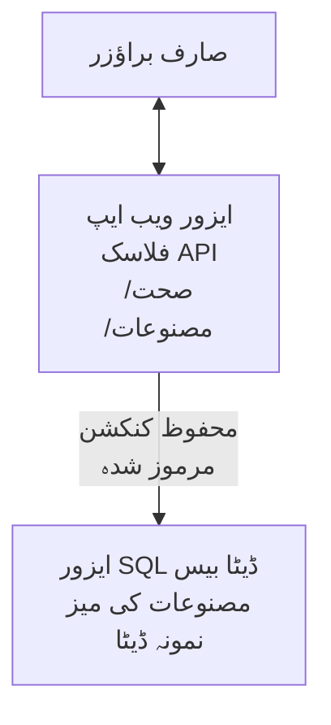

# مائیکروسافٹ SQL ڈیٹا بیس اور ویب ایپ کو AZD کے ساتھ ڈپلائے کرنا

⏱️ **متوقع وقت**: 20-30 منٹ | 💰 **متوقع لاگت**: ~$15-25/ماہ | ⭐ **پیچیدگی**: درمیانہ

یہ **مکمل، چلنے والا مثال** دکھاتا ہے کہ کیسے آپ [Azure Developer CLI (azd)](https://learn.microsoft.com/azure/developer/azure-developer-cli/) کا استعمال کرتے ہوئے ایک Python Flask ویب ایپلیکیشن کو مائیکروسافٹ SQL ڈیٹا بیس کے ساتھ Azure پر ڈپلائے کر سکتے ہیں۔ تمام کوڈ شامل اور ٹیسٹ شدہ ہے—کسی بیرونی انحصار کی ضرورت نہیں۔

## آپ کیا سیکھیں گے

اس مثال کو مکمل کرکے، آپ یہ کریں گے:
- انفراسٹرکچر کی کوڈ کے طور پر استعمال کرتے ہوئے ایک ملٹی ٹائر ایپلیکیشن (ویب ایپ + ڈیٹا بیس) کو ڈپلائے کرنا
- خفیہ معلومات کو ہارڈ کوڈ کیے بغیر محفوظ ڈیٹا بیس کنکشنز تشکیل دینا
- Application Insights کے ساتھ ایپلیکیشن کی صحت کی نگرانی کرنا
- AZD CLI کے ذریعے Azure وسائل کا مؤثر انتظام کرنا
- سیکیورٹی، لاگت کی بچت، اور مشاہدہ کے لیے Azure کی بہترین طریقہ کار پر عمل کرنا

## منظرنامہ کا جائزہ
- **ویب ایپ**: Python Flask REST API ڈیٹا بیس کنیکٹوٹی کے ساتھ
- **ڈیٹا بیس**: نمونہ ڈیٹا کے ساتھ Azure SQL ڈیٹا بیس
- **انفراسٹرکچر**: Bicep کے ذریعے پروویژند (ماڈیولر، دوبارہ استعمال کے قابل ٹیمپلیٹس)
- **ڈپلائمنٹ**: `azd` کمانڈز کے ساتھ مکمل خودکار
- **نگرانی**: Application Insights برائے لاگز اور ٹیلی میٹری

## ضروریات

### ضروری ٹولز

شروع کرنے سے پہلے، تصدیق کریں کہ یہ ٹولز انسٹال ہیں:

1. **[Azure CLI](https://learn.microsoft.com/cli/azure/install-azure-cli)** (ورژن 2.50.0 یا اس سے اوپر)
   ```sh
   az --version
   # متوقع نتیجہ: azure-cli 2.50.0 یا اس سے زیادہ
   ```

2. **[Azure Developer CLI (azd)](https://learn.microsoft.com/azure/developer/azure-developer-cli/install-azd)** (ورژن 1.0.0 یا اس سے اوپر)
   ```sh
   azd version
   # متوقع نتیجہ: azd ورژن 1.0.0 یا اس سے اعلیٰ
   ```

3. **[Python 3.8+](https://www.python.org/downloads/)** (مقامی ترقی کے لیے)
   ```sh
   python --version
   # متوقع نتیجہ: پائتھن 3.8 یا اس سے جدید
   ```

4. **[Docker](https://www.docker.com/get-started)** (اختیاری، مقامی containerized ترقی کے لیے)
   ```sh
   docker --version
   # متوقع نتیجہ: ڈاکر ورژن 20.10 یا اس سے زیادہ
   ```

### Azure کی ضروریات

- ایک فعال **Azure سبسکرپشن** ([مفت اکاؤنٹ بنائیں](https://azure.microsoft.com/free/))
- آپ کی سبسکرپشن میں وسائل بنانے کی اجازتیں
- سبسکرپشن یا ریسورس گروپ پر **مالک** یا **کنٹریبیوٹر** کا کردار

### علم کی ضروریات

یہ ایک **درمیانہ سطح** کی مثال ہے۔ آپ کو درج ذیل سے واقف ہونا چاہیے:
- بنیادی کمانڈ لائن آپریشنز
- کلاؤڈ کا بنیادی تصور (وسائل، ریسورس گروپس)
- ویب ایپلیکیشنز اور ڈیٹا بیسز کی بنیادی سمجھ

**AZD میں نئے ہیں؟** پہلے [Getting Started guide](../../docs/chapter-01-foundation/azd-basics.md) سے شروع کریں۔

## آرکیٹیکچر

یہ مثال ایک دو ٹائر آرکیٹیکچر ڈپلائے کرتی ہے جس میں ویب ایپلیکیشن اور SQL ڈیٹا بیس شامل ہیں:


**وسائل کی تعیناتی:**
- **ریسورس گروپ**: تمام وسائل کے لیے کنٹینر
- **ایپ سروس پلان**: لینکس پر مبنی ہوسٹنگ (B1 ٹئیر لاگت کی بچت کے لیے)
- **ویب ایپ**: Python 3.11 رن ٹائم کے ساتھ Flask ایپلیکیشن
- **SQL سرور**: مینج شدہ ڈیٹا بیس سرور کم از کم TLS 1.2 کے ساتھ
- **SQL ڈیٹا بیس**: بیسک ٹئیر (2GB، ترقی/ٹیسٹنگ کے لیے مناسب)
- **Application Insights**: نگرانی اور لاگنگ
- **لاگ اینالٹکس ورک اسپیس**: مرکزی لاگ اسٹوریج

**تشبیہ**: اسے ایک ریستوراں سمجھیں (ویب ایپ) جس کے ساتھ ایک واک ان فریزر ہے (ڈیٹا بیس)۔ گاہک مینو (API endpoints) سے آرڈر دیتے ہیں، اور کچن (Flask ایپ) فریزر سے اجزاء (ڈیٹا) حاصل کرتا ہے۔ ریستوراں مینیجر (Application Insights) ہر چیز کا ریکارڈ رکھتا ہے۔

## فولڈر کی ساخت

تمام فائلز اس مثال میں شامل ہیں—کوئی بیرونی انحصار درکار نہیں:

```
examples/database-app/
│
├── README.md                    # This file
├── azure.yaml                   # AZD configuration file
├── .env.sample                  # Sample environment variables
├── .gitignore                   # Git ignore patterns
│
├── infra/                       # Infrastructure as Code (Bicep)
│   ├── main.bicep              # Main orchestration template
│   ├── abbreviations.json      # Azure naming conventions
│   └── resources/              # Modular resource templates
│       ├── sql-server.bicep    # SQL Server configuration
│       ├── sql-database.bicep  # Database configuration
│       ├── app-service-plan.bicep  # Hosting plan
│       ├── app-insights.bicep  # Monitoring setup
│       └── web-app.bicep       # Web application
│
└── src/
    └── web/                    # Application source code
        ├── app.py              # Flask REST API
        ├── requirements.txt    # Python dependencies
        └── Dockerfile          # Container definition
```

**ہر فائل کا کام:**
- **azure.yaml**: AZD کو بتاتا ہے کہ کیا اور کہاں ڈپلائے کرنا ہے
- **infra/main.bicep**: تمام Azure وسائل کا انتظام کرتا ہے
- **infra/resources/*.bicep**: انفرادی وسائل کی تعریفیں (دوبارہ استعمال کے لیے ماڈیولر)
- **src/web/app.py**: Flask ایپلیکیشن جس میں ڈیٹا بیس لاجک ہے
- **requirements.txt**: Python پیکج انحصارات
- **Dockerfile**: ڈپلائمنٹ کے لیے containerization ہدایات

## فوری آغاز (قدم بہ قدم)

### قدم 1: کلون کریں اور نیویگیٹ کریں

```sh
git clone https://github.com/microsoft/AZD-for-beginners.git
cd AZD-for-beginners/examples/database-app
```

**✓ کامیابی کی جانچ**: تصدیق کریں کہ `azure.yaml` اور `infra/` فولڈر نظر آ رہا ہے:
```sh
ls
# متوقع: README.md، azure.yaml، infra/، src/
```

### قدم 2: Azure سے تصدیق کریں

```sh
azd auth login
```

یہ آپ کا براوزر Azure کی تصدیق کے لیے کھولے گا۔ اپنے Azure کریڈینشلز سے سائن ان کریں۔

**✓ کامیابی کی جانچ**: آپ کو یہ نظر آنا چاہیے:
```
Logged in to Azure.
```

### قدم 3: ماحول کو ترتیب دیں

```sh
azd init
```

**کیا ہوگا**: AZD آپ کی تعیناتی کے لیے مقامی ترتیب بنائے گا۔

**پرومپٹس جو آپ دیکھیں گے**:
- **ماحول کا نام**: مختصر نام درج کریں (جیسے `dev`, `myapp`)
- **Azure سبسکرپشن**: فہرست میں سے اپنی سبسکرپشن منتخب کریں
- **Azure مقام**: علاقہ منتخب کریں (جیسے `eastus`, `westeurope`)

**✓ کامیابی کی جانچ**: آپ کو یہ نظر آنا چاہیے:
```
SUCCESS: New project initialized!
```

### قدم 4: Azure وسائل پروویژن کریں

```sh
azd provision
```

**کیا ہوگا**: AZD تمام انفراسٹرکچر ڈپلائے کرے گا (5-8 منٹ لگیں گے):
1. ریسورس گروپ بنائیں
2. SQL سرور اور ڈیٹا بیس بنائیں
3. ایپ سروس پلان بنائیں
4. ویب ایپ بنائیں
5. Application Insights بنائیں
6. نیٹ ورکنگ اور سیکیورٹی ترتیب دیں

**آپ سے پوچھا جائے گا**:
- **SQL ایڈمن یوزر نیم**: یوزر نیم درج کریں (جیسے `sqladmin`)
- **SQL ایڈمن پاسورڈ**: مضبوط پاسورڈ درج کریں (اسے محفوظ کریں!)

**✓ کامیابی کی جانچ**: آپ کو یہ نظر آنا چاہیے:
```
SUCCESS: Your application was provisioned in Azure in X minutes Y seconds.
You can view the resources created under the resource group rg-<env-name> in Azure Portal:
https://portal.azure.com/#@/resource/subscriptions/.../resourceGroups/rg-<env-name>
```

**⏱️ وقت**: 5-8 منٹ

### قدم 5: ایپلیکیشن ڈپلائے کریں

```sh
azd deploy
```

**کیا ہوگا**: AZD آپ کی Flask ایپلیکیشن کو بنائے گا اور ڈپلائے کرے گا:
1. Python ایپلیکیشن کو پیکیج کرتا ہے
2. Docker کنٹینر بناتا ہے
3. Azure ویب ایپ پر پش کرتا ہے
4. ڈیٹا بیس کو نمونہ ڈیٹا کے ساتھ انیشیالائز کرتا ہے
5. ایپلیکیشن شروع کرتا ہے

**✓ کامیابی کی جانچ**: آپ کو یہ نظر آنا چاہیے:
```
SUCCESS: Your application was deployed to Azure in X minutes Y seconds.
You can view the resources created under the resource group rg-<env-name> in Azure Portal:
https://portal.azure.com/#@/resource/subscriptions/.../resourceGroups/rg-<env-name>
```

**⏱️ وقت**: 3-5 منٹ

### قدم 6: ایپلیکیشن براؤز کریں

```sh
azd browse
```

یہ آپ کی ڈپلائے شدہ ویب ایپ کو براوزر میں کھولے گا، `https://app-<unique-id>.azurewebsites.net` پر۔

**✓ کامیابی کی جانچ**: آپ کو JSON آؤٹ پٹ نظر آنا چاہیے:
```json
{
  "message": "Welcome to the Database App API",
  "endpoints": {
    "/": "This help message",
    "/health": "Health check endpoint",
    "/products": "List all products",
    "/products/<id>": "Get product by ID"
  }
}
```

### قدم 7: API اینڈ پوائنٹس ٹیسٹ کریں

**ہیلتھ چیک** (ڈیٹا بیس کنکشن کی تصدیق):
```sh
curl https://app-<your-id>.azurewebsites.net/health
```

**متوقع جواب**:
```json
{
  "status": "healthy",
  "database": "connected"
}
```

**پروڈکٹس کی فہرست** (نمونہ ڈیٹا):
```sh
curl https://app-<your-id>.azurewebsites.net/products
```

**متوقع جواب**:
```json
[
  {
    "id": 1,
    "name": "Laptop",
    "description": "High-performance laptop",
    "price": 1299.99,
    "created_at": "2025-11-19T10:30:00"
  },
  ...
]
```

**ایک پروڈکٹ لیں**:
```sh
curl https://app-<your-id>.azurewebsites.net/products/1
```

**✓ کامیابی کی جانچ**: تمام اینڈپوائنٹس JSON ڈیٹا واپس کرتے ہیں بغیر کسی خطا کے۔

---

**🎉 مبارک ہو!** آپ نے AZD استعمال کرکے کامیابی سے ایک ویب ایپلیکیشن کو SQL ڈیٹا بیس کے ساتھ Azure پر ڈپلائے کر لیا ہے۔

## کنفیگریشن کی تفصیلی جائزہ

### ماحول کی متغیرات

خفیہ معلومات Azure App Service کنفیگریشن کے ذریعے محفوظ طریقے سے مینیج کی جاتی ہیں—**کبھی سورس کوڈ میں ہارڈ کوڈ نہ کریں**۔

**AZD کی جانب سے خودکار طور پر کنفیگر کیا گیا:**
- `SQL_CONNECTION_STRING`: انکرپٹڈ شناختی اسناد کے ساتھ ڈیٹا بیس کنکشن
- `APPLICATIONINSIGHTS_CONNECTION_STRING`: نگرانی کے ٹیلی میٹری کے لیے اینڈ پوائنٹ
- `SCM_DO_BUILD_DURING_DEPLOYMENT`: خودکار ڈیپینڈینسی انسٹالیشن کو فعال کرتا ہے

**جہاں خفیہ معلومات محفوظ ہوتی ہیں**:
1. `azd provision` کے دوران آپ SQL اسناد سیکور پرومپٹس کے ذریعے فراہم کرتے ہیں
2. AZD انہیں آپ کی لوکل `.azure/<env-name>/.env` فائل میں محفوظ کرتا ہے (git کے ذریعے نظر انداز کی جاتی ہے)
3. AZD انہیں Azure App Service کنفیگریشن میں شامل کرتا ہے (آرام کی حالت میں انکرپٹڈ)
4. ایپلیکیشن انہیں رن ٹائم پر `os.getenv()` کے ذریعے پڑھتی ہے

### مقامی ترقی

مقامی جانچ کے لیے، نمونہ سے `.env` فائل بنائیں:

```sh
cp .env.sample .env
# اپنی مقامی ڈیٹا بیس کنکشن کے ساتھ .env میں ترمیم کریں
```

**مقامی ترقی کا ورک فلو**:
```sh
# انحصار کو انسٹال کریں
cd src/web
pip install -r requirements.txt

# ماحولیاتی متغیرات سیٹ کریں
export SQL_CONNECTION_STRING="your-local-connection-string"

# ایپلیکیشن چلائیں
python app.py
```

**مقامی جانچ کریں**:
```sh
curl http://localhost:8000/health
# متوقع: {"status": "healthy", "database": "connected"}
```

### انفراسٹرکچر ایز کوڈ

تمام Azure وسائل Bicep ٹیمپلیٹس (`infra/` فولڈر) میں تعریف کیے گئے ہیں:

- **ماڈیولر ڈیزائن**: ہر ریسورس ٹائپ کا اپنا فائل دوبارہ استعمال کے لیے
- **پیرا میٹرائزڈ**: SKUs، علاقے، نام کے قواعد کو حسب ضرورت بنائیں
- **بہترین طریقے**: Azure نامزدگی کے معیارات اور سیکیورٹی ڈیفالٹس کی پیروی
- **ورژن کنٹرول شدہ**: انفراسٹرکچر کی تبدیلیاں Git میں ٹریک ہوتی ہیں

**حسب ضرورت کی مثال**:
ڈیٹا بیس ٹئیر کو تبدیل کرنے کے لیے، `infra/resources/sql-database.bicep` میں ترمیم کریں:
```bicep
sku: {
  name: 'Standard'  // Changed from 'Basic'
  tier: 'Standard'
  capacity: 10
}
```

## سیکیورٹی کے بہترین طریقے

یہ مثال Azure سیکیورٹی کے بہترین طریقوں کی پیروی کرتی ہے:

### 1. **کوڈ میں خفیہ معلومات نہیں**
- ✅ شناختی اسناد Azure App Service کنفیگریشن میں محفوظ (انکرپٹڈ)
- ✅ `.env` فائلیں Git کے ذریعے `.gitignore` میں شامل
- ✅ پروویژننگ کے دوران سیکور پیرامیٹرز کے ذریعے خفیہ معلومات فراہم کی جاتی ہیں

### 2. **انکرپٹڈ کنکشنز**
- ✅ SQL سرور کیلئے کم از کم TLS 1.2
- ✅ ویب ایپ کیلئے صرف HTTPS استعمال کی تاکید
- ✅ ڈیٹا بیس کنکشن انکرپٹڈ چینلز استعمال کرتے ہیں

### 3. **نیٹ ورک سیکیورٹی**
- ✅ SQL سرور فائر وال جس میں Azure سروسز کو اجازت دی گئی ہے
- ✅ عوامی نیٹ ورک کی رسائی محدود (نجی اینڈ پوائنٹس کے ذریعے مزید محدود کی جا سکتی ہے)
- ✅ ویب ایپ پر FTPS معطل

### 4. **تصدیق اور اجازت**
- ⚠️ **موجودہ**: SQL تصدیق (یوزر نیم/پاسورڈ)
- ✅ **پیداوار کی سفارش**: پاس ورڈ کے بغیر تصدیق کے لئے Azure Managed Identity استعمال کریں

**مینجڈ آئیڈینٹی پر اپ گریڈ کرنے کے لیے** (پیداوار کے لیے):
1. ویب ایپ پر Managed Identity فعال کریں
2. شناختی کو SQL کی اجازت دیں
3. کنکشن سٹرنگ کو Managed Identity کے مطابق اپ ڈیٹ کریں
4. پاسورڈ کی بنیاد پر تصدیق ختم کریں

### 5. **آڈٹنگ اور کمپلائنس**
- ✅ Application Insights تمام درخواستیں اور غلطیاں لاگ کرتا ہے
- ✅ SQL ڈیٹا بیس کی آڈٹنگ فعال (کمپلائنس کے لیے ترتیب دی جا سکتی ہے)
- ✅ تمام وسائل حکمرانی کے لیے ٹیگ کیے گئے ہیں

**پیداوار سے پہلے سیکیورٹی چیک لسٹ**:
- [ ] SQL کے لیے Azure Defender فعال کریں
- [ ] SQL ڈیٹا بیس کے لیے نجی اینڈ پوائنٹس ترتیب دیں
- [ ] ویب ایپلیکیشن فائر وال (WAF) فعال کریں
- [ ] خفیہ معلومات کی گردش کے لیے Azure Key Vault نافذ کریں
- [ ] Azure AD تصدیق ترتیب دیں
- [ ] تمام وسائل کے لیے تشخیصی لاگنگ فعال کریں

## لاگت کی بچت

**متوقع ماہانہ لاگت** (نومبر 2025 تک):

| وسیلہ | SKU/ٹئیر | متوقع لاگت |
|----------|----------|----------------|
| ایپ سروس پلان | B1 (بیسک) | ~$13/مہینہ |
| SQL ڈیٹا بیس | Basic (2GB) | ~$5/مہینہ |
| Application Insights | پی-جی-یو | ~$2/مہینہ (کم ٹریفک) |
| **کل** | | **~$20/مہینہ** |

**💡 لاگت بچانے کے مشورے**:

1. **سیکھنے کے لیے مفت ٹئیر استعمال کریں**:
   - ایپ سروس: F1 ٹئیر (مفت، محدود گھنٹے)
   - SQL ڈیٹا بیس: Azure SQL ڈیٹا بیس سرورلیس استعمال کریں
   - Application Insights: 5GB/مہینہ مفت انجیکشن

2. **وسائل کو جب استعمال نہ کر رہے ہوں تو بند کریں**:
   ```sh
   # ویب ایپ کو بند کریں (ڈیٹا بیس ابھی بھی چارج کرتا ہے)
   az webapp stop --name <app-name> --resource-group <rg-name>
   
   # ضرورت پڑنے پر دوبارہ شروع کریں
   az webapp start --name <app-name> --resource-group <rg-name>
   ```

3. **ٹیسٹنگ کے بعد سب کچھ حذف کر دیں**:
   ```sh
   azd down
   ```
   یہ تمام وسائل ہٹا دے گا اور چارجز بند کر دے گا۔

4. **ترقی بمقابلہ پیداوار SKUs**:
   - **ترقی**: بیسک ٹئیر (اس مثال میں استعمال شدہ)
   - **پیداوار**: اسٹینڈرڈ/پریمیم ٹئیرز کے ساتھ ریڈنڈنسی

**لاگت کی نگرانی**:
- [Azure Cost Management](https://portal.azure.com/#view/Microsoft_Azure_CostManagement) میں لاگت دیکھیں
- غیر متوقع چارجز سے بچنے کے لیے لاگت کی الرٹس سیٹ کریں
- تمام وسائل پر `azd-env-name` ٹیگ لگا کر ٹریک کریں

**مفت ٹئیر کا متبادل**:
سیکھنے کے مقصد کے لیے، آپ `infra/resources/app-service-plan.bicep` میں ترمیم کر سکتے ہیں:
```bicep
sku: {
  name: 'F1'  // Free tier
  tier: 'Free'
}
```
**نوٹ**: مفت ٹئیر کی حدود ہیں (60 منٹ/دن CPU، ہمیشہ آن نہیں)۔

## نگرانی اور مشاہدہ

### Application Insights کا انضمام

یہ مثال جامع نگرانی کے لیے **Application Insights** شامل کرتی ہے:

**کیا نگرانی کی جاتی ہے**:
- ✅ HTTP درخواستیں (دیر، اسٹیٹس کوڈ، اینڈپوائنٹس)
- ✅ ایپلیکیشن کی خرابیوں اور استثناء
- ✅ Flask ایپ سے کسٹم لاگنگ
- ✅ ڈیٹا بیس کنکشن کی صحت
- ✅ کارکردگی کے میٹرکس (CPU، میموری)

**Application Insights تک رسائی**:
1. [Azure پورٹل](https://portal.azure.com) کھولیں
2. اپنے ریسورس گروپ (`rg-<env-name>`) پر جائیں
3. Application Insights ریسورس (`appi-<unique-id>`) پر کلک کریں

**مفید استفسارات** (Application Insights → Logs):

**تمام درخواستیں دیکھیں**:
```kusto
requests
| where timestamp > ago(1h)
| order by timestamp desc
| project timestamp, name, url, resultCode, duration
```

**خرابیوں کی تلاش کریں**:
```kusto
exceptions
| where timestamp > ago(24h)
| order by timestamp desc
| project timestamp, type, outerMessage, operation_Name
```

**ہیلتھ اینڈ پوائنٹ چیک کریں**:
```kusto
requests
| where name contains "health"
| summarize count() by resultCode, bin(timestamp, 1h)
```

### SQL ڈیٹا بیس آڈٹنگ

**SQL ڈیٹا بیس آڈٹنگ فعال ہے تاکہ:**
- ڈیٹا بیس تک رسائی کے نمونے
- ناکام لاگ ان کی کوششیں
- اسکیمہ میں تبدیلیاں
- ڈیٹا رسائی (کمپلائنس کے لیے)

**آڈٹ لاگز تک رسائی**:
1. Azure پورٹل → SQL ڈیٹا بیس → آڈٹنگ
2. لاگ اینالٹکس ورک اسپیس میں لاگز دیکھیں

### حقیقت وقت میں نگرانی

**لائیو میٹرکس دیکھیں**:
1. Application Insights → Live Metrics
2. درخواستیں، ناکامیاں، اور کارکردگی حقیقت وقت میں دیکھیں

**الرٹس ترتیب دیں**:
اہم ایونٹس کے لیے الرٹس بنائیں:
- HTTP 500 غلطیاں > 5 پانچ منٹ میں
- ڈیٹا بیس کنکشن کی ناکامیاں
- اعلی ردعمل کا وقت (>2 سیکنڈ)

**الرٹ بنانے کی مثال**:
```sh
az monitor metrics alert create \
  --name "High-Response-Time" \
  --resource-group <rg-name> \
  --scopes <app-insights-resource-id> \
  --condition "avg requests/duration > 2000" \
  --description "Alert when response time exceeds 2 seconds"
```

## مسائل کا حل (Troubleshooting)
### عام مسائل اور حل

#### 1۔ `azd provision` "Location not available" سے ناکام ہوتا ہے

**علامات**:  
```
Error: The subscription is not registered for the resource type 'components' in the location 'centralus'.
```
  
**حل**:  
متبادل Azure خطہ منتخب کریں یا resource provider رجسٹر کریں:  
```sh
az provider register --namespace Microsoft.Insights
```
  
#### 2۔ تعیناتی کے دوران SQL کنکشن ناکام ہو جاتا ہے

**علامات**:  
```
pyodbc.OperationalError: ('08001', '[08001] [Microsoft][ODBC Driver 18 for SQL Server]TCP Provider...')
```
  
**حل**:  
- تصدیق کریں کہ SQL Server کا firewall Azure خدمات کو اجازت دیتا ہے (خودکار طور پر ترتیب دیا جاتا ہے)  
- چیک کریں کہ `azd provision` کے دوران SQL ایڈمن پاس ورڈ درست داخل کیا گیا ہے  
- یقینی بنائیں کہ SQL Server مکمل طور پر فراہم کیا گیا ہے (2-3 منٹ لگ سکتے ہیں)  

**کنکشن کی تصدیق کریں**:  
```sh
# آزور پورٹ ل سے، ایس کیو ایل ڈیٹا بیس → کوئری ایڈیٹر پر جائیں
# اپنی اسناد کے ساتھ کنیکٹ کرنے کی کوشش کریں
```
  
#### 3۔ ویب ایپ "Application Error" دکھاتا ہے

**علامات**:  
براؤزر عام ایرر پیج دکھاتا ہے۔

**حل**:  
ایپلیکیشن لاگز چیک کریں:  
```sh
# حالیہ لاگز دیکھیں
az webapp log tail --name <app-name> --resource-group <rg-name>
```
  
**عام وجوہات**:  
- ماحول کے متغیرات کی کمی (App Service → Configuration چیک کریں)  
- Python پیکیج کی تنصیب ناکام رہی (تعیناتی لاگز چیک کریں)  
- ڈیٹا بیس کی ابتدا میں خرابی (SQL کنکٹیویٹی چیک کریں)  

#### 4۔ `azd deploy` "Build Error" کے ساتھ ناکام

**علامات**:  
```
Error: Failed to build project
```
  
**حل**:  
- یقینی بنائیں کہ `requirements.txt` میں کوئی syntax کی غلطی نہیں  
- `infra/resources/web-app.bicep` میں Python 3.11 کی وضاحت کی گئی ہے  
- Dockerfile میں درست base image ہے  

**مقامی طور پر ڈیبگ کریں**:  
```sh
cd src/web
docker build -t test-app .
docker run -p 8000:8000 test-app
```
  
#### 5۔ AZD کمانڈز چلانے پر "Unauthorized" ایرر

**علامات**:  
```
ERROR: (Unauthorized) The client '<id>' with object id '<id>' does not have authorization
```
  
**حل**:  
Azure میں دوبارہ لاگ ان کریں:  
```sh
# اے زیڈ ورک فلو کے لیے ضروری ہے
azd auth login

# اگر آپ براہ راست Azure CLI کمانڈز بھی استعمال کر رہے ہیں تو اختیاری ہے
az login
```
  
تصدیق کریں کہ آپ کے پاس سبسکرپشن پر مناسب اجازتیں (Contributor کردار) موجود ہیں۔

#### 6۔ ڈیٹا بیس کے لیے زیادہ اخراجات

**علامات**:  
غیر متوقع Azure بل۔

**حل**:  
- چیک کریں کہ آپ نے ٹیسٹنگ کے بعد `azd down` چلانا نہ بھولا ہو  
- تصدیق کریں کہ SQL Database Basic tier استعمال کر رہا ہے (Premium نہیں)  
- Azure Cost Management میں اخراجات کا جائزہ لیں  
- اخراجات کی اطلاع سیٹ کریں  

### مدد حاصل کریں

**تمام AZD ماحول کے متغیرات دیکھیں**:  
```sh
azd env get-values
```
  
**تعیناتی کی حیثیت چیک کریں**:  
```sh
az webapp show --name <app-name> --resource-group <rg-name> --query state
```
  
**ایپلیکیشن لاگز تک رسائی حاصل کریں**:  
```sh
az webapp log download --name <app-name> --resource-group <rg-name> --log-file app-logs.zip
```
  
**مزید مدد چاہیے؟**  
- [AZD ٹربل شوٹنگ گائیڈ](../../docs/chapter-07-troubleshooting/common-issues.md)  
- [Azure App Service ٹربل شوٹنگ](https://learn.microsoft.com/azure/app-service/troubleshoot-diagnostic-logs)  
- [Azure SQL ٹربل شوٹنگ](https://learn.microsoft.com/azure/azure-sql/database/troubleshoot-common-errors-issues)  

## عملی مشقیں

### مشق 1: اپنی تعیناتی کی تصدیق کریں (ابتدائی)

**مقصد**: تصدیق کریں کہ تمام وسائل تعینات ہو چکے ہیں اور ایپلیکیشن کام کر رہی ہے۔

**اقدامات**:  
1۔ اپنے resource group میں تمام وسائل کی فہرست بنائیں:  
   ```sh
   az resource list --resource-group rg-<env-name> --output table
   ```
   
**متوقع**: 6-7 وسائل (ویب ایپ، SQL سرور، SQL ڈیٹا بیس، App Service Plan، Application Insights، Log Analytics)  

2۔ تمام API اینڈ پوائنٹس کی جانچ کریں:  
   ```sh
   curl https://app-<your-id>.azurewebsites.net/
   curl https://app-<your-id>.azurewebsites.net/health
   curl https://app-<your-id>.azurewebsites.net/products
   curl https://app-<your-id>.azurewebsites.net/products/1
   ```
   
**متوقع**: سبھی درست JSON بغیر ایرر کے واپس کریں  

3۔ Application Insights چیک کریں:  
   - Azure پورٹل میں Application Insights پر جائیں  
   - "Live Metrics" کھولیں  
   - ویب ایپ پر اپنے براؤزر کو ریفریش کریں  
   **متوقع**: ریئل ٹائم میں درخواستیں دکھائی دیں  

**کامیابی کا معیار**: تمام 6-7 وسائل موجود ہوں، تمام اینڈ پوائنٹس ڈیٹا واپس کریں، Live Metrics سرگرمی دکھائے۔

---

### مشق 2: نیا API اینڈ پوائنٹ شامل کریں (درمیانہ)

**مقصد**: Flask ایپلیکیشن میں نیا اینڈ پوائنٹ شامل کریں۔

**آغاز کوڈ**: موجودہ اینڈ پوائنٹس `src/web/app.py` میں ہیں۔

**اقدامات**:  
1۔ `src/web/app.py` میں `get_product()` فنکشن کے بعد نیا اینڈ پوائنٹ شامل کریں:  
   ```python
   @app.route('/products/search/<keyword>')
   def search_products(keyword):
       """Search products by name or description."""
       try:
           conn = get_db_connection()
           cursor = conn.cursor()
           cursor.execute(
               "SELECT id, name, description, price, created_at FROM products WHERE name LIKE ? OR description LIKE ?",
               (f'%{keyword}%', f'%{keyword}%')
           )
           
           products = []
           for row in cursor.fetchall():
               products.append({
                   'id': row[0],
                   'name': row[1],
                   'description': row[2],
                   'price': float(row[3]) if row[3] else None,
                   'created_at': row[4].isoformat() if row[4] else None
               })
           
           cursor.close()
           conn.close()
           
           logger.info(f"Search for '{keyword}' returned {len(products)} results")
           return jsonify(products), 200
           
       except Exception as e:
           logger.error(f"Error searching products: {str(e)}")
           return jsonify({'error': str(e)}), 500
   ```
  
2۔ اپ ڈیٹ شدہ ایپلیکیشن تعینات کریں:  
   ```sh
   azd deploy
   ```
  
3۔ نیا اینڈ پوائنٹ ٹیسٹ کریں:  
   ```sh
   curl https://app-<your-id>.azurewebsites.net/products/search/laptop
   ```
   
**متوقع**: "laptop" سے متعلق مصنوعات واپس کرے  

**کامیابی کا معیار**: نیا اینڈ پوائنٹ کام کرے، فلٹر شدہ نتائج دے، Application Insights لاگز میں ظاہر ہو۔

---

### مشق 3: مانیٹرنگ اور الرٹس شامل کریں (اعلیٰ)

**مقصد**: الرٹس کے ساتھ پروایکٹو مانیٹرنگ قائم کریں۔

**اقدامات**:  
1۔ HTTP 500 ایررز کے لیے الرٹ بنائیں:  
   ```sh
   # درخواست کی بصیرت کا وسائل شناخت حاصل کریں
   AI_ID=$(az monitor app-insights component show \
     --app appi-<your-id> \
     --resource-group rg-<env-name> \
     --query id -o tsv)
   
   # انتباہ بنائیں
   az monitor metrics alert create \
     --name "High-Error-Rate" \
     --resource-group rg-<env-name> \
     --scopes $AI_ID \
     --condition "count requests/failed > 5" \
     --window-size 5m \
     --evaluation-frequency 1m \
     --description "Alert when >5 failed requests in 5 minutes"
   ```
  
2۔ ایررز پیدا کر کے الرٹ ٹرگر کریں:  
   ```sh
   # ایک غیر موجود پروڈکٹ کی درخواست کریں
   for i in {1..10}; do curl https://app-<your-id>.azurewebsites.net/products/999; done
   ```
  
3۔ چیک کریں کہ الرٹ چلا یا نہیں:  
   - Azure پورٹل → Alerts → Alert Rules  
   - اپنا ای میل چیک کریں (اگر ترتیب دی گئی ہو)  

**کامیابی کا معیار**: الرٹ رول بن جائے، ایررز پر ٹرگر ہو، اطلاعات موصول ہوں۔

---

### مشق 4: ڈیٹا بیس اسکیمہ میں تبدیلیاں (اعلیٰ)

**مقصد**: نئی ٹیبل شامل کریں اور ایپلیکیشن کو اس کے استعمال کے لیے اپ ڈیٹ کریں۔

**اقدامات**:  
1۔ Azure پورٹل کے Query Editor کے ذریعے SQL ڈیٹا بیس سے رابطہ کریں۔  

2۔ نئی `categories` ٹیبل بنائیں:  
   ```sql
   CREATE TABLE categories (
       id INT PRIMARY KEY IDENTITY(1,1),
       name NVARCHAR(50) NOT NULL,
       description NVARCHAR(200)
   );
   
   INSERT INTO categories (name, description) VALUES
   ('Electronics', 'Electronic devices and accessories'),
   ('Office Supplies', 'Office equipment and supplies');
   
   -- Add category to products table
   ALTER TABLE products ADD category_id INT;
   UPDATE products SET category_id = 1; -- Set all to Electronics
   ```
  
3۔ `src/web/app.py` اپ ڈیٹ کریں تاکہ جوابات میں category معلومات شامل ہو  

4۔ تعینات کریں اور ٹیسٹ کریں  

**کامیابی کا معیار**: نئی ٹیبل موجود ہو، مصنوعات میں category معلومات دکھائی دے، ایپلیکیشن صحیح کام کرے۔

---

### مشق 5: کیشنگ نافذ کریں (ماہر)

**مقصد**: کارکردگی بہتر بنانے کے لیے Azure Redis Cache شامل کریں۔

**اقدامات**:  
1۔ Redis Cache کو `infra/main.bicep` میں شامل کریں  
2۔ `src/web/app.py` اپ ڈیٹ کریں تاکہ مصنوعات کی تلاش کو کیش کیا جا سکے  
3۔ Application Insights کے ساتھ کارکردگی میں بہتری ماپیں  
4۔ کیشنگ سے پہلے اور بعد کا ردعمل کا وقت موازنہ کریں  

**کامیابی کا معیار**: Redis تعینات ہو، کیشنگ کام کرے، ردعمل کا وقت 50% سے زیادہ بہتر ہو۔

**اشارہ**: [Azure Cache for Redis دستاویزات](https://learn.microsoft.com/azure/azure-cache-for-redis/) سے شروع کریں۔

---

## صفائی

مسلسل چارجز سے بچنے کے لیے کام ختم ہونے پر تمام وسائل حذف کریں:  

```sh
azd down
```
  
**تصدیقی پرامپٹ**:  
```
? Total resources to delete: 7, are you sure you want to continue? (y/N)
```
  
تصدیق کے لیے `y` ٹائپ کریں۔

**✓ کامیابی کی جانچ**:  
- Azure پورٹل سے تمام وسائل حذف ہو چکے ہوں  
- کوئی جاری چارجز نہ ہوں  
- مقامی `.azure/<env-name>` فولڈر حذف کیا جا سکتا ہے  

**متبادل** (انفراسٹرکچر رکھیں، ڈیٹا حذف کریں):  
```sh
# صرف ریسورس گروپ حذف کریں (AZD کنفیگریشن برقرار رکھیں)
az group delete --name rg-<env-name> --yes
```
## مزید جانیں

### متعلقہ دستاویزات  
- [Azure Developer CLI دستاویزات](https://learn.microsoft.com/azure/developer/azure-developer-cli/)  
- [Azure SQL Database دستاویزات](https://learn.microsoft.com/azure/azure-sql/database/)  
- [Azure App Service دستاویزات](https://learn.microsoft.com/azure/app-service/)  
- [Application Insights دستاویزات](https://learn.microsoft.com/azure/azure-monitor/app/app-insights-overview)  
- [Bicep لینگویج ریفرنس](https://learn.microsoft.com/azure/azure-resource-manager/bicep/)  

### اس کورس میں اگلے اقدامات  
- **[Container Apps کی مثال](../../../../examples/container-app)**: Azure Container Apps کے ساتھ مائیکرو سروسز تعینات کریں  
- **[AI انضمام گائیڈ](../../../../docs/ai-foundry)**: اپنی ایپ میں AI خصوصیات شامل کریں  
- **[تعیناتی کی بہترین مشقیں](../../docs/chapter-04-infrastructure/deployment-guide.md)**: پروڈکشن تعیناتی کے طریقے  

### اعلیٰ موضوعات  
- **Managed Identity**: پاس ورڈز ختم کریں اور Azure AD تصدیق استعمال کریں  
- **Private Endpoints**: ورچوئل نیٹ ورک میں ڈیٹا بیس کنکشنز کو محفوظ بنائیں  
- **CI/CD انٹیگریشن**: GitHub Actions یا Azure DevOps کے ساتھ تعیناتی خودکار بنائیں  
- **ملٹی-اینورائمنٹ**: dev, staging، اور production ماحول قائم کریں  
- **ڈیٹا بیس مائگریشنز**: Alembic یا Entity Framework کے ذریعے اسکیمہ ورژننگ کریں  

### دیگر طریقوں کے مقابلے

**AZD بمقابلہ ARM Templates**:  
- ✅ AZD: اعلیٰ سطح کی abstraction، آسان کمانڈز  
- ⚠️ ARM: زیادہ تفصیلی، باریک کنٹرول  

**AZD بمقابلہ Terraform**:  
- ✅ AZD: Azure کے لیے مخصوص، Azure خدمات کے ساتھ مربوط  
- ⚠️ Terraform: کثیر کلاؤڈ سپورٹ، بڑا ماحول  

**AZD بمقابلہ Azure Portal**:  
- ✅ AZD: دہرانے لائق، ورژن کنٹرول، خودکار  
- ⚠️ پورٹل: دستی کلکس، دوبارہ کرنا مشکل  

**AZD کو سمجھیں جیسے**: Azure کے لیے Docker Compose—پیچیدہ تعیناتیوں کے لیے آسان کنفیگریشن۔

---

## اکثر پوچھے گئے سوالات

**س: کیا میں مختلف پروگرامنگ زبان استعمال کر سکتا ہوں؟**  
ج: جی ہاں! `src/web/` کو Node.js، C#، Go، یا کسی اور زبان سے بدلیں۔ `azure.yaml` اور Bicep کو مطابق اپ ڈیٹ کریں۔

**س: میں مزید ڈیٹا بیس کیسے شامل کروں؟**  
ج: `infra/main.bicep` میں دوسرا SQL Database ماڈیول شامل کریں یا Azure Database خدمات سے PostgreSQL/MySQL استعمال کریں۔

**س: کیا میں اسے پروڈکشن کے لیے استعمال کر سکتا ہوں؟**  
ج: یہ آغاز ہے۔ پروڈکشن کے لیے managed identity, private endpoints, redundancy, backup strategy, WAF، اور بہتر مانیٹرنگ شامل کریں۔

**س: اگر میں کوڈ تعیناتی کی بجائے کنٹینرز استعمال کرنا چاہوں؟**  
ج: [Container Apps کی مثال](../../../../examples/container-app) دیکھیں جو مکمل طور پر Docker کنٹینرز استعمال کرتی ہے۔

**س: میں اپنے لوکل مشین سے ڈیٹا بیس سے کیسے کنیکٹ ہوں؟**  
ج: SQL Server کے firewall میں اپنا IP شامل کریں:  
```sh
az sql server firewall-rule create \
  --resource-group rg-<env-name> \
  --server sql-<unique-id> \
  --name AllowMyIP \
  --start-ip-address <your-ip> \
  --end-ip-address <your-ip>
```
  
**س: کیا میں نئے بنانے کی بجائے موجودہ ڈیٹا بیس استعمال کر سکتا ہوں؟**  
ج: جی ہاں، `infra/main.bicep` میں موجودہ SQL Server کا حوالہ دیں اور کنکشن سٹرنگ پیرامیٹرز اپ ڈیٹ کریں۔

---

> **نوٹ:** یہ مثال AZD کے ذریعے ویب ایپ اور ڈیٹا بیس کی تعیناتی کی بہترین مشقوں کو ظاہر کرتی ہے۔ اس میں کام کرنے والا کوڈ، مکمل دستاویزات، اور عملی مشقیں شامل ہیں تاکہ سیکھنے میں مدد ملے۔ پروڈکشن تعیناتی کے لیے اپنی تنظیم کی سیکیورٹی، اسکیلنگ، تعمیل، اور لاگت کی ضروریات کا جائزہ لیں۔

**📚 کورس نیویگیشن:**  
- ← پچھلا: [Container Apps کی مثال](../../../../examples/container-app)  
- → اگلا: [AI انضمام گائیڈ](../../../../docs/ai-foundry)  
- 🏠 [کورس ہوم](../../README.md)

---

<!-- CO-OP TRANSLATOR DISCLAIMER START -->
**ڈس کلیمر**:
اس دستاویز کا ترجمہ ایک AI ترجمہ سروس [Co-op Translator](https://github.com/Azure/co-op-translator) کے ذریعہ کیا گیا ہے۔ اگرچہ ہم درستگی کے لئے کوشاں ہیں، براہ کرم آگاہ رہیں کہ خودکار ترجموں میں غلطیاں یا عدم درستیاں ہو سکتی ہیں۔ اصل دستاویز کو اس کی مادری زبان میں مستند ذریعہ سمجھا جانا چاہئے۔ اہم معلومات کے لئے پیشہ ور انسانی ترجمہ کی سفارش کی جاتی ہے۔ اس ترجمے کے استعمال سے ہونے والی کسی بھی غلط فہمی یا غلط تشریح کی ذمہ داری ہم پر عائد نہیں ہوتی۔
<!-- CO-OP TRANSLATOR DISCLAIMER END -->