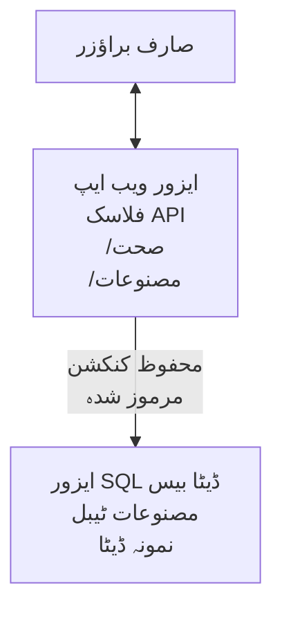

# مائیکروسافٹ ایس کیو ایل ڈیٹا بیس اور ویب ایپ کو AZD کے ساتھ تعینات کرنا

⏱️ **متوقع وقت**: 20-30 منٹس | 💰 **متوقع لاگت**: تقریباً $15-25/مہینہ | ⭐ **پیچیدگی**: درمیانہ

یہ **مکمل، کام کرنے والا مثال** دکھاتا ہے کہ کیسے [Azure Developer CLI (azd)](https://learn.microsoft.com/azure/developer/azure-developer-cli/) کا استعمال کرتے ہوئے Python Flask ویب ایپلیکیشن کو Microsoft SQL ڈیٹا بیس کے ساتھ Azure پر تعینات کیا جائے۔ تمام کوڈ شامل اور ٹیسٹ کیا گیا ہے—کسی بیرونی انحصار کی ضرورت نہیں۔

## آپ کیا سیکھیں گے

اس مثال کو مکمل کرکے، آپ کریں گے:
- انفراسٹرکچر ایز کوڈ کا استعمال کرتے ہوئے ایک ملٹی ٹائر ایپلیکیشن (ویب ایپ + ڈیٹا بیس) تعینات کرنا
- رازوں کو ہارڈ کوڈ کیے بغیر محفوظ ڈیٹا بیس کنکشن ترتیب دینا
- Application Insights کے ساتھ ایپلیکیشن کی صحت کی نگرانی کرنا
- AZD CLI کے ساتھ Azure وسائل کو مؤثر طریقے سے منظم کرنا
- سیکیورٹی، لاگت کے بہتر استعمال، اور مشاہدے کے لیے Azure کی بہترین عملی تدابیر پر عمل کرنا

## منظرنامہ کا جائزہ
- **ویب ایپ**: Python Flask REST API جس میں ڈیٹا بیس کنیکٹیویٹی ہو
- **ڈیٹا بیس**: Azure SQL Database نمونہ ڈیٹا کے ساتھ
- **انفراسٹرکچر**: Bicep کے ذریعے فراہم کیا گیا (ماڈیولر، دوبارہ استعمال کے قابل ٹیمپلیٹس)
- **تعیناتی**: `azd` کمانڈز کی مدد سے مکمل خودکار
- **نگرانی**: Application Insights لاگز اور ٹیلی میٹری کے لیے

## ضروریات

### ضروری ٹولز

شروع کرنے سے پہلے، یقینی بنائیں کہ یہ ٹولز انسٹال ہیں:

1. **[Azure CLI](https://learn.microsoft.com/cli/azure/install-azure-cli)** (ورژن 2.50.0 یا اس سے اوپر)
   ```sh
   az --version
   # متوقع نتیجہ: azure-cli 2.50.0 یا اس سے زیادہ
   ```

2. **[Azure Developer CLI (azd)](https://learn.microsoft.com/azure/developer/azure-developer-cli/install-azd)** (ورژن 1.0.0 یا اس سے اوپر)
   ```sh
   azd version
   # متوقع نتیجہ: azd ورژن 1.0.0 یا اس سے زیادہ
   ```

3. **[Python 3.8+](https://www.python.org/downloads/)** (مقامی ترقی کے لیے)
   ```sh
   python --version
   # متوقع نتیجہ: پائتھن 3.8 یا اس سے اوپر
   ```

4. **[Docker](https://www.docker.com/get-started)** (اختیاری، مقامی کنٹینرائزڈ ترقی کے لیے)
   ```sh
   docker --version
   # متوقع نتیجہ: ڈاکر ورژن 20.10 یا اس سے زیادہ
   ```

### Azure کی ضروریات

- ایک فعال **Azure سبسکرپشن** ([مفت اکاؤنٹ بنائیں](https://azure.microsoft.com/free/))
- اپنی سبسکرپشن میں وسائل بنانے کی اجازت
- سبسکرپشن یا ریسورس گروپ پر **مالک** یا **کنٹریبیوٹر** رول

### معلوماتی ضروریات

یہ ایک **درمیانے درجے کی سطح** کی مثال ہے۔ آپ کو معلوم ہونا چاہیے:
- بنیادی کمانڈ لائن آپریشنز
- بنیادی کلاؤڈ تصورات (وسائل، ریسورس گروپس)
- ویب ایپلیکیشنز اور ڈیٹا بیسز کی بنیادی سمجھ

**AZD میں نئے ہیں؟** پہلے [Getting Started guide](../../docs/chapter-01-foundation/azd-basics.md) سے شروعات کریں۔

## فن تعمیر

یہ مثال دو ٹائر فن تعمیر تعینات کرتی ہے جس میں ویب ایپلیکیشن اور SQL ڈیٹا بیس شامل ہیں:


**وسائل کی تعیناتی:**
- **ریسورس گروپ**: تمام وسائل کے لیے کنٹینر
- **ایپ سروس پلان**: لینکس بیسڈ ہوسٹنگ (B1 ٹئیر، لاگت کی کفایت شعاری کے لیے)
- **ویب ایپ**: Python 3.11 runtime کے ساتھ Flask اپلیکیشن
- **SQL سرور**: TLS 1.2 کم از کم کے ساتھ منظم ڈیٹا بیس سرور
- **SQL ڈیٹا بیس**: Basic tier (2GB، ترقی/ٹیسٹنگ کے لیے موزوں)
- **Application Insights**: نگرانی اور لاگنگ
- **Log Analytics ورک اسپیس**: مرکزی لاگ اسٹوریج

**مثال**: اسے ایک ریسٹورنٹ (ویب ایپ) سمجھیں جس کا ایک واک-ان فریزر (ڈیٹا بیس) ہو۔ گاہک مینو (API endpoints) سے آرڈر کرتے ہیں، اور کچن (Flask ایپ) فریزر سے اجزاء (ڈیٹا) حاصل کرتا ہے۔ ریسٹورنٹ مینیجر (Application Insights) ہر چیز کی نگرانی کرتا ہے۔

## فولڈر کی ساخت

تمام فائلیں اس مثال میں شامل ہیں—کوئی بیرونی انحصار نہیں:

```
examples/database-app/
│
├── README.md                    # This file
├── azure.yaml                   # AZD configuration file
├── .env.sample                  # Sample environment variables
├── .gitignore                   # Git ignore patterns
│
├── infra/                       # Infrastructure as Code (Bicep)
│   ├── main.bicep              # Main orchestration template
│   ├── abbreviations.json      # Azure naming conventions
│   └── resources/              # Modular resource templates
│       ├── sql-server.bicep    # SQL Server configuration
│       ├── sql-database.bicep  # Database configuration
│       ├── app-service-plan.bicep  # Hosting plan
│       ├── app-insights.bicep  # Monitoring setup
│       └── web-app.bicep       # Web application
│
└── src/
    └── web/                    # Application source code
        ├── app.py              # Flask REST API
        ├── requirements.txt    # Python dependencies
        └── Dockerfile          # Container definition
```

**ہر فائل کا کام:**
- **azure.yaml**: AZD کو بتاتا ہے کہ کیا تعینات کرنا ہے اور کہاں
- **infra/main.bicep**: تمام Azure وسائل کو مربوط کرتا ہے
- **infra/resources/*.bicep**: انفرادی وسائل کی تعریفیں (دوبارہ استعمال کے لیے ماڈیولر)
- **src/web/app.py**: Flask ایپلیکیشن جس میں ڈیٹا بیس لاجک ہو
- **requirements.txt**: Python پیکیج انحصارات
- **Dockerfile**: تعیناتی کے لیے کنٹینرائزیشن ہدایات

## فوری شروعات (قدم بہ قدم)

### قدم 1: کلون کریں اور نیویگیٹ کریں

```sh
git clone https://github.com/microsoft/AZD-for-beginners.git
cd AZD-for-beginners/examples/database-app
```

**✓ کامیابی کی جانچ**: دیکھیں کہ `azure.yaml` اور `infra/` فولڈر موجود ہیں:
```sh
ls
# متوقع: README.md، azure.yaml، infra/، src/
```

### قدم 2: Azure میں لاگ ان کریں

```sh
azd auth login
```

یہ آپ کا براؤزر Azure کی توثیق کے لیے کھولے گا۔ اپنی Azure اسناد کے ساتھ سائن ان کریں۔

**✓ کامیابی کی جانچ**: آپ کو یہ دیکھنا چاہیے:
```
Logged in to Azure.
```

### قدم 3: ماحول کی ابتدائیہ کریں

```sh
azd init
```

**کیا ہوتا ہے**: AZD آپ کی تعیناتی کے لیے مقامی کنفیگریشن بناتا ہے۔

**جو پرامپٹس آئیں گے**:
- **ماحول کا نام**: ایک مختصر نام درج کریں (مثلاً، `dev`, `myapp`)
- **Azure سبسکرپشن**: فہرست سے آپ کی سبسکرپشن منتخب کریں
- **Azure مقام**: ایک خطہ منتخب کریں (مثلاً، `eastus`, `westeurope`)

**✓ کامیابی کی جانچ**: آپ کو یہ دیکھنا چاہیے:
```
SUCCESS: New project initialized!
```

### قدم 4: Azure وسائل فراہم کریں

```sh
azd provision
```

**کیا ہوتا ہے**: AZD تمام انفراسٹرکچر تعینات کرتا ہے (5-8 منٹ لگتے ہیں):
1. ریسورس گروپ بناتا ہے
2. SQL سرور اور ڈیٹا بیس بناتا ہے
3. ایپ سروس پلان بناتا ہے
4. ویب ایپ بناتا ہے
5. Application Insights بناتا ہے
6. نیٹ ورکنگ اور سیکیورٹی مرتب کرتا ہے

**آپ سے پوچھا جائے گا**:
- **SQL ایڈمن یوزرنیم**: ایک یوزرنیم درج کریں (مثلاً، `sqladmin`)
- **SQL ایڈمن پاس ورڈ**: ایک مضبوط پاس ورڈ درج کریں (اسے محفوظ کریں!)

**✓ کامیابی کی جانچ**: آپ کو یہ دیکھنا چاہیے:
```
SUCCESS: Your application was provisioned in Azure in X minutes Y seconds.
You can view the resources created under the resource group rg-<env-name> in Azure Portal:
https://portal.azure.com/#@/resource/subscriptions/.../resourceGroups/rg-<env-name>
```

**⏱️ وقت**: 5-8 منٹ

### قدم 5: ایپلیکیشن کو تعینات کریں

```sh
azd deploy
```

**کیا ہوتا ہے**: AZD آپ کی Flask اپلیکیشن کو تعمیر اور تعینات کرتا ہے:
1. Python ایپلیکیشن کو پیکیج کرتا ہے
2. Docker کنٹینر بناتا ہے
3. Azure ویب ایپ پر پش کرتا ہے
4. نمونہ ڈیٹا کے ساتھ ڈیٹا بیس کو ابتدائیہ کرتا ہے
5. ایپلیکیشن شروع کرتا ہے

**✓ کامیابی کی جانچ**: آپ کو یہ دیکھنا چاہیے:
```
SUCCESS: Your application was deployed to Azure in X minutes Y seconds.
You can view the resources created under the resource group rg-<env-name> in Azure Portal:
https://portal.azure.com/#@/resource/subscriptions/.../resourceGroups/rg-<env-name>
```

**⏱️ وقت**: 3-5 منٹ

### قدم 6: ایپلیکیشن ملاحظہ کریں

```sh
azd browse
```

یہ آپ کے تعینات شدہ ویب ایپ کو براؤزر میں کھولتا ہے `https://app-<unique-id>.azurewebsites.net`

**✓ کامیابی کی جانچ**: آپ کو JSON آؤٹ پٹ دیکھنا چاہیے:
```json
{
  "message": "Welcome to the Database App API",
  "endpoints": {
    "/": "This help message",
    "/health": "Health check endpoint",
    "/products": "List all products",
    "/products/<id>": "Get product by ID"
  }
}
```

### قدم 7: API اینڈپوائنٹس کی جانچ کریں

**ہیلتھ چیک** (ڈیٹا بیس کنکشن کی تصدیق):
```sh
curl https://app-<your-id>.azurewebsites.net/health
```

**متوقع جواب**:
```json
{
  "status": "healthy",
  "database": "connected"
}
```

**پروڈکٹس کی فہرست** (نمونہ ڈیٹا):
```sh
curl https://app-<your-id>.azurewebsites.net/products
```

**متوقع جواب**:
```json
[
  {
    "id": 1,
    "name": "Laptop",
    "description": "High-performance laptop",
    "price": 1299.99,
    "created_at": "2025-11-19T10:30:00"
  },
  ...
]
```

**واحد پروڈکٹ حاصل کریں**:
```sh
curl https://app-<your-id>.azurewebsites.net/products/1
```

**✓ کامیابی کی جانچ**: تمام اینڈپوائنٹس بغیر کسی غلطی کے JSON ڈیٹا لوٹاتے ہیں۔

---

**🎉 مبارک ہو!** آپ نے کامیابی کے ساتھ AZD استعمال کرتے ہوئے ایک ویب ایپلیکیشن اور ڈیٹا بیس Azure پر تعینات کر دیا ہے۔

## کنفیگریشن کی تفصیلی وضاحت

### ماحول کے متغیرات

راز Azure App Service کنفیگریشن کے ذریعے محفوظ طریقے سے منظم ہوتے ہیں—**کبھی سورس کوڈ میں ہارڈ کوڈ نہ کریں**۔

**AZD کی طرف سے خودکار طور پر ترتیب دیے جاتے ہیں**:
- `SQL_CONNECTION_STRING`: ڈیٹا بیس کنکشن جس میں خفیہ کردہ اسناد شامل ہیں
- `APPLICATIONINSIGHTS_CONNECTION_STRING`: مانیٹرنگ ٹیلی میٹری اینڈ پوائنٹ
- `SCM_DO_BUILD_DURING_DEPLOYMENT`: خودکار انحصار تنصیب کو فعال کرتا ہے

**راز کہاں ذخیرہ ہوتے ہیں**:
1. `azd provision` کے دوران آپ SQL اسناد محفوظ پرامپٹس کے ذریعے فراہم کرتے ہیں
2. AZD انہیں آپ کی لوکل `.azure/<env-name>/.env` فائل میں ذخیرہ کرتا ہے (git-ignored)
3. AZD انہیں Azure App Service کنفیگریشن میں inject کرتا ہے (آرامدہ انکرپٹ کیا ہوا)
4. ایپلیکیشن رن ٹائم میں `os.getenv()` کے ذریعے انہیں پڑھتی ہے

### مقامی ترقی

مقامی ٹیسٹنگ کے لیے، نمونہ سے `.env` فائل بنائیں:

```sh
cp .env.sample .env
# اپنے لوکل ڈیٹابیس کنکشن کے ساتھ .env میں ترمیم کریں
```

**مقامی ترقی کی ورک فلو**:
```sh
# انحصارات انسٹال کریں
cd src/web
pip install -r requirements.txt

# ماحول کے متغیرات سیٹ کریں
export SQL_CONNECTION_STRING="your-local-connection-string"

# درخواست چلائیں
python app.py
```

**مقامی ٹیسٹ کریں**:
```sh
curl http://localhost:8000/health
# متوقع: {"status": "healthy", "database": "connected"}
```

### انفراسٹرکچر ایز کوڈ

تمام Azure وسائل **Bicep ٹیمپلیٹس** (`infra/` فولڈر) میں متعین کیے گئے ہیں:

- **ماڈیولر ڈیزائن**: ہر قسم کے وسائل کی اپنی فائل ہوتی ہے تاکہ دوبارہ استعمال ہو سکے
- **پیرا میٹرائزڈ**: SKUs، علاقوں، اور ناموں کی تخصیص کریں
- **بہترین عملی تدابیر**: Azure کے نام رکھنے کے معیار اور سیکیورٹی ڈیفالٹس پر عمل کھا رہا ہے
- **ورژن کنٹرول کیا گیا**: انفراسٹرکچر میں تبدیلیاں Git میں ٹریک کی جاتی ہیں

**تخصیص کی مثال**:
ڈیٹا بیس ٹئیر تبدیل کرنے کے لیے `infra/resources/sql-database.bicep` میں ترمیم کریں:
```bicep
sku: {
  name: 'Standard'  // Changed from 'Basic'
  tier: 'Standard'
  capacity: 10
}
```

## سیکیورٹی بہترین عملی تدابیر

یہ مثال Azure کی سیکیورٹی بہترین عملی تدابیر کی پیروی کرتی ہے:

### 1. **سورس کوڈ میں راز نہیں**
- ✅ اسناد Azure App Service کنفیگریشن (انکرپٹڈ) میں محفوظ کی جاتی ہیں
- ✅ `.env` فائلیں Git میں شامل نہیں کی جاتیں (`.gitignore`)
- ✅ راز پروویژننگ کے دوران محفوظ پیرامیٹرز کے ذریعے بھیجے جاتے ہیں

### 2. **انکرپٹڈ کنکشنز**
- ✅ SQL سرور کے لیے TLS 1.2 کم از کم
- ✅ ویب ایپ کے لیے صرف HTTPS نافذ
- ✅ ڈیٹا بیس کنکشنز انکرپٹڈ چینلز استعمال کرتے ہیں

### 3. **نیٹ ورک سیکیورٹی**
- ✅ SQL سرور فائر وال صرف Azure خدمات کو اجازت دیتی ہے
- ✅ عوامی نیٹ ورک رسائی محدود (پرائیویٹ اینڈپوائنٹس سے مزید بند کی جا سکتی ہے)
- ✅ ویب ایپ پر FTPS غیر فعال

### 4. **تصدیق اور اجازت**
- ⚠️ **موجودہ**: SQL توثیق (یوزرنیم/پاس ورڈ)
- ✅ **پیداوار کی سفارش**: بغیر پاس ورڈ کے ایتھنٹیکیشن کے لیے Azure Managed Identity استعمال کریں

**Managed Identity میں اپ گریڈ کرنے کے لیے** (پیداوار کے لیے):
1. ویب ایپ پر Managed Identity فعال کریں
2. SQL اجازتیں Managed Identity کو دیں
3. کنکشن سٹرنگ کو Managed Identity استعمال کرنے کے لیے اپ ڈیٹ کریں
4. پاس ورڈ کی بنیاد پر ایتھنٹیکیشن ہٹائیں

### 5. **آڈٹنگ اور کمپلائنس**
- ✅ Application Insights تمام درخواستیں اور غلطیاں لاگ کرتا ہے
- ✅ SQL ڈیٹا بیس آڈٹنگ فعال (کمپلائنس کے لیے ترتیب دی جا سکتی ہے)
- ✅ تمام وسائل کو گورننس کے لیے ٹیگ کیا گیا

**پیداوار سے پہلے سیکیورٹی چیک لسٹ**:
- [ ] SQL کے لیے Azure Defender کو فعال کریں
- [ ] SQL ڈیٹا بیس کے لیے پرائیویٹ اینڈپوائنٹس کنفیگر کریں
- [ ] ویب ایپلیکیشن فائر وال (WAF) فعال کریں
- [ ] رازوں کی گردش کے لیے Azure Key Vault نافذ کریں
- [ ] Azure AD کی تصدیق کنفیگر کریں
- [ ] تمام وسائل کے لیے تشخیصی لاگنگ فعال کریں

## لاگت کی بہتری

**متوقع ماہانہ لاگت** (نومبر 2025 کی حیثیت سے):

| وسیلہ | SKU/ٹئیر | متوقع لاگت |
|----------|----------|----------------|
| ایپ سروس پلان | B1 (Basic) | تقریباً $13/مہینہ |
| SQL ڈیٹا بیس | Basic (2GB) | تقریباً $5/مہینہ |
| Application Insights | استعمال کے مطابق | تقریباً $2/مہینہ (کم ٹریفک) |
| **کل** | | **~$20/مہینہ** |

**💡 لاگت بچانے کے نکات**:

1. **سیکھنے کے لیے مفت ٹئیر استعمال کریں**:
   - ایپ سروس: F1 ٹئیر (مفت، محدود گھنٹے)
   - SQL ڈیٹا بیس: Azure SQL Database سرورلیس استعمال کریں
   - Application Insights: 5GB/مہینہ مفت انجیکشن

2. **استعمال نہ ہونے پر وسائل روکیں**:
   ```sh
   # ویب ایپ کو روکیں (ڈیٹا بیس ابھی چارج ہوتا رہے گا)
   az webapp stop --name <app-name> --resource-group <rg-name>
   
   # ضرورت پڑنے پر دوبارہ شروع کریں
   az webapp start --name <app-name> --resource-group <rg-name>
   ```

3. **ٹیسٹنگ کے بعد تمام وسائل حذف کریں**:
   ```sh
   azd down
   ```
   یہ تمام وسائل ہٹا دیتا ہے اور چارجز روک دیتا ہے۔

4. **ترقی بمقابلہ پیداوار SKUs**:
   - **ترقی**: Basic tier (اس مثال میں استعمال شدہ)
   - **پیداوار**: Standard/Premium ٹئیرز کے ساتھ ردونڈنسی

**لاگت کی نگرانی**:
- [Azure Cost Management](https://portal.azure.com/#view/Microsoft_Azure_CostManagement) میں لاگت دیکھیں
- غیر متوقع چارجز سے بچنے کے لیے لاگت کی الرٹس سیٹ کریں
- تمام وسائل کو `azd-env-name` ٹیگ کے ساتھ ٹیگ کریں

**مفت ٹئیر متبادل**:
سیکھنے کے مقاصد کے لیے، `infra/resources/app-service-plan.bicep` میں ترمیم کریں:
```bicep
sku: {
  name: 'F1'  // Free tier
  tier: 'Free'
}
```
**نوٹ**: مفت ٹئیر کی محدودیاں ہیں (روزانہ 60 منٹ CPU, ہمیشہ چالو نہیں)۔

## نگرانی اور مشاہدہ

### Application Insights انضمام

یہ مثال مکمل نگرانی کے لیے **Application Insights** شامل کرتی ہے:

**کی چیزوں کی نگرانی کی جاتی ہے**:
- ✅ HTTP درخواستیں (لیٹنسی، اسٹیٹس کوڈز، اینڈپوائنٹس)
- ✅ ایپلیکیشن کی غلطیاں اور استثناء
- ✅ Flask ایپ سے حسب ضرورت لاگنگ
- ✅ ڈیٹا بیس کنکشن کی صحت
- ✅ کارکردگی کے میٹرکس (CPU, میموری)

**Application Insights تک رسائی**:
1. [Azure پورٹل](https://portal.azure.com) کھولیں
2. اپنے ریسورس گروپ (`rg-<env-name>`) پر جائیں
3. Application Insights ریسورس (`appi-<unique-id>`) پر کلک کریں

**کارآمد کوئریز** (Application Insights → Logs):

**تمام درخواستیں دیکھیں**:
```kusto
requests
| where timestamp > ago(1h)
| order by timestamp desc
| project timestamp, name, url, resultCode, duration
```

**غلطیاں تلاش کریں**:
```kusto
exceptions
| where timestamp > ago(24h)
| order by timestamp desc
| project timestamp, type, outerMessage, operation_Name
```

**ہیلتھ اینڈپوائنٹ چیک کریں**:
```kusto
requests
| where name contains "health"
| summarize count() by resultCode, bin(timestamp, 1h)
```

### SQL ڈیٹا بیس آڈٹنگ

**SQL ڈیٹا بیس میں آڈٹنگ فعال ہے** تاکہ یہ ٹریک کیا جا سکے:
- ڈیٹا بیس تک رسائی کے پیٹرنز
- ناکام لاگ ان کوششیں
- اسکیمہ میں تبدیلیاں
- ڈیٹا تک رسائی (کمپلائنس کے لیے)

**آڈٹ لاگز تک رسائی**:
1. Azure پورٹل → SQL ڈیٹا بیس → آڈٹنگ
2. Log Analytics ورک اسپیس میں لاگز دیکھیں

### حقیقی وقت کی نگرانی

**لائیو میٹرکس دیکھیں**:
1. Application Insights → Live Metrics
2. درخواستیں، ناکامیاں، اور کارکردگی حقیقی وقت میں دیکھیں

**الرٹس سیٹ کریں**:
اہم واقعات کی اطلاع کے لیے الرٹس بنائیں:
- 5 منٹ میں HTTP 500 کی 5 سے زیادہ غلطیاں
- ڈیٹا بیس کنکشن کی ناکامیاں
- زیادہ ردعمل کا وقت (>2 سیکنڈ)

**الرٹ بنانے کی مثال**:
```sh
az monitor metrics alert create \
  --name "High-Response-Time" \
  --resource-group <rg-name> \
  --scopes <app-insights-resource-id> \
  --condition "avg requests/duration > 2000" \
  --description "Alert when response time exceeds 2 seconds"
```

## مسائل کا ازالہ
### عمومی مسائل اور حل

#### 1. `azd provision` "Location not available" کی خرابی دیتا ہے

**علامات**:  
```
Error: The subscription is not registered for the resource type 'components' in the location 'centralus'.
```
  
**حل**:  
کوئی مختلف Azure خطہ منتخب کریں یا resource provider کو رجسٹر کریں:  
```sh
az provider register --namespace Microsoft.Insights
```
  
#### 2. تعیناتی کے دوران SQL کنیکشن ناکام ہوتا ہے

**علامات**:  
```
pyodbc.OperationalError: ('08001', '[08001] [Microsoft][ODBC Driver 18 for SQL Server]TCP Provider...')
```
  
**حل**:  
- تصدیق کریں کہ SQL Server فائر وال Azure خدمات کو اجازت دیتا ہے (خودکار طریقے سے ترتیب پایا ہوا)  
- چیک کریں کہ `azd provision` کے دوران SQL ایڈمن پاس ورڈ صحیح طور پر درج کیا گیا  
- یقینی بنائیں کہ SQL Server مکمل طور پر پروویژن ہو چکا ہے (2-3 منٹ لگ سکتے ہیں)  

**کنیکشن کی تصدیق**:  
```sh
# ازور پورٹل سے، SQL ڈیٹا بیس → سوال ایڈیٹر پر جائیں
# اپنی اسناد کے ساتھ کنیکٹ کرنے کی کوشش کریں
```
  
#### 3. ویب ایپ "Application Error" دکھاتا ہے

**علامات**:  
براؤزر ایک عمومی خرابی صفحہ دکھاتا ہے۔  

**حل**:  
ایپلیکیشن لاگز چیک کریں:  
```sh
# حالیہ لاگز دیکھیں
az webapp log tail --name <app-name> --resource-group <rg-name>
```
  
**عام وجوہات**:  
- ماحول کے متغیرات غائب ہیں (App Service → Configuration دیکھیں)  
- Python پیکیج کی تنصیب ناکام ہوئی (تعیناتی لاگز چیک کریں)  
- ڈیٹا بیس کی شروعات میں خرابی (SQL کنیکٹوٹی چیک کریں)  

#### 4. `azd deploy` "Build Error" کی خرابی دیتا ہے

**علامات**:  
```
Error: Failed to build project
```
  
**حل**:  
- یقینی بنائیں کہ `requirements.txt` میں کوئی نحوی غلطی نہیں  
- چیک کریں کہ `infra/resources/web-app.bicep` میں Python 3.11 کا ذکر ہے  
- Dockerfile میں صحیح بیس امیج موجود ہے  

**مقامی طور پر مسائل کی جانچ کریں**:  
```sh
cd src/web
docker build -t test-app .
docker run -p 8000:8000 test-app
```
  
#### 5. AZD کمانڈز چلانے پر "Unauthorized" کی خرابی

**علامات**:  
```
ERROR: (Unauthorized) The client '<id>' with object id '<id>' does not have authorization
```
  
**حل**:  
Azure کے ساتھ دوبارہ لاگ ان کریں:  
```sh
azd auth login
az login
```
  
یقینی بنائیں کہ آپ کے پاس سبسکرپشن پر صحیح اجازتیں ہیں (Contributor رول)۔  

#### 6. ڈیٹا بیس کی اعلیٰ قیمتیں

**علامات**:  
غیر متوقع Azure بل۔  

**حل**:  
- چیک کریں کہ آپ نے `azd down` چلانا نہیں بھولا  
- تصدیق کریں کہ SQL ڈیٹا بیس بیسک ٹیر استعمال کر رہا ہے (پرمیئم نہیں)  
- Azure Cost Management میں لاگت کا جائزہ لیں  
- لاگت کی الارٹس ترتیب دیں  

### مدد حاصل کریں

**تمام AZD ماحول متغیرات دیکھیں**:  
```sh
azd env get-values
```
  
**تعیناتی کی صورتحال چیک کریں**:  
```sh
az webapp show --name <app-name> --resource-group <rg-name> --query state
```
  
**ایپلیکیشن لاگز تک رسائی**:  
```sh
az webapp log download --name <app-name> --resource-group <rg-name> --log-file app-logs.zip
```
  
**مزید مدد چاہیے؟**  
- [AZD Troubleshooting Guide](../../docs/chapter-07-troubleshooting/common-issues.md)  
- [Azure App Service Troubleshooting](https://learn.microsoft.com/azure/app-service/troubleshoot-diagnostic-logs)  
- [Azure SQL Troubleshooting](https://learn.microsoft.com/azure/azure-sql/database/troubleshoot-common-errors-issues)  

## عملی مشقیں

### مشق 1: اپنی تعیناتی کی تصدیق کریں (ابتدائی)

**مقصد**: تصدیق کریں کہ تمام وسائل تعینات ہو چکے ہیں اور ایپلیکیشن کام کر رہی ہے۔  

**قدم**:  
1. اپنے resource group میں تمام وسائل کی فہرست بنائیں:  
   ```sh
   az resource list --resource-group rg-<env-name> --output table
   ```
   **متوقع**: 6-7 وسائل (Web App، SQL Server، SQL Database، App Service Plan، Application Insights، Log Analytics)  

2. تمام API endpoints کی جانچ کریں:  
   ```sh
   curl https://app-<your-id>.azurewebsites.net/
   curl https://app-<your-id>.azurewebsites.net/health
   curl https://app-<your-id>.azurewebsites.net/products
   curl https://app-<your-id>.azurewebsites.net/products/1
   ```
   **متوقع**: سب درست JSON واپس کریں، بغیر کسی خرابی کے  

3. Application Insights چیک کریں:  
   - Azure پورٹل میں Application Insights پر جائیں  
   - "Live Metrics" کھولیں  
   - اپنے براؤزر کو ویب ایپ پر ریفریش کریں  
   **متوقع**: حقیقی وقت میں درخواستیں ظاہر ہوں  

**کامیابی کے معیار**: تمام 6-7 وسائل موجود ہوں، تمام endpoints ڈیٹا واپس کریں، Live Metrics سرگرمی دکھائے۔  

---

### مشق 2: نیا API Endpoint شامل کریں (درمیانی)

**مقصد**: Flask اپلیکیشن میں نیا endpoint شامل کریں۔  

**ابتدائی کوڈ**: موجودہ endpoints `src/web/app.py` میں  

**قدم**:  
1. `src/web/app.py` میں `get_product()` فنکشن کے بعد نیا endpoint شامل کریں:  
   ```python
   @app.route('/products/search/<keyword>')
   def search_products(keyword):
       """Search products by name or description."""
       try:
           conn = get_db_connection()
           cursor = conn.cursor()
           cursor.execute(
               "SELECT id, name, description, price, created_at FROM products WHERE name LIKE ? OR description LIKE ?",
               (f'%{keyword}%', f'%{keyword}%')
           )
           
           products = []
           for row in cursor.fetchall():
               products.append({
                   'id': row[0],
                   'name': row[1],
                   'description': row[2],
                   'price': float(row[3]) if row[3] else None,
                   'created_at': row[4].isoformat() if row[4] else None
               })
           
           cursor.close()
           conn.close()
           
           logger.info(f"Search for '{keyword}' returned {len(products)} results")
           return jsonify(products), 200
           
       except Exception as e:
           logger.error(f"Error searching products: {str(e)}")
           return jsonify({'error': str(e)}), 500
   ```
  
2. اپڈیٹ شدہ ایپلیکیشن تعینات کریں:  
   ```sh
   azd deploy
   ```
  
3. نئے endpoint کی جانچ کریں:  
   ```sh
   curl https://app-<your-id>.azurewebsites.net/products/search/laptop
   ```
   **متوقع**: "laptop" سے ملتے جلتے مصنوعات واپس کرے  

**کامیابی کے معیار**: نیا endpoint کام کرتا ہے، فلٹر شدہ نتائج دیتا ہے، Application Insights لاگز میں دکھائی دیتا ہے۔  

---

### مشق 3: مانیٹرنگ اور الارٹس شامل کریں (اعلیٰ)

**مقصد**: الرٹس کے ساتھ پروایکٹو مانیٹرنگ قائم کریں۔  

**قدم**:  
1. HTTP 500 کی خرابیوں کے لیے الارٹ بنائیں:  
   ```sh
   # ایپلیکیشن انسائٹس ریسورس آئی ڈی حاصل کریں
   AI_ID=$(az monitor app-insights component show \
     --app appi-<your-id> \
     --resource-group rg-<env-name> \
     --query id -o tsv)
   
   # الرٹ بنائیں
   az monitor metrics alert create \
     --name "High-Error-Rate" \
     --resource-group rg-<env-name> \
     --scopes $AI_ID \
     --condition "count requests/failed > 5" \
     --window-size 5m \
     --evaluation-frequency 1m \
     --description "Alert when >5 failed requests in 5 minutes"
   ```
  
2. الارٹ کو ٹرگر کرنے کے لیے خرابی پیدا کریں:  
   ```sh
   # ایک غیر موجودہ مصنوعات کی درخواست کریں
   for i in {1..10}; do curl https://app-<your-id>.azurewebsites.net/products/999; done
   ```
  
3. چیک کریں کہ الارٹ چالو ہوا:  
   - Azure پورٹل → Alerts → Alert Rules  
   - اپنا ای میل چیک کریں (اگر ترتیب دیا گیا ہو)  

**کامیابی کے معیار**: الارٹ رول بنایا گیا ہو، خرابیوں پر ٹرگر ہو، مطلع کیا جائے۔  

---

### مشق 4: ڈیٹا بیس اسکیمہ میں تبدیلیاں (اعلیٰ)

**مقصد**: نیا ٹیبل شامل کریں اور ایپلیکیشن کو اس کا استعمال کرنے کے لیے تبدیل کریں۔  

**قدم**:  
1. Azure پورٹل کے Query Editor سے SQL ڈیٹا بیس سے کنیکٹ ہوں  

2. نیا `categories` ٹیبل بنائیں:  
   ```sql
   CREATE TABLE categories (
       id INT PRIMARY KEY IDENTITY(1,1),
       name NVARCHAR(50) NOT NULL,
       description NVARCHAR(200)
   );
   
   INSERT INTO categories (name, description) VALUES
   ('Electronics', 'Electronic devices and accessories'),
   ('Office Supplies', 'Office equipment and supplies');
   
   -- Add category to products table
   ALTER TABLE products ADD category_id INT;
   UPDATE products SET category_id = 1; -- Set all to Electronics
   ```
  
3. `src/web/app.py` کو اپڈیٹ کریں تاکہ جوابات میں category معلومات شامل ہو  

4. تعینات کریں اور جانچ کریں  

**کامیابی کے معیار**: نیا ٹیبل موجود ہو، مصنوعات میں category کی معلومات ظاہر ہو، ایپلیکیشن کام کرتی رہے۔  

---

### مشق 5: کیشنگ نافذ کریں (ماہرانہ)

**مقصد**: بہتر کارکردگی کے لیے Azure Redis Cache شامل کریں۔  

**قدم**:  
1. `infra/main.bicep` میں Redis Cache شامل کریں  
2. `src/web/app.py` کو اپڈیٹ کریں تاکہ مصنوعات کی تلاش کیش ہو  
3. Application Insights سے کارکردگی میں بہتری ناپیں  
4. کیشنگ سے پہلے اور بعد کا جواب دینے کا وقت موازنہ کریں  

**کامیابی کے معیار**: Redis تعینات ہو، کیشنگ کام کرے، جواب دینے کا وقت 50% سے زیادہ بہتر ہو۔  

**اشارہ**: شروع کریں [Azure Cache for Redis documentation](https://learn.microsoft.com/azure/azure-cache-for-redis/).  

---

## صفائی

مسلسل چارجز سے بچنے کے لیے جب کام مکمل ہو جائے تمام وسائل حذف کریں:  

```sh
azd down
```
  
**تصدیقی پیغام**:  
```
? Total resources to delete: 7, are you sure you want to continue? (y/N)
```
  
`y` ٹائپ کریں تاکہ تصدیق ہو۔  

**✓ کامیابی کی جانچ**:  
- تمام وسائل Azure پورٹل سے حذف ہو چکے ہیں  
- کوئی جاری چارجز نہیں  
- مقامی `.azure/<env-name>` فولڈر حذف کیا جا سکتا ہے  

**متبادل** (انفراسٹرکچر برقرار رکھیں، ڈیٹا حذف کریں):  
```sh
# صرف ریسورس گروپ کو حذف کریں (AZD کنفیگریشن کو برقرار رکھیں)
az group delete --name rg-<env-name> --yes
```
  
## مزید سیکھیں

### متعلقہ دستاویزات  
- [Azure Developer CLI Documentation](https://learn.microsoft.com/azure/developer/azure-developer-cli/)  
- [Azure SQL Database Documentation](https://learn.microsoft.com/azure/azure-sql/database/)  
- [Azure App Service Documentation](https://learn.microsoft.com/azure/app-service/)  
- [Application Insights Documentation](https://learn.microsoft.com/azure/azure-monitor/app/app-insights-overview)  
- [Bicep Language Reference](https://learn.microsoft.com/azure/azure-resource-manager/bicep/)  

### اس کورس میں اگلے مراحل  
- **[Container Apps Example](../../../../examples/container-app)**: Azure Container Apps کے ساتھ مائیکروسروسز تعینات کریں  
- **[AI Integration Guide](../../../../docs/ai-foundry)**: اپنی ایپ میں AI صلاحیتیں شامل کریں  
- **[Deployment Best Practices](../../docs/chapter-04-infrastructure/deployment-guide.md)**: پروڈکشن تعیناتی کے طریقے  

### اعلیٰ موضوعات  
- **Managed Identity**: پاس ورڈز ہٹائیں اور Azure AD سے توثیق کریں  
- **Private Endpoints**: ورچوئل نیٹ ورک میں ڈیٹا بیس کنیکشنز محفوظ کریں  
- **CI/CD Integration**: GitHub Actions یا Azure DevOps کے ساتھ تعیناتیاں خودکار کریں  
- **Multi-Environment**: ترقی، staging، اور پروڈکشن ماحول ترتیب دیں  
- **Database Migrations**: Alembic یا Entity Framework کا استعمال کریں اسکیمہ ورژننگ کے لیے  

### دوسرے طریقوں کے مقابلے میں

**AZD بمقابلہ ARM Templates**:  
- ✅ AZD: اعلیٰ سطح کی تجرید، آسان کمانڈز  
- ⚠️ ARM: زیادہ تفصیلی، باریک کنٹرول  

**AZD بمقابلہ Terraform**:  
- ✅ AZD: Azure اصلی، Azure خدمات کے ساتھ مربوط  
- ⚠️ Terraform: ملٹی کلاؤڈ سپورٹ، وسیع ماحولیاتی نظام  

**AZD بمقابلہ Azure Portal**:  
- ✅ AZD: دہرایا جا سکتا ہے، ورژن کنٹرول شدہ، خودکار  
- ⚠️ Portal: دستی کلکس، مشکل دوبارہ بنانا  

**AZD کو یوں سمجھیں**: Azure کے لیے Docker Compose — پیچیدہ تعیناتیوں کے لیے آسان کنفیگریشن۔  

---

## اکثر پوچھے گئے سوالات

**س: کیا میں مختلف پروگرامنگ زبان استعمال کر سکتا ہوں؟**  
ج: جی ہاں! `src/web/` کو Node.js، C#، Go، یا کسی بھی زبان سے تبدیل کریں۔ `azure.yaml` اور Bicep کو اپڈیٹ کریں۔  

**س: مزید ڈیٹا بیس کیسے شامل کروں؟**  
ج: `infra/main.bicep` میں ایک اور SQL Database ماڈیول شامل کریں یا Azure Database خدمات سے PostgreSQL/MySQL استعمال کریں۔  

**س: کیا میں اسے پروڈکشن میں استعمال کر سکتا ہوں؟**  
ج: یہ شروعاتی نقطہ ہے۔ پروڈکشن کے لیے: managed identity، private endpoints، redundancy، بیک اپ حکمت عملی، WAF، اور بہتر مانیٹرنگ شامل کریں۔  

**س: اگر میں کوڈ کی تعیناتی کی جگہ کنٹینرز استعمال کرنا چاہوں تو؟**  
ج: دیکھیں [Container Apps Example](../../../../examples/container-app) جو پورے عمل میں Docker کنٹینرز استعمال کرتا ہے۔  

**س: میں اپنے مقامی کمپیوٹر سے ڈیٹا بیس سے کیسے جُڑوں؟**  
ج: اپنے IP کو SQL Server کی فائر وال میں شامل کریں:  
```sh
az sql server firewall-rule create \
  --resource-group rg-<env-name> \
  --server sql-<unique-id> \
  --name AllowMyIP \
  --start-ip-address <your-ip> \
  --end-ip-address <your-ip>
```
  
**س: کیا میں نیا بنانے کی بجائے موجودہ ڈیٹا بیس استعمال کر سکتا ہوں؟**  
ج: جی ہاں، `infra/main.bicep` میں موجودہ SQL Server کا حوالہ تبدیل کریں اور کنیکشن سٹرنگ پیرامیٹرز اپ ڈیٹ کریں۔  

---

> **نوٹ:** یہ مثال AZD استعمال کرتے ہوئے ویب ایپ کو ڈیٹا بیس کے ساتھ تعینات کرنے کی بہترین مشقیں دکھاتی ہے۔ اس میں کام کرنے والا کوڈ، جامع دستاویزات، اور عملی مشقیں شامل ہیں تاکہ سیکھنے کو مضبوط کیا جا سکے۔ پروڈکشن تعیناتیوں کے لیے اپنے ادارے کی حفاظتی، اسکیلنگ، تعمیل، اور لاگت کی ضروریات کا جائزہ لیں۔  

**📚 کورس نیویگیشن:**  
- ← پچھلا: [Container Apps Example](../../../../examples/container-app)  
- → اگلا: [AI Integration Guide](../../../../docs/ai-foundry)  
- 🏠 [کورس ہوم](../../README.md)

---

<!-- CO-OP TRANSLATOR DISCLAIMER START -->
**ڈس کلیمر**:  
یہ دستاویز AI ترجمے کی سروس [Co-op Translator](https://github.com/Azure/co-op-translator) کے ذریعے ترجمہ کی گئی ہے۔ اگرچہ ہم درستگی کے لیے کوشاں ہیں، براہ کرم سمجھیں کہ خودکار تراجم میں غلطیاں یا کمی بیشی ہو سکتی ہے۔ اصل دستاویز اپنی مادری زبان میں معتبر اور مستند ماخذ سمجھی جائے گی۔ اہم معلومات کے لیے پیشہ ور انسانی ترجمہ کی سفارش کی جاتی ہے۔ اس ترجمے کے استعمال سے ہونے والی کسی بھی غلط فہمی یا غلط تعبیر کی ذمہ داری ہم پر نہیں ہوگی۔
<!-- CO-OP TRANSLATOR DISCLAIMER END -->