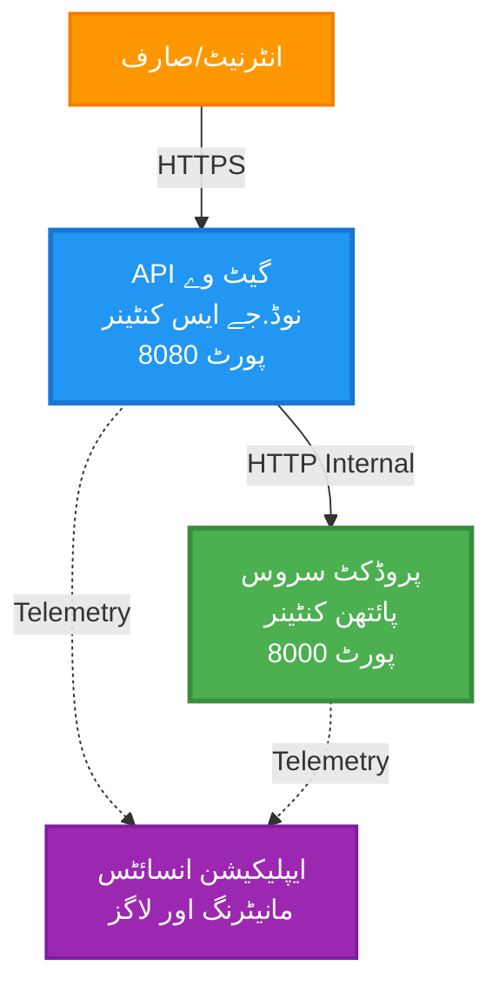
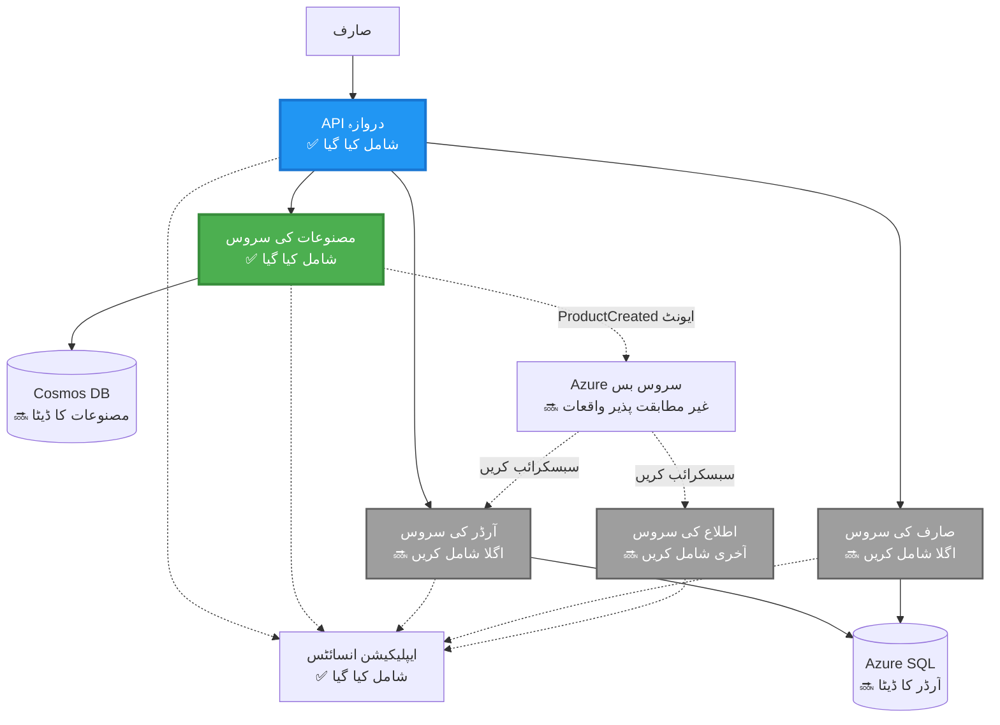
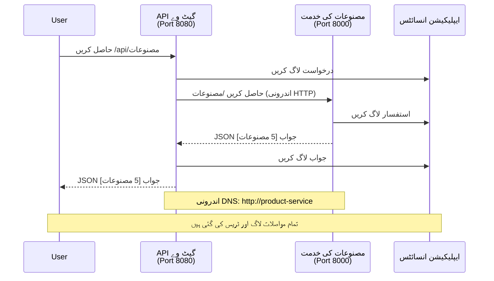

# مائیکروسروسیز آرکیٹیکچر - کنٹینر ایپ کی مثال

⏱️ **تخمینی وقت**: 25-35 منٹ | 💰 **تخمینی لاگت**: ~$50-100/ماہ | ⭐ **پیچیدگی**: اعلیٰ

**📚 سیکھنے کا راستہ:**
- ← پچھلا: [سادہ فلاسک API](../../../../examples/container-app/simple-flask-api) - واحد کنٹینر کی بنیادی باتیں
- 🎯 **آپ یہاں ہیں**: مائیکروسروسیز آرکیٹیکچر (2-سروس کی بنیاد)
- → اگلا: [AI انضمام](../../../../docs/ai-foundry) - اپنی خدمات میں ذہانت شامل کریں
- 🏠 [کورس ہوم](../../README.md)

---

AZD CLI استعمال کرتے ہوئے Azure Container Apps پر تعینات کردہ ایک **سادہ لیکن فعال** مائیکروسروسیز آرکیٹیکچر۔ اس مثال میں سروس سے سروس رابطہ، کنٹینر آرکیسٹریشن، اور مانیٹرنگ کو عملی 2-سروس سیٹ اپ کے ساتھ دکھایا گیا ہے۔

> **📚 سیکھنے کا طریقہ**: یہ مثال ایک کم از کم 2-سروس آرکیٹیکچر (API گیٹ وے + بیک اینڈ سروس) سے شروع ہوتی ہے جسے آپ حقیقت میں تعینات اور سیکھ سکتے ہیں۔ اس بنیاد پر عبور حاصل کرنے کے بعد، ہم مکمل مائیکروسروسیز ماحولیاتی نظام کی توسیع کے لیے رہنمائی فراہم کرتے ہیں۔

## آپ کیا سیکھیں گے

اس مثال کو مکمل کرکے، آپ:
- Azure Container Apps پر متعدد کنٹینرز تعینات کریں گے
- اندرونی نیٹ ورکنگ کے ساتھ سروس سے سروس رابطہ نافذ کریں گے
- ماحول کی بنیاد پر اسکیلنگ اور صحت کی جانچ ترتیب دیں گے
- Application Insights کے ذریعہ تقسیم شدہ ایپلیکیشنز کی مانیٹرنگ کریں گے
- مائیکروسروسیز تعیناتی کے نمونوں اور بہترین طریقوں کو سمجھیں گے
- سادہ سے پیچیدہ آرکیٹیکچرز کی طرف تدریجی توسیع سیکھیں گے

## آرکیٹیکچر

### مرحلہ 1: ہم کیا بنا رہے ہیں (اس مثال میں شامل)


**کمپونینٹ کی تفصیلات:**

| کمپونینٹ | مقصد | رسائی | وسائل |
|-----------|---------|--------|-----------|
| **API گیٹ وے** | بیرونی درخواستوں کو بیک اینڈ خدمات تک روٹ کرتا ہے | عوامی (HTTPS) | 1 vCPU, 2GB RAM, 2-20 نقول |
| **پروڈکٹ سروس** | ان میموری ڈیٹا کے ساتھ پروڈکٹ کیٹلاگ کا نظم کرتی ہے | صرف اندرونی | 0.5 vCPU, 1GB RAM, 1-10 نقول |
| **Application Insights** | مرکزی لاگنگ اور تقسیم شدہ ٹریسنگ | Azure پورٹل | 1-2 جی بی/ماہ ڈیٹا انٹیک |

**سادہ کیوں شروع کریں؟**
- ✅ جلد تعینات کریں اور سمجھیں (25-35 منٹ)
- ✅ پیچیدگی کے بغیر بنیادی مائیکروسروسیز پیٹرنز سیکھیں
- ✅ قابل عمل کوڈ جسے آپ ترمیم اور تجربہ کر سکتے ہیں
- ✅ سیکھنے کے لیے کم لاگت (~$50-100/ماہ بمقابلہ $300-1400/ماہ)
- ✅ ڈیٹابیس اور میسج کیوز شامل کرنے سے پہلے اعتماد بنائیں

**تمثیل**: اسے ڈرائیونگ سیکھنے کی طرح سمجھیں۔ آپ خالی پارکنگ لاٹ (2 خدمات) سے شروع کرتے ہیں، بنیادی باتیں سیکھتے ہیں، پھر شہر کی ٹریفک (5+ خدمات ڈیٹابیس کے ساتھ) کی طرف بڑھتے ہیں۔

### مرحلہ 2: مستقبل کی توسیع (حوالہ آرکیٹیکچر)

جب آپ 2-سروس آرکیٹیکچر میں مہارت حاصل کرلیں، تو آپ توسیع کر سکتے ہیں:


اختتامی حصے میں "توسیعی رہنما" سیکشن دیکھیں جس میں مرحلہ وار ہدایات ہیں۔

## شامل خصوصیات

✅ **سروس ڈسکوری**: کنٹینرز کے درمیان خودکار DNS پر مبنی دریافت  
✅ **لوڈ بیلنسنگ**: نقول کے درمیان بلٹ ان لوڈ بیلنسنگ  
✅ **خودکار اسکیلنگ**: ہر سروس کے لیے HTTP درخواستوں کی بنیاد پر خودمختار اسکیلنگ  
✅ **صحت کی مانیٹرنگ**: دونوں سروسز کے لیے لائیونیس اور ریڈی نیس پروبس  
✅ **تقسیم شدہ لاگنگ**: Application Insights کے ساتھ مرکزی لاگنگ  
✅ **اندرونی نیٹ ورکنگ**: محفوظ سروس سے سروس رابطہ  
✅ **کنٹینر آرکیسٹریشن**: خودکار تعیناتی اور اسکیلنگ  
✅ **زیرو ڈاؤن ٹائم اپ ڈیٹس**: ریویژن مینجمنٹ کے ساتھ رولنگ اپ ڈیٹس  

## شرائط

### ضروری اوزار

شروع کرنے سے پہلے، یقینی بنائیں کہ یہ اوزار انسٹال ہیں:

1. **[Azure Developer CLI (azd)](https://learn.microsoft.com/azure/developer/azure-developer-cli/install-azd)** (ورژن 1.0.0 یا اس سے زیادہ)
   ```bash
   azd version
   # متوقع نتیجہ: azd ورژن 1.0.0 یا اس سے زیادہ
   ```

2. **[Azure CLI](https://learn.microsoft.com/cli/azure/install-azure-cli)** (ورژن 2.50.0 یا اس سے زیادہ)
   ```bash
   az --version
   # متوقع نتیجہ: azure-cli 2.50.0 یا اس سے اوپر
   ```

3. **[Docker](https://www.docker.com/get-started)** (لوکل ڈیولپمنٹ/ٹیسٹنگ کے لیے - اختیاری)
   ```bash
   docker --version
   # متوقع نتائج: ڈوکر ورژن 20.10 یا اس سے زیادہ
   ```

### اپنی ترتیب کی تصدیق کریں

یہ کمانڈز چلائیں تاکہ تصدیق ہو جائے کہ آپ تیار ہیں:

```bash
# Azure Developer CLI کی جانچ کریں
azd version
# ✅ متوقع: azd ورژن 1.0.0 یا اس سے اوپر

# Azure CLI کی جانچ کریں
az --version
# ✅ متوقع: azure-cli ورژن 2.50.0 یا اس سے اوپر

# Docker کی جانچ کریں (اختیاری)
docker --version
# ✅ متوقع: Docker ورژن 20.10 یا اس سے اوپر
```

**کامیابی کا معیار**: تمام کمانڈز وہ ورژن نمبر واپس کریں جو کم سے کم ورژن کے برابر یا اس سے زیادہ ہوں۔

### Azure کی ضروریات

- ایک فعال **Azure سبسکرپشن** ([مفت اکاؤنٹ بنائیں](https://azure.microsoft.com/free/))
- سبسکرپشن میں وسائل بنانے کی اجازت
- سبسکرپشن یا ریسورس گروپ پر **Contributor** رول

### علمی شرائط

یہ ایک **اعلیٰ سطح کی** مثال ہے۔ آپ کو چاہیے کہ:
- [سادہ فلاسک API کی مثال](../../../../examples/container-app/simple-flask-api) مکمل کی ہو  
- مائیکروسروسیز آرکیٹیکچر کی بنیادی سمجھ ہو  
- REST APIs اور HTTP سے واقف ہوں  
- کنٹینر کے تصورات کو سمجھتے ہوں  

**کنٹینر ایپس میں نئے ہیں؟** بنیادیات سیکھنے کے لیے پہلے [سادہ فلاسک API کی مثال](../../../../examples/container-app/simple-flask-api) سے شروع کریں۔

## فوری آغاز (مرحلہ وار)

### مرحلہ 1: کلون کریں اور نیویگیٹ کریں

```bash
git clone https://github.com/microsoft/AZD-for-beginners.git
cd AZD-for-beginners/examples/microservices
```

**✓ کامیابی کی جانچ**: تصدیق کریں کہ `azure.yaml` نظر آ رہا ہے:
```bash
ls
# متوقع: README.md, azure.yaml, infra/, src/
```

### مرحلہ 2: Azure کے ساتھ توثیق کریں

```bash
azd auth login
```

یہ آپ کے براؤزر میں Azure کی توثیق کے لئے کھلتا ہے۔ اپنے Azure اسناد سے سائن ان کریں۔

**✓ کامیابی کی جانچ**: آپ کو یہ نظر آنا چاہیے:
```
Logged in to Azure.
```

### مرحلہ 3: ماحول کی ابتدائی ترتیب

```bash
azd init
```

**آپ کو جو پرامپٹس دکھائی دیں گے**:
- **ماحول کا نام**: ایک مختصر نام درج کریں (مثلاً `microservices-dev`)
- **Azure سبسکرپشن**: اپنی سبسکرپشن منتخب کریں
- **Azure مقام**: ایک علاقہ منتخب کریں (مثلاً `eastus`, `westeurope`)

**✓ کامیابی کی جانچ**: آپ کو یہ نظر آنا چاہیے:
```
SUCCESS: New project initialized!
```

### مرحلہ 4: انفراسٹرکچر اور خدمات تعینات کریں

```bash
azd up
```

**کیا ہوگا** (8-12 منٹ لگیں گے):

```mermaid
graph LR
    A[azd up] --> B[ریسورس گروپ بنائیں]
    B --> C[کنٹینر رجسٹری تعینات کریں]
    C --> D[لاگ اینالٹکس تعینات کریں]
    D --> E[ایپ انسائٹس تعینات کریں]
    E --> F[کنٹینر ماحول بنائیں]
    F --> G[API گیٹ وے امیج بنائیں]
    F --> H[پروڈکٹ سروس امیج بنائیں]
    G --> I[رجسٹری میں بھیجیں]
    H --> I
    I --> J[API گیٹ وے تعینات کریں]
    I --> K[پروڈکٹ سروس تعینات کریں]
    J --> L[انگریس اور ہیلتھ چیکس ترتیب دیں]
    K --> L
    L --> M[تعییناتی عمل مکمل ✓]
    
    style A fill:#2196F3,stroke:#1976D2,stroke-width:3px,color:#fff
    style M fill:#4CAF50,stroke:#388E3C,stroke-width:3px,color:#fff
```


**✓ کامیابی کی جانچ**: آپ کو یہ نظر آنا چاہیے:
```
SUCCESS: Your application was deployed to Azure in X minutes Y seconds.
Endpoint: https://api-gateway-<unique-id>.azurecontainerapps.io
```

**⏱️ وقت**: 8-12 منٹ

### مرحلہ 5: تعیناتی کی جانچ کریں

```bash
# گیٹ وے اینڈ پوائنٹ حاصل کریں
GATEWAY_URL=$(azd env get-values | grep API_GATEWAY_URL | cut -d '=' -f2 | tr -d '"')

# API گیٹ وے کی صحت کا ٹیسٹ کریں
curl $GATEWAY_URL/health
```

**✅ متوقع آؤٹ پٹ:**
```json
{
  "status": "healthy",
  "service": "api-gateway",
  "timestamp": "2025-11-19T10:30:00Z"
}
```

**گیٹ وے کے ذریعے پروڈکٹ سروس کی جانچ:**
```bash
# مصنوعات کی فہرست بنائیں
curl $GATEWAY_URL/api/products
```

**✅ متوقع آؤٹ پٹ:**
```json
[
  {"id":1,"name":"Laptop","price":999.99,"stock":50},
  {"id":2,"name":"Mouse","price":29.99,"stock":200},
  {"id":3,"name":"Keyboard","price":79.99,"stock":150}
]
```

**✓ کامیابی کی جانچ**: دونوں اینڈ پوائنٹس بغیر کسی غلطی کے JSON ڈیٹا واپس کرتے ہیں۔

---

**🎉 مبارک ہو!** آپ نے Azure پر مائیکروسروسیز آرکیٹیکچر تعینات کر لیا ہے!

## پروجیکٹ کا ڈھانچہ

تمام نفاذ فائلیں شامل ہیں—یہ ایک مکمل، کام کرنے والی مثال ہے:

```
microservices/
│
├── README.md                         # This file
├── azure.yaml                        # AZD configuration
├── .gitignore                        # Git ignore patterns
│
├── infra/                           # Infrastructure as Code (Bicep)
│   ├── main.bicep                   # Main orchestration
│   ├── abbreviations.json           # Naming conventions
│   ├── core/                        # Shared infrastructure
│   │   ├── container-apps-environment.bicep  # Container environment + registry
│   │   └── monitor.bicep            # Application Insights + Log Analytics
│   └── app/                         # Service definitions
│       ├── api-gateway.bicep        # API Gateway container app
│       └── product-service.bicep    # Product Service container app
│
└── src/                             # Application source code
    ├── api-gateway/                 # Node.js API Gateway
    │   ├── app.js                   # Express server with routing
    │   ├── package.json             # Node dependencies
    │   └── Dockerfile               # Container definition
    └── product-service/             # Python Product Service
        ├── main.py                  # Flask API with product data
        ├── requirements.txt         # Python dependencies
        └── Dockerfile               # Container definition
```

**ہر کمپونینٹ کے کام:**

**انفراسٹرکچر (infra/)**:
- `main.bicep`: تمام Azure وسائل اور ان کی انحصاریوں کا انتظام کرتا ہے
- `core/container-apps-environment.bicep`: کنٹینر ایپلیکیشنز ماحول اور Azure Container Registry بناتا ہے
- `core/monitor.bicep`: تقسیم شدہ لاگنگ کے لیے Application Insights سیٹ اپ کرتا ہے
- `app/*.bicep`: انفرادی کنٹینر ایپلی کیشن کی تعریفیں اسکیلنگ اور صحت کی جانچ کے ساتھ

**API گیٹ وے (src/api-gateway/)**:
- عوامی سروس جو درخواستوں کو بیک اینڈ سروسز تک روٹ کرتی ہے
- لاگنگ، ایرر ہینڈلنگ، اور درخواست فارورڈنگ نافذ کرتی ہے
- سروس سے سروس HTTP رابطہ کا مظاہرہ کرتی ہے

**پروڈکٹ سروس (src/product-service/)**:
- سادہ ان میموری پروڈکٹ کیٹلاگ کے ساتھ اندرونی سروس
- REST API صحت کی جانچ کے ساتھ
- بیک اینڈ مائیکروسرویس پیٹرن کی مثال

## خدمات کا جائزہ

### API گیٹ وے (Node.js/Express)

**پورٹ**: 8080  
**رسائی**: عوامی (بیرونی انگریس)  
**مقصد**: آنے والی درخواستوں کو متعلقہ بیک اینڈ خدمات تک روٹ کرنا  

**اینڈ پوائنٹس**:
- `GET /` - سروس معلومات
- `GET /health` - صحت کی جانچ کا اینڈ پوائنٹ
- `GET /api/products` - پروڈکٹ سروس کے لیے فارورڈ (سب کو لسٹ کریں)
- `GET /api/products/:id` - پروڈکٹ سروس کے لیے فارورڈ (ID کے ذریعے حاصل کریں)

**اہم خصوصیات**:
- axios کے ساتھ درخواست کی روٹنگ
- مرکزی لاگنگ
- ایرر ہینڈلنگ اور ٹائم آؤٹ مینجمنٹ
- ماحول کی متغیرات کے ذریعے سروس دریافت
- Application Insights انضمام

**کوڈ کی جھلک** (`src/api-gateway/app.js`):
```javascript
// داخلی سروس مواصلات
app.get('/api/products', async (req, res) => {
  const response = await axios.get(`${PRODUCT_SERVICE_URL}/products`, {
    timeout: 5000
  });
  res.json(response.data);
});
```

### پروڈکٹ سروس (Python/Flask)

**پورٹ**: 8000  
**رسائی**: صرف اندرونی (کوئی بیرونی انگریس نہیں)  
**مقصد**: ان میموری ڈیٹا کے ساتھ پروڈکٹ کیٹلاگ کا انتظام  

**اینڈ پوائنٹس**:
- `GET /` - سروس معلومات
- `GET /health` - صحت کی جانچ کا اینڈ پوائنٹ
- `GET /products` - تمام مصنوعات کی فہرست
- `GET /products/<id>` - ID کے ذریعے پروڈکٹ حاصل کریں

**اہم خصوصیات**:
- Flask کے ساتھ RESTful API
- سادہ ان میموری پروڈکٹ اسٹور (ڈیٹابیس کی ضرورت نہیں)
- صحت کی مانیٹرنگ کے لیے پروبز
- منظم لاگنگ
- Application Insights انضمام

**ڈیٹا ماڈل**:
```python
{
  "id": 1,
  "name": "Laptop",
  "description": "High-performance laptop",
  "price": 999.99,
  "stock": 50
}
```

**صرف اندرونی کیوں؟**
پروڈکٹ سروس عوامی طور پر دستیاب نہیں ہے۔ تمام درخواستیں API گیٹ وے کے ذریعے جانا لازمی ہیں، جو مہیا کرتی ہے:
- سیکیورٹی: کنٹرول شدہ رسائی کا پوائنٹ
- لچک: بیک اینڈ کو کلائنٹس کو متاثر کیے بغیر تبدیل کیا جا سکتا ہے
- مانیٹرنگ: مرکزی درخواست لاگنگ

## سروسز کے مابین رابطے کو سمجھنا

### سروسز کیسے بات کرتی ہیں


اس مثال میں، API گیٹ وے پروڈکٹ سروس کے ساتھ **اندرونی HTTP کالز** کے ذریعے بات کرتا ہے:

```javascript
// اے پی آئی گیٹ وے (src/api-gateway/app.js)
const PRODUCT_SERVICE_URL = process.env.PRODUCT_SERVICE_URL;

// اندرونی HTTP درخواست کریں
const response = await axios.get(`${PRODUCT_SERVICE_URL}/products`);
```

**اہم نکات**:

1. **DNS پر مبنی دریافت**: کنٹینر ایپز خودکار طور پر اندرونی سروسز کے لیے DNS فراہم کرتے ہیں  
   - پروڈکٹ سروس FQDN: `product-service.internal.<environment>.azurecontainerapps.io`  
   - آسان شکل: `http://product-service` (کنٹینر ایپس اسے حل کر دیتا ہے)

2. **کوئی عوامی نمائش نہیں**: پروڈکٹ سروس بائسپ میں `external: false` ہے  
   - صرف کنٹینر ایپ محیط میں قابل رسائی  
   - انٹرنیٹ سے قابل رسائی نہیں

3. **ماحول کی متغیرات**: سروس URLs تعیناتی کے وقت انجیکٹ کیے جاتے ہیں  
   - بائسپ گیٹ وے کو اندرونی FQDN دیتا ہے  
   - ایپلی کیشن کوڈ میں ہارڈ کوڈڈ URLs نہیں ہوتے

**تمثیل**: اسے دفتر کے کمرے سمجھیں۔ API گیٹ وے استقبالیہ ڈیسک ہے (عوامی)، اور پروڈکٹ سروس دفتر کا کمرہ ہے (صرف اندرونی)۔ زائرین کو کسی بھی دفتر تک پہنچنے کے لیے استقبالیہ سے گزرنا پڑتا ہے۔

## تعیناتی کے اختیارات

### مکمل تعیناتی (تجویز کردہ)

```bash
# انفراسٹرکچر اور دونوں سروسز کو تعینات کریں
azd up
```

یہ تعینات کرتا ہے:
1. کنٹینر ایپز ماحول
2. Application Insights
3. کنٹینر رجسٹری
4. API گیٹ وے کنٹینر
5. پروڈکٹ سروس کنٹینر

**وقت**: 8-12 منٹ

### انفرادی سروس کی تعیناتی

```bash
# (پہلے azd up کے بعد) صرف ایک سروس تعینات کریں
azd deploy api-gateway

# یا پروڈکٹ سروس تعینات کریں
azd deploy product-service
```

**استعمال کا کیس**: جب آپ نے کسی ایک سروس کا کوڈ اپڈیٹ کیا ہو اور صرف وہی سروس دوبارہ تعینات کرنا چاہتے ہوں۔

### ترتیب کی تازہ کاری

```bash
# اسکیلنگ کے پیرامیٹرز تبدیل کریں
azd env set GATEWAY_MAX_REPLICAS 30

# نئی ترتیب کے ساتھ دوبارہ تعینات کریں
azd up
```

## ترتیب

### اسکیلنگ کی ترتیب

دونوں سروسز اپنے بائسپ فائلز میں HTTP پر مبنی خودکار اسکیلنگ کے ساتھ ترتیب دی گئی ہیں:

**API گیٹ وے**:
- کم از کم نقول: 2 (ہمیشہ کم از کم 2 دستیاب)
- زیادہ سے زیادہ نقول: 20
- اسکیل ٹریگر: فی نقل 50 متوازی درخواستیں

**پروڈکٹ سروس**:
- کم از کم نقول: 1 (ضرورت پڑنے پر صفر تک اسکیل کر سکتا ہے)
- زیادہ سے زیادہ نقول: 10
- اسکیل ٹریگر: فی نقل 100 متوازی درخواستیں

**اسکیلنگ کو حسب ضرورت تبدیل کریں** (`infra/app/*.bicep` میں):
```bicep
scale: {
  minReplicas: 1
  maxReplicas: 10
  rules: [
    {
      name: 'http-scale-rule'
      http: {
        metadata: {
          concurrentRequests: '100'  // Adjust this
        }
      }
    }
  ]
}
```

### وسائل کی تقسیم

**API گیٹ وے**:
- CPU: 1.0 vCPU
- میموری: 2 جی بی
- وجہ: تمام بیرونی ٹریفک کو ہینڈل کرتا ہے

**پروڈکٹ سروس**:
- CPU: 0.5 vCPU
- میموری: 1 جی بی
- وجہ: ہلکے پھلکے ان میموری آپریشنز

### صحت کی جانچ

دونوں سروسز لائیونیس اور ریڈی نیس پروبز شامل کرتے ہیں:

```bicep
probes: [
  {
    type: 'Liveness'
    httpGet: {
      path: '/health'
      port: 8080
    }
    initialDelaySeconds: 10
    periodSeconds: 30
  }
  {
    type: 'Readiness'
    httpGet: {
      path: '/health'
      port: 8080
    }
    initialDelaySeconds: 5
    periodSeconds: 10
  }
]
```

**اس کا مطلب کیا ہے**:
- **لائیونیس**: اگر صحت کی جانچ ناکام ہو تو کنٹینر ایپ دوبارہ شروع کرے گا
- **ریڈی نیس**: اگر تیار نہیں ہے، تو کنٹینر ایپ اس نقل کو ٹریفک روٹ کرنا بند کرے گا

## مانیٹرنگ اور نگرانی

### سروس لاگز دیکھیں

```bash
# لاگز دیکھیں azd موزوں کے ذریعے
azd monitor --logs

# یا مخصوص کنٹینر ایپس کے لیے Azure CLI استعمال کریں:
# API گیٹ وے سے لاگز براہِ راست دیکھیں
az containerapp logs show --name api-gateway --resource-group $RG_NAME --follow

# حالیہ پراڈکٹ سروس لاگز دیکھیں
az containerapp logs show --name product-service --resource-group $RG_NAME --tail 100
```

**متوقع آؤٹ پٹ**:
```
[api-gateway] API Gateway listening on port 8080
[api-gateway] Product Service URL: http://product-service
[api-gateway] GET /api/products 200 - 45ms
[product-service] Retrieved 5 products
```

### Application Insights کے سوالات

Azure پورٹل میں Application Insights تک رسائی حاصل کریں، پھر یہ سوالات چلائیں:

**آہستہ درخواستیں تلاش کریں**:
```kusto
requests
| where timestamp > ago(1h)
| where duration > 1000  // Requests taking >1 second
| summarize count() by name, cloud_RoleName
| order by count_ desc
```

**سروس سے سروس کالز کا پتہ لگائیں**:
```kusto
dependencies
| where timestamp > ago(1h)
| where type == "Http"
| project timestamp, name, target, duration, success
| order by timestamp desc
```

**سروسز کے حساب سے نقصانات کی شرح**:
```kusto
exceptions
| where timestamp > ago(24h)
| summarize errorCount = count() by cloud_RoleName, type
| order by errorCount desc
```

**درخواستوں کا حجم وقت کے ساتھ**:
```kusto
requests
| where timestamp > ago(1h)
| summarize requestCount = count() by bin(timestamp, 5m), cloud_RoleName
| render timechart
```

### مانیٹرنگ ڈیش بورڈ تک رسائی

```bash
# ایپلیکیشن انسائٹس کی تفصیلات حاصل کریں
azd env get-values | grep APPLICATIONINSIGHTS

# ایزور پورٹل مانیٹرنگ کھولیں
az monitor app-insights component show \
  --app $(azd env get-values | grep APPLICATIONINSIGHTS_CONNECTION_STRING | cut -d '=' -f2) \
  --resource-group $(azd env get-values | grep AZURE_RESOURCE_GROUP | cut -d '=' -f2) \
  --query "appId" -o tsv
```

### لائیو میٹرکس

1. Azure پورٹل میں Application Insights پر جائیں  
2. "Live Metrics" پر کلک کریں  
3. حقیقی وقت کی درخواستیں، ناکامیاں، اور کارکردگی دیکھیں  
4. ٹیسٹ کرنے کے لیے چلائیں: `curl $(azd env get-values | grep API_GATEWAY_URL | cut -d '=' -f2 | tr -d '"')/api/products`

## عملی مشقیں

### مشق 1: نیا پروڈکٹ اینڈ پوائنٹ شامل کریں ⭐ (آسان)

**مقصد**: نئی مصنوعات بنانے کے لیے POST اینڈ پوائنٹ شامل کریں

**شروعاتی نقطہ**: `src/product-service/main.py`

**مراحل**:

1. `get_product` فنکشن کے بعد `main.py` میں یہ اینڈ پوائنٹ شامل کریں:

```python
@app.route('/products', methods=['POST'])
def create_product():
    """Create a new product"""
    data = request.get_json()
    
    # ضروری فیلڈز کی تصدیق کریں
    if not data or 'name' not in data or 'price' not in data:
        return jsonify({'error': 'Missing required fields: name, price'}), 400
    
    new_id = max(p['id'] for p in products) + 1
    new_product = {
        'id': new_id,
        'name': data['name'],
        'description': data.get('description', ''),
        'price': float(data['price']),
        'stock': int(data.get('stock', 0))
    }
    products.append(new_product)
    logger.info(f"Created product {new_id}")
    return jsonify(new_product), 201
```

2. API گیٹ وے میں POST روٹ شامل کریں (`src/api-gateway/app.js`):

```javascript
// اس کو GET /api/products روٹ کے بعد شامل کریں
app.post('/api/products', async (req, res) => {
  try {
    console.log(`Forwarding POST request to ${PRODUCT_SERVICE_URL}/products`);
    const response = await axios.post(`${PRODUCT_SERVICE_URL}/products`, req.body, {
      timeout: 5000
    });
    res.status(201).json(response.data);
  } catch (error) {
    console.error('Error calling product service:', error.message);
    res.status(503).json({
      error: 'Product service unavailable',
      message: error.message
    });
  }
});
```

3. دونوں خدمات کو دوبارہ تعینات کریں:

```bash
azd deploy product-service
azd deploy api-gateway
```

4. نئے اینڈ پوائنٹ کی جانچ کریں:

```bash
GATEWAY_URL=$(azd env get-values | grep API_GATEWAY_URL | cut -d '=' -f2 | tr -d '"')

# نیا پروڈکٹ بنائیں
curl -X POST $GATEWAY_URL/api/products \
  -H "Content-Type: application/json" \
  -d '{"name":"USB Cable","price":9.99,"stock":500}'
```

**✅ متوقع نتیجہ:**
```json
{"id":6,"name":"USB Cable","description":"","price":9.99,"stock":500}
```

5. تصدیق کریں کہ یہ فہرست میں ظاہر ہوتا ہے:

```bash
curl $GATEWAY_URL/api/products
# اب 6 مصنوعات دکھائی جانی چاہئیں جن میں نیا USB کیبل بھی شامل ہے
```

**کامیابی کے معیارات**:
- ✅ POST درخواست HTTP 201 واپس کرتی ہے
- ✅ نیا پراڈکٹ GET /api/products کی فہرست میں ظاہر ہوتا ہے
- ✅ پراڈکٹ کا ID خود بخود بڑھا ہوا ہے

**وقت**: 10-15 منٹ

---

### مشق 2: آٹو اسکیلنگ قوانین میں تبدیلی ⭐⭐ (درمیانہ)

**مقصد**: پراڈکٹ سروس کو زیادہ جارحانہ اسکیل کرنا

**ابتدائی نقطہ**: `infra/app/product-service.bicep`

**اقدامات**:

1. `infra/app/product-service.bicep` کھولیں اور `scale` بلاک تلاش کریں (تقریباً لائن 95 کے آس پاس)

2. تبدیل کریں:
```bicep
scale: {
  minReplicas: 1
  maxReplicas: 10
  rules: [
    {
      name: 'http-scale-rule'
      http: {
        metadata: {
          concurrentRequests: '100'  // OLD
        }
      }
    }
  ]
}
```

اس میں:
```bicep
scale: {
  minReplicas: 2  // Always have 2 running
  maxReplicas: 20  // Allow more scaling
  rules: [
    {
      name: 'http-scale-rule'
      http: {
        metadata: {
          concurrentRequests: '20'  // Scale at lower threshold
        }
      }
    }
  ]
}
```

3. انفراسٹرکچر کو دوبارہ تعینات کریں:

```bash
azd up
```

4. نئی اسکیلنگ کنفیگریشن کی تصدیق کریں:

```bash
az containerapp show \
  --name $(azd env get-values | grep PRODUCT_SERVICE | head -1 | cut -d '/' -f5) \
  --resource-group $(azd env get-values | grep AZURE_RESOURCE_GROUP | cut -d '=' -f2 | tr -d '"') \
  --query "properties.template.scale" -o json
```

**✅ متوقع نتیجہ:**
```json
{
  "minReplicas": 2,
  "maxReplicas": 20,
  "rules": [...]
}
```

5. لوڈ کے ساتھ آٹو اسکیلنگ کی جانچ کریں:

```bash
# بیک وقت درخواستیں بنائیں
for i in {1..500}; do curl $GATEWAY_URL/api/products & done

# Azure CLI استعمال کرکے سکیلنگ دیکھیں
az containerapp logs show --name product-service --resource-group $RG_NAME --follow
# تلاش کریں: کنٹینر ایپس سکیلنگ کے واقعات
```

**کامیابی کے معیارات**:
- ✅ پراڈکٹ سروس ہمیشہ کم از کم 2 نقول پر چلتی ہے
- ✅ لوڈ کے تحت، 2 سے زیادہ نقول پر اسکیل کرتی ہے
- ✅ Azure پورٹل پر نئے اسکیلنگ قوانین دکھائے جاتے ہیں

**وقت**: 15-20 منٹ

---

### مشق 3: کسٹم مانیٹرنگ کوئری شامل کریں ⭐⭐ (درمیانہ)

**مقصد**: پراڈکٹ API کی کارکردگی کو ٹریک کرنے کے لیے کسٹم Application Insights کوئری بنائیں

**اقدامات**:

1. Azure پورٹل میں Application Insights پر جائیں:
   - Azure پورٹل پر جائیں
   - اپنا resource group تلاش کریں (rg-microservices-*)
   - Application Insights ریسورس پر کلک کریں

2. بائیں مینو میں "Logs" پر کلک کریں

3. یہ کوئری بنائیں:

```kusto
requests
| where timestamp > ago(1h)
| where name contains "products"
| summarize 
    RequestCount = count(),
    AvgDuration = avg(duration),
    P95Duration = percentile(duration, 95),
    SuccessRate = 100.0 * countif(success == true) / count()
  by bin(timestamp, 5m)
| render timechart
```

4. کوئری چلانے کے لیے "Run" پر کلک کریں

5. کوئری کو محفوظ کریں:
   - "Save" پر کلک کریں
   - نام: "Product API Performance"
   - زمرہ: "Performance"

6. ٹیسٹ ٹریفک پیدا کریں:

```bash
for i in {1..100}; do curl $GATEWAY_URL/api/products; sleep 1; done
```

7. ڈیٹا دیکھنے کے لیے کوئری کو ریفریش کریں

**✅ متوقع نتیجہ:**
- درخواستوں کی تعداد کا وقت کے ساتھ چارٹ
- اوسط مدت < 500ms
- کامیابی کی شرح = 100%
- 5 منٹ کے وقفے کے وقت بنز

**کامیابی کے معیارات**:
- ✅ کوئری 100+ درخواستیں دکھاتی ہے
- ✅ کامیابی کی شرح 100% ہے
- ✅ اوسط مدت < 500ms ہے
- ✅ چارٹ 5 منٹ کے وقفے دکھاتا ہے

**سیکھنے کا نتیجہ**: کسٹم کوئریز کے ساتھ سروس کی کارکردگی کی مانیٹرنگ کا سمجھنا

**وقت**: 10-15 منٹ

---

### مشق 4: ریٹرآئی لاجک نافذ کریں ⭐⭐⭐ (اعلی)

**مقصد**: جب پراڈکٹ سروس عارضی طور پر دستیاب نہ ہو تو API گیٹ وے میں ریٹرآئی لاجک شامل کریں

**ابتدائی نقطہ**: `src/api-gateway/app.js`

**اقدامات**:

1. ریٹرآئی لائبریری انسٹال کریں:

```bash
cd src/api-gateway
npm install axios-retry --save
cd ../..
```

2. `src/api-gateway/app.js` کو اپڈیٹ کریں (axios امپورٹ کے بعد شامل کریں):

```javascript
const axiosRetry = require('axios-retry');

// دوبارہ کوشش کی منطق مرتب کریں
axiosRetry(axios, {
  retries: 3,
  retryDelay: (retryCount) => {
    return retryCount * 1000; // ۱ سیکنڈ، ۲ سیکنڈ، ۳ سیکنڈ
  },
  retryCondition: (error) => {
    // نیٹ ورک کی غلطیوں یا ۵xx جوابات پر دوبارہ کوشش کریں
    return axiosRetry.isNetworkOrIdempotentRequestError(error) ||
           (error.response && error.response.status >= 500);
  }
});

console.log('Retry logic configured: 3 retries with exponential backoff');
```

3. API گیٹ وے کو دوبارہ تعینات کریں:

```bash
azd deploy api-gateway
```

4. سروس کی ناکامی کا نقشہ بنا کر ریٹرآئی رویہ کی جانچ کریں:

```bash
# مصنوعات کی خدمت کو 0 پر لے جائیں (ناکامی کی نقل کریں)
az containerapp update \
  --name $(azd env get-values | grep PRODUCT_SERVICE | head -1 | cut -d '/' -f5) \
  --resource-group $(azd env get-values | grep AZURE_RESOURCE_GROUP | cut -d '=' -f2 | tr -d '"') \
  --min-replicas 0 \
  --max-replicas 0

# مصنوعات تک رسائی کی کوشش کریں (3 بار دوبارہ کوشش کرے گا)
time curl -v $GATEWAY_URL/api/products
# ملاحظہ کریں: جواب میں تقریباً 6 سیکنڈ لگتے ہیں (1س + 2س + 3س دوبارہ کوششیں)

# مصنوعات کی خدمت کو بحال کریں
az containerapp update \
  --name $(azd env get-values | grep PRODUCT_SERVICE | head -1 | cut -d '/' -f5) \
  --resource-group $(azd env get-values | grep AZURE_RESOURCE_GROUP | cut -d '=' -f2 | tr -d '"') \
  --min-replicas 1 \
  --max-replicas 10
```

5. ریٹرآئی لاگز دیکھیں:

```bash
az containerapp logs show --name api-gateway --resource-group $RG_NAME --tail 50
# تلاش کریں: کوشش دوبارہ کرنے کے پیغامات
```

**✅ متوقع رویہ:**
- درخواستیں ناکامی سے پہلے 3 بار ریٹری ہوتی ہیں
- ہر ریٹری زیادہ دیر انتظار کرتی ہے (1 سیکنڈ، 2 سیکنڈ، 3 سیکنڈ)
- سروس کے دوبارہ شروع ہونے کے بعد کامیاب درخواستیں
- لاگز میں ریٹرآئی کوششیں دکھائی جاتی ہیں

**کامیابی کے معیارات**:
- ✅ درخواستیں ناکامی سے پہلے 3 بار ریٹری ہوتی ہیں
- ✅ ہر ریٹری زیادہ دیر انتظار کرتی ہے (ایکسپونینشل بیک آفس)
- ✅ سروس کے دوبارہ شروع ہونے کے بعد کامیاب درخواستیں
- ✅ لاگز میں ریٹرآئی کوششیں دکھائی جاتی ہیں

**سیکھنے کا نتیجہ**: مائیکروسروسز میں مضبوطی کے انداز (سرکٹ بریکرز، ریٹریز، ٹائم آؤٹس) کا سمجھنا

**وقت**: 20-25 منٹ

---

## علم کی جانچ

اس مثال کو مکمل کرنے کے بعد اپنی سمجھ کی تصدیق کریں:

### 1. سروس کمیونیکیشن ✓

اپنا علم آزمائیں:
- [ ] کیا آپ وضاحت کر سکتے ہیں کہ API گیٹ وے پراڈکٹ سروس کو کیسے دریافت کرتا ہے؟ (DNS پر مبنی سروس ڈسکوری)
- [ ] اگر پراڈکٹ سروس بند ہو جائے تو کیا ہوتا ہے؟ (گیٹ وے 503 کی خرابی واپس کرتا ہے)
- [ ] آپ تیسری سروس کیسے شامل کریں گے؟ (نیا Bicep فائل بنائیں، main.bicep میں شامل کریں، src فولڈر بنائیں)

**عملی تصدیق:**
```bash
# سروس کی ناکامی کی نقل کریں
az containerapp update --name <product-service-name> --min-replicas 0 --max-replicas 0
curl $GATEWAY_URL/api/products
# ✅ متوقع: 503 سروس دستیاب نہیں

# سروس بحال کریں
az containerapp update --name <product-service-name> --min-replicas 1 --max-replicas 10
```

### 2. مانیٹرنگ اور مشاہدہ ✓

اپنا علم آزمائیں:
- [ ] آپ تقسیم شدہ لاگز کہاں دیکھتے ہیں؟ (Azure پورٹل کے Application Insights میں)
- [ ] سست درخواستوں کو آپ کیسے ٹریک کرتے ہیں؟ (Kusto کوئری: `requests | where duration > 1000`)
- [ ] آپ یہ کیسے معلوم کریں کہ کون سی سروس نے خرابی پیدا کی؟ (لاگز میں `cloud_RoleName` فیلڈ چیک کریں)

**عملی تصدیق:**
```bash
# ایک سست درخواست کی نقل تیار کریں
curl "$GATEWAY_URL/api/products?delay=2000"

# سست درخواستوں کے لیے ایپلیکیشن انسائٹس میں تلاش کریں
# ایزور پورٹل → ایپلیکیشن انسائٹس → لاگز پر جائیں
# یہ چلاؤ: requests | where duration > 1000 | project timestamp, name, duration, cloud_RoleName
```

### 3. اسکیلنگ اور کارکردگی ✓

اپنا علم آزمائیں:
- [ ] آٹو اسکیلنگ کو کیا متحرک کرتا ہے؟ (HTTP متوازی درخواستوں کے قواعد: گیٹ وے کے لئے 50، پراڈکٹ کے لئے 100)
- [ ] اب کتنی نقول چل رہی ہیں؟ (`az containerapp revision list` سے چیک کریں)
- [ ] آپ پراڈکٹ سروس کو 5 نقول پر کیسے اسکیل کریں گے؟ (Bicep میں minReplicas اپڈیٹ کریں)

**عملی تصدیق:**
```bash
# آٹو اسکیلنگ کی جانچ کرنے کے لیے لوڈ پیدا کریں
for i in {1..1000}; do curl $GATEWAY_URL/api/products & done

# Azure CLI کا استعمال کرتے ہوئے ریپلیکس میں اضافے کو دیکھیں
az containerapp logs show --name api-gateway --resource-group $RG_NAME --follow
# ✅ متوقع: لاگز میں اسکیلنگ واقعات دیکھیں
```

**کامیابی کے معیارات**: آپ تمام سوالات کے جواب دے سکتے ہیں اور عملی کمانڈز سے تصدیق کر سکتے ہیں۔

---

## لاگت کا تجزیہ

### ماہانہ متوقع لاگت (اس 2-سروس کی مثال کے لیے)

| وسائل       | کنفیگریشن                     | متوقع لاگت    |
|-------------|------------------------------|---------------|
| API گیٹ وے    | 2-20 نقول، 1 vCPU، 2GB RAM   | $30-150       |
| پراڈکٹ سروس  | 1-10 نقول، 0.5 vCPU، 1GB RAM | $15-75        |
| کنٹینر رجسٹری | بنیادی سطح                   | $5            |
| Application Insights | 1-2 GB/ماہ             | $5-10         |
| Log Analytics | 1 GB/ماہ                    | $3            |
| **کل**       |                              | **$58-243/ماہ** |

### استعمال کے حساب سے لاگت کی تفصیل

**ہلکا ٹریفک** (جانچ/سیکھنے کے لیے): تقریبا $60/ماہ
- API گیٹ وے: 2 نقول × 24/7 = $30
- پراڈکٹ سروس: 1 نقل × 24/7 = $15
- مانیٹرنگ + رجسٹری = $13

**درمیانہ ٹریفک** (چھوٹا پروڈکشن): تقریبا $120/ماہ
- API گیٹ وے: اوسط 5 نقول = $75
- پراڈکٹ سروس: اوسط 3 نقول = $45
- مانیٹرنگ + رجسٹری = $13

**زیادہ ٹریفک** (مصروف اوقات): تقریبا $240/ماہ
- API گیٹ وے: اوسط 15 نقول = $225
- پراڈکٹ سروس: اوسط 8 نقول = $120
- مانیٹرنگ + رجسٹری = $13

### لاگت کو بہتر بنانے کے لیے تجاویز

1. **ڈیولپمنٹ کے لیے صفر تک اسکیل کریں**:
   ```bicep
   scale: {
     minReplicas: 0  // Save $30-40/month when not in use
     maxReplicas: 10
   }
   ```

2. **Cosmos DB کے لیے Consumption Plan استعمال کریں** (جب آپ اسے شامل کریں):
   - صرف استعمال کے مطابق ادائیگی کریں
   - کوئی کم از کم چارج نہیں

3. **Application Insights سیمپلنگ سیٹ کریں**:
   ```javascript
   appInsights.defaultClient.config.samplingPercentage = 50; // درخواستوں کا 50٪ نمونہ لیں
   ```

4. **جب ضرورت نہ ہو تو صاف کریں**:
   ```bash
   azd down --force --purge
   ```

### مفت سطح کے اختیارات

سیکھنے/جانچ کے لیے غور کریں:
- ✅ Azure مفت کریڈٹس استعمال کریں ($200 ابتدائی 30 دن کے لیے نئے اکاؤنٹس کے ساتھ)
- ✅ کم از کم نقول رکھیں (تقریباً 50% لاگت بچاتا ہے)
- ✅ جانچ کے بعد حذف کریں (کوئی جاری چارجز نہیں)
- ✅ سیکھنے کے سیشنز کے درمیان صفر تک اسکیل کریں

**مثال**: اگر یہ مثال روزانہ 2 گھنٹے × 30 دن چلائیں تو تقریباً $5/ماہ آئے گا بجائے $60 کے

---

## مسئلے کا فوری حوالہ

### مسئلہ: `azd up` "Subscription not found" کی خرابی دیتا ہے

**حل**:
```bash
# صریح رکنیت کے ساتھ دوبارہ لاگ ان کریں
az account set --subscription <your-subscription-id>
azd env set AZURE_SUBSCRIPTION_ID <your-subscription-id>
azd up
```

### مسئلہ: API گیٹ وے 503 "Product service unavailable" واپس کرتا ہے

**تشخیص**:
```bash
# آزور CLI کا استعمال کرتے ہوئے پروڈکٹ سروس لاگز چیک کریں
az containerapp logs show --name product-service --resource-group $RG_NAME --tail 50

# پروڈکٹ سروس کی صحت چیک کریں
az containerapp show \
  --name $(azd env get-values | grep PRODUCT_SERVICE | head -1 | cut -d '/' -f5) \
  --resource-group $(azd env get-values | grep AZURE_RESOURCE_GROUP | cut -d '=' -f2 | tr -d '"') \
  --query "properties.runningStatus"
```

**عام وجوہات**:
1. پراڈکٹ سروس شروع نہیں ہوئی (Python ایررز کے لیے لاگز چیک کریں)
2. ہیلتھ چیک ناکام (یقینی بنائیں کہ `/health` اینڈپوائنٹ کام کر رہا ہے)
3. کنٹینر امیج کی تعمیل ناکام ہوئی (امیج کے لیے رجسٹری دیکھیں)

### مسئلہ: آٹو اسکیلنگ کام نہیں کر رہا

**تشخیص**:
```bash
# موجودہ نقل کی تعداد چیک کریں
az containerapp revision list \
  --name $(azd env get-values | grep API_GATEWAY | head -1 | cut -d '/' -f5) \
  --resource-group $(azd env get-values | grep AZURE_RESOURCE_GROUP | cut -d '=' -f2 | tr -d '"') \
  --query "[].properties.replicas"

# جانچ کے لیے لوڈ تیار کریں
for i in {1..1000}; do curl $GATEWAY_URL/api/products & done

# Azure CLI استعمال کرتے ہوئے اسکیلنگ ایونٹس دیکھیں
az containerapp logs show --name api-gateway --resource-group $RG_NAME --follow | grep -i scale
```

**عام وجوہات**:
1. لوڈ اسکیل رول کو متحرک کرنے کے لیے کافی نہیں (50 سے زیادہ متوازی درخواستیں درکار)
2. زیادہ سے زیادہ نقول پہلے ہی پہنچ چکی ہیں (Bicep کنفیگریشن چیک کریں)
3. Bicep میں اسکیل رول غلط کنفیگر ہے (concurrentRequests ویلیو چیک کریں)

### مسئلہ: Application Insights لاگز نہیں دکھا رہا

**تشخیص**:
```bash
# تصدیق کریں کہ کنکشن سٹرنگ سیٹ ہے
azd env get-values | grep APPLICATIONINSIGHTS

# چیک کریں کہ کیا سروسز ٹیلی میٹری بھیج رہی ہیں
az monitor app-insights component show \
  --app $(azd env get-values | grep APPLICATIONINSIGHTS_NAME | cut -d '=' -f2 | tr -d '"') \
  --resource-group $(azd env get-values | grep AZURE_RESOURCE_GROUP | cut -d '=' -f2 | tr -d '"') \
  --query "properties.InstrumentationKey"
```

**عام وجوہات**:
1. کنٹینر کو کنکشن اسٹرنگ فراہم نہیں کی گئی (ماحول کی متغیرات چیک کریں)
2. Application Insights SDK کنفیگر نہیں کیا گیا (کوڈ میں امپورٹس چیک کریں)
3. فائر وال ٹیلی میٹری کو بلاک کر رہا ہے (کم ہی ہوتا ہے، نیٹ ورک قوانین چیک کریں)

### مسئلہ: لوکل ڈوکر بلڈ ناکام

**تشخیص**:
```bash
# API گیٹ وے کی تعمیر کا ٹیسٹ کریں
cd src/api-gateway
docker build -t test-gateway .

# پروڈکٹ سروس کی تعمیر کا ٹیسٹ کریں
cd ../product-service
docker build -t test-product .
```

**عام وجوہات**:
1. package.json یا requirements.txt میں انحصارات غائب ہیں
2. Dockerfile میں نحو کی غلطیاں
3. انحصارات ڈاؤن لوڈ کرنے میں نیٹ ورک مسائل

**اب بھی مسئلہ ہے؟** دیکھیں [عام مسائل کی گائیڈ](../../docs/chapter-07-troubleshooting/common-issues.md) یا [Azure Container Apps کی ٹربل شوٹنگ](https://learn.microsoft.com/azure/container-apps/troubleshooting)

---

## صفائی

جاری چارجز سے بچنے کے لیے تمام وسائل حذف کریں:

```bash
azd down --force --purge
```

**تصدیقی پیغام**:
```
? Total resources to delete: 6, are you sure you want to continue? (y/N)
```

تصدیق کے لیے `y` لکھیں۔

**کیا حذف ہوگا**:
- Container Apps Environment
- دونوں Container Apps (گیٹ وے اور پراڈکٹ سروس)
- کنٹینر رجسٹری
- Application Insights
- Log Analytics Workspace
- Resource Group

**✓ صفائی کی تصدیق**:
```bash
az group list --query "[?starts_with(name,'rg-microservices')]" --output table
```

خالی نتیجہ آنا چاہیے۔

---

## توسیعی رہنما: 2 سے 5+ خدمات تک

جب آپ نے اس 2-سروس کے فن تعمیر پر مہارت حاصل کر لی، تو یہاں توسیع کا طریقہ ہے:

### مرحلہ 1: ڈیٹا بیس کی مستقل مزاجی شامل کریں (اگلا قدم)

**پراڈکٹ سروس کے لیے Cosmos DB شامل کریں**:

1. `infra/core/cosmos.bicep` بنائیں:
   ```bicep
   resource cosmosAccount 'Microsoft.DocumentDB/databaseAccounts@2023-04-15' = {
     name: name
     location: location
     kind: 'GlobalDocumentDB'
     properties: {
       databaseAccountOfferType: 'Standard'
       consistencyPolicy: { defaultConsistencyLevel: 'Session' }
       locations: [{ locationName: location, failoverPriority: 0 }]
     }
   }
   ```

2. پراڈکٹ سروس کو Azure Cosmos DB Python SDK استعمال کرنے کے لیے اپڈیٹ کریں، بجائے یادداشت کے ڈیٹا کے

3. اندازاً اضافی لاگت: تقریباً $25/ماہ (سرور لیس)

### مرحلہ 2: تیسری سروس شامل کریں (آرڈر مینجمنٹ)

**آرڈر سروس بنائیں**:

1. نیا فولڈر: `src/order-service/` (Python/Node.js/C#)
2. نیا Bicep: `infra/app/order-service.bicep`
3. API گیٹ وے کو `/api/orders` پر راوٹ کریں
4. آرڈر کی مستقل مزاجی کے لیے Azure SQL ڈیٹا بیس شامل کریں

**فن تعمیر اس طرح ہوگا**:
```
API Gateway → Product Service (Cosmos DB)
           → Order Service (Azure SQL)
```

### مرحلہ 3: غیر ہم وقت رابطہ شامل کریں (سروس بس)

**ایونٹ پر مبنی فن تعمیر نافذ کریں**:

1. Azure سروس بس شامل کریں: `infra/core/servicebus.bicep`
2. پراڈکٹ سروس "ProductCreated" ایونٹس شائع کرتی ہے
3. آرڈر سروس پراڈکٹ ایونٹس کی سبسکرائب کرتی ہے
4. نوٹیفکیشن سروس ایونٹس کو پروسیس کرتی ہے

**پیٹرن**: ریکویسٹ/ریسپانس (HTTP) + ایونٹ ڈرائیون (سروس بس)

### مرحلہ 4: صارف کی توثیق شامل کریں

**یوزر سروس نافذ کریں**:

1. `src/user-service/` بنائیں (Go/Node.js)
2. Azure AD B2C یا کسٹم JWT توثیق شامل کریں
3. API گیٹ وے ٹوکنز کی تصدیق کرے گا قبل از راوٹنگ
4. سروسز صارف کی اجازتیں چیک کریں گی

### مرحلہ 5: پروڈکشن کے لئے تیاری

**ان اجزاء کو شامل کریں**:
- ✅ Azure Front Door (گلوبل لوڈ بیلنسنگ)
- ✅ Azure Key Vault (رازدارانہ انتظام)
- ✅ Azure Monitor Workbooks (کسٹم ڈیش بورڈز)
- ✅ CI/CD پائپ لائن (GitHub Actions)
- ✅ بلیو-گرین ڈیپلائمنٹس
- ✅ تمام سروسز کے لیے Managed Identity

**مکمل پروڈکشن فن تعمیر کی لاگت**: تقریباً $300-1,400/ماہ

---

## مزید سیکھیں

### متعلقہ دستاویزات
- [Azure Container Apps کی دستاویزات](https://learn.microsoft.com/azure/container-apps/)
- [مائیکروسروسز آرکیٹیکچر گائیڈ](https://learn.microsoft.com/azure/architecture/guide/architecture-styles/microservices)
- [Application Insights برائے تقسیم شدہ ٹریسنگ](https://learn.microsoft.com/azure/azure-monitor/app/distributed-tracing)
- [Azure Developer CLI دستاویزات](https://learn.microsoft.com/azure/developer/azure-developer-cli/)

### اس کورس میں اگلے اقدامات
- ← پچھلا: [سادہ Flask API](../../../../examples/container-app/simple-flask-api) - ابتدائی سنگل کنٹینر مثال
- → اگلا: [AI انٹیگریشن گائیڈ](../../../../docs/ai-foundry) - AI صلاحیتیں شامل کریں
- 🏠 [کورس ہوم](../../README.md)

### موازنہ: کب کیا استعمال کریں

| خصوصیت       | سنگل کنٹینر    | مائیکروسروسز (یہ) | کوبرنیٹیز (AKS) |
|--------------|---------------|---------------------|------------------|
| **استعمال کا موقع** | سادہ ایپس    | پیچیدہ ایپس       | انٹرپرائز ایپس   |
| **اسکیل کی صلاحیت**  | واحد سروس    | فی سروس اسکیلنگ    | زیادہ سے زیادہ لچک |
| **پیچیدگی**        | کم            | درمیانہ          | زیادہ           |
| **ٹیم کا سائز**     | 1-3 ڈویلپرز  | 3-10 ڈویلپرز      | 10+ ڈویلپرز     |
| **لاگت**           | تقریباً $15-50/ماہ | تقریباً $60-250/ماہ | تقریباً $150-500/ماہ |
| **تعیناتی کا وقت**   | 5-10 منٹ    | 8-12 منٹ          | 15-30 منٹ       |
| **بہترین کے لیے** | MVPs، پروٹو ٹائپ | پروڈکشن ایپس | ملٹی کلاؤڈ، ایڈوانس نیٹ ورکنگ |

**تجویز**: کنٹینر ایپس (اس مثال) سے شروع کریں، صرف اگر آپ کو Kubernetes مخصوص خصوصیات کی ضرورت ہو تو AKS پر جائیں۔

---

## اکثر پوچھے جانے والے سوالات

**س: صرف 2 سروسز کیوں، 5+ کے بجائے؟**  
ج: تعلیمی ترقی۔ سادہ مثال کے ساتھ بنیادی باتیں (سروس کمیونیکیشن، مانیٹرنگ، اسکیلنگ) سیکھیں اس سے پہلے کہ پیچیدگی شامل کریں۔ یہاں سیکھی گئی پیٹرنز 100 سروسز کی آرکیٹیکچرز پر لاگو ہوتی ہیں۔

**س: کیا میں خود مزید سروسز شامل کر سکتا ہوں؟**  
ج: بالکل! اوپر دیے گئے توسیعی گائیڈ پر عمل کریں۔ ہر نئی سروس ایک ہی پیٹرن پر چلتی ہے: src فولڈر بنائیں، بائسک فائل بنائیں، azure.yaml اپ ڈیٹ کریں، تعینات کریں۔

**س: کیا یہ پروڈکشن-ریڈی ہے؟**  
ج: یہ ایک مضبوط بنیاد ہے۔ پروڈکشن کے لیے شامل کریں: مینیجڈ شناخت، کی ویلٹ، مستقل ڈیٹا بیسز، CI/CD پائپ لائن، مانیٹرنگ الرٹس، اور بیک اپ حکمت عملی۔

**س: Dapr یا دیگر سروس میش کیوں نہیں استعمال کرتے؟**  
ج: سیکھنے کے لیے آسان رکھیں۔ جب آپ نیٹو کنٹینر ایپس نیٹ ورکنگ سمجھ جائیں، تب آپ ایڈوانس سیناریوز (اسٹیٹ مینجمنٹ، پب/سب، بائنڈنگز) کے لیے Dapr لگا سکتے ہیں۔

**س: میں مقامی طور پر کیسے ڈیبگ کروں؟**  
ج: ڈوکر کے ساتھ سروسز مقامی طور پر چلائیں:  
```bash
cd src/api-gateway
docker build -t local-gateway .
docker run -p 8080:8080 -e PRODUCT_SERVICE_URL=http://localhost:8000 local-gateway
```


**س: کیا میں مختلف پروگرامنگ زبانیں استعمال کر سکتا ہوں؟**  
ج: ہاں! یہ مثال Node.js (گیٹ وے) + Python (پروڈکٹ سروس) دکھاتی ہے۔ آپ کوئی بھی زبان جو کنٹینرز میں چل سکتی ہو استعمال کر سکتے ہیں: C#، Go، Java، Ruby، PHP، وغیرہ۔

**س: اگر میرے پاس Azure کریڈٹس نہیں ہیں تو کیا؟**  
ج: Azure فری ٹائر استعمال کریں (نئے اکاؤنٹس کے لیے پہلے 30 دن میں $200 کریڈٹس) یا مختصر ٹیسٹنگ کے لیے تعینات کریں اور فوراً حذف کریں۔ یہ مثال تقریباً $2/دن کی لاگت ہے۔

**س: یہ Azure Kubernetes Service (AKS) سے کیسے مختلف ہے؟**  
ج: کنٹینر ایپس آسان ہے (Kubernetes کی معلومات کی ضرورت نہیں) لیکن کم لچکدار۔ AKS مکمل Kubernetes کنٹرول دیتا ہے لیکن زیادہ مہارت چاہتا ہے۔ کنٹینر ایپس سے شروع کریں، ضرورت ہو تو AKS پر جائیں۔

**س: کیا میں اسے موجودہ Azure سروسز کے ساتھ استعمال کر سکتا ہوں؟**  
ج: ہاں! آپ موجودہ ڈیٹا بیسز، اسٹوریج اکاؤنٹس، سروس بس وغیرہ سے کنیکٹ کر سکتے ہیں۔ بائسک فائلز کو اپ ڈیٹ کریں تاکہ نئے وسائل بنانے کی بجائے موجودہ حوالہ دیں۔

---

> **🎓 سیکھنے کا راستہ خلاصہ**: آپ نے ملٹی-سروس آرکیٹیکچر تعینات کرنا سیکھ لیا ہے جس میں خودکار اسکیلنگ، انٹرنل نیٹ ورکنگ، مرکزی مانیٹرنگ، اور پروڈکشن-ریڈی پیٹرنز شامل ہیں۔ یہ بنیاد آپ کو پیچیدہ تقسیم شدہ نظام اور انٹرپرائز مائیکرو سروس آرکیٹیکچرز کے لیے تیار کرتی ہے۔

**📚 کورس نیویگیشن:**
- ← پچھلا: [سادہ فلاسک API](../../../../examples/container-app/simple-flask-api)
- → اگلا: [ڈیٹا بیس انٹیگریشن کی مثال](../../../../database-app)
- 🏠 [کورس ہوم](../../README.md)
- 📖 [کنٹینر ایپس بہترین طریقے](../../docs/chapter-04-infrastructure/deployment-guide.md)

---

**✨ مبارک ہو!** آپ نے مائیکرو سروسز کی مثال مکمل کر لی ہے۔ اب آپ سمجھتے ہیں کہ Azure Container Apps پر تقسیم شدہ ایپلیکیشنز کیسے بنائیں، تعینات کریں، اور مانیٹر کریں۔ AI صلاحیتیں شامل کرنے کے لیے تیار ہیں؟ [AI انٹیگریشن گائیڈ](../../../../docs/ai-foundry) دیکھیں!

---

<!-- CO-OP TRANSLATOR DISCLAIMER START -->
**دستخطی دستبرداری**:  
یہ دستاویز AI ترجمہ سروس [Co-op Translator](https://github.com/Azure/co-op-translator) کے ذریعے ترجمہ کی گئی ہے۔ اگرچہ ہم درستگی کے لیے کوشاں ہیں، براہ کرم اس بات سے آگاہ رہیں کہ خودکار ترجمے میں غلطیاں یا عدم درستگیاں ہو سکتی ہیں۔ اصل دستاویز اپنی مادری زبان میں معتبر ماخذ سمجھی جانی چاہیے۔ اہم معلومات کے لیے پیشہ ور انسانی ترجمہ کی سفارش کی جاتی ہے۔ ہم اس ترجمے کے استعمال سے پیدا ہونے والی کسی بھی غلط فہمی یا غلط تشریح کے ذمہ دار نہیں ہیں۔
<!-- CO-OP TRANSLATOR DISCLAIMER END -->