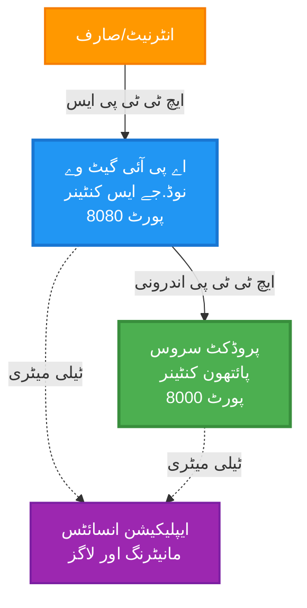
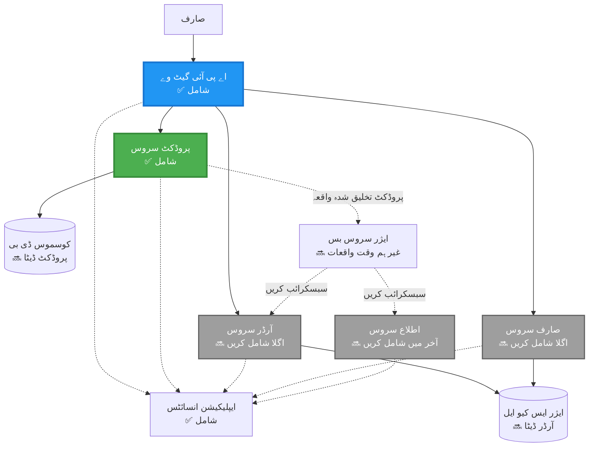
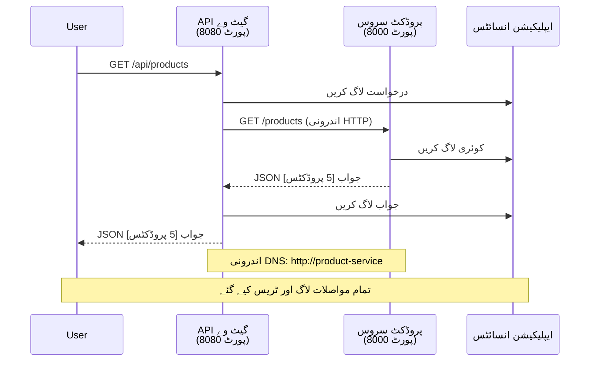

# مائیکروسروسز آرکیٹیکچر - کنٹینر ایپ کی مثال

⏱️ **متوقع وقت**: 25-35 منٹ | 💰 **متوقع لاگت**: ~$50-100/ماہ | ⭐ **پیچیدگی**: اعلیٰ

**📚 سیکھنے کا راستہ:**
- ← پچھلا: [سادہ فلاسک API](../../../../examples/container-app/simple-flask-api) - سنگل کنٹینر کی بنیادی باتیں
- 🎯 **آپ یہاں ہیں**: مائیکروسروسز آرکیٹیکچر (2-سروس کی بنیاد)
- → اگلا: [AI انضمام](../../../../docs/ai-foundry) - اپنی سروسز میں ذہانت شامل کریں
- 🏠 [کورس ہوم](../../README.md)

---

ایک **سادہ لیکن فعال** مائیکروسروسز آرکیٹیکچر جو AZD CLI کا استعمال کرتے ہوئے Azure Container Apps پر تعینات کیا گیا ہے۔ یہ مثال سروس سے سروس کی بات چیت، کنٹینر آرکیسٹریشن، اور مانیٹرنگ کو ایک عملی 2-سروس سیٹ اپ کے ساتھ ظاہر کرتی ہے۔

> **📚 سیکھنے کا طریقہ**: یہ مثال ایک کم سے کم 2-سروس آرکیٹیکچر (API گیٹ وے + بیک اینڈ سروس) سے شروع ہوتی ہے جسے آپ حقیقت میں تعینات کر سکتے ہیں اور سیکھ سکتے ہیں۔ اس بنیاد کو سمجھنے کے بعد، ہم مکمل مائیکروسروسز ایکوسسٹم میں توسیع کے لیے رہنمائی فراہم کرتے ہیں۔

## آپ کیا سیکھیں گے

اس مثال کو مکمل کرکے، آپ:
- Azure Container Apps پر متعدد کنٹینرز تعینات کریں گے
- اندرونی نیٹ ورکنگ کے ساتھ سروس سے سروس کی بات چیت کو نافذ کریں گے
- ماحول پر مبنی اسکیلنگ اور صحت کی جانچ کو ترتیب دیں گے
- Application Insights کے ساتھ تقسیم شدہ ایپلیکیشنز کی نگرانی کریں گے
- مائیکروسروسز کی تعیناتی کے نمونے اور بہترین طریقے سمجھیں گے
- سادہ سے پیچیدہ آرکیٹیکچرز تک ترقی پسند توسیع سیکھیں گے

## آرکیٹیکچر

### مرحلہ 1: ہم کیا بنا رہے ہیں (اس مثال میں شامل)


**اجزاء کی تفصیلات:**

| جزو | مقصد | رسائی | وسائل |
|-----------|---------|--------|-----------|
| **API گیٹ وے** | بیرونی درخواستوں کو بیک اینڈ سروسز کی طرف روٹ کرتا ہے | عوامی (HTTPS) | 1 vCPU، 2GB RAM، 2-20 نقول |
| **پروڈکٹ سروس** | پروڈکٹ کیٹلاگ کو ان میموری ڈیٹا کے ساتھ منظم کرتا ہے | صرف اندرونی | 0.5 vCPU، 1GB RAM، 1-10 نقول |
| **ایپلیکیشن انسائٹس** | مرکزی لاگنگ اور تقسیم شدہ ٹریسنگ | Azure پورٹل | 1-2 GB/ماہ ڈیٹا انٹیک |

**سادہ کیوں شروع کریں؟**
- ✅ جلدی تعینات کریں اور سمجھیں (25-35 منٹ)
- ✅ پیچیدگی کے بغیر مائیکروسروسز کے بنیادی نمونے سیکھیں
- ✅ کام کرنے والا کوڈ جسے آپ ترمیم اور تجربہ کر سکتے ہیں
- ✅ سیکھنے کے لیے کم لاگت (~$50-100/ماہ بمقابلہ $300-1400/ماہ)
- ✅ ڈیٹا بیسز اور میسج کیو شامل کرنے سے پہلے اعتماد پیدا کریں

**تشبیہ**: اسے ڈرائیونگ سیکھنے کی طرح سمجھیں۔ آپ خالی پارکنگ لاٹ (2 سروسز) سے شروع کرتے ہیں، بنیادی باتیں سیکھتے ہیں، پھر شہر کی ٹریفک (5+ سروسز کے ساتھ ڈیٹا بیسز) کی طرف بڑھتے ہیں۔

### مرحلہ 2: مستقبل کی توسیع (حوالہ آرکیٹیکچر)

جب آپ 2-سروس آرکیٹیکچر میں مہارت حاصل کر لیں، تو آپ اسے بڑھا سکتے ہیں:


"توسیع گائیڈ" سیکشن میں مرحلہ وار ہدایات دیکھیں۔

## شامل خصوصیات

✅ **سروس ڈسکوری**: کنٹینرز کے درمیان خودکار DNS پر مبنی دریافت  
✅ **لوڈ بیلنسنگ**: نقول کے درمیان بلٹ ان لوڈ بیلنسنگ  
✅ **آٹو اسکیلنگ**: HTTP درخواستوں کی بنیاد پر ہر سروس کی آزادانہ اسکیلنگ  
✅ **صحت کی نگرانی**: دونوں سروسز کے لیے لائیو نیس اور ریڈینیس پروبز  
✅ **تقسیم شدہ لاگنگ**: Application Insights کے ساتھ مرکزی لاگنگ  
✅ **اندرونی نیٹ ورکنگ**: محفوظ سروس سے سروس کی بات چیت  
✅ **کنٹینر آرکیسٹریشن**: خودکار تعیناتی اور اسکیلنگ  
✅ **زیرو ڈاؤن ٹائم اپڈیٹس**: ریویژن مینجمنٹ کے ساتھ رولنگ اپڈیٹس  

## ضروریات

### مطلوبہ ٹولز

شروع کرنے سے پہلے، تصدیق کریں کہ آپ کے پاس یہ ٹولز انسٹال ہیں:

1. **[Azure Developer CLI (azd)](https://learn.microsoft.com/azure/developer/azure-developer-cli/install-azd)** (ورژن 1.0.0 یا اس سے زیادہ)
   ```bash
   azd version
   # متوقع نتیجہ: azd ورژن 1.0.0 یا اس سے زیادہ
   ```

2. **[Azure CLI](https://learn.microsoft.com/cli/azure/install-azure-cli)** (ورژن 2.50.0 یا اس سے زیادہ)
   ```bash
   az --version
   # متوقع نتیجہ: azure-cli 2.50.0 یا اس سے زیادہ
   ```

3. **[Docker](https://www.docker.com/get-started)** (مقامی ترقی/جانچ کے لیے - اختیاری)
   ```bash
   docker --version
   # متوقع نتیجہ: ڈاکر ورژن 20.10 یا اس سے زیادہ
   ```

### اپنی سیٹ اپ کی تصدیق کریں

یہ کمانڈز چلائیں تاکہ تصدیق ہو کہ آپ تیار ہیں:

```bash
# Azure Developer CLI چیک کریں
azd version
# ✅ متوقع: azd ورژن 1.0.0 یا اس سے زیادہ

# Azure CLI چیک کریں
az --version
# ✅ متوقع: azure-cli 2.50.0 یا اس سے زیادہ

# Docker چیک کریں (اختیاری)
docker --version
# ✅ متوقع: Docker ورژن 20.10 یا اس سے زیادہ
```

**کامیابی کے معیار**: تمام کمانڈز ورژن نمبرز واپس کریں جو کم از کم یا اس سے زیادہ ہوں۔

### Azure کی ضروریات

- ایک فعال **Azure سبسکرپشن** ([مفت اکاؤنٹ بنائیں](https://azure.microsoft.com/free/))
- آپ کی سبسکرپشن میں وسائل بنانے کی اجازت
- سبسکرپشن یا ریسورس گروپ پر **کنٹریبیوٹر** کا کردار

### علم کی ضروریات

یہ ایک **اعلیٰ سطح کی** مثال ہے۔ آپ کو ہونا چاہیے:
- [سادہ فلاسک API مثال](../../../../examples/container-app/simple-flask-api) مکمل کی ہو
- مائیکروسروسز آرکیٹیکچر کی بنیادی سمجھ ہو
- REST APIs اور HTTP سے واقفیت ہو
- کنٹینر کے تصورات کی سمجھ ہو

**کنٹینر ایپس کے لیے نئے ہیں؟** پہلے [سادہ فلاسک API مثال](../../../../examples/container-app/simple-flask-api) سے شروع کریں تاکہ بنیادی باتیں سیکھ سکیں۔

## فوری آغاز (مرحلہ وار)

### مرحلہ 1: کلون کریں اور نیویگیٹ کریں

```bash
git clone https://github.com/microsoft/AZD-for-beginners.git
cd AZD-for-beginners/examples/microservices
```

**✓ کامیابی کی تصدیق**: تصدیق کریں کہ آپ `azure.yaml` دیکھتے ہیں:
```bash
ls
# متوقع: README.md، azure.yaml، infra/، src/
```

### مرحلہ 2: Azure کے ساتھ تصدیق کریں

```bash
azd auth login
```

یہ آپ کے براؤزر کو Azure تصدیق کے لیے کھولتا ہے۔ اپنے Azure اسناد کے ساتھ سائن ان کریں۔

**✓ کامیابی کی تصدیق**: آپ کو یہ دیکھنا چاہیے:
```
Logged in to Azure.
```

### مرحلہ 3: ماحول کو ابتدائی بنائیں

```bash
azd init
```

**آپ کو نظر آنے والے پرامپٹس**:
- **ماحول کا نام**: ایک مختصر نام درج کریں (مثلاً، `microservices-dev`)
- **Azure سبسکرپشن**: اپنی سبسکرپشن منتخب کریں
- **Azure مقام**: ایک علاقہ منتخب کریں (مثلاً، `eastus`, `westeurope`)

**✓ کامیابی کی تصدیق**: آپ کو یہ دیکھنا چاہیے:
```
SUCCESS: New project initialized!
```

### مرحلہ 4: انفراسٹرکچر اور سروسز کو تعینات کریں

```bash
azd up
```

**کیا ہوتا ہے** (8-12 منٹ لگتے ہیں):

```mermaid
graph LR
    A[azd اپ] --> B[وسائل گروپ بنائیں]
    B --> C[کنٹینر رجسٹری تعینات کریں]
    C --> D[لاگ تجزیات تعینات کریں]
    D --> E[ایپ بصیرت تعینات کریں]
    E --> F[کنٹینر ماحول بنائیں]
    F --> G[API گیٹ وے امیج بنائیں]
    F --> H[پروڈکٹ سروس امیج بنائیں]
    G --> I[رجسٹری میں دھکیلیں]
    H --> I
    I --> J[API گیٹ وے تعینات کریں]
    I --> K[پروڈکٹ سروس تعینات کریں]
    J --> L[انگریس اور صحت کی جانچ کو ترتیب دیں]
    K --> L
    L --> M[تعیناتی مکمل ✓]
    
    style A fill:#2196F3,stroke:#1976D2,stroke-width:3px,color:#fff
    style M fill:#4CAF50,stroke:#388E3C,stroke-width:3px,color:#fff
```


**✓ کامیابی کی تصدیق**: آپ کو یہ دیکھنا چاہیے:
```
SUCCESS: Your application was deployed to Azure in X minutes Y seconds.
Endpoint: https://api-gateway-<unique-id>.azurecontainerapps.io
```

**⏱️ وقت**: 8-12 منٹ

### مرحلہ 5: تعیناتی کی جانچ کریں

```bash
# گیٹ وے اینڈ پوائنٹ حاصل کریں
GATEWAY_URL=$(azd env get-values | grep API_GATEWAY_URL | cut -d '=' -f2 | tr -d '"')

# API گیٹ وے کی صحت کی جانچ کریں
curl $GATEWAY_URL/health
```

**✅ متوقع آؤٹ پٹ:**
```json
{
  "status": "healthy",
  "service": "api-gateway",
  "timestamp": "2025-11-19T10:30:00Z"
}
```

**گیٹ وے کے ذریعے پروڈکٹ سروس کی جانچ کریں**:
```bash
# مصنوعات کی فہرست
curl $GATEWAY_URL/api/products
```

**✅ متوقع آؤٹ پٹ:**
```json
[
  {"id":1,"name":"Laptop","price":999.99,"stock":50},
  {"id":2,"name":"Mouse","price":29.99,"stock":200},
  {"id":3,"name":"Keyboard","price":79.99,"stock":150}
]
```

**✓ کامیابی کی تصدیق**: دونوں اینڈپوائنٹس JSON ڈیٹا کو بغیر کسی غلطی کے واپس کریں۔

---

**🎉 مبارک ہو!** آپ نے Azure پر مائیکروسروسز آرکیٹیکچر تعینات کر دیا ہے!

## پروجیکٹ کی ساخت

تمام عمل درآمد فائلیں شامل ہیں—یہ ایک مکمل، کام کرنے والی مثال ہے:

```
microservices/
│
├── README.md                         # This file
├── azure.yaml                        # AZD configuration
├── .gitignore                        # Git ignore patterns
│
├── infra/                           # Infrastructure as Code (Bicep)
│   ├── main.bicep                   # Main orchestration
│   ├── abbreviations.json           # Naming conventions
│   ├── core/                        # Shared infrastructure
│   │   ├── container-apps-environment.bicep  # Container environment + registry
│   │   └── monitor.bicep            # Application Insights + Log Analytics
│   └── app/                         # Service definitions
│       ├── api-gateway.bicep        # API Gateway container app
│       └── product-service.bicep    # Product Service container app
│
└── src/                             # Application source code
    ├── api-gateway/                 # Node.js API Gateway
    │   ├── app.js                   # Express server with routing
    │   ├── package.json             # Node dependencies
    │   └── Dockerfile               # Container definition
    └── product-service/             # Python Product Service
        ├── main.py                  # Flask API with product data
        ├── requirements.txt         # Python dependencies
        └── Dockerfile               # Container definition
```

**ہر جزو کیا کرتا ہے:**

**انفراسٹرکچر (infra/):**
- `main.bicep`: تمام Azure وسائل اور ان کے انحصار کو منظم کرتا ہے
- `core/container-apps-environment.bicep`: کنٹینر ایپس کا ماحول اور Azure Container Registry بناتا ہے
- `core/monitor.bicep`: تقسیم شدہ لاگنگ کے لیے Application Insights ترتیب دیتا ہے
- `app/*.bicep`: اسکیلنگ اور صحت کی جانچ کے ساتھ انفرادی کنٹینر ایپ کی تعریفیں

**API گیٹ وے (src/api-gateway/):**
- عوامی سامنا کرنے والی سروس جو درخواستوں کو بیک اینڈ سروسز کی طرف روٹ کرتی ہے
- لاگنگ، ایرر ہینڈلنگ، اور درخواست فارورڈنگ کو نافذ کرتا ہے
- سروس سے سروس HTTP بات چیت کی مثال دیتا ہے

**پروڈکٹ سروس (src/product-service/):**
- پروڈکٹ کیٹلاگ کے ساتھ اندرونی سروس (سادگی کے لیے ان میموری)
- صحت کی جانچ کے ساتھ REST API
- بیک اینڈ مائیکروسروس پیٹرن کی مثال

## سروسز کا جائزہ

### API گیٹ وے (Node.js/Express)

**پورٹ**: 8080  
**رسائی**: عوامی (بیرونی انگریس)  
**مقصد**: آنے والی درخواستوں کو مناسب بیک اینڈ سروسز کی طرف روٹ کرتا ہے  

**اینڈپوائنٹس**:
- `GET /` - سروس کی معلومات
- `GET /health` - صحت کی جانچ کا اینڈپوائنٹ
- `GET /api/products` - پروڈکٹ سروس کی طرف فارورڈ کریں (تمام کی فہرست)
- `GET /api/products/:id` - پروڈکٹ سروس کی طرف فارورڈ کریں (ID کے ذریعے حاصل کریں)

**اہم خصوصیات**:
- axios کے ساتھ درخواست روٹنگ
- مرکزی لاگنگ
- ایرر ہینڈلنگ اور ٹائم آؤٹ مینجمنٹ
- ماحولیات کے متغیرات کے ذریعے سروس ڈسکوری
- Application Insights انضمام

**کوڈ کی جھلک** (`src/api-gateway/app.js`):
```javascript
// داخلی سروس مواصلات
app.get('/api/products', async (req, res) => {
  const response = await axios.get(`${PRODUCT_SERVICE_URL}/products`, {
    timeout: 5000
  });
  res.json(response.data);
});
```

### پروڈکٹ سروس (Python/Flask)

**پورٹ**: 8000  
**رسائی**: صرف اندرونی (کوئی بیرونی انگریس نہیں)  
**مقصد**: ان میموری ڈیٹا کے ساتھ پروڈکٹ کیٹلاگ کو منظم کرتا ہے  

**اینڈپوائنٹس**:
- `GET /` - سروس کی معلومات
- `GET /health` - صحت کی جانچ کا اینڈپوائنٹ
- `GET /products` - تمام پروڈکٹس کی فہرست
- `GET /products/<id>` - ID کے ذریعے پروڈکٹ حاصل کریں

**اہم خصوصیات**:
- Flask کے ساتھ RESTful API
- ان میموری پروڈکٹ اسٹور (سادہ، کوئی ڈیٹا بیس کی ضرورت نہیں)
- صحت کی نگرانی کے لیے پروبز
- ساختہ لاگنگ
- Application Insights انضمام

**ڈیٹا ماڈل**:
```python
{
  "id": 1,
  "name": "Laptop",
  "description": "High-performance laptop",
  "price": 999.99,
  "stock": 50
}
```

**صرف اندرونی کیوں؟**
پروڈکٹ سروس عوامی طور پر ظاہر نہیں کی گئی ہے۔ تمام درخواستیں API گیٹ وے کے ذریعے جانی چاہئیں، جو فراہم کرتا ہے:
- سیکیورٹی: کنٹرول شدہ رسائی پوائنٹ
- لچک: کلائنٹس کو متاثر کیے بغیر بیک اینڈ کو تبدیل کر سکتے ہیں
- مانیٹرنگ: مرکزی درخواست لاگنگ

## سروس کمیونیکیشن کو سمجھنا

### سروسز ایک دوسرے سے کیسے بات کرتی ہیں


اس مثال میں، API گیٹ وے پروڈکٹ سروس کے ساتھ **اندرونی HTTP کالز** کا استعمال کرتے ہوئے بات چیت کرتا ہے:

```javascript
// گیٹ وے API (src/api-gateway/app.js)
const PRODUCT_SERVICE_URL = process.env.PRODUCT_SERVICE_URL;

// داخلی HTTP درخواست بنائیں
const response = await axios.get(`${PRODUCT_SERVICE_URL}/products`);
```

**اہم نکات**:

1. **DNS پر مبنی دریافت**: کنٹینر ایپس خود بخود اندرونی سروسز کے لیے DNS فراہم کرتی ہیں
   - پروڈکٹ سروس FQDN: `product-service.internal.<environment>.azurecontainerapps.io`
   - آسان بنایا گیا: `http://product-service` (کنٹینر ایپس اسے حل کرتی ہیں)

2. **کوئی عوامی نمائش نہیں**: پروڈکٹ سروس میں `external: false` ہے Bicep میں
   - صرف کنٹینر ایپس کے ماحول کے اندر قابل رسائی
   - انٹرنیٹ سے نہیں پہنچا جا سکتا

3. **ماحول کے متغیرات**: سروس URLs تعیناتی کے وقت داخل کیے جاتے ہیں
   - Bicep اندرونی FQDN کو گیٹ وے پر منتقل کرتا ہے
   - ایپلیکیشن کوڈ میں کوئی ہارڈ کوڈڈ URLs نہیں

**تشبیہ**: اسے دفتر کے کمروں کی طرح سمجھیں۔ API گیٹ وے استقبالیہ ڈیسک ہے (عوامی سامنا)، اور پروڈکٹ سروس ایک دفتر کا کمرہ ہے (صرف اندرونی)۔ زائرین کو کسی بھی دفتر تک پہنچنے کے لیے استقبالیہ سے گزرنا ضروری ہے۔

## تعیناتی کے اختیارات

### مکمل تعیناتی (تجویز کردہ)

```bash
# بنیادی ڈھانچے اور دونوں خدمات کو تعینات کریں
azd up
```

یہ تعینات کرتا ہے:
1. کنٹینر ایپس کا ماحول
2. Application Insights
3. کنٹینر رجسٹری
4. API گیٹ وے کنٹینر
5. پروڈکٹ سروس کنٹینر

**وقت**: 8-12 منٹ

### انفرادی سروس تعینات کریں

```bash
# صرف ایک سروس کو تعینات کریں (ابتدائی azd up کے بعد)
azd deploy api-gateway

# یا پروڈکٹ سروس کو تعینات کریں
azd deploy product-service
```

**استعمال کا کیس**: جب آپ نے کسی سروس میں کوڈ کو اپ ڈیٹ کیا ہو اور صرف اس سروس کو دوبارہ تعینات کرنا چاہتے ہوں۔

### کنفیگریشن کو اپ ڈیٹ کریں

```bash
# پیمائش کے پیرامیٹرز تبدیل کریں
azd env set GATEWAY_MAX_REPLICAS 30

# نئی تشکیل کے ساتھ دوبارہ تعینات کریں
azd up
```

## کنفیگریشن

### اسکیلنگ کنفیگریشن

دونوں سروسز کو ان کے Bicep فائلز میں HTTP پر مبنی آٹو اسکیلنگ کے ساتھ ترتیب دیا گیا ہے:

**API گیٹ وے**:
- کم از کم نقول: 2 (ہمیشہ کم از کم 2 دستیاب رہیں)
- زیادہ سے زیادہ نقول: 20
- اسکیل ٹریگر: ہر نقل پر 50 متوازی درخواستیں

**پروڈکٹ سروس**:
- کم از کم نقول: 1 (ضرورت پڑنے پر صفر تک اسکیل کر سکتی ہے)
- زیادہ سے زیادہ نقول: 10
- اسکیل ٹریگر: ہر نقل پر 100 متوازی درخواستیں

**اسکیلنگ کو حسب ضرورت بنائیں** (`infra/app/*.bicep` میں):
```bicep
scale: {
  minReplicas: 1
  maxReplicas: 10
  rules: [
    {
      name: 'http-scale-rule'
      http: {
        metadata: {
          concurrentRequests: '100'  // Adjust this
        }
      }
    }
  ]
}
```

### وسائل کی تقسیم

**API گیٹ وے**:
- CPU: 1.0 vCPU
- میموری: 2 GiB
- وجہ: تمام بیرونی ٹریفک کو ہینڈل کرتا ہے

**پروڈکٹ سروس**:
- CPU: 0.5 vCPU
- میموری: 1 GiB
- وجہ: ہلکی پھلکی ان میموری آپریشنز

### صحت کی جانچ

دونوں سروسز میں لائیو نیس اور ریڈینیس پروبز شامل ہیں:

```bicep
probes: [
  {
    type: 'Liveness'
    httpGet: {
      path: '/health'
      port: 8080
    }
    initialDelaySeconds: 10
    periodSeconds: 30
  }
  {
    type: 'Readiness'
    httpGet: {
      path: '/health'
      port: 8080
    }
    initialDelaySeconds: 5
    periodSeconds: 10
  }
]
```

**اس کا مطلب کیا ہے**:
- **لائیو نیس**: اگر صحت کی جانچ ناکام ہو جائے تو کنٹینر ایپس کنٹینر کو دوبارہ شروع کرتی ہیں
- **ریڈینیس**: اگر تیار نہ ہو تو کنٹینر ایپس اس نقل کو ٹریفک کی روٹنگ بند کر دیتی ہیں

## مانیٹرنگ اور مشاہدہ

### سروس لاگز دیکھیں

```bash
# API گیٹ وے سے لاگز کو اسٹریم کریں
azd logs api-gateway --follow

# حالیہ پروڈکٹ سروس لاگز دیکھیں
azd logs product-service --tail 100

# دونوں سروسز کے تمام لاگز دیکھیں
azd logs --follow
```

**متوقع آؤٹ پٹ**:
```
[api-gateway] API Gateway listening on port 8080
[api-gateway] Product Service URL: http://product-service
[api-gateway] GET /api/products 200 - 45ms
[product-service] Retrieved 5 products
```

### Application Insights کوئریز

Azure پورٹل میں Application Insights تک رسائی حاصل کریں، پھر یہ کوئریز چلائیں:

**سست درخواستیں تلاش کریں**:
```kusto
requests
| where timestamp > ago(1h)
| where duration > 1000  // Requests taking >1 second
| summarize count() by name, cloud_RoleName
| order by count_ desc
```

**سروس سے سروس کالز کو ٹریک کریں**:
```kusto
dependencies
| where timestamp > ago(1h)
| where type == "Http"
| project timestamp, name, target, duration, success
| order by timestamp desc
```

**سروس کے لحاظ سے ایرر ریٹ**:
```kusto
exceptions
| where timestamp > ago(24h)
| summarize errorCount = count() by cloud_RoleName, type
| order by errorCount desc
```

**وقت کے ساتھ درخواست کا حجم**:
```kusto
requests
| where timestamp > ago(1h)
| summarize requestCount = count() by bin(timestamp, 5m), cloud_RoleName
| render timechart
```

### مانیٹرنگ ڈیش بورڈ تک رسائی حاصل کریں

```bash
# ایپلیکیشن انسائٹس کی تفصیلات حاصل کریں
azd env get-values | grep APPLICATIONINSIGHTS

# ایزور پورٹل مانیٹرنگ کھولیں
az monitor app-insights component show \
  --app $(azd env get-values | grep APPLICATIONINSIGHTS_CONNECTION_STRING | cut -d '=' -f2) \
  --resource-group $(azd env get-values | grep AZURE_RESOURCE_GROUP | cut -d '=' -f2) \
  --query "appId" -o tsv
```

### لائیو میٹرکس

1. Azure پورٹل میں Application Insights پر جائیں
2. "Live Metrics" پر کلک کریں
3. حقیقی وقت کی درخواستیں، ناکامیاں، اور کارکردگی دیکھیں
4. ٹیسٹ کریں:
3. دونوں سروسز کو دوبارہ تعینات کریں:

```bash
azd deploy product-service
azd deploy api-gateway
```

4. نئے اینڈ پوائنٹ کو ٹیسٹ کریں:

```bash
GATEWAY_URL=$(azd env get-values | grep API_GATEWAY_URL | cut -d '=' -f2 | tr -d '"')

# ایک نیا پروڈکٹ بنائیں
curl -X POST $GATEWAY_URL/api/products \
  -H "Content-Type: application/json" \
  -d '{"name":"USB Cable","price":9.99,"stock":500}'
```

**✅ متوقع نتیجہ:**
```json
{"id":6,"name":"USB Cable","description":"","price":9.99,"stock":500}
```

5. تصدیق کریں کہ یہ فہرست میں ظاہر ہوتا ہے:

```bash
curl $GATEWAY_URL/api/products
# اب 6 مصنوعات دکھانی چاہئیں جن میں نیا USB کیبل شامل ہے۔
```

**کامیابی کے معیار**:
- ✅ POST درخواست HTTP 201 واپس کرتی ہے
- ✅ نیا پروڈکٹ GET /api/products کی فہرست میں ظاہر ہوتا ہے
- ✅ پروڈکٹ کا خودکار انکریمنٹڈ ID ہوتا ہے

**وقت**: 10-15 منٹ

---

### مشق 2: آٹو اسکیلنگ رولز میں ترمیم کریں ⭐⭐ (درمیانی)

**مقصد**: پروڈکٹ سروس کو زیادہ جارحانہ انداز میں اسکیل کرنے کے لیے تبدیل کریں

**آغاز کا نقطہ**: `infra/app/product-service.bicep`

**اقدامات**:

1. `infra/app/product-service.bicep` کھولیں اور `scale` بلاک تلاش کریں (تقریباً لائن 95)

2. تبدیل کریں:
```bicep
scale: {
  minReplicas: 1
  maxReplicas: 10
  rules: [
    {
      name: 'http-scale-rule'
      http: {
        metadata: {
          concurrentRequests: '100'  // OLD
        }
      }
    }
  ]
}
```

سے:
```bicep
scale: {
  minReplicas: 2  // Always have 2 running
  maxReplicas: 20  // Allow more scaling
  rules: [
    {
      name: 'http-scale-rule'
      http: {
        metadata: {
          concurrentRequests: '20'  // Scale at lower threshold
        }
      }
    }
  ]
}
```

3. انفراسٹرکچر کو دوبارہ تعینات کریں:

```bash
azd up
```

4. نئی اسکیلنگ کنفیگریشن کی تصدیق کریں:

```bash
az containerapp show \
  --name $(azd env get-values | grep PRODUCT_SERVICE | head -1 | cut -d '/' -f5) \
  --resource-group $(azd env get-values | grep AZURE_RESOURCE_GROUP | cut -d '=' -f2 | tr -d '"') \
  --query "properties.template.scale" -o json
```

**✅ متوقع نتیجہ:**
```json
{
  "minReplicas": 2,
  "maxReplicas": 20,
  "rules": [...]
}
```

5. لوڈ کے ساتھ آٹو اسکیلنگ کو ٹیسٹ کریں:

```bash
# متوازی درخواستیں پیدا کریں
for i in {1..500}; do curl $GATEWAY_URL/api/products & done

# اسکیلنگ کو ہوتا ہوا دیکھیں
azd logs product-service --follow
# تلاش کریں: کنٹینر ایپس کے اسکیلنگ واقعات
```

**کامیابی کے معیار**:
- ✅ پروڈکٹ سروس ہمیشہ کم از کم 2 ریپلیکا چلاتی ہے
- ✅ لوڈ کے تحت، 2 سے زیادہ ریپلیکا تک اسکیل کرتی ہے
- ✅ Azure پورٹل نئے اسکیلنگ رولز دکھاتا ہے

**وقت**: 15-20 منٹ

---

### مشق 3: کسٹم مانیٹرنگ کوئری شامل کریں ⭐⭐ (درمیانی)

**مقصد**: پروڈکٹ API کی کارکردگی کو ٹریک کرنے کے لیے کسٹم ایپلیکیشن انسائٹس کوئری بنائیں

**اقدامات**:

1. Azure پورٹل میں ایپلیکیشن انسائٹس پر جائیں:
   - Azure پورٹل پر جائیں
   - اپنے ریسورس گروپ (rg-microservices-*) کو تلاش کریں
   - ایپلیکیشن انسائٹس ریسورس پر کلک کریں

2. بائیں مینو میں "Logs" پر کلک کریں

3. یہ کوئری بنائیں:

```kusto
requests
| where timestamp > ago(1h)
| where name contains "products"
| summarize 
    RequestCount = count(),
    AvgDuration = avg(duration),
    P95Duration = percentile(duration, 95),
    SuccessRate = 100.0 * countif(success == true) / count()
  by bin(timestamp, 5m)
| render timechart
```

4. کوئری کو چلانے کے لیے "Run" پر کلک کریں

5. کوئری کو محفوظ کریں:
   - "Save" پر کلک کریں
   - نام: "Product API Performance"
   - زمرہ: "Performance"

6. ٹیسٹ ٹریفک پیدا کریں:

```bash
for i in {1..100}; do curl $GATEWAY_URL/api/products; sleep 1; done
```

7. ڈیٹا دیکھنے کے لیے کوئری کو ریفریش کریں

**✅ متوقع نتیجہ:**
- وقت کے ساتھ درخواستوں کی تعداد دکھانے والا چارٹ
- اوسط دورانیہ < 500ms
- کامیابی کی شرح = 100%
- 5 منٹ کے وقت کے بِنز

**کامیابی کے معیار**:
- ✅ کوئری 100+ درخواستیں دکھاتی ہے
- ✅ کامیابی کی شرح 100% ہے
- ✅ اوسط دورانیہ < 500ms
- ✅ چارٹ 5 منٹ کے وقت کے بِنز دکھاتا ہے

**سیکھنے کا نتیجہ**: کسٹم کوئریز کے ساتھ سروس کی کارکردگی کی نگرانی کو سمجھیں

**وقت**: 10-15 منٹ

---

### مشق 4: ریٹری لاجک نافذ کریں ⭐⭐⭐ (اعلی درجے کی)

**مقصد**: پروڈکٹ سروس کے عارضی طور پر دستیاب نہ ہونے پر API گیٹ وے میں ریٹری لاجک شامل کریں

**آغاز کا نقطہ**: `src/api-gateway/app.js`

**اقدامات**:

1. ریٹری لائبریری انسٹال کریں:

```bash
cd src/api-gateway
npm install axios-retry --save
cd ../..
```

2. `src/api-gateway/app.js` کو اپ ڈیٹ کریں (axios درآمد کے بعد شامل کریں):

```javascript
const axiosRetry = require('axios-retry');

// دوبارہ کوشش کی منطق ترتیب دیں
axiosRetry(axios, {
  retries: 3,
  retryDelay: (retryCount) => {
    return retryCount * 1000; // 1 سیکنڈ، 2 سیکنڈ، 3 سیکنڈ
  },
  retryCondition: (error) => {
    // نیٹ ورک کی غلطیوں یا 5xx جوابات پر دوبارہ کوشش کریں
    return axiosRetry.isNetworkOrIdempotentRequestError(error) ||
           (error.response && error.response.status >= 500);
  }
});

console.log('Retry logic configured: 3 retries with exponential backoff');
```

3. API گیٹ وے کو دوبارہ تعینات کریں:

```bash
azd deploy api-gateway
```

4. سروس کی ناکامی کو سیمولیٹ کرکے ریٹری رویے کو ٹیسٹ کریں:

```bash
# پروڈکٹ سروس کو 0 پر اسکیل کریں (ناکامی کی نقل کریں)
az containerapp update \
  --name $(azd env get-values | grep PRODUCT_SERVICE | head -1 | cut -d '/' -f5) \
  --resource-group $(azd env get-values | grep AZURE_RESOURCE_GROUP | cut -d '=' -f2 | tr -d '"') \
  --min-replicas 0 \
  --max-replicas 0

# پروڈکٹس تک رسائی کی کوشش کریں (3 بار دوبارہ کوشش کرے گا)
time curl -v $GATEWAY_URL/api/products
# مشاہدہ کریں: جواب میں تقریباً 6 سیکنڈ لگتے ہیں (1س + 2س + 3س دوبارہ کوششیں)

# پروڈکٹ سروس کو بحال کریں
az containerapp update \
  --name $(azd env get-values | grep PRODUCT_SERVICE | head -1 | cut -d '/' -f5) \
  --resource-group $(azd env get-values | grep AZURE_RESOURCE_GROUP | cut -d '=' -f2 | tr -d '"') \
  --min-replicas 1 \
  --max-replicas 10
```

5. ریٹری لاگز دیکھیں:

```bash
azd logs api-gateway --tail 50
# دوبارہ کوشش کے پیغامات تلاش کریں۔
```

**✅ متوقع رویہ:**
- درخواستیں ناکام ہونے سے پہلے 3 بار ریٹری کرتی ہیں
- ہر ریٹری زیادہ انتظار کرتی ہے (1s، 2s، 3s)
- سروس کے دوبارہ شروع ہونے کے بعد کامیاب درخواستیں
- لاگز ریٹری کوششیں دکھاتے ہیں

**کامیابی کے معیار**:
- ✅ درخواستیں ناکام ہونے سے پہلے 3 بار ریٹری کرتی ہیں
- ✅ ہر ریٹری زیادہ انتظار کرتی ہے (ایکسپونینشل بیک آف)
- ✅ سروس کے دوبارہ شروع ہونے کے بعد کامیاب درخواستیں
- ✅ لاگز ریٹری کوششیں دکھاتے ہیں

**سیکھنے کا نتیجہ**: مائیکرو سروسز میں لچکدار پیٹرنز کو سمجھیں (سرکٹ بریکرز، ریٹریز، ٹائم آؤٹس)

**وقت**: 20-25 منٹ

---

## علم کی جانچ

اس مثال کو مکمل کرنے کے بعد، اپنی سمجھ کی تصدیق کریں:

### 1. سروس کمیونیکیشن ✓

اپنا علم آزمائیں:
- [ ] کیا آپ وضاحت کر سکتے ہیں کہ API گیٹ وے پروڈکٹ سروس کو کیسے دریافت کرتا ہے؟ (DNS پر مبنی سروس دریافت)
- [ ] اگر پروڈکٹ سروس بند ہو جائے تو کیا ہوتا ہے؟ (گیٹ وے 503 ایرر واپس کرتا ہے)
- [ ] آپ تیسری سروس کیسے شامل کریں گے؟ (نیا Bicep فائل بنائیں، main.bicep میں شامل کریں، src فولڈر بنائیں)

**ہینڈز آن تصدیق**:
```bash
# سروس کی ناکامی کی نقل کریں
az containerapp update --name <product-service-name> --min-replicas 0 --max-replicas 0
curl $GATEWAY_URL/api/products
# ✅ متوقع: 503 سروس دستیاب نہیں

# سروس بحال کریں
az containerapp update --name <product-service-name> --min-replicas 1 --max-replicas 10
```

### 2. مانیٹرنگ اور مشاہدہ ✓

اپنا علم آزمائیں:
- [ ] آپ تقسیم شدہ لاگز کہاں دیکھتے ہیں؟ (Azure پورٹل میں ایپلیکیشن انسائٹس)
- [ ] آپ سست درخواستوں کو کیسے ٹریک کرتے ہیں؟ (Kusto کوئری: `requests | where duration > 1000`)
- [ ] کیا آپ شناخت کر سکتے ہیں کہ کون سی سروس نے ایرر پیدا کیا؟ (لاگز میں `cloud_RoleName` فیلڈ چیک کریں)

**ہینڈز آن تصدیق**:
```bash
# سست درخواست کی تخلیق کا مظاہرہ کریں
curl "$GATEWAY_URL/api/products?delay=2000"

# سست درخواستوں کے لیے ایپلیکیشن انسائٹس سے استفسار کریں
# ایزور پورٹل → ایپلیکیشن انسائٹس → لاگز پر جائیں
# چلائیں: requests | where duration > 1000 | project timestamp, name, duration, cloud_RoleName
```

### 3. اسکیلنگ اور کارکردگی ✓

اپنا علم آزمائیں:
- [ ] آٹو اسکیلنگ کو کیا متحرک کرتا ہے؟ (HTTP متوازی درخواست کے قواعد: گیٹ وے کے لیے 50، پروڈکٹ کے لیے 100)
- [ ] اب کتنے ریپلیکا چل رہے ہیں؟ (`az containerapp revision list` کے ساتھ چیک کریں)
- [ ] آپ پروڈکٹ سروس کو 5 ریپلیکا تک کیسے اسکیل کریں گے؟ (Bicep میں minReplicas کو اپ ڈیٹ کریں)

**ہینڈز آن تصدیق**:
```bash
# آٹوسکیلنگ کی جانچ کے لیے لوڈ پیدا کریں
for i in {1..1000}; do curl $GATEWAY_URL/api/products & done

# نقلوں میں اضافہ دیکھیں
azd logs api-gateway --follow
# ✅ متوقع: لاگز میں اسکیلنگ کے واقعات دیکھیں
```

**کامیابی کے معیار**: آپ تمام سوالات کا جواب دے سکتے ہیں اور ہینڈز آن کمانڈز کے ساتھ تصدیق کر سکتے ہیں۔

---

## لاگت کا تجزیہ

### تخمینی ماہانہ لاگت (اس 2-سروس مثال کے لیے)

| ریسورس | کنفیگریشن | تخمینی لاگت |
|----------|--------------|----------------|
| API گیٹ وے | 2-20 ریپلیکا، 1 vCPU، 2GB RAM | $30-150 |
| پروڈکٹ سروس | 1-10 ریپلیکا، 0.5 vCPU، 1GB RAM | $15-75 |
| کنٹینر رجسٹری | بنیادی درجے | $5 |
| ایپلیکیشن انسائٹس | 1-2 GB/ماہ | $5-10 |
| لاگ اینالیٹکس | 1 GB/ماہ | $3 |
| **کل** | | **$58-243/ماہ** |

### استعمال کے لحاظ سے لاگت کی تقسیم

**ہلکی ٹریفک** (ٹیسٹنگ/سیکھنا): ~$60/ماہ
- API گیٹ وے: 2 ریپلیکا × 24/7 = $30
- پروڈکٹ سروس: 1 ریپلیکا × 24/7 = $15
- مانیٹرنگ + رجسٹری = $13

**درمیانی ٹریفک** (چھوٹا پروڈکشن): ~$120/ماہ
- API گیٹ وے: 5 اوسط ریپلیکا = $75
- پروڈکٹ سروس: 3 اوسط ریپلیکا = $45
- مانیٹرنگ + رجسٹری = $13

**زیادہ ٹریفک** (مصروف اوقات): ~$240/ماہ
- API گیٹ وے: 15 اوسط ریپلیکا = $225
- پروڈکٹ سروس: 8 اوسط ریپلیکا = $120
- مانیٹرنگ + رجسٹری = $13

### لاگت کو کم کرنے کے مشورے

1. **ڈیولپمنٹ کے لیے زیرو پر اسکیل کریں**:
   ```bicep
   scale: {
     minReplicas: 0  // Save $30-40/month when not in use
     maxReplicas: 10
   }
   ```

2. **Cosmos DB کے لیے کنزمپشن پلان استعمال کریں** (جب آپ اسے شامل کریں):
   - صرف استعمال کے لیے ادائیگی کریں
   - کوئی کم از کم چارج نہیں

3. **ایپلیکیشن انسائٹس سیمپلنگ سیٹ کریں**:
   ```javascript
   appInsights.defaultClient.config.samplingPercentage = 50; // درخواستوں کے 50% کا نمونہ لیں
   ```

4. **ضرورت نہ ہونے پر صاف کریں**:
   ```bash
   azd down --force --purge
   ```

### مفت درجے کے اختیارات

سیکھنے/ٹیسٹنگ کے لیے غور کریں:
- ✅ Azure مفت کریڈٹس استعمال کریں ($200 پہلے 30 دنوں کے لیے نئے اکاؤنٹس کے ساتھ)
- ✅ کم سے کم ریپلیکا رکھیں (تقریباً 50% لاگت بچتی ہے)
- ✅ ٹیسٹنگ کے بعد حذف کریں (کوئی جاری چارجز نہیں)
- ✅ سیکھنے کے سیشنز کے درمیان زیرو پر اسکیل کریں

**مثال**: اس مثال کو 2 گھنٹے/دن × 30 دن چلانا = ~$5/ماہ بجائے $60/ماہ

---

## خرابیوں کا سراغ لگانے کا فوری حوالہ

### مسئلہ: `azd up` "سبسکرپشن نہیں ملا" کے ساتھ ناکام ہو جاتا ہے

**حل**:
```bash
# دوبارہ لاگ ان کریں واضح سبسکرپشن کے ساتھ
az account set --subscription <your-subscription-id>
azd env set AZURE_SUBSCRIPTION_ID <your-subscription-id>
azd up
```

### مسئلہ: API گیٹ وے 503 "پروڈکٹ سروس دستیاب نہیں" واپس کرتا ہے

**تشخیص**:
```bash
# پروڈکٹ سروس لاگز چیک کریں
azd logs product-service --tail 50

# پروڈکٹ سروس کی صحت چیک کریں
az containerapp show \
  --name $(azd env get-values | grep PRODUCT_SERVICE | head -1 | cut -d '/' -f5) \
  --resource-group $(azd env get-values | grep AZURE_RESOURCE_GROUP | cut -d '=' -f2 | tr -d '"') \
  --query "properties.runningStatus"
```

**عام وجوہات**:
1. پروڈکٹ سروس شروع نہیں ہوئی (Python ایررز کے لیے لاگز چیک کریں)
2. ہیلتھ چیک ناکام ہو رہا ہے (`/health` اینڈ پوائنٹ کام کرتا ہے اس کی تصدیق کریں)
3. کنٹینر امیج بلڈ ناکام ہو گیا (امیج کے لیے رجسٹری چیک کریں)

### مسئلہ: آٹو اسکیلنگ کام نہیں کر رہا

**تشخیص**:
```bash
# موجودہ نقل کی تعداد چیک کریں
az containerapp revision list \
  --name $(azd env get-values | grep API_GATEWAY | head -1 | cut -d '/' -f5) \
  --resource-group $(azd env get-values | grep AZURE_RESOURCE_GROUP | cut -d '=' -f2 | tr -d '"') \
  --query "[].properties.replicas"

# جانچ کے لیے لوڈ تیار کریں
for i in {1..1000}; do curl $GATEWAY_URL/api/products & done

# اسکیلنگ کے واقعات دیکھیں
azd logs api-gateway --follow | grep -i scale
```

**عام وجوہات**:
1. اسکیل رول کو متحرک کرنے کے لیے لوڈ کافی زیادہ نہیں ہے (50 سے زیادہ متوازی درخواستوں کی ضرورت ہے)
2. زیادہ سے زیادہ ریپلیکا پہلے ہی پہنچ چکے ہیں (Bicep کنفیگریشن چیک کریں)
3. Bicep میں اسکیل رول غلط کنفیگر کیا گیا ہے (concurrentRequests ویلیو کی تصدیق کریں)

### مسئلہ: ایپلیکیشن انسائٹس لاگز نہیں دکھا رہا

**تشخیص**:
```bash
# تصدیق کریں کہ کنکشن سٹرنگ سیٹ ہے
azd env get-values | grep APPLICATIONINSIGHTS

# چیک کریں کہ خدمات ٹیلیمیٹری بھیج رہی ہیں
az monitor app-insights component show \
  --app $(azd env get-values | grep APPLICATIONINSIGHTS_NAME | cut -d '=' -f2 | tr -d '"') \
  --resource-group $(azd env get-values | grep AZURE_RESOURCE_GROUP | cut -d '=' -f2 | tr -d '"') \
  --query "properties.InstrumentationKey"
```

**عام وجوہات**:
1. کنکشن اسٹرنگ کنٹینر کو منتقل نہیں کی گئی (ماحولیاتی متغیرات چیک کریں)
2. ایپلیکیشن انسائٹس SDK کنفیگر نہیں کیا گیا (کوڈ میں درآمدات کی تصدیق کریں)
3. ٹیلیمیٹری کو بلاک کرنے والا فائر وال (نایاب، نیٹ ورک رولز چیک کریں)

### مسئلہ: لوکل ڈوکر بلڈ ناکام ہو جاتا ہے

**تشخیص**:
```bash
# API گیٹ وے کی تعمیر کا ٹیسٹ کریں
cd src/api-gateway
docker build -t test-gateway .

# پروڈکٹ سروس کی تعمیر کا ٹیسٹ کریں
cd ../product-service
docker build -t test-product .
```

**عام وجوہات**:
1. package.json/requirements.txt میں گمشدہ ڈپینڈنسیز
2. Dockerfile میں نحو کی غلطیاں
3. ڈپینڈنسیز ڈاؤن لوڈ کرنے میں نیٹ ورک کے مسائل

**اب بھی پھنسے ہوئے ہیں؟** [عام مسائل گائیڈ](../../docs/troubleshooting/common-issues.md) یا [Azure Container Apps Troubleshooting](https://learn.microsoft.com/azure/container-apps/troubleshooting) دیکھیں

---

## صفائی

جاری چارجز سے بچنے کے لیے، تمام وسائل حذف کریں:

```bash
azd down --force --purge
```

**تصدیقی پرامپٹ**:
```
? Total resources to delete: 6, are you sure you want to continue? (y/N)
```

تصدیق کے لیے `y` ٹائپ کریں۔

**کیا حذف ہو جاتا ہے**:
- کنٹینر ایپس ماحول
- دونوں کنٹینر ایپس (گیٹ وے اور پروڈکٹ سروس)
- کنٹینر رجسٹری
- ایپلیکیشن انسائٹس
- لاگ اینالیٹکس ورک اسپیس
- ریسورس گروپ

**✓ صفائی کی تصدیق**:
```bash
az group list --query "[?starts_with(name,'rg-microservices')]" --output table
```

خالی واپس آنا چاہیے۔

---

## توسیعی گائیڈ: 2 سے 5+ سروسز تک

جب آپ اس 2-سروس آرکیٹیکچر میں مہارت حاصل کر لیں، تو یہاں توسیع کا طریقہ ہے:

### مرحلہ 1: ڈیٹا بیس پرسسٹنس شامل کریں (اگلا قدم)

**پروڈکٹ سروس کے لیے Cosmos DB شامل کریں**:

1. `infra/core/cosmos.bicep` بنائیں:
   ```bicep
   resource cosmosAccount 'Microsoft.DocumentDB/databaseAccounts@2023-04-15' = {
     name: name
     location: location
     kind: 'GlobalDocumentDB'
     properties: {
       databaseAccountOfferType: 'Standard'
       consistencyPolicy: { defaultConsistencyLevel: 'Session' }
       locations: [{ locationName: location, failoverPriority: 0 }]
     }
   }
   ```

2. پروڈکٹ سروس کو ان میموری ڈیٹا کے بجائے Azure Cosmos DB Python SDK استعمال کرنے کے لیے اپ ڈیٹ کریں

3. تخمینی اضافی لاگت: ~$25/ماہ (سرور لیس)

### مرحلہ 2: تیسری سروس شامل کریں (آرڈر مینجمنٹ)

**آرڈر سروس بنائیں**:

1. نیا فولڈر: `src/order-service/` (Python/Node.js/C#)
2. نیا Bicep: `infra/app/order-service.bicep`
3. API گیٹ وے کو `/api/orders` کے لیے روٹ اپ ڈیٹ کریں
4. آرڈر پرسسٹنس کے لیے Azure SQL ڈیٹا بیس شامل کریں

**آرکیٹیکچر بن جاتا ہے**:
```
API Gateway → Product Service (Cosmos DB)
           → Order Service (Azure SQL)
```

### مرحلہ 3: غیر متزامن کمیونیکیشن شامل کریں (سروس بس)

**ایونٹ ڈرائیون آرکیٹیکچر نافذ کریں**:

1. Azure سروس بس شامل کریں: `infra/core/servicebus.bicep`
2. پروڈکٹ سروس "ProductCreated" ایونٹس شائع کرتی ہے
3. آرڈر سروس پروڈکٹ ایونٹس کو سبسکرائب کرتی ہے
4. ایونٹس کو پروسیس کرنے کے لیے نوٹیفکیشن سروس شامل کریں

**پیٹرن**: درخواست/جواب (HTTP) + ایونٹ ڈرائیون (سروس بس)

### مرحلہ 4: یوزر آتھینٹیکیشن شامل کریں

**یوزر سروس نافذ کریں**:

1. `src/user-service/` بنائیں (Go/Node.js)
2. Azure AD B2C یا کسٹم JWT آتھینٹیکیشن شامل کریں
3. API گیٹ وے ٹوکنز کی تصدیق کرتا ہے اس سے پہلے کہ روٹنگ کرے
4. سروسز یوزر کی اجازتیں چیک کرتی ہیں

### مرحلہ 5: پروڈکشن کے لیے تیاری

**یہ اجزاء شامل کریں**:
- ✅ Azure Front Door (گلوبل لوڈ بیلنسنگ)
- ✅ Azure Key Vault (سیکریٹ مینجمنٹ)
- ✅ Azure Monitor Workbooks (کسٹم ڈیش بورڈز)
- ✅ CI/CD پائپ لائن (GitHub Actions)
- ✅ بلیو-گرین تعیناتیاں
- ✅ تمام سروسز کے لیے مینیجڈ آئیڈینٹیٹی

**مکمل پروڈکشن آرکیٹیکچر لاگت**: ~$300-1,400/ماہ

---

## مزید سیکھیں

### متعلقہ دستاویزات
- [Azure Container Apps Documentation](https://learn.microsoft.com/azure/container-apps/)
- [Microservices Architecture Guide](https://learn.microsoft.com/azure/architecture/guide/architecture-styles/microservices)
- [Application Insights for Distributed Tracing](https://learn.microsoft.com/azure/azure-monitor/app/distributed-tracing)
- [Azure Developer CLI Documentation](https://learn.microsoft.com/azure/developer/azure-developer-cli/)

### اس کورس میں اگلے مراحل
- ← پچھلا: [Simple Flask API](../../../../examples/container-app/simple-flask-api) - ابتدائی سنگل کنٹینر مثال
- → اگلا: [AI Integration Guide](../../../../docs/ai-foundry) - AI صلاحیتیں شامل کریں
- 🏠 [کورس ہوم](../../README.md)

### موازنہ: کب کیا استعمال کریں

| خصوصیت | سنگل کنٹینر | مائیکرو سروسز (یہ) | Kubernetes (AKS) |
|---------|-----------------|---------------------|------------------|
| **استعمال کا کیس** | سادہ ایپس | پیچیدہ ایپس | انٹرپرائز ایپس |
| **اسکیل ایبلٹی** | سنگل سروس | فی سروس اسکیلنگ | زیادہ سے زیادہ لچک |
| **پیچیدگی**
| **بہترین انتخاب** | ایم وی پیز، پروٹوٹائپس | پروڈکشن ایپس | ملٹی کلاؤڈ، ایڈوانس نیٹ ورکنگ |

**تجویز**: کنٹینر ایپس سے شروع کریں (یہ مثال)، اے کے ایس پر جائیں صرف اگر آپ کو کبرنیٹیز کے مخصوص فیچرز کی ضرورت ہو۔

---

## اکثر پوچھے گئے سوالات

**سوال: صرف 2 سروسز کیوں، 5+ کیوں نہیں؟**  
جواب: تعلیمی ترقی۔ بنیادی اصولوں (سروس کمیونیکیشن، مانیٹرنگ، اسکیلنگ) کو ایک سادہ مثال کے ساتھ سیکھیں، پھر پیچیدگی شامل کریں۔ یہاں سیکھے گئے پیٹرنز 100 سروس آرکیٹیکچرز پر بھی لاگو ہوتے ہیں۔

**سوال: کیا میں خود مزید سروسز شامل کر سکتا ہوں؟**  
جواب: بالکل! اوپر دی گئی توسیعی گائیڈ پر عمل کریں۔ ہر نئی سروس کا ایک ہی پیٹرن ہے: src فولڈر بنائیں، Bicep فائل بنائیں، azure.yaml اپڈیٹ کریں، اور ڈپلائے کریں۔

**سوال: کیا یہ پروڈکشن کے لیے تیار ہے؟**  
جواب: یہ ایک مضبوط بنیاد ہے۔ پروڈکشن کے لیے شامل کریں: مینیجڈ آئیڈینٹیٹی، کی والٹ، مستقل ڈیٹا بیسز، CI/CD پائپ لائن، مانیٹرنگ الرٹس، اور بیک اپ اسٹریٹجی۔

**سوال: Dapr یا دیگر سروس میش کیوں نہ استعمال کریں؟**  
جواب: سیکھنے کے لیے اسے سادہ رکھیں۔ جب آپ کنٹینر ایپس نیٹ ورکنگ کو سمجھ لیں، تو آپ Dapr کو ایڈوانسڈ سیناریوز (اسٹیٹ مینجمنٹ، پب/سب، بائنڈنگز) کے لیے شامل کر سکتے ہیں۔

**سوال: میں لوکل ڈیبگ کیسے کروں؟**  
جواب: سروسز کو لوکل طور پر Docker کے ساتھ چلائیں:  
```bash
cd src/api-gateway
docker build -t local-gateway .
docker run -p 8080:8080 -e PRODUCT_SERVICE_URL=http://localhost:8000 local-gateway
```
  
**سوال: کیا میں مختلف پروگرامنگ زبانیں استعمال کر سکتا ہوں؟**  
جواب: جی ہاں! یہ مثال Node.js (گیٹ وے) + Python (پروڈکٹ سروس) دکھاتی ہے۔ آپ کسی بھی زبان کو مکس کر سکتے ہیں جو کنٹینرز میں چلتی ہو: C#, Go, Java, Ruby, PHP وغیرہ۔

**سوال: اگر میرے پاس Azure کریڈٹس نہیں ہیں تو کیا کروں؟**  
جواب: Azure کا مفت ٹائر استعمال کریں (نئے اکاؤنٹس کے پہلے 30 دن میں $200 کریڈٹس ملتے ہیں) یا مختصر ٹیسٹنگ کے لیے ڈپلائے کریں اور فوراً ڈیلیٹ کر دیں۔ یہ مثال تقریباً $2/دن کی لاگت رکھتی ہے۔

**سوال: یہ Azure Kubernetes Service (AKS) سے کیسے مختلف ہے؟**  
جواب: کنٹینر ایپس آسان ہے (کبرنیٹیز کی معلومات کی ضرورت نہیں) لیکن کم لچکدار۔ AKS آپ کو مکمل کبرنیٹیز کنٹرول دیتا ہے لیکن زیادہ مہارت کی ضرورت ہوتی ہے۔ کنٹینر ایپس سے شروع کریں، ضرورت پڑنے پر AKS پر جائیں۔

**سوال: کیا میں اسے موجودہ Azure سروسز کے ساتھ استعمال کر سکتا ہوں؟**  
جواب: جی ہاں! آپ موجودہ ڈیٹا بیسز، اسٹوریج اکاؤنٹس، سروس بس وغیرہ سے کنیکٹ کر سکتے ہیں۔ Bicep فائلز کو اپڈیٹ کریں تاکہ موجودہ وسائل کو ریفرنس کریں بجائے نئے بنانے کے۔

---

> **🎓 لرننگ پاتھ کا خلاصہ**: آپ نے ایک ملٹی سروس آرکیٹیکچر کو ڈپلائے کرنا سیکھا ہے جس میں خودکار اسکیلنگ، اندرونی نیٹ ورکنگ، مرکزی مانیٹرنگ، اور پروڈکشن کے لیے تیار پیٹرنز شامل ہیں۔ یہ بنیاد آپ کو پیچیدہ ڈسٹریبیوٹڈ سسٹمز اور انٹرپرائز مائیکرو سروسز آرکیٹیکچرز کے لیے تیار کرتی ہے۔

**📚 کورس نیویگیشن:**
- ← پچھلا: [سادہ Flask API](../../../../examples/container-app/simple-flask-api)
- → اگلا: [ڈیٹا بیس انٹیگریشن کی مثال](../../../../database-app)
- 🏠 [کورس ہوم](../../README.md)
- 📖 [کنٹینر ایپس بہترین طریقے](../../docs/deployment/deployment-guide.md)

---

**✨ مبارک ہو!** آپ نے مائیکرو سروسز کی مثال مکمل کر لی ہے۔ آپ اب Azure Container Apps پر ڈسٹریبیوٹڈ ایپلیکیشنز بنانے، ڈپلائے کرنے، اور مانیٹر کرنے کا طریقہ سمجھتے ہیں۔ کیا آپ AI صلاحیتیں شامل کرنے کے لیے تیار ہیں؟ [AI انٹیگریشن گائیڈ](../../../../docs/ai-foundry) دیکھیں!

---

<!-- CO-OP TRANSLATOR DISCLAIMER START -->
**اعلانِ لاتعلقی**:  
یہ دستاویز AI ترجمہ سروس [Co-op Translator](https://github.com/Azure/co-op-translator) کا استعمال کرتے ہوئے ترجمہ کی گئی ہے۔ ہم درستگی کی بھرپور کوشش کرتے ہیں، لیکن براہ کرم آگاہ رہیں کہ خودکار ترجمے میں غلطیاں یا غیر درستیاں ہو سکتی ہیں۔ اصل دستاویز کو اس کی اصل زبان میں مستند ذریعہ سمجھا جانا چاہیے۔ اہم معلومات کے لیے، پیشہ ور انسانی ترجمہ کی سفارش کی جاتی ہے۔ ہم اس ترجمے کے استعمال سے پیدا ہونے والی کسی بھی غلط فہمی یا غلط تشریح کے ذمہ دار نہیں ہیں۔
<!-- CO-OP TRANSLATOR DISCLAIMER END -->