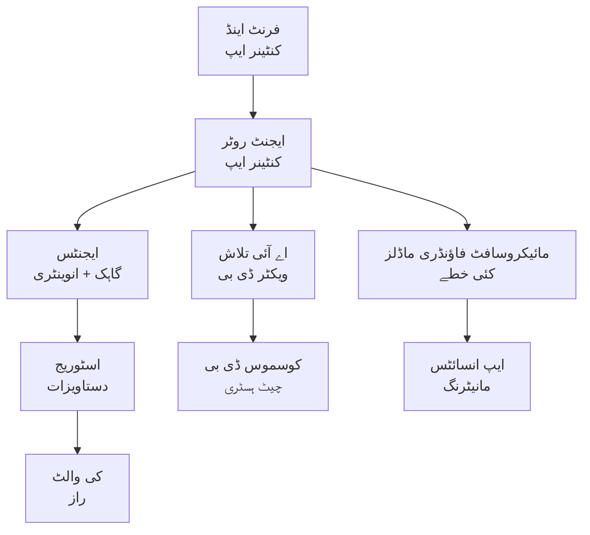

# ریٹیل ملٹی ایجنٹ حل - انفراسٹرکچر ٹیمپلیٹ

**باب ۵: پیداوار کی تعیناتی پیکیج**  
- **📚 کورس ہوم**: [AZD برائے ابتدائی حضرات](../../README.md)  
- **📖 متعلقہ باب**: [باب ۵: ملٹی ایجنٹ AI حل](../../README.md#-chapter-5-multi-agent-ai-solutions-advanced)  
- **📝 منظرنامہ گائیڈ**: [مکمل فن تعمیر](../retail-scenario.md)  
- **🎯 فوری تعیناتی**: [ایک کلک میں تعیناتی](#-quick-deployment)

> **⚠️ صرف انفراسٹرکچر ٹیمپلیٹ**  
> یہ ARM ٹیمپلیٹ ایک ملٹی ایجنٹ سسٹم کے لیے **Azure وسائل** تعینات کرتا ہے۔  
>  
> **کیا تعینات کیا جاتا ہے (۱۵-۲۵ منٹ):**  
> - ✅ Microsoft Foundry ماڈلز (gpt-4.1, gpt-4.1-mini, ۳ علاقوں میں ایمبیڈنگز)  
> - ✅ AI سرچ سروس (خالی، انڈیکس بنانے کے لیے تیار)  
> - ✅ کنٹینر ایپس (پلیس ہولڈر امیجز، آپ کے کوڈ کے لیے تیار)  
> - ✅ اسٹوریج، Cosmos DB، کی والٹ، ایپلیکیشن انسائٹس  
>  
> **کیا شامل نہیں ہے (ترقی درکار ہے):**  
> - ❌ ایجنٹ نفاذ کوڈ (کسٹمر ایجنٹ، انوینٹری ایجنٹ)  
> - ❌ روٹنگ لاجک اور API اینڈ پوائنٹس  
> - ❌ فرنٹ اینڈ چیٹ UI  
> - ❌ سرچ انڈیکس اسکیمیں اور ڈیٹا پائپ لائنز  
> - ❌ **تخمینہ ترقیاتی کوشش: ۸۰-۱۲۰ گھنٹے**  
>  
> **اس ٹیمپلیٹ کو استعمال کریں اگر:**  
> - ✅ آپ ملٹی ایجنٹ پروجیکٹ کے لیے Azure انفراسٹرکچر مہیا کرنا چاہتے ہیں  
> - ✅ آپ ایجنٹ نفاذ الگ سے تیار کرنے کا ارادہ رکھتے ہیں  
> - ✅ آپ کو پیداوار کے قابل انفراسٹرکچر بیس لائن چاہیے  
>  
> **استعمال نہ کریں اگر:**  
> - ❌ آپ کو فوری کام کرنے والا ملٹی ایجنٹ ڈیمو چاہیے  
> - ❌ آپ مکمل ایپلیکیشن کوڈ مثالیں تلاش کر رہے ہیں

## جائزہ

یہ ڈائریکٹری ایک جامع Azure Resource Manager (ARM) ٹیمپلیٹ پر مشتمل ہے جو ملٹی ایجنٹ کسٹمر سپورٹ سسٹم کی **انفراسٹرکچر کی بنیاد** تعینات کرتی ہے۔ ٹیمپلیٹ تمام ضروری Azure سروسز کو مناسب طریقے سے کنفیگر کر کے انٹرکنیکٹ کرتا ہے، آپ کی ایپلیکیشن ڈیولپمنٹ کے لئے تیار۔

**تعیناتی کے بعد آپ کے پاس ہوگا:** پیداوار کے لئے تیار Azure انفراسٹرکچر  
**سسٹم مکمل کرنے کے لیے آپ کو چاہیے:** ایجنٹ کوڈ، فرنٹ اینڈ یوزر انٹرفیس، اور ڈیٹا کنفیگریشن (دیکھیں [آرکیٹیکچر گائیڈ](../retail-scenario.md))

## 🎯 کیا تعینات کیا جائے گا

### بنیادی انفراسٹرکچر (تعیناتی کے بعد کی حالت)

✅ **Microsoft Foundry ماڈلز سروسز** (API کالز کے لیے تیار)  
  - پرائمری علاقہ: gpt-4.1 تعیناتی (۲۰ ہزار TPM صلاحیت)  
  - سیکنڈری علاقہ: gpt-4.1-mini تعیناتی (۱۰ ہزار TPM صلاحیت)  
  - تیسرا علاقہ: ٹیکسٹ ایمبیڈنگ ماڈل (۳۰ ہزار TPM صلاحیت)  
  - تشخیصی علاقہ: gpt-4.1 گریڈر ماڈل (۱۵ ہزار TPM صلاحیت)  
  - **حالت:** مکمل طور پر فعال - فوری API کالز کر سکتا ہے

✅ **Azure AI سرچ** (خالی - کنفیگریشن کے لئے تیار)  
  - ویکٹر سرچ کی قابلیت فعال  
  - ۱ پارٹیشن، ۱ رپلیکا کے ساتھ اسٹینڈرڈ ٹئیر  
  - **حالت:** سروس چل رہی ہے، لیکن انڈیکس بنانے کی ضرورت ہے  
  - **ضروری کارروائی:** اپنے اسکیمہ کے ساتھ سرچ انڈیکس بنائیں

✅ **Azure اسٹوریج اکاؤنٹ** (خالی - اپلوڈ کے لئے تیار)  
  - بلاک کنٹینرز: `documents`, `uploads`  
  - محفوظ کنفیگریشن (صرف HTTPS، عوامی رسائی نہیں)  
  - **حالت:** فائلیں وصول کرنے کے لئے تیار  
  - **ضروری کارروائی:** اپنے پراڈکٹ ڈیٹا اور دستاویزات اپلوڈ کریں

⚠️ **کنٹینر ایپس ماحول** (پلیس ہولڈر امیجز تعینات)  
  - ایجنٹ روٹر ایپ (nginx ڈیفالٹ تصویر)  
  - فرنٹ اینڈ ایپ (nginx ڈیفالٹ تصویر)  
  - آٹو اسکیلنگ کنفیگرڈ (۰-۱۰ انسٹینسز)  
  - **حالت:** پلیس ہولڈر کنٹینرز چل رہے ہیں  
  - **ضروری کارروائی:** اپنے ایجنٹ اپلیکیشن بنائیں اور تعینات کریں

✅ **Azure Cosmos DB** (خالی - ڈیٹا کے لئے تیار)  
  - ڈیٹا بیس اور کنٹینر پری کنفیگرڈ  
  - کم تاخیر کے آپریشنز کے لئے بہتر بنایا گیا  
  - TTL فعال برائے خودکار صفائی  
  - **حالت:** چیٹ ہسٹری ذخیرہ کرنے کے لئے تیار

✅ **Azure Key Vault** (اختیاری - سیکریٹس کے لئے تیار)  
  - سافٹ ڈیلیٹ فعال  
  - مینجڈ شناختوں کے لئے RBAC کنفیگرڈ  
  - **حالت:** API کیز اور کنکشن سٹرنگز محفوظ کرنے کے لئے تیار

✅ **Application Insights** (اختیاری - مانیٹرنگ فعال)  
  - لاگ اینالیٹکس ورک اسپیس سے منسلک  
  - حسب ضرورت میٹرکس اور الارٹس کنفیگرڈ  
  - **حالت:** آپ کے ایپس سے ٹیلی میٹری وصول کرنے کے لئے تیار  

✅ **Document Intelligence** (API کالز کے لیے تیار)  
  - پیداوار کے کاموں کے لیے S0 ٹئیر  
  - **حالت:** اپلوڈ شدہ دستاویزات پراسیس کرنے کے لیے تیار  

✅ **Bing سرچ API** (API کالز کے لیے تیار)  
  - حقیقی وقت کی تلاشوں کے لیے S1 ٹئیر  
  - **حالت:** ویب سرچ سوالات کے لیے تیار  

### تعیناتی کے طریقے

| طریقہ | OpenAI صلاحیت | کنٹینر انسٹینسز | سرچ ٹئیر | اسٹوریج ریڈنڈنسی | بہترین برائے |
|-------|--------------|------------------|-----------|-------------------|--------------|
| **کم از کم** | ۱۰ ہزار-۲۰ ہزار TPM | ۰-۲ رپلیکا | بنیادی | LRS (مقامی) | ترقی/ٹیسٹ، سیکھنا، تصدیقِ تصور |
| **معیاری** | ۳۰ ہزار-۶۰ ہزار TPM | ۲-۵ رپلیکا | معیاری | ZRS (زون) | پیداوار، معتدل ٹریفک (<۱۰ ہزار صارفین) |
| **پریمیئم** | ۸۰ ہزار-۱۵۰ ہزار TPM | ۵-۱۰ رپلیکا، زون ریڈنڈنٹ | پریمیئم | GRS (جغرافیائی) | انٹرپرائز، زیادہ ٹریفک (>۱۰ ہزار صارفین)، ۹۹.۹۹٪ SLA |

**لاگت کا اثر:**  
- **کم از کم → معیاری:** تقریباً ۴ گنا لاگت میں اضافہ ($۱۰۰-۳۷۰/ماہ → $۴۲۰-۱,۴۵۰/ماہ)  
- **معیاری → پریمیئم:** تقریباً ۳ گنا لاگت میں اضافہ ($۴۲۰-۱,۴۵۰/ماہ → $۱,۱۵۰-۳,۵۰۰/ماہ)  
- **منتخب کریں:** متوقع لوڈ، SLA ضروریات، بجٹ کی حدوں کی بنیاد پر

**صلاحیت کی منصوبہ بندی:**  
- **TPM (فی منٹ ٹوکنز):** تمام ماڈلز کی تعیناتیوں کا مجموعہ  
- **کنٹینر انسٹینسز:** آٹو اسکیلنگ کی حد (کم سے زیادہ رپلیکا)  
- **سرچ ٹئیر:** کوئری کارکردگی اور انڈیکس سائز کی حدوں کو متاثر کرتا ہے

## 📋 ضروریات

### مطلوبہ اوزار  
1. **Azure CLI** (ورژن 2.50.0 یا اس سے اوپر)  
   ```bash
   az --version  # ورژن چیک کریں
   az login      # تصدیق کریں
   ```
  
2. **فعال Azure سبسکرپشن** جس میں اونر یا کنٹریبیوٹر رسائی ہو  
   ```bash
   az account show  # سبسکرپشن کی تصدیق کریں
   ```


### مطلوبہ Azure کوٹا   
تعیناتی سے پہلے، اپنے نشانہ علاقوں میں کافی کوٹا کی تصدیق کریں:  

```bash
# اپنے خطے میں مائیکروسافٹ فاؤنڈری ماڈلز کی دستیابی چیک کریں
az cognitiveservices account list-skus \
  --kind OpenAI \
  --location eastus2

# اوپن اے آئی کوٹہ کی تصدیق کریں (gpt-4.1 کی مثال)
az cognitiveservices usage list \
  --location eastus2 \
  --query "[?name.value=='OpenAI.Standard.gpt-4.1']"

# کنٹینر ایپس کوٹہ چیک کریں
az provider show \
  --namespace Microsoft.App \
  --query "resourceTypes[?resourceType=='managedEnvironments'].locations"
```
  
**کم از کم مطلوبہ کوٹا:**  
- **Microsoft Foundry ماڈلز:** ۳-۴ ماڈل تعیناتیاں مختلف علاقوں میں  
  - gpt-4.1: ۲۰ ہزار TPM  
  - gpt-4.1-mini: ۱۰ ہزار TPM  
  - text-embedding-ada-002: ۳۰ ہزار TPM  
  - **نوٹ:** بعض علاقوں میں gpt-4.1 میں ویٹنگ لسٹ ہو سکتی ہے - چیک کریں [ماڈل کی دستیابی](https://learn.microsoft.com/azure/ai-services/openai/concepts/models)  
- **کنٹینر ایپس:** مینیجڈ ماحول + ۲-۱۰ کنٹینر انسٹینسز  
- **AI سرچ:** اسٹینڈرڈ ٹئیر (بنیادی ویکٹر سرچ کے لیے ناکافی)  
- **Cosmos DB:** اسٹینڈرڈ فراہم کردہ تھروپٹ  

**اگر کوٹا ناکافی ہو:**  
1. Azure پورٹل → کوٹا → اضافہ کی درخواست کریں  
2. یا Azure CLI استعمال کریں:  
   ```bash
   az support tickets create \
     --ticket-name "OpenAI-Quota-Increase" \
     --severity "minimal" \
     --description "Request quota increase for Microsoft Foundry Models gpt-4.1 in eastus2"
   ```
  
3. متبادل دستیاب علاقوں پر غور کریں  

## 🚀 فوری تعیناتی

### آپشن ۱: Azure CLI استعمال کرتے ہوئے  
```bash
# ٹیمپلیٹ فائلز کو کلون کریں یا ڈاؤن لوڈ کریں
git clone <repository-url>
cd examples/retail-multiagent-arm-template

# تعیناتی اسکرپٹ کو قابل عمل بنائیں
chmod +x deploy.sh

# ڈیفالٹ ترتیبات کے ساتھ تعیناتی کریں
./deploy.sh -g myResourceGroup

# پروڈکشن کے لیے پریمیم خصوصیات کے ساتھ تعیناتی کریں
./deploy.sh -g myProdRG -e prod -m premium -l eastus2
```


### آپشن ۲: Azure پورٹل استعمال کرتے ہوئے  
[](https://portal.azure.com/#create/Microsoft.Template/uri/https%3A%2F%2Fraw.githubusercontent.com%2Fmicrosoft%2Fazd-for-beginners%2Fmain%2Fexamples%2Fretail-multiagent-arm-template%2Fazuredeploy.json)

### آپشن ۳: Azure CLI براہ راست استعمال کرتے ہوئے  
```bash
# ریسورس گروپ بنائیں
az group create --name myResourceGroup --location eastus2

# ٹیمپلیٹ تعینات کریں
az deployment group create \
  --resource-group myResourceGroup \
  --template-file azuredeploy.json \
  --parameters azuredeploy.parameters.json
```


## ⏱️ تعیناتی کا شیڈول

### کیا توقع رکھیں

| مرحلہ | دورانیہ | کیا ہوتا ہے |
|-------|---------|------------|
| **ٹیمپلیٹ کی توثیق** | ۳۰-۶۰ سیکنڈ | Azure ARM ٹیمپلیٹ کی نحو اور پیرامیٹرز کی توثیق کرتا ہے |
| **ریسورس گروپ کی تشکیل** | ۱۰-۲۰ سیکنڈ | ریسورس گروپ بناتا ہے (اگر ضرورت ہو) |
| **OpenAI کی فراہمی** | ۵-۸ منٹ | ۳-۴ OpenAI اکاؤنٹس بناتا ہے اور ماڈلز تعینات کرتا ہے |
| **کنٹینر ایپس** | ۳-۵ منٹ | ماحول بناتا ہے اور پلیس ہولڈر کنٹینرز تعینات کرتا ہے |
| **سرچ اور اسٹوریج** | ۲-۴ منٹ | AI سرچ سروس اور اسٹوریج اکاؤنٹس فراہم کرتا ہے |
| **Cosmos DB** | ۲-۳ منٹ | ڈیٹا بیس بناتا ہے اور کنٹینرز کنفیگر کرتا ہے |
| **مانیٹرنگ سیٹ اپ** | ۲-۳ منٹ | ایپلیکیشن انسائٹس اور لاگ اینالیٹکس سیٹ اپ کرتا ہے |
| **RBAC کنفیگریشن** | ۱-۲ منٹ | مینیجڈ شناختیں اور اجازتیں کنفیگر کرتا ہے |
| **کل تعیناتی** | **۱۵-۲۵ منٹ** | مکمل انفراسٹرکچر تیار |

**تعیناتی کے بعد:**  
- ✅ **انفراسٹرکچر تیار:** تمام Azure سروسز پروویژنز ہو چکے ہیں اور چل رہی ہیں  
- ⏱️ **ایپلیکیشن ڈیولپمنٹ:** ۸۰-۱۲۰ گھنٹے (آپ کی ذمہ داری)  
- ⏱️ **انڈیکس کنفیگریشن:** ۱۵-۳۰ منٹ (آپ کے اسکیمہ کی ضرورت)  
- ⏱️ **ڈیٹا اپلوڈ:** ڈیٹا سیٹ کے سائز کے مطابق مختلف  
- ⏱️ **ٹیسٹنگ اور توثیق:** ۲-۴ گھنٹے  

---

## ✅ تعیناتی کی کامیابی کی تصدیق کریں

### مرحلہ ۱: ریسورس پروویژننگ چیک کریں (۲ منٹ)  
```bash
# تصدیق کریں کہ تمام وسائل کامیابی کے ساتھ تعینات ہو گئے ہیں
az resource list \
  --resource-group myResourceGroup \
  --query "[?provisioningState!='Succeeded'].{Name:name, Status:provisioningState, Type:type}" \
  --output table
```
  
**متوقع:** خالی جدول (تمام وسائل "کامیاب" حالت دکھائیں)  

### مرحلہ ۲: Microsoft Foundry ماڈلز کی تعیناتی کی تصدیق (۳ منٹ)  
```bash
# تمام OpenAI اکاؤنٹس کی فہرست بنائیں
az cognitiveservices account list \
  --resource-group myResourceGroup \
  --query "[?kind=='OpenAI'].{Name:name, Location:location, Status:properties.provisioningState}" \
  --output table

# پرائمری ریجن کے لیے ماڈل تعیناتیاں چیک کریں
OPENAI_NAME=$(az cognitiveservices account list \
  --resource-group myResourceGroup \
  --query "[?kind=='OpenAI'] | [0].name" -o tsv)

az cognitiveservices account deployment list \
  --name $OPENAI_NAME \
  --resource-group myResourceGroup \
  --output table
```
  
**متوقع:**  
- ۳-۴ OpenAI اکاؤنٹس (پرائمری، سیکنڈری، تیسری، تشخیصی علاقے)  
- ہر اکاؤنٹ پر ۱-۲ ماڈل کی تعیناتیاں (gpt-4.1, gpt-4.1-mini, text-embedding-ada-002)  

### مرحلہ ۳: انفراسٹرکچر اینڈ پوائنٹس ٹیسٹ کریں (۵ منٹ)  
```bash
# کنٹینر ایپ کے یو آر ایل حاصل کریں
az containerapp list \
  --resource-group myResourceGroup \
  --query "[].{Name:name, URL:properties.configuration.ingress.fqdn, Status:properties.runningStatus}" \
  --output table

# راؤٹر اینڈپوائنٹ کی جانچ کریں (پلیس ہولڈر تصویر جواب دے گی)
ROUTER_URL=$(az containerapp show \
  --name retail-router \
  --resource-group myResourceGroup \
  --query "properties.configuration.ingress.fqdn" -o tsv)

echo "Testing: https://$ROUTER_URL"
curl -I https://$ROUTER_URL || echo "Container running (placeholder image - expected)"
```
  
**متوقع:**  
- کنٹینر ایپس "چل رہی" حالت دکھائیں  
- پلیس ہولڈر nginx HTTP 200 یا 404 جواب دے (ابھی کوئی ایپلیکیشن کوڈ نہیں)  

### مرحلہ ۴: Microsoft Foundry ماڈلز API تک رسائی کی تصدیق (۳ منٹ)  
```bash
# اوپن اے آئی کا اینڈ پوائنٹ اور کلید حاصل کریں
OPENAI_ENDPOINT=$(az cognitiveservices account show \
  --name $OPENAI_NAME \
  --resource-group myResourceGroup \
  --query "properties.endpoint" -o tsv)

OPENAI_KEY=$(az cognitiveservices account keys list \
  --name $OPENAI_NAME \
  --resource-group myResourceGroup \
  --query "key1" -o tsv)

# جی پی ٹی-4.1 کی تعیناتی کا تجربہ کریں
curl "${OPENAI_ENDPOINT}openai/deployments/gpt-4.1/chat/completions?api-version=2024-08-01-preview" \
  -H "Content-Type: application/json" \
  -H "api-key: $OPENAI_KEY" \
  -d '{
    "messages": [{"role": "user", "content": "Say hello"}],
    "max_tokens": 10
  }'
```
  
**متوقع:** JSON جواب جس میں چیٹ تکمیل ہو (OpenAI فعال ہونے کی تصدیق)  

### کیا کام کر رہا ہے اور کیا نہیں

**✅ تعیناتی کے بعد کام کر رہا ہے:**  
- Microsoft Foundry ماڈلز تعینات اور API کالز قبول کر رہے ہیں  
- AI سرچ سروس چل رہی ہے (خالی، ابھی انڈیکس نہیں بنائے گئے)  
- کنٹینر ایپس چل رہی ہیں (پلیس ہولڈر nginx امیجز)  
- اسٹوریج اکاؤنٹس قابل رسائی اور اپلوڈ کے لیے تیار  
- Cosmos DB ڈیٹا آپریشنز کے لیے تیار  
- ایپلیکیشن انسائٹس انفراسٹرکچر ٹیلی میٹری جمع کر رہا ہے  
- کی والٹ سیکریٹس محفوظ کرنے کے لیے تیار  

**❌ ابھی کام نہیں کر رہا (ترقی درکار):**  
- ایجنٹ اینڈ پوائنٹس (کوئی ایپلیکیشن کوڈ تعینات نہیں ہوا)  
- چیٹ فنکشنلٹی (فرنٹ اینڈ + بیک اینڈ نفاذ کی ضرورت)  
- سرچ کوئریاں (کوئی سرچ انڈیکس نہیں بنایا گیا)  
- دستاویز پراسیسنگ پائپ لائن (کوئی ڈیٹا اپلوڈ نہیں ہوا)  
- کسٹم ٹیلی میٹری (ایپلیکیشن انسٹرومنٹیشن کی ضرورت)  

**اگلے اقدامات:** اپنی ایپلیکیشن تیار اور تعینات کرنے کے لئے [تعیناتی کے بعد کی ترتیب](#-post-deployment-next-steps) دیکھیں  

---

## ⚙️ ترتیب کے اختیارات

### ٹیمپلیٹ پیرامیٹرز

| پیرامیٹر | قسم | ڈیفالٹ | وضاحت |
|-----------|------|---------|---------|
| `projectName` | string | "retail" | تمام وسائل کے ناموں کے لیے پیش لفظ  |
| `location` | string | Resource group location | پرائمری تعیناتی علاقہ  |
| `secondaryLocation` | string | "westus2" | ملٹی ریجن تعیناتی کے لیے سیکنڈری علاقہ  |
| `tertiaryLocation` | string | "francecentral" | ایمبیڈنگ ماڈل کے لیے علاقہ  |
| `environmentName` | string | "dev" | ماحول کی شناخت (dev/staging/prod)  |
| `deploymentMode` | string | "standard" | تعیناتی کی کنفیگریشن (minimal/standard/premium)  |
| `enableMultiRegion` | bool | true | ملٹی ریجن تعیناتی کو فعال کریں  |
| `enableMonitoring` | bool | true | ایپلیکیشن انسائٹس اور لاگنگ کو فعال کریں  |
| `enableSecurity` | bool | true | کی والٹ اور بہتر سیکورٹی کو فعال کریں  |

### پیرامیٹرز کو حسب ضرورت بنانا

`azuredeploy.parameters.json` کو ایڈٹ کریں:  
```json
{
  "$schema": "https://schema.management.azure.com/schemas/2019-04-01/deploymentParameters.json#",
  "contentVersion": "1.0.0.0",
  "parameters": {
    "projectName": {
      "value": "mycompany"
    },
    "environmentName": {
      "value": "prod"
    },
    "deploymentMode": {
      "value": "premium"
    },
    "location": {
      "value": "eastus2"
    }
  }
}
```


## 🏗️ فن تعمیر کا جائزہ  


## 📖 تعیناتی اسکرپٹ کا استعمال

`deploy.sh` اسکرپٹ ایک انٹرایکٹو تعیناتی کا تجربہ فراہم کرتا ہے:  
```bash
# مدد دکھائیں
./deploy.sh --help

# بنیادی تعیناتی
./deploy.sh -g myResourceGroup

# حسب ضرورت ترتیبات کے ساتھ اعلی درجے کی تعیناتی
./deploy.sh \
  -g myProductionRG \
  -p companyname \
  -e prod \
  -m premium \
  -l eastus2

# بغیر ملٹی ریجن کے ترقیاتی تعیناتی
./deploy.sh \
  -g myDevRG \
  -e dev \
  -m minimal \
  --no-multi-region \
  --no-security
```


### اسکرپٹ خصوصیات

- ✅ **ضروریات کی توثیق** (Azure CLI، لاگ ان کی حالت، ٹیمپلیٹ فائلز)  
- ✅ **ریسورس گروپ مینجمنٹ** (اگر موجود نہ ہو تو بنائیں)  
- ✅ **تعیناتی سے پہلے ٹیمپلیٹ کی توثیق**  
- ✅ **پیش رفت کی مانیٹرنگ** رنگین آؤٹ پٹ کے ساتھ  
- ✅ **تعیناتی کے نتائج کی نمائش**  
- ✅ **تعیناتی کے بعد رہنمائی**  

## 📊 تعیناتی کی مانیٹرنگ

### تعیناتی کی حالت چیک کریں  
```bash
# پر تعینات کی فہرست بنائیں
az deployment group list --resource-group myResourceGroup --output table

# تعیناتی کی تفصیلات حاصل کریں
az deployment group show \
  --resource-group myResourceGroup \
  --name retail-deployment-YYYYMMDD-HHMMSS

# تعیناتی کی پیش رفت دیکھیں
az deployment group create \
  --resource-group myResourceGroup \
  --template-file azuredeploy.json \
  --parameters azuredeploy.parameters.json \
  --verbose
```


### تعیناتی کے نتائج  

کامیاب تعیناتی کے بعد درج ذیل نتائج دستیاب ہوتے ہیں:  

- **فرنٹ اینڈ URL**: ویب انٹرفیس کے لیے عوامی اینڈ پوائنٹ  
- **روٹر URL**: ایجنٹ روٹر کے لیے API اینڈ پوائنٹ  
- **OpenAI اینڈ پوائنٹس**: پرائمری اور سیکنڈری OpenAI سروس کے اینڈ پوائنٹس  
- **سرچ سروس**: Azure AI سرچ سروس کا اینڈ پوائنٹ  
- **اسٹوریج اکاؤنٹ**: دستاویزات کے لیے اسٹوریج اکاؤنٹ کا نام  
- **کی والٹ**: کی والٹ کا نام (اگر فعال ہو)  
- **ایپلیکیشن انسائٹس**: مانیٹرنگ سروس کا نام (اگر فعال ہو)  

## 🔧 تعیناتی کے بعد: اگلے اقدامات
> **📝 اہم:** انفراسٹرکچر تعینات کی گئی ہے، لیکن آپ کو ایپلیکیشن کوڈ تیار کرنا اور تعینات کرنا ہوگا۔

### مرحلہ 1: ایجنٹ ایپلیکیشنز تیار کریں (آپ کی ذمہ داری)

ARM ٹیمپلیٹ **خالی کنٹینر ایپس** بناتا ہے جن میں پلیس ہولڈر nginx تصاویر ہوتی ہیں۔ آپ کو یہ کرنا ہوگا:

**ضروری ترقی:**
1. **ایجنٹ عمل درآمد** (30-40 گھنٹے)
   - کسٹمر سروس ایجنٹ جس میں gpt-4.1 انضمام ہو
   - انوینٹری ایجنٹ جس میں gpt-4.1-mini انضمام ہو
   - ایجنٹ راستہ طے کرنے کا منطق

2. **فرنٹ اینڈ ڈیویلپمنٹ** (20-30 گھنٹے)
   - چیٹ انٹرفیس UI (React/Vue/Angular)
   - فائل اپ لوڈ کی فعالیت
   - رد عمل کی رینڈرنگ اور فارمیٹنگ

3. **بیک اینڈ سروسز** (12-16 گھنٹے)
   - FastAPI یا Express روٹر
   - تصدیق کا درمیانی حکمت عملہ
   - ٹیلی میٹری انضمام

**دیکھیں:** [آرکیٹیکچر گائیڈ](../retail-scenario.md) تفصیلی عمل درآمد کے نمونے اور کوڈ مثالوں کے لیے

### مرحلہ 2: AI سرچ انڈیکس ترتیب دیں (15-30 منٹ)

اپنے ڈیٹا ماڈل سے میل کھانے والا سرچ انڈیکس بنائیں:

```bash
# تلاش سروس کی تفصیلات حاصل کریں
SEARCH_NAME=$(az search service list \
  --resource-group myResourceGroup \
  --query "[0].name" -o tsv)

SEARCH_KEY=$(az search admin-key show \
  --service-name $SEARCH_NAME \
  --resource-group myResourceGroup \
  --query "primaryKey" -o tsv)

# اپنے اسکیمے کے ساتھ انڈیکس بنائیں (مثال)
curl -X POST "https://${SEARCH_NAME}.search.windows.net/indexes?api-version=2023-11-01" \
  -H "Content-Type: application/json" \
  -H "api-key: ${SEARCH_KEY}" \
  -d '{
    "name": "products",
    "fields": [
      {"name": "id", "type": "Edm.String", "key": true},
      {"name": "title", "type": "Edm.String", "searchable": true},
      {"name": "content", "type": "Edm.String", "searchable": true},
      {"name": "category", "type": "Edm.String", "filterable": true},
      {"name": "content_vector", "type": "Collection(Edm.Single)", 
       "searchable": true, "dimensions": 1536, "vectorSearchProfile": "default"}
    ],
    "vectorSearch": {
      "algorithms": [{"name": "default", "kind": "hnsw"}],
      "profiles": [{"name": "default", "algorithm": "default"}]
    }
  }'
```

**وسائل:**
- [AI سرچ انڈیکس سکیمہ ڈیزائن](https://learn.microsoft.com/azure/search/search-what-is-an-index)
- [وییکٹر سرچ تشکیل](https://learn.microsoft.com/azure/search/vector-search-how-to-create-index)

### مرحلہ 3: اپنا ڈیٹا اپ لوڈ کریں (وقت مختلف ہوتا ہے)

جب آپ کے پاس پروڈکٹ ڈیٹا اور دستاویزات ہوں:

```bash
# ذخیرہ اکاؤنٹ کی تفصیلات حاصل کریں
STORAGE_NAME=$(az storage account list \
  --resource-group myResourceGroup \
  --query "[0].name" -o tsv)

STORAGE_KEY=$(az storage account keys list \
  --account-name $STORAGE_NAME \
  --resource-group myResourceGroup \
  --query "[0].value" -o tsv)

# اپنے دستاویزات اپ لوڈ کریں
az storage blob upload-batch \
  --destination documents \
  --source /path/to/your/product/docs \
  --account-name $STORAGE_NAME \
  --account-key $STORAGE_KEY

# مثال: ایک فائل اپ لوڈ کریں
az storage blob upload \
  --container-name documents \
  --name "product-manual.pdf" \
  --file /path/to/product-manual.pdf \
  --account-name $STORAGE_NAME \
  --account-key $STORAGE_KEY
```

### مرحلہ 4: اپنی ایپلیکیشنز تعمیر اور تعینات کریں (8-12 گھنٹے)

جب آپ نے اپنا ایجنٹ کوڈ تیار کر لیا ہو:

```bash
# 1. ایزور کنٹینر رجسٹری بنائیں (اگر ضرورت ہو)
az acr create \
  --name myregistry \
  --resource-group myResourceGroup \
  --sku Basic

# 2. ایجنٹ روٹر امیج بنائیں اور دھکیلیں
docker build -t myregistry.azurecr.io/agent-router:v1 /path/to/your/router/code
az acr login --name myregistry
docker push myregistry.azurecr.io/agent-router:v1

# 3. فرنٹ اینڈ امیج بنائیں اور دھکیلیں
docker build -t myregistry.azurecr.io/frontend:v1 /path/to/your/frontend/code
docker push myregistry.azurecr.io/frontend:v1

# 4. اپنی امیجز کے ساتھ کنٹینر ایپس کو اپ ڈیٹ کریں
az containerapp update \
  --name retail-router \
  --resource-group myResourceGroup \
  --image myregistry.azurecr.io/agent-router:v1

az containerapp update \
  --name retail-frontend \
  --resource-group myResourceGroup \
  --image myregistry.azurecr.io/frontend:v1

# 5. ماحول کے متغیرات ترتیب دیں
az containerapp update \
  --name retail-router \
  --resource-group myResourceGroup \
  --set-env-vars \
    OPENAI_ENDPOINT=secretref:openai-endpoint \
    OPENAI_KEY=secretref:openai-key \
    SEARCH_ENDPOINT=secretref:search-endpoint \
    SEARCH_KEY=secretref:search-key
```

### مرحلہ 5: اپنی ایپلیکیشن کا ٹیسٹ کریں (2-4 گھنٹے)

```bash
# اپنی درخواست کا URL حاصل کریں
ROUTER_URL=$(az containerapp show \
  --name retail-router \
  --resource-group myResourceGroup \
  --query "properties.configuration.ingress.fqdn" -o tsv)

# ٹیسٹ ایجنٹ کا اینڈپوائنٹ (جب آپ کا کوڈ تعینات ہو جائے)
curl -X POST "https://${ROUTER_URL}/chat" \
  -H "Content-Type: application/json" \
  -d '{
    "message": "Hello, I need help with my order",
    "agent": "customer"
  }'

# درخواست کے لاگز چیک کریں
az containerapp logs show \
  --name retail-router \
  --resource-group myResourceGroup \
  --follow
```

### عمل درآمد کے وسائل

**آرکیٹیکچر اور ڈیزائن:**
- 📖 [مکمل آرکیٹیکچر گائیڈ](../retail-scenario.md) - تفصیلی عمل درآمد کے نمونے
- 📖 [ملٹی ایجنٹ ڈیزائن پیٹرنز](https://learn.microsoft.com/azure/architecture/ai-ml/guide/multi-agent-systems)

**کوڈ مثالیں:**
- 🔗 [Microsoft Foundry Models چیٹ نمونہ](https://github.com/Azure-Samples/azure-search-openai-demo) - RAG پیٹرن
- 🔗 [سیمانٹک کرنل](https://github.com/microsoft/semantic-kernel) - ایجنٹ فریم ورک (C#)
- 🔗 [لانگ چین ایجور](https://github.com/langchain-ai/langchain) - ایجنٹ آرکیسٹریشن (Python)
- 🔗 [آٹو جین](https://github.com/microsoft/autogen) - ملٹی ایجنٹ بات چیت

**تخمینی کل کوشش:**
- انفراسٹرکچر تعیناتی: 15-25 منٹ (✅ مکمل)
- ایپلیکیشن ترقی: 80-120 گھنٹے (🔨 آپ کا کام)
- ٹیسٹنگ اور آپٹیمائزیشن: 15-25 گھنٹے (🔨 آپ کا کام)

## 🛠️ مسئلہ حل کرنا

### عام مسائل

#### 1. Microsoft Foundry Models کوٹا ختم ہو گیا

```bash
# موجودہ کوٹہ کے استعمال کی جانچ کریں
az cognitiveservices usage list --location eastus2

# کوٹہ میں اضافہ کی درخواست کریں
az support tickets create \
  --ticket-name "OpenAI-Quota-Increase" \
  --severity "minimal" \
  --description "Request quota increase for Microsoft Foundry Models in region X"
```

#### 2. کنٹینر ایپس کی تعیناتی ناکام ہوئی

```bash
# کنٹینر ایپ کے لاگز چیک کریں
az containerapp logs show \
  --name retail-router \
  --resource-group myResourceGroup \
  --follow

# کنٹینر ایپ کو دوبارہ اسٹارٹ کریں
az containerapp revision restart \
  --name retail-router \
  --resource-group myResourceGroup
```

#### 3. سرچ سروس کی ابتدا

```bash
# سرچ سروس کی حیثیت کی تصدیق کریں
az search service show \
  --name <search-service-name> \
  --resource-group myResourceGroup

# سرچ سروس کی کنیکٹوٹی کا تجربہ کریں
curl -X GET "https://<search-service-name>.search.windows.net/indexes?api-version=2023-11-01" \
  -H "api-key: <search-admin-key>"
```

### تعیناتی کی تصدیق

```bash
# تصدیق کریں کہ تمام وسائل بنائے گئے ہیں
az resource list \
  --resource-group myResourceGroup \
  --output table

# وسائل کی صحت چیک کریں
az resource list \
  --resource-group myResourceGroup \
  --query "[?provisioningState!='Succeeded'].{Name:name, Status:provisioningState, Type:type}" \
  --output table
```

## 🔐 سلامتی کے تحفظات

### کلید مینجمنٹ
- تمام راز Azure Key Vault میں محفوظ ہیں (جب فعال ہو)
- کنٹینر ایپس میں شناخت کے انتظام کے لیے Managed Identity استعمال ہوتی ہے
- اسٹوریج اکاؤنٹس میں محفوظ ترتیبات (صرف HTTPS، عوامی بلب تک رسائی نہیں)

### نیٹ ورک سیکیورٹی
- جہاں ممکن ہو، کنٹینر ایپس اندرونی نیٹ ورکنگ استعمال کرتی ہیں
- سرچ سروس میں نجی اینڈ پوائنٹس کا آپشن ترتیب دیا گیا ہے
- Cosmos DB میں کم سے کم مطلوبہ اجازتیں دی گئی ہیں

### RBAC تشکیل
```bash
# مینیجڈ شناخت کے لیے ضروری کردار تفویض کریں
az role assignment create \
  --assignee <container-app-managed-identity> \
  --role "Cognitive Services OpenAI User" \
  --scope <openai-resource-id>
```

## 💰 لاگت کی بہترکاری

### لاگت کا تخمینہ (ماہانہ، امریکی ڈالر)

| موڈ | اوپن AI | کنٹینر ایپس | سرچ | اسٹوریج | کل تخمینہ |
|------|--------|----------------|--------|---------|------------|
| کم از کم | $50-200 | $20-50 | $25-100 | $5-20 | $100-370 |
| معیاری | $200-800 | $100-300 | $100-300 | $20-50 | $420-1450 |
| پریمیم | $500-2000 | $300-800 | $300-600 | $50-100 | $1150-3500 |

### لاگت کی نگرانی

```bash
# بجٹ کے انتباہات مرتب کریں
az consumption budget create \
  --account-name <subscription-id> \
  --budget-name "retail-budget" \
  --amount 500 \
  --time-grain Monthly \
  --start-date 2024-01-01 \
  --end-date 2024-12-31
```

## 🔄 اپ ڈیٹس اور دیکھ بھال

### ٹیمپلیٹ اپ ڈیٹس
- ARM ٹیمپلیٹ فائلوں کا ورژن کنٹرول کریں
- تبدیلیوں کو پہلے ترقیاتی ماحول میں آزمائیں
- اپ ڈیٹس کے لیے incremental deployment موڈ استعمال کریں

### وسائل کی اپ ڈیٹس
```bash
# نئے پیرا میٹرز کے ساتھ اپ ڈیٹ کریں
az deployment group create \
  --resource-group myResourceGroup \
  --template-file azuredeploy.json \
  --parameters azuredeploy.parameters.json \
  --mode Incremental
```

### بیک اپ اور ریکوری
- Cosmos DB کا خودکار بیک اپ فعال ہے
- Key Vault کا soft delete فعال ہے
- کنٹینر ایپ کے ریویژنز کو رول بیک کے لیے برقرار رکھا گیا ہے

## 📞 سپورٹ

- **ٹیمپلیٹ مسائل:** [GitHub Issues](https://github.com/microsoft/azd-for-beginners/issues)
- **Azure سپورٹ:** [Azure Support Portal](https://portal.azure.com/#blade/Microsoft_Azure_Support/HelpAndSupportBlade)
- **کمیونٹی:** [Azure AI Discord](https://discord.gg/microsoft-azure)

---

**⚡ اپنے ملٹی ایجنٹ حل کی تعیناتی شروع کرنے کے لیے تیار؟**

شروع کریں: `./deploy.sh -g myResourceGroup`

---

<!-- CO-OP TRANSLATOR DISCLAIMER START -->
**ڈس کلیمر**:  
یہ دستاویز AI ترجمہ سروس [Co-op Translator](https://github.com/Azure/co-op-translator) کا استعمال کرتے ہوئے ترجمہ کی گئی ہے۔ اگرچہ ہم درستگی کے لیے کوشاں ہیں، براہ کرم یہ بات ذہن میں رکھیں کہ خودکار تراجم میں غلطیاں یا غیر یقینی باتیں ہوسکتی ہیں۔ اصل دستاویز اپنی مادری زبان میں معتبر ذریعہ سمجھی جانی چاہیے۔ اہم معلومات کے لیے پیشہ ورانہ انسانی ترجمہ کی سفارش کی جاتی ہے۔ اس ترجمے کے استعمال سے پیدا ہونے والی کسی بھی غلط فہمی یا غلط تشریح کی ذمہ داری ہم پر نہیں ہوگی۔
<!-- CO-OP TRANSLATOR DISCLAIMER END -->