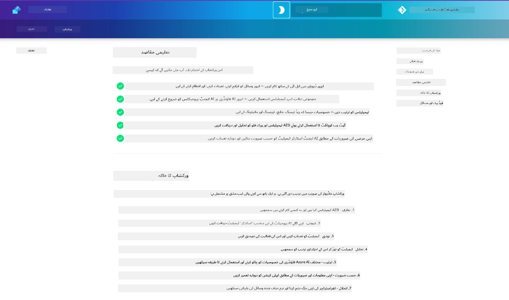

<div align="center">
  <div style="background: linear-gradient(135deg, #0078d4, #106ebe); border-radius: 10px; padding: 20px; margin: 20px 0; box-shadow: 0 4px 15px rgba(0, 120, 212, 0.3); border: 2px solid #005a9e;">
    <h2 style="color: white; margin: 0; font-size: 24px; text-shadow: 1px 1px 2px rgba(0,0,0,0.3);">
      🎯 AZD برائے AI ڈیولپرز ورکشاپ
    </h2>
    <p style="color: white; margin: 10px 0 0 0; font-size: 16px; text-shadow: 1px 1px 2px rgba(0,0,0,0.3);">
      <strong>Azure Developer CLI کے ساتھ AI ایپلیکیشنز بنانے کے لیے ایک عملی ورکشاپ۔</strong><br>
      AZD ٹیمپلیٹس اور AI ڈپلائمنٹ ورک فلو کو ماسٹر کرنے کے لیے 7 ماڈیول مکمل کریں۔
    </p>
    <div style="margin-top: 15px;">
      <span style="background: rgba(255,255,255,0.2); padding: 5px 10px; border-radius: 15px; color: white; font-size: 14px;">
        📅 آخری اپ ڈیٹ: فروری 2026
      </span>
    </div>
  </div>
</div>

# AZD برائے AI ڈیولپرز ورکشاپ

Azure Developer CLI (AZD) سیکھنے کے لیے ایک عملی ورکشاپ میں خوش آمدید جس کی توجہ AI ایپلیکیشن ڈپلائمنٹ پر ہے۔ یہ ورکشاپ آپ کو AZD ٹیمپلیٹس کی عملی سمجھ 3 مراحل میں حاصل کرنے میں مدد دیتی ہے:

1. **دریافت** - وہ ٹیمپلیٹ تلاش کریں جو آپ کے لیے درست ہو۔
1. **ڈپلائمنٹ** - ڈیپلائے کریں اور تصدیق کریں کہ یہ کام کرتا ہے
1. **حسب ضرورت** - ترمیم کریں اور اسے اپنا بنائیں!

اس ورکشاپ کے دوران، آپ کو بنیادی ڈیولپر ٹولز اور ورک فلو سے بھی متعارف کرایا جائے گا، تاکہ آپ کی مکمل ترقیاتی سفر کو آسان بنایا جا سکے۔

<br/>

## براؤزر بیسڈ گائیڈ

ورکشاپ کے اسباق مارک ڈاؤن میں ہیں۔ آپ انہیں براہ راست GitHub میں نیویگیٹ کر سکتے ہیں - یا نیچے دی گئی اسکرین شاٹ میں دکھائے گئے براؤزر بیسڈ پری ویو کو لانچ کریں۔



اس آپشن کو استعمال کرنے کے لیے - ریپوزٹری کو اپنے پروفائل پر فورک کریں، اور GitHub Codespaces لانچ کریں۔ جب VS Code کا ٹرمینل فعال ہو، تو یہ کمانڈ ٹائپ کریں:

```bash title="" linenums="0"
mkdocs serve > /dev/null 2>&1 &
```

چند سیکنڈ میں، آپ کو ایک پاپ اپ ڈائیلاگ نظر آئے گا۔ `Open in browser` کا آپشن منتخب کریں۔ ویب بیسڈ گائیڈ اب نئے براؤزر ٹیب میں کھلے گا۔ اس پری ویو کے کچھ فائدے:

1. **بنا ہوا سرچ** - کی ورڈز یا اسباق آسانی سے تلاش کریں۔
1. **کاپی آئیکن** - کوڈ بلاکس پر ہور کریں تاکہ یہ آپشن دکھائی دے
1. **تھیم ٹوگل** - ڈارک اور لائٹ تھیمز کے درمیان سوئچ کریں
1. **مدد حاصل کریں** - فوٹر میں Discord آئیکن پر کلک کریں اور شامل ہوں!

<br/>

## ورکشاپ کا جائزہ

**دورانیہ:** 3-4 گھنٹے  
**سطح:** نو آموز سے متوسط  
**مقدمات:** Azure، AI تصورات، VS Code اور کمانڈ لائن ٹولز کی واقفیت۔

یہ ایک عملی ورکشاپ ہے جہاں آپ کرتے ہوئے سیکھتے ہیں۔ جب آپ مشقیں مکمل کر لیں، تو ہم تجویز کرتے ہیں کہ آپ AZD فار بیگنرز نصاب کا جائزہ لیں تاکہ آپ اپنی سیکھنے کا سفر سیکیورٹی اور پیداواری صلاحیت کی بہترین مشقوں کی طرف جاری رکھ سکیں۔

| وقت| ماڈیول  | مقصد |
|:---|:---|:---|
| 15 منٹ | [تعارف](docs/instructions/0-Introduction.md) | پس منظر سیٹ کریں، مقاصد سمجھیں |
| 30 منٹ | [AI ٹیمپلیٹ منتخب کریں](docs/instructions/1-Select-AI-Template.md) | اختیارات دریافت کریں اور آغاز کریں | 
| 30 منٹ | [AI ٹیمپلیٹ کی تصدیق کریں](docs/instructions/2-Validate-AI-Template.md) | Azure پر ڈیفالٹ حل ڈیپلائے کریں |
| 30 منٹ | [AI ٹیمپلیٹ کو تحلیل کریں](docs/instructions/3-Deconstruct-AI-Template.md) | ساخت اور کنفیگریشن دریافت کریں |
| 30 منٹ | [AI ٹیمپلیٹ کو ترتیب دیں](docs/instructions/4-Configure-AI-Template.md) | دستیاب خصوصیات فعال کریں اور آزمایں |
| 30 منٹ | [AI ٹیمپلیٹ کو حسب ضرورت بنائیں](docs/instructions/5-Customize-AI-Template.md) | ٹیمپلیٹ کو اپنی ضروریات کے مطابق بنائیں |
| 30 منٹ | [انفراسٹرکچر کا خاتمہ](docs/instructions/6-Teardown-Infrastructure.md) | صفائی اور وسائل کو آزاد کریں |
| 15 منٹ | [خلاصہ اور اگلے اقدامات](docs/instructions/7-Wrap-up.md) | تعلیمی وسائل، ورکشاپ چیلنج |

<br/>

## آپ کیا سیکھیں گے

AZD ٹیمپلیٹ کو ایک لرننگ سینڈباکس کے طور پر سوچیں تاکہ آپ Microsoft Foundry پر اینڈ ٹو اینڈ ڈویلپمنٹ کے مختلف امکانات اور ٹولز کو دریافت کر سکیں۔ اس ورکشاپ کے آخر تک، آپ کو مختلف ٹولز اور تصورات کا ایک فطری اندازہ ہو جانا چاہیے۔

| تصور  | مقصد |
|:---|:---|
| **Azure Developer CLI** | ٹول کے کمانڈز اور ورک فلو سمجھیں |
| **AZD ٹیمپلیٹس**| پروجیکٹ کی ساخت اور کنفیگریشن سمجھیں |
| **Azure AI Agent**| Microsoft Foundry پروجیکٹ کا پروویژن اور ڈپلائمنٹ |
| **Azure AI Search**| ایجنٹس کے ساتھ کانٹیکسٹ انجینئرنگ کو فعال کریں |
| **مانیٹرنگ**| ٹریسنگ، مانیٹرنگ اور جائزہ دریافت کریں |
| **ریڈ ٹیمنگ**| دشمنانہ ٹیسٹنگ اور تخفیف کو دریافت کریں |

<br/>

## ورکشاپ کی ساخت

ورکشاپ آپ کو ٹیمپلیٹ کی دریافت، ڈیپلائمنٹ، تحلیل، اور حسب ضرورت بنانے کے سفر پر لے جاتی ہے - جس کی بنیاد رسمی [Getting Started with AI Agents](https://github.com/Azure-Samples/get-started-with-ai-agents) اسٹارٹر ٹیمپلیٹ ہے۔

### [ماڈیول 1: AI ٹیمپلیٹ منتخب کریں](docs/instructions/1-Select-AI-Template.md) (30 منٹ)

- AI ٹیمپلیٹس کیا ہیں؟
- AI ٹیمپلیٹس کہاں تلاش کیے جا سکتے ہیں؟
- AI ایجنٹس بنانا کیسے شروع کریں؟
- **لیب:** GitHub Codespaces کے ساتھ فوری آغاز

### [ماڈیول 2: AI ٹیمپلیٹ کی تصدیق کریں](docs/instructions/2-Validate-AI-Template.md) (30 منٹ)

- AI ٹیمپلیٹ آرکیٹیکچر کیا ہے؟
- AZD ڈیولپمنٹ ورک فلو کیا ہے؟
- AZD ڈیولپمنٹ میں مدد کیسے حاصل کریں؟
- **لیب:** AI ایجنٹس ٹیمپلیٹ ڈیپلائے کریں اور تصدیق کریں

### [ماڈیول 3: AI ٹیمپلیٹ کو تحلیل کریں](docs/instructions/3-Deconstruct-AI-Template.md) (30 منٹ)

- `.azure/` میں اپنے ماحول کو دریافت کریں
- `infra/` میں اپنے وسائل کا سیٹ اپ دریافت کریں
- `azure.yaml` میں اپنی AZD کنفیگریشن دریافت کریں
- **لیب:** ماحول کے متغیرات تبدیل کریں اور دوبارہ ڈیپلائے کریں

### [ماڈیول 4: AI ٹیمپلیٹ کو ترتیب دیں](docs/instructions/4-Configure-AI-Template.md) (30 منٹ)
- دریافت کریں: Retrieval Augmented Generation
- دریافت کریں: Agent Evaluation & Red Teaming
- دریافت کریں: Tracing & Monitoring
- **لیب:** AI ایجنٹ + مانیٹرنگ کا جائزہ لیں

### [ماڈیول 5: AI ٹیمپلیٹ کو حسب ضرورت بنائیں](docs/instructions/5-Customize-AI-Template.md) (30 منٹ)
- تعریف کریں: PRD کے ساتھ سیناریو کی ضروریات
- ترتیب دیں: AZD کے لیے ماحول کے متغیرات
- عمل کریں: اضافی کاموں کے لیے Lifecycle Hooks
- **لیب:** اپنے سیناریو کے لیے ٹیمپلیٹ حسب ضرورت بنائیں

### [ماڈیول 6: انفراسٹرکچر کا خاتمہ](docs/instructions/6-Teardown-Infrastructure.md) (30 منٹ)
- خلاصہ: AZD ٹیمپلیٹس کیا ہیں؟
- خلاصہ: Azure Developer CLI کیوں استعمال کریں؟
- اگلے اقدامات: کوئی مختلف ٹیمپلیٹ آزمائیں!
- **لیب:** انفراسٹرکچر ہٹائیں اور صفائی کریں

<br/>

## ورکشاپ چیلنج

کیا آپ خود کو مزید چیلنج دینا چاہتے ہیں؟ یہاں کچھ پروجیکٹ تجاویز ہیں - یا اپنے خیال ہمارے ساتھ شیئر کریں!!

| پروجیکٹ | وضاحت |
|:---|:---|
|1. **ایک پیچیدہ AI ٹیمپلیٹ کو تحلیل کریں** | ہم نے جو ورک فلو اور ٹولز بتائے ہیں ان کو استعمال کریں اور دیکھیں کہ کیا آپ مختلف AI حل کا ٹیمپلیٹ ڈیپلائے، تصدیق، اور حسب ضرورت بنا سکتے ہیں۔ _آپ نے کیا سیکھا؟_|
|2. **اپنے سیناریو کے ساتھ حسب ضرورت بنائیں**  | کسی مختلف سیناریو کے لیے PRD (پروڈکٹ ریکوائرمنٹس ڈاکیومنٹ) لکھنے کی کوشش کریں۔ پھر اپنے ٹیمپلیٹ ریپو میں GitHub Copilot استعمال کریں ایجنٹ ماڈل میں - اور اسے حسب ضرورت ورک فلو بنانے کو کہیں۔ _آپ نے کیا سیکھا؟ آپ ان تجاویز کو کیسے بہتر بنا سکتے ہیں؟_|
| | |

## رائے دیجیے؟

1. اس ریپوزٹری میں مسئلہ پوسٹ کریں - سہولت کے لیے اسے `Workshop` ٹیگ کریں۔
1. Microsoft Foundry Discord میں شامل ہوں - اپنے ساتھیوں سے جڑیں!

| | | 
|:---|:---|
| **📚 کورس ہوم**| [AZD فار بیگنرز](../README.md)|
| **📖 دستاویزات** | [AI ٹیمپلیٹس کے ساتھ شروع کریں](https://learn.microsoft.com/en-us/azure/ai-foundry/how-to/develop/ai-template-get-started)|
| **🛠️AI ٹیمپلیٹس** | [Microsoft Foundry ٹیمپلیٹس](https://ai.azure.com/templates) |
|**🚀 اگلے اقدامات** | [ورکشاپ شروع کریں](../../../workshop) |
| | |

<br/>

---

**نیوی گیشن:** [مین کورس](../README.md) | [تعارف](docs/instructions/0-Introduction.md) | [ماڈیول 1: ٹیمپلیٹ منتخب کریں](docs/instructions/1-Select-AI-Template.md)

**AZD کے ساتھ AI ایپلیکیشنز بنانا شروع کرنے کے لیے تیار ہیں؟**

[ورکشاپ شروع کریں: تعارف →](docs/instructions/0-Introduction.md)

---

<!-- CO-OP TRANSLATOR DISCLAIMER START -->
**دستبرداری**:  
یہ دستاویز AI ترجمہ سروس [Co-op Translator](https://github.com/Azure/co-op-translator) کے ذریعے ترجمہ کی گئی ہے۔ جبکہ ہم درستگی کے لیے کوشش کرتے ہیں، براہ کرم نوٹ کریں کہ خودکار تراجم میں غلطیاں یا غیر صحیح معلومات ہو سکتی ہیں۔ اصل دستاویز اپنی مادری زبان میں ہی معتبر ماخذ سمجھی جانی چاہیے۔ اہم معلومات کے لیے پیشہ ور انسانی ترجمہ کی سفارش کی جاتی ہے۔ اس ترجمے کے استعمال سے پیدا ہونے والی کسی بھی غلط فہمی یا غلط تشریح کی ذمہ داری ہم پر عائد نہیں ہوتی۔
<!-- CO-OP TRANSLATOR DISCLAIMER END -->