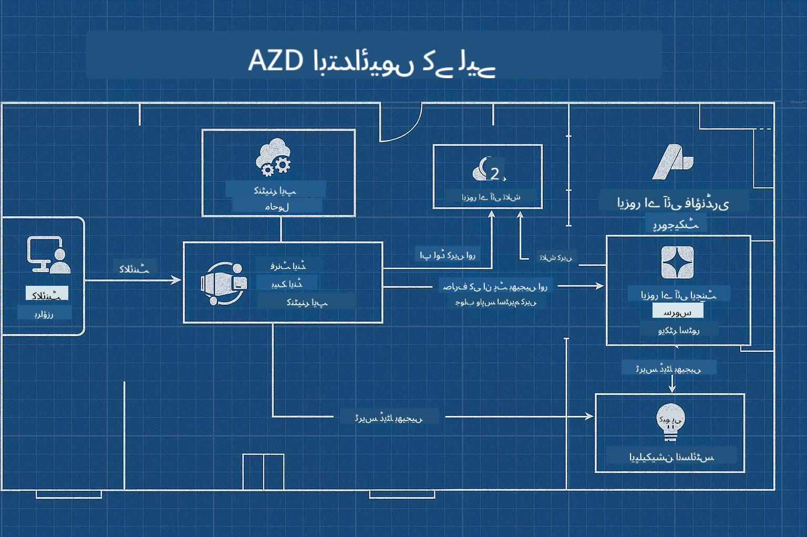

<!--
CO_OP_TRANSLATOR_METADATA:
{
  "original_hash": "245d24997bbcf2bae93bb2a503845d37",
  "translation_date": "2025-09-23T11:43:18+00:00",
  "source_file": "workshop/README.md",
  "language_code": "ur"
}
-->
# AZD برائے AI ڈیولپرز ورکشاپ

## AZD ٹیمپلیٹس

اپنے مخصوص منظرنامے کے لیے ایک انٹرپرائز گریڈ AI ایپلیکیشن حل بنانا بالکل اپنے گھر تعمیر کرنے جیسا ہے۔ آپ اسے خود ڈیزائن کر سکتے ہیں، اینٹ بہ اینٹ بنا سکتے ہیں، اور اس بات کی ذمہ داری لے سکتے ہیں کہ یہ تمام گورننس اور ترقیاتی رہنما اصولوں پر پورا اترے۔

**یا ....**

آپ کسی آرکیٹیکٹ کے ساتھ کام کر سکتے ہیں جو آپ کو ایک _بلیو پرنٹ_ دے سکتا ہے ایک ابتدائی گھر کے لیے، اور پھر آپ کے ساتھ کام کر سکتا ہے تاکہ اسے آپ کی ضروریات کے مطابق _حسب ضرورت_ بنایا جا سکے۔ یہ آپ کو اس پر توجہ مرکوز کرنے کی اجازت دیتا ہے جو **آپ کے گھر** کو خاص بناتا ہے، اور بنیادی وائرنگ، پلمبنگ اور دیگر انحصارات کو ماہرین کے ذریعے آپ کے لیے سنبھالنے دیتا ہے۔

**یہی [AI App Templates](https://ai.azure.com/templates) کے پیچھے تصور ہے** - مختلف قسم کے AI ایپلیکیشن "گھروں" کی تعمیر کے لیے بلیو پرنٹس کی ایک سیریز، اس پر منحصر ہے کہ آپ کی بنیادی ضروریات اور انحصارات کیا ہیں۔

## ٹیمپلیٹ حسب ضرورت

یہ ٹیمپلیٹس [Azure AI Foundry](https://ai.azure.com) کے ساتھ کام کرنے کے لیے ڈیزائن کیے گئے ہیں۔ اس پلیٹ فارم کو اپنے "بلڈنگ کنٹریکٹر" کے طور پر سوچیں جس کے پاس وہ تمام وسائل، ٹولز اور مہارت موجود ہے جو آپ کو کام مکمل کرنے کے لیے درکار ہے!

آپ کو صرف [اپنے ابتدائی ٹیمپلیٹس](https://learn.microsoft.com/en-us/azure/ai-foundry/how-to/develop/ai-template-get-started) کا انتخاب کرنا ہے۔ مثال کے طور پر، ہم _Get Started with AI Agents_ ٹیمپلیٹ پر توجہ مرکوز کریں گے تاکہ آپ کے لیے ایک "ایجنٹک AI ہوم" بنایا جا سکے جو AI سرچ، ریڈ ٹیمنگ، ایویلیوایشنز، ٹریسنگ، مانیٹرنگ اور مزید خصوصیات کے لیے تیار ہو!



آپ کو صرف آرکیٹیکٹ کے ساتھ وقت بک کرنے کی ضرورت ہے، جو آپ کو حسب ضرورت کے عمل میں رہنمائی کرے۔ [GitHub Copilot for Azure](https://learn.microsoft.com/en-us/azure/developer/github-copilot-azure/get-started) آپ کا وہ رہنما ہو سکتا ہے۔ بس اس سے "چیٹ کریں" تاکہ:

- اپنے ٹیمپلیٹ میں Azure خصوصیات کے بارے میں جانیں
- Azure وسائل کو تعینات کریں
- اپنی تعیناتی کے بارے میں معلومات حاصل کریں
- مسائل کی تشخیص اور ان کا حل کریں!

اس ورکشاپ میں، ہم موجودہ ٹیمپلیٹ کو _ڈی کنسٹرکٹ_ کرنا سیکھیں گے (یہ جاننے کے لیے کہ یہ کیا فراہم کرتا ہے)، پھر اسے _حسب ضرورت_ بنائیں گے (اپنی ضروریات کو پورا کرنے کے لیے) - ایک قدم بہ قدم۔

AI ٹیمپلیٹس **کام کو آسان بناتے ہیں** - ورکشاپ مکمل کر کے آپ سیکھیں گے کہ **اسے اپنا کیسے بنائیں**

----

**ورکشاپ نیویگیشن**
- **📚 کورس ہوم**: [AZD برائے ابتدائی افراد](../README.md)
- **📖 متعلقہ ابواب**: شامل ہیں [باب 1](../README.md#-chapter-1-foundation--quick-start)، [باب 2](../README.md#-chapter-2-ai-first-development-recommended-for-ai-developers)، اور [باب 5](../README.md#-chapter-5-multi-agent-ai-solutions-advanced)
- **🛠️ عملی لیب**: [AI ورکشاپ لیب](../docs/ai-foundry/ai-workshop-lab.md)
- **🚀 اگلے مراحل**: [ورکشاپ لیب ماڈیولز](../../../workshop)

Azure Developer CLI (AZD) کے ساتھ AI ایپلیکیشن تعیناتی پر توجہ مرکوز کرنے کے لیے سیکھنے کی عملی ورکشاپ میں خوش آمدید۔ یہ ورکشاپ آپ کو AZD کی بنیادی باتوں سے لے کر پروڈکشن کے لیے تیار AI حل تعینات کرنے تک لے جانے کے لیے ڈیزائن کی گئی ہے۔

## ورکشاپ کا جائزہ

**دورانیہ:** 2-3 گھنٹے  
**سطح:** ابتدائی سے درمیانی  
**پیشگی شرائط:** Azure، کمانڈ لائن ٹولز، اور AI تصورات کا بنیادی علم

### آپ کیا سیکھیں گے

- **AZD بنیادی باتیں**: AZD کے ساتھ انفراسٹرکچر کوڈ کے طور پر سمجھنا
- 🤖 **AI سروس انضمام**: Azure OpenAI، AI سرچ، اور دیگر AI خدمات کو تعینات کرنا
- **کنٹینر تعیناتی**: AI ایپلیکیشنز کے لیے Azure Container Apps کا استعمال
- **سیکیورٹی بہترین طریقے**: Managed Identity اور محفوظ کنفیگریشنز کو نافذ کرنا
- **مانیٹرنگ اور مشاہدہ**: AI ورک لوڈز کے لیے Application Insights ترتیب دینا
- **پروڈکشن پیٹرنز**: انٹرپرائز کے لیے تیار تعیناتی حکمت عملیاں

## ورکشاپ کا ڈھانچہ

### ماڈیول 1: AZD کی بنیادیں (30 منٹ)
- AZD انسٹال اور کنفیگر کرنا
- AZD پروجیکٹ ڈھانچے کو سمجھنا
- آپ کی پہلی AZD تعیناتی
- **لیب**: ایک سادہ ویب ایپلیکیشن تعینات کریں

### ماڈیول 2: Azure OpenAI انضمام (45 منٹ)
- Azure OpenAI وسائل ترتیب دینا
- ماڈل تعیناتی حکمت عملیاں
- API رسائی اور تصدیق کو ترتیب دینا
- **لیب**: GPT-4 کے ساتھ چیٹ ایپلیکیشن تعینات کریں

### ماڈیول 3: RAG ایپلیکیشنز (45 منٹ)
- Azure AI سرچ انضمام
- Azure Document Intelligence کے ساتھ دستاویز پروسیسنگ
- ویکٹر ایمبیڈنگز اور سیمینٹک سرچ
- **لیب**: ایک دستاویز Q&A سسٹم بنائیں

### ماڈیول 4: پروڈکشن تعیناتی (30 منٹ)
- کنٹینر ایپس کی کنفیگریشن
- اسکیلنگ اور کارکردگی کی اصلاح
- مانیٹرنگ اور لاگنگ
- **لیب**: مشاہدہ کے ساتھ پروڈکشن میں تعینات کریں

### ماڈیول 5: ایڈوانسڈ پیٹرنز (15 منٹ)
- ملٹی انوائرمنٹ تعیناتیاں
- CI/CD انضمام
- لاگت کی اصلاح کی حکمت عملیاں
- **اختتام**: پروڈکشن کے لیے تیاری کی چیک لسٹ

## پیشگی شرائط

### مطلوبہ ٹولز

براہ کرم ورکشاپ سے پہلے یہ ٹولز انسٹال کریں:

```bash
# Azure Developer CLI
curl -fsSL https://aka.ms/install-azd.sh | bash

# Azure CLI
curl -sL https://aka.ms/InstallAzureCLIDeb | sudo bash

# Git
sudo apt-get install git

# Docker
curl -fsSL https://get.docker.com -o get-docker.sh
sudo sh get-docker.sh

# Python 3.10+
sudo apt-get install python3.10 python3.10-venv python3-pip
```

### Azure اکاؤنٹ سیٹ اپ

1. **Azure سبسکرپشن**: [مفت سائن اپ کریں](https://azure.microsoft.com/free/)
2. **Azure OpenAI رسائی**: [رسائی کی درخواست کریں](https://aka.ms/oai/access)
3. **ضروری اجازتیں**:
   - سبسکرپشن یا ریسورس گروپ پر Contributor رول
   - User Access Administrator (RBAC اسائنمنٹس کے لیے)

### پیشگی شرائط کی تصدیق کریں

اپنے سیٹ اپ کی تصدیق کے لیے یہ اسکرپٹ چلائیں:

```bash
#!/bin/bash
echo "Verifying workshop prerequisites..."

# Check AZD installation
if command -v azd &> /dev/null; then
    echo "✅ Azure Developer CLI: $(azd --version)"
else
    echo "❌ Azure Developer CLI not found"
fi

# Check Azure CLI
if command -v az &> /dev/null; then
    echo "✅ Azure CLI: $(az --version | head -n1)"
else
    echo "❌ Azure CLI not found"
fi

# Check Docker
if command -v docker &> /dev/null; then
    echo "✅ Docker: $(docker --version)"
else
    echo "❌ Docker not found"
fi

# Check Python
if command -v python3 &> /dev/null; then
    echo "✅ Python: $(python3 --version)"
else
    echo "❌ Python 3 not found"
fi

# Check Azure login
if az account show &> /dev/null; then
    echo "✅ Azure: Logged in as $(az account show --query user.name -o tsv)"
else
    echo "❌ Azure: Not logged in (run 'az login')"
fi

echo "Setup verification complete!"
```

## ورکشاپ مواد

### لیب مشقیں

ہر ماڈیول میں اسٹارٹر کوڈ اور مرحلہ وار ہدایات کے ساتھ عملی لیبز شامل ہیں:

- **[lab-1-azd-basics/](../../../workshop/lab-1-azd-basics)** - آپ کی پہلی AZD تعیناتی
- **[lab-2-openai-chat/](../../../workshop/lab-2-openai-chat)** - Azure OpenAI کے ساتھ چیٹ ایپلیکیشن
- **[lab-3-rag-search/](../../../workshop/lab-3-rag-search)** - AI سرچ کے ساتھ RAG ایپلیکیشن
- **[lab-4-production/](../../../workshop/lab-4-production)** - پروڈکشن تعیناتی پیٹرنز
- **[lab-5-advanced/](../../../workshop/lab-5-advanced)** - ایڈوانسڈ تعیناتی منظرنامے

### حوالہ مواد

- **[AI Foundry انضمام گائیڈ](../docs/ai-foundry/azure-ai-foundry-integration.md)** - جامع انضمام پیٹرنز
- **[AI ماڈل تعیناتی گائیڈ](../docs/ai-foundry/ai-model-deployment.md)** - ماڈل تعیناتی بہترین طریقے
- **[پروڈکشن AI طریقے](../docs/ai-foundry/production-ai-practices.md)** - انٹرپرائز تعیناتی پیٹرنز
- **[AI ٹربل شوٹنگ گائیڈ](../docs/troubleshooting/ai-troubleshooting.md)** - عام مسائل اور حل

### نمونہ ٹیمپلیٹس

عام AI منظرناموں کے لیے فوری آغاز ٹیمپلیٹس:

```
workshop/templates/
├── minimal-chat/          # Basic OpenAI chat app
├── rag-application/       # RAG with AI Search
├── multi-model/          # Multiple AI services
└── production-ready/     # Enterprise template
```

## شروعات کرنا

### آپشن 1: GitHub Codespaces (تجویز کردہ)

ورکشاپ شروع کرنے کا تیز ترین طریقہ:

[](https://github.com/codespaces/new?hide_repo_select=true&ref=main&repo=YOUR_REPO_ID)

### آپشن 2: مقامی ترقی

1. **ورکشاپ ریپوزٹری کلون کریں:**
```bash
git clone https://github.com/YOUR_ORG/AZD-for-beginners.git
cd AZD-for-beginners/workshop
```

2. **Azure میں لاگ ان کریں:**
```bash
az login
azd auth login
```

3. **لیب 1 سے شروع کریں:**
```bash
cd lab-1-azd-basics
cat README.md  # Follow the instructions
```

### آپشن 3: انسٹرکٹر کی رہنمائی میں ورکشاپ

اگر آپ انسٹرکٹر کی رہنمائی میں سیشن میں شرکت کر رہے ہیں:

- 🎥 **ورکشاپ ریکارڈنگ**: [آن ڈیمانڈ دستیاب](https://aka.ms/azd-ai-workshop)
- 💬 **ڈسکارڈ کمیونٹی**: [لائیو سپورٹ کے لیے شامل ہوں](https://aka.ms/foundry/discord)
- **ورکشاپ فیڈبیک**: [اپنا تجربہ شیئر کریں](https://aka.ms/azd-workshop-feedback)

## ورکشاپ کا ٹائم لائن

### خود سے سیکھنا (3 گھنٹے)

```
⏰ 00:00 - 00:30  Module 1: AZD Foundations
⏰ 00:30 - 01:15  Module 2: Azure OpenAI Integration
⏰ 01:15 - 02:00  Module 3: RAG Applications
⏰ 02:00 - 02:30  Module 4: Production Deployment
⏰ 02:30 - 02:45  Module 5: Advanced Patterns
⏰ 02:45 - 03:00  Q&A and Next Steps
```

### انسٹرکٹر کی رہنمائی میں سیشن (2.5 گھنٹے)

```
⏰ 00:00 - 00:15  Welcome & Prerequisites Check
⏰ 00:15 - 00:40  Module 1: Live Demo + Lab
⏰ 00:40 - 01:20  Module 2: OpenAI Integration
⏰ 01:20 - 01:30  Break
⏰ 01:30 - 02:10  Module 3: RAG Applications
⏰ 02:10 - 02:30  Module 4: Production Patterns
⏰ 02:30 - 02:45  Module 5: Advanced Topics
⏰ 02:45 - 03:00  Q&A and Resources
```

## کامیابی کے معیار

ورکشاپ کے اختتام تک، آپ قابل ہوں گے:

✅ **AI ایپلیکیشنز تعینات کریں** AZD ٹیمپلیٹس کا استعمال کرتے ہوئے  
✅ **Azure OpenAI خدمات ترتیب دیں** مناسب سیکیورٹی کے ساتھ  
✅ **RAG ایپلیکیشنز بنائیں** Azure AI سرچ انضمام کے ساتھ  
✅ **پروڈکشن پیٹرنز نافذ کریں** انٹرپرائز AI ورک لوڈز کے لیے  
✅ **مانیٹر اور ٹربل شوٹ کریں** AI ایپلیکیشن تعیناتیاں  
✅ **لاگت کی اصلاح کی حکمت عملیاں اپنائیں** AI ورک لوڈز کے لیے  

## کمیونٹی اور سپورٹ

### ورکشاپ کے دوران

- 🙋 **سوالات**: ورکشاپ چیٹ استعمال کریں یا ہاتھ اٹھائیں
- 🐛 **مسائل**: [ٹربل شوٹنگ گائیڈ](../docs/troubleshooting/ai-troubleshooting.md) چیک کریں
- **ٹپس**: دیگر شرکاء کے ساتھ دریافتیں شیئر کریں

### ورکشاپ کے بعد

- 💬 **ڈسکارڈ**: [Azure AI Foundry کمیونٹی](https://aka.ms/foundry/discord)
- **GitHub مسائل**: [ٹیمپلیٹ مسائل رپورٹ کریں](https://github.com/YOUR_ORG/AZD-for-beginners/issues)
- 📧 **فیڈبیک**: [ورکشاپ ایویلیوایشن فارم](https://aka.ms/azd-workshop-feedback)

## اگلے مراحل

### سیکھنا جاری رکھیں

1. **ایڈوانسڈ منظرنامے**: [ملٹی ریجن تعیناتیاں](../docs/ai-foundry/production-ai-practices.md#multi-region-deployment) دریافت کریں
2. **CI/CD انضمام**: [GitHub Actions ورک فلو](../docs/deployment/github-actions.md) ترتیب دیں
3. **حسب ضرورت ٹیمپلیٹس**: اپنے [AZD ٹیمپلیٹس](../docs/getting-started/custom-templates.md) بنائیں

### اپنے پروجیکٹس میں لاگو کریں

1. **تشخیص**: ہمارا [تیاری چیک لسٹ](./production-readiness-checklist.md) استعمال کریں
2. **ٹیمپلیٹس**: ہمارے [AI مخصوص ٹیمپلیٹس](../../../workshop/templates) سے شروع کریں
3. **سپورٹ**: [Azure AI Foundry Discord](https://aka.ms/foundry/discord) میں شامل ہوں

### اپنی کامیابی شیئر کریں

- ⭐ **ریپوزٹری کو اسٹار کریں** اگر یہ ورکشاپ آپ کے لیے مددگار ثابت ہوئی
- 🐦 **سوشل میڈیا پر شیئر کریں** #AzureDeveloperCLI #AzureAI کے ساتھ
- 📝 **ایک بلاگ پوسٹ لکھیں** اپنی AI تعیناتی کے سفر کے بارے میں

---

## ورکشاپ فیڈبیک

آپ کا فیڈبیک ورکشاپ کے تجربے کو بہتر بنانے میں مدد کرتا ہے:

| پہلو | ریٹنگ (1-5) | تبصرے |
|------|-------------|--------|
| مواد کا معیار | ⭐⭐⭐⭐⭐ | |
| عملی لیبز | ⭐⭐⭐⭐⭐ | |
| دستاویزات | ⭐⭐⭐⭐⭐ | |
| مشکل کی سطح | ⭐⭐⭐⭐⭐ | |
| مجموعی تجربہ | ⭐⭐⭐⭐⭐ | |

**فیڈبیک جمع کریں**: [ورکشاپ ایویلیوایشن فارم](https://aka.ms/azd-workshop-feedback)

---

**پچھلا:** [AI ٹربل شوٹنگ گائیڈ](../docs/troubleshooting/ai-troubleshooting.md) | **اگلا:** شروع کریں [لیب 1: AZD کی بنیادیں](../../../workshop/lab-1-azd-basics)

**کیا آپ AZD کے ساتھ AI ایپلیکیشنز بنانا شروع کرنے کے لیے تیار ہیں؟**

[لیب 1: AZD کی بنیادیں شروع کریں →](./lab-1-azd-basics/README.md)

---

