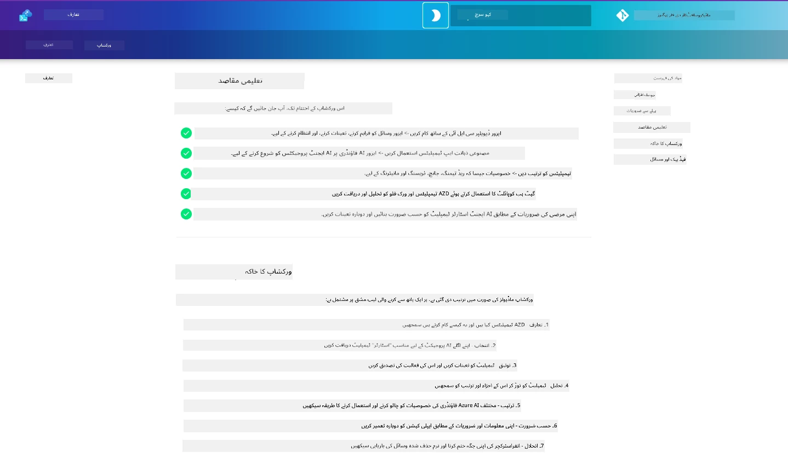

<div align="center">
  <div style="background: linear-gradient(135deg, #0078d4, #106ebe); border-radius: 10px; padding: 20px; margin: 20px 0; box-shadow: 0 4px 15px rgba(0, 120, 212, 0.3); border: 2px solid #005a9e;">
    <h2 style="color: white; margin: 0; font-size: 24px; text-shadow: 1px 1px 2px rgba(0,0,0,0.3);">
      🎯 AI ڈویلپرز کے لیے AZD ورکشاپ
    </h2>
    <p style="color: white; margin: 10px 0 0 0; font-size: 16px; text-shadow: 1px 1px 2px rgba(0,0,0,0.3);">
      <strong>Azure Developer CLI کے ذریعے AI ایپلیکیشنز بنانے کے لیے ایک عملی ورکشاپ۔</strong><br>
      AZD ٹیمپلیٹس اور AI ڈپلائمنٹ ورک فلو کو ماہر بنانے کے لیے 7 ماڈیول مکمل کریں۔
    </p>
    <div style="margin-top: 15px;">
      <span style="background: rgba(255,255,255,0.2); padding: 5px 10px; border-radius: 15px; color: white; font-size: 14px;">
        📅 آخری تازہ کاری: مارچ 2026
      </span>
    </div>
  </div>
</div>

# AI ڈویلپرز کے لیے AZD ورکشاپ

Azure Developer CLI (AZD) کو سیکھنے کے لیے عملی ورکشاپ میں خوش آمدید، جس کا مرکز AI ایپلیکیشن کی تعیناتی ہے۔ یہ ورکشاپ آپ کو AZD ٹیمپلیٹس کی عملی سمجھ 3 مراحل میں فراہم کرتی ہے:

1. **دریافت** - اپنے لیے درست ٹیمپلیٹ تلاش کریں۔
1. **تعیناتی** - تعینات کریں اور یہ تصدیق کریں کہ یہ کام کرتا ہے۔
1. **حسب ضرورت بنانا** - تبدیلی کریں اور اسے اپنا بنائیں!

اس ورکشاپ کے دوران، آپ کو بنیادی ڈویلپر ٹولز اور ورک فلو سے بھی متعارف کرایا جائے گا تاکہ آپ کی مکمل ترقیاتی سفر کو آسان بنایا جا سکے۔

<br/>

## براؤزر پر مبنی گائیڈ

ورکشاپ کے اسباق مارک ڈاؤن میں ہیں۔ آپ انہیں براہ راست GitHub پر نیویگیٹ کر سکتے ہیں - یا نیچے دیے گئے اسکرین شاٹ کی طرح براؤزر پر پیش نظارہ شروع کر سکتے ہیں۔



اس آپشن کو استعمال کرنے کے لیے - رپوزیٹری کو اپنے پروفائل پر فورک کریں، اور GitHub Codespaces شروع کریں۔ جیسے ہی VS Code ٹرمینل فعال ہوتا ہے، یہ کمانڈ ٹائپ کریں:

یہ براؤزر پر پیش نظارہ GitHub Codespaces، dev containers، یا Python اور MkDocs کے ساتھ مقامی کلون میں کام کرتا ہے۔

```bash title="" linenums="0"
mkdocs serve > /dev/null 2>&1 &
```
  
کچھ سیکنڈز میں، آپ کو ایک پاپ اپ ڈائیلاگ نظر آئے گا۔ `Open in browser` کا آپشن منتخب کریں۔ ویب پر مبنی گائیڈ اب ایک نئے براؤزر ٹیب میں کھل جائے گی۔ اس پیش نظارہ کے کچھ فوائد:

1. **بلٹ ان سرچ** - کی ورڈز یا اسباق تیزی سے تلاش کریں۔
1. **نقل کرنے کا آئیکن** - کوڈ بلاکس پر ہوور کریں تاکہ یہ آپشن دکھائی دے۔
1. **تھیم ٹوگل** - ڈارک اور لائٹ تھیم کے درمیان سوئچ کریں۔
1. **مدد حاصل کریں** - فوٹر میں Discord آئیکن پر کلک کر کے شامل ہوں!

<br/>

## ورکشاپ کا جائزہ

**دورانیہ:** 3-4 گھنٹے  
**سطح:** مبتدی سے درمیانی  
**ضروریات:** Azure، AI تصورات، VS Code اور کمانڈ لائن ٹولز سے واقفیت۔

یہ ایک عملی ورکشاپ ہے جہاں آپ کرنا سیکھیں گے۔ مشقیں مکمل کرنے کے بعد، ہم تجویز کرتے ہیں کہ آپ AZD For Beginners نصاب کا جائزہ لیں تاکہ سیکورٹی اور پیداواریت کی بہترین مشقوں میں اپنی تعلیم جاری رکھ سکیں۔

| وقت | ماڈیول  | ہدف |
|:---|:---|:---|
| 15 منٹ | [تعارف](docs/instructions/0-Introduction.md) | بنیاد قائم کریں، اہداف سمجھیں |
| 30 منٹ | [AI ٹیمپلیٹ منتخب کریں](docs/instructions/1-Select-AI-Template.md) | اختیارات کو دریافت کریں اور ابتدائی منتخب کریں |
| 30 منٹ | [AI ٹیمپلیٹ کی تصدیق کریں](docs/instructions/2-Validate-AI-Template.md) | ڈیفالٹ حل کو Azure پر تعینات کریں |
| 30 منٹ | [AI ٹیمپلیٹ کو تحلیل کریں](docs/instructions/3-Deconstruct-AI-Template.md) | ساخت اور ترتیب کو دریافت کریں |
| 30 منٹ | [AI ٹیمپلیٹ کو ترتیب دیں](docs/instructions/4-Configure-AI-Template.md) | دستیاب خصوصیات کو فعال کریں اور آزمائیں |
| 30 منٹ | [AI ٹیمپلیٹ کو حسب ضرورت بنائیں](docs/instructions/5-Customize-AI-Template.md) | ٹیمپلیٹ کو اپنی ضروریات کے مطابق ڈھالیں |
| 30 منٹ | [انفراسٹرکچر ختم کریں](docs/instructions/6-Teardown-Infrastructure.md) | وسائل کی صفائی کریں اور جاری کریں |
| 15 منٹ | [خلاصہ اور اگلے اقدامات](docs/instructions/7-Wrap-up.md) | تعلیمی وسائل، ورکشاپ چیلنج |

<br/>

## آپ کیا سیکھیں گے

AZD ٹیمپلیٹ کو ایک لرننگ سینڈباکس کے طور پر لیں جہاں آپ مائیکروسافٹ فاؤنڈری پر مکمل ترقی کے لیے مختلف صلاحیتوں اور ٹولز کو دریافت کر سکیں۔ اس ورکشاپ کے اختتام تک، آپ کو اس سیاق و سباق میں مختلف ٹولز اور تصورات کا ایک فطری ادراک حاصل ہو جائے گا۔

| تصور  | ہدف |
|:---|:---|
| **Azure Developer CLI** | ٹول کے کمانڈز اور ورک فلو کو سمجھیں |
| **AZD ٹیمپلیٹس** | پروجیکٹ کی ساخت اور ترتیب کو سمجھیں |
| **Azure AI Agent** | مائیکروسافٹ فاؤنڈری پروجیکٹ کی پروویژن اور تعیناتی کریں |
| **Azure AI Search** | ایجنٹس کے ساتھ مواد کی انجینئرنگ فعال کریں |
| **Observability** | ٹریسنگ، نگرانی اور تشخیصات کو دریافت کریں |
| **Red Teaming** | دشمنانہ ٹیسٹنگ اور تخفیف کے طریقے دریافت کریں |

<br/>

## ورکشاپ کی ساخت

ورکشاپ آپ کو ٹیمپلیٹ کی دریافت سے لے کر تعیناتی، تحلیل، اور تخصیص تک سفر پر لے جانے کے لیے ترتیب دی گئی ہے - جس کی بنیاد [Getting Started with AI Agents](https://github.com/Azure-Samples/get-started-with-ai-agents) کا سرکاری ابتدائی ٹیمپلیٹ ہے۔

### [ماڈیول 1: AI ٹیمپلیٹ منتخب کریں](docs/instructions/1-Select-AI-Template.md) (30 منٹ)

- AI ٹیمپلیٹس کیا ہوتے ہیں؟
- AI ٹیمپلیٹس کہاں ملتے ہیں؟
- میں AI ایجنٹس کی تعمیر کیسے شروع کر سکتا ہوں؟
- **لیب**: Codespaces یا dev container میں فوری آغاز

### [ماڈیول 2: AI ٹیمپلیٹ کی تصدیق کریں](docs/instructions/2-Validate-AI-Template.md) (30 منٹ)

- AI ٹیمپلیٹ کی ساخت کیا ہے؟
- AZD ڈویلپمنٹ ورک فلو کیا ہے؟
- AZD ڈویلپمنٹ میں مدد کیسے حاصل کریں؟
- **لیب**: AI ایجنٹس ٹیمپلیٹ تعینات اور تصدیق کریں

### [ماڈیول 3: AI ٹیمپلیٹ کو تحلیل کریں](docs/instructions/3-Deconstruct-AI-Template.md) (30 منٹ)

- اپنے ماحول کو `.azure/` میں دریافت کریں
- اپنے وسائل کی ترتیب کو `infra/` میں دریافت کریں
- اپنے AZD کی ترتیب `azure.yaml`s میں دریافت کریں
- **لیب**: ماحولیات کے متغیرات میں ترمیم کریں اور دوبارہ تعینات کریں

### [ماڈیول 4: AI ٹیمپلیٹ کو ترتیب دیں](docs/instructions/4-Configure-AI-Template.md) (30 منٹ)
- دریافت کریں: Retrieval Augmented Generation
- دریافت کریں: Agent Evaluation & Red Teaming
- دریافت کریں: ٹریسنگ اور نگرانی
- **لیب**: AI ایجنٹ + مشاہدہ دریافت کریں

### [ماڈیول 5: AI ٹیمپلیٹ کو حسب ضرورت بنائیں](docs/instructions/5-Customize-AI-Template.md) (30 منٹ)
- تعین کریں: PRD کے ساتھ منظرنامہ کی ضروریات
- ترتیب دیں: AZD کے لیے ماحولیات کے متغیرات
- نافذ کریں: اضافی کاموں کے لیے لائف سائیکل ہکس
- **لیب**: اپنے منظرنامہ کے لیے ٹیمپلیٹ کو حسب ضرورت بنائیں

### [ماڈیول 6: انفراسٹرکچر کو ختم کریں](docs/instructions/6-Teardown-Infrastructure.md) (30 منٹ)
- جائزہ: AZD ٹیمپلیٹس کیا ہیں؟
- جائزہ: Azure Developer CLI کیوں استعمال کریں؟
- اگلے اقدامات: کوئی مختلف ٹیمپلیٹ آزمائیں!
- **لیب**: انفراسٹرکچر کو ختم کریں اور صفائی کریں

<br/>

## ورکشاپ چیلنج

مزید کرنے کا چیلنج قبول کرنا چاہتے ہیں؟ یہاں کچھ پروجیکٹ تجاویز ہیں - یا اپنے آئیڈیاز ہمارے ساتھ شیئر کریں!!

| پروجیکٹ | وضاحت |
|:---|:---|
|1. **ایک پیچیدہ AI ٹیمپلیٹ کو تحلیل کریں** | ہم نے جو ورک فلو اور ٹولز بیان کیے ہیں ان کا استعمال کریں اور دیکھیں کہ کیا آپ کسی دوسرے AI حل کے ٹیمپلیٹ کو تعینات، تصدیق، اور حسب ضرورت بنا سکتے ہیں۔ _آپ نے کیا سیکھا؟_|
|2. **اپنے منظرنامہ کے ساتھ حسب ضرورت بنائیں**  | ایک مختلف منظرنامے کے لیے PRD (پروڈکٹ ریکوائرمنٹس ڈاکیومنٹ) لکھنے کی کوشش کریں۔ پھر GitHub Copilot کو اپنے ٹیمپلیٹ ریپو میں Agent Model میں استعمال کریں - اور اسے اپنے لیے تخصیص ورک فلو بنانے کو کہیں۔ _آپ نے کیا سیکھا؟ آپ ان تجاویز کو کیسے بہتر بنا سکتے ہیں؟_|
| | |

## فیڈبیک دیں؟

1. اس ریپو پر ایک مسئلہ پوسٹ کریں - سہولت کے لیے اسے `Workshop` ٹیگ کریں۔
1. Microsoft Foundry Discord میں شامل ہوں - اپنے ساتھیوں سے جڑیں!

| | | 
|:---|:---|
| **📚 کورس ہوم**| [AZD For Beginners](../README.md)|
| **📖 دستاویزات** | [AI ٹیمپلیٹس کے ساتھ شروع کریں](https://learn.microsoft.com/en-us/azure/ai-foundry/how-to/develop/ai-template-get-started)|
| **🛠️ AI ٹیمپلیٹس** | [Microsoft Foundry Templates](https://ai.azure.com/templates) |
|**🚀 اگلے اقدامات** | [ورکشاپ شروع کریں](#ورکشاپ-کا-جائزہ) |
| | |

<br/>

---

**نیویگیشن:** [مین کورس](../README.md) | [تعارف](docs/instructions/0-Introduction.md) | [ماڈیول 1: ٹیمپلیٹ منتخب کریں](docs/instructions/1-Select-AI-Template.md)

**کیا آپ AZD کے ساتھ AI ایپلیکیشنز بنانے کے لیے تیار ہیں؟**

[ورکشاپ شروع کریں: تعارف →](docs/instructions/0-Introduction.md)

---

<!-- CO-OP TRANSLATOR DISCLAIMER START -->
**ڈس کلیمر**:  
یہ دستاویز AI ترجمہ سروس [Co-op Translator](https://github.com/Azure/co-op-translator) کے ذریعے ترجمہ کی گئی ہے۔ اگرچہ ہم درستگی کی بھرپور کوشش کرتے ہیں، براہ کرم خیال رکھیں کہ خودکار ترجمے میں غلطیاں یا بےقاعدگیاں ہو سکتی ہیں۔ اصل دستاویز اپنی مادری زبان میں قابلِ اعتبار ذریعہ سمجھا جانا چاہیے۔ اہم معلومات کے لیے پیشہ ور انسانی ترجمہ کی سفارش کی جاتی ہے۔ ہم اس ترجمے کے استعمال سے ہونے والی کسی بھی غلط فہمی یا غلط تعبیر کے ذمہ دار نہیں ہیں۔
<!-- CO-OP TRANSLATOR DISCLAIMER END -->