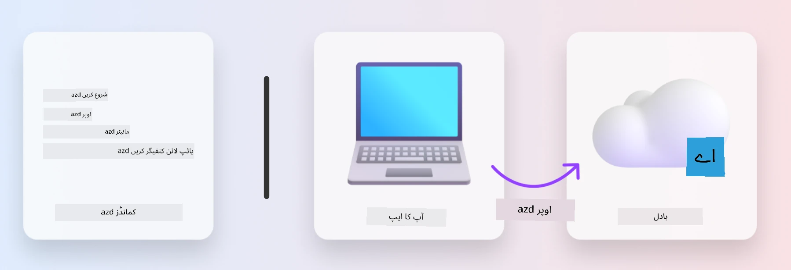
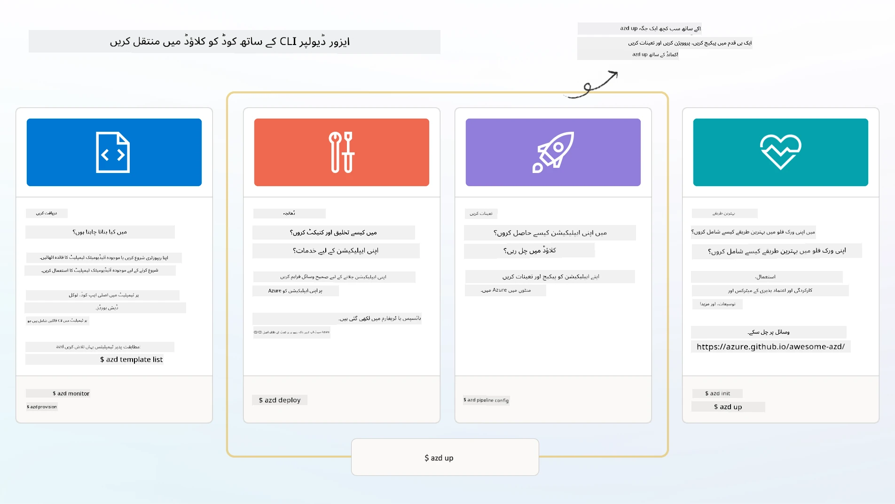

<!--
CO_OP_TRANSLATOR_METADATA:
{
  "original_hash": "06d6207eff634aefcaa41739490a5324",
  "translation_date": "2025-09-24T12:05:27+00:00",
  "source_file": "workshop/docs/instructions/1-Select-AI-Template.md",
  "language_code": "ur"
}
-->
# 1. ایک ٹیمپلیٹ منتخب کریں

!!! tip "اس ماڈیول کے اختتام تک آپ یہ کرنے کے قابل ہوں گے"

    - [ ] AZD ٹیمپلیٹس کیا ہیں، بیان کریں
    - [ ] AI کے لیے AZD ٹیمپلیٹس دریافت کریں اور استعمال کریں
    - [ ] AI Agents ٹیمپلیٹ کے ساتھ شروعات کریں
    - [ ] **لیب 1:** GitHub Codespaces کے ساتھ AZD کوئیک اسٹارٹ

---

## 1. ایک بلڈر کی مثال

ایک جدید انٹرپرائز-ریڈی AI ایپلیکیشن کو _شروع سے_ بنانا کافی مشکل ہو سکتا ہے۔ یہ بالکل ایسے ہی ہے جیسے آپ اپنا نیا گھر خود، اینٹ بہ اینٹ بنا رہے ہوں۔ ہاں، یہ ممکن ہے! لیکن یہ مطلوبہ نتیجہ حاصل کرنے کا سب سے مؤثر طریقہ نہیں ہے!

اس کے بجائے، ہم اکثر ایک موجودہ _ڈیزائن بلیوپرنٹ_ سے شروع کرتے ہیں اور ایک آرکیٹیکٹ کے ساتھ کام کرتے ہیں تاکہ اسے اپنی ذاتی ضروریات کے مطابق بنایا جا سکے۔ اور یہی طریقہ ذہین ایپلیکیشنز بنانے کے وقت اپنانا چاہیے۔ پہلے، ایک اچھا ڈیزائن آرکیٹیکچر تلاش کریں جو آپ کے مسئلے کے دائرے میں فٹ ہو۔ پھر ایک سلوشن آرکیٹیکٹ کے ساتھ کام کریں تاکہ اسے آپ کے مخصوص منظرنامے کے لیے حسب ضرورت بنایا جا سکے۔

لیکن یہ ڈیزائن بلیوپرنٹس کہاں سے مل سکتے ہیں؟ اور ہم ایسے آرکیٹیکٹ کو کیسے تلاش کریں جو ہمیں سکھائے کہ ان بلیوپرنٹس کو اپنی مرضی کے مطابق کیسے بنایا جائے اور خود کیسے نافذ کیا جائے؟ اس ورکشاپ میں، ہم ان سوالات کے جوابات تین ٹیکنالوجیز کے ذریعے دیتے ہیں:

1. [Azure Developer CLI](https://aka.ms/azd) - ایک اوپن سورس ٹول جو لوکل ڈیولپمنٹ (build) سے کلاؤڈ ڈیپلائمنٹ (ship) تک ڈیولپر کے راستے کو تیز کرتا ہے۔
1. [Azure AI Foundry Templates](https://ai.azure.com/templates) - معیاری اوپن سورس ریپوزیٹریز جو AI سلوشن آرکیٹیکچر کو نافذ کرنے کے لیے نمونہ کوڈ، انفراسٹرکچر اور کنفیگریشن فائلز پر مشتمل ہیں۔
1. [GitHub Copilot Agent Mode](https://code.visualstudio.com/docs/copilot/chat/chat-agent-mode) - ایک کوڈنگ ایجنٹ جو Azure کے علم پر مبنی ہے، اور ہمیں کوڈ بیس کو نیویگیٹ کرنے اور تبدیلیاں کرنے میں رہنمائی فراہم کرتا ہے - قدرتی زبان کے ذریعے۔

ان ٹولز کے ساتھ، ہم اب _صحیح ٹیمپلیٹ دریافت_ کر سکتے ہیں، اسے _نافذ_ کر کے تصدیق کر سکتے ہیں کہ یہ کام کرتا ہے، اور اسے _اپنے مخصوص منظرناموں کے مطابق_ بنا سکتے ہیں۔ آئیے سیکھتے ہیں کہ یہ کیسے کام کرتے ہیں۔

---

## 2. Azure Developer CLI

[Azure Developer CLI](https://learn.microsoft.com/en-us/azure/developer/azure-developer-cli/) (یا `azd`) ایک اوپن سورس کمانڈ لائن ٹول ہے جو آپ کے کوڈ سے کلاؤڈ تک کے سفر کو تیز کر سکتا ہے، ایک سیٹ کے ساتھ ڈیولپر-فرینڈلی کمانڈز جو آپ کے IDE (development) اور CI/CD (devops) ماحول میں مستقل طور پر کام کرتے ہیں۔

`azd` کے ساتھ، آپ کا ڈیپلائمنٹ سفر اتنا آسان ہو سکتا ہے:

- `azd init` - ایک موجودہ AZD ٹیمپلیٹ سے ایک نیا AI پروجیکٹ شروع کرتا ہے۔
- `azd up` - انفراسٹرکچر فراہم کرتا ہے اور آپ کی ایپلیکیشن کو ایک قدم میں نافذ کرتا ہے۔
- `azd monitor` - آپ کی نافذ کردہ ایپلیکیشن کے لیے حقیقی وقت کی نگرانی اور تشخیص حاصل کریں۔
- `azd pipeline config` - Azure پر ڈیپلائمنٹ کو خودکار کرنے کے لیے CI/CD پائپ لائنز ترتیب دیں۔

**🎯 | مشق**: <br/> 
اپنے GitHub Codespaces ماحول میں `azd` کمانڈ لائن ٹول کو دریافت کریں۔ اس کمانڈ سے شروع کریں تاکہ دیکھ سکیں کہ یہ ٹول کیا کر سکتا ہے:

```bash title="" linenums="0"
azd help
```



---

## 3. AZD ٹیمپلیٹ

`azd` کے لیے یہ جاننا ضروری ہے کہ کون سا انفراسٹرکچر فراہم کرنا ہے، کون سی کنفیگریشن سیٹنگز نافذ کرنی ہیں، اور کون سی ایپلیکیشن نافذ کرنی ہے۔ یہیں [AZD ٹیمپلیٹس](https://learn.microsoft.com/en-us/azure/developer/azure-developer-cli/azd-templates?tabs=csharp) کام آتے ہیں۔

AZD ٹیمپلیٹس اوپن سورس ریپوزیٹریز ہیں جو نمونہ کوڈ کو انفراسٹرکچر اور کنفیگریشن فائلز کے ساتھ جوڑتے ہیں جو سلوشن آرکیٹیکچر کو نافذ کرنے کے لیے ضروری ہیں۔
_Infrastructure-as-Code_ (IaC) کے طریقہ کار کو استعمال کرتے ہوئے، یہ ٹیمپلیٹ ریسورس ڈیفینیشنز اور کنفیگریشن سیٹنگز کو ورژن کنٹرول کرنے کی اجازت دیتے ہیں (بالکل ایپ سورس کوڈ کی طرح) - جو اس پروجیکٹ کے صارفین کے درمیان دوبارہ استعمال اور مستقل ورک فلو بناتے ہیں۔

جب _اپنے_ منظرنامے کے لیے AZD ٹیمپلیٹ بناتے یا استعمال کرتے ہیں، تو ان سوالات پر غور کریں:

1. آپ کیا بنا رہے ہیں؟ → کیا کوئی ٹیمپلیٹ ہے جس میں اس منظرنامے کے لیے اسٹارٹر کوڈ موجود ہے؟
1. آپ کا سلوشن کیسے آرکیٹیکٹ کیا گیا ہے؟ → کیا کوئی ٹیمپلیٹ ہے جس میں ضروری وسائل موجود ہیں؟
1. آپ کا سلوشن کیسے نافذ کیا گیا ہے؟ → `azd deploy` کے ساتھ پری/پوسٹ پروسیسنگ ہکس کے بارے میں سوچیں!
1. آپ اسے مزید کیسے بہتر بنا سکتے ہیں؟ → بلٹ ان مانیٹرنگ اور آٹومیشن پائپ لائنز کے بارے میں سوچیں!

**🎯 | مشق**: <br/> 
[Awesome AZD](https://azure.github.io/awesome-azd/) گیلری پر جائیں اور فلٹرز کا استعمال کرتے ہوئے 250+ ٹیمپلیٹس کو دریافت کریں جو فی الحال دستیاب ہیں۔ دیکھیں کہ آیا آپ کو کوئی ایسا ٹیمپلیٹ ملتا ہے جو _آپ_ کے منظرنامے کی ضروریات کے مطابق ہو۔



---

## 4. AI ایپ ٹیمپلیٹس

---

