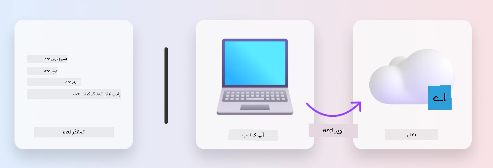
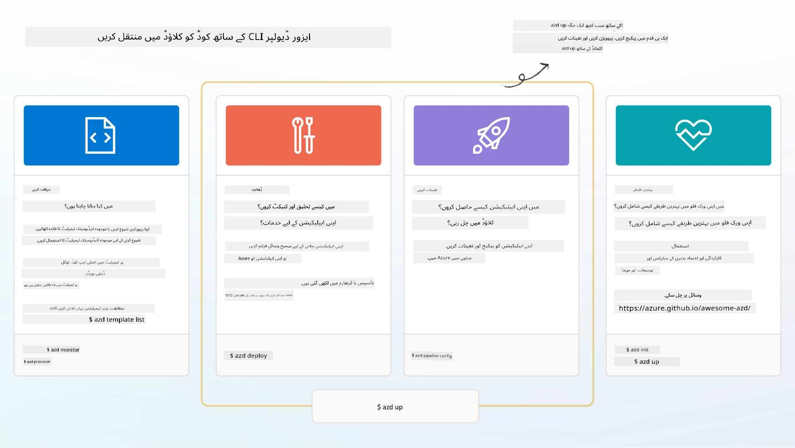

# 1. ایک ٹیمپلیٹ منتخب کریں

!!! tip "اس ماڈیول کے آخر تک آپ یہ کر سکیں گے"

    - [ ] AZD ٹیمپلیٹس کیا ہوتے ہیں بیان کریں
    - [ ] AI کے لیے AZD ٹیمپلیٹس دریافت کریں اور استعمال کریں
    - [ ] AI ایجنٹس ٹیمپلیٹ کے ساتھ شروعات کریں
    - [ ] **لیب 1:** Codespaces یا dev container میں AZD کوئک اسٹارٹ

---

## 1. ایک بلڈر کی مثال

جدید ادارہ جاتی AI ایپلیکیشن کو _ゼرو سے_ بنانا مشکل ہو سکتا ہے۔ یہ کچھ ایسا ہی ہے جیسے آپ اپنا نیا گھر خود اینٹ بہ اینٹ بنائیں۔ ہاں، یہ ممکن ہے! مگر یہ مطلوبہ نتیجہ حاصل کرنے کا سب سے مؤثر طریقہ نہیں ہے!

اس کے بجائے، ہم اکثر موجودہ _ڈیزائن بلیو پرنٹ_ سے شروع کرتے ہیں، اور ایک معمار کے ساتھ کام کرتے ہیں تاکہ اسے اپنی ذاتی ضروریات کے مطابق بنائیں۔ یہی طریقہ ذہین ایپلیکیشنز بنانے میں اختیار کرنا چاہیے۔ سب سے پہلے، ایسی اچھی ڈیزائن آرکیٹیکچر تلاش کریں جو آپ کے مسئلے کے لیے موزوں ہو۔ پھر حل بنانے والے معمار کے ساتھ مل کر اسے اپنی مخصوص صورتحال کے لیے حسبِ ضرورت تیار کریں۔

لیکن یہ ڈیزائن بلیو پرنٹ کہاں ملیں گے؟ اور ایسا معمار کہاں ملے گا جو ہمیں یہ سکھائے کہ ان بلیو پرنٹس کو خود کس طرح حسب ضرورت بنانا اور تعینات کرنا ہے؟ اس ورکشاپ میں، ہم ان سوالات کے جوابات تین ٹیکنالوجیز سے تعارف کروا کر دیتے ہیں:

1. [Azure Developer CLI](https://aka.ms/azd) - ایک اوپن سورس ٹول جو لوکل ڈیولپمنٹ سے کلاؤڈ تعیناتی تک کے سفر کو تیز کرتا ہے۔
1. [Microsoft Foundry Templates](https://ai.azure.com/templates) - معیاری اوپن سورس ذخائر جن میں کوڈ، انفراسٹرکچر اور کنفیگریشن فائلیں شامل ہیں جو AI حل کی تعیناتی کے لیے درکار ہیں۔
1. [GitHub Copilot Agent Mode](https://code.visualstudio.com/docs/copilot/chat/chat-agent-mode) - Azure علم پر مبنی کوڈنگ ایجنٹ جو ہمیں کوڈبیس میں رہنمائی اور تبدیلیاں کرنے میں مدد دیتا ہے - قدرتی زبان استعمال کرتے ہوئے۔

ان ٹولز کی مدد سے ہم اب مناسب ٹیمپلیٹ _دریافت_ کر سکتے ہیں، اسے تعینات کر کے اس کی جانچ کر سکتے ہیں، اور اپنی مخصوص صورتحال کے مطابق _حسب ضرورت_ بنا سکتے ہیں۔ آئیے آگے بڑھیں اور یہ جانیں کہ یہ کیسے کام کرتے ہیں۔

---

## 2. Azure Developer CLI

[Azure Developer CLI](https://learn.microsoft.com/en-us/azure/developer/azure-developer-cli/) (یا `azd`) ایک اوپن سورس کمانڈ لائن ٹول ہے جو آپ کے کوڈ سے کلاؤڈ تک کے سفر کو تیز کرنے کے لیے دوستانہ کمانڈز فراہم کرتا ہے جو آپ کے IDE (ڈیولپمنٹ) اور CI/CD (ڈیواپس) ماحول میں یکساں کام کرتے ہیں۔

`azd` کے ساتھ، آپ کی تعیناتی کا سفر اتنا سادہ ہو سکتا ہے:

- `azd init` - موجودہ AZD ٹیمپلیٹ سے نیا AI پروجیکٹ شروع کرتا ہے۔
- `azd up` - ایک قدم میں انفراسٹرکچر تیار کرتا ہے اور آپ کی ایپلیکیشن تعینات کرتا ہے۔
- `azd monitor` - آپ کی تعینات ایپلیکیشن کے لیے حقیقی وقت کی نگرانی اور تشخیص فراہم کرتا ہے۔
- `azd pipeline config` - Azure پر تعیناتی کو خودکار بنانے کے لیے CI/CD پائپ لائنز مرتب کرتا ہے۔

**🎯 | مشق**: <br/> اب اس ورکشاپ ماحول میں `azd` کمانڈ لائن ٹول کو دریافت کریں۔ یہ GitHub Codespaces، dev container، یا لوکل کلون ہو سکتا ہے جس میں پری ریکوئزٹس موجود ہوں۔ شروع کرنے کے لیے نیچے دی گئی کمانڈ ٹائپ کریں تاکہ آپ دیکھ سکیں کہ یہ ٹول کیا کر سکتا ہے:

```bash title="" linenums="0"
azd help
```



---

## 3. AZD ٹیمپلیٹ

`azd` کو یہ سب کام کرنے کے لیے یہ جاننا ضروری ہے کہ کون سا انفراسٹرکچر مہیا کرنا ہے، کنفیگریشن کیسی ہو، اور ایپلیکیشن کیا ہے جسے تعینات کرنا ہے۔ یہ کام [AZD ٹیمپلیٹس](https://learn.microsoft.com/en-us/azure/developer/azure-developer-cli/azd-templates?tabs=csharp) کرتے ہیں۔

AZD ٹیمپلیٹس اوپن سورس ذخائر ہیں جو نمونہ کوڈ، انفراسٹرکچر اور کنفیگریشن فائلز کو یکجا کرتے ہیں جو حل کی تعیناتی کے لیے درکار ہوتی ہیں۔
ایک _Infrastructure-as-Code_ (IaC) نقطہ نظر اپناتے ہوئے، یہ ٹیمپلیٹ کے وسائل کی تعریف اور کنفیگریشن سیٹنگز کو ورژن کنٹرول کے تحت رکھتے ہیں (بلکل ایپ سورس کوڈ کی طرح) - جس سے منصوبے کے صارفین کے لیے قابلِ دوبارہ استعمال اور یکساں ورک فلو بنتے ہیں۔

جب آپ اپنی مخصوص صورتحال کے لیے AZD ٹیمپلیٹ بنا رہے ہوں یا استعمال کر رہے ہوں تو یہ سوالات ذہن میں رکھیں:

1. آپ کیا بنا رہے ہیں؟ → کیا کوئی ٹیمپلیٹ ہے جس میں اس صورتحال کے لیے شروع کرنے کا کوڈ موجود ہو؟
1. آپ کا حل کیسے آرکیٹیکچر کیا گیا ہے؟ → کیا کوئی ٹیمپلیٹ ہے جس میں ضروری وسائل ہوں؟
1. آپ کا حل کیسے تعینات ہوتا ہے؟ → `azd deploy` کے پری/پوسٹ پروسیسنگ ہوکس کے بارے میں سوچیں!
1. آپ اسے مزید کیسے بہتر بنا سکتے ہیں؟ → بلٹ ان مانیٹرنگ اور خودکار پائپ لائنز کے بارے میں سوچیں!

**🎯 | مشق**: <br/> 
[Awesome AZD](https://azure.github.io/awesome-azd/) گیلری پر جائیں اور دستیاب 250+ ٹیمپلیٹس کو فلٹرز کے ذریعے دریافت کریں۔ دیکھیں کہ آپ کی مخصوص صورتحال کی ضروریات سے کون سا ٹیمپلیٹ میل کھاتا ہے۔



---

## 4. AI ایپ ٹیمپلیٹس

AI سے چلنے والی ایپلیکیشنز کے لیے، مائیکروسافٹ خصوصی ٹیمپلیٹس فراہم کرتا ہے جن میں **Microsoft Foundry** اور **Foundry Agents** شامل ہیں۔ یہ ٹیمپلیٹس آپ کے ذہین، تیارِ پیداواری ایپلیکیشنز بنانے کے راستے کو تیز کرتے ہیں۔

### Microsoft Foundry & Foundry Agents ٹیمپلیٹس

نیچے سے کوئی ٹیمپلیٹ منتخب کریں تاکہ تعینات کیا جا سکے۔ ہر ٹیمپلیٹ [Awesome AZD](https://azure.github.io/awesome-azd/) پر دستیاب ہے اور ایک کمانڈ سے انیشیلائز کیا جا سکتا ہے۔

| ٹیمپلیٹ | تفصیل | تعیناتی کمانڈ |
|----------|-------------|----------------|
| **[AI Chat with RAG](https://azure.github.io/awesome-azd/?tags=ai&tags=rag)** | Microsoft Foundry کا استعمال کرتے ہوئے چیٹ ایپلیکیشن جو Retrieval Augmented Generation کرتی ہے | `azd init -t azure-samples/azure-search-openai-demo` |
| **[Foundry Agent Service Starter](https://azure.github.io/awesome-azd/?tags=ai&tags=agents)** | Foundry Agents کے ساتھ AI ایجنٹس بنائیں تاکہ خود مختار کام سرانجام دے سکیں | `azd init -t azure-samples/foundry-agent-service-starter` |
| **[Multi-Agent Orchestration](https://azure.github.io/awesome-azd/?tags=ai&tags=agents)** | پیچیدہ ورک فلو کے لیے متعدد Foundry Agents کو مربوط کریں | `azd init -t azure-samples/multi-agent-orchestration` |
| **[AI Document Intelligence](https://azure.github.io/awesome-azd/?tags=ai&tags=document)** | Microsoft Foundry ماڈلز کے ساتھ دستاویزات نکالیں اور تجزیہ کریں | `azd init -t azure-samples/ai-document-processing` |
| **[Conversational AI Bot](https://azure.github.io/awesome-azd/?tags=ai&tags=bot)** | Microsoft Foundry انٹیگریشن کے ساتھ ذہین چیٹ بوٹس بنائیں | `azd init -t azure-samples/ai-chat-protocol` |
| **[AI Image Generation](https://azure.github.io/awesome-azd/?tags=ai&tags=dalle)** | Microsoft Foundry کے ذریعے DALL-E کی مدد سے تصویریں بنائیں | `azd init -t azure-samples/ai-image-generation` |
| **[Semantic Kernel Agent](https://azure.github.io/awesome-azd/?tags=ai&tags=semantic-kernel)** | Semantic Kernel کا استعمال کرتے ہوئے Foundry Agents کے ساتھ AI ایجنٹس | `azd init -t azure-samples/semantic-kernel-agent` |
| **[AutoGen Multi-Agent](https://azure.github.io/awesome-azd/?tags=ai&tags=autogen)** | AutoGen فریم ورک کے ذریعے ملٹی ایجنٹ سسٹمز | `azd init -t azure-samples/autogen-multi-agent` |

### کوئک اسٹارٹ

1. **ٹیمپلیٹس براؤز کریں**: [https://azure.github.io/awesome-azd/](https://azure.github.io/awesome-azd/) پر جائیں اور `AI`, `Agents`, یا `Microsoft Foundry` کے ذریعے فلٹر کریں
2. **اپنا ٹیمپلیٹ منتخب کریں**: ایسا انتخاب کریں جو آپ کے استعمال کے معاملے سے میل کھاتا ہو
3. **انیشیلائز کریں**: منتخب کردہ ٹیمپلیٹ کے لیے `azd init` کمانڈ چلائیں
4. **تعینات کریں**: انفراسٹرکچر تیار کرنے اور تعیناتی کے لیے `azd up` چلائیں

**🎯 | مشق**: <br/>
اپنی صورتحال کی بنیاد پر مندرجہ بالا ٹیمپلیٹس میں سے کوئی ایک منتخب کریں:

- **چیٹ بوٹ بنا رہے ہیں؟** → **AI Chat with RAG** یا **Conversational AI Bot** سے شروع کریں
- **خود مختار ایجنٹس چاہیے؟** → **Foundry Agent Service Starter** یا **Multi-Agent Orchestration** آزمائیں
- **دستاویزات کی پراسیسنگ؟** → **AI Document Intelligence** استعمال کریں
- **AI کوڈنگ مدد چاہیے؟** → **Semantic Kernel Agent** یا **AutoGen Multi-Agent** دریافت کریں

```bash title="Example: Deploy the AI Chat with RAG template" linenums="0"
azd init -t azure-samples/azure-search-openai-demo
azd up
```

!!! info "مزید ٹیمپلیٹس دریافت کریں"
    [Awesome AZD Gallery](https://azure.github.io/awesome-azd/) میں 250+ ٹیمپلیٹس دستیاب ہیں۔ زبان، فریم ورک، اور Azure خدمات کے اپنے مخصوص تقاضوں کے مطابق ٹیمپلیٹس تلاش کرنے کے لیے فلٹرز کا استعمال کریں۔

---

<!-- CO-OP TRANSLATOR DISCLAIMER START -->
**انوکھت**:
اس دستاویز کا ترجمہ AI ترجمہ سروس [Co-op Translator](https://github.com/Azure/co-op-translator) استعمال کرتے ہوئے کیا گیا ہے۔ اگرچہ ہم درستگی کی کوشش کرتے ہیں، براہ کرم آگاہ رہیں کہ خودکار ترجموں میں غلطیاں یا غلط فہمیاں ہو سکتی ہیں۔ اصل دستاویز اپنی مادری زبان میں معتبر ماخذ سمجھی جانی چاہیے۔ اہم معلومات کے لیے پیشہ ور انسانی ترجمہ تجویز کیا جاتا ہے۔ ہم اس ترجمہ کے استعمال سے پیدا ہونے والی کسی بھی غلط فہمی یا غلط تشریح کے لیے ذمہ دار نہیں ہیں۔
<!-- CO-OP TRANSLATOR DISCLAIMER END -->