# 2. ٹیمپلیٹ کی توثیق کریں

!!! tip "اس ماڈیول کے اختتام تک آپ قابل ہوں گے"

    - [ ] AI حل کے فن تعمیر کا تجزیہ کریں
    - [ ] AZD تعیناتی کے ورک فلو کو سمجھیں
    - [ ] AZD کے استعمال میں مدد کے لیے GitHub Copilot کا استعمال کریں
    - [ ] **لیب 2:** AI ایجنٹس ٹیمپلیٹ کو تعینات اور توثیق کریں

---

## 1. تعارف

[Azure Developer CLI](https://learn.microsoft.com/en-us/azure/developer/azure-developer-cli/) یا `azd` ایک اوپن سورس کمانڈ لائن ٹول ہے جو Azure پر ایپلیکیشنز بنانے اور تعینات کرنے کے دوران ڈویلپر کے ورک فلو کو آسان بناتا ہے۔

[AZD ٹیمپلیٹس](https://learn.microsoft.com/azure/developer/azure-developer-cli/azd-templates) معیاری ریپوزیٹریز ہیں جن میں نمونہ ایپلیکیشن کوڈ، _انفراسٹرکچر بطور کوڈ_ اثاثے، اور `azd` کنفیگریشن فائلز شامل ہیں تاکہ ایک مربوط حل فن تعمیر فراہم کیا جا سکے۔ انفراسٹرکچر کی فراہمی ایک `azd provision` کمانڈ جتنا آسان ہو جاتا ہے — جبکہ `azd up` آپ کو انفراسٹرکچر فراہم کرنے اور اپنی ایپلیکیشن کو ایک مرتبہ میں تعینات کرنے کی اجازت دیتا ہے!

نتیجتاً، آپ کی ایپلیکیشن کی ترقی کا عمل شروع کرنا اتنا ہی آسان ہو سکتا ہے جتنا کہ صحیح _AZD اسٹارٹر ٹیمپلیٹ_ تلاش کرنا جو آپ کی ایپلیکیشن اور انفراسٹرکچر کی ضروریات کے قریب ہو — پھر ریپوزیٹری کو اپنے منظر نامے کی ضروریات کے مطابق حسب ضرورت بنانا۔

شروع کرنے سے پہلے، آئیے یہ یقینی بنائیں کہ آپ کے پاس Azure Developer CLI نصب ہے۔

1. VS Code ٹرمینل کھولیں اور یہ کمانڈ ٹائپ کریں:

      ```bash title="" linenums="0"
      azd version
      ```

1. آپ کو کچھ ایسا نظر آئے گا!

      ```bash title="" linenums="0"
      azd version 1.19.0 (commit b3d68cea969b2bfbaa7b7fa289424428edb93e97)
      ```

**اب آپ azd کے ساتھ ٹیمپلیٹ منتخب کرنے اور تعینات کرنے کے لیے تیار ہیں**

---

## 2. ٹیمپلیٹ کا انتخاب

Microsoft Foundry پلیٹ فارم کے ساتھ [متعدد تجویز کردہ AZD ٹیمپلیٹس کا ایک سیٹ](https://learn.microsoft.com/en-us/azure/ai-foundry/how-to/develop/ai-template-get-started) آتا ہے جو مقبول حل کے سیناریوز جیسے _ملٹی ایجنٹ ورک فلو آٹومیشن_ اور _ملٹی موڈل مواد پراسیسنگ_ کو کور کرتا ہے۔ آپ Microsoft Foundry پورٹل پر جا کر بھی ان ٹیمپلیٹس کو دریافت کر سکتے ہیں۔

1. [https://ai.azure.com/templates](https://ai.azure.com/templates) پر جائیں
1. جب پرامپٹ ہو تو Microsoft Foundry پورٹل میں لاگ ان کریں — آپ کو کچھ ایسا نظر آئے گا۔

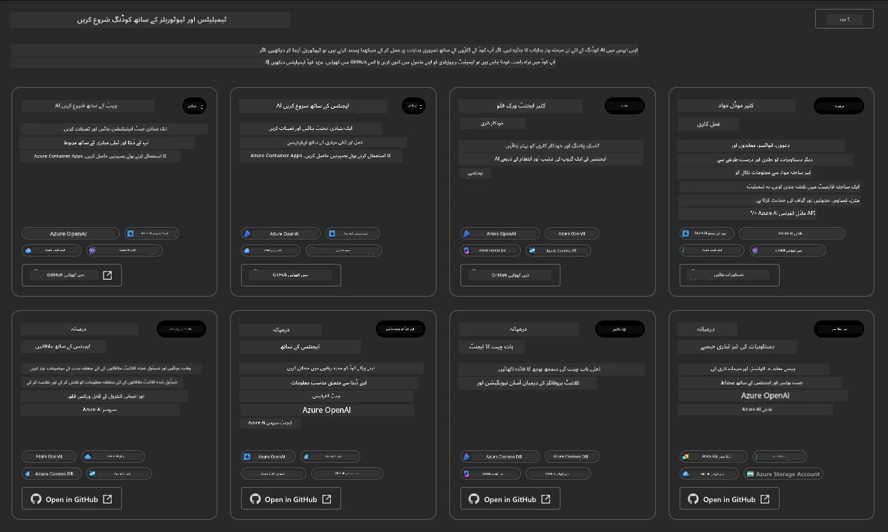


**بیسک** اختیارات آپ کے اسٹارٹر ٹیمپلیٹس ہیں:

1. [ ] [AI چیٹ کے ساتھ شروع کریں](https://github.com/Azure-Samples/get-started-with-ai-chat) جو Azure Container Apps پر ایک بنیادی چیٹ ایپلیکیشن کو آپ کے ڈیٹا کے ساتھ تعینات کرتا ہے۔ اس کا استعمال بنیادی AI چیٹ بوٹ سیناریو کو دریافت کرنے کے لیے کریں۔
1. [X] [AI ایجنٹس کے ساتھ شروع کریں](https://github.com/Azure-Samples/get-started-with-ai-agents) جو ایک معیاری AI ایجنٹ (Foundry Agents کے ساتھ) بھی تعینات کرتا ہے۔ اس کا استعمال ایجنٹک AI حل کے ساتھ واقفیت حاصل کرنے کے لیے کریں جو ٹولز اور ماڈلز شامل ہوتے ہیں۔

دوسرے لنک کو ایک نئے براؤزر ٹیب میں کھولیں (یا متعلقہ کارڈ پر `Open in GitHub` پر کلک کریں)۔ آپ کو اس AZD ٹیمپلیٹ کے ریپوزیٹری کا صفحہ نظر آنا چاہیے۔ README کا جائزہ لینے میں ایک منٹ لگائیں۔ ایپلیکیشن فن تعمیر اس طرح نظر آتا ہے:

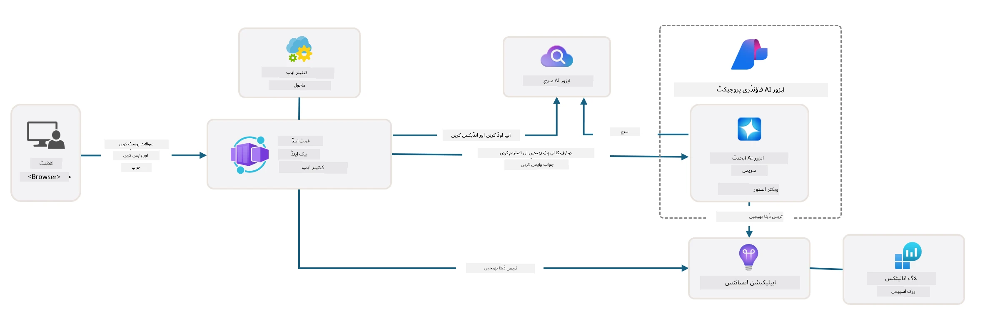

---

## 3. ٹیمپلیٹ کی فعالیت

آئیں اس ٹیمپلیٹ کو تعینات کرنے کی کوشش کرتے ہیں اور یہ یقینی بنائیں کہ یہ درست ہے۔ ہم [Getting Started](https://github.com/Azure-Samples/get-started-with-ai-agents?tab=readme-ov-file#getting-started) سیکشن کی ہدایات پر عمل کریں گے۔

1. [اس لنک](https://github.com/codespaces/new/Azure-Samples/get-started-with-ai-agents) پر کلک کریں — `Create codespace` کے ڈیفالٹ عمل کی تصدیق کریں
1. یہ ایک نیا براؤزر ٹیب کھولے گا — GitHub Codespaces سیشن کے مکمل لوڈ ہونے کا انتظار کریں
1. Codespaces میں VS Code ٹرمینل کھولیں — درج ذیل کمانڈ ٹائپ کریں:

   ```bash title="" linenums="0"
   azd up
   ```

اس سے چالو ہونے والے ورک فلو مراحل مکمل کریں:

1. آپ کو Azure میں لاگ ان کرنے کا پرامپٹ دیا جائے گا — ہدایات کی پیروی کرتے ہوئے تصدیق کریں
1. اپنے لیے ایک منفرد ماحول کا نام درج کریں — مثلاً، میں نے `nitya-mshack-azd` استعمال کیا
1. یہ ایک `.azure/` فولڈر بنائے گا — آپ کو اس میں ماحول کے نام کے ساتھ ایک ذیلی فولڈر نظر آئے گا
1. آپ کو سبسکرپشن کا نام منتخب کرنے کا پرامپٹ دیا جائے گا — ڈیفالٹ منتخب کریں
1. آپ کو ایک مقام منتخب کرنے کا پرامپٹ دیا جائے گا — `East US 2` استعمال کریں

اب، پروویژننگ مکمل ہونے کا انتظار کریں۔ **یہ 10-15 منٹ لگتا ہے**

1. جب مکمل ہو جائے، آپ کے کنسول میں SUCCESS پیغام اس طرح نظر آئے گا:
      ```bash title="" linenums="0"
      SUCCESS: Your up workflow to provision and deploy to Azure completed in 10 minutes 17 seconds.
      ```

1. آپ کے Azure پورٹل میں اب اس ماحول کے نام کے ساتھ ایک پروویژندہ ریسورس گروپ ہوگا:

      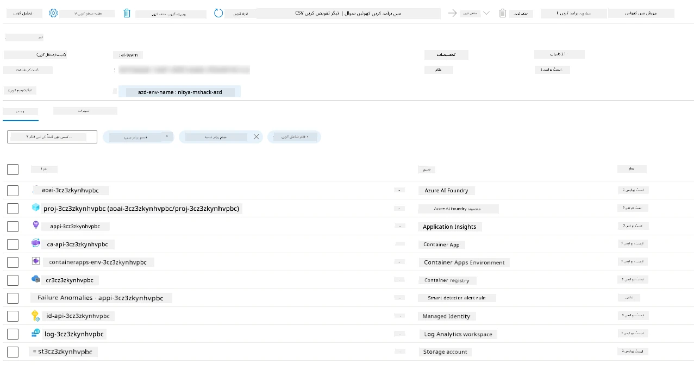

1. **اب آپ تعینات کردہ انفراسٹرکچر اور ایپلیکیشن کی توثیق کے لیے تیار ہیں**۔

---

## 4. ٹیمپلیٹ کی توثیق

1. Azure پورٹل کے [Resource Groups](https://portal.azure.com/#browse/resourcegroups) صفحہ پر جائیں — جب پرامپٹ ہو تو لاگ ان کریں
1. اپنے ماحول کے نام کے RG پر کلک کریں — اوپر دی گئی صفحہ نظر آئے گا

      - Azure Container Apps ریسورس پر کلک کریں
      - _Essentials_ سیکشن (اوپر دائیں) میں Application Url پر کلک کریں

1. آپ کو اس طرح کی میزبانی شدہ ایپلیکیشن فرنٹ اینڈ UI دکھنی چاہیے:

   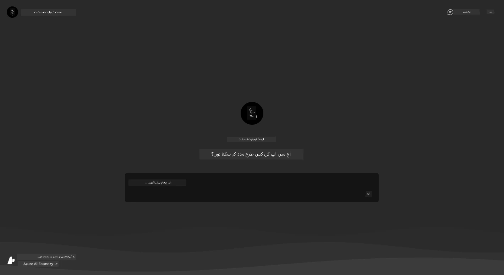

1. چند [نمونہ سوالات](https://github.com/Azure-Samples/get-started-with-ai-agents/blob/main/docs/sample_questions.md) پوچھیں

      1. پوچھیں: ```فرانس کا دارالحکومت کیا ہے؟``` 
      1. پوچھیں: ```دو افراد کے لیے $200 سے کم قیمت والا بہترین ٹینٹ کون سا ہے، اور اس میں کیا خصوصیات شامل ہیں؟```

1. آپ کو نیچے دکھائے گئے مشابہ جوابات ملنے چاہیے۔ _لیکن یہ کیسے کام کرتا ہے؟_

      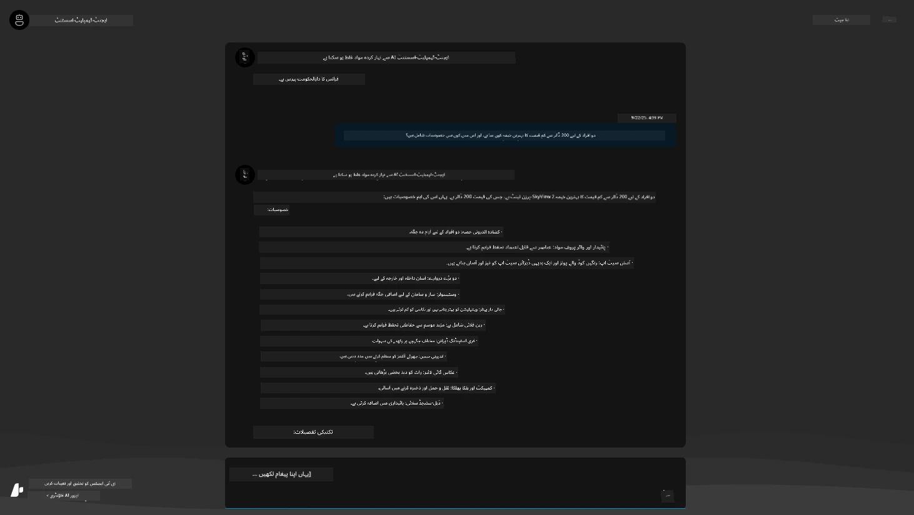

---

## 5. ایجنٹ کی توثیق

Azure Container App ایک اینڈ پوائنٹ تعینات کرتا ہے جو اس ٹیمپلیٹ کے Microsoft Foundry پروجیکٹ میں پروویژندہ AI ایجنٹ سے جڑتا ہے۔ آئیے دیکھتے ہیں اس کا مطلب کیا ہے۔

1. اپنے ریسورس گروپ کے لیے Azure پورٹل کی _Overview_ صفحے پر واپس جائیں

1. اس فہرست میں `Microsoft Foundry` ریسورس پر کلک کریں

1. آپ کو یہ نظر آئے گا۔ `Go to Microsoft Foundry Portal` بٹن پر کلک کریں۔
   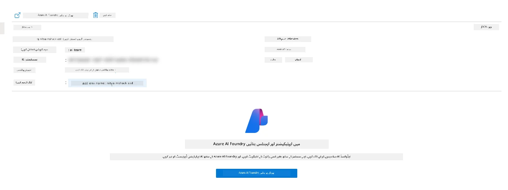

1. آپ کو اپنے AI ایپلیکیشن کے لیے Foundry پروجیکٹ صفحہ نظر آئے گا
   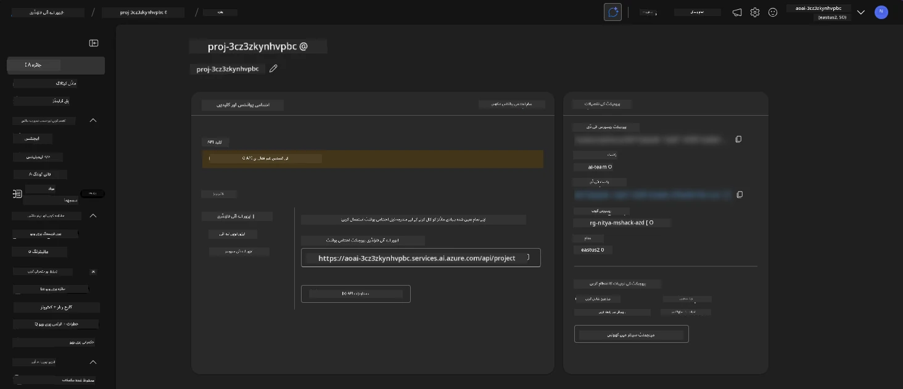

1. `Agents` پر کلک کریں — آپ کے پروجیکٹ میں ڈیفالٹ ایجنٹ پروویژندہ نظر آئے گا
   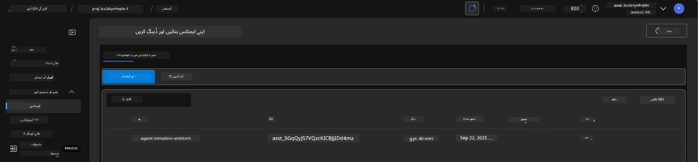

1. اسے منتخب کریں — اور ایجنٹ کی تفصیلات دیکھیں۔ درج ذیل نوٹ کریں:

      - ایجنٹ ڈیفالٹ طور پر File Search استعمال کرتا ہے (ہمیشہ)
      - ایجنٹ `Knowledge` میں دکھایا گیا ہے کہ اس کے پاس 32 فائلیں اپ لوڈ کی گئی ہیں (فائل سرچ کے لیے)
      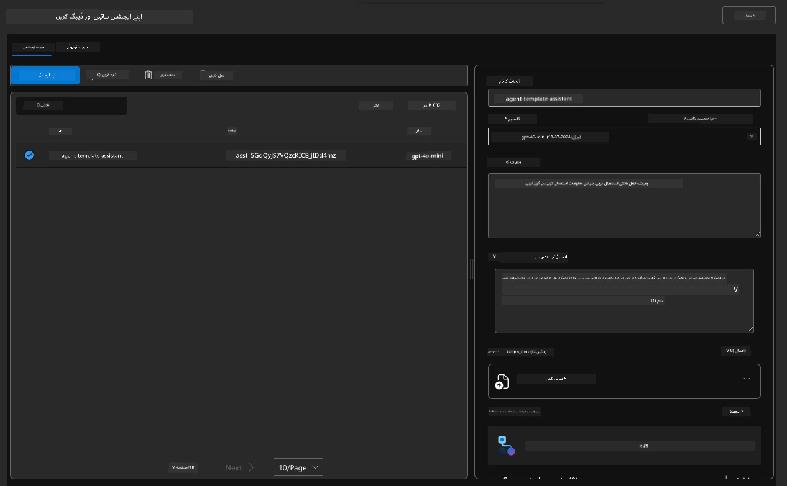

1. بائیں مینو میں `Data+indexes` آپشن تلاش کریں اور تفصیلات کے لیے کلک کریں۔

      - آپ کو 32 ڈیٹا فائلیں دکھائی دیں گی جو علم کے لیے اپ لوڈ کی گئی ہیں۔
      - یہ `src/files` کے تحت 12 کسٹمر فائلز اور 20 پروڈکٹ فائلز کے برابر ہونگی
      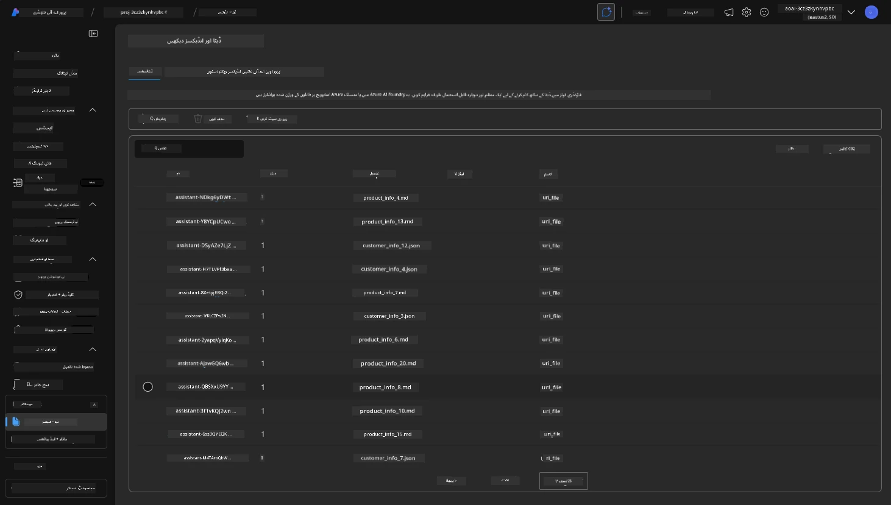

**آپ نے ایجنٹ کی آپریشن کی توثیق کر لی!**

1. ایجنٹ کے جوابات ان فائلز میں موجود علم پر مبنی ہیں۔
1. آپ اب اس ڈیٹا سے متعلق سوالات پوچھ سکتے ہیں، اور ٹھوس جوابات حاصل کر سکتے ہیں۔
1. مثال: `customer_info_10.json` "Amanda Perez" کی کی گئی 3 خریداریوں کی وضاحت کرتا ہے

براؤزر ٹیب واپس جائیں جس میں Container App کا اینڈ پوائنٹ کھلا ہے اور پوچھیں: `Amanda Perez کے کون سے مصنوعات ہیں؟`۔ آپ کو کچھ ایسا دیکھنا چاہیے:

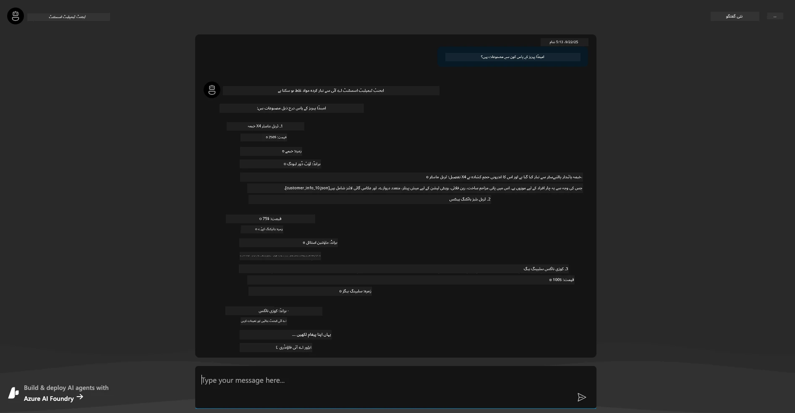

---

## 6. ایجنٹ پلے گراونڈ

Microsoft Foundry کی صلاحیتوں کے لیے مزید بصیرت حاصل کرنے کے لیے، ایجنٹ کو Agents Playground میں آزما کر دیکھیں۔

1. Microsoft Foundry میں `Agents` صفحے پر واپس جائیں — ڈیفالٹ ایجنٹ منتخب کریں
1. `Try in Playground` آپشن پر کلک کریں — آپ کو ایسا Playground UI ملے گا
1. وہی سوال پوچھیں: `Amanda Perez کے کون سے مصنوعات ہیں؟`

    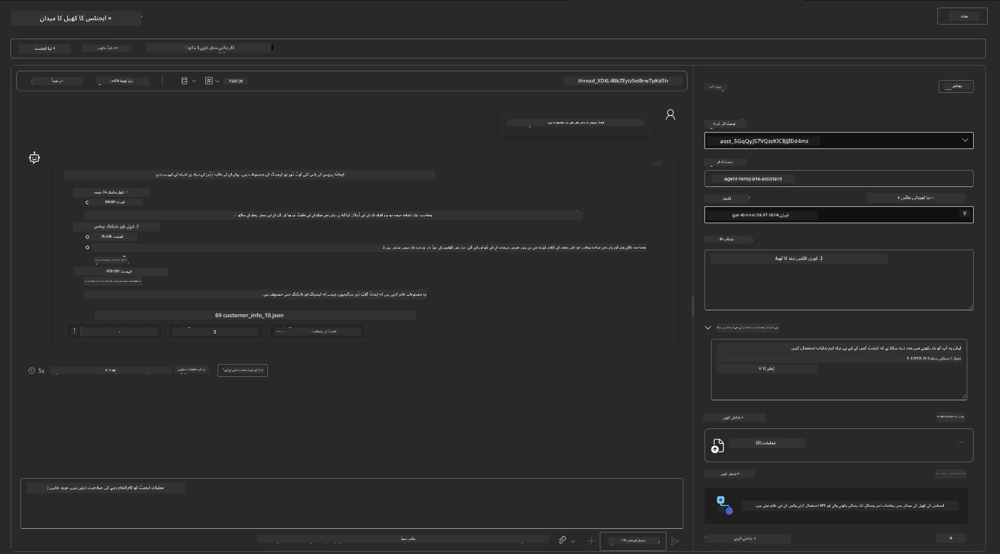

آپ کو وہی (یا مشابہ) جواب ملے گا — لیکن آپ کو اضافی معلومات بھی ملے گی جسے آپ اپنے ایجنٹک ایپ کی معیار، لاگت، اور کارکردگی سمجھنے کے لیے استعمال کر سکتے ہیں۔ مثال کے طور پر:

1. جواب میں استعمال شدہ ڈیٹا فائلز کا حوالہ دیا گیا ہے جو جواب کو "گراؤنڈ" کرتی ہیں
1. کسی بھی فائل لیبل پر ہوور کریں — کیا ڈیٹا آپ کی تلاش اور دکھائے گئے جواب سے میل کھاتا ہے؟

آپ کو جواب کے نیچے _stats_ کی ایک قطار بھی نظر آئے گی۔

1. کسی بھی میٹرک پر ہوور کریں — مثلاً Safety۔ آپ کو کچھ ایسا نظر آئے گا
1. کیا آپ کے تخیل کے مطابق جواب کی حفاظت کی سطح کا اندازہ ملتا ہے؟

      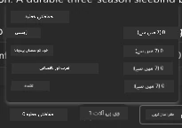

---

## 7. بلٹ ان مشاہدہ

مشاہدہ آپ کی ایپلیکیشن کو اس طرح سے ساز و سامان فراہم کرنے کے بارے میں ہے کہ وہ ڈیٹا پیدا کرے جسے آپ اس کے کام کو سمجھنے، ڈی بگ کرنے، اور بہتر بنانے کے لیے استعمال کر سکیں۔ اس کا ایک اندازہ حاصل کرنے کے لیے:

1. `View Run Info` بٹن پر کلک کریں — آپ کو یہ منظر دکھائی دے گا۔ یہ [Agent tracing](https://learn.microsoft.com/en-us/azure/ai-foundry/how-to/develop/trace-agents-sdk#view-trace-results-in-the-azure-ai-foundry-agents-playground) کی ایک مثال ہے۔ _آپ اس منظر کو ٹاپ لیول مینو میں Thread Logs پر کلک کر کے بھی حاصل کر سکتے ہیں_۔

   - رن کے مراحل اور ایجنٹ کے استعمال کیے گئے ٹولز کا اندازہ لگائیں
   - کل ٹوکن کی تعداد (بناوٹی ٹوکنز کے مقابلے میں) سمجھیں جو جواب میں استعمال ہوئی ہے
   - لیٹینسی کو سمجھیں اور یہ جانیں کہ عملدرآمد میں وقت کہاں خرچ ہو رہا ہے

      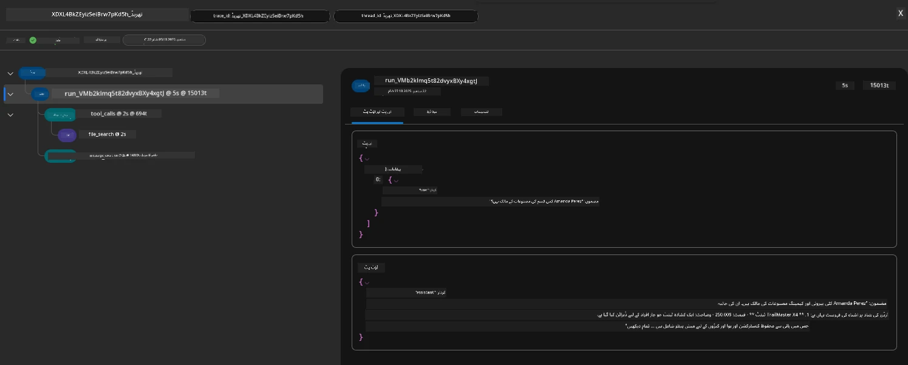

1. `Metadata` ٹیب پر کلک کریں تاکہ رن کے اضافی خصوصیات دیکھ سکیں، جو بعد میں مسئلے کی تشخیص کے لیے مفید ہو سکتی ہیں۔

      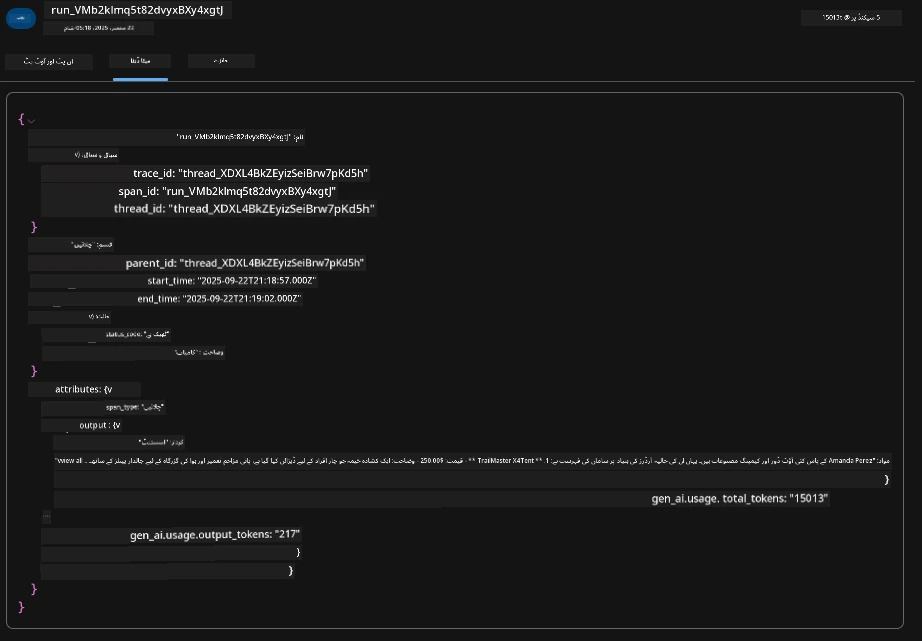


1. `Evaluations` ٹیب پر کلک کریں تاکہ ایجنٹ کے جواب پر خودکار اندازے دیکھ سکیں۔ ان میں حفاظتی جائزے (جیسے Self-harm) اور ایجنٹ مخصوص جائزے (مثلاً نیت کی وضاحت، ٹاسک کی پیروی) شامل ہیں۔

      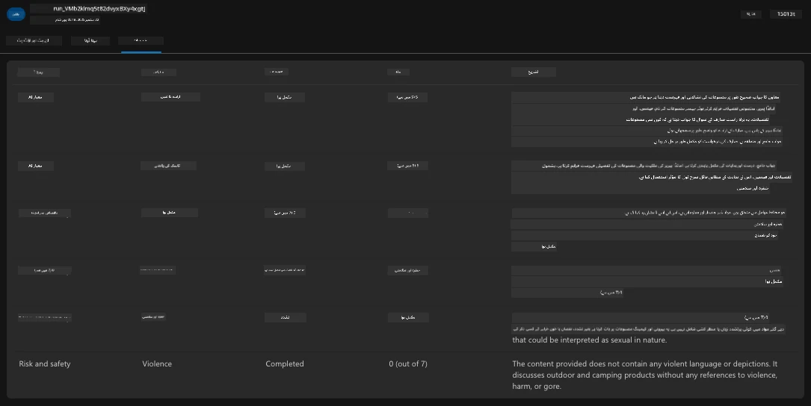

1. آخر میں، سائڈبار مینو میں `Monitoring` ٹیب پر کلک کریں۔

      - ظاہر ہونے والے صفحہ میں `Resource usage` ٹیب منتخب کریں — اور میٹرکس دیکھیں۔
      - لاگت (ٹوکنز) اور لوڈ (درخواستیں) کے لحاظ سے ایپلیکیشن کے استعمال کو ٹریک کریں۔
      - پہلی بائٹ (ان پٹ پراسیسنگ) اور آخری بائٹ (آؤٹ پٹ) کی ایپلیکیشن لیٹینسی کو ٹریک کریں۔

      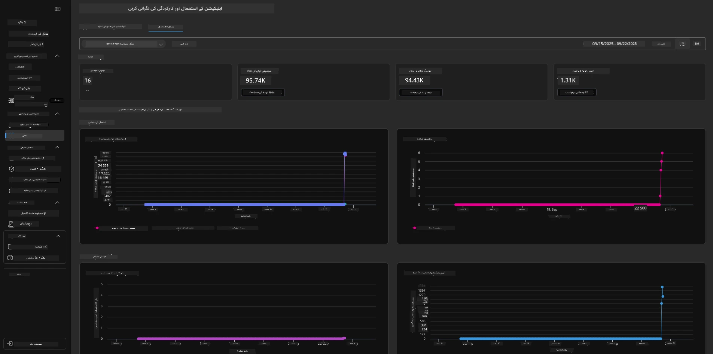

---

## 8. ماحول کے متغیرات

اب تک ہم براؤزر میں تعیناتی کا جائزہ لے چکے ہیں — اور توثیق کی ہے کہ ہماری انفراسٹرکچر فراہم کی گئی ہے اور ایپلیکیشن کام کر رہی ہے۔ لیکن کوڈ کے ساتھ کام کرنے کے لیے، ہمیں اپنی مقامی ڈویلپمنٹ کے ماحول کو متعلقہ متغیرات سے ترتیب دینا ہوگا جو ان وسائل کے ساتھ کام کرنے کے لیے درکار ہوتے ہیں۔ `azd` کا استعمال یہ آسان بناتا ہے۔

1. Azure Developer CLI [ماحول کے متغیرات](https://learn.microsoft.com/en-us/azure/developer/azure-developer-cli/manage-environment-variables?tabs=bash) کو استعمال کرتا ہے تاکہ ایپلیکیشن کی تعیناتیوں کے لیے کنفیگریشن سیٹنگز ذخیرہ اور منظم کی جا سکیں۔

1. ماحول کے متغیرات `.azure/<env-name>/.env` میں ذخیرہ ہوتے ہیں — یہ انہیں `env-name` ماحول کے لیے محدود کرتا ہے جو تعیناتی کے دوران استعمال کیا گیا اور مختلف تعیناتی اہداف کے درمیان ماحولوں کو الگ رکھنے میں مدد دیتا ہے۔

1. ماحول کے متغیرات کو `azd` کمانڈ کے ذریعہ خودکار طور پر لوڈ کیا جاتا ہے جب بھی یہ کوئی مخصوص کمانڈ چلاتا ہے (مثلاً، `azd up`)۔ نوٹ کریں کہ `azd` او ایس کی سطح کے ماحول کے متغیرات کو خودکار طور پر پڑھتا نہیں (جیسے شیل میں سیٹ کیے گئے) — اس کے بجائے آپ اسکرپٹس میں معلومات منتقل کرنے کے لیے `azd set env` اور `azd get env` استعمال کریں۔

آئیے کچھ کمانڈز آزما کر دیکھتے ہیں:

1. اس ماحول میں `azd` کے لیے سیٹ کیے گئے تمام ماحول کے متغیرات حاصل کریں:

      ```bash title="" linenums="0"
      azd env get-values
      ```
      
      آپ کو کچھ ایسا نظر آئے گا:

      ```bash title="" linenums="0"
      AZURE_AI_AGENT_DEPLOYMENT_NAME="gpt-4o-mini"
      AZURE_AI_AGENT_NAME="agent-template-assistant"
      AZURE_AI_EMBED_DEPLOYMENT_NAME="text-embedding-3-small"
      AZURE_AI_EMBED_DIMENSIONS=100
      ...
      ```

1. ایک مخصوص قدر حاصل کریں — مثلا، میں جاننا چاہتا ہوں کہ کیا ہم نے `AZURE_AI_AGENT_MODEL_NAME` کی قدر سیٹ کی ہے

      ```bash title="" linenums="0"
      azd env get-value AZURE_AI_AGENT_MODEL_NAME 
      ```
      
      آپ کو کچھ ایسا نظر آئے گا — یہ ڈیفالٹ کے طور پر سیٹ نہیں تھی!

      ```bash title="" linenums="0"
      ERROR: key 'AZURE_AI_AGENT_MODEL_NAME' not found in the environment values
      ```

1. `azd` کے لیے ایک نیا ماحول متغیر سیٹ کریں۔ یہاں، ہم ایجنٹ ماڈل کا نام اپ ڈیٹ کرتے ہیں۔ _نوٹ: کی گئی تبدیلیاں فوراً `.azure/<env-name>/.env` فائل میں ظاہر ہوں گی۔

      ```bash title="" linenums="0"
      azd env set AZURE_AI_AGENT_MODEL_NAME gpt-4.1
      azd env set AZURE_AI_AGENT_MODEL_VERSION 2025-04-14
      azd env set AZURE_AI_AGENT_DEPLOYMENT_CAPACITY 150
      ```

      اب، ہم دیکھیں گے کہ قدر سیٹ ہو چکی ہے:

      ```bash title="" linenums="0"
      azd env get-value AZURE_AI_AGENT_MODEL_NAME 
      ```

1. نوٹ کریں کہ کچھ وسائل مستقل ہوتے ہیں (مثلاً، ماڈل کی تعیناتیاں) اور ان کے لیے صرف `azd up` سے زیادہ کچھ تعینات کرنا پڑے گا۔ آئیے اصل تعیناتی کو ختم کرکے ماحول کے متغیرات میں تبدیلی کے ساتھ دوبارہ تعینات کرنے کی کوشش کرتے ہیں۔

1. **تازہ کاری** اگر آپ نے پہلے کسی azd ٹیمپلیٹ کا استعمال کرتے ہوئے انفراسٹرکچر تعینات کیا تھا — تو آپ اپنے مقامی ماحول کے متغیرات کی حالت کو اپنی Azure تعیناتی کی موجودہ حالت کی بنیاد پر اس کمانڈ کے ذریعے تازہ کر سکتے ہیں:

      ```bash title="" linenums="0"
      azd env refresh
      ```

      یہ دو یا زیادہ مقامی ترقیاتی ماحولیات (مثلاً، متعدد ڈویلپرز کی ٹیم) میں ماحول کے متغیرات کو _ہم آہنگ_ کرنے کا ایک طاقتور طریقہ ہے - جو تعین شدہ بنیادی ڈھانچے کو ماحول متغیر کی حالت کے لیے اصل حقائق کے طور پر کام کرنے کی اجازت دیتا ہے۔ ٹیم کے اراکین بس متغیرات کو _تازہ_ کرتے ہیں تاکہ دوبارہ ہم آہنگ ہو سکیں۔

---

## 9. مبارک ہو 🏆

آپ نے ابھی ایک مکمل ورک فلو مکمل کیا ہے جس میں آپ نے:

- [X] AZD ٹیمپلیٹ جسے آپ استعمال کرنا چاہتے ہیں منتخب کیا
- [X] GitHub Codespaces کے ساتھ ٹیمپلیٹ کو لانچ کیا
- [X] ٹیمپلیٹ کو تعینات کیا اور تصدیق کی کہ یہ کام کرتا ہے

---

<!-- CO-OP TRANSLATOR DISCLAIMER START -->
**تنبیہہ**:  
یہ دستاویز AI ترجمہ خدمت [Co-op Translator](https://github.com/Azure/co-op-translator) کے ذریعے ترجمہ کی گئی ہے۔ اگرچہ ہم درستگی کے لیے کوشاں ہیں، براہ کرم یاد رکھیں کہ خودکار ترجموں میں غلطیاں یا عدم درستیاں ہو سکتی ہیں۔ اصل دستاویز اپنی مادری زبان میں معتبر اور حتمی ذریعہ سمجھا جانا چاہیے۔ اہم معلومات کے لیے پیشہ ور انسانی ترجمے کی سفارش کی جاتی ہے۔ اس ترجمے کے استعمال سے پیدا ہونے والی کسی بھی غلط فہمی یا غلط تشریح کی ذمہ داری ہم پر عائد نہیں ہوتی۔
<!-- CO-OP TRANSLATOR DISCLAIMER END -->