# 2. ٹیمپلیٹ کی تصدیق کریں

!!! tip "اس ماڈیول کے اختتام تک آپ قابل ہو جائیں گے"

    - [ ] AI حل کے فن تعمیر کا تجزیہ کریں
    - [ ] AZD تعیناتی ورک فلو کو سمجھیں
    - [ ] AZD کے استعمال پر مدد کے لیے GitHub Copilot استعمال کریں
    - [ ] **لیب 2:** AI ایجنٹس ٹیمپلیٹ کو تعینات اور تصدیق کریں

---


## 1. تعارف

[Azure Developer CLI](https://learn.microsoft.com/en-us/azure/developer/azure-developer-cli/) یا `azd` ایک اوپن سورس کمانڈ لائن ٹول ہے جو Azure پر ایپلیکیشنز بنانے اور تعینات کرنے والے ڈیولپر کے ورک فلو کو آسان بناتا ہے۔

[AZD ٹیمپلیٹس](https://learn.microsoft.com/azure/developer/azure-developer-cli/azd-templates) معیاری ریپوزٹریز ہیں جن میں نمونہ ایپلیکیشن کوڈ، _infrastructure-as-code_ اثاثے، اور `azd` کنفیگریشن فائلیں شامل ہوتی ہیں تاکہ ایک مربوط حل کے فن تعمیر کو یقینی بنایا جا سکے۔ انفراسٹرکچر کی فراہمی `azd provision` کمانڈ جتنا آسان ہو جاتا ہے - جب کہ `azd up` کے ذریعے آپ انفراسٹرکچر فراہم کرنے اور اپنی ایپلیکیشن کو ایک ہی بار میں تعینات کر سکتے ہیں!

نتیجتاً، اپنی ایپلیکیشن ڈیولپمنٹ کا عمل شروع کرنا اتنا ہی آسان ہو سکتا ہے جتنا کہ صحیح _AZD Starter ٹیمپلیٹ_ تلاش کرنا جو آپ کی ایپلیکیشن اور انفراسٹرکچر کی ضروریات کے سب سے قریب ہو - پھر ریپوزٹری کو اپنی صورت حال کی ضروریات کے مطابق حسبِ ضرورت بنانا۔

شروع کرنے سے پہلے، آئیے یقینی بنائیں کہ آپ نے Azure Developer CLI انسٹال کر رکھا ہے۔

1. VS Code کا ٹرمینل کھولیں اور یہ کمانڈ ٹائپ کریں:

      ```bash title="" linenums="0"
      azd version
      ```

1. آپ کو کچھ ایسا نظر آنا چاہیے!

      ```bash title="" linenums="0"
      azd version 1.19.0 (commit b3d68cea969b2bfbaa7b7fa289424428edb93e97)
      ```

**آپ اب azd کے ساتھ ٹیمپلیٹ منتخب کرنے اور تعینات کرنے کے لیے تیار ہیں**

---

## 2. ٹیمپلیٹ کا انتخاب

Microsoft Foundry پلیٹ فارم کے ساتھ [AZD ٹیمپلیٹس کے ایک سیٹ کی سفارش کی گئی ہے](https://learn.microsoft.com/en-us/azure/ai-foundry/how-to/develop/ai-template-get-started) جو مقبول حل کے منظرناموں جیسے _ملٹی ایجنٹ ورک فلو آٹومیشن_ اور _ملٹی موڈل مواد کی پروسیسنگ_ کو کور کرتے ہیں۔ آپ یہ ٹیمپلیٹس Microsoft Foundry پورٹل پر جا کر بھی دریافت کر سکتے ہیں۔

1. وزٹ کریں [https://ai.azure.com/templates](https://ai.azure.com/templates)
1. جب پرامپٹ آئے تو Microsoft Foundry پورٹل میں لاگ ان کریں - آپ کو کچھ ایسا نظر آے گا۔

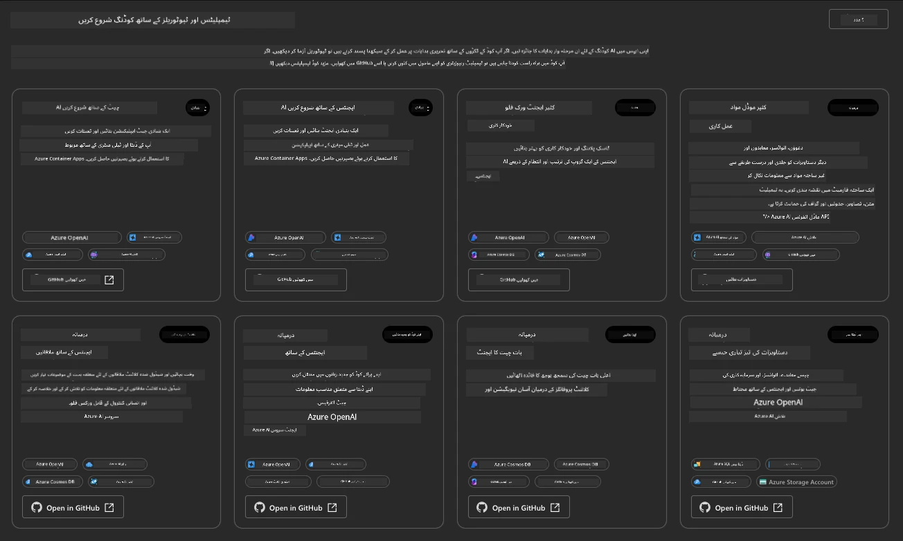


**Basic** اختیارات آپ کے اسٹارٹر ٹیمپلیٹس ہیں:

1. [ ] [Get Started with AI Chat](https://github.com/Azure-Samples/get-started-with-ai-chat) جو آپ کے ڈیٹا کے ساتھ ایک بنیادی چیٹ ایپلیکیشن کو Azure Container Apps پر تعینات کرتا ہے۔ اس کا استعمال ایک بنیادی AI چیٹ بوٹ منظرنامہ تلاش کرنے کے لیے کریں۔
1. [X] [Get Started with AI Agents](https://github.com/Azure-Samples/get-started-with-ai-agents) جو Foundry Agents کے ساتھ ایک معیاری AI ایجنٹ کو بھی تعینات کرتا ہے۔ اس کا استعمال ایجنٹ پر مبنی AI حلوں سے واقفیت حاصل کرنے کے لیے کریں جن میں ٹولز اور ماڈلز شامل ہیں۔

دوسرا لنک نئی براؤزر ٹیَب میں کھولیں (یا متعلقہ کارڈ کے لیے `Open in GitHub` پر کلک کریں)۔ آپ کو اس AZD ٹیمپلیٹ کے لیے ریپوزٹری نظر آئے گی۔ README کو ایک منٹ کے لیے دیکھیں۔ ایپلیکیشن کا فن تعمیر اس طرح دکھتا ہے:

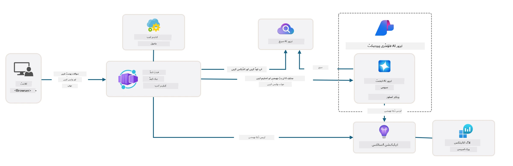

---

## 3. ٹیمپلیٹ کی فعال کاری

آئیے اس ٹیمپلیٹ کو تعینات کرنے کی کوشش کرتے ہیں اور یقینی بنائیں کہ یہ درست ہے۔ ہم [Getting Started](https://github.com/Azure-Samples/get-started-with-ai-agents?tab=readme-ov-file#getting-started) سیکشن میں دی گئی ہدایات پر عمل کریں گے۔

1. [اس لنک](https://github.com/codespaces/new/Azure-Samples/get-started-with-ai-agents) پر کلک کریں - `Create codespace` کی ڈیفالٹ کارروائی کی تصدیق کریں
1. یہ ایک نئی براؤزر ٹیَب کھولے گا - GitHub Codespaces سیشن کے مکمل لوڈ ہونے کا انتظار کریں
1. Codespaces میں VS Code کا ٹرمینل کھولیں - درج ذیل کمانڈ ٹائپ کریں:

   ```bash title="" linenums="0"
   azd up
   ```

جس ورک فلو سٹیپس کو یہ چلائے گا، مکمل کریں:

1. آپ کو Azure میں لاگ ان کرنے کے لیے کہا جائے گا - ہدایات کے مطابق تصدیق کریں
1. اپنا ایک منفرد ماحول نام درج کریں - مثلاً، میں نے `nitya-mshack-azd` استعمال کیا
1. اس سے `.azure/` فولڈر بن جائے گا - آپ کو اس میں ماحول کا ایک ذیلی فولڈر نظر آئے گا
1. آپ کو سبسکرپشن نام منتخب کرنے کے لیے کہا جائے گا - ڈیفالٹ منتخب کریں
1. آپ کو لوکیشن کے لیے کہا جائے گا - `East US 2` استعمال کریں

اب، آپ کو فراہمی مکمل ہونے کا انتظار کرنا ہوگا۔ **اس میں 10-15 منٹ لگتے ہیں**

1. جب مکمل ہو جائے، آپ کے کنسول میں SUCCESS کا پیغام ظاہر ہو گا جیسا کہ نیچے ہے:
      ```bash title="" linenums="0"
      SUCCESS: Your up workflow to provision and deploy to Azure completed in 10 minutes 17 seconds.
      ```
1. آپ کا Azure پورٹل اب اس ماحول کے نام کے ساتھ ایک provision شدہ resource group دکھائے گا:

      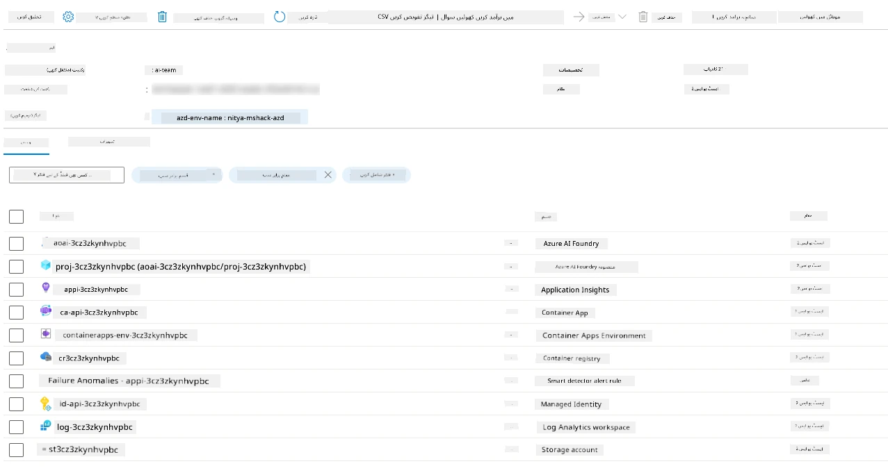

1. **آپ اب تعینات شدہ انفراسٹرکچر اور ایپلیکیشن کی تصدیق کرنے کے لیے تیار ہیں۔**

---

## 4. ٹیمپلیٹ کی تصدیق

1. Azure پورٹل کی [Resource Groups](https://portal.azure.com/#browse/resourcegroups) صفحے پر جائیں - جب پرامپٹ آئے تو لاگ ان کریں
1. اپنے ماحول کے نام کے RG پر کلک کریں - آپ کو اوپر والے صفحہ نظر آئے گا

      - Azure Container Apps resource پر کلک کریں
      - _Essentials_ سیکشن میں Application Url پر کلک کریں (اوپر دائیں)

1. آپ کو ایک ہوسٹ کی گئی ایپلیکیشن فرنٹ-اینڈ UI اس طرح نظر آئے گا:

   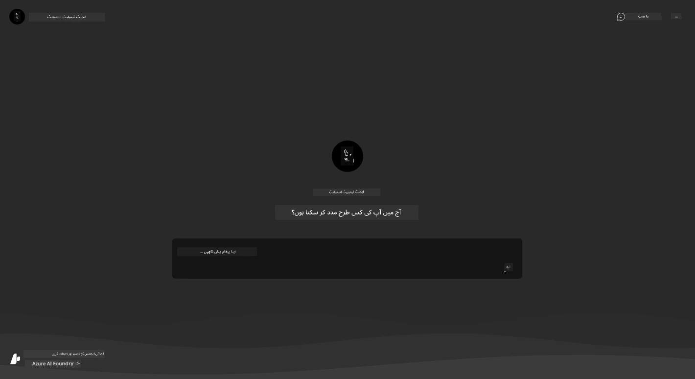

1. چند [نمونہ سوالات](https://github.com/Azure-Samples/get-started-with-ai-agents/blob/main/docs/sample_questions.md) پوچھنے کی کوشش کریں

      1. پوچھیں: ```فرانس کا دارالحکومت کیا ہے؟``` 
      1. پوچھیں: ```200 ڈالر سے کم قیمت میں دو افراد کے لیے بہترین خیمہ کون سا ہے، اور اس میں کونسی خصوصیات شامل ہیں؟```

1. آپ کو جواب کچھ اس طرح ملنا چاہیے جو نیچے دکھائے گئے ہیں۔ _لیکن یہ کیسے کام کرتا ہے؟_ 

      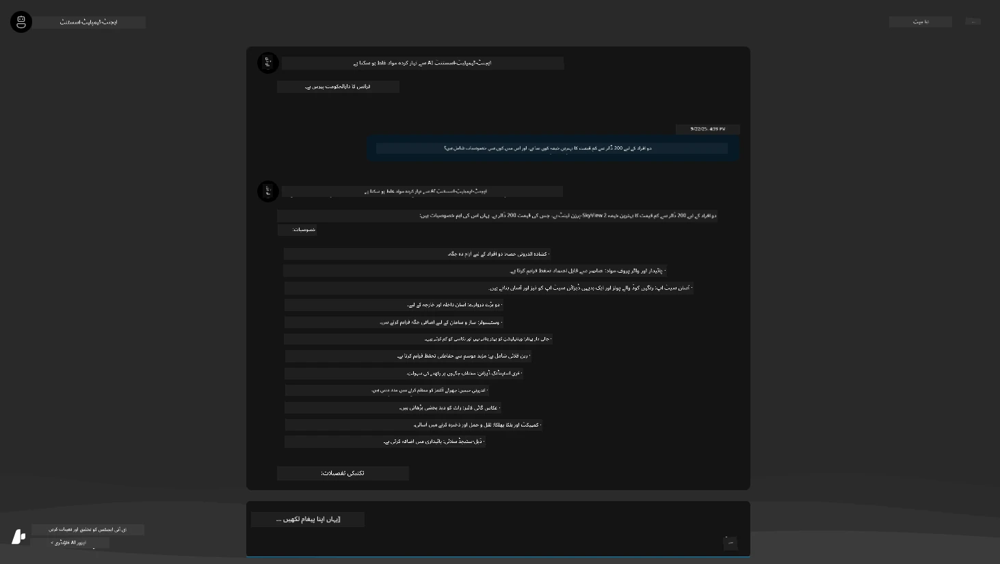

---

## 5. ایجنٹ کی تصدیق

Azure Container App ایک endpoint تعینات کرتا ہے جو اس AI ایجنٹ سے جڑتا ہے جو اس ٹیمپلیٹ کے لیے Microsoft Foundry پروجیکٹ میں provision کیا گیا ہے۔ آئیے دیکھتے ہیں کہ اس کا مطلب کیا ہے۔

1. اپنے resource group کے Azure پورٹل _Overview_ صفحے پر واپس جائیں

1. اس فہرست میں `Microsoft Foundry` resource پر کلک کریں

1. آپ کو یہ دیکھنا چاہیے۔ `Go to Microsoft Foundry Portal` بٹن پر کلک کریں۔ 
   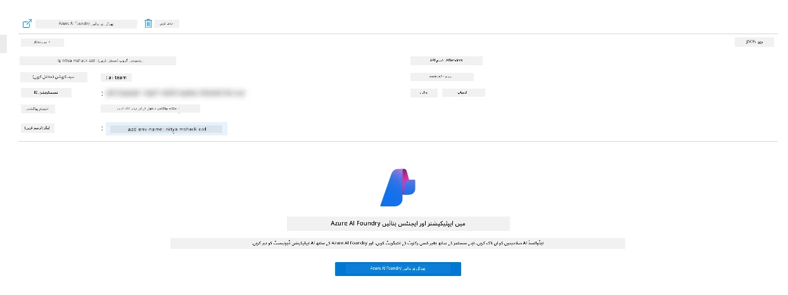

1. آپ کو اپنے AI ایپلیکیشن کے لیے Foundry Project صفحہ نظر آئے گا
   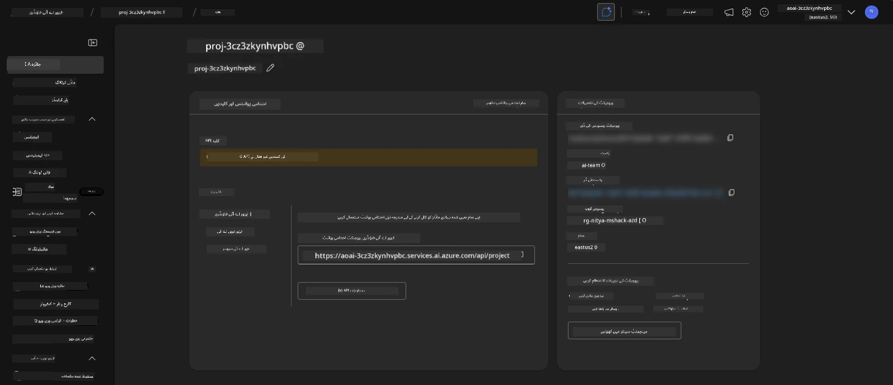

1. `Agents` پر کلک کریں - آپ کو اپنے پروجیکٹ میں provision ہوا ڈیفالٹ ایجنٹ نظر آئے گا
   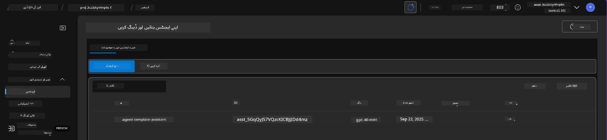

1. اسے منتخب کریں - اور آپ ایجنٹ کی تفصیلات دیکھیں گے۔ درج ذیل باتوں پر توجہ دیں:

      - ایجنٹ ڈیفالٹ طور پر File Search استعمال کرتا ہے (ہمیشہ)
      - ایجنٹ کی `Knowledge` ظاہر کرتی ہے کہ اس میں 32 فائلیں اپ لوڈ کی گئی ہیں (فائل سرچ کے لیے)
      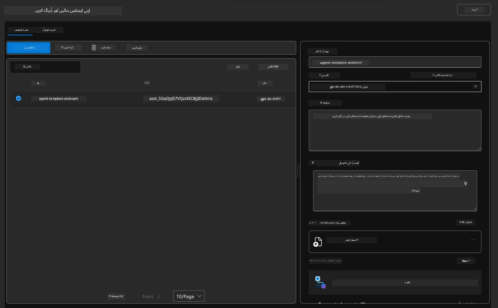

1. بائیں مینو میں `Data+indexes` آپشن تلاش کریں اور تفصیلات دیکھنے کے لیے کلک کریں۔ 

      - آپ کو 32 ڈیٹا فائلیں جو نالج کے لیے اپ لوڈ کی گئی ہیں نظر آئیں گی۔
      - یہ 12 کسٹمر فائلیں اور 20 پروڈکٹ فائلیں `src/files` کے تحت ہوں گی 
      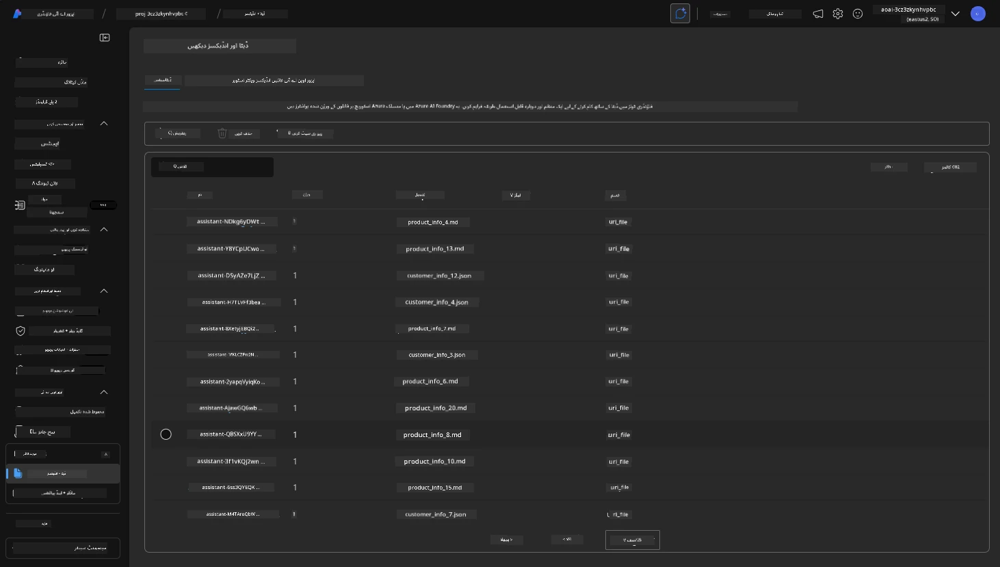

**آپ نے ایجنٹ کے آپریشن کی تصدیق کر لی ہے!** 

1. ایجنٹ کے جوابات ان فائلز میں موجود نالج پر مبنی ہوتے ہیں۔ 
1. آپ اب اس ڈیٹا سے متعلق سوالات پوچھ سکتے ہیں اور مستند جوابات حاصل کر سکتے ہیں۔
1. مثال: `customer_info_10.json` میں "Amanda Perez" کی 3 خریداریوں کی تفصیل ہے۔

کنٹینر ایپ endpoint والی براؤزر ٹیَب پر واپس جائیں اور پوچھیں: `Amanda Perez کون سے پروڈکٹس کی مالک ہے؟`۔ آپ کو کچھ ایسا نظر آنا چاہیے:

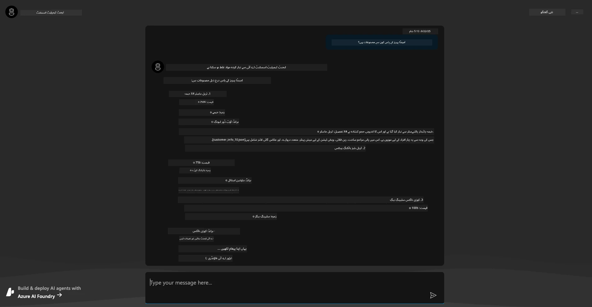

---

## 6. ایجنٹ پلے گراؤنڈ

آئیے Microsoft Foundry کی صلاحیتوں کے بارے میں مزید سمجھ بوجھ حاصل کرنے کے لیے ایجنٹ کو Agents Playground میں لے چلتے ہیں۔

1. Microsoft Foundry میں `Agents` صفحے پر واپس جائیں - ڈیفالٹ ایجنٹ منتخب کریں
1. `Try in Playground` آپشن پر کلک کریں - آپ کو ایک Playground UI نظر آئے گا
1. وہی سوال پوچھیں: `Amanda Perez کون سے پروڈکٹس کی مالک ہے؟`

    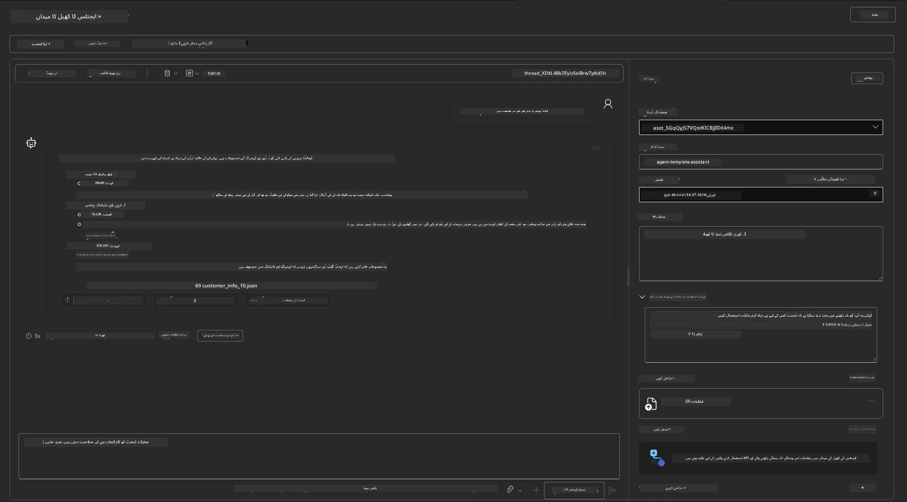

آپ کو وہی (یا مماثل) جواب ملے گا - لیکن آپ کو اضافی معلومات بھی ملیں گی جو آپ کو اپنے ایجنٹک ایپ کی معیار، لاگت، اور کارکردگی سمجھنے میں مدد دیتی ہیں۔ مثال کے طور پر:

1. نوٹ کریں کہ جواب میں وہ ڈیٹا فائلز شامل ہیں جنہیں "جواب کو زمین پر کھڑا کرنے" کے لیے استعمال کیا گیا ہے
1. ان فائل لیبلز پر ہوور کریں - کیا ڈیٹا آپ کی استفسار اور جواب سے میل کھاتا ہے؟

آپ کو جواب کے نیچے _stats_ کا ایک قطار بھی نظر آئے گی۔

1. کسی بھی میٹرک پر ہوور کریں - مثلاً Safety۔ آپ کو کچھ ایسا نظر آئے گا
1. کیا دی گئی تشخیص آپ کے جواب کی حفاظت کی سطح کے تخیل سے میل کھاتی ہے؟

      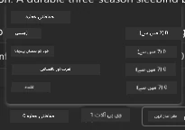

---

## 7. بلٹ ان آبزرویبیلٹی

آبزرویبیلٹی کا مطلب ہے اپنی ایپلیکیشن کو ایسا آلہ لگانا کہ وہ ڈیٹا تیار کرے جسے آپ اس کے عمل کو سمجھنے، ڈیبگ کرنے، اور بہتر بنانے کے لیے استعمال کر سکیں۔ اس کا احساس حاصل کرنے کے لیے:

1. `View Run Info` بٹن پر کلک کریں - آپ کو یہ منظر دیکھائی دے گا۔ یہ [Agent tracing](https://learn.microsoft.com/en-us/azure/ai-foundry/how-to/develop/trace-agents-sdk#view-trace-results-in-the-azure-ai-foundry-agents-playground) کی مثال ہے۔ _آپ یہ منظر تھریڈ لاگز پر کلک کر کے بھی حاصل کر سکتے ہیں جو اعلیٰ سطحی مینو میں ہے_۔

   - ایجنٹ کے چلائے گئے مراحل اور استعمال شدہ ٹولز کا اندازہ لگائیں
   - جواب کے لیے کل ٹوکن کی تعداد (بمقابلہ آؤٹ پٹ ٹوکن کے استعمال) کو سمجھیں
   - لیٹنسی کو سمجھیں اور جانچیں کہ عملدرآمد میں وقت کہاں خرچ ہو رہا ہے

      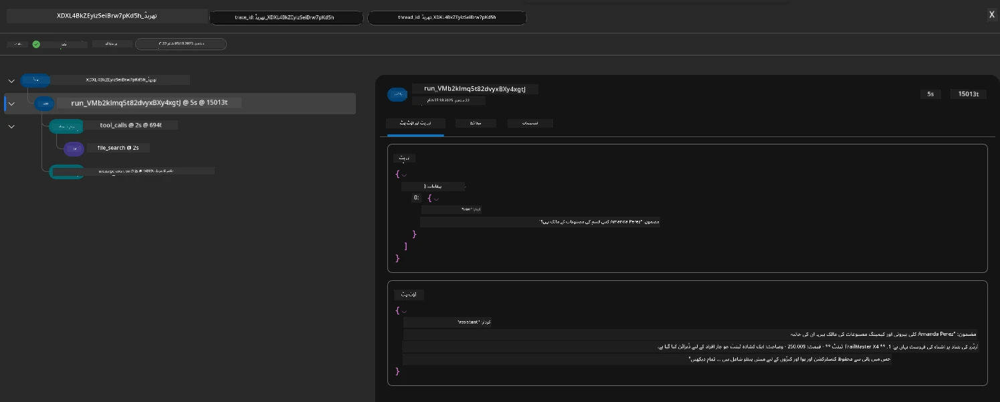

1. `Metadata` ٹیب پر کلک کریں تاکہ مزید خصوصیات دیکھ سکیں جو بعد میں مسائل کو ڈیبگ کرنے کے لیے مفید ہو سکتی ہیں۔   

      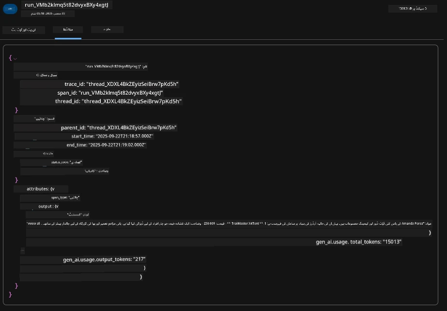


1. `Evaluations` ٹیب پر کلک کریں تاکہ ایجنٹ کے جواب پر خودکار اندازے دیکھ سکیں۔ ان میں حفاظت کی تشخیصات شامل ہیں (جیسے Self-harm) اور ایجنٹ مخصوص تشخیصات (جیسے Intent resolution, Task adherence)۔

      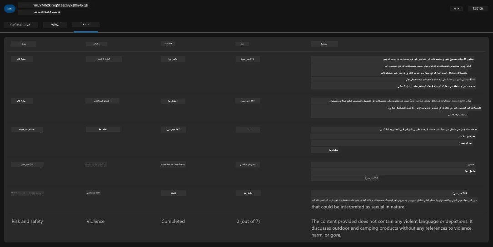

1. آخر میں، سائیڈبار مینو میں `Monitoring` ٹیب پر کلک کریں۔

      - دکھائے گئے صفحے میں `Resource usage` ٹیب کو منتخب کریں اور میٹرکس دیکھیں۔
      - لاگت (ٹوکنز) اور لوڈ (ریکوسٹس) کے لحاظ سے ایپلیکیشن کے استعمال کو ٹریک کریں۔
      - پہلی بائٹ (ان پٹ پروسیسنگ) اور آخری بائٹ (آؤٹ پٹ) کی لیکٹسی کو ٹریک کریں۔

      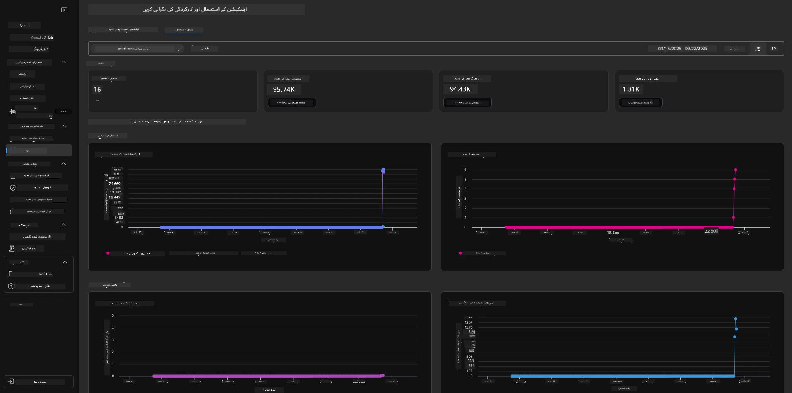

---

## 8. ماحول کی متغیرات

اب تک، ہم نے براؤزر میں تعیناتی کا عمل دیکھا ہے - اور تصدیق کی ہے کہ ہمارا انفراسٹرکچر فراہم ہو چکا ہے اور ایپلیکیشن کام کر رہی ہے۔ لیکن کوڈ سے پہلے کام کرنے کے لیے، ہمیں اپنے مقامی ترقیاتی ماحول کو متعلقہ متغیرات کے ساتھ کنفیگر کرنے کی ضرورت ہے جو ان وسائل کے ساتھ کام کرنے کے لیے درکار ہوتے ہیں۔ `azd` کے استعمال سے یہ آسان ہو جاتا ہے۔

1. Azure Developer CLI [ماحول کی متغیرات](https://learn.microsoft.com/en-us/azure/developer/azure-developer-cli/manage-environment-variables?tabs=bash) کا استعمال کرتا ہے تاکہ ایپلیکیشن کی تعیناتیوں کے لیے کنفیگریشن سیٹنگز محفوظ اور منظم کی جا سکیں۔

1. ماحول کی متغیرات `.azure/<env-name>/.env` میں محفوظ ہوتی ہیں - یہ انہیں `env-name` ماحول کے دائرہ کار میں رکھتی ہیں جو تعیناتی کے دوران استعمال ہوتا ہے اور آپ کو ایک ہی ریپو میں مختلف تعیناتی اہداف کے مابین ماحولوں کو الگ تھلگ کرنے میں مدد دیتا ہے۔

1. ماحول کی متغیرات خود بخود `azd` کمانڈ کے ذریعے لوڈ ہو جاتی ہیں جب بھی یہ کسی مخصوص کمانڈ (مثلاً `azd up`) کو چلائے۔ یاد رہے کہ `azd` خودکار طور پر _OS-سطح کی_ ماحول متغیرات (جیسے شیل میں سیٹ کی گئی) نہیں پڑھتا - اس کے بجائے `azd set env` اور `azd get env` کا استعمال کریں تاکہ اسکریپٹس میں معلومات منتقل کی جا سکیں۔

آئیے کچھ کمانڈز آزما کر دیکھیں:

1. اس ماحول میں `azd` کے لیے سیٹ کیے گئے تمام ماحول کی متغیرات حاصل کریں:

      ```bash title="" linenums="0"
      azd env get-values
      ```
      
      آپ کو کچھ ایسا نظر آئے گا:

      ```bash title="" linenums="0"
      AZURE_AI_AGENT_DEPLOYMENT_NAME="gpt-4.1-mini"
      AZURE_AI_AGENT_NAME="agent-template-assistant"
      AZURE_AI_EMBED_DEPLOYMENT_NAME="text-embedding-3-small"
      AZURE_AI_EMBED_DIMENSIONS=100
      ...
      ```

1. مخصوص ویلیو حاصل کریں - مثلاً، میں جاننا چاہتا ہوں کہ کیا ہم نے `AZURE_AI_AGENT_MODEL_NAME` ویلیو سیٹ کی ہے

      ```bash title="" linenums="0"
      azd env get-value AZURE_AI_AGENT_MODEL_NAME 
      ```
      
      آپ کو کچھ ایسا نظر آئے گا - یہ ڈیفالٹ طور پر سیٹ نہیں کی گئی تھی!

      ```bash title="" linenums="0"
      ERROR: key 'AZURE_AI_AGENT_MODEL_NAME' not found in the environment values
      ```

1. `azd` کے لیے نئی ماحول متغیر سیٹ کریں۔ یہاں، ہم ایجنٹ ماڈل کا نام اپ ڈیٹ کر رہے ہیں۔ _نوٹ: کی گئی کوئی بھی تبدیلی فوری طور پر `.azure/<env-name>/.env` فائل میں ظاہر ہو جائے گی۔

      ```bash title="" linenums="0"
      azd env set AZURE_AI_AGENT_MODEL_NAME gpt-4.1
      azd env set AZURE_AI_AGENT_MODEL_VERSION 2025-04-14
      azd env set AZURE_AI_AGENT_DEPLOYMENT_CAPACITY 150
      ```

      اب، ہمیں ویلیو سیٹ ہوئی نظر آنی چاہیے:

      ```bash title="" linenums="0"
      azd env get-value AZURE_AI_AGENT_MODEL_NAME 
      ```

1. نوٹ کریں کہ کچھ وسائل مستقل ہوتے ہیں (جیسے ماڈل کی تعیناتیاں) اور انہیں دوبارہ تعینات کرنے کے لیے صرف `azd up` کافی نہیں ہوگا۔ آئیے اصل تعیناتی کو ختم کر کے env vars میں تبدیلی کے ساتھ دوبارہ تعینات کرنے کی کوشش کریں۔

1. **تازہ کاری کریں** اگر آپ نے پہلے azd ٹیمپلیٹ کا استعمال کرتے ہوئے انفراسٹرکچر پہلے ہی تعینات کر رکھی ہے - تو آپ اپنی مقامی ماحول کی متغیرات کی حالت کو Azure تعیناتی کی موجودہ حالت کی بنیاد پر _تازہ_ کر سکتے ہیں اس کمانڈ کے ذریعے:

      ```bash title="" linenums="0"
      azd env refresh
      ```

یہ ایک طاقتور طریقہ ہے کہ آپ دو یا زیادہ مقامی ترقی کے ماحول کے درمیان ماحول کے متغیرات کو _ہم آہنگ_ کریں (مثلاً، ایک ٹیم جس میں متعدد ڈیولپرز ہوں) - جس سے تعینات شدہ ڈھانچہ ماحول متغیر کی حالت کے لیے حقیقت کا معیار بن جائے۔ ٹیم کے رکن صرف متغیرات کو _ریفرش_ کرتے ہیں تاکہ دوبارہ ہم آہنگ ہو سکیں۔

---

## 9. مبارک ہو 🏆

آپ نے ابھی ایک اختتامی سے اختتام تک کا ورک فلو مکمل کیا ہے جہاں آپ نے:

- [X] AZD ٹیمپلیٹ منتخب کیا جسے آپ استعمال کرنا چاہتے ہیں
- [X] ٹیمپلیٹ کو GitHub Codespaces کے ساتھ لانچ کیا
- [X] ٹیمپلیٹ کو تعینات کیا اور اس کی تصدیق کی کہ یہ کام کرتا ہے

---

<!-- CO-OP TRANSLATOR DISCLAIMER START -->
**چھوٹ**:  
یہ دستاویز AI ترجمہ سروس [Co-op Translator](https://github.com/Azure/co-op-translator) کے ذریعے ترجمہ کی گئی ہے۔ اگرچہ ہم درستگی کے لئے کوشاں ہیں، براہ کرم آگاہ رہیں کہ خودکار ترجمے میں غلطیاں یا بے درستگیاں ہوسکتی ہیں۔ اصل دستاویز اپنی مادری زبان میں حتمی ماخذ سمجھی جانی چاہیے۔ اہم معلومات کے لیے، پیشہ ور انسانی ترجمہ کی سفارش کی جاتی ہے۔ ہم اس ترجمے کے استعمال سے پیدا ہونے والی کسی بھی غلط فہمی یا غلط تعبیر کے ذمہ دار نہیں ہیں۔
<!-- CO-OP TRANSLATOR DISCLAIMER END -->