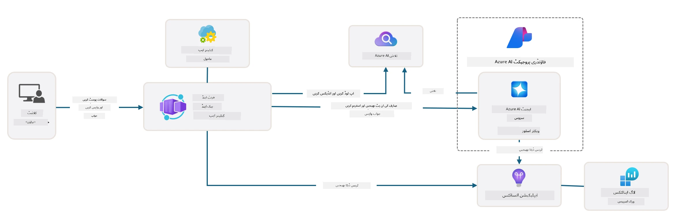

# 3. ٹیمپلیٹ کو توڑنا

!!! tip "اس ماڈیول کے اختتام تک آپ قابل ہو جائیں گے"

    - [ ] Azure معاونت کے لیے MCP سرورز کے ساتھ GitHub کوپائلٹ کو فعال کریں
    - [ ] AZD ٹیمپلیٹ فولڈر کی ساخت اور اجزاء کو سمجھیں
    - [ ] انفراسٹرکچر ایز کوڈ (Bicep) تنظیم کے پیٹرن دریافت کریں
    - [ ] **لیب 3:** GitHub کوپائلٹ کا استعمال کرتے ہوئے ریپوزٹری کی معماری کو دریافت اور سمجھیں

---

AZD ٹیمپلیٹس اور Azure Developer CLI (`azd`) کے ساتھ ہم تیزی سے اپنے AI ترقیاتی سفر کا آغاز کر سکتے ہیں، معیاری ریپوزٹریز کے ذریعے جو نمونہ کوڈ، انفراسٹرکچر اور کنفیگریشن فائلیں فراہم کرتے ہیں — ایک تیار-کرنے کے لیے دستیاب _starter_ پروجیکٹ کی شکل میں۔

**لیکن اب، ہمیں پروجیکٹ کی ساخت اور کوڈ بیس کو سمجھنا ہے — اور AZD ٹیمپلیٹ کو اپنی مرضی کے مطابق بنانے کے قابل ہونا ہے — بغیر AZD کی پہلے سے کسی بھی تجربے یا سمجھ کے!**

---

## 1. GitHub کوپائلٹ کو فعال کریں

### 1.1 GitHub کوپائلٹ چیٹ انسٹال کریں

اب وقت ہے کہ ہم [GitHub Copilot with Agent Mode](https://code.visualstudio.com/docs/copilot/chat/chat-agent-mode) کو دریافت کریں۔ اب ہم قدرتی زبان میں اپنے کام کو اعلی سطح پر بیان کر سکتے ہیں اور عمل درآمد میں مدد حاصل کر سکتے ہیں۔ اس لیب کے لیے، ہم [Copilot Free plan](https://github.com/github-copilot/signup) استعمال کریں گے جس میں مکملات اور چیٹ تعاملات کے لیے ماہانہ حد ہے۔

ایکسٹینشن مارکیٹ پلیس سے انسٹال کیا جا سکتا ہے، لیکن آپ کے Codespaces ماحول میں پہلے سے دستیاب ہونا چاہیے۔ _Copilot آئیکون کے ڈراپ ڈاؤن سے `Open Chat` پر کلک کریں - اور `What can you do?` جیسا پرامپٹ ٹائپ کریں_ - آپ سے لاگ ان کرنے کے لیے کہا جا سکتا ہے۔ **GitHub Copilot Chat تیار ہے**۔

### 1.2. MCP سرورز انسٹال کریں

Agent موڈ مؤثر ہو اس کے لیے اسے درست ٹولز تک رسائی کی ضرورت ہوتی ہے تاکہ وہ علم حاصل کر سکے یا اقدامات کر سکے۔ یہاں MCP سرورز مدد دے سکتے ہیں۔ ہم درج ذیل سرورز کو ترتیب دیں گے:

1. [Azure MCP Server](../../../../../workshop/docs/instructions)
1. [Microsoft Docs MCP Server](../../../../../workshop/docs/instructions)

ان کو فعال کرنے کے لیے:

1. `.vscode/mcp.json` نام کی فائل بنائیں اگر یہ موجود نہ ہو
1. اس فائل میں درج ذیل مواد کاپی کریں — اور سرورز شروع کریں!
   ```json title=".vscode/mcp.json"
   {
      "servers": {
         "Azure MCP Server": {
            "command": "npx",
            "args": [
            "-y",
            "@azure/mcp@latest",
            "server",
            "start"
            ]
         },
         "microsoft.docs.mcp": {
            "type": "http",
            "url": "https://learn.microsoft.com/api/mcp"
         }
      }
   }
   ```

??? warning "آپ کو ایک ایرر مل سکتا ہے کہ `npx` انسٹال نہیں ہے (مسئلہ کے حل کے لیے توسیع کریں)"

      اس مسئلے کو حل کرنے کے لیے، `.devcontainer/devcontainer.json` فائل کھولیں اور فیچرز سیکشن میں یہ لائن شامل کریں۔ پھر کنٹینر کو دوبارہ تعمیر کریں۔ اب آپ کے پاس `npx` انسٹال ہو چکا ہوگا۔

      ```title="" linenums="0"
         "features": {
            "ghcr.io/devcontainers/features/node:1": {},
            ...
         },
      ```

---

### 1.3. GitHub Copilot Chat کا ٹیسٹ کریں

**پہلے VS Code کمانڈ لائن سے Azure کے لیے `az login` کے ذریعے تصدیق کریں۔**

اب آپ اپنے Azure سبسکرپشن کی حالت جانچ سکیں گے، اور تعینات شدہ وسائل یا کنفیگریشن کے بارے میں سوالات پوچھ سکیں گے۔ ان پرامپٹس کو آزمائیں:

1. `List my Azure resource groups`
1. `#foundry list my current deployments`

آپ Azure دستاویزات کے بارے میں بھی سوالات پوچھ سکتے ہیں اور Microsoft Docs MCP سرور کی بنیاد پر جوابات حاصل کر سکتے ہیں۔ ان پرامپٹس کو آزمائیں:

1. `#microsoft_docs_search What is Azure Developer CLI?`
1. `#microsoft_docs_search Show me a Python tutorial to chat with deployed model`

یا آپ کسی کام کو مکمل کرنے کے لیے کوڈ کے ٹکڑے مانگ سکتے ہیں۔ یہ پرامپٹ آزمائیں:

1. `Give me a Python code example that uses AAD for an interactive chat client`

`Ask` موڈ میں، یہ آپ کو کوڈ فراہم کرے گا جسے آپ کاپی پیسٹ کر کے آزما سکتے ہیں۔ `Agent` موڈ میں، یہ ممکن ہے کہ یہ ایک قدم آگے بڑھ کر آپ کے لیے متعلقہ وسائل تیار کرے — بشمول سیٹ اپ اسکرپٹس اور دستاویزات — تاکہ آپ اس کام کو انجام دے سکیں۔

**اب آپ ٹیمپلیٹ ریپوزٹری کو دریافت کرنے کے لیے تیار ہیں**

---

## 2. معماری کو توڑیں

??? prompt "پوچھیں: docs/images/architecture.png میں موجود ایپلیکیشن کی معماری کو ایک پیراگراف میں بیان کریں"

      یہ ایپلیکیشن Azure پر مبنی ایک AI سے چلنے والی چیٹ ایپ ہے جو ایک جدید ایجنٹ پر مبنی معماری کو ظاہر کرتی ہے۔ حل کا مرکز Azure Container App ہے جو مرکزی ایپلیکیشن کوڈ میزبان ہے، جو صارف کے ان پٹ کو پروسیس کرتا ہے اور AI ایجنٹ کے ذریعے ذہین جوابات پیدا کرتا ہے۔
      
      یہ معماری Microsoft Foundry Project کو AI صلاحیتوں کی بنیاد کے طور پر استعمال کرتی ہے، جو Azure AI سروسز سے جڑتی ہے جو بنیادی زبان کے ماڈلز (جیسے GPT-4o-mini) اور ایجنٹ کی فعالیت فراہم کرتی ہیں۔ صارف کی بات چیت React بیسڈ فرنٹ اینڈ سے FastAPI بیک اینڈ تک جاتی ہے جو AI ایجنٹ سروس کے ساتھ رابطہ کرتی ہے تاکہ سیاق و سباق کے مطابق جوابات پیدا کر سکے۔
      
      نظام میں علم حاصل کرنے کی صلاحیتیں شامل ہیں، چاہے وہ فائل سرچ ہو یا Azure AI سرچ سروس، جو ایجنٹ کو اپ لوڈ شدہ دستاویزات میں موجود معلومات تک رسائی اور حوالہ دینے کی اجازت دیتی ہیں۔ آپریٹنگ خوبی کے لیے، معماری Application Insights اور Log Analytics Workspace کے ذریعے جامع مانیٹرنگ فراہم کرتی ہے، ٹریسنگ، لاگنگ، اور کارکردگی کی بہتری کے لیے۔
      
      Azure Storage ایپلیکیشن کے ڈیٹا اور فائل اپلوڈز کے لیے بلاک اسٹوریج فراہم کرتا ہے، جبکہ Managed Identity Azure کے وسائل کے درمیان محفوظ رسائی کو یقینی بناتی ہے بغیر کسی اسناد کو ذخیرہ کیے۔ پورا حل اسکیل ایبل اور آسانی سے قابلِ دیکھ بھال ہے، کنٹینرائزڈ ایپلیکیشن خودکار طور پر طلب کے مطابق بڑھتی ہے جبکہ Azure کی مینجڈ سروسز کے ماحولیاتی نظام کے ذریعے بلٹ ان سیکیورٹی، مانیٹرنگ، اور CI/CD صلاحیتیں فراہم کرتا ہے۔



---

## 3. ریپوزٹری کی ساخت

!!! prompt "پوچھیں: ٹیمپلیٹ فولڈر کی ساخت کو بیان کریں۔ ایک بصری ہائیرارکل ڈایاگرام سے شروع کریں۔"

??? info "جواب: بصری ہائیرارکل ڈایاگرام"

      ```bash title="" 
      get-started-with-ai-agents/
      ├── 📋 کنفیگریشن اور سیٹ اپ
      │   ├── azure.yaml                    # Azure Developer CLI کنفیگریشن
      │   ├── docker-compose.yaml           # لوکل ڈویلپمنٹ کنٹینرز
      │   ├── pyproject.toml                # پائتھن پروجیکٹ کنفیگریشن
      │   ├── requirements-dev.txt          # ڈویلپمنٹ ڈیپنڈنسیز
      │   └── .devcontainer/                # VS Code ڈیولپمنٹ کنٹینر سیٹ اپ
      │
      ├── 🏗️ انفراسٹرکچر (infra/)
      │   ├── main.bicep                    # بنیادی انفراسٹرکچر ٹیمپلیٹ
      │   ├── api.bicep                     # API مخصوص وسائل
      │   ├── main.parameters.json          # انفراسٹرکچر پیرا میٹرز
      │   └── core/                         # ماڈیولر انفراسٹرکچر اجزاء
      │       ├── ai/                       # AI سروس کنفیگریشنز
      │       ├── host/                     # ہوسٹنگ انفراسٹرکچر
      │       ├── monitor/                  # مانیٹرنگ اور لاگنگ
      │       ├── search/                   # Azure AI سرچ سیٹ اپ
      │       ├── security/                 # سیکیورٹی اور شناخت
      │       └── storage/                  # اسٹوریج اکاؤنٹ کنفیگریشن
      │
      ├── 💻 ایپلیکیشن ماخذ (src/)
      │   ├── api/                          # بیک اینڈ API
      │   │   ├── main.py                   # FasterAPI ایپلیکیشن انٹری
      │   │   ├── routes.py                 # API روٹس کی تعریف
      │   │   ├── search_index_manager.py   # سرچ فنکشنالٹی
      │   │   ├── data/                     # API ڈیٹا ہینڈلنگ
      │   │   ├── static/                   # جامد ویب اثاثے
      │   │   └── templates/                # HTML ٹیمپلیٹس
      │   ├── frontend/                     # React/TypeScript فرنٹ اینڈ
      │   │   ├── package.json              # Node.js انحصار
      │   │   ├── vite.config.ts            # Vite بلڈ کنفیگریشن
      │   │   └── src/                      # فرنٹ اینڈ سورس کوڈ
      │   ├── data/                         # نمونہ ڈیٹا فائلیں
      │   │   └── embeddings.csv            # پیشگی کمپیوٹ شدہ ایمبیڈنگز
      │   ├── files/                        # علم کی بنیاد کی فائلیں
      │   │   ├── customer_info_*.json      # صارف کے ڈیٹا نمونے
      │   │   └── product_info_*.md         # مصنوعات کی دستاویزات
      │   ├── Dockerfile                    # کنٹینر کنفیگریشن
      │   └── requirements.txt              # پائتھن ڈیپنڈنسیز
      │
      ├── 🔧 آٹومیشن اور اسکرپٹس (scripts/)
      │   ├── postdeploy.sh/.ps1           # تعیناتی کے بعد سیٹ اپ
      │   ├── setup_credential.sh/.ps1     # اسناد کی کنفیگریشن
      │   ├── validate_env_vars.sh/.ps1    # ماحول کی جانچ
      │   └── resolve_model_quota.sh/.ps1  # ماڈل کوٹا مینجمنٹ
      │
      ├── 🧪 ٹیسٹنگ اور جائزہ
      │   ├── tests/                        # یونٹ اور انٹیگریشن ٹیسٹ
      │   │   └── test_search_index_manager.py
      │   ├── evals/                        # ایجنٹ جائزہ فریم ورک
      │   │   ├── evaluate.py               # جائزہ رنر
      │   │   ├── eval-queries.json         # ٹیسٹ سوالات
      │   │   └── eval-action-data-path.json
      │   ├── sandbox/                      # ترقیاتی پلیئر گراونڈ
      │   │   ├── 1-quickstart.py           # شروعات کے مثالیں
      │   │   └── aad-interactive-chat.py   # تصدیقی مثالیں
      │   └── airedteaming/                 # AI سیفٹی جائزہ
      │       └── ai_redteaming.py          # ریڈ ٹیم ٹیسٹنگ
      │
      ├── 📚 دستاویزات (docs/)
      │   ├── deployment.md                 # تعیناتی رہنما
      │   ├── local_development.md          # مقامی سیٹ اپ ہدایات
      │   ├── troubleshooting.md            # عام مسائل اور حل
      │   ├── azure_account_setup.md        # Azure کی پیشگی ضروریات
      │   └── images/                       # دستاویزات کے اثاثے
      │
      └── 📄 پروجیکٹ میٹا ڈیٹا
         ├── README.md                     # پروجیکٹ کا جائزہ
         ├── CODE_OF_CONDUCT.md           # کمیونٹی رہنما اصول
         ├── CONTRIBUTING.md              # تعاون کی رہنمائی
         ├── LICENSE                      # لائسنس کی شرائط
         └── next-steps.md                # تعیناتی کے بعد رہنمائی
      ```

### 3.1. بنیادی ایپ معماری

یہ ٹیمپلیٹ ایک **فل اسٹیک ویب ایپلیکیشن** پیٹرن کی پیروی کرتا ہے جس میں:

- **بیک اینڈ**: Python FastAPI کے ساتھ Azure AI انضمام
- **فرنٹ اینڈ**: TypeScript/React کے ساتھ Vite بلڈ سسٹم
- **انفراسٹرکچر**: کلاؤڈ وسائل کے لیے Azure Bicep ٹیمپلیٹس
- **کنٹینرائزیشن**: مستقل تعیناتی کے لیے Docker

### 3.2 انفراسٹرکچر ایز کوڈ (bicep)

انفراسٹرکچر کی سطح میں **Azure Bicep** ٹیمپلیٹس کا ماڈیولر انداز میں تنظیم ہے:

   - **`main.bicep`**: تمام Azure وسائل کا انتظام کرتا ہے
   - **`core/` ماڈیولز**: مختلف خدمات کے لیے دوبارہ قابل استعمال اجزاء
      - AI خدمات (Azure OpenAI, AI سرچ)
      - کنٹینر ہوسٹنگ (Azure Container Apps)
      - مانیٹرنگ (Application Insights, Log Analytics)
      - سیکیورٹی (Key Vault, Managed Identity)

### 3.3 ایپ ماخذ (`src/`)

**بیک اینڈ API (`src/api/`)**:

- FastAPI پر مبنی REST API
- Foundry Agents انضمام
- علم بازیافت کے لیے سرچ انڈیکس مینجمنٹ
- فائل اپ لوڈ اور پروسیسنگ کی صلاحیتیں

**فرنٹ اینڈ (`src/frontend/`)**:

- جدید React/TypeScript سنگل پیج ایپلیکیشن
- تیز ترقی اور بہتر تعمیریں کے لیے Vite
- ایجنٹ کی بات چیت کے لیے چیٹ انٹرفیس

**علمی بنیاد (`src/files/`)**:

- صارف اور مصنوعات کے نمونہ ڈیٹا
- فائل کی بنیاد پر علم بازیافت کی مثالیں
- JSON اور Markdown فارمیٹ کی مثالیں

### 3.4 ڈیو اوپس اور آٹومیشن

**اسکرپٹس (`scripts/`)**:

- کراس پلیک فارم PowerShell اور Bash اسکرپٹس
- ماحول کی جانچ اور سیٹ اپ
- تعیناتی کے بعد کنفیگریشن
- ماڈل کوٹا مینجمنٹ

**Azure Developer CLI انضمام**:

- `azure.yaml` `azd` ورک فلو کے لیے کنفیگریشن
- خودکار پروویژننگ اور تعیناتی
- ماحولیاتی متغیرات کا انتظام

### 3.5 ٹیسٹنگ اور معیار کی یقین دہانی

**جائزہ فریم ورک (`evals/`)**:

- ایجنٹ کی کارکردگی کا جائزہ
- سوال و جواب کی کوالٹی ٹیسٹنگ
- خودکار جانچ پائپ لائن

**AI سیفٹی (`airedteaming/`)**:

- AI حفاظت کے لیے ریڈ ٹیم ٹیسٹنگ
- سیکیورٹی کی کمزوریوں کا اسکیننگ
- ذمہ دار AI طریقے کار

---

## 4. مبارک ہو 🏆

آپ نے MCP سرورز کے ساتھ GitHub Copilot Chat کامیابی کے ساتھ استعمال کیا، اور ریپوزٹری کو دریافت کیا۔

- [X] Azure کے لیے GitHub Copilot کو فعال کیا
- [X] ایپلیکیشن کی معماری کو سمجھا
- [X] AZD ٹیمپلیٹ ساخت کو دریافت کیا

اس سے آپ کو اس ٹیمپلیٹ کے لیے _انفراسٹرکچر ایز کوڈ_ اثاثوں کا اندازہ ہوتا ہے۔ اگلے مرحلے میں ہم AZD کے کنفیگریشن فائل کو دیکھیں گے۔

---

<!-- CO-OP TRANSLATOR DISCLAIMER START -->
**ڈس کلیمر**:  
اس دستاویز کا ترجمہ AI ترجمہ سروس [Co-op Translator](https://github.com/Azure/co-op-translator) کے ذریعے کیا گیا ہے۔ اگرچہ ہم درستگی کی کوشش کرتے ہیں، براہ کرم آگاہ رہیں کہ خودکار تراجم میں غلطیاں یا خامیاں ہو سکتی ہیں۔ اصل دستاویز اپنی مادری زبان میں قابلِ اعتماد ذریعہ سمجھی جائے گی۔ اہم معلومات کے لیے پیشہ ور انسانی ترجمہ کی سفارش کی جاتی ہے۔ اس ترجمے کے استعمال سے ہونے والی کسی بھی غلط فہمی یا غلط تشریح کی ذمہ داری ہم قبول نہیں کرتے۔
<!-- CO-OP TRANSLATOR DISCLAIMER END -->