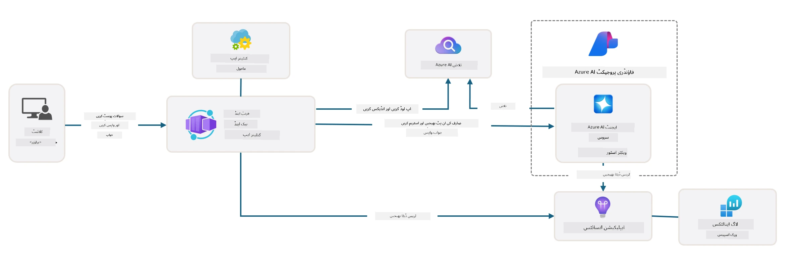

# 3. ایک ٹیمپلیٹ کو منقسم کریں

!!! tip "اس ماڈیول کے آخر تک آپ قابل ہو جائیں گے"

    - [ ] Azure کی مدد کے لیے MCP سرورز کے ساتھ GitHub Copilot کو فعال کریں
    - [ ] AZD ٹیمپلیٹ فولڈر کی ساخت اور اجزاء کو سمجھیں
    - [ ] انفراسٹرکچر ایز کوڈ (Bicep) کی تنظیمی نمونوں کو دریافت کریں
    - [ ] **لیب 3:** GitHub Copilot کا استعمال کرتے ہوئے ریپوزیٹری آرکیٹیکچر کو دریافت اور سمجھیں

---

AZD ٹیمپلیٹس اور Azure Developer CLI (`azd`) کے ساتھ ہم معیاری ریپوزیٹریز کے ذریعے اپنی AI ترقی کا سفر جلد شروع کر سکتے ہیں جو نمونہ کوڈ، انفراسٹرکچر اور کنفیگریشن فائلیں فراہم کرتی ہیں - ایک تیار کرنے کے قابل _سٹارٹر_ پروجیکٹ کی صورت میں۔

**لیکن اب، ہمیں پروجیکٹ کی ساخت اور کوڈ بیس کو سمجھنا ہوگا - اور AZD ٹیمپلیٹ کو اپنی مرضی کے مطابق بنانے کے قابل ہونا ہوگا - بغیر کسی سابقہ تجربے یا AZD کی سمجھ کے!**

---

## 1. GitHub Copilot کو فعال کریں

### 1.1 GitHub Copilot چیٹ انسٹال کریں

اب وقت ہے [GitHub Copilot with Agent Mode](https://code.visualstudio.com/docs/copilot/chat/chat-agent-mode) کو دریافت کرنے کا۔ اب ہم قدرتی زبان استعمال کرتے ہوئے اپنے کام کو ایک اعلیٰ سطح پر بیان کر سکتے ہیں، اور عملدرآمد میں مدد حاصل کر سکتے ہیں۔ اس لیب کے لیے، ہم [Copilot Free plan](https://github.com/github-copilot/signup) استعمال کریں گے جس کی ماہانہ مکمل ہونے اور چیٹ انٹرایکشنز کی حد ہوتی ہے۔

یہ ایکسٹینشن مارکیٹ پلیس سے انسٹال کی جا سکتی ہے، لیکن آپ کے Codespaces ماحول میں پہلے سے دستیاب ہونی چاہیے۔ _Copilot آئیکون کے ڈراپ ڈاؤن سے `Open Chat` پر کلک کریں - اور ایک پرامپٹ جیسے `What can you do?` لکھیں_ - آپ کو لاگ ان کرنے کا کہا جا سکتا ہے۔ **GitHub Copilot Chat تیار ہے**۔

### 1.2 MCP سرورز انسٹال کریں

Agent mode مؤثر ہونے کے لیے، اسے مناسب ٹولز تک رسائی چاہیے تاکہ علم حاصل کر سکے یا کارروائی کر سکے۔ یہاں MCP سرورز مددگار ہوتے ہیں۔ ہم مندرجہ ذیل سرورز کی ترتیب دیں گے:

1. [Azure MCP سرور](../../../../../workshop/docs/instructions)
1. [Microsoft Docs MCP سرور](../../../../../workshop/docs/instructions)

ان کو فعال کرنے کے لیے:

1. اگر وجود میں نہ ہو تو `.vscode/mcp.json` نامی فائل بنائیں
1. اس فائل میں درج ذیل مواد کاپی کریں - اور سرورز چلانا شروع کریں!
   ```json title=".vscode/mcp.json"
   {
      "servers": {
         "Azure MCP Server": {
            "command": "npx",
            "args": [
            "-y",
            "@azure/mcp@latest",
            "server",
            "start"
            ]
         },
         "microsoft.docs.mcp": {
            "type": "http",
            "url": "https://learn.microsoft.com/api/mcp"
         }
      }
   }
   ```

??? warning "آپ کو ایک ایرر مل سکتا ہے کہ `npx` انسٹال نہیں ہے (حل کے لیے کلک کریں)"

      حل کے لیے، `.devcontainer/devcontainer.json` فائل کھولیں اور features سیکشن میں یہ لائن شامل کریں۔ پھر کنٹینر کو دوبارہ بنائیں۔ اب آپ کے پاس `npx` انسٹال ہو چکا ہوگا۔

      ```title="" linenums="0"
         "features": {
            "ghcr.io/devcontainers/features/node:1": {},
            ...
         },
      ```

---

### 1.3 GitHub Copilot Chat کا ٹیسٹ کریں

**پہلے `az login` استعمال کریں تاکہ VS Code کمانڈ لائن سے Azure کے ساتھ مستند ہو سکیں۔**

اب آپ اپنی Azure سبسکرپشن کی حیثیت کے بارے میں سوالات کر سکتے ہیں، اور تعینات شدہ وسائل یا کنفیگریشن سے متعلق سوالات پوچھ سکتے ہیں۔ یہ پرامپٹس آزمائیں:

1. `List my Azure resource groups`
1. `#foundry list my current deployments`

آپ Azure دستاویزات کے بارے میں بھی سوالات کر سکتے ہیں اور Microsoft Docs MCP سرور پر مبنی جوابات حاصل کر سکتے ہیں۔ یہ پرامپٹس آزمائیں:

1. `#microsoft_docs_search What is Azure Developer CLI?`
1. `#microsoft_docs_search Show me a Python tutorial to chat with deployed model`

یا آپ کوڈ کے نمونے بھی مانگ سکتے ہیں تاکہ کوئی کام مکمل ہو۔ یہ پرامپٹ آزمائیں:

1. `Give me a Python code example that uses AAD for an interactive chat client`

`Ask` موڈ میں، یہ کوڈ فراہم کرے گا جسے آپ کاپی پیسٹ کر کے آزما سکتے ہیں۔ `Agent` موڈ میں، یہ آپ کے لیے متعلقہ وسائل بنا سکتا ہے - بشمول سیٹ اپ اسکرپٹس اور دستاویزات - تاکہ آپ اس کام کو انجام دے سکیں۔

**اب آپ ٹیمپلیٹ ریپوزیٹری کو دریافت کرنے کے لیے تیار ہیں**

---

## 2. آرکیٹیکچر کو منقسم کریں

??? prompt "پوچھیں: docs/images/architecture.png میں ایپلیکیشن آرکیٹیکچر کو 1 پیراگراف میں بیان کریں"

      یہ ایپلیکیشن ایک Azure پر مبنی AI سے چلنے والی چیٹ ایپلیکیشن ہے جو جدید ایجنٹ پر مبنی آرکیٹیکچر کی مثال پیش کرتی ہے۔ حل کا مرکز ایک Azure Container App ہے جو مرکزی ایپلیکیشن کوڈ کی میزبانی کرتا ہے، جو صارف کی ان پٹ کو پراسیس کرتا ہے اور AI ایجنٹ کے ذریعے ذہین جوابات پیدا کرتا ہے۔
      
      آرکیٹیکچر Microsoft Foundry Project کو AI صلاحیتوں کی بنیاد کے طور پر استعمال کرتا ہے، جو Azure AI Services سے جڑا ہوتا ہے جو بنیادی زبان کے ماڈل (جیسے gpt-4.1-mini) اور ایجنٹ فنکشنلٹی فراہم کرتے ہیں۔ صارف کے تعاملات React پر مبنی فرنٹ اینڈ سے FastAPI بیک اینڈ کی طرف جاتے ہیں جو AI ایجنٹ سروس سے بات چیت کرتا ہے تاکہ سیاق و سباق کے مطابق جوابات پیدا کیے جا سکیں۔
      
      نظام فائل تلاش یا Azure AI سرچ سروس کے ذریعے معلومات حاصل کرنے کی صلاحیت رکھتا ہے، جس سے ایجنٹ اپ لوڈ کی گئی دستاویزات سے معلومات حاصل کر سکتا ہے اور حوالہ دے سکتا ہے۔
      
      آپریشنل بہترین کارکردگی کے لیے، آرکیٹیکچر میں Application Insights اور Log Analytics Workspace کے ذریعے جامع نگرانی شامل ہے جو ٹریسنگ، لاگنگ، اور کارکردگی کی بہتری کے کام آتی ہے۔
      
      Azure Storage ایپلیکیشن ڈیٹا اور فائل اپ لوڈز کے لیے بلاک اسٹوریج فراہم کرتا ہے، جبکہ Managed Identity Azure وسائل کے درمیان محفوظ رسائی کو یقینی بناتی ہے بغیر کسی اسناد کو ذخیرہ کیے۔
      
      پورا حل اسکیل ایبل اور برقرار رکھنے کے قابل بنائے جانے کے لیے ڈیزائن کیا گیا ہے، جہاں کنٹینرائزڈ ایپلیکیشن مانگ کے مطابق خودکار طور پر اسکیل ہوتی ہے اور Azure کے مینیجڈ سروسز ایکوسسٹم کے ذریعے بلٹ ان سکیورٹی، نگرانی، اور CI/CD صلاحیتیں فراہم کرتی ہے۔



---

## 3. ریپوزیٹری کی ساخت

!!! prompt "پوچھیں: ٹیمپلیٹ فولڈر کی ساخت کی وضاحت کریں۔ بصری درجہ بندی کے نقشے کے ساتھ شروع کریں۔"

??? info "جواب: بصری درجہ بندی کا نقشہ"

      ```bash title="" 
      get-started-with-ai-agents/
      ├── 📋 Configuration & Setup
      │   ├── azure.yaml                    # Azure Developer CLI کی کنفیگریشن
      │   ├── docker-compose.yaml           # مقامی ترقی کے کنٹینرز
      │   ├── pyproject.toml                # پائیتھون پروجیکٹ کی کنفیگریشن
      │   ├── requirements-dev.txt          # ترقی کی انحصاریاں
      │   └── .devcontainer/                # VS Code کا dev container سیٹ اپ
      │
      ├── 🏗️ Infrastructure (infra/)
      │   ├── main.bicep                    # مرکزی انفراسٹرکچر ٹیمپلیٹ
      │   ├── api.bicep                     # API مخصوص وسائل
      │   ├── main.parameters.json          # انفراسٹرکچر پیرامیٹرز
      │   └── core/                         # ماڈیولر انفراسٹرکچر اجزاء
      │       ├── ai/                       # AI سروس کی کنفیگریشنز
      │       ├── host/                     # ہوسٹنگ انفراسٹرکچر
      │       ├── monitor/                  # نگرانی اور لاگنگ
      │       ├── search/                   # Azure AI سرچ سیٹ اپ
      │       ├── security/                 # سکیورٹی اور شناخت
      │       └── storage/                  # اسٹوریج اکاؤنٹ کنفیگریشن
      │
      ├── 💻 Application Source (src/)
      │   ├── api/                          # بیک اینڈ API
      │   │   ├── main.py                   # FastAPI ایپلیکیشن انٹری
      │   │   ├── routes.py                 # API روٹ کی تعریفیں
      │   │   ├── search_index_manager.py   # سرچ فنکشنلٹی
      │   │   ├── data/                     # API ڈیٹا ہینڈلنگ
      │   │   ├── static/                   # جامد ویب اثاثے
      │   │   └── templates/                # HTML ٹیمپلیٹس
      │   ├── frontend/                     # React/TypeScript فرنٹ اینڈ
      │   │   ├── package.json              # Node.js انحصاریاں
      │   │   ├── vite.config.ts            # Vite بلڈ کنفیگریشن
      │   │   └── src/                      # فرنٹ اینڈ سورس کوڈ
      │   ├── data/                         # نمونہ ڈیٹا فائلیں
      │   │   └── embeddings.csv            # پہلے سے نکالی گئی ایمبیڈنگز
      │   ├── files/                        # نالج بیس فائلیں
      │   │   ├── customer_info_*.json      # کسٹمر ڈیٹا کے نمونے
      │   │   └── product_info_*.md         # پروڈکٹ دستاویزات
      │   ├── Dockerfile                    # کنٹینر کنفیگریشن
      │   └── requirements.txt              # پائیتھون انحصاریاں
      │
      ├── 🔧 Automation & Scripts (scripts/)
      │   ├── postdeploy.sh/.ps1           # پوسٹ-ڈپلائمنٹ سیٹ اپ
      │   ├── setup_credential.sh/.ps1     # اسناد کی کنفیگریشن
      │   ├── validate_env_vars.sh/.ps1    # ماحول کی متغیرات کی جانچ
      │   └── resolve_model_quota.sh/.ps1  # ماڈل کووٹا مینجمنٹ
      │
      ├── 🧪 Testing & Evaluation
      │   ├── tests/                        # یونٹ اور انٹیگریشن ٹیسٹ
      │   │   └── test_search_index_manager.py
      │   ├── evals/                        # ایجنٹ ایویلیویشن فریم ورک
      │   │   ├── evaluate.py               # ایویلیویشن رنر
      │   │   ├── eval-queries.json         # ٹیسٹ سوالات
      │   │   └── eval-action-data-path.json
      │   ├── sandbox/                      # ترقی کا میدان عمل
      │   │   ├── 1-quickstart.py           # شروع کرنے کی مثالیں
      │   │   └── aad-interactive-chat.py   # تصدیقی مثالیں
      │   └── airedteaming/                 # AI سیفٹی ایویلیویشن
      │       └── ai_redteaming.py          # ریڈ ٹیم ٹیسٹنگ
      │
      ├── 📚 Documentation (docs/)
      │   ├── deployment.md                 # تعیناتی گائیڈ
      │   ├── local_development.md          # مقامی سیٹ اپ ہدایات
      │   ├── troubleshooting.md            # عام مسائل اور حل
      │   ├── azure_account_setup.md        # Azure سابقہ شرائط
      │   └── images/                       # دستاویزی اثاثے
      │
      └── 📄 Project Metadata
         ├── README.md                     # پروجیکٹ کا جائزہ
         ├── CODE_OF_CONDUCT.md           # کمیونٹی کے اصول
         ├── CONTRIBUTING.md              # تعاون کی رہنمائی
         ├── LICENSE                      # لائسنس کی شرائط
         └── next-steps.md                # پوسٹ ڈپلائمنٹ رہنمائی
      ```

### 3.1 مرکزی ایپ آرکیٹیکچر

یہ ٹیمپلیٹ ایک **مکمل اسٹیک ویب ایپلیکیشن** پیٹرن پر مشتمل ہے جس میں:

- **بیک اینڈ**: Python FastAPI کے ساتھ Azure AI انٹیگریشن
- **فرنٹ اینڈ**: TypeScript/React اور Vite بلڈ سسٹم
- **انفراسٹرکچر**: کلاؤڈ وسائل کے لیے Azure Bicep ٹیمپلیٹس
- **کنٹینرائزیشن**: مستقل تعیناتی کے لیے Docker

### 3.2 انفراسٹرکچر ایز کوڈ (bicep)

انفراسٹرکچر کی تہہ **Azure Bicep** ٹیمپلیٹس استعمال کرتی ہے جو ماڈیولر انداز میں منظم ہیں:

   - **`main.bicep`**: تمام Azure وسائل کو منظم کرتا ہے
   - **`core/` ماڈیولز**: مختلف خدمات کے لیے دوبارہ قابل استعمال اجزاء
      - AI خدمات (Microsoft Foundry ماڈلز، AI سرچ)
      - کنٹینر ہوسٹنگ (Azure Container Apps)
      - نگرانی (Application Insights، Log Analytics)
      - سکیورٹی (Key Vault، Managed Identity)

### 3.3 ایپلیکیشن سورس (`src/`)

**بیک اینڈ API (`src/api/`)**:

- FastAPI پر مبنی REST API
- Foundry Agents انٹیگریشن
- معلومات حاصل کرنے کے لیے سرچ انڈیکس مینجمنٹ
- فائل اپ لوڈ اور پروسیسنگ کی صلاحیتیں

**فرنٹ اینڈ (`src/frontend/`)**:

- جدید React/TypeScript اسپا
- تیز ترقی اور بہتر بلڈ کے لیے Vite
- ایجنٹ انٹریکشن کے لیے چیٹ انٹرفیس

**نالج بیس (`src/files/`)**:

- کسٹمر اور پروڈکٹ کا نمونہ ڈیٹا
- فائل کی بنیاد پر معلومات کی بازیابی کی مثالیں
- JSON اور Markdown فارمیٹ میں مثالیں

### 3.4 ڈی اوپس اور آٹومیشن

**اسکرپٹس (`scripts/`)**:

- کراس پلیٹ فارم PowerShell اور Bash اسکرپٹس
- ماحول کی توثیق اور سیٹ اپ
- پوسٹ-ڈپلائمنٹ کنفیگریشن
- ماڈل کووٹا مینجمنٹ

**Azure Developer CLI انٹیگریشن**:

- `azure.yaml` کی `azd` ورک فلو کے لیے کنفیگریشن
- خودکار فراہمی اور تعیناتی
- ماحول کی متغیرات کا انتظام

### 3.5 ٹیسٹنگ اور معیار کی یقین دہانی

**ایویلیویشن فریم ورک (`evals/`)**:

- ایجنٹ کی کارکردگی کی جانچ
- سوال جواب کی معیار کی جانچ
- خودکار تشخیصی پائپ لائن

**AI سیفٹی (`airedteaming/`)**:

- AI سلامتی کے لیے ریڈ ٹیم ٹیسٹنگ
- سکیورٹی کمزوریوں کا اسکیننگ
- ذمہ دار AI طریقے کار

---

## 4. مبارک ہو 🏆

آپ نے کامیابی سے GitHub Copilot Chat کو MCP سرورز کے ساتھ استعمال کرتے ہوئے ریپوزیٹری کو دریافت کیا۔

- [X] Azure کے لیے GitHub Copilot کو فعال کیا
- [X] ایپلیکیشن آرکیٹیکچر کو سمجھا
- [X] AZD ٹیمپلیٹ کی ساخت کا جائزہ لیا

یہ آپ کو اس ٹیمپلیٹ کے لیے _انفراسٹرکچر ایز کوڈ_ وسائل کا ایک احساس دیتا ہے۔ اگلا، ہم AZD کے کنفیگریشن فائل کو دیکھیں گے۔

---

<!-- CO-OP TRANSLATOR DISCLAIMER START -->
**ڈس کلیمر**:  
یہ دستاویز AI ترجمہ سروس [Co-op Translator](https://github.com/Azure/co-op-translator) کے ذریعے ترجمہ کی گئی ہے۔ اگرچہ ہم درستگی کے لیے کوشاں ہیں، براہ کرم آگاہ رہیں کہ خودکار تراجم میں غلطیاں یا غیر یقینی معلومات ہو سکتی ہیں۔ اصل دستاویز اپنی مادری زبان میں معتبر ذریعہ سمجھی جانی چاہیے۔ اہم معلومات کے لیے پیشہ ور انسانی ترجمہ کی سفارش کی جاتی ہے۔ اس ترجمے کے استعمال سے ہونے والی کسی بھی غلط فہمی یا غلط تشریح کی ذمہ داری ہم پر نہیں ہوگی۔
<!-- CO-OP TRANSLATOR DISCLAIMER END -->