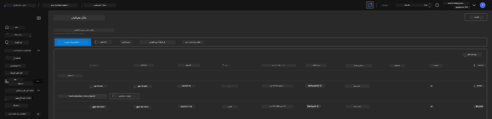
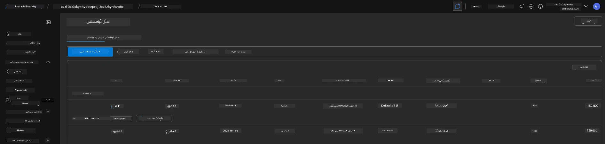

# 6. انفراسٹرکچر کا خاتمہ

!!! tip "اس ماڈیول کے آخر تک آپ یہ کر سکیں گے"

    - [ ] وسائل کی صفائی اور لاگت کے انتظام کی اہمیت کو سمجھنا
    - [ ] انفراسٹرکچر کو محفوظ طریقے سے ختم کرنے کے لیے `azd down` کا استعمال کرنا
    - [ ] ضرورت پڑنے پر نرم حذف شدہ Cognitive خدمات کی بحالی
    - [ ] **لیب 6:** Azure وسائل کی صفائی اور ان کے خاتمے کی تصدیق کرنا

---

## اضافی مشقیں

پروجیکٹ ختم کرنے سے پہلے، چند منٹ نکال کر کچھ آزادانہ دریافت کریں۔

!!! info "ان کھوج کے اشارے آزمایں"

    **GitHub Copilot کے ساتھ تجربہ کریں:**
    
    1. پوچھیں: `کئی ایجنٹ منظرناموں کے لیے میں کون سے دوسرے AZD ٹیمپلیٹس آزما سکتا ہوں؟`
    2. پوچھیں: `میں صحت کی دیکھ بھال کے استعمال کے کیس کے لیے ایجنٹ ہدایات کس طرح حسب ضرورت بنا سکتا ہوں؟`
    3. پوچھیں: `کون سے ماحول کے متغیرات لاگت کے بہتر انتظام کو کنٹرول کرتے ہیں؟`
    
    **Azure پورٹل کو دریافت کریں:**
    
    1. اپنی تعیناتی کے لیے Application Insights میٹرکس کا جائزہ لیں
    2. فراہم کردہ وسائل کی لاگت کا تجزیہ چیک کریں
    3. Microsoft Foundry پورٹل ایجنٹ پلے گراؤنڈ کو ایک بار پھر دریافت کریں

---

## انفراسٹرکچر کا خاتمہ

1. انفراسٹرکچر ختم کرنا اتنا ہی آسان ہے جتنا:
      
      ```bash title="" linenums="0"
      azd down --purge
      ```
1. `--purge` فلیگ اس بات کو یقینی بناتا ہے کہ یہ نرم حذف شدہ Cognitive Service وسائل کو بھی ختم کرے، جس سے ان وسائل کے قبضے میں موجود کوٹا آزاد ہو جاتا ہے۔ مکمل ہونے پر آپ کو کچھ اس طرح کا منظر نظر آئے گا:
      
      ```bash title="" linenums="0"
      ? Total resources to delete: 11, are you sure you want to continue? Yes
      Deleting your resources can take some time.
      (✓) Done: Deleted resource group rg-nitya-mshack-azd
      (✓) Done: Purging Cognitive Account: aoai-3cz3zkynhvpbc

      SUCCESS: Your application was removed from Azure in 11 minutes 4 seconds.
      ```

1. (اختیاری) اگر آپ اب دوبارہ `azd up` چلائیں، تو آپ دیکھیں گے کہ gpt-4.1 ماڈل تعینات ہو جاتا ہے کیونکہ ماحول کا متغیر مقامی `.azure` فولڈر میں تبدیل (اور محفوظ) کیا گیا تھا۔

      یہاں تعینات ماڈل پہلے:

      

      اور یہاں یہ بعد میں ہے:
      

---

<!-- CO-OP TRANSLATOR DISCLAIMER START -->
**دستاویزی اشعار**:  
یہ دستاویز AI ترجمہ سروس [Co-op Translator](https://github.com/Azure/co-op-translator) کے ذریعے ترجمہ کی گئی ہے۔ اگرچہ ہم درستگی کے لیے کوشاں ہیں، براہ کرم جان لیں کہ خودکار تراجم میں غلطیاں یا نقائص ہو سکتے ہیں۔ اصل دستاویز اپنی مادری زبان میں معتبر ذریعہ سمجھی جانی چاہیے۔ اہم معلومات کے لیے پیشہ ور انسانی ترجمہ کی سفارش کی جاتی ہے۔ اس ترجمہ کے استعمال سے پیدا ہونے والی کسی بھی غلط فہمی یا غلط تشریح کی ذمہ داری ہم پر نہیں ہو گی۔
<!-- CO-OP TRANSLATOR DISCLAIMER END -->