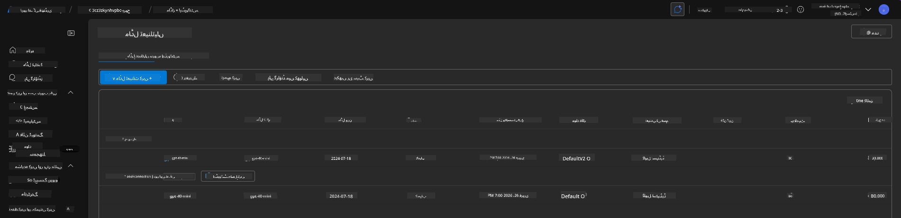

<!--
CO_OP_TRANSLATOR_METADATA:
{
  "original_hash": "6539a34c770f3ceff282370d72ee74dc",
  "translation_date": "2025-09-24T12:06:21+00:00",
  "source_file": "workshop/docs/instructions/6-Teardown-Infrastructure.md",
  "language_code": "ur"
}
-->
# 6. انفراسٹرکچر ختم کریں

!!! tip "اس ماڈیول کے اختتام تک آپ یہ کرنے کے قابل ہوں گے"

    - [ ] آئٹم
    - [ ] آئٹم
    - [ ] آئٹم

---

## اضافی مشقیں

پروجیکٹ ختم کرنے سے پہلے، کچھ وقت نکال کر کھلی تحقیق کریں۔

!!! danger "NITYA-TODO: کچھ تجاویز فراہم کریں"

---

## انفراسٹرکچر ختم کریں

1. انفراسٹرکچر ختم کرنا اتنا آسان ہے:

      ```bash title="" linenums="0"
      azd down --purge
      ```
1. `--purge` فلیگ اس بات کو یقینی بناتا ہے کہ یہ نرم حذف شدہ Cognitive Service وسائل کو بھی ختم کرے، اس طرح ان وسائل کے ذریعے رکھی گئی کوٹہ کو آزاد کرتا ہے۔ مکمل ہونے کے بعد آپ کو کچھ اس طرح نظر آئے گا:

      ```bash title="" linenums="0"
      ? Total resources to delete: 11, are you sure you want to continue? Yes
      Deleting your resources can take some time.
      (✓) Done: Deleted resource group rg-nitya-mshack-azd
      (✓) Done: Purging Cognitive Account: aoai-3cz3zkynhvpbc

      SUCCESS: Your application was removed from Azure in 11 minutes 4 seconds.
      ```

1. (اختیاری) اگر آپ اب `azd up` دوبارہ چلائیں، تو آپ دیکھیں گے کہ gpt-4.1 ماڈل تعینات ہو جاتا ہے کیونکہ ماحول کا متغیر تبدیل (اور محفوظ) کیا گیا تھا مقامی `.azure` فولڈر میں۔

      یہاں ماڈل کی تعیناتیاں **پہلے** ہیں:

      

      اور یہ **بعد میں** ہے:
      

---

