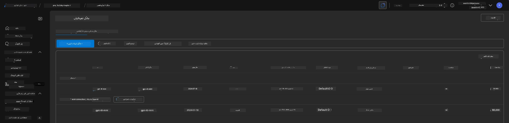
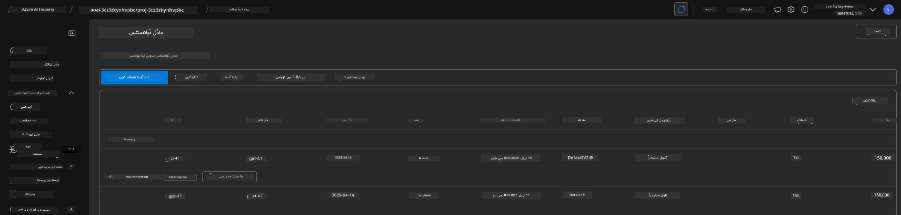

# 6. انفراسٹرکچر کو ختم کرنا

!!! tip "اس ماڈیول کے اختتام تک آپ قابل ہو جائیں گے"

    - [ ] وسائل کی صفائی اور لاگت کے انتظام کی اہمیت کو سمجھنا
    - [ ] `azd down` کا استعمال کرتے ہوئے انفراسٹرکچر کو محفوظ طریقے سے ختم کرنا
    - [ ] اگر ضرورت ہو تو نرم حذف شدہ Azure AI سروسز کی بازیابی کرنا
    - [ ] **لیب 6:** Azure وسائل کی صفائی اور ہٹانے کی تصدیق کرنا

---

## اضافی مشقیں

پروجیکٹ ختم کرنے سے پہلے، چند منٹ نکال کر کچھ کھلے تحقیقاتی کام کریں۔

!!! info "ان دریافت کرنے والے سوالات کو آزمائیں"

    **GitHub Copilot کے ساتھ تجربہ کریں:**
    
    1. پوچھیں: `کون سے دیگر AZD ٹیمپلیٹس میں میں ملٹی ایجنٹ کے مناظر کے لیے آزما سکتا ہوں؟`
    2. پوچھیں: `ہیلتھ کیئر کے استعمال کے کیس کے لیے ایجنٹ کی ہدایات کو کس طرح حسب ضرورت بنا سکتا ہوں؟`
    3. پوچھیں: `کس ماحول کے متغیرات لاگت کے بہتر انتظام کو کنٹرول کرتے ہیں؟`
    
    **Azure پورٹل کو دریافت کریں:**
    
    1. اپنے ڈیپلائمنٹ کے Application Insights میٹرکس کا جائزہ لیں
    2. فراہم کیے گئے وسائل کی لاگت کا تجزیہ چیک کریں
    3. Microsoft Foundry پورٹل ایجنٹ پلے گراؤنڈ کو ایک بار پھر دریافت کریں

---

## انفراسٹرکچر کو ختم کرنا

1. انفراسٹرکچر کو ختم کرنا اتنا ہی آسان ہے جتنا:

      ```bash title="" linenums="0"
      azd down --purge
      ```
1. `--purge` فلیگ اس بات کو یقینی بناتا ہے کہ یہ نرم طور پر حذف شدہ Cognitive Service وسائل کو بھی صاف کر دیتا ہے، جس سے ان وسائل کی کیوٹا جاری ہو جاتی ہے۔ مکمل ہونے کے بعد آپ کو کچھ ایسا نظر آئے گا:

      ```bash title="" linenums="0"
      ? Total resources to delete: 11, are you sure you want to continue? Yes
      Deleting your resources can take some time.
      (✓) Done: Deleted resource group rg-nitya-mshack-azd
      (✓) Done: Purging Cognitive Account: aoai-3cz3zkynhvpbc

      SUCCESS: Your application was removed from Azure in 11 minutes 4 seconds.
      ```

1. (اختیاری) اگر آپ اب دوبارہ `azd up` چلائیں تو آپ دیکھیں گے کہ gpt-4.1 ماڈل ڈیپلائے ہو جائے گا کیونکہ ماحول کا متغیر لوکل `.azure` فولڈر میں تبدیل (اور محفوظ) کیا گیا تھا۔

      یہاں ماڈل کی ڈیپلائمنٹس **قبل**:

      

      اور یہاں یہ ہے **بعد**:
      

---

<!-- CO-OP TRANSLATOR DISCLAIMER START -->
**ڈس کلیمر**:
یہ دستاویز AI ترجمہ سروس [Co-op Translator](https://github.com/Azure/co-op-translator) کے ذریعے ترجمہ کی گئی ہے۔ جبکہ ہم درستگی کے لیے کوشاں ہیں، براہ کرم اس بات سے آگاہ رہیں کہ خودکار ترجمے میں غلطیاں یا عدم درستیاں ہو سکتی ہیں۔ اصل دستاویز اپنے مادری زبان میں مستند ماخذ سمجھی جائے گی۔ حساس معلومات کے لیے پیشہ ور انسانی ترجمہ کی سفارش کی جاتی ہے۔ اس ترجمے کے استعمال سے پیدا ہونے والی کسی بھی غلط فہمی یا غلط تشریح کی ذمہ داری ہم قبول نہیں کرتے۔
<!-- CO-OP TRANSLATOR DISCLAIMER END -->