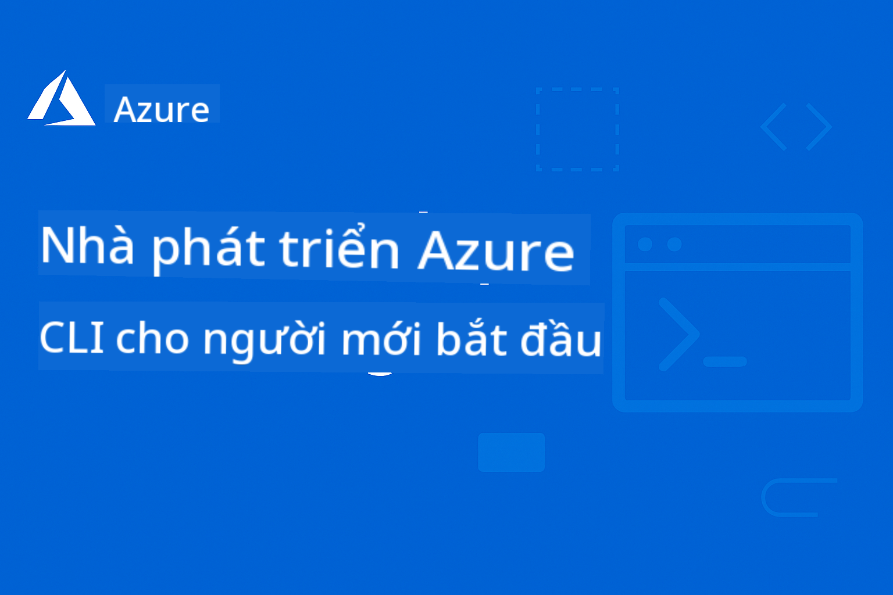

<!--
CO_OP_TRANSLATOR_METADATA:
{
  "original_hash": "6c3d0f9ef66c2cd692a55a2811d9c3e5",
  "translation_date": "2025-09-15T15:21:55+00:00",
  "source_file": "README.md",
  "language_code": "vi"
}
-->
# AZD Cho Người Mới Bắt Đầu

 

[](https://GitHub.com/microsoft/azd-for-beginners/watchers/)
[](https://GitHub.com/microsoft/azd-for-beginners/network/)
[](https://GitHub.com/microsoft/azd-for-beginners/stargazers/)

[](https://discord.gg/microsoft-azure)

[](https://discord.gg/kzRShWzttr)

Hãy làm theo các bước sau để bắt đầu sử dụng các tài nguyên này:
1. **Fork Repository**: Nhấn vào [](https://GitHub.com/microsoft/azd-for-beginners/fork)
2. **Clone Repository**:   `git clone https://github.com/microsoft/azd-for-beginners.git`
3. [**Tham gia cộng đồng Azure Discord để gặp gỡ các chuyên gia và nhà phát triển khác**](https://discord.com/invite/ByRwuEEgH4)

### Hỗ Trợ Đa Ngôn Ngữ

#### Được hỗ trợ qua GitHub Action (Tự động & Luôn cập nhật)

[French](../fr/README.md) | [Spanish](../es/README.md) | [German](../de/README.md) | [Russian](../ru/README.md) | [Arabic](../ar/README.md) | [Persian (Farsi)](../fa/README.md) | [Urdu](../ur/README.md) | [Chinese (Simplified)](../zh/README.md) | [Chinese (Traditional, Macau)](../mo/README.md) | [Chinese (Traditional, Hong Kong)](../hk/README.md) | [Chinese (Traditional, Taiwan)](../tw/README.md) | [Japanese](../ja/README.md) | [Korean](../ko/README.md) | [Hindi](../hi/README.md) | [Bengali](../bn/README.md) | [Marathi](../mr/README.md) | [Nepali](../ne/README.md) | [Punjabi (Gurmukhi)](../pa/README.md) | [Portuguese (Portugal)](../pt/README.md) | [Portuguese (Brazil)](../br/README.md) | [Italian](../it/README.md) | [Polish](../pl/README.md) | [Turkish](../tr/README.md) | [Greek](../el/README.md) | [Thai](../th/README.md) | [Swedish](../sv/README.md) | [Danish](../da/README.md) | [Norwegian](../no/README.md) | [Finnish](../fi/README.md) | [Dutch](../nl/README.md) | [Hebrew](../he/README.md) | [Vietnamese](./README.md) | [Indonesian](../id/README.md) | [Malay](../ms/README.md) | [Tagalog (Filipino)](../tl/README.md) | [Swahili](../sw/README.md) | [Hungarian](../hu/README.md) | [Czech](../cs/README.md) | [Slovak](../sk/README.md) | [Romanian](../ro/README.md) | [Bulgarian](../bg/README.md) | [Serbian (Cyrillic)](../sr/README.md) | [Croatian](../hr/README.md) | [Slovenian](../sl/README.md) | [Ukrainian](../uk/README.md) | [Burmese (Myanmar)](../my/README.md)

**Nếu bạn muốn hỗ trợ thêm các ngôn ngữ khác, danh sách các ngôn ngữ được hỗ trợ có thể được tìm thấy [tại đây](https://github.com/Azure/co-op-translator/blob/main/getting_started/supported-languages.md)**

## Giới Thiệu

Chào mừng bạn đến với hướng dẫn toàn diện về Azure Developer CLI (azd). Repository này được thiết kế để giúp các nhà phát triển ở mọi cấp độ, từ sinh viên đến các nhà phát triển chuyên nghiệp, học và làm chủ Azure Developer CLI để triển khai đám mây hiệu quả, **đặc biệt tập trung vào triển khai ứng dụng AI sử dụng Azure AI Foundry**. Tài nguyên học tập có cấu trúc này cung cấp trải nghiệm thực hành với triển khai đám mây Azure, khắc phục các vấn đề thường gặp, và áp dụng các phương pháp tốt nhất để triển khai mẫu AZD thành công.

### **Tại Sao Hướng Dẫn Này Quan Trọng Đối Với Các Nhà Phát Triển AI**
Dựa trên cuộc khảo sát gần đây trong cộng đồng Discord Azure AI Foundry, **45% nhà phát triển quan tâm đến việc sử dụng AZD cho các khối lượng công việc AI** nhưng gặp khó khăn với:
- Kiến trúc AI đa dịch vụ phức tạp
- Các phương pháp tốt nhất để triển khai AI trong môi trường sản xuất
- Tích hợp và cấu hình dịch vụ Azure AI
- Tối ưu hóa chi phí cho khối lượng công việc AI
- Khắc phục sự cố triển khai AI cụ thể

## Mục Tiêu Học Tập

Khi làm việc qua repository này, bạn sẽ:
- Làm chủ các khái niệm cơ bản và cốt lõi của Azure Developer CLI
- Học cách triển khai và cung cấp tài nguyên Azure bằng Infrastructure as Code
- Phát triển kỹ năng khắc phục sự cố cho các vấn đề triển khai AZD thường gặp
- Hiểu kiểm tra trước triển khai và lập kế hoạch dung lượng
- Áp dụng các phương pháp bảo mật và chiến lược tối ưu hóa chi phí
- Tự tin triển khai các ứng dụng sẵn sàng cho sản xuất lên Azure

## Kết Quả Học Tập

Sau khi hoàn thành khóa học này, bạn sẽ có thể:
- Cài đặt, cấu hình, và sử dụng Azure Developer CLI thành công
- Tạo và triển khai ứng dụng bằng các mẫu AZD
- Khắc phục sự cố xác thực, hạ tầng, và triển khai
- Thực hiện kiểm tra trước triển khai bao gồm lập kế hoạch dung lượng và lựa chọn SKU
- Áp dụng các phương pháp tốt nhất về giám sát, bảo mật, và quản lý chi phí
- Tích hợp quy trình làm việc AZD vào các pipeline CI/CD

## Mục Lục

- [Azure Developer CLI là gì?](../..)
- [Bắt Đầu Nhanh](../..)
- [Lộ Trình Học Tập](../..)
  - [Dành Cho Nhà Phát Triển AI (Khuyến Nghị Bắt Đầu Tại Đây!)](../..)
  - [Dành Cho Sinh Viên & Người Mới Bắt Đầu](../..)
  - [Dành Cho Nhà Phát Triển](../..)
  - [Dành Cho Kỹ Sư DevOps](../..)
- [Tài Liệu](../..)
  - [Bắt Đầu](../..)
  - [Triển Khai & Cung Cấp](../..)
  - [Kiểm Tra Trước Triển Khai](../..)
  - [AI & Azure AI Foundry](../..)
  - [Khắc Phục Sự Cố](../..)
- [Ví Dụ & Mẫu](../..)
  - [Nổi Bật: Mẫu Azure AI Foundry](../..)
  - [Nổi Bật: Kịch Bản E2E Azure AI Foundry](../..)
  - [Mẫu AZD Bổ Sung](../..)
  - [Phòng Thực Hành & Hội Thảo](../..)
- [Tài Nguyên](../..)
- [Đóng Góp](../..)
- [Hỗ Trợ](../..)
- [Cộng Đồng](../..)

## Azure Developer CLI là gì?

Azure Developer CLI (azd) là giao diện dòng lệnh tập trung vào nhà phát triển, giúp tăng tốc quá trình xây dựng và triển khai ứng dụng lên Azure. Nó cung cấp:

- **Triển khai dựa trên mẫu** - Sử dụng các mẫu được xây dựng sẵn cho các mẫu ứng dụng phổ biến
- **Infrastructure as Code** - Quản lý tài nguyên Azure bằng Bicep hoặc Terraform
- **Quy trình làm việc tích hợp** - Cung cấp, triển khai, và giám sát ứng dụng một cách liền mạch
- **Thân thiện với nhà phát triển** - Tối ưu hóa cho năng suất và trải nghiệm của nhà phát triển

### **AZD + Azure AI Foundry: Hoàn Hảo Cho Triển Khai AI**

**Tại Sao AZD Cho Giải Pháp AI?** AZD giải quyết các thách thức hàng đầu mà các nhà phát triển AI gặp phải:

- **Mẫu Sẵn Sàng Cho AI** - Các mẫu được cấu hình trước cho Azure OpenAI, Cognitive Services, và khối lượng công việc ML
- **Triển Khai AI An Toàn** - Các mẫu bảo mật tích hợp cho dịch vụ AI, khóa API, và điểm cuối mô hình
- **Mẫu AI Sản Xuất** - Các phương pháp tốt nhất cho triển khai ứng dụng AI có khả năng mở rộng và chi phí hiệu quả
- **Quy Trình AI Từ Đầu Đến Cuối** - Từ phát triển mô hình đến triển khai sản xuất với giám sát phù hợp
- **Tối Ưu Chi Phí** - Chiến lược phân bổ và mở rộng tài nguyên thông minh cho khối lượng công việc AI
- **Tích Hợp Azure AI Foundry** - Kết nối liền mạch với danh mục mô hình và điểm cuối của AI Foundry

## Bắt Đầu Nhanh

### Yêu Cầu
- Tài khoản Azure subscription
- Azure CLI đã được cài đặt
- Git (để clone các mẫu)

### Cài Đặt
```bash
# Windows (PowerShell)
powershell -ex AllSigned -c "Invoke-RestMethod 'https://aka.ms/install-azd.ps1' | Invoke-Expression"

# macOS/Linux
curl -fsSL https://aka.ms/install-azd.sh | bash
```

### Triển Khai Đầu Tiên
```bash
# Initialize a new project
azd init --template todo-nodejs-mongo

# Provision Azure resources and deploy
azd up
```

### Triển Khai AI Đầu Tiên
```bash
# Initialize an AI-powered chat application with Azure OpenAI
azd init --template azure-search-openai-demo

# Configure AI services and deploy
azd up

# Or try other AI templates:
azd init --template openai-chat-app-quickstart
azd init --template ai-document-processing
azd init --template contoso-chat
```

## Lộ Trình Học Tập

### Dành Cho Nhà Phát Triển AI (Khuyến Nghị Bắt Đầu Tại Đây!)
1. **Bắt Đầu Nhanh**: Thử mẫu [azure-search-openai-demo](https://github.com/Azure-Samples/azure-search-openai-demo)
2. **Học Các Khái Niệm Cơ Bản**: [AZD Basics](docs/getting-started/azd-basics.md) + [Azure AI Foundry Integration](docs/ai-foundry/azure-ai-foundry-integration.md)
3. **Thực Hành Thực Tế**: Hoàn thành [AI Workshop Lab](docs/ai-foundry/ai-workshop-lab.md)
4. **Sẵn Sàng Cho Sản Xuất**: Xem lại [Production AI Best Practices](docs/ai-foundry/production-ai-practices.md)
5. **Nâng Cao**: Triển khai mẫu doanh nghiệp [contoso-chat](https://github.com/Azure-Samples/contoso-chat)

### Dành Cho Sinh Viên & Người Mới Bắt Đầu
1. Bắt đầu với [AZD Basics](docs/getting-started/azd-basics.md)
2. Làm theo [Hướng Dẫn Cài Đặt](docs/getting-started/installation.md)
3. Hoàn thành [Dự Án Đầu Tiên](docs/getting-started/first-project.md)
4. Thực hành với [Ví Dụ Ứng Dụng Web Đơn Giản](../../examples/simple-web-app)

### Dành Cho Nhà Phát Triển
1. Xem lại [Hướng Dẫn Cấu Hình](docs/getting-started/configuration.md)
2. Nghiên cứu [Hướng Dẫn Triển Khai](docs/deployment/deployment-guide.md)
3. Làm việc qua [Ví Dụ Ứng Dụng Cơ Sở Dữ Liệu](../../examples/database-app)
4. Khám phá [Ví Dụ Ứng Dụng Container](../../examples/container-app)

### Dành Cho Kỹ Sư DevOps
1. Làm chủ [Cung Cấp Tài Nguyên](docs/deployment/provisioning.md)
2. Thực hiện [Kiểm Tra Trước Triển Khai](docs/pre-deployment/preflight-checks.md)
3. Thực hành [Lập Kế Hoạch Dung Lượng](docs/pre-deployment/capacity-planning.md)
4. Nâng cao với [Ví Dụ Microservices](../../examples/microservices)

## Tài Liệu

### Bắt Đầu
- [**AZD Basics**](docs/getting-started/azd-basics.md) - Các khái niệm và thuật ngữ cốt lõi
- [**Cài Đặt & Thiết Lập**](docs/getting-started/installation.md) - Hướng dẫn cài đặt theo nền tảng
- [**Cấu Hình**](docs/getting-started/configuration.md) - Thiết lập môi trường và xác thực
- [**Dự Án Đầu Tiên**](docs/getting-started/first-project.md) - Hướng dẫn từng bước

### Triển Khai & Cung Cấp
- [**Hướng Dẫn Triển Khai**](docs/deployment/deployment-guide.md) - Quy trình triển khai hoàn chỉnh
- [**Cung Cấp Tài Nguyên**](docs/deployment/provisioning.md) - Quản lý tài nguyên Azure

### Kiểm Tra Trước Triển Khai
- [**Lập Kế Hoạch Dung Lượng**](docs/pre-deployment/capacity-planning.md) - Xác thực dung lượng tài nguyên Azure
- [**Lựa Chọn SKU**](docs/pre-deployment/sku-selection.md) - Chọn SKU Azure phù hợp
- [**Kiểm Tra Trước Triển Khai**](docs/pre-deployment/preflight-checks.md) - Các script xác thực tự động

### AI & Azure AI Foundry
- [**Tích Hợp Azure AI Foundry**](docs/ai-foundry/azure-ai-foundry-integration.md) - Kết nối AZD với các dịch vụ Azure AI Foundry
- [**Mẫu Triển Khai Mô Hình AI**](docs/ai-foundry/ai-model-deployment.md) - Triển khai và quản lý mô hình AI với AZD
- [**AI Workshop Lab**](docs/ai-foundry/ai-workshop-lab.md) - Phòng thực hành: Làm cho giải pháp AI sẵn sàng với AZD
- [**Các Phương Pháp Tốt Nhất Cho AI Sản Xuất**](docs/ai-foundry/production-ai-practices.md) - Bảo mật, mở rộng, và giám sát cho khối lượng công việc AI

### Khắc Phục Sự Cố
- [**Các Vấn Đề Thường Gặp**](docs/troubleshooting/common-issues.md) - Các vấn đề thường gặp và giải pháp
- [**Hướng dẫn gỡ lỗi**](docs/troubleshooting/debugging.md) - Chiến lược gỡ lỗi từng bước
- [**Khắc phục sự cố liên quan đến AI**](docs/troubleshooting/ai-troubleshooting.md) - Các vấn đề về dịch vụ AI và triển khai mô hình

## Ví dụ & Mẫu

### [Nổi bật: Mẫu Azure AI Foundry](https://ai.azure.com/resource/build/templates)
**Bắt đầu tại đây nếu bạn đang triển khai ứng dụng AI!**

| Mẫu | Mô tả | Độ phức tạp | Dịch vụ |
|----------|-------------|------------|----------|
| [**Bắt đầu với AI chat**](https://github.com/Azure-Samples/get-started-with-ai-chat) | Tạo và triển khai ứng dụng chat cơ bản tích hợp với dữ liệu và thông tin giám sát của bạn bằng Azure Container Apps |⭐⭐ | AzureOpenAI + Azure AI Model Inference API + Azure AI Search + Azure Container Apps + Application Insights |
| [**Bắt đầu với AI agents**](https://github.com/Azure-Samples/get-started-with-ai-agents) | Tạo và triển khai ứng dụng agent cơ bản với các hành động và thông tin giám sát bằng Azure Container Apps. |⭐⭐ | Azure AI Agent Service + AzureOpenAI + Azure AI Search + Azure Container Apps + Application Insights|
| [**Tự động hóa quy trình đa-agent**](https://github.com/Azure-Samples/get-started-with-ai-chat) | Nâng cao lập kế hoạch và tự động hóa nhiệm vụ bằng cách điều phối và quản lý nhóm các AI agents.|⭐⭐⭐ | AzureOpenAI + Azure AI Agent Service + Semantic Kernel + Azure CosmosDB + Azure Container Apps|
| [**Tạo tài liệu từ dữ liệu của bạn**](https://github.com/Azure-Samples/get-started-with-ai-chat) | Tăng tốc tạo tài liệu như hợp đồng, hóa đơn và đề xuất đầu tư bằng cách tìm kiếm và tóm tắt thông tin liên quan từ dữ liệu của bạn. |⭐⭐⭐  | AzureOpenAI + Azure AI Search + Azure AI Services + Azure CosmosDB|
| [**Cải thiện cuộc họp khách hàng với agents**](https://github.com/Azure-Samples/get-started-with-ai-chat) | Di chuyển mã legacy sang ngôn ngữ hiện đại bằng cách tận dụng nhóm các agents. |⭐⭐⭐| AzureOpenAI + Azure AI Search + Azure CosmosDB + Azure SQL Database |
| [**Hiện đại hóa mã của bạn với agents**](https://github.com/Azure-Samples/get-started-with-ai-chat) | Tạo và triển khai ứng dụng chat cơ bản tích hợp với dữ liệu và thông tin giám sát của bạn bằng Azure Container Apps |⭐⭐⭐ | AzureOpenAI + Azure Agent Service + Semantic Kernel + Azure CosmosDB + Azure Container Apps|
| [**Xây dựng agent hội thoại của bạn**](https://github.com/Azure-Samples/get-started-with-ai-chat) | Tận dụng khả năng hiểu hội thoại nâng cao để tạo và cải thiện chatbot và agents với quy trình làm việc có thể kiểm soát bởi con người. |⭐⭐⭐ | AI Language + AzureOpenAI + AI Search + Azure Storage + Azure Container Registry|
| [**Khám phá thông tin từ dữ liệu hội thoại**](https://github.com/Azure-Samples/get-started-with-ai-chat) | Cải thiện hiệu quả trung tâm liên lạc bằng cách khám phá thông tin từ các tập dữ liệu âm thanh và văn bản lớn sử dụng khả năng hiểu nội dung nâng cao. |⭐⭐⭐ | AzureOpenAI + AI Search + Semantic Kernel + Azure Agent Service + AI AI Content Understanding|
| [**Xử lý nội dung đa phương tiện**](https://github.com/Azure-Samples/get-started-with-ai-chat) | Xử lý yêu cầu, hóa đơn, hợp đồng và các tài liệu khác nhanh chóng và chính xác bằng cách trích xuất thông tin từ nội dung không có cấu trúc và ánh xạ nó sang định dạng có cấu trúc. Mẫu này hỗ trợ văn bản, hình ảnh, bảng và biểu đồ. |⭐⭐⭐⭐ | AzureOpenAI + Azure Content Understanding + Azure CosmosDB + Azure Container Apps|

### Nổi bật: Các kịch bản E2E của Azure AI Foundry
**Bắt đầu tại đây nếu bạn đang triển khai ứng dụng AI!**

| Mẫu | Mô tả | Độ phức tạp | Dịch vụ |
|----------|-------------|------------|----------|
| [**openai-chat-app-quickstart**](https://github.com/Azure-Samples/openai-chat-app-quickstart) | Giao diện chat đơn giản với Azure OpenAI | ⭐ | AzureOpenAI + Container Apps |
| [**azure-search-openai-demo**](https://github.com/Azure-Samples/azure-search-openai-demo) | Ứng dụng chat hỗ trợ RAG với Azure OpenAI | ⭐⭐ | AzureOpenAI + Search + App Service |
| [**ai-document-processing**](https://github.com/Azure-Samples/ai-document-processing) | Phân tích tài liệu với các dịch vụ AI | ⭐⭐ | Azure Document Intelligence + Functions |
| [**agent-openai-python-prompty**](https://github.com/Azure-Samples/agent-openai-python-prompty) | Framework AI agent với chức năng gọi | ⭐⭐⭐ | AzureOpenAI + Azure Container Apps + Functions |
| [**contoso-chat**](https://github.com/Azure-Samples/contoso-chat) | Chat doanh nghiệp với điều phối AI | ⭐⭐⭐ | AzureOpenAI + Azure AI Search + Container Apps |

### Các mẫu AZD bổ sung
- [**Thư mục ví dụ**](examples/README.md) - Các ví dụ thực tế, mẫu và kịch bản thực tế
- [**Mẫu AZD của Azure-Samples**](https://github.com/Azure-Samples/azd-templates) - Mẫu chính thức của Microsoft  
- [**Thư viện AZD tuyệt vời**](https://azure.github.io/awesome-azd/) - Các mẫu đóng góp từ cộng đồng

### Phòng thí nghiệm thực hành & Hội thảo
- [**Phòng thí nghiệm hội thảo AI**](docs/ai-foundry/ai-workshop-lab.md) - **MỚI**: Làm cho giải pháp AI của bạn có thể triển khai bằng AZD
- [**Hội thảo AZD cho người mới bắt đầu**](workshop/README.md) - Tập trung vào triển khai mẫu AZD cho AI Agents

## Tài nguyên

### Tham khảo nhanh
- [**Bảng lệnh Cheat Sheet**](resources/cheat-sheet.md) - Các lệnh azd thiết yếu
- [**Thuật ngữ**](resources/glossary.md) - Thuật ngữ Azure và azd
- [**Câu hỏi thường gặp**](resources/faq.md) - Các câu hỏi thường gặp
- [**Hướng dẫn học tập**](resources/study-guide.md) - Mục tiêu học tập toàn diện và bài tập thực hành

### Tài nguyên bên ngoài
- [Tài liệu CLI dành cho nhà phát triển Azure](https://learn.microsoft.com/en-us/azure/developer/azure-developer-cli/)
- [Trung tâm Kiến trúc Azure](https://learn.microsoft.com/en-us/azure/architecture/)
- [Máy tính giá Azure](https://azure.microsoft.com/pricing/calculator/)
- [Trạng thái Azure](https://status.azure.com/)

## Đóng góp

Chúng tôi hoan nghênh các đóng góp! Vui lòng đọc [Hướng dẫn đóng góp](CONTRIBUTING.md) để biết chi tiết về:
- Cách gửi vấn đề và yêu cầu tính năng
- Hướng dẫn đóng góp mã
- Cải thiện tài liệu
- Tiêu chuẩn cộng đồng

## Hỗ trợ

- **Vấn đề**: [Báo cáo lỗi và yêu cầu tính năng](https://github.com/microsoft/azd-for-beginners/issues)
- **Thảo luận**: [Cộng đồng Discord Microsoft Azure - Hỏi đáp và thảo luận](https://discord.gg/microsoft-azure)
- **Hỗ trợ liên quan đến AI**: Tham gia [kênh #Azure](https://discord.gg/microsoft-azure) để thảo luận về AZD + AI Foundry
- **Email**: Đối với các câu hỏi riêng tư
- **Microsoft Learn**: [Tài liệu chính thức về Azure Developer CLI](https://learn.microsoft.com/en-us/azure/developer/azure-developer-cli/)

### Thông tin từ cộng đồng Discord Azure AI Foundry

**Kết quả khảo sát từ kênh #Azure:**
- **45%** nhà phát triển muốn sử dụng AZD cho khối lượng công việc AI
- **Thách thức hàng đầu**: Triển khai nhiều dịch vụ, quản lý thông tin xác thực, sẵn sàng cho sản xuất
- **Yêu cầu nhiều nhất**: Mẫu cụ thể cho AI, hướng dẫn khắc phục sự cố, thực tiễn tốt nhất

**Tham gia cộng đồng của chúng tôi để:**
- Chia sẻ kinh nghiệm AZD + AI của bạn và nhận hỗ trợ
- Truy cập sớm các mẫu AI mới
- Đóng góp vào thực tiễn triển khai AI tốt nhất
- Ảnh hưởng đến sự phát triển tính năng AI + AZD trong tương lai

## Giấy phép

Dự án này được cấp phép theo Giấy phép MIT - xem tệp [LICENSE](../../LICENSE) để biết chi tiết.

## Các khóa học khác

Nhóm của chúng tôi sản xuất các khóa học khác! Hãy xem:

- [**MỚI** Giao thức ngữ cảnh mô hình (MCP) cho người mới bắt đầu](https://github.com/microsoft/mcp-for-beginners?WT.mc_id=academic-105485-koreyst)
- [AI Agents cho người mới bắt đầu](https://github.com/microsoft/ai-agents-for-beginners?WT.mc_id=academic-105485-koreyst)
- [Generative AI cho người mới bắt đầu sử dụng .NET](https://github.com/microsoft/Generative-AI-for-beginners-dotnet?WT.mc_id=academic-105485-koreyst)
- [Generative AI cho người mới bắt đầu](https://github.com/microsoft/generative-ai-for-beginners?WT.mc_id=academic-105485-koreyst)
- [Generative AI cho người mới bắt đầu sử dụng Java](https://github.com/microsoft/generative-ai-for-beginners-java?WT.mc_id=academic-105485-koreyst)
- [ML cho người mới bắt đầu](https://aka.ms/ml-beginners?WT.mc_id=academic-105485-koreyst)
- [Khoa học dữ liệu cho người mới bắt đầu](https://aka.ms/datascience-beginners?WT.mc_id=academic-105485-koreyst)
- [AI cho người mới bắt đầu](https://aka.ms/ai-beginners?WT.mc_id=academic-105485-koreyst)
- [An ninh mạng cho người mới bắt đầu](https://github.com/microsoft/Security-101??WT.mc_id=academic-96948-sayoung)
- [Phát triển web cho người mới bắt đầu](https://aka.ms/webdev-beginners?WT.mc_id=academic-105485-koreyst)
- [IoT cho người mới bắt đầu](https://aka.ms/iot-beginners?WT.mc_id=academic-105485-koreyst)
- [Phát triển XR cho người mới bắt đầu](https://github.com/microsoft/xr-development-for-beginners?WT.mc_id=academic-105485-koreyst)
- [Làm chủ GitHub Copilot cho lập trình cặp AI](https://aka.ms/GitHubCopilotAI?WT.mc_id=academic-105485-koreyst)
- [Làm chủ GitHub Copilot cho nhà phát triển C#/.NET](https://github.com/microsoft/mastering-github-copilot-for-dotnet-csharp-developers?WT.mc_id=academic-105485-koreyst)
- [Chọn cuộc phiêu lưu Copilot của riêng bạn](https://github.com/microsoft/CopilotAdventures?WT.mc_id=academic-105485-koreyst)

---

**Điều hướng**
- **Bài học tiếp theo**: [Cơ bản về AZD](docs/getting-started/azd-basics.md)

---

**Tuyên bố miễn trừ trách nhiệm**:  
Tài liệu này đã được dịch bằng dịch vụ dịch thuật AI [Co-op Translator](https://github.com/Azure/co-op-translator). Mặc dù chúng tôi cố gắng đảm bảo độ chính xác, xin lưu ý rằng các bản dịch tự động có thể chứa lỗi hoặc không chính xác. Tài liệu gốc bằng ngôn ngữ bản địa nên được coi là nguồn thông tin chính thức. Đối với các thông tin quan trọng, nên sử dụng dịch vụ dịch thuật chuyên nghiệp từ con người. Chúng tôi không chịu trách nhiệm cho bất kỳ sự hiểu lầm hoặc diễn giải sai nào phát sinh từ việc sử dụng bản dịch này.