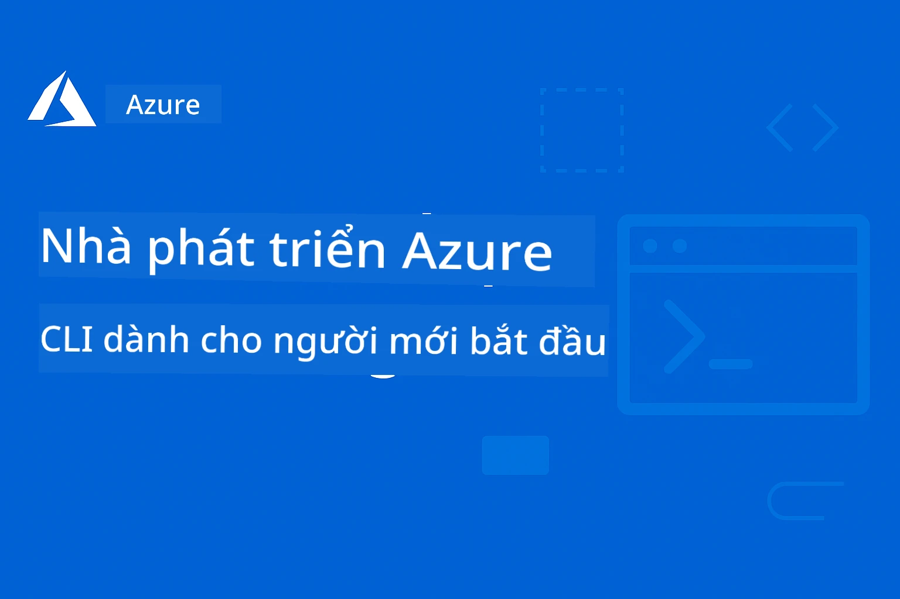

# AZD Cho Người Mới Bắt Đầu: Hành Trình Học Tập Có Cấu Trúc

 

[](https://GitHub.com/microsoft/azd-for-beginners/watchers/)
[](https://GitHub.com/microsoft/azd-for-beginners/network/)
[](https://GitHub.com/microsoft/azd-for-beginners/stargazers/)

[](https://discord.gg/microsoft-azure)
[](https://discord.gg/nTYy5BXMWG)

## Bắt Đầu Với Khóa Học Này

Thực hiện các bước sau để bắt đầu hành trình học AZD của bạn:

1. **Tạo Fork Kho Mã**: Nhấn [](https://GitHub.com/microsoft/azd-for-beginners/fork)
2. **Sao Chép Kho Mã Về Máy**: `git clone https://github.com/microsoft/azd-for-beginners.git`
3. **Tham Gia Cộng Đồng**: [Azure Discord Communities](https://discord.com/invite/ByRwuEEgH4) để được hỗ trợ chuyên gia
4. **Chọn Lộ Trình Học**: Chọn chương bên dưới phù hợp với trình độ kinh nghiệm của bạn

### Hỗ Trợ Đa Ngôn Ngữ

#### Dịch Tự Động (Luôn Cập Nhật)

<!-- CO-OP TRANSLATOR LANGUAGES TABLE START -->
[Arabic](../ar/README.md) | [Bengali](../bn/README.md) | [Bulgarian](../bg/README.md) | [Burmese (Myanmar)](../my/README.md) | [Chinese (Simplified)](../zh-CN/README.md) | [Chinese (Traditional, Hong Kong)](../zh-HK/README.md) | [Chinese (Traditional, Macau)](../zh-MO/README.md) | [Chinese (Traditional, Taiwan)](../zh-TW/README.md) | [Croatian](../hr/README.md) | [Czech](../cs/README.md) | [Danish](../da/README.md) | [Dutch](../nl/README.md) | [Estonian](../et/README.md) | [Finnish](../fi/README.md) | [French](../fr/README.md) | [German](../de/README.md) | [Greek](../el/README.md) | [Hebrew](../he/README.md) | [Hindi](../hi/README.md) | [Hungarian](../hu/README.md) | [Indonesian](../id/README.md) | [Italian](../it/README.md) | [Japanese](../ja/README.md) | [Kannada](../kn/README.md) | [Korean](../ko/README.md) | [Lithuanian](../lt/README.md) | [Malay](../ms/README.md) | [Malayalam](../ml/README.md) | [Marathi](../mr/README.md) | [Nepali](../ne/README.md) | [Nigerian Pidgin](../pcm/README.md) | [Norwegian](../no/README.md) | [Persian (Farsi)](../fa/README.md) | [Polish](../pl/README.md) | [Portuguese (Brazil)](../pt-BR/README.md) | [Portuguese (Portugal)](../pt-PT/README.md) | [Punjabi (Gurmukhi)](../pa/README.md) | [Romanian](../ro/README.md) | [Russian](../ru/README.md) | [Serbian (Cyrillic)](../sr/README.md) | [Slovak](../sk/README.md) | [Slovenian](../sl/README.md) | [Spanish](../es/README.md) | [Swahili](../sw/README.md) | [Swedish](../sv/README.md) | [Tagalog (Filipino)](../tl/README.md) | [Tamil](../ta/README.md) | [Telugu](../te/README.md) | [Thai](../th/README.md) | [Turkish](../tr/README.md) | [Ukrainian](../uk/README.md) | [Urdu](../ur/README.md) | [Vietnamese](./README.md)

> **Muốn Sao Chép Local?**

> Kho mã này bao gồm hơn 50 bản dịch ngôn ngữ, làm tăng đáng kể kích thước tải xuống. Để sao chép không có bản dịch, sử dụng sparse checkout:
> ```bash
> git clone --filter=blob:none --sparse https://github.com/microsoft/AZD-for-beginners.git
> cd AZD-for-beginners
> git sparse-checkout set --no-cone '/*' '!translations' '!translated_images'
> ```
> Điều này cung cấp cho bạn mọi thứ cần thiết để hoàn thành khóa học với tốc độ tải nhanh hơn nhiều.
<!-- CO-OP TRANSLATOR LANGUAGES TABLE END -->

## Tổng Quan Khóa Học

Làm chủ Azure Developer CLI (azd) qua các chương có cấu trúc được thiết kế để học tiến bộ. **Tập trung đặc biệt vào triển khai ứng dụng AI với tích hợp Microsoft Foundry.**

### Tại Sao Khóa Học Này Quan Trọng Với Lập Trình Viên Hiện Đại

Dựa trên thông tin từ cộng đồng Microsoft Foundry Discord, **45% lập trình viên muốn sử dụng AZD cho các khối lượng công việc AI** nhưng gặp phải những thách thức về:
- Kiến trúc AI đa dịch vụ phức tạp
- Thực tiễn triển khai AI trong môi trường sản xuất  
- Tích hợp và cấu hình dịch vụ Azure AI
- Tối ưu chi phí cho khối lượng công việc AI
- Khắc phục sự cố triển khai AI đặc thù

### Mục Tiêu Học Tập

Hoàn thành khóa học có cấu trúc này, bạn sẽ:
- **Thành thạo Cơ Bản AZD**: Các khái niệm chính, cài đặt và cấu hình
- **Triển khai Ứng Dụng AI**: Sử dụng AZD với dịch vụ Microsoft Foundry
- **Thực Thi Hạ Tầng Như Mã**: Quản lý tài nguyên Azure với mẫu Bicep
- **Khắc Phục Sự Cố Triển Khai**: Giải quyết các vấn đề thường gặp và gỡ lỗi
- **Tối Ưu Cho Sản Xuất**: Bảo mật, mở rộng, giám sát, quản lý chi phí
- **Xây Dựng Giải Pháp Đa Tác Nhân**: Triển khai kiến trúc AI phức tạp

## 📚 Các Chương Học

*Chọn lộ trình học phù hợp với trình độ và mục tiêu của bạn*

### 🚀 Chương 1: Nền Tảng & Bắt Đầu Nhanh
**Điều Kiện Tiên Quyết**: Có đăng ký Azure, biết cơ bản về dòng lệnh  
**Thời Lượng**: 30-45 phút  
**Độ Phức Tạp**: ⭐

#### Những Gì Bạn Sẽ Học
- Hiểu các nguyên lý cơ bản của Azure Developer CLI
- Cài đặt AZD trên nền tảng của bạn
- Triển khai thành công dự án đầu tiên

#### Tài Nguyên Học Tập
- **🎯 Bắt Đầu Tại Đây**: [Azure Developer CLI là gì?](../..)
- **📖 Lý Thuyết**: [AZD Cơ Bản](docs/getting-started/azd-basics.md) - Khái niệm và thuật ngữ chủ đạo
- **⚙️ Thiết Lập**: [Cài đặt & Thiết lập](docs/getting-started/installation.md) - Hướng dẫn theo nền tảng
- **🛠️ Thực Hành**: [Dự Án Đầu Tiên](docs/getting-started/first-project.md) - Hướng dẫn từng bước
- **📋 Tham Khảo Nhanh**: [Bảng Lệnh Tóm Tắt](resources/cheat-sheet.md)

#### Bài Tập Thực Hành
```bash
# Kiểm tra cài đặt nhanh
azd version

# Triển khai ứng dụng đầu tiên của bạn
azd init --template todo-nodejs-mongo
azd up
```

**💡 Kết Quả Chương**: Triển khai thành công ứng dụng web đơn giản lên Azure dùng AZD

**✅ Xác Nhận Thành Công:**
```bash
# Sau khi hoàn thành Chương 1, bạn sẽ có thể:
azd version              # Hiển thị phiên bản đã cài đặt
azd init --template todo-nodejs-mongo  # Khởi tạo dự án
azd up                  # Triển khai lên Azure
azd show                # Hiển thị URL ứng dụng đang chạy
# Ứng dụng mở trong trình duyệt và hoạt động
azd down --force --purge  # Dọn dẹp tài nguyên
```

**📊 Thời Gian Đầu Tư:** 30-45 phút  
**📈 Trình Độ Sau Khi Học:** Có thể triển khai ứng dụng cơ bản một cách độc lập

**✅ Xác Nhận Thành Công:**
```bash
# Sau khi hoàn thành Chương 1, bạn sẽ có thể:
azd version              # Hiển thị phiên bản đã cài đặt
azd init --template todo-nodejs-mongo  # Khởi tạo dự án
azd up                  # Triển khai lên Azure
azd show                # Hiển thị URL ứng dụng đang chạy
# Ứng dụng mở trong trình duyệt và hoạt động
azd down --force --purge  # Dọn dẹp các tài nguyên
```

**📊 Thời Gian Đầu Tư:** 30-45 phút  
**📈 Trình Độ Sau Khi Học:** Có thể triển khai ứng dụng cơ bản một cách độc lập

---

### 🤖 Chương 2: Phát Triển AI-Đầu Tiên (Khuyến Khích cho Nhà Phát Triển AI)
**Điều Kiện Tiên Quyết**: Hoàn thành Chương 1  
**Thời Lượng**: 1-2 giờ  
**Độ Phức Tạp**: ⭐⭐

#### Những Gì Bạn Sẽ Học
- Tích hợp Microsoft Foundry với AZD
- Triển khai ứng dụng dựa trên AI
- Hiểu cấu hình dịch vụ AI

#### Tài Nguyên Học Tập
- **🎯 Bắt Đầu Tại Đây**: [Tích hợp Microsoft Foundry](docs/microsoft-foundry/microsoft-foundry-integration.md)
- **📖 Mẫu**: [Triển khai Mô hình AI](docs/microsoft-foundry/ai-model-deployment.md) - Triển khai và quản lý mô hình AI
- **🛠️ Xưởng Thực Hành**: [Xưởng AI](docs/microsoft-foundry/ai-workshop-lab.md) - Chuẩn bị giải pháp AI sẵn sàng dùng AZD
- **🎥 Hướng Dẫn Tương Tác**: [Tài liệu Xưởng](workshop/README.md) - Học qua trình duyệt với môi trường MkDocs * DevContainer
- **📋 Mẫu Code**: [Mẫu Microsoft Foundry](../..)
- **📝 Ví Dụ**: [Ví dụ Triển Khai AZD](examples/README.md)

#### Bài Tập Thực Hành
```bash
# Triển khai ứng dụng AI đầu tiên của bạn
azd init --template azure-search-openai-demo
azd up

# Thử các mẫu AI bổ sung
azd init --template openai-chat-app-quickstart
azd init --template agent-openai-python-prompty
```

**💡 Kết Quả Chương**: Triển khai và cấu hình ứng dụng chat AI có tính năng RAG

**✅ Xác Nhận Thành Công:**
```bash
# Sau Chương 2, bạn sẽ có thể:
azd init --template azure-search-openai-demo
azd up
# Thử nghiệm giao diện trò chuyện AI
# Đặt câu hỏi và nhận phản hồi có sức mạnh từ AI cùng với nguồn tham khảo
# Xác minh tích hợp tìm kiếm hoạt động
azd monitor  # Kiểm tra Application Insights hiển thị dữ liệu điều khiển từ xa
azd down --force --purge
```

**📊 Thời Gian Đầu Tư:** 1-2 giờ  
**📈 Trình Độ Sau Khi Học:** Có thể triển khai và cấu hình ứng dụng AI sẵn sàng sản xuất  
**💰 Ý Thức Chi Phí:** Hiểu chi phí phát triển $80-150/tháng, chi phí sản xuất $300-3500/tháng

#### 💰 Cân Nhắc Chi Phí Cho Triển Khai AI

**Môi Trường Phát Triển (Ước Tính $80-150/tháng):**
- Azure OpenAI (Trả tiền theo sử dụng): $0-50/tháng (theo token dùng)
- AI Search (Cấp độ cơ bản): $75/tháng
- Container Apps (Tiêu thụ): $0-20/tháng
- Lưu trữ (Chuẩn): $1-5/tháng

**Môi Trường Sản Xuất (Ước Tính $300-3,500+/tháng):**
- Azure OpenAI (PTU cho hiệu suất ổn định): $3,000+/tháng HOẶC trạm trả tiền dùng với khối lượng lớn
- AI Search (Cấp độ tiêu chuẩn): $250/tháng
- Container Apps (Dành riêng): $50-100/tháng
- Application Insights: $5-50/tháng
- Lưu trữ (Cao cấp): $10-50/tháng

**💡 Mẹo Tối Ưu Chi Phí:**
- Dùng **Cấp Miễn Phí** Azure OpenAI để học (bao gồm 50,000 tokens/tháng)
- Dùng lệnh `azd down` để giải phóng tài nguyên khi không phát triển
- Bắt đầu với cách trả tiền theo tiêu thụ, nâng cấp lên PTU chỉ cho sản xuất
- Dùng `azd provision --preview` để ước tính chi phí trước khi triển khai
- Bật tự động mở rộng: chỉ trả phí theo sử dụng thực tế

**Giám Sát Chi Phí:**
```bash
# Kiểm tra chi phí ước tính hàng tháng
azd provision --preview

# Giám sát chi phí thực tế trong Azure Portal
az consumption budget list --resource-group <your-rg>
```

---

### ⚙️ Chương 3: Cấu Hình & Xác Thực
**Điều Kiện Tiên Quyết**: Hoàn thành Chương 1  
**Thời Lượng**: 45-60 phút  
**Độ Phức Tạp**: ⭐⭐

#### Những Gì Bạn Sẽ Học
- Cấu hình và quản lý môi trường
- Xác thực và thực hành bảo mật tốt nhất
- Đặt tên và tổ chức tài nguyên

#### Tài Nguyên Học Tập
- **📖 Cấu Hình**: [Hướng Dẫn Cấu Hình](docs/getting-started/configuration.md) - Thiết lập môi trường
- **🔐 Bảo Mật**: [Mẫu xác thực và managed identity](docs/getting-started/authsecurity.md) - Mẫu xác thực
- **📝 Ví Dụ**: [Ví dụ ứng dụng cơ sở dữ liệu](examples/database-app/README.md) - Ví dụ cơ sở dữ liệu AZD

#### Bài Tập Thực Hành
- Cấu hình nhiều môi trường (dev, staging, prod)
- Thiết lập xác thực managed identity
- Triển khai cấu hình riêng cho từng môi trường

**💡 Kết Quả Chương**: Quản lý nhiều môi trường với xác thực và bảo mật đúng chuẩn

---

### 🏗️ Chương 4: Hạ Tầng Như Mã & Triển Khai
**Điều Kiện Tiên Quyết**: Hoàn thành Chương 1-3  
**Thời Lượng**: 1-1.5 giờ  
**Độ Phức Tạp**: ⭐⭐⭐

#### Những Gì Bạn Sẽ Học
- Các mẫu triển khai nâng cao
- Hạ tầng như mã với Bicep
- Chiến lược cung cấp tài nguyên

#### Tài Nguyên Học Tập
- **📖 Triển Khai**: [Hướng dẫn triển khai](docs/deployment/deployment-guide.md) - Quy trình tổng thể
- **🏗️ Cung Cấp**: [Cung cấp tài nguyên](docs/deployment/provisioning.md) - Quản lý tài nguyên Azure
- **📝 Ví Dụ**: [Ví dụ Container App](../../examples/container-app) - Triển khai container hóa

#### Bài Tập Thực Hành
- Tạo mẫu Bicep tùy chỉnh
- Triển khai ứng dụng đa dịch vụ
- Thực hiện chiến lược triển khai xanh-lục (blue-green deployment)

**💡 Kết Quả Chương**: Triển khai ứng dụng đa dịch vụ phức tạp dùng mẫu hạ tầng tùy chỉnh

---

### 🎯 Chương 5: Giải Pháp AI Đa Tác Nhân (Nâng Cao)
**Điều Kiện Tiên Quyết**: Hoàn thành Chương 1-2  
**Thời Lượng**: 2-3 giờ  
**Độ Phức Tạp**: ⭐⭐⭐⭐
#### Những gì bạn sẽ học
- Các mẫu kiến trúc đa tác nhân
- Điều phối và phối hợp tác nhân
- Triển khai AI sẵn sàng cho sản xuất

#### Tài nguyên học tập
- **🤖 Dự án nổi bật**: [Giải pháp đa tác nhân bán lẻ](examples/retail-scenario.md) - Triển khai hoàn chỉnh
- **🛠️ Mẫu ARM**: [Gói Mẫu ARM](../../examples/retail-multiagent-arm-template) - Triển khai chỉ với một cú nhấp
- **📖 Kiến trúc**: [Mẫu phối hợp đa tác nhân](/docs/pre-deployment/coordination-patterns.md) - Các mẫu

#### Bài tập thực hành
```bash
# Triển khai giải pháp đa tác nhân bán lẻ hoàn chỉnh
cd examples/retail-multiagent-arm-template
./deploy.sh

# Khám phá cấu hình tác nhân
az deployment group show --resource-group <rg-name> --name <deployment-name>
```

**💡 Kết quả chương**: Triển khai và quản lý một giải pháp AI đa tác nhân sẵn sàng cho sản xuất với các tác nhân Khách hàng và Kho hàng

---

### 🔍 Chương 6: Kiểm tra & Lập kế hoạch trước khi triển khai
**Yêu cầu trước**: Hoàn thành Chương 4  
**Thời lượng**: 1 giờ  
**Độ phức tạp**: ⭐⭐

#### Những gì bạn sẽ học
- Lập kế hoạch năng lực và kiểm tra tài nguyên
- Chiến lược lựa chọn SKU
- Kiểm tra tiền bay và tự động hóa

#### Tài nguyên học tập
- **📊 Lập kế hoạch**: [Lập kế hoạch năng lực](docs/pre-deployment/capacity-planning.md) - Kiểm tra tài nguyên
- **💰 Lựa chọn**: [Lựa chọn SKU](docs/pre-deployment/sku-selection.md) - Lựa chọn tiết kiệm chi phí
- **✅ Kiểm tra**: [Kiểm tra tiền bay](docs/pre-deployment/preflight-checks.md) - Tập lệnh tự động

#### Bài tập thực hành
- Chạy các tập lệnh kiểm tra năng lực
- Tối ưu lựa chọn SKU để tiết kiệm chi phí
- Triển khai kiểm tra tự động trước khi triển khai

**💡 Kết quả chương**: Xác thực và tối ưu hóa các lần triển khai trước khi thực hiện

---

### 🚨 Chương 7: Xử lý sự cố & Gỡ lỗi
**Yêu cầu trước**: Hoàn thành bất kỳ chương triển khai nào  
**Thời lượng**: 1-1.5 giờ  
**Độ phức tạp**: ⭐⭐

#### Những gì bạn sẽ học
- Phương pháp gỡ lỗi có hệ thống
- Các sự cố phổ biến và giải pháp
- Xử lý sự cố đặc thù AI

#### Tài nguyên học tập
- **🔧 Các vấn đề phổ biến**: [Các vấn đề phổ biến](docs/troubleshooting/common-issues.md) - Hỏi đáp và giải pháp
- **🕵️ Gỡ lỗi**: [Hướng dẫn gỡ lỗi](docs/troubleshooting/debugging.md) - Chiến lược từng bước
- **🤖 Vấn đề AI**: [Xử lý sự cố AI đặc thù](docs/troubleshooting/ai-troubleshooting.md) - Sự cố dịch vụ AI

#### Bài tập thực hành
- Chẩn đoán lỗi triển khai
- Giải quyết các vấn đề xác thực
- Gỡ lỗi kết nối dịch vụ AI

**💡 Kết quả chương**: Chẩn đoán và giải quyết độc lập các sự cố triển khai phổ biến

---

### 🏢 Chương 8: Mẫu sản xuất & Doanh nghiệp
**Yêu cầu trước**: Hoàn thành các chương 1-4  
**Thời lượng**: 2-3 giờ  
**Độ phức tạp**: ⭐⭐⭐⭐

#### Những gì bạn sẽ học
- Chiến lược triển khai sản xuất
- Mẫu bảo mật doanh nghiệp
- Giám sát và tối ưu chi phí

#### Tài nguyên học tập
- **🏭 Sản xuất**: [Thực hành AI sản xuất tốt nhất](docs/microsoft-foundry/production-ai-practices.md) - Mẫu doanh nghiệp
- **📝 Ví dụ**: [Ví dụ Microservices](../../examples/microservices) - Kiến trúc phức tạp
- **📊 Giám sát**: [Tích hợp Application Insights](docs/pre-deployment/application-insights.md) - Giám sát

#### Bài tập thực hành
- Triển khai mẫu bảo mật doanh nghiệp
- Thiết lập giám sát toàn diện
- Triển khai sản xuất với quản trị chuẩn xác

**💡 Kết quả chương**: Triển khai ứng dụng sẵn sàng cho doanh nghiệp với đầy đủ khả năng sản xuất

---

## 🎓 Tổng quan Workshop: Trải nghiệm học thực hành

> **⚠️ TRẠNG THÁI WORKSHOP: Đang phát triển**  
> Tài liệu workshop hiện đang được phát triển và hoàn thiện. Các module cốt lõi đã hoạt động, một số phần nâng cao chưa hoàn chỉnh. Chúng tôi đang nỗ lực để hoàn tất toàn bộ nội dung. [Theo dõi tiến độ →](workshop/README.md)

### Tài liệu Workshop tương tác
**Trải nghiệm học thực hành toàn diện với công cụ trình duyệt và bài tập có hướng dẫn**

Tài liệu workshop của chúng tôi cung cấp một trải nghiệm học tương tác có cấu trúc, bổ trợ cho chương trình dựa trên các chương bên trên. Workshop thiết kế cho cả học tự học và giảng viên hướng dẫn.

#### 🛠️ Tính năng Workshop
- **Giao diện trình duyệt**: Workshop hoàn chỉnh chạy trên MkDocs với chức năng tìm kiếm, sao chép, và chủ đề
- **Tích hợp GitHub Codespaces**: Thiết lập môi trường phát triển chỉ với một cú nhấp
- **Lộ trình học có cấu trúc**: 7 bước bài tập hướng dẫn (tổng 3.5 giờ)
- **Khám phá → Triển khai → Tùy chỉnh**: Phương pháp tiến dần
- **Môi trường DevContainer tương tác**: Công cụ và phụ thuộc được cấu hình sẵn

#### 📚 Cấu trúc Workshop
Workshop theo phương pháp **Khám phá → Triển khai → Tùy chỉnh**:

1. **Giai đoạn Khám phá** (45 phút)
   - Khám phá mẫu và dịch vụ Microsoft Foundry
   - Hiểu các mẫu kiến trúc đa tác nhân
   - Xem xét yêu cầu và điều kiện triển khai

2. **Giai đoạn Triển khai** (2 giờ)
   - Triển khai ứng dụng AI thực hành với AZD
   - Cấu hình dịch vụ Azure AI và các điểm cuối
   - Triển khai mẫu bảo mật và xác thực

3. **Giai đoạn Tùy chỉnh** (45 phút)
   - Chỉnh sửa ứng dụng cho use case cụ thể
   - Tối ưu cho triển khai sản xuất
   - Triển khai giám sát và quản lý chi phí

#### 🚀 Bắt đầu với Workshop
```bash
# Lựa chọn 1: GitHub Codespaces (Khuyến nghị)
# Nhấp "Code" → "Create codespace on main" trong kho lưu trữ

# Lựa chọn 2: Phát triển cục bộ
git clone https://github.com/microsoft/azd-for-beginners.git
cd azd-for-beginners/workshop
# Làm theo hướng dẫn thiết lập trong workshop/README.md
```

#### 🎯 Kết quả học tập Workshop
Hoàn thành workshop, người học sẽ:
- **Triển khai ứng dụng AI sản xuất**: Sử dụng AZD với dịch vụ Microsoft Foundry
- **Thành thạo kiến trúc đa tác nhân**: Triển khai giải pháp tác nhân AI phối hợp
- **Áp dụng thực hành bảo mật tốt nhất**: Cấu hình xác thực và kiểm soát truy cập
- **Tối ưu quy mô**: Thiết kế triển khai tiết kiệm chi phí, hiệu suất cao
- **Xử lý sự cố triển khai**: Giải quyết sự cố phổ biến độc lập

#### 📖 Tài nguyên Workshop
- **🎥 Hướng dẫn tương tác**: [Tài liệu Workshop](workshop/README.md) - Môi trường học trên trình duyệt
- **📋 Hướng dẫn từng bước**: [Bài tập hướng dẫn](../../workshop/docs/instructions) - Hướng dẫn chi tiết
- **🛠️ Phòng lab AI Workshop**: [Phòng lab AI Workshop](docs/microsoft-foundry/ai-workshop-lab.md) - Bài tập tập trung AI
- **💡 Bắt đầu nhanh**: [Hướng dẫn thiết lập Workshop](workshop/README.md#quick-start) - Cấu hình môi trường

**Phù hợp với**: Đào tạo doanh nghiệp, khóa học đại học, tự học, và bootcamp phát triển.

---

## 📖 Azure Developer CLI là gì?

Azure Developer CLI (azd) là giao diện dòng lệnh tập trung vào nhà phát triển, giúp đẩy nhanh quá trình xây dựng và triển khai ứng dụng lên Azure. Nó cung cấp:

- **Triển khai dựa trên mẫu** - Dùng mẫu dựng sẵn cho các kiểu ứng dụng phổ biến
- **Hạ tầng dưới dạng mã** - Quản lý tài nguyên Azure bằng Bicep hoặc Terraform  
- **Quy trình tích hợp** - Cấp phát, triển khai và giám sát ứng dụng liền mạch
- **Thân thiện với nhà phát triển** - Tối ưu năng suất và trải nghiệm phát triển

### **AZD + Microsoft Foundry: Hoàn hảo cho triển khai AI**

**Tại sao chọn AZD cho giải pháp AI?** AZD giải quyết các thách thức hàng đầu mà nhà phát triển AI gặp phải:

- **Mẫu sẵn sàng AI** - Mẫu cấu hình sẵn cho Azure OpenAI, Cognitive Services, và workload ML
- **Bảo mật triển khai AI** - Mẫu bảo mật tích hợp cho dịch vụ AI, khóa API và điểm cuối mô hình  
- **Mẫu AI sản xuất** - Thực hành tốt nhất cho triển khai ứng dụng AI mở rộng, tiết kiệm chi phí
- **Quy trình AI toàn diện** - Từ phát triển mô hình đến triển khai sản xuất có giám sát đúng cách
- **Tối ưu chi phí** - Phân bổ tài nguyên thông minh và chiến lược mở rộng cho workload AI
- **Tích hợp Microsoft Foundry** - Kết nối liền mạch với danh mục mô hình và điểm cuối Microsoft Foundry

---

## 🎯 Thư viện Mẫu & Ví dụ

### Nổi bật: Mẫu Microsoft Foundry
**Bắt đầu từ đây nếu bạn triển khai ứng dụng AI!**

> **Lưu ý:** Các mẫu này minh họa các mẫu AI khác nhau. Một số là Azure Samples bên ngoài, số khác là triển khai nội bộ.

| Mẫu | Chương | Độ phức tạp | Dịch vụ | Loại |
|----------|---------|------------|----------|------|
| [**Bắt đầu với AI chat**](https://github.com/Azure-Samples/get-started-with-ai-chat) | Chương 2 | ⭐⭐ | AzureOpenAI + Azure AI Model Inference API + Azure AI Search + Azure Container Apps + Application Insights | Bên ngoài |
| [**Bắt đầu với tác nhân AI**](https://github.com/Azure-Samples/get-started-with-ai-agents) | Chương 2 | ⭐⭐ | Azure AI Agent Service + AzureOpenAI + Azure AI Search + Azure Container Apps + Application Insights| Bên ngoài |
| [**Demo Azure Search + OpenAI**](https://github.com/Azure-Samples/azure-search-openai-demo) | Chương 2 | ⭐⭐ | AzureOpenAI + Azure AI Search + App Service + Storage | Bên ngoài |
| [**OpenAI Chat App Quickstart**](https://github.com/Azure-Samples/openai-chat-app-quickstart) | Chương 2 | ⭐ | AzureOpenAI + Container Apps + Application Insights | Bên ngoài |
| [**Agent OpenAI Python Prompty**](https://github.com/Azure-Samples/agent-openai-python-prompty) | Chương 5 | ⭐⭐⭐ | AzureOpenAI + Azure Functions + Prompty | Bên ngoài |
| [**Contoso Chat RAG**](https://github.com/Azure-Samples/contoso-chat) | Chương 8 | ⭐⭐⭐⭐ | AzureOpenAI + AI Search + Cosmos DB + Container Apps | Bên ngoài |
| [**Giải pháp đa tác nhân bán lẻ**](examples/retail-scenario.md) | Chương 5 | ⭐⭐⭐⭐ | AzureOpenAI + AI Search + Storage + Container Apps + Cosmos DB | **Nội bộ** |

### Nổi bật: Kịch bản học tập hoàn chỉnh
**Mẫu ứng dụng sẵn sàng sản xuất tương ứng với các chương học**

| Mẫu | Chương học | Độ phức tạp | Nội dung chính |
|----------|------------------|------------|--------------|
| [**openai-chat-app-quickstart**](https://github.com/Azure-Samples/openai-chat-app-quickstart) | Chương 2 | ⭐ | Mẫu triển khai AI cơ bản |
| [**azure-search-openai-demo**](https://github.com/Azure-Samples/azure-search-openai-demo) | Chương 2 | ⭐⭐ | Triển khai RAG với Azure AI Search |
| [**ai-document-processing**](https://github.com/Azure-Samples/ai-document-processing) | Chương 4 | ⭐⭐ | Tích hợp Trí tuệ tài liệu |
| [**agent-openai-python-prompty**](https://github.com/Azure-Samples/agent-openai-python-prompty) | Chương 5 | ⭐⭐⭐ | Framework tác nhân và gọi hàm |
| [**contoso-chat**](https://github.com/Azure-Samples/contoso-chat) | Chương 8 | ⭐⭐⭐ | Điều phối AI doanh nghiệp |
| [**retail-multi-agent-solution**](examples/retail-scenario.md) | Chương 5 | ⭐⭐⭐⭐ | Kiến trúc đa tác nhân với tác nhân Khách hàng và Kho hàng |

### Học qua loại ví dụ

> **📌 Ví dụ Nội bộ vs. Bên ngoài:**  
> **Ví dụ Nội bộ** (trong repo này) = Sẵn sàng sử dụng ngay  
> **Ví dụ Bên ngoài** (Azure Samples) = Clone từ repo liên kết

#### Ví dụ Nội bộ (Sẵn sàng sử dụng)
- [**Giải pháp đa tác nhân bán lẻ**](examples/retail-scenario.md) - Triển khai hoàn chỉnh sẵn sàng sản xuất cùng mẫu ARM
  - Kiến trúc đa tác nhân (Tác nhân Khách hàng + Kho hàng)
  - Giám sát toàn diện và đánh giá
  - Triển khai nhanh với mẫu ARM một cú nhấp

#### Ví dụ Nội bộ - Ứng dụng Container (Chương 2-5)
**Ví dụ triển khai container đầy đủ trong repo này:**
- [**Ví dụ Container App**](examples/container-app/README.md) - Hướng dẫn triển khai container hoàn chỉnh
  - [API Flask đơn giản](../../examples/container-app/simple-flask-api) - API REST cơ bản với tính năng scale-to-zero
  - [Kiến trúc Microservices](../../examples/container-app/microservices) - Triển khai đa dịch vụ sẵn sàng sản xuất
  - Các mẫu Quick Start, Production, và nâng cao
  - Hướng dẫn giám sát, bảo mật, và tối ưu chi phí

#### Ví dụ Bên ngoài - Ứng dụng đơn giản (Chương 1-2)
**Clone các repo Azure Samples sau để bắt đầu:**
- [Ứng dụng Web đơn giản - Node.js + MongoDB](https://github.com/Azure-Samples/todo-nodejs-mongo) - Mẫu triển khai cơ bản
- [Trang web tĩnh - React SPA](https://github.com/Azure-Samples/todo-csharp-sql-swa-func) - Triển khai nội dung tĩnh
- [Container App - Python Flask](https://github.com/Azure-Samples/container-apps-store-api-microservice) - Triển khai API REST

#### Ví dụ Bên ngoài - Tích hợp cơ sở dữ liệu (Chương 3-4)  
- [Ứng dụng Database - C# + SQL](https://github.com/Azure-Samples/todo-csharp-sql) - Mẫu kết nối cơ sở dữ liệu
- [Functions + Cosmos DB](https://github.com/Azure-Samples/todo-python-mongo-swa-func) - Quy trình dữ liệu serverless

#### Ví dụ Bên ngoài - Mẫu nâng cao (Chương 4-8)
- [Java Microservices](https://github.com/Azure-Samples/java-microservices-aca-lab) - Kiến trúc đa dịch vụ
- [Container Apps Jobs](https://github.com/Azure-Samples/container-apps-jobs) - Xử lý nền  
- [Enterprise ML Pipeline](https://github.com/Azure-Samples/mlops-v2) - Mẫu ML sẵn sàng sản xuất

### Bộ sưu tập mẫu bên ngoài
- [**Bộ sưu tập mẫu AZD chính thức**](https://azure.github.io/awesome-azd/) - Bộ sưu tập mẫu chính thức và cộng đồng được tuyển chọn
- [**Mẫu Azure Developer CLI**](https://learn.microsoft.com/en-us/azure/developer/azure-developer-cli/azd-templates) - Tài liệu mẫu Microsoft Learn
- [**Thư mục Ví dụ**](examples/README.md) - Ví dụ học tập địa phương với giải thích chi tiết

---

## 📚 Tài nguyên & Tham khảo học tập

### Tham khảo nhanh
- [**Bảng tóm tắt lệnh**](resources/cheat-sheet.md) - Các lệnh azd thiết yếu được tổ chức theo chương
- [**Thuật ngữ**](resources/glossary.md) - Thuật ngữ Azure và azd  
- [**Câu hỏi thường gặp**](resources/faq.md) - Các câu hỏi phổ biến được tổ chức theo chương học
- [**Hướng dẫn học**](resources/study-guide.md) - Bài tập thực hành toàn diện

### Workshop thực hành
- [**Phòng thí nghiệm Workshop AI**](docs/microsoft-foundry/ai-workshop-lab.md) - Làm cho các giải pháp AI của bạn có thể triển khai bằng AZD (2-3 giờ)
- [**Hướng dẫn Workshop Tương tác**](workshop/README.md) - Workshop trên trình duyệt với MkDocs và môi trường DevContainer
- [**Lộ trình học tập có cấu trúc**](../../workshop/docs/instructions) - Bài tập hướng dẫn 7 bước (Khám phá → Triển khai → Tùy chỉnh)
- [**Workshop AZD cho người mới bắt đầu**](workshop/README.md) - Tài liệu workshop thực hành đầy đủ tích hợp GitHub Codespaces

### Tài nguyên học bên ngoài
- Tài liệu Azure Developer CLI (https://learn.microsoft.com/en-us/azure/developer/azure-developer-cli/)
- Trung tâm Kiến trúc Azure (https://learn.microsoft.com/en-us/azure/architecture/)
- Bộ tính giá Azure (https://azure.microsoft.com/pricing/calculator/)
- Trạng thái Azure (https://status.azure.com/)

---

## 🔧 Hướng dẫn Khắc phục sự cố Nhanh

**Các vấn đề thường gặp với người mới và giải pháp ngay lập tức:**

### ❌ "azd: command not found"

```bash
# Cài đặt AZD trước
# Windows (PowerShell):
winget install microsoft.azd

# macOS:
brew tap azure/azd && brew install azd

# Linux:
curl -fsSL https://aka.ms/install-azd.sh | bash

# Xác minh cài đặt
azd version
```

### ❌ "Không tìm thấy đăng ký" hoặc "Chưa đặt đăng ký"

```bash
# Liệt kê các đăng ký có sẵn
az account list --output table

# Đặt đăng ký mặc định
az account set --subscription "<subscription-id-or-name>"

# Đặt cho môi trường AZD
azd env set AZURE_SUBSCRIPTION_ID "<subscription-id>"

# Xác minh
az account show
```

### ❌ "InsufficientQuota" hoặc "Quota exceeded" (Hạn mức không đủ hoặc vượt quá)

```bash
# Thử các vùng Azure khác nhau
azd env set AZURE_LOCATION "westus2"
azd up

# Hoặc sử dụng các SKU nhỏ hơn trong phát triển
# Chỉnh sửa infra/main.parameters.json:
{
  "sku": "B1"  // Instead of "P1V2"
}
```

### ❌ "azd up" thất bại nửa chừng

```bash
# Lựa chọn 1: Dọn dẹp và thử lại
azd down --force --purge
azd up

# Lựa chọn 2: Chỉ sửa hạ tầng
azd provision

# Lựa chọn 3: Kiểm tra nhật ký chi tiết
azd show
azd logs
```

### ❌ "Xác thực không thành công" hoặc "Token hết hạn"

```bash
# Xác thực lại
az logout
az login

azd auth logout
azd auth login

# Xác minh xác thực
az account show
```

### ❌ "Tài nguyên đã tồn tại" hoặc xung đột tên

```bash
# AZD tạo ra các tên duy nhất, nhưng nếu có xung đột:
azd down --force --purge

# Sau đó thử lại với môi trường mới
azd env new dev-v2
azd up
```

### ❌ triển khai mẫu mất quá nhiều thời gian

**Thời gian chờ bình thường:**
- Ứng dụng web đơn giản: 5-10 phút
- Ứng dụng có cơ sở dữ liệu: 10-15 phút
- Ứng dụng AI: 15-25 phút (Cung cấp OpenAI chậm)

```bash
# Kiểm tra tiến trình
azd show

# Nếu bị kẹt >30 phút, kiểm tra Azure Portal:
azd monitor
# Tìm các triển khai thất bại
```

### ❌ "Không có quyền" hoặc "Bị cấm"

```bash
# Kiểm tra vai trò Azure của bạn
az role assignment list --assignee $(az account show --query user.name -o tsv)

# Bạn cần ít nhất vai trò "Người đóng góp"
# Yêu cầu quản trị viên Azure của bạn cấp:
# - Người đóng góp (cho các tài nguyên)
# - Quản trị viên truy cập người dùng (cho các phân công vai trò)
```

### ❌ Không tìm thấy URL ứng dụng đã triển khai

```bash
# Hiển thị tất cả các điểm cuối dịch vụ
azd show

# Hoặc mở Cổng thông tin Azure
azd monitor

# Kiểm tra dịch vụ cụ thể
azd env get-values
# Tìm các biến *_URL
```

### 📚 Toàn bộ Tài nguyên Khắc phục sự cố

- **Hướng dẫn các vấn đề thường gặp:** [Giải pháp chi tiết](docs/troubleshooting/common-issues.md)
- **Các vấn đề AI cụ thể:** [Khắc phục sự cố AI](docs/troubleshooting/ai-troubleshooting.md)
- **Hướng dẫn gỡ lỗi:** [Gỡ lỗi từng bước](docs/troubleshooting/debugging.md)
- **Nhận trợ giúp:** [Discord Azure](https://discord.gg/microsoft-azure) #azure-developer-cli

---

## 🔧 Hướng dẫn Khắc phục sự cố Nhanh

**Các vấn đề thường gặp với người mới và giải pháp ngay lập tức:**

<details>
<summary><strong>❌ "azd: command not found"</strong></summary>

```bash
# Cài đặt AZD trước
# Windows (PowerShell):
winget install microsoft.azd

# macOS:
brew tap azure/azd && brew install azd

# Linux:
curl -fsSL https://aka.ms/install-azd.sh | bash

# Xác minh cài đặt
azd version
```
</details>

<details>
<summary><strong>❌ "Không tìm thấy đăng ký" hoặc "Chưa đặt đăng ký"</strong></summary>

```bash
# Liệt kê các đăng ký có sẵn
az account list --output table

# Đặt đăng ký mặc định
az account set --subscription "<subscription-id-or-name>"

# Đặt cho môi trường AZD
azd env set AZURE_SUBSCRIPTION_ID "<subscription-id>"

# Xác minh
az account show
```
</details>

<details>
<summary><strong>❌ "InsufficientQuota" hoặc "Quota exceeded"</strong></summary>

```bash
# Thử các khu vực Azure khác nhau
azd env set AZURE_LOCATION "westus2"
azd up

# Hoặc sử dụng SKU nhỏ hơn trong phát triển
# Chỉnh sửa infra/main.parameters.json:
{
  "sku": "B1"  // Instead of "P1V2"
}
```
</details>

<details>
<summary><strong>❌ "azd up" thất bại nửa chừng</strong></summary>

```bash
# Lựa chọn 1: Dọn dẹp và thử lại
azd down --force --purge
azd up

# Lựa chọn 2: Chỉ sửa hạ tầng
azd provision

# Lựa chọn 3: Kiểm tra nhật ký chi tiết
azd show
azd logs
```
</details>

<details>
<summary><strong>❌ "Xác thực không thành công" hoặc "Token hết hạn"</strong></summary>

```bash
# Xác thực lại
az logout
az login

azd auth logout
azd auth login

# Xác minh xác thực
az account show
```
</details>

<details>
<summary><strong>❌ "Tài nguyên đã tồn tại" hoặc xung đột tên</strong></summary>

```bash
# AZD tạo ra tên duy nhất, nhưng nếu trùng lặp:
azd down --force --purge

# Sau đó thử lại với môi trường mới
azd env new dev-v2
azd up
```
</details>

<details>
<summary><strong>❌ Triển khai mẫu mất quá nhiều thời gian</strong></summary>

**Thời gian chờ bình thường:**
- Ứng dụng web đơn giản: 5-10 phút
- Ứng dụng có cơ sở dữ liệu: 10-15 phút
- Ứng dụng AI: 15-25 phút (Cung cấp OpenAI chậm)

```bash
# Kiểm tra tiến trình
azd show

# Nếu bị kẹt >30 phút, kiểm tra Cổng Azure:
azd monitor
# Tìm các triển khai thất bại
```
</details>

<details>
<summary><strong>❌ "Không có quyền" hoặc "Bị cấm"</strong></summary>

```bash
# Kiểm tra vai trò Azure của bạn
az role assignment list --assignee $(az account show --query user.name -o tsv)

# Bạn cần ít nhất vai trò "Contributor"
# Yêu cầu quản trị viên Azure của bạn cấp:
# - Contributor (cho tài nguyên)
# - User Access Administrator (cho các gán vai trò)
```
</details>

<details>
<summary><strong>❌ Không tìm thấy URL ứng dụng đã triển khai</strong></summary>

```bash
# Hiển thị tất cả các điểm cuối dịch vụ
azd show

# Hoặc mở Cổng Azure
azd monitor

# Kiểm tra dịch vụ cụ thể
azd env get-values
# Tìm các biến *_URL
```
</details>

### 📚 Toàn bộ Tài nguyên Khắc phục sự cố

- **Hướng dẫn các vấn đề thường gặp:** [Giải pháp chi tiết](docs/troubleshooting/common-issues.md)
- **Các vấn đề AI cụ thể:** [Khắc phục sự cố AI](docs/troubleshooting/ai-troubleshooting.md)
- **Hướng dẫn gỡ lỗi:** [Gỡ lỗi từng bước](docs/troubleshooting/debugging.md)
- **Nhận trợ giúp:** [Discord Azure](https://discord.gg/microsoft-azure) #azure-developer-cli

---

## 🎓 Hoàn thành Khóa học & Chứng nhận

### Theo dõi Tiến độ
Theo dõi tiến trình học của bạn qua mỗi chương:

- [ ] **Chương 1**: Nền tảng & Khởi đầu nhanh ✅
- [ ] **Chương 2**: Phát triển AI-Đầu tiên ✅  
- [ ] **Chương 3**: Cấu hình & Xác thực ✅
- [ ] **Chương 4**: Hạ tầng dưới dạng mã & Triển khai ✅
- [ ] **Chương 5**: Giải pháp AI đa tác tử ✅
- [ ] **Chương 6**: Xác nhận & Lập kế hoạch trước triển khai ✅
- [ ] **Chương 7**: Khắc phục sự cố & Gỡ lỗi ✅
- [ ] **Chương 8**: Mô hình Sản xuất & Doanh nghiệp ✅

### Xác minh Học tập
Sau khi hoàn thành mỗi chương, xác minh kiến thức bằng cách:
1. **Bài Tập Thực hành**: Hoàn thành triển khai thực hành của chương
2. **Kiểm Tra Kiến thức**: Xem lại phần FAQ của chương đó
3. **Thảo luận Cộng đồng**: Chia sẻ kinh nghiệm của bạn trên Discord Azure
4. **Chương tiếp theo**: Tiến tới cấp độ phức tạp tiếp theo

### Lợi ích khi Hoàn thành Khóa học
Sau khi hoàn thành tất cả các chương, bạn sẽ có:
- **Kinh nghiệm sản xuất**: Triển khai ứng dụng AI thực tế trên Azure
- **Kỹ năng chuyên nghiệp**: Khả năng triển khai sẵn sàng doanh nghiệp  
- **Công nhận cộng đồng**: Thành viên tích cực của cộng đồng nhà phát triển Azure
- **Thăng tiến sự nghiệp**: Chuyên môn triển khai AZD và AI được săn đón

---

## 🤝 Cộng đồng & Hỗ trợ

### Nhận trợ giúp & Hỗ trợ
- **Vấn đề kỹ thuật**: [Báo lỗi và yêu cầu tính năng](https://github.com/microsoft/azd-for-beginners/issues)
- **Câu hỏi học tập**: [Cộng đồng Discord Microsoft Azure](https://discord.gg/microsoft-azure) và [](https://discord.gg/nTYy5BXMWG)
- **Hỗ trợ AI cụ thể**: Tham gia [](https://discord.gg/nTYy5BXMWG)
- **Tài liệu**: [Tài liệu chính thức Azure Developer CLI](https://learn.microsoft.com/en-us/azure/developer/azure-developer-cli/)

### Thông tin cộng đồng từ Microsoft Foundry Discord

**Kết quả khảo sát gần đây từ kênh #Azure:**
- **45%** nhà phát triển muốn sử dụng AZD cho khối lượng công việc AI
- **Thách thức hàng đầu**: Triển khai đa dịch vụ, quản lý chứng chỉ, sẵn sàng sản xuất  
- **Yêu cầu nhiều nhất**: Mẫu AI riêng biệt, hướng dẫn khắc phục sự cố, các thực hành tốt nhất

**Tham gia cộng đồng chúng tôi để:**
- Chia sẻ kinh nghiệm AZD + AI và nhận trợ giúp
- Truy cập bản xem trước sớm các mẫu AI mới
- Đóng góp các thực hành tốt nhất cho triển khai AI
- Ảnh hưởng đến sự phát triển tính năng AI + AZD trong tương lai

### Đóng góp vào Khóa học
Chúng tôi hoan nghênh các đóng góp! Vui lòng đọc [Hướng dẫn Đóng góp](CONTRIBUTING.md) của chúng tôi để biết chi tiết về:
- **Cải tiến nội dung**: Nâng cao các chương và ví dụ hiện có
- **Ví dụ mới**: Thêm các tình huống thực tế và mẫu  
- **Dịch thuật**: Hỗ trợ duy trì đa ngôn ngữ
- **Báo cáo lỗi**: Cải thiện độ chính xác và rõ ràng
- **Tiêu chuẩn cộng đồng**: Tuân thủ các hướng dẫn cộng đồng bao gồm của chúng tôi

---

## 📄 Thông tin Khóa học

### Giấy phép
Dự án này được cấp phép theo Giấy phép MIT - xem tệp [LICENSE](../../LICENSE) để biết chi tiết.

### Tài nguyên học Microsoft liên quan

Nhóm chúng tôi sản xuất các khóa học học tập toàn diện khác:

<!-- CO-OP TRANSLATOR OTHER COURSES START -->
### LangChain
[](https://aka.ms/langchain4j-for-beginners)
[](https://aka.ms/langchainjs-for-beginners?WT.mc_id=m365-94501-dwahlin)
[](https://github.com/microsoft/langchain-for-beginners?WT.mc_id=m365-94501-dwahlin)
---

### Azure / Edge / MCP / Agents
[](https://github.com/microsoft/AZD-for-beginners?WT.mc_id=academic-105485-koreyst)
[](https://github.com/microsoft/edgeai-for-beginners?WT.mc_id=academic-105485-koreyst)
[](https://github.com/microsoft/mcp-for-beginners?WT.mc_id=academic-105485-koreyst)
[](https://github.com/microsoft/ai-agents-for-beginners?WT.mc_id=academic-105485-koreyst)

---
 
### Chuỗi AI Tạo sinh
[](https://github.com/microsoft/generative-ai-for-beginners?WT.mc_id=academic-105485-koreyst)
[-9333EA?style=for-the-badge&labelColor=E5E7EB&color=9333EA)](https://github.com/microsoft/Generative-AI-for-beginners-dotnet?WT.mc_id=academic-105485-koreyst)
[-C084FC?style=for-the-badge&labelColor=E5E7EB&color=C084FC)](https://github.com/microsoft/generative-ai-for-beginners-java?WT.mc_id=academic-105485-koreyst)
[-E879F9?style=for-the-badge&labelColor=E5E7EB&color=E879F9)](https://github.com/microsoft/generative-ai-with-javascript?WT.mc_id=academic-105485-koreyst)

---
 
### Học tập Cơ bản
[](https://aka.ms/ml-beginners?WT.mc_id=academic-105485-koreyst)
[](https://aka.ms/datascience-beginners?WT.mc_id=academic-105485-koreyst)
[](https://aka.ms/ai-beginners?WT.mc_id=academic-105485-koreyst)
[](https://github.com/microsoft/Security-101?WT.mc_id=academic-96948-sayoung)
[](https://aka.ms/webdev-beginners?WT.mc_id=academic-105485-koreyst)
[](https://aka.ms/iot-beginners?WT.mc_id=academic-105485-koreyst)
[](https://github.com/microsoft/xr-development-for-beginners?WT.mc_id=academic-105485-koreyst)

---
 
### Chuỗi Copilot
[](https://aka.ms/GitHubCopilotAI?WT.mc_id=academic-105485-koreyst)
[](https://github.com/microsoft/mastering-github-copilot-for-dotnet-csharp-developers?WT.mc_id=academic-105485-koreyst)
[](https://github.com/microsoft/CopilotAdventures?WT.mc_id=academic-105485-koreyst)
<!-- CO-OP TRANSLATOR OTHER COURSES END -->

---

## 🗺️ Điều hướng Khóa học

**🚀 Sẵn sàng Bắt đầu Học?**

**Người mới bắt đầu**: Bắt đầu với [Chương 1: Nền tảng & Khởi đầu nhanh](../..)  
**Nhà phát triển AI**: Nhảy đến [Chương 2: Phát triển AI-First](../..)  
**Nhà phát triển có kinh nghiệm**: Bắt đầu với [Chương 3: Cấu hình & Xác thực](../..)

**Bước tiếp theo**: [Bắt đầu Chương 1 - AZD Cơ bản](docs/getting-started/azd-basics.md) →

---

<!-- CO-OP TRANSLATOR DISCLAIMER START -->
**Tuyên bố từ chối trách nhiệm**:
Tài liệu này đã được dịch bằng dịch vụ dịch thuật AI [Co-op Translator](https://github.com/Azure/co-op-translator). Mặc dù chúng tôi cố gắng đảm bảo độ chính xác, xin lưu ý rằng các bản dịch tự động có thể chứa lỗi hoặc không chính xác. Văn bản gốc bằng ngôn ngữ gốc vẫn được xem là nguồn chính xác và có thẩm quyền. Đối với các thông tin quan trọng, nên sử dụng dịch vụ dịch thuật chuyên nghiệp bởi con người. Chúng tôi không chịu trách nhiệm về bất kỳ sự hiểu nhầm hay giải thích sai nào phát sinh từ việc sử dụng bản dịch này.
<!-- CO-OP TRANSLATOR DISCLAIMER END -->