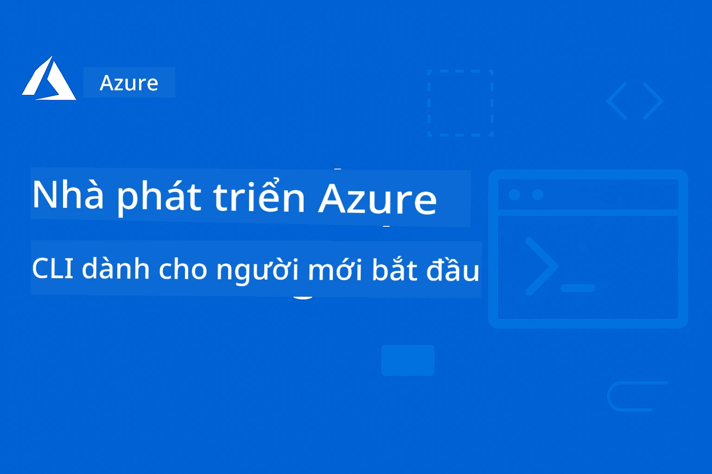

# AZD cho Người Mới Bắt Đầu: Hành Trình Học Có Cấu Trúc

 

[](https://GitHub.com/microsoft/azd-for-beginners/watchers/)
[](https://GitHub.com/microsoft/azd-for-beginners/network/)
[](https://GitHub.com/microsoft/azd-for-beginners/stargazers/)

[](https://discord.com/invite/nkVh3dp)
[](https://discord.gg/nTYy5BXMWG)

---

### Các Bản Dịch Tự Động (Luôn Cập Nhật)

<!-- CO-OP TRANSLATOR LANGUAGES TABLE START -->
[Tiếng Ả Rập](../ar/README.md) | [Tiếng Bengal](../bn/README.md) | [Tiếng Bulgaria](../bg/README.md) | [Tiếng Miến Điện (Myanmar)](../my/README.md) | [Tiếng Trung (Giản Thể)](../zh-CN/README.md) | [Tiếng Trung (Phồn Thể, Hồng Kông)](../zh-HK/README.md) | [Tiếng Trung (Phồn Thể, Macau)](../zh-MO/README.md) | [Tiếng Trung (Phồn Thể, Đài Loan)](../zh-TW/README.md) | [Tiếng Croatia](../hr/README.md) | [Tiếng Séc](../cs/README.md) | [Tiếng Đan Mạch](../da/README.md) | [Tiếng Hà Lan](../nl/README.md) | [Tiếng Estonia](../et/README.md) | [Tiếng Phần Lan](../fi/README.md) | [Tiếng Pháp](../fr/README.md) | [Tiếng Đức](../de/README.md) | [Tiếng Hy Lạp](../el/README.md) | [Tiếng Do Thái](../he/README.md) | [Tiếng Hindi](../hi/README.md) | [Tiếng Hungary](../hu/README.md) | [Tiếng Indonesia](../id/README.md) | [Tiếng Ý](../it/README.md) | [Tiếng Nhật](../ja/README.md) | [Tiếng Kannada](../kn/README.md) | [Tiếng Khmer](../km/README.md) | [Tiếng Hàn](../ko/README.md) | [Tiếng Litva](../lt/README.md) | [Tiếng Mã Lai](../ms/README.md) | [Tiếng Malayalam](../ml/README.md) | [Tiếng Marathi](../mr/README.md) | [Tiếng Nepal](../ne/README.md) | [Tiếng Pidgin Nigeria](../pcm/README.md) | [Tiếng Na Uy](../no/README.md) | [Tiếng Ba Tư (Farsi)](../fa/README.md) | [Tiếng Ba Lan](../pl/README.md) | [Tiếng Bồ Đào Nha (Brazil)](../pt-BR/README.md) | [Tiếng Bồ Đào Nha (Portugal)](../pt-PT/README.md) | [Tiếng Punjabi (Gurmukhi)](../pa/README.md) | [Tiếng Romania](../ro/README.md) | [Tiếng Nga](../ru/README.md) | [Tiếng Serbia (Chữ Cyrillic)](../sr/README.md) | [Tiếng Slovakia](../sk/README.md) | [Tiếng Slovenia](../sl/README.md) | [Tiếng Tây Ban Nha](../es/README.md) | [Tiếng Swahili](../sw/README.md) | [Tiếng Thụy Điển](../sv/README.md) | [Tiếng Tagalog (Filipino)](../tl/README.md) | [Tiếng Tamil](../ta/README.md) | [Tiếng Telugu](../te/README.md) | [Tiếng Thái](../th/README.md) | [Tiếng Thổ Nhĩ Kỳ](../tr/README.md) | [Tiếng Ukraina](../uk/README.md) | [Tiếng Urdu](../ur/README.md) | [Tiếng Việt](./README.md)

> **Muốn sao chép (clone) trên máy cục bộ?**
>
> Kho lưu trữ này bao gồm hơn 50 bản dịch ngôn ngữ, làm tăng đáng kể kích thước tải xuống. Để sao chép mà không có các bản dịch, hãy sử dụng sparse checkout:
>
> **Bash / macOS / Linux:**
> ```bash
> git clone --filter=blob:none --sparse https://github.com/microsoft/AZD-for-beginners.git
> cd AZD-for-beginners
> git sparse-checkout set --no-cone '/*' '!translations' '!translated_images'
> ```
>
> **CMD (Windows):**
> ```cmd
> git clone --filter=blob:none --sparse https://github.com/microsoft/AZD-for-beginners.git
> cd AZD-for-beginners
> git sparse-checkout set --no-cone "/*" "!translations" "!translated_images"
> ```
>
> Điều này cung cấp cho bạn mọi thứ cần thiết để hoàn thành khóa học với thời gian tải xuống nhanh hơn nhiều.
<!-- CO-OP TRANSLATOR LANGUAGES TABLE END -->

## 🆕 Có gì Mới trong azd Hôm Nay

Azure Developer CLI đã phát triển vượt ra ngoài các ứng dụng web và API truyền thống. Ngày nay, azd là công cụ duy nhất để triển khai **bất kỳ** ứng dụng nào lên Azure — bao gồm cả các ứng dụng có AI và các đại lý thông minh.

Điều này có ý nghĩa gì cho bạn:

- **Các đại lý AI hiện là workload loại hạng nhất trong azd.** Bạn có thể khởi tạo, triển khai và quản lý các dự án đại lý AI bằng cùng một quy trình `azd init` → `azd up` mà bạn đã biết.
- **Tích hợp Microsoft Foundry** mang việc triển khai mô hình, lưu trữ đại lý và cấu hình dịch vụ AI trực tiếp vào hệ sinh thái mẫu (template) của azd.
- **Luồng công việc cốt lõi không thay đổi.** Dù bạn đang triển khai một ứng dụng todo, một microservice hay một giải pháp AI nhiều đại lý, các lệnh vẫn giống nhau.

Nếu bạn đã từng dùng azd trước đây, hỗ trợ AI là một phần mở rộng tự nhiên — không phải một công cụ riêng biệt hay một hướng nâng cao. Nếu bạn bắt đầu mới, bạn sẽ học một quy trình làm việc duy nhất phù hợp cho mọi thứ.

---

## 🚀 Azure Developer CLI (azd) là gì?

**Azure Developer CLI (azd)** là một công cụ dòng lệnh thân thiện với nhà phát triển giúp đơn giản hóa việc triển khai ứng dụng lên Azure. Thay vì tạo và kết nối hàng tá tài nguyên Azure thủ công, bạn có thể triển khai toàn bộ ứng dụng chỉ với một lệnh.

### Sức mạnh của `azd up`

```bash
# Lệnh duy nhất này làm tất cả mọi thứ:
# ✅ Tạo tất cả tài nguyên Azure
# ✅ Cấu hình mạng và bảo mật
# ✅ Xây dựng mã ứng dụng của bạn
# ✅ Triển khai lên Azure
# ✅ Cung cấp cho bạn một URL hoạt động
azd up
```

**Xong rồi!** Không cần click trên Azure Portal, không cần học các ARM template phức tạp trước, không cấu hình thủ công - chỉ là các ứng dụng hoạt động trên Azure.

---

## ❓ Azure Developer CLI vs Azure CLI: Sự khác biệt là gì?

Đây là câu hỏi phổ biến nhất mà người mới hỏi. Đây là câu trả lời đơn giản:

| Tính năng | **Azure CLI (`az`)** | **Azure Developer CLI (`azd`)** |
|---------|---------------------|--------------------------------|
| **Mục đích** | Quản lý từng tài nguyên Azure riêng lẻ | Triển khai ứng dụng hoàn chỉnh |
| **Tư duy** | Tập trung vào hạ tầng | Tập trung vào ứng dụng |
| **Ví dụ** | `az webapp create --name myapp...` | `azd up` |
| **Đường cong học tập** | Cần biết các dịch vụ Azure | Chỉ cần biết ứng dụng của bạn |
| **Phù hợp cho** | DevOps, Hạ tầng | Các nhà phát triển, Tạo mẫu |

### Tương tự đơn giản

- **Azure CLI** giống như có tất cả các công cụ để xây nhà - búa, cưa, đinh. Bạn có thể xây bất cứ thứ gì, nhưng bạn cần biết xây dựng.
- **Azure Developer CLI** giống như thuê một nhà thầu - bạn mô tả những gì bạn muốn, và họ lo phần xây dựng.

### Khi nào sử dụng từng cái

| Tình huống | Sử dụng |
|----------|----------|
| "Tôi muốn triển khai ứng dụng web nhanh chóng" | `azd up` |
| "Tôi chỉ cần tạo một storage account" | `az storage account create` |
| "Tôi đang xây dựng một ứng dụng AI hoàn chỉnh" | `azd init --template azure-search-openai-demo` |
| "Tôi cần gỡ lỗi một tài nguyên Azure cụ thể" | `az resource show` |
| "Tôi muốn triển khai sẵn sàng cho môi trường production trong vài phút" | `azd up --environment production` |

### Chúng hoạt động cùng nhau!

AZD sử dụng Azure CLI ở dưới nền. Bạn có thể dùng cả hai:
```bash
# Triển khai ứng dụng của bạn với AZD
azd up

# Sau đó tinh chỉnh các tài nguyên cụ thể bằng Azure CLI
az webapp config set --name myapp --always-on true
```

---

## 🌟 Tìm Mẫu trong Awesome AZD

Đừng bắt đầu từ con số không! **Awesome AZD** là bộ sưu tập cộng đồng gồm các mẫu sẵn sàng triển khai:

| Tài nguyên | Mô tả |
|----------|-------------|
| 🔗 [**Awesome AZD Gallery**](https://azure.github.io/awesome-azd/) | Duyệt 200+ mẫu với triển khai một cú nhấp |
| 🔗 [**Gửi một Mẫu**](https://github.com/Azure/awesome-azd/issues) | Đóng góp mẫu của bạn cho cộng đồng |
| 🔗 [**Kho lưu trữ GitHub**](https://github.com/Azure/awesome-azd) | Star và khám phá nguồn |

### Các Mẫu AI Phổ Biến từ Awesome AZD

```bash
# Chat RAG với các Mô hình Microsoft Foundry + Tìm kiếm AI
azd init --template azure-search-openai-demo

# Ứng dụng Chat AI Nhanh
azd init --template openai-chat-app-quickstart

# Đại lý AI với Đại lý Foundry
azd init --template get-started-with-ai-agents
```

---

## 🎯 Bắt Đầu trong 3 Bước

Trước khi bắt đầu, đảm bảo máy của bạn đã sẵn sàng cho mẫu bạn muốn triển khai:

**Windows:**
```powershell
.\validate-setup.ps1
```

**macOS / Linux:**
```bash
bash ./validate-setup.sh
```

If any required check fails, fix that first and then continue with the quick start.

### Bước 1: Cài đặt AZD (2 phút)

**Windows:**
```powershell
winget install microsoft.azd
```

**macOS:**
```bash
brew tap azure/azd && brew install azd
```

**Linux:**
```bash
curl -fsSL https://aka.ms/install-azd.sh | bash
```

### Bước 2: Xác thực cho AZD

```bash
# Tùy chọn nếu bạn dự định sử dụng các lệnh Azure CLI trực tiếp trong khóa học này
az login

# Bắt buộc cho các quy trình làm việc của AZD
azd auth login
```

If you are not sure which one you need, follow the full setup flow in [Cài đặt & Thiết lập](docs/chapter-01-foundation/installation.md#authentication-setup).

### Bước 3: Triển khai Ứng dụng Đầu tiên của Bạn

```bash
# Khởi tạo từ một mẫu
azd init --template todo-nodejs-mongo

# Triển khai lên Azure (tạo mọi thứ!)
azd up
```

**🎉 Xong rồi!** Ứng dụng của bạn bây giờ đã hoạt động trên Azure.

### Dọn dẹp (Đừng quên!)

```bash
# Remove all resources when done experimenting
azd down --force --purge
```

---

## 📚 Cách Sử Dụng Khóa Học Này

Khóa học này được thiết kế cho **học tiến bộ** - bắt đầu từ nơi bạn thấy thoải mái và tiến dần lên:

| Kinh nghiệm của bạn | Bắt đầu ở đây |
|-----------------|------------|
| **Hoàn toàn mới với Azure** | [Chương 1: Nền tảng](#-chapter-1-foundation--quick-start) |
| **Biết Azure, mới với AZD** | [Chương 1: Nền tảng](#-chapter-1-foundation--quick-start) |
| **Muốn triển khai ứng dụng AI** | [Chương 2: Phát triển Ưu tiên AI](#-chapter-2-ai-first-development-recommended-for-ai-developers) |
| **Muốn thực hành trực tiếp** | [🎓 Hội thảo Tương tác](workshop/README.md) - bài lab hướng dẫn 3-4 giờ |
| **Cần các mẫu cho môi trường sản xuất** | [Chương 8: Sản xuất & Doanh nghiệp](#-chapter-8-production--enterprise-patterns) |

### Thiết lập nhanh

1. **Fork Kho Lưu Trữ Này**: [](https://GitHub.com/microsoft/azd-for-beginners/fork)
2. **Sao chép (clone)**: `git clone https://github.com/YOUR-USERNAME/azd-for-beginners.git`
3. **Nhận trợ giúp**: [Cộng đồng Azure Discord](https://discord.com/invite/ByRwuEEgH4)

> **Muốn sao chép (clone) trên máy cục bộ?**
>
> Kho lưu trữ này bao gồm hơn 50 bản dịch ngôn ngữ, làm tăng đáng kể kích thước tải xuống. Để sao chép mà không có các bản dịch, hãy sử dụng sparse checkout:
> ```bash
> git clone --filter=blob:none --sparse https://github.com/microsoft/AZD-for-beginners.git
> cd AZD-for-beginners
> git sparse-checkout set --no-cone '/*' '!translations' '!translated_images'
> ```
> Điều này cung cấp cho bạn mọi thứ bạn cần để hoàn thành khóa học với thời gian tải xuống nhanh hơn nhiều.


## Tổng Quan Khóa Học

Làm chủ Azure Developer CLI (azd) thông qua các chương có cấu trúc được thiết kế cho học tiến bộ. **Tập trung đặc biệt vào triển khai ứng dụng AI với tích hợp Microsoft Foundry.**

### Tại sao Khóa Học Này Quan Trọng với Nhà Phát Triển Hiện Đại

Dựa trên thông tin từ cộng đồng Microsoft Foundry Discord, **45% nhà phát triển muốn sử dụng AZD cho workloads AI** nhưng gặp phải các thách thức về:
- Kiến trúc AI phức tạp nhiều dịch vụ
- Các thực hành tốt nhất cho triển khai AI ở môi trường sản xuất  
- Tích hợp và cấu hình dịch vụ AI trên Azure
- Tối ưu chi phí cho workloads AI
- Khắc phục sự cố liên quan đến triển khai AI

### Mục tiêu học tập

Bằng cách hoàn thành khóa học có cấu trúc này, bạn sẽ:
- **Làm chủ các nền tảng AZD**: Các khái niệm cốt lõi, cài đặt và cấu hình
- **Triển khai Ứng dụng AI**: Sử dụng AZD với các dịch vụ Microsoft Foundry
- **Triển khai Hạ tầng như Mã (IaC)**: Quản lý tài nguyên Azure với các mẫu Bicep
- **Khắc phục sự cố Triển khai**: Giải quyết các vấn đề phổ biến và gỡ lỗi
- **Tối ưu cho Môi trường Sản xuất**: Bảo mật, mở rộng, giám sát và quản lý chi phí
- **Xây dựng Giải pháp Nhiều Đại lý**: Triển khai các kiến trúc AI phức tạp

## Trước Khi Bắt Đầu: Tài khoản, Quyền truy cập và Giả định

Trước khi bạn bắt đầu Chương 1, hãy chắc chắn bạn đã có những điều sau. Các bước cài đặt ở phần sau của hướng dẫn này giả định rằng những điều cơ bản này đã được xử lý.
- **Một đăng ký Azure**: Bạn có thể sử dụng một đăng ký hiện có từ nơi làm việc hoặc tài khoản cá nhân của mình, hoặc tạo một [bản dùng thử miễn phí](https://aka.ms/azurefreetrial) để bắt đầu.
- **Quyền tạo tài nguyên Azure**: Đối với hầu hết các bài tập, bạn nên có ít nhất quyền truy cập **Contributor** trên subscription hoặc resource group mục tiêu. Một số chương cũng có thể giả định bạn có thể tạo resource groups, managed identities và RBAC assignments.
- [**Một tài khoản GitHub**](https://github.com): Điều này hữu ích để fork repository, theo dõi các thay đổi của bạn, và sử dụng GitHub Codespaces cho workshop.
- **Yêu cầu runtime cho mẫu**: Một số mẫu cần các công cụ cục bộ như Node.js, Python, Java hoặc Docker. Chạy trình xác thực thiết lập trước khi bắt đầu để bạn phát hiện thiếu công cụ sớm.
- **Kiến thức cơ bản về terminal**: Bạn không cần phải là chuyên gia, nhưng nên thoải mái khi chạy các lệnh như `git clone`, `azd auth login`, và `azd up`.

> **Đang làm việc trong một subscription doanh nghiệp?**
> Nếu môi trường Azure của bạn được quản lý bởi một quản trị viên, hãy xác nhận trước rằng bạn có thể triển khai tài nguyên trong subscription hoặc resource group mà bạn dự định sử dụng. Nếu không, hãy yêu cầu một sandbox subscription hoặc quyền **Contributor** trước khi bắt đầu.

> **Mới sử dụng Azure?**
> Bắt đầu với bản trial Azure của bạn hoặc subscription trả theo sử dụng tại https://aka.ms/azurefreetrial để bạn có thể hoàn thành các bài tập từ đầu đến cuối mà không phải chờ phê duyệt ở cấp tenant.

## 🗺️ Bản đồ Khóa học: Điều hướng nhanh theo chương

Mỗi chương có một README riêng với mục tiêu học tập, hướng dẫn nhanh và bài tập:

| Chương | Chủ đề | Bài học | Thời lượng | Độ phức tạp |
|---------|-------|---------|----------|------------|
| **[Ch 1: Nền tảng](docs/chapter-01-foundation/README.md)** | Bắt đầu | [Những điều cơ bản về AZD](docs/chapter-01-foundation/azd-basics.md) &#124; [Cài đặt](docs/chapter-01-foundation/installation.md) &#124; [Dự án đầu tiên](docs/chapter-01-foundation/first-project.md) | 30-45 min | ⭐ |
| **[Ch 2: AI Development](docs/chapter-02-ai-development/README.md)** | Ứng dụng hướng AI | [Tích hợp Microsoft Foundry](docs/chapter-02-ai-development/microsoft-foundry-integration.md) &#124; [AI Agents](docs/chapter-02-ai-development/agents.md) &#124; [Triển khai mô hình AI](docs/chapter-02-ai-development/ai-model-deployment.md) &#124; [Workshop](docs/chapter-02-ai-development/ai-workshop-lab.md) | 1-2 hrs | ⭐⭐ |
| **[Ch 3: Configuration](docs/chapter-03-configuration/README.md)** | Xác thực & Bảo mật | [Cấu hình](docs/chapter-03-configuration/configuration.md) &#124; [Auth & Security](docs/chapter-03-configuration/authsecurity.md) | 45-60 min | ⭐⭐ |
| **[Ch 4: Infrastructure](docs/chapter-04-infrastructure/README.md)** | IaC & Triển khai | [Hướng dẫn Triển khai](docs/chapter-04-infrastructure/deployment-guide.md) &#124; [Cung cấp tài nguyên](docs/chapter-04-infrastructure/provisioning.md) | 1-1.5 hrs | ⭐⭐⭐ |
| **[Ch 5: Multi-Agent](docs/chapter-05-multi-agent/README.md)** | Giải pháp tác nhân AI | [Kịch bản bán lẻ](examples/retail-scenario.md) &#124; [Mô hình phối hợp](docs/chapter-06-pre-deployment/coordination-patterns.md) | 2-3 hrs | ⭐⭐⭐⭐ |
| **[Ch 6: Pre-Deployment](docs/chapter-06-pre-deployment/README.md)** | Lập kế hoạch & Xác thực | [Kiểm tra tiền chuyến bay](docs/chapter-06-pre-deployment/preflight-checks.md) &#124; [Lập kế hoạch công suất](docs/chapter-06-pre-deployment/capacity-planning.md) &#124; [Chọn SKU](docs/chapter-06-pre-deployment/sku-selection.md) &#124; [App Insights](docs/chapter-06-pre-deployment/application-insights.md) | 1 hr | ⭐⭐ |
| **[Ch 7: Troubleshooting](docs/chapter-07-troubleshooting/README.md)** | Gỡ lỗi & Sửa | [Các vấn đề phổ biến](docs/chapter-07-troubleshooting/common-issues.md) &#124; [Gỡ lỗi](docs/chapter-07-troubleshooting/debugging.md) &#124; [Vấn đề AI](docs/chapter-07-troubleshooting/ai-troubleshooting.md) | 1-1.5 hrs | ⭐⭐ |
| **[Ch 8: Production](docs/chapter-08-production/README.md)** | Mô hình doanh nghiệp | [Thực hành sản xuất](docs/chapter-08-production/production-ai-practices.md) | 2-3 hrs | ⭐⭐⭐⭐ |
| **[🎓 Hội thảo](workshop/README.md)** | Thực hành | [Giới thiệu](workshop/docs/instructions/0-Introduction.md) &#124; [Chọn mẫu AI](workshop/docs/instructions/1-Select-AI-Template.md) &#124; [Xác thực mẫu AI](workshop/docs/instructions/2-Validate-AI-Template.md) &#124; [Phân tích mẫu AI](workshop/docs/instructions/3-Deconstruct-AI-Template.md) &#124; [Cấu hình mẫu AI](workshop/docs/instructions/4-Configure-AI-Template.md) &#124; [Tùy chỉnh mẫu AI](workshop/docs/instructions/5-Customize-AI-Template.md) &#124; [Hạ tầng dỡ bỏ](workshop/docs/instructions/6-Teardown-Infrastructure.md) &#124; [Kết thúc](workshop/docs/instructions/7-Wrap-up.md) | 3-4 hrs | ⭐⭐ |

**Tổng thời lượng khóa học:** ~10-14 giờ | **Mức tiến bộ kỹ năng:** Người mới → Sẵn sàng cho môi trường sản xuất

---

## 📚 Các chương học

*Chọn lộ trình học dựa trên trình độ và mục tiêu*

### 🚀 Chương 1: Nền tảng & Bắt đầu nhanh
**Yêu cầu trước**: đăng ký Azure, kiến thức cơ bản về dòng lệnh  
**Thời lượng**: 30-45 phút  
**Độ phức tạp**: ⭐

#### Những gì bạn sẽ học
- Hiểu các nguyên lý cơ bản của Azure Developer CLI
- Cài đặt AZD trên nền tảng của bạn
- Triển khai thành công đầu tiên của bạn

#### Tài nguyên học tập
- **🎯 Bắt đầu tại đây**: [Azure Developer CLI là gì?](#what-is-azure-developer-cli)
- **📖 Lý thuyết**: [Những điều cơ bản về AZD](docs/chapter-01-foundation/azd-basics.md) - Các khái niệm cốt lõi và thuật ngữ
- **⚙️ Cài đặt**: [Cài đặt & Thiết lập](docs/chapter-01-foundation/installation.md) - Hướng dẫn theo nền tảng
- **🛠️ Thực hành**: [Dự án đầu tiên của bạn](docs/chapter-01-foundation/first-project.md) - Hướng dẫn từng bước
- **📋 Tham khảo nhanh**: [Bảng tham khảo lệnh](resources/cheat-sheet.md)

#### Bài tập thực hành
```bash
# Kiểm tra cài đặt nhanh
azd version

# Triển khai ứng dụng đầu tiên của bạn
azd init --template todo-nodejs-mongo
azd up
```

**💡 Kết quả chương**: Triển khai thành công một ứng dụng web đơn giản lên Azure bằng AZD

**✅ Xác thực thành công:**
```bash
# Sau khi hoàn thành Chương 1, bạn sẽ có thể:
azd version              # Hiển thị phiên bản đã cài đặt
azd init --template todo-nodejs-mongo  # Khởi tạo dự án
azd up                  # Triển khai lên Azure
azd show                # Hiển thị URL ứng dụng đang chạy
# Ứng dụng mở trong trình duyệt và hoạt động
azd down --force --purge  # Dọn dẹp tài nguyên
```

**📊 Thời gian đầu tư:** 30-45 phút  
**📈 Trình độ sau khi hoàn thành:** Có thể triển khai các ứng dụng cơ bản một cách độc lập
**📈 Trình độ sau khi hoàn thành:** Có thể triển khai các ứng dụng cơ bản một cách độc lập

---

### 🤖 Chương 2: Phát triển hướng AI (Khuyến nghị dành cho nhà phát triển AI)
**Yêu cầu trước**: Đã hoàn thành Chương 1  
**Thời lượng**: 1-2 giờ  
**Độ phức tạp**: ⭐⭐

#### Những gì bạn sẽ học
- Tích hợp Microsoft Foundry với AZD
- Triển khai các ứng dụng sử dụng AI
- Hiểu cấu hình dịch vụ AI

#### Tài nguyên học tập
- **🎯 Bắt đầu tại đây**: [Tích hợp Microsoft Foundry](docs/chapter-02-ai-development/microsoft-foundry-integration.md)
- **🤖 Tác nhân AI**: [Hướng dẫn AI Agents](docs/chapter-02-ai-development/agents.md) - Triển khai các tác nhân thông minh với AZD
- **📖 Mô hình**: [Triển khai mô hình AI](docs/chapter-02-ai-development/ai-model-deployment.md) - Triển khai và quản lý mô hình AI
- **🛠️ Workshop**: [Phòng thí nghiệm AI](docs/chapter-02-ai-development/ai-workshop-lab.md) - Chuẩn bị giải pháp AI của bạn sẵn sàng với AZD
- **🎥 Hướng dẫn tương tác**: [Tài liệu Workshop](workshop/README.md) - Học tương tác trên trình duyệt với MkDocs * DevContainer Environment
- **📋 Mẫu**: [Mẫu Microsoft Foundry](#tài-nguyên-workshop)
- **📝 Ví dụ**: [Ví dụ triển khai AZD](examples/README.md)

#### Bài tập thực hành
```bash
# Triển khai ứng dụng AI đầu tiên của bạn
azd init --template azure-search-openai-demo
azd up

# Thử thêm các mẫu AI
azd init --template openai-chat-app-quickstart
azd init --template agent-openai-python-prompty
```

**💡 Kết quả chương**: Triển khai và cấu hình một ứng dụng chat sử dụng AI với khả năng RAG

**✅ Xác thực thành công:**
```bash
# Sau Chương 2, bạn sẽ có thể:
azd init --template azure-search-openai-demo
azd up
# Kiểm tra giao diện trò chuyện AI
# Đặt câu hỏi và nhận phản hồi do AI cung cấp kèm nguồn
# Xác minh tích hợp tìm kiếm hoạt động
azd monitor  # Kiểm tra Application Insights hiển thị dữ liệu telemetri
azd down --force --purge
```

**📊 Thời gian đầu tư:** 1-2 giờ  
**📈 Trình độ sau khi hoàn thành:** Có thể triển khai và cấu hình các ứng dụng AI sẵn sàng cho môi trường sản xuất  
**💰 Ý thức chi phí:** Hiểu chi phí phát triển ~$80-150/tháng, chi phí sản xuất $300-3500/tháng

#### 💰 Cân nhắc chi phí cho triển khai AI

**Môi trường phát triển (Ước tính $80-150/tháng):**
- Microsoft Foundry Models (Pay-as-you-go): $0-50/tháng (dựa trên lượng token sử dụng)
- AI Search (Basic tier): $75/tháng
- Container Apps (Consumption): $0-20/tháng
- Storage (Standard): $1-5/tháng

**Môi trường sản xuất (Ước tính $300-3,500+/tháng):**
- Microsoft Foundry Models (PTU for consistent performance): $3,000+/tháng HOẶC Pay-as-go với khối lượng lớn
- AI Search (Standard tier): $250/tháng
- Container Apps (Dedicated): $50-100/tháng
- Application Insights: $5-50/tháng
- Storage (Premium): $10-50/tháng

**💡 Mẹo tối ưu chi phí:**
- Sử dụng **Free Tier** Microsoft Foundry Models để học (Azure OpenAI 50,000 tokens/tháng được bao gồm)
- Chạy `azd down` để giải phóng tài nguyên khi không phát triển tích cực
- Bắt đầu với thanh toán theo mức tiêu thụ, chỉ nâng cấp lên PTU cho môi trường sản xuất
- Sử dụng `azd provision --preview` để ước tính chi phí trước khi triển khai
- Bật auto-scaling: chỉ trả cho mức sử dụng thực tế

**Giám sát chi phí:**
```bash
# Kiểm tra chi phí ước tính hàng tháng
azd provision --preview

# Giám sát chi phí thực tế trong Cổng thông tin Azure
az consumption budget list --resource-group <your-rg>
```

---

### ⚙️ Chương 3: Cấu hình & Xác thực
**Yêu cầu trước**: Đã hoàn thành Chương 1  
**Thời lượng**: 45-60 phút  
**Độ phức tạp**: ⭐⭐

#### Những gì bạn sẽ học
- Cấu hình và quản lý môi trường
- Xác thực và các thực hành bảo mật tốt nhất
- Đặt tên tài nguyên và tổ chức

#### Tài nguyên học tập
- **📖 Cấu hình**: [Hướng dẫn Cấu hình](docs/chapter-03-configuration/configuration.md) - Thiết lập môi trường
- **🔐 Bảo mật**: [Mẫu xác thực và managed identity](docs/chapter-03-configuration/authsecurity.md) - Các mẫu xác thực
- **📝 Ví dụ**: [Ví dụ ứng dụng cơ sở dữ liệu](examples/database-app/README.md) - Ví dụ AZD với Database

#### Bài tập thực hành
- Cấu hình nhiều môi trường (dev, staging, prod)
- Thiết lập xác thực managed identity
- Triển khai cấu hình theo môi trường

**💡 Kết quả chương**: Quản lý nhiều môi trường với xác thực và bảo mật phù hợp

---

### 🏗️ Chương 4: Hạ tầng dưới dạng mã & Triển khai
**Yêu cầu trước**: Đã hoàn thành Chương 1-3  
**Thời lượng**: 1-1.5 giờ  
**Độ phức tạp**: ⭐⭐⭐

#### Những gì bạn sẽ học
- Các mô hình triển khai nâng cao
- Hạ tầng dưới dạng mã với Bicep
- Chiến lược cấp phát tài nguyên

#### Tài nguyên học tập
- **📖 Triển khai**: [Hướng dẫn Triển khai](docs/chapter-04-infrastructure/deployment-guide.md) - Quy trình hoàn chỉnh
- **🏗️ Cung cấp**: [Cung cấp tài nguyên](docs/chapter-04-infrastructure/provisioning.md) - Quản lý tài nguyên Azure
- **📝 Ví dụ**: [Ví dụ Container App](../../examples/container-app) - Triển khai container hóa

#### Bài tập thực hành
- Tạo các template Bicep tùy chỉnh
- Triển khai ứng dụng đa dịch vụ
- Triển khai chiến lược blue-green

**💡 Kết quả chương**: Triển khai các ứng dụng đa dịch vụ phức tạp sử dụng template hạ tầng tùy chỉnh

---

### 🎯 Chương 5: Giải pháp Multi-Agent AI (Nâng cao)
**Yêu cầu trước**: Đã hoàn thành Chương 1-2  
**Thời lượng**: 2-3 giờ  
**Độ phức tạp**: ⭐⭐⭐⭐

#### Những gì bạn sẽ học
- Các mẫu kiến trúc đa tác nhân
- Điều phối và phối hợp các tác nhân
- Triển khai AI sẵn sàng cho môi trường sản xuất

#### Tài nguyên học tập
- **🤖 Dự án nổi bật**: [Giải pháp đa-tác nhân cho bán lẻ](examples/retail-scenario.md) - Triển khai hoàn chỉnh
- **🛠️ Gói ARM**: [Gói ARM Template](../../examples/retail-multiagent-arm-template) - Triển khai một lần nhấp
- **📖 Kiến trúc**: [Mô hình phối hợp đa tác nhân](docs/chapter-06-pre-deployment/coordination-patterns.md) - Các mẫu

#### Bài tập thực hành
```bash
# Triển khai giải pháp bán lẻ đa tác nhân hoàn chỉnh
cd examples/retail-multiagent-arm-template
./deploy.sh

# Khám phá cấu hình các tác nhân
az deployment group show --resource-group <rg-name> --name <deployment-name>
```

**💡 Kết quả chương**: Triển khai và quản lý một giải pháp đa-tác nhân AI sẵn sàng cho môi trường sản xuất với các tác nhân Customer và Inventory

---

### 🔍 Chương 6: Xác thực & Lập kế hoạch trước triển khai
**Yêu cầu trước**: Đã hoàn thành Chương 4  
**Thời lượng**: 1 giờ  
**Độ phức tạp**: ⭐⭐
#### Những gì bạn sẽ học
- Lập kế hoạch công suất và xác thực tài nguyên
- Chiến lược lựa chọn SKU
- Kiểm tra trước khi triển khai và tự động hóa

#### Tài nguyên học tập
- **📊 Lập kế hoạch**: [Lập kế hoạch công suất](docs/chapter-06-pre-deployment/capacity-planning.md) - Xác thực tài nguyên
- **💰 Lựa chọn**: [Lựa chọn SKU](docs/chapter-06-pre-deployment/sku-selection.md) - Lựa chọn tối ưu về chi phí
- **✅ Xác thực**: [Kiểm tra trước khi triển khai](docs/chapter-06-pre-deployment/preflight-checks.md) - Script tự động

#### Bài tập thực hành
- Chạy các script xác thực công suất
- Tối ưu lựa chọn SKU theo chi phí
- Thực hiện kiểm tra tự động trước khi triển khai

**💡 Kết quả chương**: Xác thực và tối ưu các triển khai trước khi thực thi

---

### 🚨 Chương 7: Khắc phục sự cố & Gỡ lỗi
**Yêu cầu tiên quyết**: Hoàn thành bất kỳ chương triển khai nào  
**Thời lượng**: 1-1.5 giờ  
**Độ phức tạp**: ⭐⭐

#### Những gì bạn sẽ học
- Các phương pháp gỡ lỗi có hệ thống
- Các vấn đề phổ biến và giải pháp
- Khắc phục sự cố dành cho AI

#### Tài nguyên học tập
- **🔧 Vấn đề phổ biến**: [Các vấn đề phổ biến](docs/chapter-07-troubleshooting/common-issues.md) - Câu hỏi thường gặp và giải pháp
- **🕵️ Gỡ lỗi**: [Hướng dẫn gỡ lỗi](docs/chapter-07-troubleshooting/debugging.md) - Chiến lược theo từng bước
- **🤖 Vấn đề AI**: [Khắc phục sự cố AI chuyên biệt](docs/chapter-07-troubleshooting/ai-troubleshooting.md) - Sự cố dịch vụ AI

#### Bài tập thực hành
- Chẩn đoán lỗi triển khai
- Giải quyết sự cố xác thực
- Gỡ lỗi kết nối dịch vụ AI

**💡 Kết quả chương**: Tự độc lập chẩn đoán và giải quyết các vấn đề triển khai phổ biến

---

### 🏢 Chương 8: Mẫu triển khai cho môi trường sản xuất và doanh nghiệp
**Yêu cầu tiên quyết**: Hoàn thành các chương 1-4  
**Thời lượng**: 2-3 giờ  
**Độ phức tạp**: ⭐⭐⭐⭐

#### Những gì bạn sẽ học
- Chiến lược triển khai cho môi trường sản xuất
- Mô hình bảo mật doanh nghiệp
- Giám sát và tối ưu chi phí

#### Tài nguyên học tập
- **🏭 Sản xuất**: [Thực hành AI cho môi trường sản xuất](docs/chapter-08-production/production-ai-practices.md) - Mẫu doanh nghiệp
- **📝 Ví dụ**: [Ví dụ Microservices](../../examples/microservices) - Kiến trúc phức tạp
- **📊 Giám sát**: [Tích hợp Application Insights](docs/chapter-06-pre-deployment/application-insights.md) - Giám sát

#### Bài tập thực hành
- Triển khai các mẫu bảo mật doanh nghiệp
- Thiết lập giám sát toàn diện
- Triển khai lên môi trường sản xuất với quản trị phù hợp

**💡 Kết quả chương**: Triển khai ứng dụng sẵn sàng cho doanh nghiệp với đầy đủ khả năng cho môi trường sản xuất

---

## 🎓 Tổng quan Workshop: Trải nghiệm Học tập Thực hành

> **⚠️ TRẠNG THÁI WORKSHOP: Đang phát triển**  
> Tài liệu workshop hiện đang được phát triển và chỉnh sửa. Các mô-đun cốt lõi hoạt động, nhưng một số phần nâng cao chưa hoàn thiện. Chúng tôi đang tích cực hoàn thành toàn bộ nội dung. [Theo dõi tiến độ →](workshop/README.md)

### Tài liệu Workshop Tương tác
**Học thực hành toàn diện với công cụ trên trình duyệt và bài tập hướng dẫn**

Tài liệu workshop của chúng tôi cung cấp trải nghiệm học tương tác có cấu trúc, bổ sung cho chương trình theo chương ở trên. Workshop được thiết kế cho cả học tự học theo nhịp và các buổi do giảng viên hướng dẫn.

#### 🛠️ Tính năng Workshop
- **Giao diện trên trình duyệt**: Workshop hoàn chỉnh chạy bằng MkDocs với chức năng tìm kiếm, sao chép và chủ đề
- **Tích hợp GitHub Codespaces**: Thiết lập môi trường phát triển với một cú nhấp
- **Lộ trình học cấu trúc**: 8 mô-đun bài tập hướng dẫn (tổng 3-4 giờ)
- **Phương pháp tiến bộ**: Giới thiệu → Lựa chọn → Xác thực → Phân tích cấu trúc → Cấu hình → Tùy chỉnh → Dọn dẹp → Tổng kết
- **Môi trường DevContainer tương tác**: Công cụ và phụ thuộc đã được cấu hình sẵn

#### 📚 Cấu trúc mô-đun Workshop
Workshop theo **phương pháp tiến bộ 8 mô-đun** đưa bạn từ khám phá đến thành thạo triển khai:

| Mô-đun | Chủ đề | Những gì bạn sẽ làm | Thời lượng |
|--------|--------|---------------------|----------|
| **0. Introduction** | Tổng quan Workshop | Hiểu mục tiêu học, yêu cầu tiên quyết và cấu trúc workshop | 15 phút |
| **1. Selection** | Khám phá mẫu | Khám phá các mẫu AZD và chọn mẫu AI phù hợp cho kịch bản của bạn | 20 phút |
| **2. Validation** | Triển khai & Xác minh | Triển khai mẫu với `azd up` và xác thực hạ tầng hoạt động | 30 phút |
| **3. Deconstruction** | Hiểu cấu trúc | Sử dụng GitHub Copilot để khám phá kiến trúc mẫu, file Bicep và tổ chức mã | 30 phút |
| **4. Configuration** | Đào sâu azure.yaml | Thành thạo cấu hình `azure.yaml`, lifecycle hooks, và biến môi trường | 30 phút |
| **5. Customization** | Tùy chỉnh | Kích hoạt AI Search, tracing, evaluation, và tùy chỉnh cho kịch bản của bạn | 45 phút |
| **6. Teardown** | Dọn dẹp | Hủy cấp phát tài nguyên an toàn với `azd down --purge` | 15 phút |
| **7. Wrap-up** | Kết thúc | Xem lại thành tựu, các khái niệm chính và tiếp tục hành trình học tập của bạn | 15 phút |

**Workshop Flow:**
```
Introduction → Selection → Validation → Deconstruction → Configuration → Customization → Teardown → Wrap-up
     ↓            ↓           ↓              ↓               ↓              ↓            ↓           ↓
  Overview    Find the     Deploy &      Explore        Master         Customize     Clean up    Review &
             right        verify        code &        azure.yaml      for your      resources   next steps
             template                   structure                     scenario
```

#### 🚀 Getting Started with the Workshop
```bash
# Lựa chọn 1: GitHub Codespaces (Được khuyến nghị)
# Nhấp vào "Code" → "Create codespace on main" trong kho lưu trữ

# Lựa chọn 2: Phát triển cục bộ
git clone https://github.com/microsoft/azd-for-beginners.git
cd azd-for-beginners/workshop
# Làm theo hướng dẫn thiết lập trong workshop/README.md
```

#### 🎯 Kết quả học tập Workshop
Bằng cách hoàn thành workshop, người tham gia sẽ:
- **Triển khai Ứng dụng AI cho Sản xuất**: Sử dụng AZD với các dịch vụ Microsoft Foundry
- **Làm chủ Kiến trúc Đa-tác nhân**: Triển khai các giải pháp tác nhân AI phối hợp
- **Triển khai Thực hành Bảo mật Tốt nhất**: Cấu hình xác thực và kiểm soát truy cập
- **Tối ưu cho Quy mô**: Thiết kế triển khai hiệu suất cao và tiết kiệm chi phí
- **Khắc phục Sự cố Triển khai**: Giải quyết các vấn đề phổ biến một cách độc lập

#### 📖 Tài nguyên Workshop
- **🎥 Hướng dẫn Tương tác**: [Tài liệu Workshop](workshop/README.md) - Môi trường học trên trình duyệt
- **📋 Hướng dẫn theo Mô-đun**:
  - [0. Giới thiệu](workshop/docs/instructions/0-Introduction.md) - Tổng quan workshop và mục tiêu
  - [1. Lựa chọn](workshop/docs/instructions/1-Select-AI-Template.md) - Tìm và chọn mẫu AI
  - [2. Xác thực](workshop/docs/instructions/2-Validate-AI-Template.md) - Triển khai và xác minh các mẫu
  - [3. Phân tích cấu trúc](workshop/docs/instructions/3-Deconstruct-AI-Template.md) - Khám phá kiến trúc mẫu
  - [4. Cấu hình](workshop/docs/instructions/4-Configure-AI-Template.md) - Thành thạo azure.yaml
  - [5. Tùy chỉnh](workshop/docs/instructions/5-Customize-AI-Template.md) - Tùy chỉnh cho kịch bản của bạn
  - [6. Dọn dẹp](workshop/docs/instructions/6-Teardown-Infrastructure.md) - Dọn dẹp tài nguyên
  - [7. Tổng kết](workshop/docs/instructions/7-Wrap-up.md) - Xem lại và các bước tiếp theo
- **🛠️ Phòng thí nghiệm Workshop AI**: [AI Workshop Lab](docs/chapter-02-ai-development/ai-workshop-lab.md) - Các bài tập tập trung vào AI
- **💡 Bắt đầu nhanh**: [Hướng dẫn thiết lập Workshop](workshop/README.md#quick-start) - Cấu hình môi trường

**Phù hợp cho**: Đào tạo doanh nghiệp, khóa học đại học, học tự học theo nhịp, và bootcamp dành cho lập trình viên.

---

## 📖 Tìm hiểu sâu: Khả năng của AZD

Ngoài các kiến thức cơ bản, AZD cung cấp các tính năng mạnh mẽ cho triển khai sản xuất:

- **Triển khai theo mẫu** - Sử dụng các mẫu dựng sẵn cho các mẫu ứng dụng phổ biến
- **Hạ tầng dưới dạng mã** - Quản lý tài nguyên Azure bằng Bicep hoặc Terraform  
- **Luồng công việc tích hợp** - Cung cấp, triển khai và giám sát ứng dụng một cách liền mạch
- **Thân thiện với nhà phát triển** - Tối ưu cho năng suất và trải nghiệm của nhà phát triển

### **AZD + Microsoft Foundry: Hoàn hảo cho triển khai AI**

**Tại sao chọn AZD cho giải pháp AI?** AZD giải quyết các thách thức hàng đầu mà nhà phát triển AI gặp phải:

- **Mẫu sẵn sàng cho AI** - Mẫu được cấu hình sẵn cho Microsoft Foundry Models, Cognitive Services, và khối lượng công việc ML
- **Triển khai AI an toàn** - Các mẫu bảo mật tích hợp cho dịch vụ AI, khóa API và điểm cuối mô hình  
- **Mẫu AI cho môi trường sản xuất** - Thực hành tốt nhất cho triển khai ứng dụng AI có thể mở rộng và tiết kiệm chi phí
- **Luồng công việc AI đầu-cuối** - Từ phát triển mô hình đến triển khai sản xuất với giám sát phù hợp
- **Tối ưu chi phí** - Phân bổ tài nguyên thông minh và chiến lược tự động mở rộng cho khối lượng công việc AI
- **Tích hợp Microsoft Foundry** - Kết nối liền mạch tới danh mục mô hình và điểm cuối của Microsoft Foundry

---

## 🎯 Thư viện Mẫu & Ví dụ

### Nổi bật: Mẫu Microsoft Foundry
**Bắt đầu ở đây nếu bạn đang triển khai ứng dụng AI!**

> **Lưu ý:** Các mẫu này minh họa nhiều mô hình AI khác nhau. Một số là Azure Samples bên ngoài, số khác là triển khai cục bộ.

| Mẫu | Chương | Độ phức tạp | Dịch vụ | Loại |
|----------|---------|------------|----------|------|
| [**Bắt đầu với trò chuyện AI**](https://github.com/Azure-Samples/get-started-with-ai-chat) | Chương 2 | ⭐⭐ | AzureOpenAI + Azure AI Model Inference API + Azure AI Search + Azure Container Apps + Application Insights | Bên ngoài |
| [**Bắt đầu với các tác nhân AI**](https://github.com/Azure-Samples/get-started-with-ai-agents) | Chương 2 | ⭐⭐ | Foundry Agents + AzureOpenAI + Azure AI Search + Azure Container Apps + Application Insights| Bên ngoài |
| [**Azure Search + OpenAI Demo**](https://github.com/Azure-Samples/azure-search-openai-demo) | Chương 2 | ⭐⭐ | AzureOpenAI + Azure AI Search + App Service + Storage | Bên ngoài |
| [**OpenAI Chat App Quickstart**](https://github.com/Azure-Samples/openai-chat-app-quickstart) | Chương 2 | ⭐ | AzureOpenAI + Container Apps + Application Insights | Bên ngoài |
| [**Agent OpenAI Python Prompty**](https://github.com/Azure-Samples/agent-openai-python-prompty) | Chương 5 | ⭐⭐⭐ | AzureOpenAI + Azure Functions + Prompty | Bên ngoài |
| [**Contoso Chat RAG**](https://github.com/Azure-Samples/contoso-chat) | Chương 8 | ⭐⭐⭐⭐ | AzureOpenAI + AI Search + Cosmos DB + Container Apps | Bên ngoài |
| [**Giải pháp Đa-tác nhân Bán lẻ**](examples/retail-scenario.md) | Chương 5 | ⭐⭐⭐⭐ | AzureOpenAI + AI Search + Storage + Container Apps + Cosmos DB | **Cục bộ** |

### Nổi bật: Kịch bản học tập hoàn chỉnh
**Các mẫu ứng dụng sẵn sàng cho sản xuất được ánh xạ theo chương học**

| Mẫu | Chương học | Độ phức tạp | Bài học chính |
|----------|------------------|------------|--------------|
| [**openai-chat-app-quickstart**](https://github.com/Azure-Samples/openai-chat-app-quickstart) | Chương 2 | ⭐ | Các mẫu triển khai AI cơ bản |
| [**azure-search-openai-demo**](https://github.com/Azure-Samples/azure-search-openai-demo) | Chương 2 | ⭐⭐ | Triển khai RAG với Azure AI Search |
| [**ai-document-processing**](https://github.com/Azure-Samples/ai-document-processing) | Chương 4 | ⭐⭐ | Tích hợp Document Intelligence |
| [**agent-openai-python-prompty**](https://github.com/Azure-Samples/agent-openai-python-prompty) | Chương 5 | ⭐⭐⭐ | Khung tác nhân và gọi hàm |
| [**contoso-chat**](https://github.com/Azure-Samples/contoso-chat) | Chương 8 | ⭐⭐⭐ | Điều phối AI cho doanh nghiệp |
| [**retail-multi-agent-solution**](examples/retail-scenario.md) | Chương 5 | ⭐⭐⭐⭐ | Kiến trúc đa-tác nhân với tác nhân Khách hàng và Hàng tồn kho |

### Học theo loại ví dụ

> **📌 Ví dụ Cục bộ vs. Bên ngoài:**  
> **Ví dụ Cục bộ** (trong repo này) = Sẵn sàng sử dụng ngay lập tức  
> **Ví dụ Bên ngoài** (Azure Samples) = Sao chép từ các kho liên kết

#### Ví dụ Cục bộ (Sẵn sàng sử dụng)
- [**Giải pháp Đa-tác nhân Bán lẻ**](examples/retail-scenario.md) - Triển khai hoàn chỉnh sẵn sàng cho sản xuất với các mẫu ARM
  - Kiến trúc đa-tác nhân (tác nhân Khách hàng + Hàng tồn kho)
  - Giám sát và đánh giá toàn diện
  - Triển khai một cú nhấp thông qua mẫu ARM

#### Ví dụ Cục bộ - Ứng dụng Container (Chương 2-5)
**Các ví dụ triển khai container toàn diện trong kho này:**
- [**Ví dụ Ứng dụng Container**](examples/container-app/README.md) - Hướng dẫn đầy đủ về triển khai dạng container
  - [API Flask đơn giản](../../examples/container-app/simple-flask-api) - API REST cơ bản với scale-to-zero
  - [Kiến trúc Microservices](../../examples/container-app/microservices) - Triển khai đa dịch vụ sẵn sàng cho sản xuất
  - Quick Start, Production, and Advanced deployment patterns
  - Monitoring, security, and cost optimization guidance

#### Ví dụ Bên ngoài - Ứng dụng đơn giản (Chương 1-2)
**Sao chép các kho Azure Samples này để bắt đầu:**
- [Ứng dụng Web Đơn giản - Node.js + MongoDB](https://github.com/Azure-Samples/todo-nodejs-mongo) - Các mẫu triển khai cơ bản
- [Website Tĩnh - React SPA](https://github.com/Azure-Samples/todo-csharp-sql-swa-func) - Triển khai nội dung tĩnh
- [Ứng dụng Container - Python Flask](https://github.com/Azure-Samples/container-apps-store-api-microservice) - Triển khai REST API

#### Ví dụ Bên ngoài - Tích hợp Cơ sở Dữ liệu (Chương 3-4)
- [Ứng dụng cơ sở dữ liệu - C# + SQL](https://github.com/Azure-Samples/todo-csharp-sql) - Mẫu kết nối cơ sở dữ liệu
- [Functions + Cosmos DB](https://github.com/Azure-Samples/todo-python-mongo-swa-func) - Luồng công việc dữ liệu không máy chủ

#### Ví dụ bên ngoài - Mẫu nâng cao (Chương 4-8)
- [Java Microservices](https://github.com/Azure-Samples/java-microservices-aca-lab) - Kiến trúc đa dịch vụ
- [Container Apps Jobs](https://github.com/Azure-Samples/container-apps-jobs) - Xử lý nền  
- [Enterprise ML Pipeline](https://github.com/Azure-Samples/mlops-v2) - Các mẫu ML sẵn sàng cho môi trường sản xuất

### Bộ sưu tập mẫu bên ngoài
- [**Thư viện mẫu AZD chính thức**](https://azure.github.io/awesome-azd/) - Bộ sưu tập tuyển chọn các mẫu chính thức và cộng đồng
- [**Azure Developer CLI Templates**](https://learn.microsoft.com/en-us/azure/developer/azure-developer-cli/azd-templates) - Tài liệu mẫu Microsoft Learn
- [**Thư mục Ví dụ**](examples/README.md) - Ví dụ học tập cục bộ với giải thích chi tiết

---

## 📚 Tài nguyên & Tài liệu tham khảo

### Tài liệu tham khảo nhanh
- [**Bảng tóm tắt lệnh**](resources/cheat-sheet.md) - Các lệnh azd thiết yếu được sắp xếp theo chương
- [**Thuật ngữ**](resources/glossary.md) - Thuật ngữ Azure và azd  
- [**FAQ**](resources/faq.md) - Các câu hỏi thường gặp được sắp xếp theo chương học
- [**Hướng dẫn học tập**](resources/study-guide.md) - Bài tập thực hành toàn diện

### Hội thảo thực hành
- [**AI Workshop Lab**](docs/chapter-02-ai-development/ai-workshop-lab.md) - Biến giải pháp AI của bạn có thể triển khai bằng AZD (2-3 hours)
- [**Interactive Workshop**](workshop/README.md) - Các bài tập hướng dẫn 8 module với MkDocs và GitHub Codespaces
  - Theo trình tự: Giới thiệu → Lựa chọn → Xác thực → Phân tích → Cấu hình → Tùy chỉnh → Dỡ bỏ → Tổng kết

### Tài nguyên học tập bên ngoài
- [Tài liệu Azure Developer CLI](https://learn.microsoft.com/en-us/azure/developer/azure-developer-cli/)
- [Trung tâm Kiến trúc Azure](https://learn.microsoft.com/en-us/azure/architecture/)
- [Bộ tính giá Azure](https://azure.microsoft.com/pricing/calculator/)
- [Trạng thái Azure](https://status.azure.com/)

### Kỹ năng tác nhân AI cho Trình soạn thảo của bạn
- [**Microsoft Azure Skills on skills.sh**](https://skills.sh/microsoft/github-copilot-for-azure) - 37 kỹ năng tác nhân mở cho Azure AI, Foundry, triển khai, chẩn đoán, tối ưu chi phí, và hơn thế nữa. Cài đặt chúng trong GitHub Copilot, Cursor, Claude Code, hoặc bất kỳ tác nhân được hỗ trợ nào:
  ```bash
  npx skills add microsoft/github-copilot-for-azure
  ```

---

## 🔧 Hướng dẫn Khắc phục Sự cố Nhanh

**Các vấn đề thường gặp mà người mới gặp phải và giải pháp ngay lập tức:**

<details>
<summary><strong>❌ "azd: command not found"</strong></summary>

```bash
# Cài đặt AZD trước
# Windows (PowerShell):
winget install microsoft.azd

# macOS:
brew tap azure/azd && brew install azd

# Linux:
curl -fsSL https://aka.ms/install-azd.sh | bash

# Xác minh cài đặt
azd version
```
</details>

<details>
<summary><strong>❌ "No subscription found" or "Subscription not set"</strong></summary>

```bash
# Liệt kê các đăng ký có sẵn
az account list --output table

# Đặt đăng ký mặc định
az account set --subscription "<subscription-id-or-name>"

# Thiết lập cho môi trường AZD
azd env set AZURE_SUBSCRIPTION_ID "<subscription-id>"

# Xác minh
az account show
```
</details>

<details>
<summary><strong>❌ "InsufficientQuota" or "Quota exceeded"</strong></summary>

```bash
# Thử vùng Azure khác
azd env set AZURE_LOCATION "westus2"
azd up

# Hoặc sử dụng các SKU nhỏ hơn khi phát triển
# Chỉnh sửa infra/main.parameters.json:
{
  "sku": "B1"  // Instead of "P1V2"
}
```
</details>

<details>
<summary><strong>❌ "azd up" fails halfway through</strong></summary>

```bash
# Lựa chọn 1: Dọn dẹp và thử lại
azd down --force --purge
azd up

# Lựa chọn 2: Chỉ sửa hạ tầng
azd provision

# Lựa chọn 3: Kiểm tra trạng thái chi tiết
azd show

# Lựa chọn 4: Kiểm tra nhật ký trong Azure Monitor
azd monitor --logs
```
</details>

<details>
<summary><strong>❌ "Authentication failed" or "Token expired"</strong></summary>

```bash
# Xác thực lại cho AZD
azd auth logout
azd auth login

# Tùy chọn: cũng làm mới Azure CLI nếu bạn đang chạy các lệnh az
az logout
az login

# Kiểm tra xác thực
az account show
```
</details>

<details>
<summary><strong>❌ "Resource already exists" or naming conflicts</strong></summary>

```bash
# AZD tạo ra các tên duy nhất, nhưng nếu có xung đột:
azd down --force --purge

# Sau đó thử lại với môi trường mới
azd env new dev-v2
azd up
```
</details>

<details>
<summary><strong>❌ Template deployment taking too long</strong></summary>

**Thời gian chờ thông thường:**
- Ứng dụng web đơn giản: 5-10 phút
- Ứng dụng có cơ sở dữ liệu: 10-15 phút
- Ứng dụng AI: 15-25 phút (Việc cung cấp OpenAI chậm)

```bash
# Kiểm tra tiến độ
azd show

# Nếu bị mắc kẹt hơn 30 phút, kiểm tra Azure Portal:
azd monitor --overview
# Tìm các triển khai không thành công
```
</details>

<details>
<summary><strong>❌ "Permission denied" or "Forbidden"</strong></summary>

```bash
# Kiểm tra vai trò Azure của bạn
az role assignment list --assignee $(az account show --query user.name -o tsv)

# Bạn cần ít nhất vai trò "Contributor"
# Yêu cầu quản trị viên Azure của bạn cấp:
# - Contributor (cho tài nguyên)
# - User Access Administrator (cho việc gán vai trò)
```
</details>

<details>
<summary><strong>❌ Can't find deployed application URL</strong></summary>

```bash
# Hiển thị tất cả các điểm cuối dịch vụ
azd show

# Hoặc mở Azure Portal
azd monitor

# Kiểm tra dịch vụ cụ thể
azd env get-values
# Tìm các biến *_URL
```
</details>

### 📚 Tài nguyên Khắc phục Sự cố đầy đủ

- **Hướng dẫn Các vấn đề Thường gặp:** [Giải pháp chi tiết](docs/chapter-07-troubleshooting/common-issues.md)
- **Vấn đề liên quan đến AI:** [Khắc phục sự cố AI](docs/chapter-07-troubleshooting/ai-troubleshooting.md)
- **Hướng dẫn Gỡ lỗi:** [Gỡ lỗi từng bước](docs/chapter-07-troubleshooting/debugging.md)
- **Nhận trợ giúp:** [Azure Discord](https://discord.gg/microsoft-azure) #azure-developer-cli

---

## 🎓 Hoàn thành Khóa học & Chứng nhận

### Theo dõi tiến độ
Theo dõi tiến trình học của bạn qua từng chương:

- [ ] **Chapter 1**: Nền tảng & Bắt đầu nhanh ✅
- [ ] **Chapter 2**: Phát triển lấy AI làm trọng tâm ✅  
- [ ] **Chapter 3**: Cấu hình & Xác thực ✅
- [ ] **Chapter 4**: Hạ tầng như mã & Triển khai ✅
- [ ] **Chapter 5**: Giải pháp AI đa tác nhân ✅
- [ ] **Chapter 6**: Xác thực & Lập kế hoạch trước khi triển khai ✅
- [ ] **Chapter 7**: Khắc phục sự cố & Gỡ lỗi ✅
- [ ] **Chapter 8**: Mẫu cho môi trường sản xuất & doanh nghiệp ✅

### Xác minh học tập
Sau khi hoàn thành mỗi chương, xác minh kiến thức của bạn bằng cách:
1. **Bài tập Thực hành**: Hoàn thành việc triển khai thực hành của chương
2. **Kiểm tra Kiến thức**: Xem lại phần FAQ cho chương của bạn
3. **Thảo luận Cộng đồng**: Chia sẻ kinh nghiệm của bạn trên Azure Discord
4. **Chương tiếp theo**: Chuyển sang cấp độ phức tạp tiếp theo

### Lợi ích khi hoàn thành khóa học
Khi hoàn thành tất cả các chương, bạn sẽ có:
- **Kinh nghiệm triển khai**: Đã triển khai các ứng dụng AI thực tế lên Azure
- **Kỹ năng chuyên nghiệp**: Khả năng triển khai sẵn sàng cho doanh nghiệp  
- **Sự công nhận của cộng đồng**: Thành viên tích cực của cộng đồng nhà phát triển Azure
- **Thăng tiến nghề nghiệp**: Chuyên môn triển khai AZD và AI được săn đón

---

## 🤝 Cộng đồng & Hỗ trợ

### Nhận trợ giúp & Hỗ trợ
- **Các vấn đề kỹ thuật:** [Báo lỗi và yêu cầu tính năng](https://github.com/microsoft/azd-for-beginners/issues)
- **Câu hỏi học tập:** [Microsoft Azure Discord Community](https://discord.gg/microsoft-azure) and [](https://discord.gg/nTYy5BXMWG)
- **Trợ giúp cụ thể về AI:** Join the [](https://discord.gg/nTYy5BXMWG)
- **Tài liệu:** [Official Azure Developer CLI documentation](https://learn.microsoft.com/en-us/azure/developer/azure-developer-cli/)

### Những hiểu biết của cộng đồng từ Microsoft Foundry Discord

**Kết quả thăm dò gần đây từ kênh #Azure:**
- **45%** nhà phát triển muốn sử dụng AZD cho khối lượng công việc AI
- **Những thách thức hàng đầu**: Triển khai đa dịch vụ, quản lý thông tin xác thực, sẵn sàng cho sản xuất  
- **Những yêu cầu phổ biến nhất**: Mẫu dành riêng cho AI, hướng dẫn khắc phục sự cố, các thực hành tốt nhất

**Tham gia cộng đồng của chúng tôi để:**
- Chia sẻ kinh nghiệm AZD + AI của bạn và nhận trợ giúp
- Truy cập bản xem trước sớm các mẫu AI mới
- Đóng góp vào các thực hành triển khai AI tốt nhất
- Ảnh hưởng đến phát triển tính năng AI + AZD trong tương lai

### Đóng góp cho Khóa học
Chúng tôi hoan nghênh các đóng góp! Vui lòng đọc [Hướng dẫn đóng góp](CONTRIBUTING.md) để biết chi tiết về:
- **Cải thiện Nội dung**: Nâng cao các chương và ví dụ hiện có
- **Ví dụ Mới**: Thêm kịch bản thực tế và các mẫu  
- **Dịch thuật**: Hỗ trợ duy trì hỗ trợ đa ngôn ngữ
- **Báo lỗi**: Cải thiện độ chính xác và rõ ràng
- **Tiêu chuẩn Cộng đồng**: Tuân theo hướng dẫn cộng đồng bao trùm của chúng tôi

---

## 📄 Thông tin Khóa học

### Giấy phép
Dự án này được cấp phép theo Giấy phép MIT - xem tệp [LICENSE](../../LICENSE) để biết chi tiết.

### Các Tài nguyên Học tập Liên quan của Microsoft

Our team produces other comprehensive learning courses:

<!-- CO-OP TRANSLATOR OTHER COURSES START -->
### LangChain
[](https://aka.ms/langchain4j-for-beginners)
[](https://aka.ms/langchainjs-for-beginners?WT.mc_id=m365-94501-dwahlin)
[](https://github.com/microsoft/langchain-for-beginners?WT.mc_id=m365-94501-dwahlin)
---

### Azure / Edge / MCP / Agents
[](https://github.com/microsoft/AZD-for-beginners?WT.mc_id=academic-105485-koreyst)
[](https://github.com/microsoft/edgeai-for-beginners?WT.mc_id=academic-105485-koreyst)
[](https://github.com/microsoft/mcp-for-beginners?WT.mc_id=academic-105485-koreyst)
[](https://github.com/microsoft/ai-agents-for-beginners?WT.mc_id=academic-105485-koreyst)

---
 
### Generative AI Series
[](https://github.com/microsoft/generative-ai-for-beginners?WT.mc_id=academic-105485-koreyst)
[-9333EA?style=for-the-badge&labelColor=E5E7EB&color=9333EA)](https://github.com/microsoft/Generative-AI-for-beginners-dotnet?WT.mc_id=academic-105485-koreyst)
[-C084FC?style=for-the-badge&labelColor=E5E7EB&color=C084FC)](https://github.com/microsoft/generative-ai-for-beginners-java?WT.mc_id=academic-105485-koreyst)
[-E879F9?style=for-the-badge&labelColor=E5E7EB&color=E879F9)](https://github.com/microsoft/generative-ai-with-javascript?WT.mc_id=academic-105485-koreyst)

---
 
### Core Learning
[](https://aka.ms/ml-beginners?WT.mc_id=academic-105485-koreyst)
[](https://aka.ms/datascience-beginners?WT.mc_id=academic-105485-koreyst)
[](https://aka.ms/ai-beginners?WT.mc_id=academic-105485-koreyst)
[](https://github.com/microsoft/Security-101?WT.mc_id=academic-96948-sayoung)
[](https://aka.ms/webdev-beginners?WT.mc_id=academic-105485-koreyst)
[](https://aka.ms/iot-beginners?WT.mc_id=academic-105485-koreyst)
[](https://github.com/microsoft/xr-development-for-beginners?WT.mc_id=academic-105485-koreyst)

---
 
### Loạt Copilot
[](https://aka.ms/GitHubCopilotAI?WT.mc_id=academic-105485-koreyst)
[](https://github.com/microsoft/mastering-github-copilot-for-dotnet-csharp-developers?WT.mc_id=academic-105485-koreyst)
[](https://github.com/microsoft/CopilotAdventures?WT.mc_id=academic-105485-koreyst)
<!-- CO-OP TRANSLATOR OTHER COURSES END -->

---

## 🗺️ Điều hướng Khóa học

**🚀 Sẵn sàng bắt đầu học?**

**Người mới bắt đầu**: Bắt đầu với [Chương 1: Nền tảng & Bắt đầu Nhanh](#-chapter-1-foundation--quick-start)  
**Nhà phát triển AI**: Chuyển đến [Chương 2: Phát triển ưu tiên AI](#-chapter-2-ai-first-development-recommended-for-ai-developers)  
**Nhà phát triển có kinh nghiệm**: Bắt đầu với [Chương 3: Cấu hình & Xác thực](#️-chapter-3-configuration--authentication)

**Bước tiếp theo**: [Bắt đầu Chương 1 - AZD Basics](docs/chapter-01-foundation/azd-basics.md) →

---

<!-- CO-OP TRANSLATOR DISCLAIMER START -->
**Miễn trừ trách nhiệm**:
Văn bản này đã được dịch bằng dịch vụ dịch thuật AI [Co-op Translator](https://github.com/Azure/co-op-translator). Mặc dù chúng tôi cố gắng đảm bảo độ chính xác, xin lưu ý rằng các bản dịch tự động có thể chứa lỗi hoặc không chính xác. Văn bản gốc bằng ngôn ngữ bản địa của nó nên được coi là nguồn có thẩm quyền. Đối với thông tin quan trọng, khuyến nghị sử dụng bản dịch chuyên nghiệp do con người thực hiện. Chúng tôi không chịu trách nhiệm về bất kỳ hiểu lầm hoặc diễn giải sai nào phát sinh từ việc sử dụng bản dịch này.
<!-- CO-OP TRANSLATOR DISCLAIMER END -->