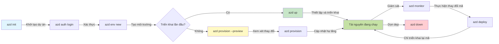
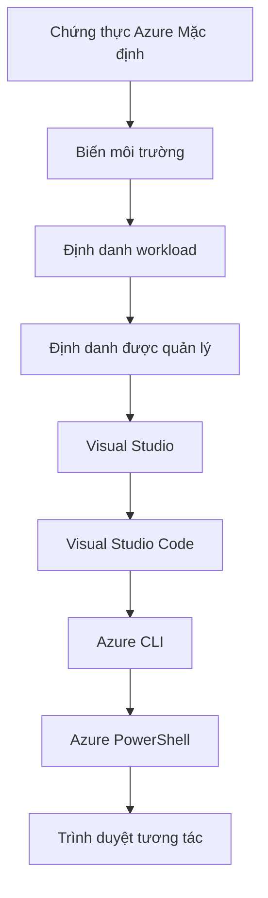

# AZD Basics - Hiểu về Azure Developer CLI

# AZD Basics - Khái niệm cốt lõi và nền tảng

**Chapter Navigation:**
- **📚 Course Home**: [AZD cho Người Mới Bắt Đầu](../../README.md)
- **📖 Current Chapter**: Chapter 1 - Foundation & Quick Start
- **⬅️ Previous**: [Tổng quan khóa học](../../README.md#-chapter-1-foundation--quick-start)
- **➡️ Next**: [Cài đặt & Thiết lập](installation.md)
- **🚀 Next Chapter**: [Chương 2: Phát triển ưu tiên AI](../chapter-02-ai-development/microsoft-foundry-integration.md)

## Introduction

Bài học này giới thiệu cho bạn Azure Developer CLI (azd), một công cụ dòng lệnh mạnh mẽ giúp tăng tốc hành trình từ phát triển cục bộ đến triển khai trên Azure. Bạn sẽ học các khái niệm cơ bản, tính năng cốt lõi và hiểu cách azd đơn giản hóa việc triển khai ứng dụng cloud-native.

## Learning Goals

Khi kết thúc bài học này, bạn sẽ:
- Hiểu Azure Developer CLI là gì và mục đích chính của nó
- Học các khái niệm cốt lõi về templates, environments và services
- Khám phá các tính năng chính bao gồm phát triển dựa trên template và Infrastructure as Code
- Hiểu cấu trúc dự án azd và quy trình làm việc
- Chuẩn bị để cài đặt và cấu hình azd cho môi trường phát triển của bạn

## Learning Outcomes

Sau khi hoàn thành bài học này, bạn sẽ có thể:
- Giải thích vai trò của azd trong quy trình phát triển đám mây hiện đại
- Nhận diện các thành phần của cấu trúc dự án azd
- Mô tả cách templates, environments và services hoạt động cùng nhau
- Hiểu lợi ích của Infrastructure as Code với azd
- Nhận biết các lệnh azd khác nhau và mục đích của chúng

## What is Azure Developer CLI (azd)?

Azure Developer CLI (azd) là một công cụ dòng lệnh được thiết kế để tăng tốc hành trình của bạn từ phát triển cục bộ đến triển khai trên Azure. Nó đơn giản hóa quá trình xây dựng, triển khai và quản lý ứng dụng cloud-native trên Azure.

### What Can You Deploy with azd?

azd hỗ trợ nhiều loại workload—và danh sách này vẫn đang mở rộng. Hiện nay, bạn có thể sử dụng azd để triển khai:

| Workload Type | Examples | Same Workflow? |
|---------------|----------|----------------|
| **Traditional applications** | Ứng dụng web, REST API, trang tĩnh | ✅ `azd up` |
| **Services and microservices** | Container Apps, Function Apps, backend đa dịch vụ | ✅ `azd up` |
| **AI-powered applications** | Ứng dụng chat với Microsoft Foundry Models, giải pháp RAG với AI Search | ✅ `azd up` |
| **Intelligent agents** | Agent thông minh được host trên Foundry, điều phối nhiều agent | ✅ `azd up` |

Mấu chốt là **vòng đời azd vẫn giữ nguyên bất kể bạn đang triển khai gì**. Bạn khởi tạo một dự án, provision hạ tầng, deploy mã của mình, giám sát ứng dụng và dọn dẹp—dù đó là một trang web đơn giản hay một agent AI phức tạp.

Sự liên tục này là thiết kế có chủ ý. azd coi các khả năng AI như một loại service khác mà ứng dụng của bạn có thể sử dụng, chứ không phải là thứ gì đó hoàn toàn khác biệt. Một endpoint chat được hỗ trợ bởi Microsoft Foundry Models, từ góc nhìn của azd, chỉ là một service khác để cấu hình và triển khai.

### 🎯 Why Use AZD? A Real-World Comparison

Hãy so sánh việc triển khai một ứng dụng web đơn giản kèm cơ sở dữ liệu:

#### ❌ KHÔNG DÙNG AZD: Triển khai Azure thủ công (30+ minutes)

```bash
# Bước 1: Tạo nhóm tài nguyên
az group create --name myapp-rg --location eastus

# Bước 2: Tạo App Service Plan
az appservice plan create --name myapp-plan \
  --resource-group myapp-rg \
  --sku B1 --is-linux

# Bước 3: Tạo Ứng dụng Web
az webapp create --name myapp-web-unique123 \
  --resource-group myapp-rg \
  --plan myapp-plan \
  --runtime "NODE:18-lts"

# Bước 4: Tạo tài khoản Cosmos DB (10-15 phút)
az cosmosdb create --name myapp-cosmos-unique123 \
  --resource-group myapp-rg \
  --kind MongoDB

# Bước 5: Tạo cơ sở dữ liệu
az cosmosdb mongodb database create \
  --account-name myapp-cosmos-unique123 \
  --resource-group myapp-rg \
  --name tododb

# Bước 6: Tạo bộ sưu tập
az cosmosdb mongodb collection create \
  --account-name myapp-cosmos-unique123 \
  --resource-group myapp-rg \
  --database-name tododb \
  --name todos

# Bước 7: Lấy chuỗi kết nối
CONN_STR=$(az cosmosdb keys list \
  --name myapp-cosmos-unique123 \
  --resource-group myapp-rg \
  --type connection-strings \
  --query "connectionStrings[0].connectionString" -o tsv)

# Bước 8: Cấu hình cài đặt ứng dụng
az webapp config appsettings set \
  --name myapp-web-unique123 \
  --resource-group myapp-rg \
  --settings MONGODB_URI="$CONN_STR"

# Bước 9: Bật ghi nhật ký
az webapp log config --name myapp-web-unique123 \
  --resource-group myapp-rg \
  --application-logging filesystem \
  --detailed-error-messages true

# Bước 10: Thiết lập Application Insights
az monitor app-insights component create \
  --app myapp-insights \
  --location eastus \
  --resource-group myapp-rg

# Bước 11: Liên kết App Insights với Ứng dụng Web
INSTRUMENTATION_KEY=$(az monitor app-insights component show \
  --app myapp-insights \
  --resource-group myapp-rg \
  --query "instrumentationKey" -o tsv)

az webapp config appsettings set \
  --name myapp-web-unique123 \
  --resource-group myapp-rg \
  --settings APPINSIGHTS_INSTRUMENTATIONKEY="$INSTRUMENTATION_KEY"

# Bước 12: Xây dựng ứng dụng cục bộ
npm install
npm run build

# Bước 13: Tạo gói triển khai
zip -r app.zip . -x "*.git*" "node_modules/*"

# Bước 14: Triển khai ứng dụng
az webapp deployment source config-zip \
  --resource-group myapp-rg \
  --name myapp-web-unique123 \
  --src app.zip

# Bước 15: Chờ và cầu mong nó hoạt động 🙏
# (Không có kiểm tra tự động, cần kiểm tra thủ công)
```

**Vấn đề:**
- ❌ 15+ lệnh cần nhớ và thực thi theo thứ tự
- ❌ 30-45 phút công việc thủ công
- ❌ Dễ mắc lỗi (gõ sai, tham số sai)
- ❌ Chuỗi kết nối bị lộ trong lịch sử terminal
- ❌ Không có rollback tự động nếu có thứ gì đó thất bại
- ❌ Khó tái tạo cho các thành viên trong nhóm
- ❌ Khác nhau mỗi lần (không tái sản xuất được)

#### ✅ VỚI AZD: Triển khai tự động (5 lệnh, 10-15 minutes)

```bash
# Bước 1: Khởi tạo từ mẫu
azd init --template todo-nodejs-mongo

# Bước 2: Xác thực
azd auth login

# Bước 3: Tạo môi trường
azd env new dev

# Bước 4: Xem trước các thay đổi (tùy chọn nhưng khuyến nghị)
azd provision --preview

# Bước 5: Triển khai mọi thứ
azd up

# ✨ Hoàn tất! Mọi thứ đã được triển khai, cấu hình và giám sát
```

**Lợi ích:**
- ✅ **5 lệnh** so với 15+ bước thủ công
- ✅ **10-15 phút** tổng thời gian (chủ yếu chờ Azure)
- ✅ **Không lỗi** - tự động và đã được kiểm thử
- ✅ **Bí mật được quản lý an toàn** qua Key Vault
- ✅ **Hoàn tác tự động** khi thất bại
- ✅ **Có thể tái tạo hoàn toàn** - cùng kết quả mọi lần
- ✅ **Sẵn sàng cho nhóm** - bất kỳ ai cũng có thể triển khai với cùng các lệnh
- ✅ **Hạ tầng như Mã** - templates Bicep được quản lý phiên bản
- ✅ **Giám sát tích hợp sẵn** - Application Insights được cấu hình tự động

### 📊 Giảm Thời gian & Lỗi

| Metric | Manual Deployment | AZD Deployment | Improvement |
|:-------|:------------------|:---------------|:------------|
| **Số lệnh** | 15+ | 5 | 67% fewer |
| **Thời gian** | 30-45 min | 10-15 min | 60% faster |
| **Tỷ lệ lỗi** | ~40% | <5% | 88% reduction |
| **Tính nhất quán** | Thấp (thủ công) | 100% (tự động) | Perfect |
| **Onboarding đội** | 2-4 hours | 30 minutes | 75% faster |
| **Thời gian hoàn tác** | 30+ min (thủ công) | 2 min (tự động) | 93% faster |

## Core Concepts

### Templates
Templates là nền tảng của azd. Chúng bao gồm:
- **Mã ứng dụng** - Mã nguồn và các phụ thuộc của bạn
- **Định nghĩa hạ tầng** - Các tài nguyên Azure được định nghĩa bằng Bicep hoặc Terraform
- **Tệp cấu hình** - Cài đặt và biến môi trường
- **Script triển khai** - Quy trình triển khai tự động

### Environments
Môi trường đại diện cho các đích triển khai khác nhau:
- **Development** - Dùng để kiểm thử và phát triển
- **Staging** - Môi trường tiền sản xuất
- **Production** - Môi trường sản xuất (đang chạy)

Mỗi môi trường duy trì riêng:
- Nhóm tài nguyên Azure
- Cài đặt cấu hình
- Trạng thái triển khai

### Services
Dịch vụ là các khối xây dựng của ứng dụng của bạn:
- **Frontend** - Ứng dụng web, SPA
- **Backend** - APIs, microservices
- **Database** - Giải pháp lưu trữ dữ liệu
- **Storage** - Lưu trữ tệp và blob

## Key Features

### 1. Template-Driven Development
```bash
# Duyệt các mẫu có sẵn
azd template list

# Khởi tạo từ một mẫu
azd init --template <template-name>
```

### 2. Infrastructure as Code
- **Bicep** - Ngôn ngữ miền chuyên biệt của Azure
- **Terraform** - Công cụ hạ tầng đa đám mây
- **ARM Templates** - Mẫu Azure Resource Manager

### 3. Integrated Workflows
```bash
# Quy trình triển khai hoàn chỉnh
azd up            # Cấp phát + Triển khai — không cần can thiệp cho lần thiết lập đầu tiên

# 🧪 MỚI: Xem trước các thay đổi hạ tầng trước khi triển khai (AN TOÀN)
azd provision --preview    # Mô phỏng triển khai hạ tầng mà không thực hiện thay đổi

azd provision     # Tạo tài nguyên Azure — nếu bạn cập nhật hạ tầng, hãy dùng tùy chọn này
azd deploy        # Triển khai mã ứng dụng hoặc triển khai lại mã ứng dụng sau khi cập nhật
azd down          # Dọn dẹp tài nguyên
```

#### 🛡️ Safe Infrastructure Planning with Preview
Lệnh `azd provision --preview` là một thay đổi lớn cho các triển khai an toàn:
- **Phân tích chạy thử** - Hiển thị những gì sẽ được tạo, sửa đổi hoặc xóa
- **Không rủi ro** - Không có thay đổi thực tế nào được thực hiện trên môi trường Azure của bạn
- **Hợp tác nhóm** - Chia sẻ kết quả xem trước trước khi triển khai
- **Ước tính chi phí** - Hiểu chi phí tài nguyên trước khi cam kết

```bash
# Ví dụ về quy trình xem trước
azd provision --preview           # Xem những gì sẽ thay đổi
# Xem lại kết quả, thảo luận với nhóm
azd provision                     # Áp dụng các thay đổi một cách tự tin
```

### 📊 Visual: AZD Development Workflow


**Giải thích quy trình:**
1. **Init** - Bắt đầu với mẫu hoặc dự án mới
2. **Auth** - Xác thực với Azure
3. **Environment** - Tạo môi trường triển khai cô lập
4. **Preview** - 🆕 Luôn xem trước thay đổi hạ tầng trước (thực hành an toàn)
5. **Provision** - Tạo/cập nhật tài nguyên Azure
6. **Deploy** - Đẩy mã ứng dụng của bạn
7. **Monitor** - Theo dõi hiệu suất ứng dụng
8. **Iterate** - Thực hiện thay đổi và triển khai lại mã
9. **Cleanup** - Xóa tài nguyên khi hoàn thành

### 4. Environment Management
```bash
# Tạo và quản lý môi trường
azd env new <environment-name>
azd env select <environment-name>
azd env list
```

### 5. Extensions and AI Commands

azd sử dụng hệ thống extension để thêm khả năng vượt ra ngoài CLI cốt lõi. Điều này đặc biệt hữu ích cho các workload AI:

```bash
# Liệt kê các phần mở rộng có sẵn
azd extension list

# Cài đặt phần mở rộng Foundry agents
azd extension install azure.ai.agents

# Khởi tạo dự án tác nhân AI từ tệp manifest
azd ai agent init -m agent-manifest.yaml

# Khởi động máy chủ MCP cho phát triển hỗ trợ bởi AI (Alpha)
azd mcp start
```

> Extensions are covered in detail in [Chương 2: Phát triển ưu tiên AI](../chapter-02-ai-development/agents.md) and the [Lệnh AZD AI CLI](../chapter-08-production/production-ai-practices.md#azd-ai-cli-commands-and-extensions) reference.

## 📁 Project Structure

Một cấu trúc dự án azd điển hình:
```
my-app/
├── .azd/                    # azd configuration
│   └── config.json
├── .azure/                  # Azure deployment artifacts
├── .devcontainer/          # Development container config
├── .github/workflows/      # GitHub Actions
├── .vscode/               # VS Code settings
├── infra/                 # Infrastructure code
│   ├── main.bicep        # Main infrastructure template
│   ├── main.parameters.json
│   └── modules/          # Reusable modules
├── src/                  # Application source code
│   ├── api/             # Backend services
│   └── web/             # Frontend application
├── azure.yaml           # azd project configuration
└── README.md
```

## 🔧 Configuration Files

### azure.yaml
Tệp cấu hình chính của dự án:
```yaml
name: my-awesome-app
metadata:
  template: my-template@1.0.0

services:
  web:
    project: ./src/web
    language: js
    host: appservice
  api:
    project: ./src/api
    language: js
    host: appservice

hooks:
  preprovision:
    shell: pwsh
    run: echo "Preparing to provision..."
```

### .azure/config.json
Cấu hình theo môi trường:
```json
{
  "version": 1,
  "defaultEnvironment": "dev",
  "environments": {
    "dev": {
      "subscriptionId": "your-subscription-id",
      "location": "eastus"
    }
  }
}
```

## 🎪 Common Workflows with Hands-On Exercises

> **💡 Mẹo học tập:** Thực hiện các bài tập này theo thứ tự để xây dựng kỹ năng AZD của bạn một cách tuần tự.

### 🎯 Exercise 1: Initialize Your First Project

**Mục tiêu:** Tạo một dự án AZD và khám phá cấu trúc của nó

**Các bước:**
```bash
# Sử dụng mẫu đã được chứng minh
azd init --template todo-nodejs-mongo

# Khám phá các tệp được tạo
ls -la  # Xem tất cả các tệp bao gồm cả tệp ẩn

# Các tệp chính được tạo:
# - azure.yaml (cấu hình chính)
# - infra/ (mã hạ tầng)
# - src/ (mã ứng dụng)
```

**✅ Thành công:** Bạn có tệp azure.yaml và các thư mục infra/ và src/

---

### 🎯 Exercise 2: Deploy to Azure

**Mục tiêu:** Hoàn thành triển khai từ đầu đến cuối

**Các bước:**
```bash
# 1. Xác thực
az login && azd auth login

# 2. Tạo môi trường
azd env new dev
azd env set AZURE_LOCATION eastus

# 3. Xem trước thay đổi (ĐƯỢC KHUYẾN NGHỊ)
azd provision --preview

# 4. Triển khai mọi thứ
azd up

# 5. Xác minh triển khai
azd show    # Xem URL ứng dụng của bạn
```

**Thời gian dự kiến:** 10-15 phút  
**✅ Thành công:** URL ứng dụng mở trong trình duyệt

---

### 🎯 Exercise 3: Multiple Environments

**Mục tiêu:** Triển khai lên dev và staging

**Các bước:**
```bash
# Đã có dev, tạo staging
azd env new staging
azd env set AZURE_LOCATION westus2
azd up

# Chuyển đổi giữa chúng
azd env list
azd env select dev
```

**✅ Thành công:** Hai nhóm tài nguyên riêng biệt trong Azure Portal

---

### 🛡️ Clean Slate: `azd down --force --purge`

Khi bạn cần đặt lại hoàn toàn:

```bash
azd down --force --purge
```

**Nó thực hiện:**
- `--force`: Không yêu cầu xác nhận
- `--purge`: Xóa toàn bộ trạng thái cục bộ và tài nguyên Azure

**Sử dụng khi:**
- Triển khai thất bại giữa chừng
- Chuyển dự án
- Cần bắt đầu mới

---

## 🎪 Tham chiếu quy trình gốc

### Starting a New Project
```bash
# Phương pháp 1: Sử dụng mẫu hiện có
azd init --template todo-nodejs-mongo

# Phương pháp 2: Bắt đầu từ đầu
azd init

# Phương pháp 3: Sử dụng thư mục hiện tại
azd init .
```

### Development Cycle
```bash
# Thiết lập môi trường phát triển
azd auth login
azd env new dev
azd env select dev

# Triển khai mọi thứ
azd up

# Thực hiện thay đổi và triển khai lại
azd deploy

# Dọn dẹp khi hoàn tất
azd down --force --purge # Lệnh trong Azure Developer CLI là một 'đặt lại hoàn toàn' cho môi trường của bạn—đặc biệt hữu ích khi bạn đang khắc phục các triển khai thất bại, dọn dẹp các tài nguyên bị bỏ rơi, hoặc chuẩn bị cho một lần triển khai mới.
```

## Hiểu về `azd down --force --purge`
Lệnh `azd down --force --purge` là một cách mạnh mẽ để phá dỡ hoàn toàn môi trường azd của bạn và tất cả các tài nguyên liên quan. Dưới đây là phân tích những gì mỗi cờ thực hiện:
```
--force
```
- Bỏ qua lời nhắc xác nhận.
- Hữu ích cho tự động hóa hoặc scripting khi không thể nhập tay.
- Đảm bảo quá trình dỡ bỏ tiếp tục không bị gián đoạn, ngay cả khi CLI phát hiện sự không nhất quán.

```
--purge
```
Xóa **tất cả siêu dữ liệu liên quan**, bao gồm:
- Trạng thái môi trường
- Thư mục cục bộ `.azure`
- Thông tin triển khai được lưu cache
- Ngăn azd "ghi nhớ" các triển khai trước đó, điều này có thể gây ra các vấn đề như nhóm tài nguyên không khớp hoặc tham chiếu registry lỗi thời.


### Tại sao nên dùng cả hai?
Khi bạn gặp bế tắc với `azd up` do trạng thái tồn đọng hoặc các triển khai một phần, kết hợp này đảm bảo một **khởi đầu sạch**.

Nó đặc biệt hữu ích sau khi xóa tài nguyên thủ công trong Azure portal hoặc khi chuyển đổi template, môi trường, hoặc quy ước đặt tên nhóm tài nguyên.


### Quản lý nhiều môi trường
```bash
# Tạo môi trường staging
azd env new staging
azd env select staging
azd up

# Chuyển về dev
azd env select dev

# So sánh các môi trường
azd env list
```

## 🔐 Authentication and Credentials

Hiểu về xác thực là điều then chốt để triển khai azd thành công. Azure sử dụng nhiều phương thức xác thực, và azd tận dụng cùng chuỗi thông tin đăng nhập được dùng bởi các công cụ Azure khác.

### Azure CLI Authentication (`az login`)

Trước khi sử dụng azd, bạn cần xác thực với Azure. Phương thức phổ biến nhất là dùng Azure CLI:

```bash
# Đăng nhập tương tác (mở trình duyệt)
az login

# Đăng nhập với tenant cụ thể
az login --tenant <tenant-id>

# Đăng nhập bằng đối tượng dịch vụ
az login --service-principal -u <app-id> -p <password> --tenant <tenant-id>

# Kiểm tra trạng thái đăng nhập hiện tại
az account show

# Liệt kê các đăng ký có sẵn
az account list --output table

# Đặt đăng ký mặc định
az account set --subscription <subscription-id>
```

### Authentication Flow
1. **Đăng nhập tương tác**: Mở trình duyệt mặc định của bạn để xác thực
2. **Device Code Flow**: Dành cho môi trường không có trình duyệt
3. **Service Principal**: Cho kịch bản tự động hóa và CI/CD
4. **Managed Identity**: Cho ứng dụng chạy trên Azure

### DefaultAzureCredential Chain

`DefaultAzureCredential` là một loại thông tin đăng nhập cung cấp trải nghiệm xác thực đơn giản bằng cách tự động thử nhiều nguồn thông tin đăng nhập theo một thứ tự cụ thể:

#### Credential Chain Order

#### 1. Environment Variables
```bash
# Thiết lập biến môi trường cho service principal
export AZURE_CLIENT_ID="<app-id>"
export AZURE_CLIENT_SECRET="<password>"
export AZURE_TENANT_ID="<tenant-id>"
```

#### 2. Workload Identity (Kubernetes/GitHub Actions)
Được sử dụng tự động trong:
- Azure Kubernetes Service (AKS) với Workload Identity
- GitHub Actions với liên kết OIDC
- Các kịch bản danh tính liên kết khác

#### 3. Managed Identity
Cho các tài nguyên Azure như:
- Máy ảo
- App Service
- Azure Functions
- Container Instances

```bash
# Kiểm tra xem có đang chạy trên tài nguyên Azure với managed identity hay không
az account show --query "user.type" --output tsv
# Trả về: "servicePrincipal" nếu đang sử dụng managed identity
```

#### 4. Developer Tools Integration
- **Visual Studio**: Tự động sử dụng tài khoản đã đăng nhập
- **VS Code**: Sử dụng thông tin đăng nhập tiện ích mở rộng Azure Account
- **Azure CLI**: Sử dụng thông tin đăng nhập từ `az login` (thường dùng nhất cho phát triển cục bộ)

### AZD Authentication Setup

```bash
# Phương pháp 1: Sử dụng Azure CLI (Được khuyến nghị cho môi trường phát triển)
az login
azd auth login  # Sử dụng thông tin đăng nhập Azure CLI hiện có

# Phương pháp 2: Xác thực azd trực tiếp
azd auth login --use-device-code  # Dành cho các môi trường không có giao diện (headless)

# Phương pháp 3: Kiểm tra trạng thái xác thực
azd auth login --check-status

# Phương pháp 4: Đăng xuất và xác thực lại
azd auth logout
azd auth login
```

### Authentication Best Practices

#### For Local Development
```bash
# 1. Đăng nhập bằng Azure CLI
az login

# 2. Xác minh đăng ký chính xác
az account show
az account set --subscription "Your Subscription Name"

# 3. Sử dụng azd với thông tin đăng nhập hiện có
azd auth login
```

#### For CI/CD Pipelines
```yaml
# GitHub Actions example
- name: Azure Login
  uses: azure/login@v1
  with:
    creds: ${{ secrets.AZURE_CREDENTIALS }}

- name: Deploy with azd
  run: |
    azd auth login --client-id ${{ secrets.AZURE_CLIENT_ID }} \
                    --client-secret ${{ secrets.AZURE_CLIENT_SECRET }} \
                    --tenant-id ${{ secrets.AZURE_TENANT_ID }}
    azd up --no-prompt
```

#### For Production Environments
- Sử dụng **Managed Identity** khi chạy trên tài nguyên Azure
- Sử dụng **Service Principal** cho kịch bản tự động hóa
- Tránh lưu thông tin đăng nhập trong mã hoặc tệp cấu hình
- Sử dụng **Azure Key Vault** cho cấu hình nhạy cảm

### Common Authentication Issues and Solutions

#### Vấn đề: "Không tìm thấy đăng ký"
```bash
# Giải pháp: Đặt đăng ký mặc định
az account list --output table
az account set --subscription "<subscription-id>"
azd env set AZURE_SUBSCRIPTION_ID "<subscription-id>"
```

#### Vấn đề: "Không đủ quyền"
```bash
# Giải pháp: Kiểm tra và gán các vai trò cần thiết
az role assignment list --assignee $(az account show --query user.name --output tsv)

# Các vai trò cần thiết phổ biến:
# - Contributor (để quản lý tài nguyên)
# - User Access Administrator (để gán vai trò)
```

#### Vấn đề: "Token hết hạn"
```bash
# Giải pháp: Xác thực lại
az logout
az login
azd auth logout
azd auth login
```

### Authentication in Different Scenarios

#### Phát triển cục bộ
```bash
# Tài khoản phát triển cá nhân
az login
azd auth login
```

#### Phát triển theo nhóm
```bash
# Sử dụng tenant cụ thể cho tổ chức
az login --tenant contoso.onmicrosoft.com
azd auth login
```

#### Kịch bản đa tenant
```bash
# Chuyển đổi giữa các khách thuê
az login --tenant tenant1.onmicrosoft.com
# Triển khai đến khách thuê 1
azd up

az login --tenant tenant2.onmicrosoft.com  
# Triển khai đến khách thuê 2
azd up
```

### Cân nhắc về bảo mật
1. **Lưu trữ thông tin đăng nhập**: Không bao giờ lưu thông tin đăng nhập trong mã nguồn
2. **Giới hạn phạm vi**: Sử dụng nguyên tắc ít quyền nhất cho service principals
3. **Xoay vòng mã thông báo**: Thường xuyên xoay vòng bí mật của service principal
4. **Nhật ký kiểm toán**: Giám sát hoạt động xác thực và triển khai
5. **Bảo mật mạng**: Sử dụng điểm cuối riêng tư khi có thể

### Khắc phục sự cố xác thực

```bash
# Gỡ lỗi sự cố xác thực
azd auth login --check-status
az account show
az account get-access-token

# Các lệnh chẩn đoán phổ biến
whoami                          # Ngữ cảnh người dùng hiện tại
az ad signed-in-user show      # Chi tiết người dùng Azure AD
az group list                  # Kiểm tra truy cập tài nguyên
```

## Hiểu về `azd down --force --purge`

### Khám phá
```bash
azd template list              # Duyệt mẫu
azd template show <template>   # Chi tiết mẫu
azd init --help               # Tùy chọn khởi tạo
```

### Quản lý Dự án
```bash
azd show                     # Tổng quan dự án
azd env show                 # Môi trường hiện tại
azd config list             # Cài đặt cấu hình
```

### Giám sát
```bash
azd monitor                  # Mở phần giám sát trong portal Azure
azd monitor --logs           # Xem nhật ký ứng dụng
azd monitor --live           # Xem số liệu thời gian thực
azd pipeline config          # Thiết lập CI/CD
```

## Thực hành tốt nhất

### 1. Sử dụng tên có ý nghĩa
```bash
# Tốt
azd env new production-east
azd init --template web-app-secure

# Tránh
azd env new env1
azd init --template template1
```

### 2. Tận dụng mẫu
- Bắt đầu với các mẫu hiện có
- Tùy chỉnh theo nhu cầu của bạn
- Tạo các mẫu có thể tái sử dụng cho tổ chức của bạn

### 3. Cách ly môi trường
- Sử dụng các môi trường riêng biệt cho dev/staging/prod
- Không bao giờ triển khai trực tiếp tới production từ máy cục bộ
- Sử dụng pipeline CI/CD cho các triển khai production

### 4. Quản lý cấu hình
- Sử dụng biến môi trường cho dữ liệu nhạy cảm
- Lưu cấu hình trong hệ thống kiểm soát phiên bản
- Ghi tài liệu các cài đặt theo môi trường

## Lộ trình học tập

### Người mới (Tuần 1-2)
1. Cài đặt azd và xác thực
2. Triển khai một mẫu đơn giản
3. Hiểu cấu trúc dự án
4. Học các lệnh cơ bản (up, down, deploy)

### Trung cấp (Tuần 3-4)
1. Tùy chỉnh các mẫu
2. Quản lý nhiều môi trường
3. Hiểu mã hạ tầng
4. Thiết lập pipeline CI/CD

### Nâng cao (Tuần 5+)
1. Tạo các mẫu tùy chỉnh
2. Các mẫu hạ tầng nâng cao
3. Triển khai đa vùng
4. Cấu hình mức doanh nghiệp

## Bước tiếp theo

**📖 Tiếp tục Học Chương 1:**
- [Cài đặt & Thiết lập](installation.md) - Cài đặt và cấu hình azd
- [Dự án đầu tiên của bạn](first-project.md) - Hoàn thành hướng dẫn thực hành
- [Hướng dẫn cấu hình](configuration.md) - Tùy chọn cấu hình nâng cao

**🎯 Sẵn sàng cho Chương tiếp theo?**
- [Chương 2: Phát triển hướng AI](../chapter-02-ai-development/microsoft-foundry-integration.md) - Bắt đầu xây dựng ứng dụng AI

## Tài nguyên bổ sung

- [Tổng quan về Azure Developer CLI](https://learn.microsoft.com/en-us/azure/developer/azure-developer-cli/)
- [Bộ sưu tập mẫu](https://azure.github.io/awesome-azd/)
- [Ví dụ cộng đồng](https://github.com/Azure-Samples)

---

## 🙋 Câu hỏi thường gặp

### Câu hỏi chung

**Q: Sự khác biệt giữa AZD và Azure CLI là gì?**

A: Azure CLI (`az`) dùng để quản lý các tài nguyên Azure đơn lẻ. AZD (`azd`) dùng để quản lý toàn bộ ứng dụng:

```bash
# Azure CLI - Quản lý tài nguyên cấp thấp
az webapp create --name myapp --resource-group rg
az sql server create --name myserver --resource-group rg
# ...cần nhiều lệnh hơn nữa

# AZD - Quản lý cấp ứng dụng
azd up  # Triển khai toàn bộ ứng dụng với tất cả tài nguyên
```

**Hãy nghĩ như sau:**
- `az` = Thao tác trên từng viên Lego
- `azd` = Làm việc với cả bộ Lego hoàn chỉnh

---

**Q: Có cần biết Bicep hoặc Terraform để sử dụng AZD không?**

A: Không! Bắt đầu với các mẫu:
```bash
# Sử dụng mẫu có sẵn - không cần kiến thức về IaC
azd init --template todo-nodejs-mongo
azd up
```

Bạn có thể học Bicep sau để tùy chỉnh hạ tầng. Các mẫu cung cấp ví dụ hoạt động để học hỏi.

---

**Q: Chi phí để chạy các mẫu AZD là bao nhiêu?**

A: Chi phí thay đổi tùy mẫu. Hầu hết các mẫu phát triển có chi phí $50-150/tháng:

```bash
# Xem trước chi phí trước khi triển khai
azd provision --preview

# Luôn dọn dẹp khi không sử dụng
azd down --force --purge  # Xóa tất cả tài nguyên
```

**Mẹo hay:** Sử dụng các hạng mục miễn phí nếu có:
- App Service: Hạng F1 (Miễn phí)
- Microsoft Foundry Models: Azure OpenAI 50,000 tokens/month free
- Cosmos DB: 1000 RU/s free tier

---

**Q: Tôi có thể sử dụng AZD với các tài nguyên Azure hiện có không?**

A: Có, nhưng dễ hơn khi bắt đầu từ mới. AZD hoạt động tốt nhất khi nó quản lý vòng đời đầy đủ. Đối với tài nguyên hiện có:
```bash
# Tùy chọn 1: Nhập các tài nguyên hiện có (nâng cao)
azd init
# Sau đó sửa đổi infra/ để tham chiếu tới các tài nguyên hiện có

# Tùy chọn 2: Bắt đầu từ đầu (được khuyến nghị)
azd init --template matching-your-stack
azd up  # Tạo môi trường mới
```

---

**Q: Làm sao để chia sẻ dự án với đồng đội?**

A: Commit dự án AZD lên Git (nhưng KHÔNG bao gồm thư mục .azure):
```bash
# Đã có trong .gitignore theo mặc định
.azure/        # Chứa các bí mật và dữ liệu môi trường
*.env          # Các biến môi trường

# Các thành viên nhóm sau:
git clone <your-repo>
azd auth login
azd env new <their-name>-dev
azd up
```

Mọi người sẽ có hạ tầng giống nhau từ cùng một mẫu.

---

### Câu hỏi khắc phục sự cố

**Q: "azd up" thất bại giữa chừng. Tôi nên làm gì?**

A: Kiểm tra lỗi, sửa nó, rồi thử lại:
```bash
# Xem nhật ký chi tiết
azd show

# Các cách khắc phục phổ biến:

# 1. Nếu vượt quá hạn ngạch:
azd env set AZURE_LOCATION "westus2"  # Thử vùng khác

# 2. Nếu xung đột tên tài nguyên:
azd down --force --purge  # Xóa sạch
azd up  # Thử lại

# 3. Nếu xác thực hết hạn:
az login
azd auth login
azd up
```

**Vấn đề phổ biến nhất:** Chọn sai đăng ký Azure
```bash
az account list --output table
az account set --subscription "<correct-subscription>"
```

---

**Q: Làm sao để chỉ triển khai thay đổi mã mà không tái cấp phát hạ tầng?**

A: Dùng `azd deploy` thay vì `azd up`:
```bash
azd up          # Lần đầu: chuẩn bị + triển khai (chậm)

# Thực hiện thay đổi mã...

azd deploy      # Các lần sau: chỉ triển khai (nhanh)
```

So sánh tốc độ:
- `azd up`: 10-15 phút (cấp phát hạ tầng)
- `azd deploy`: 2-5 phút (chỉ cập nhật mã)

---

**Q: Tôi có thể tùy chỉnh các mẫu hạ tầng không?**

A: Có! Chỉnh sửa các tệp Bicep trong `infra/`:
```bash
# Sau khi chạy azd init
cd infra/
code main.bicep  # Chỉnh sửa trong VS Code

# Xem trước các thay đổi
azd provision --preview

# Áp dụng các thay đổi
azd provision
```

**Mẹo:** Bắt đầu nhỏ - thay đổi SKU trước:
```bicep
// infra/main.bicep
sku: {
  name: 'B1'  // Change to 'P1V2' for production
}
```

---

**Q: Làm sao để xóa mọi thứ AZD đã tạo?**

A: Một lệnh sẽ xóa tất cả tài nguyên:
```bash
azd down --force --purge

# Điều này xóa:
# - Tất cả tài nguyên Azure
# - Nhóm tài nguyên
# - Trạng thái môi trường cục bộ
# - Dữ liệu triển khai được lưu trong bộ nhớ đệm
```

**Luôn chạy lệnh này khi:**
- Hoàn thành thử nghiệm một mẫu
- Chuyển sang dự án khác
- Muốn bắt đầu lại từ đầu

**Tiết kiệm chi phí:** Xóa các tài nguyên không sử dụng = $0 phí

---

**Q: Nếu tôi vô tình xóa tài nguyên trong Azure Portal thì sao?**

A: Trạng thái AZD có thể bị lệch. Cách tiếp cận làm sạch toàn bộ:
```bash
# 1. Xóa trạng thái cục bộ
azd down --force --purge

# 2. Bắt đầu lại từ đầu
azd up

# Phương án thay thế: Để AZD phát hiện và khắc phục
azd provision  # Sẽ tạo các tài nguyên bị thiếu
```

---

### Câu hỏi nâng cao

**Q: Tôi có thể sử dụng AZD trong pipeline CI/CD không?**

A: Có! Ví dụ GitHub Actions:
```yaml
# .github/workflows/deploy.yml
name: Deploy with AZD

on:
  push:
    branches: [main]

jobs:
  deploy:
    runs-on: ubuntu-latest
    steps:
      - uses: actions/checkout@v2
      
      - name: Install azd
        run: curl -fsSL https://aka.ms/install-azd.sh | bash
      
      - name: Azure Login
        run: |
          azd auth login \
            --client-id ${{ secrets.AZURE_CLIENT_ID }} \
            --client-secret ${{ secrets.AZURE_CLIENT_SECRET }} \
            --tenant-id ${{ secrets.AZURE_TENANT_ID }}
      
      - name: Deploy
        run: azd up --no-prompt
```

---

**Q: Làm sao xử lý bí mật và dữ liệu nhạy cảm?**

A: AZD tích hợp với Azure Key Vault tự động:
```bash
# Các bí mật được lưu trữ trong Key Vault, không lưu trong mã nguồn
azd env set DATABASE_PASSWORD "$(openssl rand -base64 32)"

# AZD tự động:
# 1. Tạo Key Vault
# 2. Lưu trữ bí mật
# 3. Cấp quyền truy cập cho ứng dụng thông qua Managed Identity
# 4. Chèn vào thời gian chạy
```

**Không bao giờ commit:**
- `.azure/` folder (chứa dữ liệu môi trường)
- `.env` files (bí mật cục bộ)
- Chuỗi kết nối

---

**Q: Tôi có thể triển khai đến nhiều vùng không?**

A: Có, tạo môi trường cho từng vùng:
```bash
# Môi trường miền Đông Hoa Kỳ
azd env new prod-eastus
azd env set AZURE_LOCATION eastus
azd up

# Môi trường Tây Âu
azd env new prod-westeurope
azd env set AZURE_LOCATION westeurope
azd up

# Mỗi môi trường độc lập
azd env list
```

Đối với ứng dụng thực sự đa vùng, tùy chỉnh mẫu Bicep để triển khai đến nhiều vùng cùng lúc.

---

**Q: Tôi có thể nhận trợ giúp ở đâu nếu bị mắc kẹt?**

1. **Tài liệu AZD:** https://learn.microsoft.com/azure/developer/azure-developer-cli/
2. **GitHub Issues:** https://github.com/Azure/azure-dev/issues
3. **Discord:** [Azure Discord](https://discord.gg/microsoft-azure) - kênh #azure-developer-cli
4. **Stack Overflow:** Tag `azure-developer-cli`
5. **Khóa học này:** [Hướng dẫn khắc phục sự cố](../chapter-07-troubleshooting/common-issues.md)

**Mẹo hay:** Trước khi hỏi, hãy chạy:
```bash
azd show       # Hiển thị trạng thái hiện tại
azd version    # Hiển thị phiên bản của bạn
```
Bao gồm thông tin này trong câu hỏi của bạn để được trợ giúp nhanh hơn.

---

## 🎓 Tiếp theo là gì?

Bây giờ bạn đã hiểu các nguyên tắc cơ bản của AZD. Chọn con đường của bạn:

### 🎯 Dành cho Người mới bắt đầu:
1. **Tiếp theo:** [Cài đặt & Thiết lập](installation.md) - Cài AZD trên máy của bạn
2. **Sau đó:** [Dự án đầu tiên của bạn](first-project.md) - Triển khai ứng dụng đầu tiên của bạn
3. **Thực hành:** Hoàn thành tất cả 3 bài tập trong bài học này

### 🚀 Dành cho Nhà phát triển AI:
1. **Chuyển tới:** [Chương 2: Phát triển hướng AI](../chapter-02-ai-development/microsoft-foundry-integration.md)
2. **Triển khai:** Bắt đầu với `azd init --template get-started-with-ai-chat`
3. **Học:** Xây dựng trong khi triển khai

### 🏗️ Dành cho Nhà phát triển có kinh nghiệm:
1. **Xem lại:** [Hướng dẫn cấu hình](configuration.md) - Cài đặt nâng cao
2. **Khám phá:** [Hạ tầng dưới dạng mã](../chapter-04-infrastructure/provisioning.md) - Tìm hiểu sâu về Bicep
3. **Xây dựng:** Tạo các mẫu tùy chỉnh cho stack của bạn

---

**Điều hướng chương:**
- **📚 Trang chính của khóa học**: [AZD cho Người mới bắt đầu](../../README.md)
- **📖 Chương hiện tại**: Chương 1 - Nền tảng & Bắt đầu nhanh  
- **⬅️ Trước**: [Tổng quan khóa học](../../README.md#-chapter-1-foundation--quick-start)
- **➡️ Tiếp theo**: [Cài đặt & Thiết lập](installation.md)
- **🚀 Chương tiếp theo**: [Chương 2: Phát triển hướng AI](../chapter-02-ai-development/microsoft-foundry-integration.md)

---

<!-- CO-OP TRANSLATOR DISCLAIMER START -->
**Disclaimer**:
Văn bản này đã được dịch bằng dịch vụ dịch thuật AI [Co-op Translator](https://github.com/Azure/co-op-translator). Mặc dù chúng tôi nỗ lực đảm bảo độ chính xác, xin lưu ý rằng các bản dịch tự động có thể chứa lỗi hoặc không chính xác. Tài liệu gốc bằng ngôn ngữ gốc nên được coi là nguồn có thẩm quyền. Đối với các thông tin quan trọng, khuyến nghị sử dụng dịch vụ dịch thuật chuyên nghiệp do con người thực hiện. Chúng tôi không chịu trách nhiệm cho bất kỳ hiểu lầm hoặc diễn giải sai nào phát sinh từ việc sử dụng bản dịch này.
<!-- CO-OP TRANSLATOR DISCLAIMER END -->