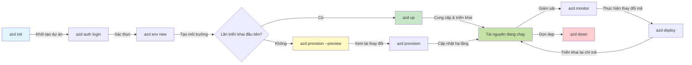
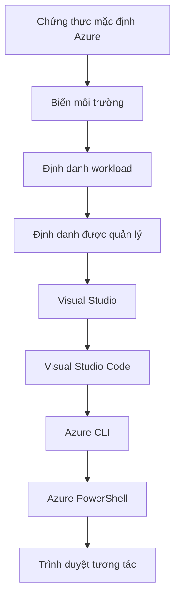

# AZD Basics - Hiểu về Azure Developer CLI

# AZD Basics - Khái niệm cốt lõi và nền tảng

**Chapter Navigation:**
- **📚 Course Home**: [AZD For Beginners](../../README.md)
- **📖 Current Chapter**: Chương 1 - Nền tảng & Bắt đầu nhanh
- **⬅️ Previous**: [Course Overview](../../README.md#-chapter-1-foundation--quick-start)
- **➡️ Next**: [Installation & Setup](installation.md)
- **🚀 Next Chapter**: [Chapter 2: AI-First Development](../chapter-02-ai-development/microsoft-foundry-integration.md)

## Giới thiệu

Bài học này giới thiệu cho bạn Azure Developer CLI (azd), một công cụ dòng lệnh mạnh mẽ giúp tăng tốc hành trình từ phát triển cục bộ đến triển khai lên Azure. Bạn sẽ tìm hiểu các khái niệm cơ bản, tính năng chính và cách azd đơn giản hóa việc triển khai ứng dụng cloud-native.

## Mục tiêu học tập

Kết thúc bài học này, bạn sẽ:
- Hiểu Azure Developer CLI là gì và mục đích chính của nó
- Học các khái niệm cốt lõi về template, environments và services
- Khám phá các tính năng chính bao gồm phát triển theo template và Infrastructure as Code
- Hiểu cấu trúc dự án azd và quy trình làm việc
- Chuẩn bị để cài đặt và cấu hình azd cho môi trường phát triển của bạn

## Kết quả học tập

Sau khi hoàn thành bài học này, bạn sẽ có thể:
- Giải thích vai trò của azd trong quy trình phát triển cloud hiện đại
- Nhận diện các thành phần của cấu trúc dự án azd
- Mô tả cách templates, environments và services hoạt động cùng nhau
- Hiểu lợi ích của Infrastructure as Code với azd
- Nhận biết các lệnh azd khác nhau và mục đích của chúng

## Azure Developer CLI (azd) là gì?

Azure Developer CLI (azd) là một công cụ dòng lệnh được thiết kế để tăng tốc hành trình của bạn từ phát triển cục bộ đến triển khai trên Azure. Nó đơn giản hóa quy trình xây dựng, triển khai và quản lý ứng dụng cloud-native trên Azure.

### 🎯 Tại sao dùng AZD? So sánh thực tế

Hãy so sánh việc triển khai một ứng dụng web đơn giản có cơ sở dữ liệu:

#### ❌ KHÔNG DÙNG AZD: Triển khai Azure thủ công (30+ phút)

```bash
# Bước 1: Tạo nhóm tài nguyên
az group create --name myapp-rg --location eastus

# Bước 2: Tạo App Service Plan
az appservice plan create --name myapp-plan \
  --resource-group myapp-rg \
  --sku B1 --is-linux

# Bước 3: Tạo Web App
az webapp create --name myapp-web-unique123 \
  --resource-group myapp-rg \
  --plan myapp-plan \
  --runtime "NODE:18-lts"

# Bước 4: Tạo tài khoản Cosmos DB (10-15 phút)
az cosmosdb create --name myapp-cosmos-unique123 \
  --resource-group myapp-rg \
  --kind MongoDB

# Bước 5: Tạo cơ sở dữ liệu
az cosmosdb mongodb database create \
  --account-name myapp-cosmos-unique123 \
  --resource-group myapp-rg \
  --name tododb

# Bước 6: Tạo bộ sưu tập
az cosmosdb mongodb collection create \
  --account-name myapp-cosmos-unique123 \
  --resource-group myapp-rg \
  --database-name tododb \
  --name todos

# Bước 7: Lấy chuỗi kết nối
CONN_STR=$(az cosmosdb keys list \
  --name myapp-cosmos-unique123 \
  --resource-group myapp-rg \
  --type connection-strings \
  --query "connectionStrings[0].connectionString" -o tsv)

# Bước 8: Cấu hình cài đặt ứng dụng
az webapp config appsettings set \
  --name myapp-web-unique123 \
  --resource-group myapp-rg \
  --settings MONGODB_URI="$CONN_STR"

# Bước 9: Bật ghi nhật ký
az webapp log config --name myapp-web-unique123 \
  --resource-group myapp-rg \
  --application-logging filesystem \
  --detailed-error-messages true

# Bước 10: Thiết lập Application Insights
az monitor app-insights component create \
  --app myapp-insights \
  --location eastus \
  --resource-group myapp-rg

# Bước 11: Liên kết Application Insights với Web App
INSTRUMENTATION_KEY=$(az monitor app-insights component show \
  --app myapp-insights \
  --resource-group myapp-rg \
  --query "instrumentationKey" -o tsv)

az webapp config appsettings set \
  --name myapp-web-unique123 \
  --resource-group myapp-rg \
  --settings APPINSIGHTS_INSTRUMENTATIONKEY="$INSTRUMENTATION_KEY"

# Bước 12: Xây dựng ứng dụng cục bộ
npm install
npm run build

# Bước 13: Tạo gói triển khai
zip -r app.zip . -x "*.git*" "node_modules/*"

# Bước 14: Triển khai ứng dụng
az webapp deployment source config-zip \
  --resource-group myapp-rg \
  --name myapp-web-unique123 \
  --src app.zip

# Bước 15: Chờ và cầu nguyện cho nó hoạt động 🙏
# (Không có xác thực tự động, cần kiểm tra thủ công)
```

**Vấn đề:**
- ❌ 15+ lệnh cần nhớ và thực hiện theo thứ tự
- ❌ 30-45 phút công việc thủ công
- ❌ Dễ mắc lỗi (gõ sai, tham số sai)
- ❌ Chuỗi kết nối lộ trong lịch sử terminal
- ❌ Không tự động rollback nếu xảy ra lỗi
- ❌ Khó tái tạo cho các thành viên trong nhóm
- ❌ Mỗi lần khác nhau (không tái lập được)

#### ✅ DÙNG AZD: Triển khai tự động (5 lệnh, 10-15 phút)

```bash
# Bước 1: Khởi tạo từ mẫu
azd init --template todo-nodejs-mongo

# Bước 2: Xác thực
azd auth login

# Bước 3: Tạo môi trường
azd env new dev

# Bước 4: Xem trước thay đổi (không bắt buộc nhưng được khuyến nghị)
azd provision --preview

# Bước 5: Triển khai mọi thứ
azd up

# ✨ Hoàn tất! Mọi thứ đã được triển khai, cấu hình và giám sát
```

**Lợi ích:**
- ✅ **5 lệnh** so với hơn 15 bước thủ công
- ✅ **10-15 phút** tổng thời gian (chủ yếu chờ Azure)
- ✅ **Không lỗi** - tự động và đã được kiểm thử
- ✅ **Bí mật được quản lý an toàn** qua Key Vault
- ✅ **Tự động rollback** khi thất bại
- ✅ **Hoàn toàn tái lập được** - kết quả giống nhau mỗi lần
- ✅ **Sẵn sàng cho nhóm** - bất kỳ ai cũng có thể triển khai bằng cùng lệnh
- ✅ **Infrastructure as Code** - template Bicep được quản lý phiên bản
- ✅ **Giám sát tích hợp sẵn** - Application Insights được cấu hình tự động

### 📊 Giảm thời gian & lỗi

| Metric | Manual Deployment | AZD Deployment | Improvement |
|:-------|:------------------|:---------------|:------------|
| **Commands** | 15+ | 5 | Giảm 67% |
| **Time** | 30-45 min | 10-15 min | Nhanh hơn 60% |
| **Error Rate** | ~40% | <5% | Giảm 88% |
| **Consistency** | Low (manual) | 100% (automated) | Hoàn hảo |
| **Team Onboarding** | 2-4 hours | 30 minutes | Nhanh hơn 75% |
| **Rollback Time** | 30+ min (manual) | 2 min (automated) | Nhanh hơn 93% |

## Khái niệm cốt lõi

### Templates
Templates là nền tảng của azd. Chúng chứa:
- **Application code** - Mã nguồn và phụ thuộc của bạn
- **Infrastructure definitions** - Các tài nguyên Azure được định nghĩa bằng Bicep hoặc Terraform
- **Configuration files** - Cài đặt và biến môi trường
- **Deployment scripts** - Quy trình triển khai tự động

### Environments
Environments đại diện cho các mục tiêu triển khai khác nhau:
- **Development** - Dùng để thử nghiệm và phát triển
- **Staging** - Môi trường tiền sản xuất
- **Production** - Môi trường sản xuất trực tiếp

Mỗi environment duy trì:
- Nhóm tài nguyên Azure riêng
- Cài đặt cấu hình
- Trạng thái triển khai

### Services
Services là các khối xây dựng của ứng dụng của bạn:
- **Frontend** - Ứng dụng web, SPA
- **Backend** - API, microservices
- **Database** - Giải pháp lưu trữ dữ liệu
- **Storage** - Lưu trữ file và blob

## Tính năng chính

### 1. Phát triển theo Template
```bash
# Duyệt các mẫu có sẵn
azd template list

# Khởi tạo từ một mẫu
azd init --template <template-name>
```

### 2. Infrastructure as Code
- **Bicep** - Ngôn ngữ đặc thù miền của Azure
- **Terraform** - Công cụ hạ tầng đa đám mây
- **ARM Templates** - Template Azure Resource Manager

### 3. Quy trình làm việc tích hợp
```bash
# Quy trình triển khai hoàn chỉnh
azd up            # Cấp phát + Triển khai, không cần thao tác cho lần thiết lập đầu tiên

# 🧪 MỚI: Xem trước các thay đổi cơ sở hạ tầng trước khi triển khai (AN TOÀN)
azd provision --preview    # Mô phỏng triển khai hạ tầng mà không thực hiện thay đổi

azd provision     # Tạo các tài nguyên Azure — nếu bạn cập nhật hạ tầng, hãy sử dụng mục này
azd deploy        # Triển khai mã ứng dụng hoặc triển khai lại mã ứng dụng sau khi cập nhật
azd down          # Dọn dẹp tài nguyên
```

#### 🛡️ Lên kế hoạch hạ tầng an toàn với Preview
Lệnh `azd provision --preview` là bước đột phá cho triển khai an toàn:
- **Phân tích chạy thử** - Hiển thị sẽ tạo, sửa hoặc xóa gì
- **Không rủi ro** - Không có thay đổi thực tế nào được áp dụng cho môi trường Azure của bạn
- **Hợp tác nhóm** - Chia sẻ kết quả xem trước trước khi triển khai
- **Ước tính chi phí** - Hiểu chi phí tài nguyên trước khi cam kết

```bash
# Ví dụ quy trình xem trước
azd provision --preview           # Xem những gì sẽ thay đổi
# Xem lại kết quả, thảo luận với nhóm
azd provision                     # Áp dụng các thay đổi một cách tự tin
```

### 📊 Hình ảnh: Quy trình phát triển AZD


**Giải thích quy trình:**
1. **Init** - Bắt đầu với template hoặc dự án mới
2. **Auth** - Xác thực với Azure
3. **Environment** - Tạo môi trường triển khai tách biệt
4. **Preview** - 🆕 Luôn xem trước thay đổi hạ tầng trước (thực hành an toàn)
5. **Provision** - Tạo/cập nhật tài nguyên Azure
6. **Deploy** - Đẩy mã ứng dụng của bạn
7. **Monitor** - Quan sát hiệu suất ứng dụng
8. **Iterate** - Thay đổi và triển khai lại mã
9. **Cleanup** - Xóa tài nguyên khi hoàn tất

### 4. Quản lý Environment
```bash
# Tạo và quản lý các môi trường
azd env new <environment-name>
azd env select <environment-name>
azd env list
```

## 📁 Cấu trúc dự án

Một cấu trúc dự án azd điển hình:
```
my-app/
├── .azd/                    # azd configuration
│   └── config.json
├── .azure/                  # Azure deployment artifacts
├── .devcontainer/          # Development container config
├── .github/workflows/      # GitHub Actions
├── .vscode/               # VS Code settings
├── infra/                 # Infrastructure code
│   ├── main.bicep        # Main infrastructure template
│   ├── main.parameters.json
│   └── modules/          # Reusable modules
├── src/                  # Application source code
│   ├── api/             # Backend services
│   └── web/             # Frontend application
├── azure.yaml           # azd project configuration
└── README.md
```

## 🔧 Tệp cấu hình

### azure.yaml
Tệp cấu hình chính của dự án:
```yaml
name: my-awesome-app
metadata:
  template: my-template@1.0.0

services:
  web:
    project: ./src/web
    language: js
    host: appservice
  api:
    project: ./src/api
    language: js
    host: appservice

hooks:
  preprovision:
    shell: pwsh
    run: echo "Preparing to provision..."
```

### .azure/config.json
Cấu hình theo environment:
```json
{
  "version": 1,
  "defaultEnvironment": "dev",
  "environments": {
    "dev": {
      "subscriptionId": "your-subscription-id",
      "location": "eastus"
    }
  }
}
```

## 🎪 Quy trình phổ biến với bài tập thực hành

> **💡 Mẹo học tập:** Thực hiện các bài tập này theo thứ tự để xây dựng kỹ năng AZD một cách tuần tự.

### 🎯 Bài tập 1: Khởi tạo dự án đầu tiên của bạn

**Mục tiêu:** Tạo một dự án AZD và khám phá cấu trúc của nó

**Các bước:**
```bash
# Sử dụng mẫu đã được chứng minh
azd init --template todo-nodejs-mongo

# Khám phá các tệp được tạo
ls -la  # Xem tất cả các tệp bao gồm cả tệp ẩn

# Các tệp chính được tạo:
# - azure.yaml (cấu hình chính)
# - infra/ (mã hạ tầng)
# - src/ (mã ứng dụng)
```

**✅ Thành công:** Bạn có azure.yaml, thư mục infra/ và src/

---

### 🎯 Bài tập 2: Triển khai lên Azure

**Mục tiêu:** Hoàn thành triển khai end-to-end

**Các bước:**
```bash
# 1. Xác thực
az login && azd auth login

# 2. Tạo môi trường
azd env new dev
azd env set AZURE_LOCATION eastus

# 3. Xem trước các thay đổi (KHUYẾN NGHỊ)
azd provision --preview

# 4. Triển khai tất cả
azd up

# 5. Xác minh triển khai
azd show    # Xem URL ứng dụng của bạn
```

**Thời gian dự kiến:** 10-15 phút  
**✅ Thành công:** URL ứng dụng mở được trong trình duyệt

---

### 🎯 Bài tập 3: Nhiều Environments

**Mục tiêu:** Triển khai lên dev và staging

**Các bước:**
```bash
# Đã có dev, tạo staging
azd env new staging
azd env set AZURE_LOCATION westus2
azd up

# Chuyển đổi giữa chúng
azd env list
azd env select dev
```

**✅ Thành công:** Hai nhóm tài nguyên riêng biệt trong Azure Portal

---

### 🛡️ Làm mới hoàn toàn: `azd down --force --purge`

Khi bạn cần đặt lại hoàn toàn:

```bash
azd down --force --purge
```

**Nó làm gì:**
- `--force`: Không hỏi xác nhận
- `--purge`: Xóa tất cả trạng thái cục bộ và tài nguyên Azure

**Sử dụng khi:**
- Triển khai thất bại giữa chừng
- Chuyển đổi dự án
- Cần khởi đầu tươi mới

---

## 🎪 Tham khảo quy trình làm việc gốc

### Bắt đầu một dự án mới
```bash
# Phương pháp 1: Sử dụng mẫu hiện có
azd init --template todo-nodejs-mongo

# Phương pháp 2: Bắt đầu từ đầu
azd init

# Phương pháp 3: Sử dụng thư mục hiện tại
azd init .
```

### Chu kỳ phát triển
```bash
# Thiết lập môi trường phát triển
azd auth login
azd env new dev
azd env select dev

# Triển khai tất cả
azd up

# Thực hiện thay đổi và triển khai lại
azd deploy

# Dọn dẹp khi xong
azd down --force --purge # lệnh trong Azure Developer CLI là một **đặt lại toàn bộ** cho môi trường của bạn—đặc biệt hữu ích khi bạn đang khắc phục các triển khai thất bại, dọn dẹp các tài nguyên bị bỏ rơi, hoặc chuẩn bị cho một lần triển khai lại mới.
```

## Hiểu `azd down --force --purge`
Lệnh `azd down --force --purge` là cách mạnh mẽ để xóa hoàn toàn môi trường azd và mọi tài nguyên liên quan. Dưới đây là phân tích những gì mỗi flag thực hiện:
```
--force
```

- Bỏ qua các lời nhắc xác nhận.
- Hữu ích cho tự động hóa hoặc kịch bản nơi nhập thủ công không khả thi.
- Đảm bảo quá trình teardown diễn ra liên tục, ngay cả khi CLI phát hiện sự không nhất quán.

```
--purge
```

Xóa **tất cả metadata liên quan**, bao gồm:
Trạng thái environment
Thư mục cục bộ `.azure`
Thông tin triển khai được cache
Ngăn azd "ghi nhớ" các triển khai trước đó, điều này có thể gây ra các vấn đề như nhóm tài nguyên không khớp hoặc tham chiếu registry lỗi thời.

### Tại sao dùng cả hai?
Khi bạn gặp lỗi với `azd up` do trạng thái còn sót lại hoặc triển khai một phần, tổ hợp này đảm bảo một **khởi đầu sạch**.

Nó đặc biệt hữu ích sau khi xóa tài nguyên thủ công trong Azure portal hoặc khi chuyển đổi template, environment, hoặc quy ước đặt tên nhóm tài nguyên.

### Quản lý nhiều Environments
```bash
# Tạo môi trường staging
azd env new staging
azd env select staging
azd up

# Chuyển trở lại dev
azd env select dev

# So sánh các môi trường
azd env list
```

## 🔐 Xác thực và thông tin đăng nhập

Hiểu xác thực là điều cần thiết cho triển khai azd thành công. Azure sử dụng nhiều phương thức xác thực, và azd tận dụng chuỗi thông tin đăng nhập giống như các công cụ Azure khác.

### Xác thực Azure CLI (`az login`)

Trước khi dùng azd, bạn cần xác thực với Azure. Phương thức phổ biến nhất là dùng Azure CLI:

```bash
# Đăng nhập tương tác (mở trình duyệt)
az login

# Đăng nhập với tenant cụ thể
az login --tenant <tenant-id>

# Đăng nhập bằng service principal
az login --service-principal -u <app-id> -p <password> --tenant <tenant-id>

# Kiểm tra trạng thái đăng nhập hiện tại
az account show

# Liệt kê các đăng ký có sẵn
az account list --output table

# Đặt đăng ký mặc định
az account set --subscription <subscription-id>
```

### Luồng xác thực
1. **Đăng nhập tương tác**: Mở trình duyệt mặc định để xác thực
2. **Device Code Flow**: Dành cho môi trường không có trình duyệt
3. **Service Principal**: Dành cho tự động hóa và kịch bản CI/CD
4. **Managed Identity**: Cho các ứng dụng chạy trên tài nguyên Azure

### Chuỗi DefaultAzureCredential

`DefaultAzureCredential` là một loại credential cung cấp trải nghiệm xác thực đơn giản bằng cách tự động thử nhiều nguồn credential theo một thứ tự cụ thể:

#### Thứ tự chuỗi credential

#### 1. Biến môi trường
```bash
# Đặt biến môi trường cho service principal
export AZURE_CLIENT_ID="<app-id>"
export AZURE_CLIENT_SECRET="<password>"
export AZURE_TENANT_ID="<tenant-id>"
```

#### 2. Workload Identity (Kubernetes/GitHub Actions)
Được sử dụng tự động trong:
- Azure Kubernetes Service (AKS) với Workload Identity
- GitHub Actions với OIDC federation
- Các kịch bản nhận dạng liên kết khác

#### 3. Managed Identity
Cho các tài nguyên Azure như:
- Virtual Machines
- App Service
- Azure Functions
- Container Instances

```bash
# Kiểm tra xem có đang chạy trên tài nguyên Azure với danh tính được quản lý
az account show --query "user.type" --output tsv
# Trả về: "servicePrincipal" nếu đang sử dụng danh tính được quản lý
```

#### 4. Tích hợp công cụ phát triển
- **Visual Studio**: Tự động sử dụng tài khoản đã đăng nhập
- **VS Code**: Sử dụng credential của extension Azure Account
- **Azure CLI**: Sử dụng credential từ `az login` (phổ biến nhất cho phát triển cục bộ)

### Thiết lập xác thực cho AZD

```bash
# Phương pháp 1: Sử dụng Azure CLI (Khuyến nghị cho phát triển)
az login
azd auth login  # Sử dụng thông tin đăng nhập Azure CLI hiện có

# Phương pháp 2: Xác thực trực tiếp azd
azd auth login --use-device-code  # Dành cho môi trường không có giao diện người dùng

# Phương pháp 3: Kiểm tra trạng thái xác thực
azd auth login --check-status

# Phương pháp 4: Đăng xuất và xác thực lại
azd auth logout
azd auth login
```

### Thực hành tốt về xác thực

#### Cho phát triển cục bộ
```bash
# 1. Đăng nhập bằng Azure CLI
az login

# 2. Xác minh đăng ký chính xác
az account show
az account set --subscription "Your Subscription Name"

# 3. Sử dụng azd với thông tin xác thực hiện có
azd auth login
```

#### Cho pipeline CI/CD
```yaml
# GitHub Actions example
- name: Azure Login
  uses: azure/login@v1
  with:
    creds: ${{ secrets.AZURE_CREDENTIALS }}

- name: Deploy with azd
  run: |
    azd auth login --client-id ${{ secrets.AZURE_CLIENT_ID }} \
                    --client-secret ${{ secrets.AZURE_CLIENT_SECRET }} \
                    --tenant-id ${{ secrets.AZURE_TENANT_ID }}
    azd up --no-prompt
```

#### Cho môi trường sản xuất
- Dùng **Managed Identity** khi chạy trên tài nguyên Azure
- Dùng **Service Principal** cho kịch bản tự động hóa
- Tránh lưu thông tin đăng nhập trong mã hoặc tệp cấu hình
- Dùng **Azure Key Vault** cho cấu hình nhạy cảm

### Các vấn đề xác thực thường gặp và giải pháp

#### Vấn đề: "No subscription found"
```bash
# Giải pháp: Đặt đăng ký mặc định
az account list --output table
az account set --subscription "<subscription-id>"
azd env set AZURE_SUBSCRIPTION_ID "<subscription-id>"
```

#### Vấn đề: "Insufficient permissions"
```bash
# Giải pháp: Kiểm tra và gán các vai trò cần thiết
az role assignment list --assignee $(az account show --query user.name --output tsv)

# Các vai trò cần thiết phổ biến:
# - Contributor (để quản lý tài nguyên)
# - User Access Administrator (để gán vai trò)
```

#### Vấn đề: "Token expired"
```bash
# Giải pháp: Xác thực lại
az logout
az login
azd auth logout
azd auth login
```

### Xác thực trong các kịch bản khác nhau

#### Phát triển cục bộ
```bash
# Tài khoản phát triển cá nhân
az login
azd auth login
```

#### Phát triển theo nhóm
```bash
# Sử dụng tenant cụ thể cho tổ chức
az login --tenant contoso.onmicrosoft.com
azd auth login
```

#### Kịch bản đa thuê
```bash
# Chuyển đổi giữa các tenant
az login --tenant tenant1.onmicrosoft.com
# Triển khai tới tenant 1
azd up

az login --tenant tenant2.onmicrosoft.com  
# Triển khai tới tenant 2
azd up
```

### Cân nhắc bảo mật

1. **Lưu trữ credential**: Không bao giờ lưu credential trong mã nguồn
2. **Giới hạn scope**: Áp dụng nguyên tắc ít quyền nhất cho service principals
3. **Xoay vòng token**: Thường xuyên xoay vòng bí mật của service principal
4. **Theo dõi**: Giám sát hoạt động xác thực và triển khai
5. **Bảo mật mạng**: Sử dụng private endpoints khi có thể

### Khắc phục sự cố xác thực

```bash
# Gỡ lỗi các sự cố xác thực
azd auth login --check-status
az account show
az account get-access-token

# Các lệnh chẩn đoán phổ biến
whoami                          # Ngữ cảnh người dùng hiện tại
az ad signed-in-user show      # Chi tiết người dùng Azure AD
az group list                  # Kiểm tra quyền truy cập tài nguyên
```

## Hiểu `azd down --force --purge`

### Khám phá
```bash
azd template list              # Duyệt mẫu
azd template show <template>   # Chi tiết mẫu
azd init --help               # Tùy chọn khởi tạo
```

### Quản lý dự án
```bash
azd show                     # Tổng quan dự án
azd env show                 # Môi trường hiện tại
azd config list             # Cài đặt cấu hình
```

### Giám sát
```bash
azd monitor                  # Mở mục giám sát trên cổng Azure
azd monitor --logs           # Xem nhật ký ứng dụng
azd monitor --live           # Xem số liệu trực tiếp
azd pipeline config          # Thiết lập CI/CD
```

## Thực tiễn tốt

### 1. Sử dụng tên có ý nghĩa
```bash
# Tốt
azd env new production-east
azd init --template web-app-secure

# Tránh
azd env new env1
azd init --template template1
```

### 2. Tận dụng Templates
- Bắt đầu với template có sẵn
- Tùy chỉnh theo nhu cầu của bạn
- Tạo template tái sử dụng cho tổ chức

### 3. Cô lập Environment
- Sử dụng environment riêng cho dev/staging/prod
- Không bao giờ triển khai trực tiếp lên production từ máy cục bộ
- Dùng pipeline CI/CD cho triển khai production

### 4. Quản lý Cấu hình
- Dùng biến môi trường cho dữ liệu nhạy cảm
- Giữ cấu hình trong version control
- Ghi chú cài đặt theo từng environment

## Lộ trình học

### Người mới (Tuần 1-2)
1. Cài azd và xác thực
2. Triển khai một template đơn giản
3. Hiểu cấu trúc dự án
4. Học các lệnh cơ bản (up, down, deploy)

### Trung cấp (Tuần 3-4)
1. Tùy chỉnh template
2. Quản lý nhiều environments
3. Hiểu mã hạ tầng
4. Thiết lập pipeline CI/CD

### Nâng cao (Tuần 5+)
1. Tạo template tùy chỉnh
2. Mẫu hạ tầng nâng cao
3. Triển khai đa vùng
4. Cấu hình mức doanh nghiệp

## Bước tiếp theo

**📖 Continue Chapter 1 Learning:**
- [Cài đặt & Thiết lập](installation.md) - Cài đặt azd và cấu hình
- [Dự án đầu tiên của bạn](first-project.md) - Hướng dẫn thực hành hoàn chỉnh
- [Hướng dẫn Cấu hình](configuration.md) - Tùy chọn cấu hình nâng cao

**🎯 Sẵn sàng cho Chương tiếp theo?**
- [Chương 2: Phát triển Ưu tiên AI](../chapter-02-ai-development/microsoft-foundry-integration.md) - Bắt đầu xây dựng ứng dụng AI

## Tài nguyên bổ sung

- [Tổng quan về Azure Developer CLI](https://learn.microsoft.com/en-us/azure/developer/azure-developer-cli/)
- [Thư viện Mẫu](https://azure.github.io/awesome-azd/)
- [Mẫu từ Cộng đồng](https://github.com/Azure-Samples)

---

## 🙋 Câu hỏi thường gặp

### Các câu hỏi chung

**Q: Sự khác biệt giữa AZD và Azure CLI là gì?**

A: Azure CLI (`az`) dùng để quản lý các tài nguyên Azure riêng lẻ. AZD (`azd`) dùng để quản lý toàn bộ ứng dụng:

```bash
# Azure CLI - Quản lý tài nguyên cấp thấp
az webapp create --name myapp --resource-group rg
az sql server create --name myserver --resource-group rg
# ...cần nhiều lệnh hơn nữa

# AZD - Quản lý cấp ứng dụng
azd up  # Triển khai toàn bộ ứng dụng với tất cả tài nguyên
```

**Hãy nghĩ về nó như sau:**
- `az` = Hoạt động trên từng viên gạch Lego riêng lẻ
- `azd` = Làm việc với cả bộ Lego hoàn chỉnh

---

**Q: Tôi có cần biết Bicep hoặc Terraform để sử dụng AZD không?**

A: Không! Bắt đầu với các mẫu:
```bash
# Sử dụng mẫu hiện có - không cần kiến thức về IaC
azd init --template todo-nodejs-mongo
azd up
```

Bạn có thể học Bicep sau để tùy chỉnh hạ tầng. Các mẫu cung cấp ví dụ thực tế để học hỏi.

---

**Q: Chi phí để chạy các mẫu AZD là bao nhiêu?**

A: Chi phí thay đổi theo mẫu. Hầu hết các mẫu phát triển có chi phí $50-150/tháng:

```bash
# Xem trước chi phí trước khi triển khai
azd provision --preview

# Luôn dọn dẹp khi không sử dụng
azd down --force --purge  # Xóa tất cả các tài nguyên
```

**Mẹo hay:** Sử dụng các tầng miễn phí khi có:
- App Service: tầng F1 (Miễn phí)
- Azure OpenAI: 50.000 token/tháng miễn phí
- Cosmos DB: tầng miễn phí 1000 RU/s

---

**Q: Tôi có thể dùng AZD với các tài nguyên Azure hiện có không?**

A: Có, nhưng dễ dàng hơn nếu bắt đầu mới. AZD hoạt động tốt nhất khi nó quản lý toàn bộ vòng đời. Đối với các tài nguyên hiện có:

```bash
# Tùy chọn 1: Nhập tài nguyên hiện có (nâng cao)
azd init
# Sau đó sửa infra/ để tham chiếu tới các tài nguyên hiện có

# Tùy chọn 2: Bắt đầu mới (khuyến nghị)
azd init --template matching-your-stack
azd up  # Tạo môi trường mới
```

---

**Q: Làm thế nào để chia sẻ dự án của tôi với đồng đội?**

A: Commit dự án AZD vào Git (nhưng KHÔNG thư mục .azure):

```bash
# Đã có trong .gitignore theo mặc định
.azure/        # Chứa các bí mật và dữ liệu môi trường
*.env          # Biến môi trường

# Các thành viên nhóm sau đó:
git clone <your-repo>
azd auth login
azd env new <their-name>-dev
azd up
```

Mọi người sẽ nhận được hạ tầng giống hệt từ cùng các mẫu.

---

### Câu hỏi khắc phục sự cố

**Q: "azd up" thất bại giữa chừng. Tôi nên làm gì?**

A: Kiểm tra lỗi, sửa nó, rồi thử lại:

```bash
# Xem nhật ký chi tiết
azd show

# Các cách khắc phục phổ biến:

# 1. Nếu vượt quá hạn mức:
azd env set AZURE_LOCATION "westus2"  # Thử vùng khác

# 2. Nếu xung đột tên tài nguyên:
azd down --force --purge  # Bắt đầu lại từ đầu
azd up  # Thử lại

# 3. Nếu xác thực hết hạn:
az login
azd auth login
azd up
```

**Vấn đề phổ biến nhất:** Đã chọn sai subscription Azure
```bash
az account list --output table
az account set --subscription "<correct-subscription>"
```

---

**Q: Làm thế nào để chỉ triển khai thay đổi mã mà không reprovisioning?**

A: Dùng `azd deploy` thay vì `azd up`:

```bash
azd up          # Lần đầu: thiết lập + triển khai (chậm)

# Thực hiện thay đổi mã...

azd deploy      # Những lần sau: chỉ triển khai (nhanh)
```

So sánh tốc độ:
- `azd up`: 10-15 phút (cấp phát hạ tầng)
- `azd deploy`: 2-5 phút (chỉ mã)

---

**Q: Tôi có thể tùy chỉnh các mẫu hạ tầng không?**

A: Có! Chỉnh sửa các file Bicep trong `infra/`:

```bash
# Sau khi chạy azd init
cd infra/
code main.bicep  # Chỉnh sửa trong VS Code

# Xem trước các thay đổi
azd provision --preview

# Áp dụng các thay đổi
azd provision
```

**Mẹo:** Bắt đầu nhỏ - thay đổi SKU trước:
```bicep
// infra/main.bicep
sku: {
  name: 'B1'  // Change to 'P1V2' for production
}
```

---

**Q: Làm sao để xóa mọi thứ mà AZD đã tạo?**

A: Một lệnh sẽ xóa tất cả tài nguyên:

```bash
azd down --force --purge

# Việc này sẽ xóa:
# - Tất cả tài nguyên Azure
# - Nhóm tài nguyên
# - Trạng thái môi trường cục bộ
# - Dữ liệu triển khai được lưu trong bộ nhớ đệm
```

**Luôn chạy lệnh này khi:**
- Đã hoàn thành thử nghiệm một mẫu
- Chuyển sang dự án khác
- Muốn bắt đầu lại từ đầu

**Tiết kiệm chi phí:** Xóa tài nguyên không dùng = 0$ phí

---

**Q: Nếu tôi vô tình xóa tài nguyên trong Azure Portal thì sao?**

A: Trạng thái AZD có thể không đồng bộ. Cách tiếp cận làm lại từ đầu:

```bash
# 1. Xóa trạng thái cục bộ
azd down --force --purge

# 2. Bắt đầu lại
azd up

# Lựa chọn thay thế: Để AZD phát hiện và sửa
azd provision  # Sẽ tạo các tài nguyên còn thiếu
```

---

### Các câu hỏi nâng cao

**Q: Tôi có thể dùng AZD trong pipeline CI/CD không?**

A: Có! Ví dụ GitHub Actions:

```yaml
# .github/workflows/deploy.yml
name: Deploy with AZD

on:
  push:
    branches: [main]

jobs:
  deploy:
    runs-on: ubuntu-latest
    steps:
      - uses: actions/checkout@v2
      
      - name: Install azd
        run: curl -fsSL https://aka.ms/install-azd.sh | bash
      
      - name: Azure Login
        run: |
          azd auth login \
            --client-id ${{ secrets.AZURE_CLIENT_ID }} \
            --client-secret ${{ secrets.AZURE_CLIENT_SECRET }} \
            --tenant-id ${{ secrets.AZURE_TENANT_ID }}
      
      - name: Deploy
        run: azd up --no-prompt
```

---

**Q: Làm thế nào để xử lý bí mật và dữ liệu nhạy cảm?**

A: AZD tích hợp với Azure Key Vault tự động:

```bash
# Bí mật được lưu trữ trong Key Vault, không phải trong mã nguồn
azd env set DATABASE_PASSWORD "$(openssl rand -base64 32)"

# AZD tự động:
# 1. Tạo Key Vault
# 2. Lưu trữ bí mật
# 3. Cấp quyền truy cập cho ứng dụng thông qua Managed Identity
# 4. Chèn vào thời gian chạy
```

**Không bao giờ commit:**
- `.azure/` folder (chứa dữ liệu môi trường)
- `.env` files (bí mật cục bộ)
- Chuỗi kết nối

---

**Q: Tôi có thể triển khai đến nhiều vùng không?**

A: Có, tạo môi trường cho mỗi vùng:

```bash
# Môi trường miền Đông Hoa Kỳ
azd env new prod-eastus
azd env set AZURE_LOCATION eastus
azd up

# Môi trường Tây Âu
azd env new prod-westeurope
azd env set AZURE_LOCATION westeurope
azd up

# Mỗi môi trường đều độc lập
azd env list
```

Đối với ứng dụng đa vùng thực sự, tùy chỉnh các mẫu Bicep để triển khai đến nhiều vùng cùng lúc.

---

**Q: Tôi có thể tìm trợ giúp ở đâu nếu bị mắc kẹt?**

1. **Tài liệu AZD:** https://learn.microsoft.com/azure/developer/azure-developer-cli/
2. **Mục Issues trên GitHub:** https://github.com/Azure/azure-dev/issues
3. **Discord:** [Azure Discord](https://discord.gg/microsoft-azure) - kênh #azure-developer-cli
4. **Stack Overflow:** Tag `azure-developer-cli`
5. **Khóa học này:** [Hướng dẫn khắc phục sự cố](../chapter-07-troubleshooting/common-issues.md)

**Mẹo hay:** Trước khi hỏi, chạy:
```bash
azd show       # Hiển thị trạng thái hiện tại
azd version    # Hiển thị phiên bản của bạn
```
Bao gồm thông tin này trong câu hỏi của bạn để được trợ giúp nhanh hơn.

---

## 🎓 Tiếp theo là gì?

Bây giờ bạn đã hiểu những kiến thức cơ bản về AZD. Chọn con đường của bạn:

### 🎯 Dành cho người mới:
1. **Tiếp theo:** [Cài đặt & Thiết lập](installation.md) - Cài đặt AZD trên máy của bạn
2. **Sau đó:** [Dự án đầu tiên của bạn](first-project.md) - Triển khai ứng dụng đầu tiên của bạn
3. **Thực hành:** Hoàn thành cả 3 bài tập trong bài học này

### 🚀 Dành cho nhà phát triển AI:
1. **Bỏ qua đến:** [Chương 2: Phát triển Ưu tiên AI](../chapter-02-ai-development/microsoft-foundry-integration.md)
2. **Triển khai:** Bắt đầu với `azd init --template get-started-with-ai-chat`
3. **Học:** Xây dựng trong khi bạn triển khai

### 🏗️ Dành cho nhà phát triển có kinh nghiệm:
1. **Xem lại:** [Hướng dẫn Cấu hình](configuration.md) - Cài đặt nâng cao
2. **Khám phá:** [Hạ tầng như mã](../chapter-04-infrastructure/provisioning.md) - Tìm hiểu sâu về Bicep
3. **Xây dựng:** Tạo các mẫu tùy chỉnh cho ngăn xếp của bạn

---

**Điều hướng chương:**
- **📚 Trang chính khóa học**: [AZD Dành cho Người Mới](../../README.md)
- **📖 Chương hiện tại**: Chapter 1 - Foundation & Quick Start  
- **⬅️ Trước**: [Tổng quan khóa học](../../README.md#-chapter-1-foundation--quick-start)
- **➡️ Tiếp theo**: [Cài đặt & Thiết lập](installation.md)
- **🚀 Chương tiếp theo**: [Chương 2: Phát triển Ưu tiên AI](../chapter-02-ai-development/microsoft-foundry-integration.md)

---

<!-- CO-OP TRANSLATOR DISCLAIMER START -->
Miễn trừ trách nhiệm:
Tài liệu này đã được dịch bằng dịch vụ dịch thuật AI Co-op Translator (https://github.com/Azure/co-op-translator). Mặc dù chúng tôi nỗ lực đảm bảo độ chính xác, xin lưu ý rằng các bản dịch tự động có thể chứa lỗi hoặc sai sót. Văn bản gốc bằng ngôn ngữ nguyên bản nên được coi là nguồn chính thức. Đối với thông tin quan trọng, khuyến nghị sử dụng dịch vụ dịch thuật chuyên nghiệp do người thực hiện. Chúng tôi không chịu trách nhiệm đối với bất kỳ sự hiểu nhầm hoặc giải thích sai nào phát sinh từ việc sử dụng bản dịch này.
<!-- CO-OP TRANSLATOR DISCLAIMER END -->