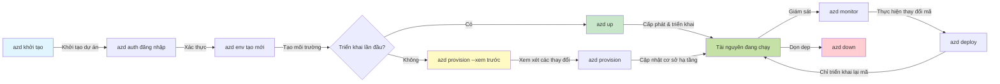
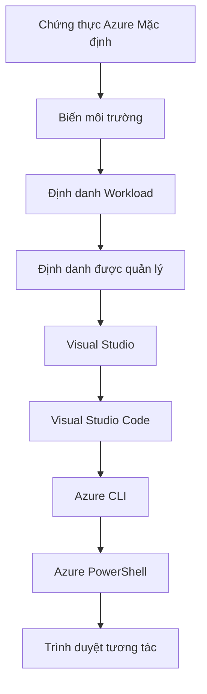

# AZD Basics - Hiểu Azure Developer CLI

# AZD Basics - Khái niệm cốt lõi và nền tảng

**Chapter Navigation:**
- **📚 Course Home**: [AZD cho Người Mới Bắt Đầu](../../README.md)
- **📖 Current Chapter**: Chương 1 - Nền tảng & Bắt đầu nhanh
- **⬅️ Previous**: [Tổng quan khóa học](../../README.md#-chapter-1-foundation--quick-start)
- **➡️ Next**: [Cài đặt & Thiết lập](installation.md)
- **🚀 Next Chapter**: [Chương 2: Phát triển Ưu tiên AI](../chapter-02-ai-development/microsoft-foundry-integration.md)

## Giới thiệu

Bài học này giới thiệu cho bạn về Azure Developer CLI (azd), một công cụ dòng lệnh mạnh mẽ giúp tăng tốc hành trình từ phát triển cục bộ đến triển khai trên Azure. Bạn sẽ học các khái niệm nền tảng, tính năng cốt lõi và hiểu cách azd đơn giản hóa việc triển khai ứng dụng cloud-native.

## Mục tiêu học tập

Sau khi kết thúc bài học này, bạn sẽ:
- Hiểu Azure Developer CLI là gì và mục đích chính của nó
- Học các khái niệm cốt lõi về template, môi trường và dịch vụ
- Khám phá các tính năng chính bao gồm phát triển theo template và Infrastructure as Code
- Hiểu cấu trúc dự án và quy trình làm việc của azd
- Chuẩn bị để cài đặt và cấu hình azd cho môi trường phát triển của bạn

## Kết quả mong đợi

Sau khi hoàn thành bài học này, bạn sẽ có khả năng:
- Giải thích vai trò của azd trong quy trình phát triển đám mây hiện đại
- Xác định các thành phần của cấu trúc dự án azd
- Mô tả cách template, môi trường và dịch vụ phối hợp cùng nhau
- Hiểu lợi ích của Infrastructure as Code với azd
- Nhận diện các lệnh azd khác nhau và mục đích của chúng

## Azure Developer CLI (azd) là gì?

Azure Developer CLI (azd) là một công cụ dòng lệnh được thiết kế để tăng tốc hành trình từ phát triển cục bộ đến triển khai trên Azure. Nó đơn giản hóa quá trình xây dựng, triển khai và quản lý các ứng dụng cloud-native trên Azure.

### Bạn có thể triển khai gì với azd?

azd hỗ trợ nhiều loại workload—và danh sách này vẫn tiếp tục mở rộng. Ngày nay, bạn có thể sử dụng azd để triển khai:

| Workload Type | Examples | Same Workflow? |
|---------------|----------|----------------|
| **Traditional applications** | Ứng dụng web, REST API, trang tĩnh | ✅ `azd up` |
| **Services and microservices** | Container Apps, Function Apps, backend đa dịch vụ | ✅ `azd up` |
| **AI-powered applications** | Ứng dụng chat với Microsoft Foundry Models, giải pháp RAG với AI Search | ✅ `azd up` |
| **Intelligent agents** | Tác nhân được lưu trữ trên Foundry, điều phối nhiều tác nhân | ✅ `azd up` |

Điểm mấu chốt là **vòng đời azd giữ nguyên bất kể bạn đang triển khai gì**. Bạn khởi tạo một dự án, cấp phát hạ tầng, triển khai mã, giám sát ứng dụng và dọn dẹp—dù đó là một trang web đơn giản hay một tác nhân AI phức tạp.

Tính liên tục này là thiết kế có chủ đích. azd xem các khả năng AI như một loại dịch vụ khác mà ứng dụng của bạn có thể sử dụng, không phải là thứ khác biệt về bản chất. Một endpoint chat được hỗ trợ bởi Microsoft Foundry Models, từ góc nhìn của azd, chỉ là một dịch vụ khác để cấu hình và triển khai.

### 🎯 Tại sao dùng AZD? So sánh thực tế

Hãy so sánh việc triển khai một ứng dụng web đơn giản với cơ sở dữ liệu:

#### ❌ KHÔNG DÙNG AZD: Triển khai Azure thủ công (30+ phút)

```bash
# Bước 1: Tạo nhóm tài nguyên
az group create --name myapp-rg --location eastus

# Bước 2: Tạo App Service Plan
az appservice plan create --name myapp-plan \
  --resource-group myapp-rg \
  --sku B1 --is-linux

# Bước 3: Tạo Web App
az webapp create --name myapp-web-unique123 \
  --resource-group myapp-rg \
  --plan myapp-plan \
  --runtime "NODE:18-lts"

# Bước 4: Tạo tài khoản Cosmos DB (10-15 phút)
az cosmosdb create --name myapp-cosmos-unique123 \
  --resource-group myapp-rg \
  --kind MongoDB

# Bước 5: Tạo cơ sở dữ liệu
az cosmosdb mongodb database create \
  --account-name myapp-cosmos-unique123 \
  --resource-group myapp-rg \
  --name tododb

# Bước 6: Tạo bộ sưu tập
az cosmosdb mongodb collection create \
  --account-name myapp-cosmos-unique123 \
  --resource-group myapp-rg \
  --database-name tododb \
  --name todos

# Bước 7: Lấy chuỗi kết nối
CONN_STR=$(az cosmosdb keys list \
  --name myapp-cosmos-unique123 \
  --resource-group myapp-rg \
  --type connection-strings \
  --query "connectionStrings[0].connectionString" -o tsv)

# Bước 8: Cấu hình cài đặt ứng dụng
az webapp config appsettings set \
  --name myapp-web-unique123 \
  --resource-group myapp-rg \
  --settings MONGODB_URI="$CONN_STR"

# Bước 9: Bật ghi nhật ký
az webapp log config --name myapp-web-unique123 \
  --resource-group myapp-rg \
  --application-logging filesystem \
  --detailed-error-messages true

# Bước 10: Thiết lập Application Insights
az monitor app-insights component create \
  --app myapp-insights \
  --location eastus \
  --resource-group myapp-rg

# Bước 11: Liên kết Application Insights với Web App
INSTRUMENTATION_KEY=$(az monitor app-insights component show \
  --app myapp-insights \
  --resource-group myapp-rg \
  --query "instrumentationKey" -o tsv)

az webapp config appsettings set \
  --name myapp-web-unique123 \
  --resource-group myapp-rg \
  --settings APPINSIGHTS_INSTRUMENTATIONKEY="$INSTRUMENTATION_KEY"

# Bước 12: Xây dựng ứng dụng cục bộ
npm install
npm run build

# Bước 13: Tạo gói triển khai
zip -r app.zip . -x "*.git*" "node_modules/*"

# Bước 14: Triển khai ứng dụng
az webapp deployment source config-zip \
  --resource-group myapp-rg \
  --name myapp-web-unique123 \
  --src app.zip

# Bước 15: Chờ và cầu mong nó hoạt động 🙏
# (Không có xác thực tự động, cần kiểm tra thủ công)
```

**Vấn đề:**
- ❌ 15+ lệnh cần nhớ và thực thi theo thứ tự
- ❌ 30-45 phút công việc thủ công
- ❌ Dễ mắc lỗi (chính tả, tham số sai)
- ❌ Chuỗi kết nối lộ ra trong lịch sử terminal
- ❌ Không có rollback tự động nếu có lỗi
- ❌ Khó tái tạo cho các thành viên trong nhóm
- ❌ Khác nhau mỗi lần (không tái lập được)

#### ✅ DÙNG AZD: Triển khai tự động (5 lệnh, 10-15 phút)

```bash
# Bước 1: Khởi tạo từ mẫu
azd init --template todo-nodejs-mongo

# Bước 2: Xác thực
azd auth login

# Bước 3: Tạo môi trường
azd env new dev

# Bước 4: Xem trước các thay đổi (tùy chọn nhưng được khuyến nghị)
azd provision --preview

# Bước 5: Triển khai mọi thứ
azd up

# ✨ Hoàn tất! Mọi thứ đã được triển khai, cấu hình và giám sát
```

**Lợi ích:**
- ✅ **5 lệnh** so với 15+ bước thủ công
- ✅ **10-15 phút** tổng thời gian (chủ yếu chờ Azure)
- ✅ **Ít lỗi thủ công hơn** - quy trình nhất quán theo template
- ✅ **Xử lý bí mật an toàn** - nhiều template sử dụng lưu trữ bí mật do Azure quản lý
- ✅ **Triển khai có thể lặp lại** - cùng quy trình mỗi lần
- ✅ **Hoàn toàn tái lập được** - cùng kết quả mỗi lần
- ✅ **Sẵn sàng cho nhóm** - bất kỳ ai cũng có thể triển khai bằng cùng các lệnh
- ✅ **Infrastructure as Code** - template Bicep được quản lý phiên bản
- ✅ **Giám sát tích hợp sẵn** - Application Insights được cấu hình tự động

### 📊 Giảm thời gian & lỗi

| Metric | Manual Deployment | AZD Deployment | Improvement |
|:-------|:------------------|:---------------|:------------|
| **Commands** | 15+ | 5 | 67% ít hơn |
| **Time** | 30-45 min | 10-15 min | 60% nhanh hơn |
| **Error Rate** | ~40% | <5% | Giảm 88% |
| **Consistency** | Thấp (thủ công) | 100% (tự động) | Hoàn hảo |
| **Team Onboarding** | 2-4 giờ | 30 phút | 75% nhanh hơn |
| **Rollback Time** | 30+ phút (thủ công) | 2 phút (tự động) | 93% nhanh hơn |

## Khái niệm cốt lõi

### Templates
Templates là nền tảng của azd. Chúng chứa:
- **Mã ứng dụng** - Mã nguồn và các phụ thuộc của bạn
- **Định nghĩa hạ tầng** - Các tài nguyên Azure được định nghĩa bằng Bicep hoặc Terraform
- **Tệp cấu hình** - Cấu hình và biến môi trường
- **Script triển khai** - Quy trình triển khai tự động

### Environments
Môi trường đại diện cho các mục tiêu triển khai khác nhau:
- **Development** - Dùng để kiểm thử và phát triển
- **Staging** - Môi trường trước sản xuất
- **Production** - Môi trường sản xuất trực tiếp

Mỗi môi trường duy trì riêng:
- Nhóm tài nguyên Azure (Azure resource group)
- Cài đặt cấu hình
- Trạng thái triển khai

### Services
Dịch vụ là các khối xây dựng của ứng dụng của bạn:
- **Frontend** - Ứng dụng web, SPA
- **Backend** - API, microservices
- **Database** - Giải pháp lưu trữ dữ liệu
- **Storage** - Lưu trữ tệp và blob

## Tính năng chính

### 1. Phát triển theo Template
```bash
# Duyệt các mẫu có sẵn
azd template list

# Khởi tạo từ một mẫu
azd init --template <template-name>
```

### 2. Infrastructure as Code
- **Bicep** - Ngôn ngữ chuyên dụng của Azure
- **Terraform** - Công cụ hạ tầng đa đám mây
- **ARM Templates** - Mẫu Azure Resource Manager

### 3. Quy trình làm việc tích hợp
```bash
# Quy trình triển khai hoàn chỉnh
azd up            # Cấp phát + Triển khai — không cần can thiệp cho lần thiết lập đầu tiên

# 🧪 MỚI: Xem trước các thay đổi hạ tầng trước khi triển khai (AN TOÀN)
azd provision --preview    # Mô phỏng triển khai hạ tầng mà không thực hiện thay đổi

azd provision     # Tạo tài nguyên Azure — nếu bạn cập nhật hạ tầng, hãy dùng tùy chọn này
azd deploy        # Triển khai mã ứng dụng hoặc triển khai lại mã ứng dụng sau khi cập nhật
azd down          # Dọn dẹp tài nguyên
```

#### 🛡️ Lập kế hoạch hạ tầng an toàn với Preview
Lệnh `azd provision --preview` là một bước đổi trò trong triển khai an toàn:
- **Phân tích chạy khô** - Hiển thị những gì sẽ được tạo, chỉnh sửa hoặc xóa
- **Không rủi ro** - Không có thay đổi thực tế nào được thực hiện trên môi trường Azure của bạn
- **Hợp tác nhóm** - Chia sẻ kết quả preview trước khi triển khai
- **Ước tính chi phí** - Hiểu chi phí tài nguyên trước khi cam kết

```bash
# Ví dụ quy trình xem trước
azd provision --preview           # Xem những gì sẽ thay đổi
# Xem lại kết quả, thảo luận với nhóm
azd provision                     # Áp dụng các thay đổi một cách tự tin
```

### 📊 Hình ảnh: Quy trình phát triển AZD



**Giải thích quy trình:**
1. **Init** - Bắt đầu với template hoặc dự án mới
2. **Auth** - Xác thực với Azure
3. **Environment** - Tạo môi trường triển khai tách biệt
4. **Preview** - 🆕 Luôn preview các thay đổi hạ tầng trước (thực hành an toàn)
5. **Provision** - Tạo/cập nhật tài nguyên Azure
6. **Deploy** - Đẩy mã ứng dụng của bạn
7. **Monitor** - Quan sát hiệu năng ứng dụng
8. **Iterate** - Thực hiện thay đổi và triển khai lại mã
9. **Cleanup** - Xóa tài nguyên khi hoàn tất

### 4. Quản lý Môi trường
```bash
# Tạo và quản lý các môi trường
azd env new <environment-name>
azd env select <environment-name>
azd env list
```

### 5. Phần mở rộng và lệnh AI

azd sử dụng hệ thống phần mở rộng để thêm các khả năng vượt ra ngoài CLI lõi. Điều này đặc biệt hữu ích cho các workload AI:

```bash
# Liệt kê các tiện ích mở rộng có sẵn
azd extension list

# Cài đặt tiện ích mở rộng Foundry agents
azd extension install azure.ai.agents

# Khởi tạo dự án agent AI từ tệp manifest
azd ai agent init -m agent-manifest.yaml

# Kiểm tra một agent đã được triển khai (hiển thị độ trễ và thời gian đến byte đầu tiên)
azd ai agent invoke

# Khởi động máy chủ MCP cho phát triển hỗ trợ bởi AI (Alpha)
azd mcp start
```

**Vòng đời tác nhân, từ đầu đến cuối.** Khi bạn đã cài đặt `azure.ai.agents`, một quy trình duy nhất đưa bạn từ ý tưởng đến một tác nhân đang chạy và được giám sát. Bạn không cần tất cả những điều này ngay ngày đầu—chỉ cần biết chúng tồn tại:

| Stage | Command | What it does |
|-------|---------|--------------|
| **Scaffold** | `azd ai agent init -m <manifest>` | Tạo một dự án agent từ một manifest |
| **Test** | `azd ai agent invoke` | Gọi agent và xem thời gian phản hồi |
| **Measure** | `azd ai agent eval generate` | Tạo bộ dữ liệu đánh giá cho agent |
| **Improve** | `azd ai agent optimize` | Tối ưu hướng dẫn agent dựa trên dữ liệu của bạn |
| **Inspect** | `azd ai agent endpoint show` | Xem cấu hình endpoint đang hoạt động |
| **Clean up** | `azd ai agent delete` | Xóa một agent được host và tất cả các phiên bản của nó |

> Phần mở rộng được trình bày chi tiết trong [Chương 2: Phát triển Ưu tiên AI](../chapter-02-ai-development/agents.md) và tham chiếu [AZD AI CLI Commands](../chapter-08-production/production-ai-practices.md#azd-ai-cli-commands-and-extensions).

## 📁 Cấu trúc dự án

Cấu trúc dự án azd điển hình:
```
my-app/
├── .azd/                    # azd configuration
│   └── config.json
├── .azure/                  # Azure deployment artifacts
├── .devcontainer/          # Development container config
├── .github/workflows/      # GitHub Actions
├── .vscode/               # VS Code settings
├── infra/                 # Infrastructure code
│   ├── main.bicep        # Main infrastructure template
│   ├── main.parameters.json
│   └── modules/          # Reusable modules
├── src/                  # Application source code
│   ├── api/             # Backend services
│   └── web/             # Frontend application
├── azure.yaml           # azd project configuration
└── README.md
```

## 🔧 Tệp cấu hình

### azure.yaml
Tệp cấu hình dự án chính:
```yaml
name: my-awesome-app
metadata:
  template: my-template@1.0.0

services:
  web:
    project: ./src/web
    language: js
    host: appservice
  api:
    project: ./src/api
    language: js
    host: appservice

hooks:
  preprovision:
    shell: pwsh
    run: echo "Preparing to provision..."
```

### .azure/config.json
Cấu hình theo môi trường:
```json
{
  "version": 1,
  "defaultEnvironment": "dev",
  "environments": {
    "dev": {
      "subscriptionId": "your-subscription-id",
      "location": "eastus"
    }
  }
}
```

## 🎪 Quy trình thường gặp với bài tập thực hành

> **💡 Mẹo học tập:** Thực hiện các bài tập này theo thứ tự để xây dựng kỹ năng AZD của bạn một cách có tiến triển.

### 🎯 Bài tập 1: Khởi tạo Dự án Đầu tiên của bạn

**Mục tiêu:** Tạo một dự án AZD và khám phá cấu trúc của nó

**Các bước:**
```bash
# Sử dụng mẫu đã được chứng minh
azd init --template todo-nodejs-mongo

# Khám phá các tệp được tạo
ls -la  # Xem tất cả các tệp bao gồm cả tệp ẩn

# Các tệp chính được tạo:
# - azure.yaml (cấu hình chính)
# - infra/ (mã hạ tầng)
# - src/ (mã ứng dụng)
```

**✅ Thành công:** Bạn có azure.yaml, thư mục infra/ và src/

---

### 🎯 Bài tập 2: Triển khai lên Azure

**Mục tiêu:** Hoàn thành triển khai đầu cuối

**Các bước:**
```bash
# 1. Xác thực
az login && azd auth login

# 2. Tạo môi trường
azd env new dev
azd env set AZURE_LOCATION eastus

# 3. Xem trước các thay đổi (ĐƯỢC KHUYÊN NGHỊ)
azd provision --preview

# 4. Triển khai tất cả
azd up

# 5. Xác minh việc triển khai
azd show    # 6. Xem URL ứng dụng của bạn
```

**Thời gian dự tính:** 10-15 phút  
**✅ Thành công:** URL ứng dụng mở trong trình duyệt

---

### 🎯 Bài tập 3: Nhiều môi trường

**Mục tiêu:** Triển khai lên dev và staging

**Các bước:**
```bash
# Đã có nhánh dev, tạo nhánh staging
azd env new staging
azd env set AZURE_LOCATION westus2
azd up

# Chuyển đổi giữa chúng
azd env list
azd env select dev
```

**✅ Thành công:** Hai nhóm tài nguyên riêng biệt trong Azure Portal

---

### 🛡️ Làm sạch hoàn toàn: `azd down --force --purge`

Khi bạn cần đặt lại hoàn toàn:

```bash
azd down --force --purge
```

**Nó làm gì:**
- `--force`: Không yêu cầu xác nhận
- `--purge`: Xóa toàn bộ trạng thái cục bộ và tài nguyên Azure

**Dùng khi:**
- Triển khai thất bại giữa chừng
- Chuyển đổi dự án
- Cần khởi đầu mới

---

## 🎪 Tài liệu tham khảo quy trình gốc

### Bắt đầu một dự án mới
```bash
# Phương pháp 1: Sử dụng mẫu hiện có
azd init --template todo-nodejs-mongo

# Phương pháp 2: Bắt đầu từ đầu
azd init

# Phương pháp 3: Sử dụng thư mục hiện tại
azd init .
```

### Chu trình phát triển
```bash
# Thiết lập môi trường phát triển
azd auth login
azd env new dev
azd env select dev

# Triển khai mọi thứ
azd up

# Thực hiện thay đổi và triển khai lại
azd deploy

# Dọn dẹp khi hoàn thành
azd down --force --purge # lệnh trong Azure Developer CLI là một **khôi phục hoàn toàn** cho môi trường của bạn—đặc biệt hữu ích khi bạn đang khắc phục các triển khai thất bại, dọn dẹp các tài nguyên bị bỏ lại, hoặc chuẩn bị để triển khai lại từ đầu.
```

## Hiểu `azd down --force --purge`
Lệnh `azd down --force --purge` là một cách mạnh mẽ để phá dỡ hoàn toàn môi trường azd của bạn và tất cả tài nguyên liên quan. Dưới đây là phân tích những gì mỗi flag thực hiện:
```
--force
```

- Bỏ qua các lời nhắc xác nhận.
- Hữu ích cho tự động hóa hoặc scripting nơi không thể nhập tay.
- Đảm bảo việc phá dỡ tiến hành không bị gián đoạn, ngay cả khi CLI phát hiện sự không nhất quán.

```
--purge
```

Xóa **tất cả metadata liên quan**, bao gồm:
Environment state
Local `.azure` folder
Cached deployment info
Ngăn azd "ghi nhớ" các triển khai trước đó, điều này có thể gây ra các vấn đề như nhóm tài nguyên không khớp hoặc tham chiếu registry cũ.

### Tại sao dùng cả hai?
Khi bạn gặp bế tắc với `azd up` do trạng thái còn sót hoặc triển khai một phần, tổ hợp này đảm bảo một **khởi đầu sạch sẽ**.

Nó đặc biệt hữu ích sau khi xóa tài nguyên thủ công trong Azure portal hoặc khi thay đổi template, môi trường, hoặc quy ước đặt tên nhóm tài nguyên.

### Quản lý nhiều môi trường
```bash
# Tạo môi trường dàn dựng
azd env new staging
azd env select staging
azd up

# Chuyển trở lại sang môi trường dev
azd env select dev

# So sánh các môi trường
azd env list
```

## 🔐 Xác thực và thông tin đăng nhập

Hiểu xác thực là điều quan trọng cho các triển khai azd thành công. Azure sử dụng nhiều phương thức xác thực, và azd tận dụng cùng chuỗi thông tin đăng nhập được sử dụng bởi các công cụ Azure khác.

### Xác thực Azure CLI (`az login`)

Trước khi sử dụng azd, bạn cần xác thực với Azure. Phương thức phổ biến nhất là sử dụng Azure CLI:

```bash
# Đăng nhập tương tác (mở trình duyệt)
az login

# Đăng nhập với tenant cụ thể
az login --tenant <tenant-id>

# Đăng nhập bằng service principal
az login --service-principal -u <app-id> -p <password> --tenant <tenant-id>

# Kiểm tra trạng thái đăng nhập hiện tại
az account show

# Liệt kê các đăng ký có sẵn
az account list --output table

# Đặt đăng ký mặc định
az account set --subscription <subscription-id>
```

### Luồng xác thực
1. **Đăng nhập tương tác**: Mở trình duyệt mặc định của bạn để xác thực
2. **Device Code Flow**: Dành cho môi trường không có truy cập trình duyệt
3. **Service Principal**: Cho tự động hóa và kịch bản CI/CD
4. **Managed Identity**: Cho các ứng dụng được host trên Azure

### Chuỗi DefaultAzureCredential

`DefaultAzureCredential` là một loại credential cung cấp trải nghiệm xác thực đơn giản hóa bằng cách tự động thử nhiều nguồn credential theo một thứ tự cụ thể:

#### Thứ tự chuỗi credential


#### 1. Biến môi trường
```bash
# Đặt biến môi trường cho service principal
export AZURE_CLIENT_ID="<app-id>"
export AZURE_CLIENT_SECRET="<password>"
export AZURE_TENANT_ID="<tenant-id>"
```

#### 2. Workload Identity (Kubernetes/GitHub Actions)
Được sử dụng tự động trong:
- Azure Kubernetes Service (AKS) với Workload Identity
- GitHub Actions với liên kết OIDC
- Các kịch bản danh tính liên kết khác

#### 3. Managed Identity
Dành cho các tài nguyên Azure như:
- Virtual Machines
- App Service
- Azure Functions
- Container Instances

```bash
# Kiểm tra xem có đang chạy trên tài nguyên Azure với định danh được quản lý hay không
az account show --query "user.type" --output tsv
# Trả về: "servicePrincipal" nếu đang sử dụng định danh được quản lý
```

#### 4. Tích hợp công cụ phát triển
- **Visual Studio**: Tự động sử dụng tài khoản đã đăng nhập
- **VS Code**: Sử dụng credential từ extension Azure Account
- **Azure CLI**: Sử dụng credential `az login` (phổ biến nhất cho phát triển cục bộ)

### Thiết lập xác thực AZD

```bash
# Phương pháp 1: Sử dụng Azure CLI (Khuyến nghị cho phát triển)
az login
azd auth login  # Sử dụng các thông tin xác thực Azure CLI hiện có

# Phương pháp 2: Xác thực azd trực tiếp
azd auth login --use-device-code  # Dành cho các môi trường không có giao diện người dùng

# Phương pháp 3: Kiểm tra trạng thái xác thực
azd auth login --check-status

# Phương pháp 4: Đăng xuất và xác thực lại
azd auth logout
azd auth login
```

### Thực hành tốt nhất về xác thực

#### Đối với phát triển cục bộ
```bash
# 1. Đăng nhập bằng Azure CLI
az login

# 2. Xác minh đăng ký đúng
az account show
az account set --subscription "Your Subscription Name"

# 3. Sử dụng azd với thông tin đăng nhập hiện có
azd auth login
```

#### For CI/CD Pipelines
```yaml
# GitHub Actions example
- name: Azure Login
  uses: azure/login@v1
  with:
    creds: ${{ secrets.AZURE_CREDENTIALS }}

- name: Deploy with azd
  run: |
    azd auth login --client-id ${{ secrets.AZURE_CLIENT_ID }} \
                    --client-secret ${{ secrets.AZURE_CLIENT_SECRET }} \
                    --tenant-id ${{ secrets.AZURE_TENANT_ID }}
    azd up --no-prompt
```

#### Cho Môi trường Sản xuất
- Use **Managed Identity** when running on Azure resources
- Use **Service Principal** for automation scenarios
- Avoid storing credentials in code or configuration files
- Use **Azure Key Vault** for sensitive configuration

### Các Vấn đề Xác thực Thường Gặp và Giải pháp

#### Vấn đề: "No subscription found"
```bash
# Giải pháp: Đặt đăng ký mặc định
az account list --output table
az account set --subscription "<subscription-id>"
azd env set AZURE_SUBSCRIPTION_ID "<subscription-id>"
```

#### Vấn đề: "Insufficient permissions"
```bash
# Giải pháp: Kiểm tra và gán các vai trò cần thiết
az role assignment list --assignee $(az account show --query user.name --output tsv)

# Các vai trò cần thiết phổ biến:
# - Contributor (để quản lý tài nguyên)
# - User Access Administrator (để gán vai trò)
```

#### Vấn đề: "Token expired"
```bash
# Giải pháp: Xác thực lại
az logout
az login
azd auth logout
azd auth login
```

### Xác thực trong các Kịch bản Khác nhau

#### Phát triển cục bộ
```bash
# tài khoản phát triển cá nhân
az login
azd auth login
```

#### Phát triển nhóm
```bash
# Sử dụng tenant cụ thể cho tổ chức
az login --tenant contoso.onmicrosoft.com
azd auth login
```

#### Kịch bản đa tenant
```bash
# Chuyển đổi giữa các tenant
az login --tenant tenant1.onmicrosoft.com
# Triển khai đến tenant 1
azd up

az login --tenant tenant2.onmicrosoft.com  
# Triển khai đến tenant 2
azd up
```

### Các lưu ý về Bảo mật

1. **Credential Storage**: Never store credentials in source code
2. **Scope Limitation**: Use least-privilege principle for service principals
3. **Token Rotation**: Regularly rotate service principal secrets
4. **Audit Trail**: Monitor authentication and deployment activities
5. **Network Security**: Use private endpoints when possible

### Khắc phục sự cố Xác thực

```bash
# Gỡ lỗi sự cố xác thực
azd auth login --check-status
az account show
az account get-access-token

# Các lệnh chẩn đoán phổ biến
whoami                          # Ngữ cảnh người dùng hiện tại
az ad signed-in-user show      # Chi tiết người dùng Microsoft Entra ID
az group list                  # Kiểm tra quyền truy cập tài nguyên
```

## Hiểu về `azd down --force --purge`

### Khám phá
```bash
azd template list              # Duyệt mẫu
azd template show <template>   # Chi tiết mẫu
azd init --help               # Tùy chọn khởi tạo
```

### Quản lý Dự án
```bash
azd show                     # Tổng quan dự án
azd env list                # Các môi trường có sẵn và mặc định được chọn
azd config show            # Cài đặt cấu hình
```

### Giám sát
```bash
azd monitor                  # Mở phần giám sát trong Azure Portal
azd monitor --logs           # Xem nhật ký ứng dụng
azd monitor --live           # Xem số liệu trực tiếp
azd pipeline config          # Thiết lập CI/CD
```

## Những Thực hành Tốt nhất

### 1. Sử dụng Tên có Ý nghĩa
```bash
# Tốt
azd env new production-east
azd init --template web-app-secure

# Tránh
azd env new env1
azd init --template template1
```

### 2. Tận dụng mẫu
- Start with existing templates
- Customize for your needs
- Create reusable templates for your organization

### 3. Cách ly Môi trường
- Use separate environments for dev/staging/prod
- Never deploy directly to production from local machine
- Use CI/CD pipelines for production deployments

### 4. Quản lý Cấu hình
- Use environment variables for sensitive data
- Keep configuration in version control
- Document environment-specific settings

## Lộ trình Học tập

### Người mới (Tuần 1-2)
1. Install azd and authenticate
2. Deploy a simple template
3. Understand project structure
4. Learn basic commands (up, down, deploy)

### Trung cấp (Tuần 3-4)
1. Customize templates
2. Manage multiple environments
3. Understand infrastructure code
4. Set up CI/CD pipelines

### Nâng cao (Tuần 5+)
1. Create custom templates
2. Advanced infrastructure patterns
3. Multi-region deployments
4. Enterprise-grade configurations

## Bước tiếp theo

**📖 Tiếp tục Học Chương 1:**
- [Installation & Setup](installation.md) - Cài đặt và cấu hình azd
- [Your First Project](first-project.md) - Hoàn thành bài hướng dẫn thực hành
- [Configuration Guide](configuration.md) - Tùy chọn cấu hình nâng cao

**🎯 Sẵn sàng cho Chương sau?**
- [Chapter 2: AI-First Development](../chapter-02-ai-development/microsoft-foundry-integration.md) - Bắt đầu xây dựng ứng dụng AI

## Tài Nguyên Bổ sung

- [Azure Developer CLI Overview](https://learn.microsoft.com/en-us/azure/developer/azure-developer-cli/)
- [Template Gallery](https://azure.github.io/awesome-azd/)
- [Community Samples](https://github.com/Azure-Samples)

---

## 🙋 Câu hỏi Thường Gặp

### Câu hỏi Chung

**Q: Sự khác biệt giữa AZD và Azure CLI là gì?**

A: Azure CLI (`az`) dùng để quản lý các tài nguyên Azure riêng lẻ. AZD (`azd`) dùng để quản lý toàn bộ ứng dụng:

```bash
# Azure CLI - Quản lý tài nguyên cấp thấp
az webapp create --name myapp --resource-group rg
az sql server create --name myserver --resource-group rg
# ...cần thêm nhiều lệnh

# AZD - Quản lý ở cấp ứng dụng
azd up  # Triển khai toàn bộ ứng dụng với tất cả tài nguyên
```

**Hãy nghĩ theo cách này:**
- `az` = Thao tác trên từng viên gạch Lego riêng lẻ
- `azd` = Làm việc với cả bộ Lego hoàn chỉnh

---

**Q: Tôi có cần biết Bicep hoặc Terraform để sử dụng AZD không?**

A: Không! Bắt đầu với các mẫu:
```bash
# Sử dụng mẫu hiện có - không cần kiến thức về IaC
azd init --template todo-nodejs-mongo
azd up
```

Bạn có thể học Bicep sau để tùy chỉnh hạ tầng. Các mẫu cung cấp ví dụ hoạt động để học hỏi.

---

**Q: Chi phí chạy các mẫu AZD là bao nhiêu?**

A: Chi phí thay đổi theo mẫu. Hầu hết các mẫu phát triển có chi phí $50-150/tháng:

```bash
# Xem chi phí trước khi triển khai
azd provision --preview

# Luôn dọn dẹp khi không sử dụng
azd down --force --purge  # Xóa tất cả tài nguyên
```

**Mẹo chuyên gia:** Sử dụng các tầng miễn phí khi có thể:
- App Service: F1 (Free) tier
- Microsoft Foundry Models: Azure OpenAI 50,000 tokens/month free
- Cosmos DB: 1000 RU/s free tier

---

**Q: Tôi có thể sử dụng AZD với các tài nguyên Azure hiện có không?**

A: Có, nhưng bắt đầu từ đầu thường dễ hơn. AZD hoạt động tốt nhất khi quản lý toàn bộ vòng đời. Với các tài nguyên hiện có:

```bash
# Tùy chọn 1: Nhập các tài nguyên hiện có (nâng cao)
azd init
# Sau đó chỉnh sửa infra/ để tham chiếu tới các tài nguyên hiện có

# Tùy chọn 2: Bắt đầu mới (được khuyến nghị)
azd init --template matching-your-stack
azd up  # Tạo môi trường mới
```

---

**Q: Làm sao để chia sẻ dự án với đồng đội?**

A: Commit dự án AZD lên Git (nhưng KHÔNG commit thư mục .azure):

```bash
# Đã có trong .gitignore theo mặc định
.azure/        # Chứa bí mật và dữ liệu môi trường
*.env          # Các biến môi trường

# Các thành viên nhóm lúc đó:
git clone <your-repo>
azd auth login
azd env new <their-name>-dev
azd up
```

Mọi người nhận được cơ sở hạ tầng giống hệt từ cùng một mẫu.

---

### Câu hỏi Khắc phục sự cố

**Q: "azd up" bị lỗi giữa chừng. Tôi nên làm gì?**

A: Kiểm tra lỗi, sửa rồi thử lại:

```bash
# Xem nhật ký chi tiết
azd show

# Các cách khắc phục phổ biến:

# 1. Nếu vượt quá hạn mức:
azd env set AZURE_LOCATION "westus2"  # Thử khu vực khác

# 2. Nếu xung đột tên tài nguyên:
azd down --force --purge  # Xóa sạch
azd up  # Thử lại

# 3. Nếu xác thực hết hạn:
az login
azd auth login
azd up
```

**Vấn đề phổ biến nhất:** Đã chọn sai đăng ký Azure
```bash
az account list --output table
az account set --subscription "<correct-subscription>"
```

---

**Q: Làm sao để chỉ triển khai các thay đổi mã mà không reprovisioning?**

A: Dùng `azd deploy` thay vì `azd up`:

```bash
azd up          # Lần đầu: thiết lập + triển khai (chậm)

# Thực hiện thay đổi mã...

azd deploy      # Những lần sau: chỉ triển khai (nhanh)
```

So sánh tốc độ:
- `azd up`: 10-15 phút (cấp phát hạ tầng)
- `azd deploy`: 2-5 phút (chỉ mã nguồn)

---

**Q: Tôi có thể tùy chỉnh mẫu hạ tầng không?**

A: Có! Chỉnh sửa các tệp Bicep trong `infra/`:

```bash
# Sau khi chạy azd init
cd infra/
code main.bicep  # Chỉnh sửa trong VS Code

# Xem trước các thay đổi
azd provision --preview

# Áp dụng các thay đổi
azd provision
```

**Mẹo:** Bắt đầu nhỏ - thay đổi SKUs trước:
```bicep
// infra/main.bicep
sku: {
  name: 'B1'  // Change to 'P1V2' for production
}
```

---

**Q: Làm sao để xóa mọi thứ AZD đã tạo?**

A: Một lệnh sẽ xóa tất cả tài nguyên:

```bash
azd down --force --purge

# Việc này sẽ xóa:
# - Tất cả tài nguyên Azure
# - Nhóm tài nguyên
# - Trạng thái môi trường cục bộ
# - Dữ liệu triển khai được lưu trong bộ nhớ đệm
```

**Luôn chạy điều này khi:**
- Finished testing a template
- Switching to different project
- Want to start fresh

**Tiết kiệm chi phí:** Xóa tài nguyên không dùng = $0 phí

---

**Q: Nếu tôi vô tình xóa tài nguyên trong Azure Portal thì sao?**

A: Trạng thái AZD có thể bị lệch. Cách làm là làm mới hoàn toàn:

```bash
# 1. Xóa trạng thái cục bộ
azd down --force --purge

# 2. Bắt đầu lại từ đầu
azd up

# Lựa chọn khác: Để AZD phát hiện và khắc phục
azd provision  # Sẽ tạo các tài nguyên bị thiếu
```

---

### Câu hỏi Nâng cao

**Q: Tôi có thể sử dụng AZD trong pipeline CI/CD không?**

A: Có! Ví dụ GitHub Actions:

```yaml
# .github/workflows/deploy.yml
name: Deploy with AZD

on:
  push:
    branches: [main]

jobs:
  deploy:
    runs-on: ubuntu-latest
    steps:
      - uses: actions/checkout@v2
      
      - name: Install azd
        run: curl -fsSL https://aka.ms/install-azd.sh | bash
      
      - name: Azure Login
        run: |
          azd auth login \
            --client-id ${{ secrets.AZURE_CLIENT_ID }} \
            --client-secret ${{ secrets.AZURE_CLIENT_SECRET }} \
            --tenant-id ${{ secrets.AZURE_TENANT_ID }}
      
      - name: Deploy
        run: azd up --no-prompt
```

---

**Q: Làm sao xử lý secret và dữ liệu nhạy cảm?**

A: AZD tích hợp với Azure Key Vault tự động:

```bash
# Bí mật được lưu trong Key Vault, không phải trong mã
azd env set DATABASE_PASSWORD "$(openssl rand -base64 32)"

# AZD tự động:
# 1. Tạo Key Vault
# 2. Lưu trữ bí mật
# 3. Cấp quyền truy cập cho ứng dụng thông qua Danh tính được quản lý
# 4. Chèn vào thời gian chạy
```

**Không bao giờ commit:**
- Thư mục `.azure/` (chứa dữ liệu môi trường)
- Các tệp `.env` (local secrets)
- Connection strings

---

**Q: Tôi có thể triển khai tới nhiều khu vực không?**

A: Có, tạo môi trường cho từng khu vực:

```bash
# Môi trường miền Đông Hoa Kỳ
azd env new prod-eastus
azd env set AZURE_LOCATION eastus
azd up

# Môi trường Tây Âu
azd env new prod-westeurope
azd env set AZURE_LOCATION westeurope
azd up

# Mỗi môi trường độc lập
azd env list
```

Để thực sự triển khai đa vùng, tùy chỉnh các mẫu Bicep để triển khai tới nhiều khu vực cùng lúc.

---

**Q: Tôi có thể tìm trợ giúp ở đâu nếu bị mắc kẹt?**

1. **Tài liệu AZD:** https://learn.microsoft.com/azure/developer/azure-developer-cli/
2. **GitHub Issues:** https://github.com/Azure/azure-dev/issues
3. **Discord:** [Azure Discord](https://discord.gg/microsoft-azure) - kênh #azure-developer-cli
4. **Stack Overflow:** Dùng tag `azure-developer-cli`
5. **Khóa học này:** [Hướng dẫn Khắc phục Sự cố](../chapter-07-troubleshooting/common-issues.md)

**Mẹo chuyên gia:** Trước khi hỏi, chạy:
```bash
azd show       # Hiển thị trạng thái hiện tại
azd version    # Hiển thị phiên bản của bạn
```
Bao gồm thông tin này trong câu hỏi của bạn để được trợ giúp nhanh hơn.

---

## 🎓 Tiếp theo là gì?

Bây giờ bạn đã hiểu những nguyên tắc cơ bản của AZD. Chọn hướng đi của bạn:

### 🎯 Dành cho Người mới bắt đầu:
1. **Tiếp theo:** [Installation & Setup](installation.md) - Install AZD on your machine
2. **Sau đó:** [Your First Project](first-project.md) - Deploy your first app
3. **Thực hành:** Hoàn thành cả 3 bài tập trong bài học này

### 🚀 Dành cho Nhà phát triển AI:
1. **Chuyển đến:** [Chapter 2: AI-First Development](../chapter-02-ai-development/microsoft-foundry-integration.md)
2. **Triển khai:** Bắt đầu với `azd init --template get-started-with-ai-chat`
3. **Học:** Xây dựng trong khi triển khai

### 🏗️ Dành cho Nhà phát triển Kinh nghiệm:
1. **Xem lại:** [Configuration Guide](configuration.md) - Advanced settings
2. **Khám phá:** [Infrastructure as Code](../chapter-04-infrastructure/provisioning.md) - Bicep deep dive
3. **Xây dựng:** Create custom templates for your stack

---

**Điều hướng Chương:**
- **📚 Trang chủ Khóa học**: [AZD For Beginners](../../README.md)
- **📖 Chương hiện tại**: Chương 1 - Foundation & Quick Start  
- **⬅️ Trước**: [Course Overview](../../README.md#-chapter-1-foundation--quick-start)
- **➡️ Tiếp theo**: [Installation & Setup](installation.md)
- **🚀 Next Chapter**: [Chapter 2: AI-First Development](../chapter-02-ai-development/microsoft-foundry-integration.md)

---

<!-- CO-OP TRANSLATOR DISCLAIMER START -->
**Tuyên bố miễn trừ trách nhiệm**:
Tài liệu này đã được dịch bằng dịch vụ dịch thuật AI [Co-op Translator](https://github.com/Azure/co-op-translator). Mặc dù chúng tôi cố gắng đảm bảo độ chính xác, xin lưu ý rằng bản dịch tự động có thể chứa lỗi hoặc sai sót. Tài liệu gốc bằng ngôn ngữ gốc nên được coi là nguồn tin chính thức. Đối với thông tin quan trọng, nên sử dụng dịch vụ dịch thuật chuyên nghiệp bởi con người. Chúng tôi không chịu trách nhiệm về bất kỳ hiểu lầm hoặc giải thích sai nào phát sinh từ việc sử dụng bản dịch này.
<!-- CO-OP TRANSLATOR DISCLAIMER END -->