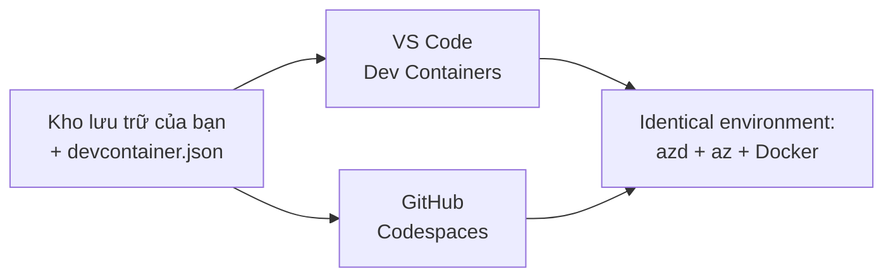

# Dev Containers & GitHub Codespaces cho azd

**Điều hướng chương:**
- **📚 Trang chính khoá học**: [AZD cho Người mới bắt đầu](../../README.md)
- **📖 Chương hiện tại**: Chương 1 - Cơ sở & Bắt đầu nhanh
- **⬅️ Trước đó**: [Mang Ứng dụng của Bạn](bring-your-own-app.md)
- **🚀 Chương tiếp theo**: [Chương 2: Phát triển ưu tiên AI](../chapter-02-ai-development/README.md)

> Đã xác thực với `azd 1.27.1` vào tháng 7 năm 2026.

## Giới thiệu

Việc cài đặt azd, runtime ngôn ngữ phù hợp, Docker và Azure CLI trên mọi máy là công việc vất vả—và đây là lý do số một khiến một hướng dẫn "hoạt động trên máy tôi" lại thất bại với người khác. Một **dev container** giải quyết điều này bằng cách mô tả toàn bộ chuỗi công cụ của bạn trong một tệp. Bất kỳ ai mở dự án trong VS Code hoặc GitHub Codespaces đều nhận được môi trường giống hệt, với azd đã được cài sẵn. Bài học này hướng dẫn bạn cách thêm một dev container.

## Mục tiêu học tập

Đến cuối bài học này, bạn sẽ:
- Hiểu dev container là gì và tại sao nó giúp ích với azd
- Thêm một `.devcontainer/devcontainer.json` tối giản vào dự án
- Bao gồm azd, Azure CLI và Docker thông qua *tính năng* Dev Container
- Mở dự án trong GitHub Codespaces hoặc VS Code

## Kết quả học tập

Hoàn thành bài học này, bạn sẽ có khả năng:
- Viết một `devcontainer.json` cho dự án azd
- Thêm azd và công cụ Azure mà không cần cài đặt thủ công
- Chạy lệnh `azd up` từ bên trong container hoặc Codespace

---

## Dev Container là gì?

Dev container là một môi trường phát triển dựa trên Docker được định nghĩa bằng tệp `.devcontainer/devcontainer.json` trong kho mã của bạn. Khi bạn mở dự án:

- **VS Code** (với tiện ích mở rộng Dev Containers) xây dựng container và kết nối vào nó.
- **GitHub Codespaces** xây dựng cùng container đó trên đám mây và cung cấp trình chỉnh sửa qua trình duyệt.

Dù bằng cách nào, mỗi cộng tác viên đều có công cụ giống hệt—không còn phải xử lý lỗi "bạn đã cài azd chưa?" nữa.



---

## Bước 1: Tạo tệp devcontainer

Tạo tệp `.devcontainer/devcontainer.json` ở thư mục gốc dự án:

```json
{
  "name": "azd-project",
  "image": "mcr.microsoft.com/devcontainers/base:bookworm",
  "features": {
    "ghcr.io/devcontainers/features/azure-cli:1": {},
    "ghcr.io/azure/azure-dev/azd:latest": {},
    "ghcr.io/devcontainers/features/docker-in-docker:2": {},
    "ghcr.io/devcontainers/features/node:1": {}
  },
  "customizations": {
    "vscode": {
      "extensions": [
        "ms-azuretools.azure-dev",
        "ms-azuretools.vscode-bicep"
      ]
    }
  },
  "forwardPorts": [3000],
  "postCreateCommand": "azd version"
}
```

Ý nghĩa từng phần:

| Khóa | Mục đích |
|-----|----------|
| `image` | Hệ điều hành cơ bản cho container |
| `features` | Trình cài đặt dựng sẵn—ở đây: Azure CLI, **azd**, Docker và Node.js |
| `customizations.vscode.extensions` | Tự động cài tiện ích mở rộng azd và Bicep cho VS Code |
| `forwardPorts` | Mở cổng ứng dụng của bạn tới trình duyệt |
| `postCreateCommand` | Lệnh chạy một lần sau khi container được xây dựng (ở đây dùng để kiểm tra) |

> Tính năng `ghcr.io/azure/azure-dev/azd:latest` là cách chính thức để lấy azd trong container. Bạn có thể ghim phiên bản cụ thể (ví dụ `azd:1.27.1`) nếu cần tính tái lập.

---

## Bước 2: Chọn tính năng phù hợp với ngôn ngữ ứng dụng của bạn

Thay thế tính năng `node` bằng ngôn ngữ mà ứng dụng bạn sử dụng:

```jsonc
// Python project
"ghcr.io/devcontainers/features/python:1": {},

// .NET project
"ghcr.io/devcontainers/features/dotnet:2": {},

// Java project
"ghcr.io/devcontainers/features/java:1": {},

// Go project
"ghcr.io/devcontainers/features/go:1": {}
```

Giữ `docker-in-docker` nếu `host` của bạn là `containerapp`, `aks`, hoặc bất kỳ môi trường nào xây dựng ảnh container—azd cần Docker để xây dựng và đẩy ảnh.

---

## Bước 3: Mở nó ra

**Trong VS Code:**
1. Cài đặt tiện ích mở rộng **Dev Containers**.
2. Mở thư mục dự án.
3. Nhấn **Reopen in Container** khi được hỏi (hoặc chạy *Dev Containers: Reopen in Container*).

**Trong GitHub Codespaces:**
1. Đẩy repo lên GitHub.
2. Nhấn **Code → Codespaces → Create codespace on main**.
3. Chờ container được xây dựng—azd sẽ có sẵn trong terminal.

---

## Bước 4: Triển khai từ bên trong container

Container đã có sẵn azd, nên quy trình bình thường sẽ hoạt động:

```bash
azd auth login --use-device-code   # mã thiết bị rất tiện dụng trong Codespaces
azd up
```

> **Tại sao dùng `--use-device-code`?** Trong container từ xa hoặc Codespace không có trình duyệt cục bộ để chuyển hướng, nên đăng nhập bằng mã thiết bị là cách đáng tin cậy. Bạn sẽ dán mã vào tab trình duyệt để hoàn thành đăng nhập.

---

## Những lỗi thường gặp

| Lỗi | Cách khắc phục |
|---------|---------------|
| `azd up` không thể xây dựng ảnh | Thêm tính năng `docker-in-docker` |
| Đăng nhập trình duyệt treo trong Codespaces | Dùng `azd auth login --use-device-code` |
| Công cụ không đồng nhất giữa các thành viên | Ghim phiên bản tính năng (ví dụ `azd:1.27.1`) |
| Ứng dụng không truy cập được trong trình duyệt | Thêm cổng vào `forwardPorts` |

---

## Tóm tắt

- Dev container giúp chuỗi công cụ azd của bạn tái lập lại cho mọi người.
- Thêm azd, Azure CLI và Docker thông qua *tính năng* Dev Container.
- Chọn tính năng ngôn ngữ phù hợp với ứng dụng và giữ `docker-in-docker` cho host container.
- Sử dụng đăng nhập mã thiết bị khi chạy trong Codespaces.

---

## 🔗 Điều hướng

| Hướng đi | Tài nguyên |
|----------|-----------|
| **Trước đó** | [Mang Ứng dụng của Bạn](bring-your-own-app.md) |
| **Trang chương** | [Chương 1: Cơ sở & Bắt đầu nhanh](README.md) |
| **Chương tiếp theo** | [Chương 2: Phát triển ưu tiên AI](../chapter-02-ai-development/README.md) |

## 📖 Tài nguyên liên quan

- [Cài đặt & Thiết lập](installation.md)
- [Bảng tóm tắt lệnh](../../resources/cheat-sheet.md)
- [Đặc tả chính thức Dev Containers](https://containers.dev/)
- [Tính năng Dev Container azd](https://github.com/Azure/azure-dev/tree/main/ext/devcontainer)

---

<!-- CO-OP TRANSLATOR DISCLAIMER START -->
**Tuyên bố miễn trừ trách nhiệm**:
Tài liệu này đã được dịch bằng dịch vụ dịch thuật AI [Co-op Translator](https://github.com/Azure/co-op-translator). Mặc dù chúng tôi cố gắng đảm bảo độ chính xác, xin lưu ý rằng bản dịch tự động có thể chứa lỗi hoặc sai sót. Tài liệu gốc bằng ngôn ngữ gốc nên được coi là nguồn tin chính thức. Đối với thông tin quan trọng, nên sử dụng dịch vụ dịch thuật chuyên nghiệp bởi con người. Chúng tôi không chịu trách nhiệm về bất kỳ hiểu lầm hoặc giải thích sai nào phát sinh từ việc sử dụng bản dịch này.
<!-- CO-OP TRANSLATOR DISCLAIMER END -->