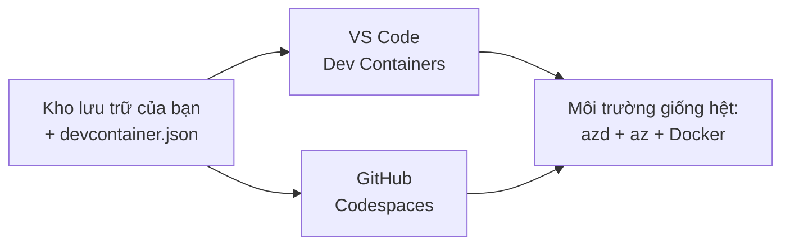

# Dev Containers & GitHub Codespaces for azd

**Chapter Navigation:**
- **📚 Trang khóa học**: [AZD Cho Người Mới](../../README.md)
- **📖 Chương hiện tại**: Chương 1 - Nền tảng & Bắt đầu Nhanh
- **⬅️ Previous**: [Mang Ứng Dụng Của Bạn](bring-your-own-app.md)
- **🚀 Next Chapter**: [Chương 2: Phát triển ưu tiên AI](../chapter-02-ai-development/README.md)

> Đã xác thực với `azd 1.25.6` vào tháng 6 năm 2026.

## Giới thiệu

Việc cài đặt azd, runtime ngôn ngữ phù hợp, Docker và Azure CLI trên từng máy là một việc phiền toái — và đó là lý do số một khiến một hướng dẫn "chạy được trên máy tôi" lại thất bại với người khác. Một **dev container** giải quyết vấn đề này bằng cách mô tả toàn bộ chuỗi công cụ của bạn trong một tệp. Bất kỳ ai mở dự án trong VS Code hoặc GitHub Codespaces đều có cùng một môi trường, với azd đã được cài sẵn. Bài học này hướng dẫn bạn cách thêm một dev container.

## Mục tiêu học tập

Đến cuối bài học này, bạn sẽ:
- Hiểu dev container là gì và tại sao nó hữu ích với azd
- Thêm một `.devcontainer/devcontainer.json` tối thiểu vào dự án
- Bao gồm azd, Azure CLI và Docker thông qua *tính năng* Dev Container
- Mở dự án trong GitHub Codespaces hoặc VS Code

## Kết quả học tập

Sau khi hoàn thành bài học này, bạn sẽ có thể:
- Soạn một `devcontainer.json` cho dự án azd
- Thêm azd và công cụ Azure mà không cần cài thủ công
- Chạy `azd up` từ bên trong container hoặc Codespace

---

## Dev Container là gì?

Một dev container là một môi trường phát triển dựa trên Docker được định nghĩa bằng tệp `.devcontainer/devcontainer.json` trong kho mã của bạn. Khi bạn mở dự án:

- **VS Code** (với phần mở rộng Dev Containers) sẽ xây dựng container và đính kèm vào nó.
- **GitHub Codespaces** xây dựng cùng một container trên đám mây và cung cấp cho bạn một trình soạn thảo chạy trên trình duyệt.

Dù bằng cách nào, mọi cộng tác viên đều có cùng bộ công cụ — không còn cảnh "bạn đã cài azd chưa?" để khắc phục lỗi.



---

## Bước 1: Tạo tệp devcontainer

Tạo `.devcontainer/devcontainer.json` ở gốc dự án của bạn:

```json
{
  "name": "azd-project",
  "image": "mcr.microsoft.com/devcontainers/base:bookworm",
  "features": {
    "ghcr.io/devcontainers/features/azure-cli:1": {},
    "ghcr.io/azure/azure-dev/azd:latest": {},
    "ghcr.io/devcontainers/features/docker-in-docker:2": {},
    "ghcr.io/devcontainers/features/node:1": {}
  },
  "customizations": {
    "vscode": {
      "extensions": [
        "ms-azuretools.azure-dev",
        "ms-azuretools.vscode-bicep"
      ]
    }
  },
  "forwardPorts": [3000],
  "postCreateCommand": "azd version"
}
```

Mỗi phần hoạt động như sau:

| Khóa | Mục đích |
|-----|---------|
| `image` | Hệ điều hành cơ sở cho container |
| `features` | Trình cài đặt có sẵn — ở đây: Azure CLI, **azd**, Docker và Node.js |
| `customizations.vscode.extensions` | Tự động cài đặt phần mở rộng azd và Bicep cho VS Code |
| `forwardPorts` | Mở cổng ứng dụng của bạn cho trình duyệt |
| `postCreateCommand` | Chạy một lần sau khi container được xây dựng (ở đây là kiểm tra sơ bộ) |

> Tính năng `ghcr.io/azure/azure-dev/azd:latest` là cách chính thức để có azd trong container. Khóa một phiên bản cụ thể (ví dụ `azd:1.25.6`) nếu bạn cần khả năng tái tạo.

---

## Bước 2: Khớp tính năng với ngôn ngữ ứng dụng của bạn

Thay tính năng `node` bằng tính năng phù hợp với ngôn ngữ ứng dụng của bạn:

```jsonc
// Python project
"ghcr.io/devcontainers/features/python:1": {},

// .NET project
"ghcr.io/devcontainers/features/dotnet:2": {},

// Java project
"ghcr.io/devcontainers/features/java:1": {},

// Go project
"ghcr.io/devcontainers/features/go:1": {}
```

Giữ `docker-in-docker` nếu `host` của bạn là `containerapp`, `aks`, hoặc bất kỳ thứ gì cần xây dựng một ảnh container — azd cần Docker để build và push ảnh.

---

## Bước 3: Mở nó

**Trong VS Code:**
1. Cài đặt phần mở rộng **Dev Containers**.
2. Mở thư mục dự án.
3. Nhấp **Reopen in Container** khi được nhắc (hoặc chạy *Dev Containers: Reopen in Container*).

**Trong GitHub Codespaces:**
1. Đẩy repo lên GitHub.
2. Nhấp **Code → Codespaces → Create codespace on main**.
3. Chờ container được xây dựng — azd đã sẵn sàng trong terminal.

---

## Bước 4: Triển khai từ bên trong container

Container đã cài sẵn azd, nên quy trình làm việc thông thường sẽ hoạt động ngay:

```bash
azd auth login --use-device-code   # mã thiết bị rất tiện lợi trong Codespaces
azd up
```

> **Tại sao `--use-device-code`?** Trong container từ xa hoặc Codespace không có trình duyệt cục bộ để chuyển hướng, nên đăng nhập bằng device-code là cách đáng tin cậy. Bạn sẽ dán mã vào một tab trình duyệt để hoàn tất đăng nhập.

---

## Những vấn đề thường gặp

| Vấn đề | Khắc phục |
|---------|-----|
| `azd up` can't build an image | Thêm tính năng `docker-in-docker` |
| Browser login hangs in Codespaces | Sử dụng `azd auth login --use-device-code` |
| Tools differ between teammates | Khóa phiên bản tính năng (ví dụ `azd:1.25.6`) |
| App not reachable in browser | Thêm cổng vào `forwardPorts` |

---

## Tóm tắt

- Một dev container giúp chuỗi công cụ azd của bạn có thể tái tạo cho mọi người.
- Thêm azd, Azure CLI và Docker thông qua *tính năng* Dev Container.
- Khớp tính năng ngôn ngữ với ứng dụng của bạn và giữ `docker-in-docker` cho các host container.
- Sử dụng đăng nhập bằng device-code khi chạy trong Codespaces.

---

## 🔗 Điều hướng

| Hướng | Tài nguyên |
|-----------|----------|
| **Previous** | [Mang Ứng Dụng Của Bạn](bring-your-own-app.md) |
| **Chapter Home** | [Chương 1: Nền tảng & Bắt đầu Nhanh](README.md) |
| **Next Chapter** | [Chương 2: Phát triển ưu tiên AI](../chapter-02-ai-development/README.md) |

## 📖 Tài nguyên liên quan

- [Cài đặt & Thiết lập](installation.md)
- [Bảng tổng hợp lệnh](../../resources/cheat-sheet.md)
- [Đặc tả chính thức của Dev Containers](https://containers.dev/)
- [Tính năng Dev Container của azd](https://github.com/Azure/azure-dev/tree/main/ext/devcontainer)

---

<!-- CO-OP TRANSLATOR DISCLAIMER START -->
**Tuyên bố miễn trừ trách nhiệm**:
Tài liệu này đã được dịch bằng dịch vụ dịch thuật AI [Co-op Translator](https://github.com/Azure/co-op-translator). Mặc dù chúng tôi cố gắng đảm bảo độ chính xác, xin lưu ý rằng bản dịch tự động có thể chứa lỗi hoặc sai sót. Tài liệu gốc bằng ngôn ngữ gốc nên được coi là nguồn tin chính thức. Đối với thông tin quan trọng, nên sử dụng dịch vụ dịch thuật chuyên nghiệp bởi con người. Chúng tôi không chịu trách nhiệm về bất kỳ hiểu lầm hoặc giải thích sai nào phát sinh từ việc sử dụng bản dịch này.
<!-- CO-OP TRANSLATOR DISCLAIMER END -->